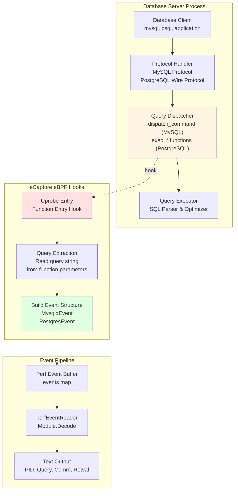
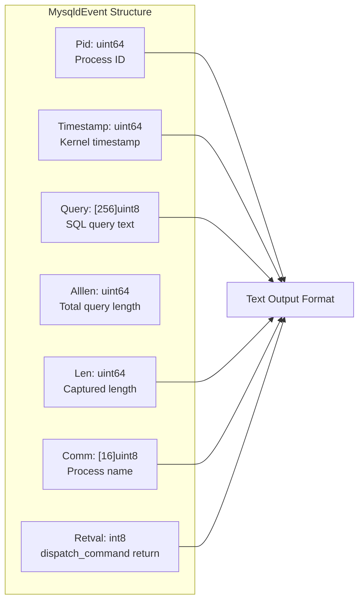
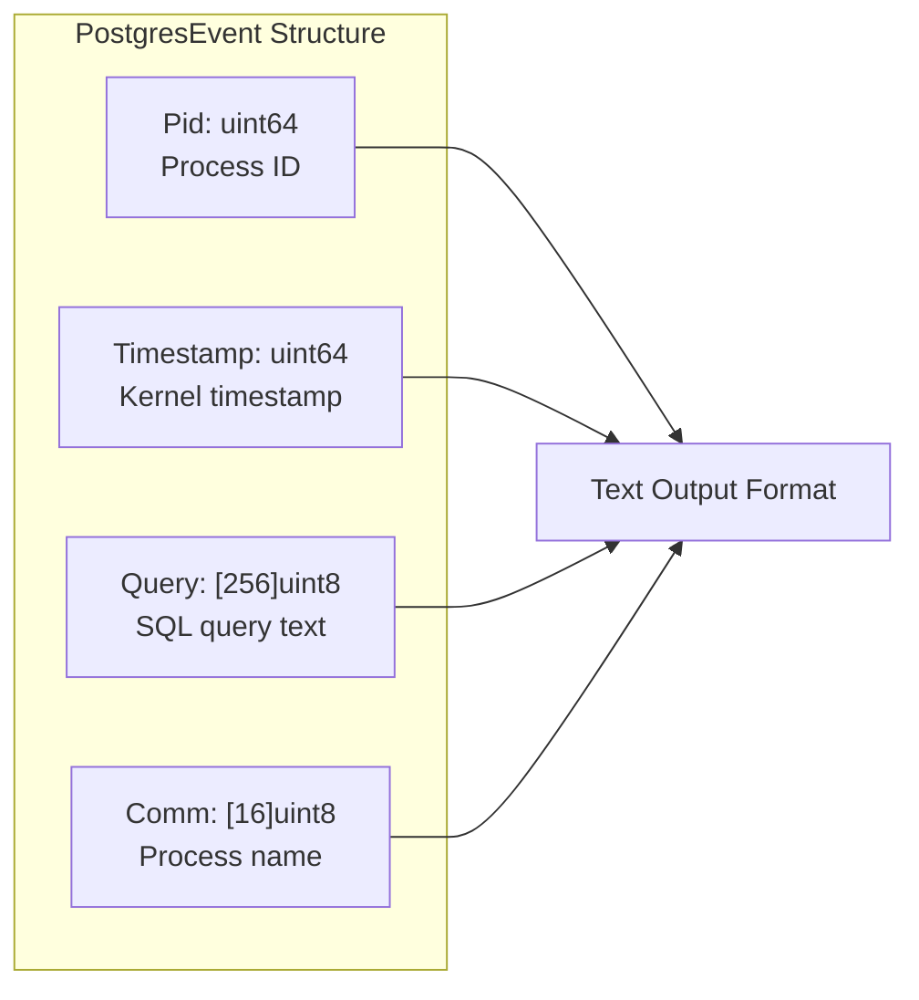
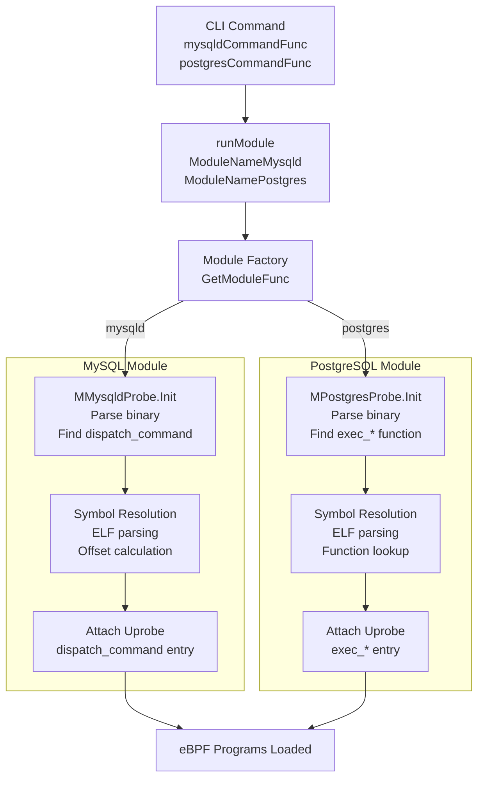
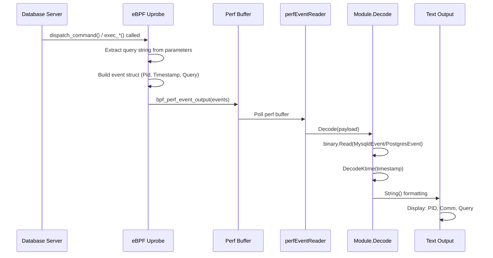

# Database Query Auditing

<details>
<summary>Relevant source files</summary>

The following files were used as context for generating this wiki page:

- [kern/bash_kern.c](https://github.com/gojue/ecapture/blob/0766a93b/kern/bash_kern.c)
- [kern/mysqld_kern.c](https://github.com/gojue/ecapture/blob/0766a93b/kern/mysqld_kern.c)
- [kern/nspr_kern.c](https://github.com/gojue/ecapture/blob/0766a93b/kern/nspr_kern.c)
- [kern/postgres_kern.c](https://github.com/gojue/ecapture/blob/0766a93b/kern/postgres_kern.c)
- [pkg/event_processor/base_event.go](https://github.com/gojue/ecapture/blob/0766a93b/pkg/event_processor/base_event.go)
- [user/event/event_bash.go](https://github.com/gojue/ecapture/blob/0766a93b/user/event/event_bash.go)
- [user/event/event_gnutls.go](https://github.com/gojue/ecapture/blob/0766a93b/user/event/event_gnutls.go)
- [user/event/event_masterkey.go](https://github.com/gojue/ecapture/blob/0766a93b/user/event/event_masterkey.go)
- [user/event/event_mysqld.go](https://github.com/gojue/ecapture/blob/0766a93b/user/event/event_mysqld.go)
- [user/event/event_nspr.go](https://github.com/gojue/ecapture/blob/0766a93b/user/event/event_nspr.go)
- [user/event/event_openssl.go](https://github.com/gojue/ecapture/blob/0766a93b/user/event/event_openssl.go)
- [user/event/event_openssl_tc.go](https://github.com/gojue/ecapture/blob/0766a93b/user/event/event_openssl_tc.go)
- [user/event/event_postgres.go](https://github.com/gojue/ecapture/blob/0766a93b/user/event/event_postgres.go)

</details>


## Purpose and Scope

This document describes eCapture's database query auditing capabilities, which enable real-time capture of SQL queries executed by MySQL and PostgreSQL database servers without requiring database-level logging configuration or permissions. The system uses eBPF uprobes to intercept query dispatch functions within database server binaries, capturing query text, process information, and execution metadata.

This page covers the MySQL (`mysqld`) and PostgreSQL (`postgres`) capture modules. For shell command auditing (bash/zsh), see [Shell Command Auditing](3.2.1-shell-command-auditing.md). For TLS/SSL traffic capture, see [TLS/SSL Modules](3.1-tlsssl-modules.md).

---

## Architecture Overview

Database query auditing operates differently from TLS modules, as it targets database server processes rather than SSL/TLS libraries. The system attaches uprobes to specific query processing functions within the database binary, capturing SQL query strings as they are dispatched for execution.

### Database Query Capture Architecture



**Key Differences from TLS Capture:**
- **Single Hook Point**: Database modules use one uprobe per database type, not multiple hooks for read/write/handshake
- **No Network Correlation**: Events contain query text but not network 5-tuple information
- **No Master Secrets**: Database audit does not require cryptographic key extraction
- **Direct Text Capture**: SQL queries are captured as plaintext strings from memory

Sources: [user/event/event_mysqld.go:1-169](https://github.com/gojue/ecapture/blob/0766a93b/user/event/event_mysqld.go#L1-L169), [user/event/event_postgres.go:1-119](https://github.com/gojue/ecapture/blob/0766a93b/user/event/event_postgres.go#L1-L119)

---

## MySQL Query Auditing

### Supported Versions

The MySQL module supports:
- **MySQL 5.6, 5.7, 8.0**
- **MariaDB 10.5+**

The module targets the `dispatch_command` function, which is the central query processing entry point in MySQL/MariaDB server binaries.

Sources: [cli/cmd/mysqld.go:32-35](https://github.com/gojue/ecapture/blob/0766a93b/cli/cmd/mysqld.go#L32-L35)

### Hook Function: dispatch_command

The MySQL module attaches a uprobe to the `dispatch_command` function, which processes incoming client commands. This function signature varies slightly across MySQL versions, but generally receives:
- **THD pointer**: MySQL thread descriptor containing session state
- **COM_DATA union**: Command data including query string
- **enum_server_command**: Command type (COM_QUERY for SQL queries)

The eBPF program extracts the query string from the `COM_DATA` parameter and captures it along with process metadata.

### Event Structure



The `MysqldEvent` structure captures:

| Field | Type | Description |
|-------|------|-------------|
| `Pid` | `uint64` | Process ID of mysqld server |
| `Timestamp` | `uint64` | Kernel timestamp (converted to Unix nanoseconds) |
| `Query` | `[256]uint8` | SQL query text (up to 256 bytes) |
| `Alllen` | `uint64` | Total length of original query |
| `Len` | `uint64` | Length of captured query text |
| `Comm` | `[16]uint8` | Process command name |
| `Retval` | `dispatchCommandReturn` | Return value from dispatch_command |

**Return Values:**

The `Retval` field indicates the query execution result:

| Constant | Value | Description |
|----------|-------|-------------|
| `DispatchCommandSuccess` | 0 | Query executed successfully |
| `DispatchCommandCloseConnection` | 1 | Connection closed after query |
| `DispatchCommandWouldblock` | 2 | Query would block (async) |
| `DispatchCommandNotCaptured` | -1 | Query not captured by probe |
| `DispatchCommandV57Failed` | -2 | MySQL 5.7 specific failure |

Sources: [user/event/event_mysqld.go:38-78](https://github.com/gojue/ecapture/blob/0766a93b/user/event/event_mysqld.go#L38-L78), [user/event/event_mysqld.go:40-66](https://github.com/gojue/ecapture/blob/0766a93b/user/event/event_mysqld.go#L40-L66)

### CLI Usage

```bash
# Basic MySQL query capture
ecapture mysqld

# Specify custom mysqld binary path
ecapture mysqld --mysqld /usr/sbin/mysqld

# Capture from MariaDB
ecapture mysqld --mysqld /usr/sbin/mariadbd

# Manual offset specification (advanced)
ecapture mysqld --offset 0x710410

# Custom function name (if dispatch_command is not found)
ecapture mysqld --funcname my_dispatch_command
```

**Configuration Flags:**

| Flag | Short | Default | Description |
|------|-------|---------|-------------|
| `--mysqld` | `-m` | `/usr/sbin/mariadbd` | Path to mysqld binary |
| `--offset` | | `0` | Manual function offset (hex) |
| `--funcname` | `-f` | | Custom function name to hook |

The module automatically locates the `dispatch_command` function symbol in the specified binary. If symbol resolution fails, `--offset` or `--funcname` can be used to manually specify the hook point.

Sources: [cli/cmd/mysqld.go:39-43](https://github.com/gojue/ecapture/blob/0766a93b/cli/cmd/mysqld.go#L39-L43)

### Output Format

MySQL query events are displayed in text format:

```
PID:12345, Comm:mysqld, Time:1640000000000, length:(85/85), return:DISPATCH_COMMAND_SUCCESS, Line:SELECT * FROM users WHERE id = 42
```

The output includes:
- **PID**: Database server process ID
- **Comm**: Process name (mysqld/mariadbd)
- **Time**: Unix timestamp in nanoseconds
- **length**: Captured length / Total query length
- **return**: Dispatch command return status
- **Line**: SQL query text

Sources: [user/event/event_mysqld.go:112-115](https://github.com/gojue/ecapture/blob/0766a93b/user/event/event_mysqld.go#L112-L115)

---

## PostgreSQL Query Auditing

### Supported Versions

The PostgreSQL module supports:
- **PostgreSQL 10+**

The module hooks query execution functions within the PostgreSQL server to capture SQL statements.

Sources: [cli/cmd/postgres.go:32-33](https://github.com/gojue/ecapture/blob/0766a93b/cli/cmd/postgres.go#L32-L33)

### Hook Function

PostgreSQL uses a different internal architecture than MySQL. The exact hook function is configurable via the `--funcname` flag, allowing targeting of different query processing entry points such as:
- `exec_simple_query` - Simple query protocol
- `exec_parse_message` - Extended query protocol (parse phase)
- `exec_bind_message` - Extended query protocol (bind phase)

The specific function choice depends on the PostgreSQL version and desired capture granularity.

### Event Structure



The `PostgresEvent` structure is simpler than MySQL's:

| Field | Type | Description |
|-------|------|-------------|
| `Pid` | `uint64` | Process ID of postgres backend |
| `Timestamp` | `uint64` | Kernel timestamp (converted to Unix nanoseconds) |
| `Query` | `[256]uint8` | SQL query text (up to 256 bytes) |
| `Comm` | `[16]uint8` | Process command name |

**Note:** PostgreSQL events do not capture return values or length information, as the hook point occurs at a different stage of query processing compared to MySQL.

Sources: [user/event/event_postgres.go:30-44](https://github.com/gojue/ecapture/blob/0766a93b/user/event/event_postgres.go#L30-L44)

### CLI Usage

```bash
# Basic PostgreSQL query capture
ecapture postgres

# Specify custom postgres binary path
ecapture postgres --postgres /usr/lib/postgresql/14/bin/postgres

# Specify custom function to hook
ecapture postgres --funcname exec_simple_query
```

**Configuration Flags:**

| Flag | Short | Default | Description |
|------|-------|---------|-------------|
| `--postgres` | `-m` | `/usr/bin/postgres` | Path to postgres binary |
| `--funcname` | `-f` | | Function name to hook (required for some versions) |

The `--funcname` flag is particularly important for PostgreSQL, as the optimal hook function varies by version and use case. Common targets include `exec_simple_query` for basic query capture or `exec_parse_message` for capturing prepared statements.

Sources: [cli/cmd/postgres.go:37-38](https://github.com/gojue/ecapture/blob/0766a93b/cli/cmd/postgres.go#L37-L38)

### Output Format

PostgreSQL query events are displayed in text format:

```
PID: 23456, Comm: postgres, Time: 1640000000000, Query: SELECT version();
```

The output includes:
- **PID**: PostgreSQL backend process ID
- **Comm**: Process name (postgres)
- **Time**: Unix timestamp in nanoseconds
- **Query**: SQL query text

Sources: [user/event/event_postgres.go:67-69](https://github.com/gojue/ecapture/blob/0766a93b/user/event/event_postgres.go#L67-L69)

---

## Data Flow and Event Processing

### Module Initialization and Hook Attachment



**Initialization Steps:**
1. **CLI Parsing**: `mysqldCommandFunc` or `postgresCommandFunc` processes command-line arguments
2. **Module Creation**: `runModule` invokes the module factory with `ModuleNameMysqld` or `ModuleNamePostgres`
3. **Binary Analysis**: Module `Init` function parses the target binary (mysqld/postgres) using ELF parsing
4. **Symbol Resolution**: Locate target function symbol (`dispatch_command` or custom function)
5. **Uprobe Attachment**: Attach eBPF uprobe to function entry point

Sources: [cli/cmd/mysqld.go:46-48](https://github.com/gojue/ecapture/blob/0766a93b/cli/cmd/mysqld.go#L46-L48), [cli/cmd/postgres.go:43-44](https://github.com/gojue/ecapture/blob/0766a93b/cli/cmd/postgres.go#L43-L44)

### Event Capture and Decoding



**Event Flow:**
1. **Function Entry**: Database server calls hooked function (`dispatch_command` or `exec_*`)
2. **Parameter Extraction**: eBPF probe reads function parameters to extract query string pointer
3. **Query Capture**: Probe reads up to 256 bytes from query string address
4. **Event Construction**: Probe builds `MysqldEvent` or `PostgresEvent` structure
5. **Perf Buffer**: Event is written to perf buffer via `bpf_perf_event_output`
6. **Userspace Read**: `perfEventReader` polls perf buffer and retrieves raw event data
7. **Decoding**: `Module.Decode` deserializes binary payload into Go struct
8. **Timestamp Conversion**: `DecodeKtime` converts kernel timestamp to Unix nanoseconds
9. **Display**: `String()` method formats event for console output

Sources: [user/event/event_mysqld.go:80-109](https://github.com/gojue/ecapture/blob/0766a93b/user/event/event_mysqld.go#L80-L109), [user/event/event_postgres.go:46-64](https://github.com/gojue/ecapture/blob/0766a93b/user/event/event_postgres.go#L46-L64)

---

## Event Structure Comparison

| Feature | MySQL (MysqldEvent) | PostgreSQL (PostgresEvent) |
|---------|---------------------|----------------------------|
| **Max Query Length** | 256 bytes | 256 bytes |
| **PID Field** | ✓ (uint64) | ✓ (uint64) |
| **Timestamp** | ✓ (kernel time → Unix nano) | ✓ (kernel time → Unix nano) |
| **Process Name** | ✓ (16 bytes) | ✓ (16 bytes) |
| **Query Text** | ✓ (256 bytes) | ✓ (256 bytes) |
| **Total Length** | ✓ (Alllen field) | ✗ |
| **Captured Length** | ✓ (Len field) | ✗ |
| **Return Value** | ✓ (dispatchCommandReturn) | ✗ |
| **Event Type** | `TypeOutput` | `TypeOutput` |
| **UUID Format** | `{PID}_{Comm}` | `{PID}_{Comm}` |

Both modules:
- Capture up to 256 bytes of query text (defined by `MysqldMaxDataSize` and `PostgresMaxDataSize`)
- Convert kernel timestamps to Unix nanoseconds via `DecodeKtime`
- Use `TypeOutput` event type for direct console display
- Support Protobuf event conversion via `ToProtobufEvent()`

MySQL provides additional metadata (query length tracking, return value) due to richer information available at the `dispatch_command` hook point.

Sources: [user/event/event_mysqld.go:38-78](https://github.com/gojue/ecapture/blob/0766a93b/user/event/event_mysqld.go#L38-L78), [user/event/event_postgres.go:36-44](https://github.com/gojue/ecapture/blob/0766a93b/user/event/event_postgres.go#L36-L44)

---

## Protobuf Integration

Both database modules implement the `ToProtobufEvent()` method for external integration via WebSocket streaming (see [Protobuf and External Integration](../4-output-formats/4.4-protobuf-and-external-integration.md)).

### MySQL Protobuf Event

```go
// ToProtobufEvent converts MysqldEvent to protobuf Event
// Source: user/event/event_mysqld.go:138-151
Event {
    Timestamp: int64(me.Timestamp),
    Uuid:      "{PID}_{Comm}",
    SrcIp:     "127.0.0.1",  // Database events have no network info
    SrcPort:   0,
    DstIp:     "127.0.0.1",
    DstPort:   0,
    Pid:       int64(me.Pid),
    Pname:     Comm string,
    Type:      uint32(me.Retval),  // Dispatch command return value
    Length:    uint32(me.Len),     // Query length
    Payload:   me.Query[:me.Len]   // SQL query bytes
}
```

### PostgreSQL Protobuf Event

```go
// ToProtobufEvent converts PostgresEvent to protobuf Event
// Source: user/event/event_postgres.go:87-101
Event {
    Timestamp: int64(pe.Timestamp),
    Uuid:      "{PID}_{Comm}",
    SrcIp:     "127.0.0.1",  // Database events have no network info
    SrcPort:   0,
    DstIp:     "127.0.0.1",
    DstPort:   0,
    Pid:       int64(pe.Pid),
    Pname:     Comm string,
    Type:      0,             // No return value for PostgreSQL
    Length:    uint32(len(queryStr)),
    Payload:   queryStr bytes  // SQL query bytes
}
```

**Key Differences:**
- MySQL events use `Type` field to encode `dispatchCommandReturn` status
- PostgreSQL events have `Type` fixed at 0
- Both use placeholder IPs (`127.0.0.1`) as database events have no network correlation
- Payload contains raw SQL query bytes

Sources: [user/event/event_mysqld.go:138-151](https://github.com/gojue/ecapture/blob/0766a93b/user/event/event_mysqld.go#L138-L151), [user/event/event_postgres.go:87-101](https://github.com/gojue/ecapture/blob/0766a93b/user/event/event_postgres.go#L87-L101)

---

## Limitations and Considerations

### Query Length Truncation

Both modules capture a maximum of 256 bytes of query text:
- **MySQL**: `MysqldMaxDataSize = 256` ([user/event/event_mysqld.go:38](https://github.com/gojue/ecapture/blob/0766a93b/user/event/event_mysqld.go#L38))
- **PostgreSQL**: `PostgresMaxDataSize = 256` ([user/event/event_postgres.go:36](https://github.com/gojue/ecapture/blob/0766a93b/user/event/event_postgres.go#L36))

For MySQL, the `Alllen` field indicates the total query length, allowing detection of truncation. PostgreSQL events do not track total length.

**Long Query Handling:**
```
# MySQL output shows truncation
PID:12345, Comm:mysqld, length:(256/1024), return:DISPATCH_COMMAND_SUCCESS, Line:SELECT * FROM very_long_table_name WHERE column1 = 'val...

# PostgreSQL output shows only captured portion
PID: 23456, Comm: postgres, Query: SELECT * FROM very_long_table_name WHERE column1 = 'val...
```

### Version-Specific Symbol Requirements

**MySQL/MariaDB:**
- Function name `dispatch_command` is consistent across MySQL 5.6-8.0 and MariaDB 10.5+
- Older MySQL 5.5 versions may use different internal function names
- `--funcname` flag allows override if symbol not found

**PostgreSQL:**
- No default function name is hardcoded
- `--funcname` flag is often required to specify target function
- Common targets: `exec_simple_query`, `exec_parse_message`, `exec_bind_message`
- Function availability varies by PostgreSQL version

### No Network Context

Unlike TLS modules, database audit events do not capture:
- Client IP address and port
- Server IP address and port
- Socket file descriptors
- Network connection state

This is because the hook points occur at the query processing layer, after network protocol handling. Process ID (`Pid`) and command name (`Comm`) are the primary identifiers for correlating queries to database server instances.

### Process vs Connection Tracking

Database events are associated with backend process PIDs, not client connections:
- **MySQL**: Single `mysqld` process with multiple threads (one PID)
- **PostgreSQL**: Separate backend process per connection (different PIDs)

This affects event correlation:
- MySQL events from all connections share the same PID
- PostgreSQL events can be grouped by backend PID to track per-connection activity

Sources: [user/event/event_mysqld.go:158-159](https://github.com/gojue/ecapture/blob/0766a93b/user/event/event_mysqld.go#L158-L159), [user/event/event_postgres.go:108-109](https://github.com/gojue/ecapture/blob/0766a93b/user/event/event_postgres.go#L108-L109)

---

## Use Cases

### Security Auditing

Database query auditing enables:
- **SQL Injection Detection**: Capture suspicious query patterns with unusual syntax
- **Privilege Escalation Monitoring**: Track queries accessing sensitive tables or performing administrative operations
- **Compliance Logging**: Record all database access for audit trails without database-level logging overhead

### Performance Analysis

Query capture supports:
- **Slow Query Identification**: Correlate captured queries with performance metrics (requires external tooling)
- **Query Pattern Analysis**: Understand application database access patterns
- **Connection Tracking** (PostgreSQL): Monitor per-connection query sequences via backend PID

### Development and Debugging

Real-time query capture assists:
- **ORM Debugging**: Observe actual SQL generated by ORMs (Hibernate, SQLAlchemy, etc.)
- **Application Tracing**: Correlate application code execution with database queries via PID
- **Query Optimization**: Capture queries before they reach database logs for immediate analysis

---

## Module Registration and CLI Integration

### Module Name Constants

Database modules are registered with the module system using predefined constants:

```go
// MySQL module registration
// Source: cli/cmd/mysqld.go:48
runModule(module.ModuleNameMysqld, myc)

// PostgreSQL module registration  
// Source: cli/cmd/postgres.go:44
runModule(module.ModuleNamePostgres, pgc)
```

These constants (`ModuleNameMysqld`, `ModuleNamePostgres`) map to module factory functions that instantiate `MMysqldProbe` and `MPostgresProbe` respectively.

### Configuration Structures

**MySQL Configuration:**
- `MysqldConfig` structure ([cli/cmd/mysqld.go:27](https://github.com/gojue/ecapture/blob/0766a93b/cli/cmd/mysqld.go#L27))
- Fields: `Mysqldpath`, `Offset`, `FuncName`
- Created via `config.NewMysqldConfig()`

**PostgreSQL Configuration:**
- `PostgresConfig` structure ([cli/cmd/postgres.go:27](https://github.com/gojue/ecapture/blob/0766a93b/cli/cmd/postgres.go#L27))
- Fields: `PostgresPath`, `FuncName`
- Created via `config.NewPostgresConfig()`

Both inherit common configuration fields from the base config (PID filtering, UID filtering, output logging, hex display, etc.).

Sources: [cli/cmd/mysqld.go:27-49](https://github.com/gojue/ecapture/blob/0766a93b/cli/cmd/mysqld.go#L27-L49), [cli/cmd/postgres.go:27-44](https://github.com/gojue/ecapture/blob/0766a93b/cli/cmd/postgres.go#L27-L44)