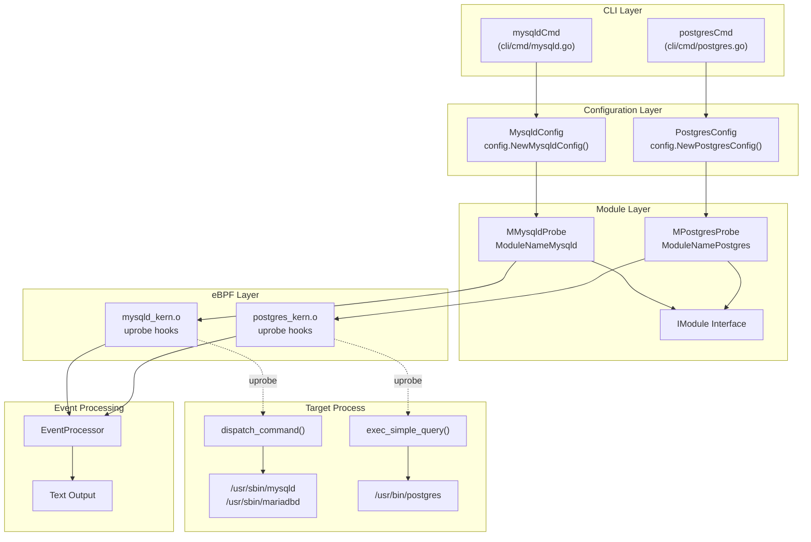
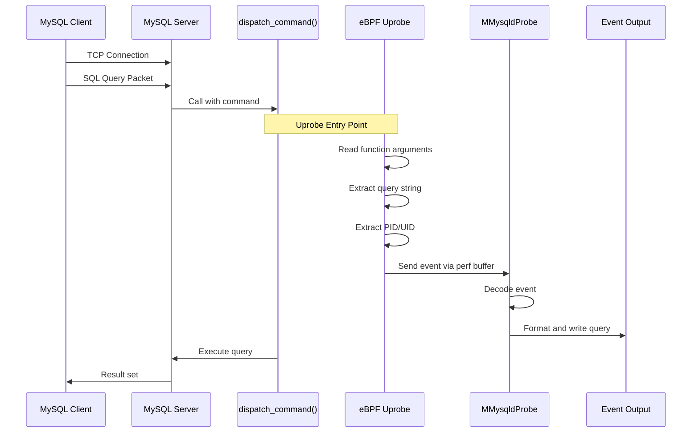
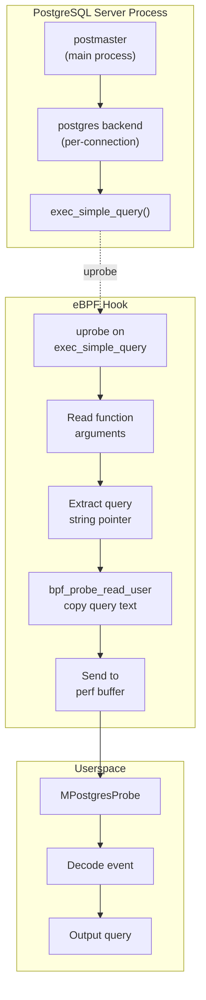
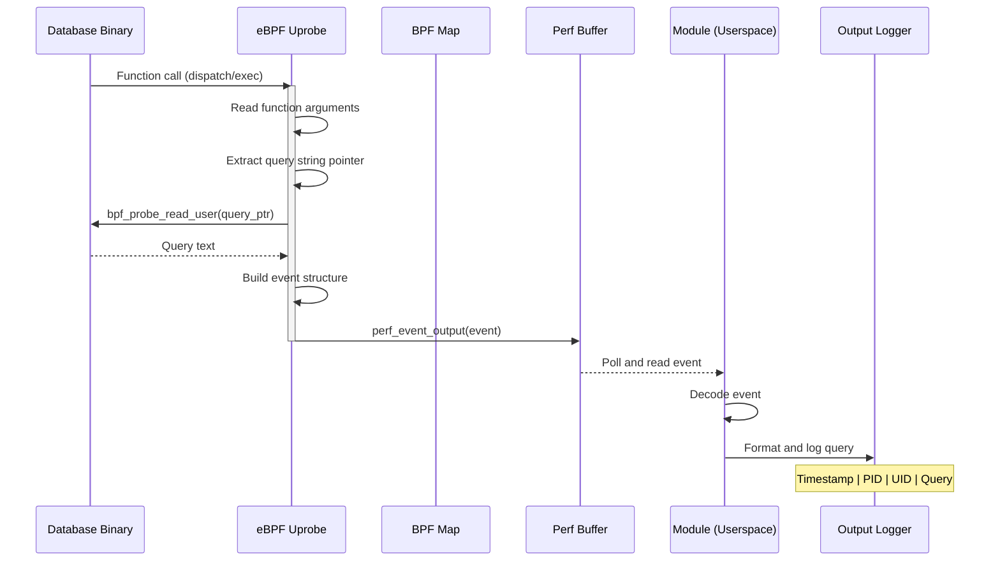

# Database Query Auditing

<details>
<summary>Relevant source files</summary>

The following files were used as context for generating this wiki page:

- [CHANGELOG.md](https://github.com/gojue/ecapture/blob/ca085d05/CHANGELOG.md)
- [README.md](https://github.com/gojue/ecapture/blob/ca085d05/README.md)
- [README_CN.md](https://github.com/gojue/ecapture/blob/ca085d05/README_CN.md)
- [cli/cmd/bash.go](https://github.com/gojue/ecapture/blob/ca085d05/cli/cmd/bash.go)
- [cli/cmd/gnutls.go](https://github.com/gojue/ecapture/blob/ca085d05/cli/cmd/gnutls.go)
- [cli/cmd/gotls.go](https://github.com/gojue/ecapture/blob/ca085d05/cli/cmd/gotls.go)
- [cli/cmd/mysqld.go](https://github.com/gojue/ecapture/blob/ca085d05/cli/cmd/mysqld.go)
- [cli/cmd/nspr.go](https://github.com/gojue/ecapture/blob/ca085d05/cli/cmd/nspr.go)
- [cli/cmd/postgres.go](https://github.com/gojue/ecapture/blob/ca085d05/cli/cmd/postgres.go)
- [cli/cmd/tls.go](https://github.com/gojue/ecapture/blob/ca085d05/cli/cmd/tls.go)
- [cli/cmd/zsh.go](https://github.com/gojue/ecapture/blob/ca085d05/cli/cmd/zsh.go)
- [images/ecapture-help-v0.8.9.svg](https://github.com/gojue/ecapture/blob/ca085d05/images/ecapture-help-v0.8.9.svg)
- [main.go](https://github.com/gojue/ecapture/blob/ca085d05/main.go)
- [pkg/util/ws/client.go](https://github.com/gojue/ecapture/blob/ca085d05/pkg/util/ws/client.go)
- [pkg/util/ws/client_test.go](https://github.com/gojue/ecapture/blob/ca085d05/pkg/util/ws/client_test.go)

</details>


This page documents eCapture's database query auditing capabilities, which capture SQL queries executed by MySQL and PostgreSQL database servers. These modules enable real-time database auditing without requiring application changes or database configuration modifications.

For information about shell command auditing (bash/zsh), see [Shell Command Auditing](3.2.1-shell-command-auditing.md). For general module architecture and lifecycle, see [Module System and Lifecycle](../2-architecture/2.5-module-system-and-lifecycle.md).

---

## Overview

eCapture provides two specialized modules for database query auditing:

| Module | Database | Supported Versions | Primary Hook Function |
|--------|----------|-------------------|----------------------|
| `mysqld` | MySQL/MariaDB | MySQL 5.6/5.7/8.0, MariaDB 10.5+ | `dispatch_command` |
| `postgres` | PostgreSQL | PostgreSQL 10+ | `exec_simple_query` |

Both modules use eBPF uprobe technology to intercept query execution functions at the database server binary level, capturing SQL statements as they are dispatched for execution. Unlike TLS capture modules, database modules do not require network traffic interception or master secret extraction—they capture queries directly from the database process memory.

**Key characteristics:**
- **No database configuration changes required**: No logging configuration, no triggers, no plugin installation
- **Zero application impact**: Captures at database server level, not application level
- **Raw query capture**: Captures the exact SQL text as received by the database
- **Process-based filtering**: Can target specific database instances by PID or UID

---

## Module Architecture

The following diagram shows how database audit modules fit into the eCapture architecture:


```mermaid
graph TB
    subgraph "CLI Layer"
        MYSQLD_CMD["mysqldCmd<br/>(cli/cmd/mysqld.go)"]
        POSTGRES_CMD["postgresCmd<br/>(cli/cmd/postgres.go)"]
    end
    
    subgraph "Configuration Layer"
        MYSQLD_CFG["MysqldConfig<br/>config.NewMysqldConfig()"]
        POSTGRES_CFG["PostgresConfig<br/>config.NewPostgresConfig()"]
    end
    
    subgraph "Module Layer"
        MYSQLD_MOD["MMysqldProbe<br/>ModuleNameMysqld"]
        POSTGRES_MOD["MPostgresProbe<br/>ModuleNamePostgres"]
        IMODULE["IModule Interface"]
    end
    
    subgraph "eBPF Layer"
        MYSQLD_BPF["mysqld_kern.o<br/>uprobe hooks"]
        POSTGRES_BPF["postgres_kern.o<br/>uprobe hooks"]
    end
    
    subgraph "Target Process"
        MYSQLD_BIN["/usr/sbin/mysqld<br/>/usr/sbin/mariadbd"]
        POSTGRES_BIN["/usr/bin/postgres"]
        DISPATCH["dispatch_command()"]
        EXEC_QUERY["exec_simple_query()"]
    end
    
    subgraph "Event Processing"
        EVENT_PROC["EventProcessor"]
        OUTPUT["Text Output"]
    end
    
    MYSQLD_CMD --> MYSQLD_CFG
    POSTGRES_CMD --> POSTGRES_CFG
    
    MYSQLD_CFG --> MYSQLD_MOD
    POSTGRES_CFG --> POSTGRES_MOD
    
    MYSQLD_MOD --> IMODULE
    POSTGRES_MOD --> IMODULE
    
    MYSQLD_MOD --> MYSQLD_BPF
    POSTGRES_MOD --> POSTGRES_BPF
    
    MYSQLD_BPF -.uprobe.-> DISPATCH
    POSTGRES_BPF -.uprobe.-> EXEC_QUERY
    
    DISPATCH --> MYSQLD_BIN
    EXEC_QUERY --> POSTGRES_BIN
    
    MYSQLD_BPF --> EVENT_PROC
    POSTGRES_BPF --> EVENT_PROC
    
    EVENT_PROC --> OUTPUT
```

**Sources:** [cli/cmd/mysqld.go:1-50](https://github.com/gojue/ecapture/blob/ca085d05/cli/cmd/mysqld.go#L1-L50), [cli/cmd/postgres.go:1-46](https://github.com/gojue/ecapture/blob/ca085d05/cli/cmd/postgres.go#L1-L46)

---

## MySQL/MariaDB Module

### Supported Versions

The `mysqld` module supports the following database versions:

- **MySQL**: 5.6, 5.7, 8.0
- **MariaDB**: 10.5 and newer

The module targets the `dispatch_command` function, which is the entry point for all SQL commands in the MySQL server architecture.

**Sources:** [cli/cmd/mysqld.go:33-36](https://github.com/gojue/ecapture/blob/ca085d05/cli/cmd/mysqld.go#L33-L36), [README.md:157-158](https://github.com/gojue/ecapture/blob/ca085d05/README.md#L157-L158)

### Command Line Interface

```bash
# Basic usage - auto-detect mysqld binary
ecapture mysqld

# Specify custom mysqld path
ecapture mysqld --mysqld=/usr/sbin/mysqld

# Hook specific function by name
ecapture mysqld --funcname=dispatch_command

# Hook by offset (for stripped binaries)
ecapture mysqld --offset=0x710410

# Filter by PID
ecapture mysqld --pid=12345

# Save output to file
ecapture mysqld -l mysql_queries.log
```

**Configuration flags:**

| Flag | Short | Default | Description |
|------|-------|---------|-------------|
| `--mysqld` | `-m` | `/usr/sbin/mariadbd` | Path to mysqld/mariadbd binary |
| `--offset` | | `0` | Offset address for uprobe hook |
| `--funcname` | `-f` | _(auto)_ | Function name to hook |

**Sources:** [cli/cmd/mysqld.go:40-43](https://github.com/gojue/ecapture/blob/ca085d05/cli/cmd/mysqld.go#L40-L43)

### Hook Architecture

The MySQL module hooks the `dispatch_command` function, which is called for every SQL command received by the server:


```mermaid
sequenceDiagram
    participant Client as MySQL Client
    participant Server as MySQL Server
    participant Dispatch as dispatch_command()
    participant eBPF as eBPF Uprobe
    participant Module as MMysqldProbe
    participant Output as Event Output
    
    Client->>Server: TCP Connection
    Client->>Server: SQL Query Packet
    Server->>Dispatch: Call with command
    
    Note over Dispatch,eBPF: Uprobe Entry Point
    eBPF->>eBPF: Read function arguments
    eBPF->>eBPF: Extract query string
    eBPF->>eBPF: Extract PID/UID
    eBPF->>Module: Send event via perf buffer
    
    Module->>Module: Decode event
    Module->>Output: Format and write query
    
    Dispatch->>Server: Execute query
    Server->>Client: Result set
```

**Function signature (conceptual):**
```c
// MySQL internal function (varies by version)
bool dispatch_command(THD *thd, const COM_DATA *com_data, enum enum_server_command command)
```

The eBPF program reads:
- `THD` pointer: Thread handle containing connection context
- `command`: Command type (COM_QUERY for SQL queries)
- Query string: Extracted from command data structure

**Sources:** [cli/cmd/mysqld.go:36-37](https://github.com/gojue/ecapture/blob/ca085d05/cli/cmd/mysqld.go#L36-L37)

### Version-Specific Considerations

Different MySQL versions may have different internal structure layouts. The module handles this through:

1. **Function name detection**: Auto-detects `dispatch_command` symbol
2. **Offset calculation**: Can use `--offset` for stripped binaries
3. **Structure adaptation**: eBPF code may need version-specific offsets

**Common MariaDB paths:**
- `/usr/sbin/mariadbd` (MariaDB 10.5+)
- `/usr/sbin/mysqld` (MySQL 5.6/5.7/8.0)

**Sources:** [cli/cmd/mysqld.go:40](https://github.com/gojue/ecapture/blob/ca085d05/cli/cmd/mysqld.go#L40)

---

## PostgreSQL Module

### Supported Versions

The `postgres` module supports PostgreSQL version 10 and newer. The module targets the `exec_simple_query` function, which handles simple query protocol execution.

**Sources:** [cli/cmd/postgres.go:32](https://github.com/gojue/ecapture/blob/ca085d05/cli/cmd/postgres.go#L32), [README.md:159](https://github.com/gojue/ecapture/blob/ca085d05/README.md#L159)

### Command Line Interface

```bash
# Basic usage - auto-detect postgres binary
ecapture postgres

# Specify custom postgres path
ecapture postgres --postgres=/usr/lib/postgresql/14/bin/postgres

# Hook specific function
ecapture postgres --funcname=exec_simple_query

# Filter by PID
ecapture postgres --pid=54321

# Save output to file
ecapture postgres -l postgres_queries.log
```

**Configuration flags:**

| Flag | Short | Default | Description |
|------|-------|---------|-------------|
| `--postgres` | `-m` | `/usr/bin/postgres` | Path to postgres binary |
| `--funcname` | `-f` | _(auto)_ | Function name to hook |

**Sources:** [cli/cmd/postgres.go:37-38](https://github.com/gojue/ecapture/blob/ca085d05/cli/cmd/postgres.go#L37-L38)

### Hook Architecture

The PostgreSQL module hooks the `exec_simple_query` function, which is the entry point for simple query protocol:


```mermaid
graph TB
    subgraph "PostgreSQL Server Process"
        POSTMASTER["postmaster<br/>(main process)"]
        BACKEND["postgres backend<br/>(per-connection)"]
        EXEC["exec_simple_query()"]
    end
    
    subgraph "eBPF Hook"
        UPROBE["uprobe on<br/>exec_simple_query"]
        READ_ARGS["Read function<br/>arguments"]
        EXTRACT["Extract query<br/>string pointer"]
        PROBE_READ["bpf_probe_read_user<br/>copy query text"]
        SEND_EVENT["Send to<br/>perf buffer"]
    end
    
    subgraph "Userspace"
        MODULE["MPostgresProbe"]
        DECODE["Decode event"]
        OUTPUT["Output query"]
    end
    
    POSTMASTER --> BACKEND
    BACKEND --> EXEC
    EXEC -.uprobe.-> UPROBE
    UPROBE --> READ_ARGS
    READ_ARGS --> EXTRACT
    EXTRACT --> PROBE_READ
    PROBE_READ --> SEND_EVENT
    SEND_EVENT --> MODULE
    MODULE --> DECODE
    DECODE --> OUTPUT
```

**Function signature (PostgreSQL internal):**
```c
// PostgreSQL source: src/backend/tcop/postgres.c
void exec_simple_query(const char *query_string)
```

The eBPF program captures:
- `query_string`: Pointer to SQL query text
- Connection metadata: PID, UID, timestamp
- Query length: For bounded memory copy

**Sources:** [cli/cmd/postgres.go:32-34](https://github.com/gojue/ecapture/blob/ca085d05/cli/cmd/postgres.go#L32-L34)

### PostgreSQL Protocol Context

PostgreSQL uses multiple query execution paths:

1. **Simple Query Protocol**: Single SQL statement, captured by `exec_simple_query`
2. **Extended Query Protocol**: Prepared statements (Parse/Bind/Execute)
3. **Fast-path Interface**: Function call interface

The current module implementation focuses on Simple Query Protocol, which handles:
- SQL statements from `psql` command-line client
- Direct SQL execution from many client libraries
- Administrative commands

**Sources:** [cli/cmd/postgres.go:30-34](https://github.com/gojue/ecapture/blob/ca085d05/cli/cmd/postgres.go#L30-L34)

---

## Query Capture Mechanism

Both modules follow a similar eBPF-based capture pattern:


```mermaid
sequenceDiagram
    participant DB as Database Binary
    participant Uprobe as eBPF Uprobe
    participant Map as BPF Map
    participant Perf as Perf Buffer
    participant Module as Module (Userspace)
    participant Logger as Output Logger
    
    DB->>Uprobe: Function call (dispatch/exec)
    
    activate Uprobe
    Uprobe->>Uprobe: Read function arguments
    Uprobe->>Uprobe: Extract query string pointer
    Uprobe->>DB: bpf_probe_read_user(query_ptr)
    DB-->>Uprobe: Query text
    Uprobe->>Uprobe: Build event structure
    Uprobe->>Perf: perf_event_output(event)
    deactivate Uprobe
    
    Perf-->>Module: Poll and read event
    Module->>Module: Decode event
    Module->>Logger: Format and log query
    
    Note over Logger: Timestamp | PID | UID | Query
```

### Event Structure

Both modules emit events with similar structure:

| Field | Type | Description |
|-------|------|-------------|
| `timestamp` | uint64 | Event timestamp (nanoseconds) |
| `pid` | uint32 | Process ID of database server |
| `tid` | uint32 | Thread ID |
| `uid` | uint32 | User ID of process |
| `query_len` | uint32 | Length of query string |
| `query` | char[] | SQL query text |

### Memory Safety

The eBPF programs implement several safety measures:

1. **Bounded reads**: Query length limited to avoid kernel stack overflow
2. **User memory access**: Uses `bpf_probe_read_user()` for safe access
3. **Null termination**: Ensures query strings are properly terminated
4. **Verification**: eBPF verifier ensures memory safety before loading

---

## Common Features

### Process Filtering

Both modules support standard eCapture filtering options:

```bash
# Filter by specific PID
ecapture mysqld --pid=1234

# Filter by specific UID
ecapture mysqld --uid=1000

# Filter by process name (if supported)
ecapture mysqld --pname=mysqld
```

### Output Modes

Database audit modules output captured queries in text format:

```
2024-09-15T10:30:45Z INF Query captured pid=12345 uid=999
SELECT * FROM users WHERE id = 123;

2024-09-15T10:30:46Z INF Query captured pid=12345 uid=999
UPDATE accounts SET balance = balance - 100 WHERE account_id = 456;
```

Output can be directed to:
- **Console**: Real-time monitoring (default)
- **File**: Using `-l` or `--logaddr` flags
- **Remote logging**: Using `--logaddr` for centralized collection

**Sources:** [cli/cmd/mysqld.go:36-37](https://github.com/gojue/ecapture/blob/ca085d05/cli/cmd/mysqld.go#L36-L37), [cli/cmd/postgres.go:32-34](https://github.com/gojue/ecapture/blob/ca085d05/cli/cmd/postgres.go#L32-L34)

### Integration with Module System

Both database modules implement the `IModule` interface and follow the standard lifecycle:

1. **Init**: Detect database binary, resolve function addresses
2. **Start**: Load eBPF bytecode, attach uprobes
3. **Run**: Continuously read events from perf buffer
4. **Close**: Detach uprobes, cleanup resources

See [Module System and Lifecycle](../2-architecture/2.5-module-system-and-lifecycle.md) for details on the `IModule` interface.

---

## Limitations and Considerations

### MySQL/MariaDB Limitations

1. **Binary format**: Requires function symbols (works with stripped binaries using `--offset`)
2. **Prepared statements**: May not capture parameterized queries in all cases
3. **Binary protocol**: Currently focuses on text protocol queries
4. **Version specifics**: Internal structures vary across versions

### PostgreSQL Limitations

1. **Simple Query Protocol only**: Extended query protocol (prepared statements) not captured
2. **Replication queries**: Logical replication queries may not be captured
3. **Background tasks**: Autovacuum and other background queries may be missed
4. **Multi-statement queries**: Each statement in batch may appear separately

### General Limitations

1. **Performance impact**: Minimal but measurable overhead on high-traffic databases
2. **Query truncation**: Very long queries may be truncated based on buffer size
3. **Binary data**: BLOB/binary data in queries may not display correctly
4. **Encoding**: Assumes UTF-8 or ASCII query encoding

### Security Considerations

- **Sensitive data exposure**: Captured queries may contain passwords, PII
- **Root privileges required**: eBPF requires CAP_BPF or root
- **Audit logs**: Should be protected with appropriate file permissions
- **Compliance**: Ensure query logging complies with data protection regulations

---

## Comparison with Traditional Audit Methods

| Feature | eCapture eBPF | Database Logging | Application Logging |
|---------|---------------|------------------|---------------------|
| Configuration | None | Requires configuration | Requires code changes |
| Performance Impact | Minimal | Moderate | Varies |
| Query Coverage | All queries | Configurable | Depends on implementation |
| Setup Time | Immediate | Restart required | Deployment required |
| Sensitive Data | Captures everything | Configurable | Application-controlled |
| Overhead Location | Kernel | Database | Application |

**Sources:** [cli/cmd/mysqld.go:1-50](https://github.com/gojue/ecapture/blob/ca085d05/cli/cmd/mysqld.go#L1-L50), [cli/cmd/postgres.go:1-46](https://github.com/gojue/ecapture/blob/ca085d05/cli/cmd/postgres.go#L1-L46), [README.md:157-159](https://github.com/gojue/ecapture/blob/ca085d05/README.md#L157-L159)

---

## Usage Examples

### MySQL Example

```bash
# Start MySQL query capture
sudo ecapture mysqld --mysqld=/usr/sbin/mysqld -l /var/log/mysql_audit.log

# Output example:
# 2024-09-15T10:30:45Z INF Query captured pid=12345 uid=999
# SELECT user, host FROM mysql.user;
#
# 2024-09-15T10:30:46Z INF Query captured pid=12345 uid=999  
# CREATE DATABASE testdb;
```

### PostgreSQL Example

```bash
# Start PostgreSQL query capture
sudo ecapture postgres --postgres=/usr/lib/postgresql/14/bin/postgres -l /var/log/postgres_audit.log

# Output example:
# 2024-09-15T11:15:22Z INF Query captured pid=54321 uid=109
# SELECT * FROM pg_stat_activity;
#
# 2024-09-15T11:15:23Z INF Query captured pid=54321 uid=109
# EXPLAIN ANALYZE SELECT * FROM large_table WHERE id > 1000;
```

### Combined with Process Filtering

```bash
# Audit only specific database instance
sudo ecapture mysqld --pid=$(pgrep -f "mysqld.*port=3307")

# Audit only queries from specific user
sudo ecapture postgres --uid=1000
```

**Sources:** [cli/cmd/mysqld.go:1-50](https://github.com/gojue/ecapture/blob/ca085d05/cli/cmd/mysqld.go#L1-L50), [cli/cmd/postgres.go:1-46](https://github.com/gojue/ecapture/blob/ca085d05/cli/cmd/postgres.go#L1-L46)