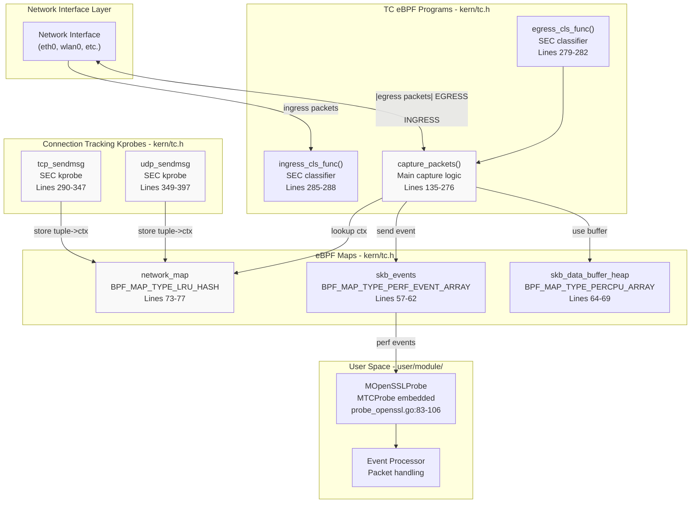
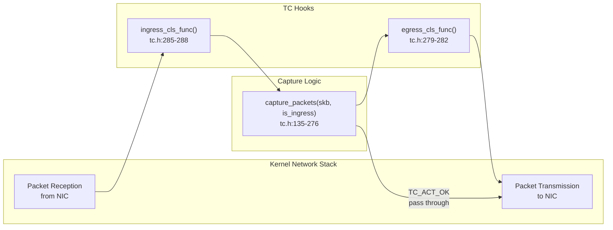
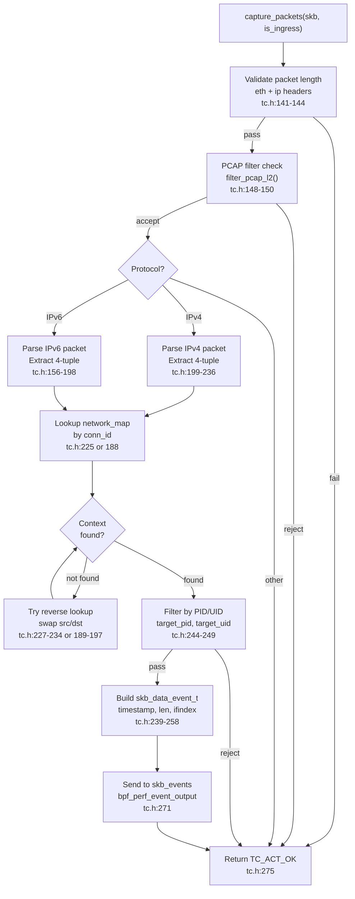
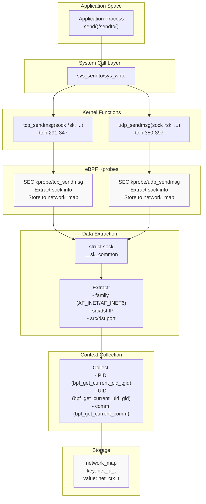
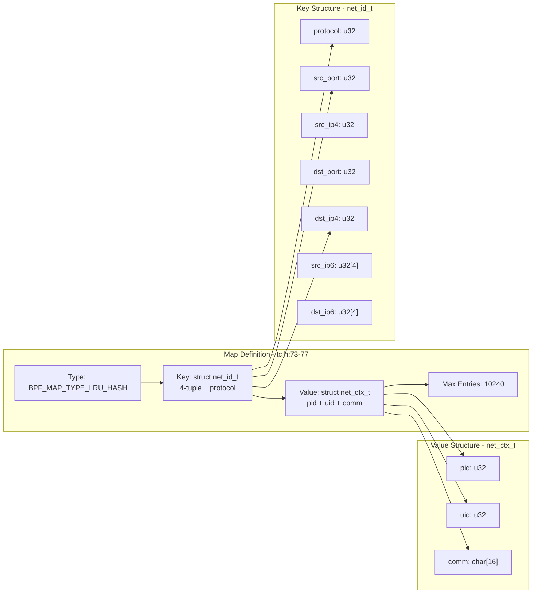
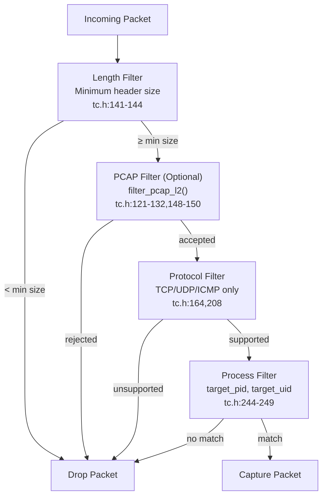
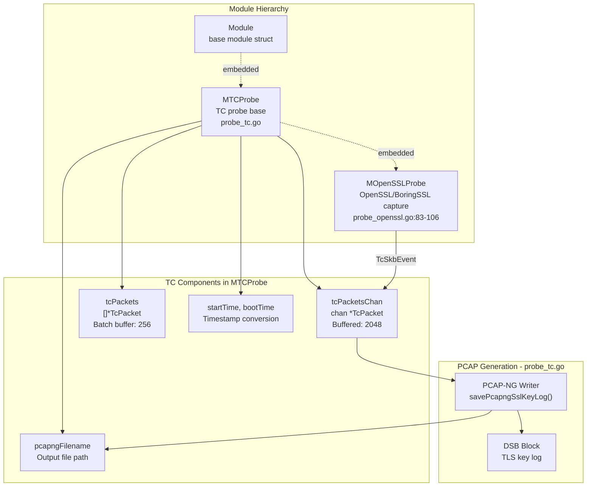
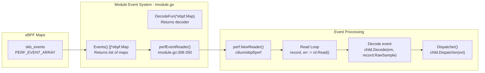

# Network Packet Capture with TC

<details>
<summary>Relevant source files</summary>

The following files were used as context for generating this wiki page:

- [cli/cmd/root.go](https://github.com/gojue/ecapture/blob/0766a93b/cli/cmd/root.go)
- [kern/common.h](https://github.com/gojue/ecapture/blob/0766a93b/kern/common.h)
- [kern/ecapture.h](https://github.com/gojue/ecapture/blob/0766a93b/kern/ecapture.h)
- [kern/tc.h](https://github.com/gojue/ecapture/blob/0766a93b/kern/tc.h)
- [user/config/iconfig.go](https://github.com/gojue/ecapture/blob/0766a93b/user/config/iconfig.go)
- [user/module/imodule.go](https://github.com/gojue/ecapture/blob/0766a93b/user/module/imodule.go)
- [user/module/probe_openssl.go](https://github.com/gojue/ecapture/blob/0766a93b/user/module/probe_openssl.go)

</details>


## Purpose and Scope

This document explains eCapture's Traffic Control (TC) based network packet capture subsystem. TC eBPF programs attach to network interfaces to intercept packets at the kernel level, enabling the capture of encrypted network traffic alongside plaintext data extracted from TLS libraries. The TC subsystem provides process attribution by mapping network connections to processes using kprobe-based connection tracking.

For information about TLS/SSL plaintext capture, see [TLS/SSL Modules](3.1-tlsssl-modules.md). For PCAP file generation and output formats, see [PCAP Integration](../4-output-formats/4.2-pcap-integration.md).

## Architecture Overview

The TC packet capture system consists of three main components:

1. **TC Classifier Programs**: eBPF programs attached to network interfaces that intercept packets at ingress and egress points
2. **Connection Tracking Kprobes**: eBPF kprobes on `tcp_sendmsg` and `udp_sendmsg` that map network connections to processes
3. **Network Mapping System**: An LRU hash map that maintains the association between network 4-tuples and process metadata



**Sources**: [kern/tc.h:1-398](https://github.com/gojue/ecapture/blob/0766a93b/kern/tc.h#L1-L398), [user/module/probe_openssl.go:83-106](https://github.com/gojue/ecapture/blob/0766a93b/user/module/probe_openssl.go#L83-L106)

## TC Classifier Programs

TC classifiers are eBPF programs that attach to network devices and process every packet passing through them. eCapture deploys two classifier programs: one for ingress traffic and one for egress traffic.

### Attachment Points



Both classifier functions delegate to the same `capture_packets()` function with a direction flag:

- **ingress_cls_func**: Processes incoming packets [kern/tc.h:285-288](https://github.com/gojue/ecapture/blob/0766a93b/kern/tc.h#L285-L288)
- **egress_cls_func**: Processes outgoing packets [kern/tc.h:279-282](https://github.com/gojue/ecapture/blob/0766a93b/kern/tc.h#L279-L282)

The classifiers return `TC_ACT_OK` to allow packets to continue through the network stack without modification [kern/common.h:58](https://github.com/gojue/ecapture/blob/0766a93b/kern/common.h#L58).

**Sources**: [kern/tc.h:135-288](https://github.com/gojue/ecapture/blob/0766a93b/kern/tc.h#L135-L288), [kern/common.h:58](https://github.com/gojue/ecapture/blob/0766a93b/kern/common.h#L58)

## Packet Capture Logic

The `capture_packets()` function implements the core packet capture logic. It operates on socket buffer structures (`struct __sk_buff`) provided by the kernel.

### Processing Pipeline



**Sources**: [kern/tc.h:135-276](https://github.com/gojue/ecapture/blob/0766a93b/kern/tc.h#L135-L276)

### Protocol Support

The TC capture supports multiple protocols with both IPv4 and IPv6:

| Protocol | Constant | Filter Location |
|----------|----------|-----------------|
| TCP | `IPPROTO_TCP` | [kern/tc.h:208,320,332]() |
| UDP | `IPPROTO_UDP` | [kern/tc.h:208,370,382]() |
| ICMP | `IPPROTO_ICMP` | [kern/tc.h:208](https://github.com/gojue/ecapture/blob/0766a93b/kern/tc.h#L208) |
| ICMPv6 | `IPPROTO_ICMPV6` | [kern/tc.h:164](https://github.com/gojue/ecapture/blob/0766a93b/kern/tc.h#L164) |

The capture extracts the following network tuple information:

```c
struct net_id_t {
    u32 protocol;      // IPPROTO_TCP or IPPROTO_UDP
    u32 src_port;      // Source port
    u32 src_ip4;       // Source IPv4 address
    u32 dst_port;      // Destination port
    u32 dst_ip4;       // Destination IPv4 address
    u32 src_ip6[4];    // Source IPv6 address
    u32 dst_ip6[4];    // Destination IPv6 address
};
```

**Sources**: [kern/tc.h:39-47,156-236]()

## Connection Tracking with Kprobes

To attribute captured packets to specific processes, eCapture uses kprobes on kernel functions that establish network connections. These kprobes capture the process context before packets are transmitted.

### Kprobe Attachment Points



**Sources**: [kern/tc.h:290-397](https://github.com/gojue/ecapture/blob/0766a93b/kern/tc.h#L290-L397)

### Process Context Extraction

Both kprobes extract the same information and store it in the `network_map`:

```c
struct net_ctx_t {
    u32 pid;              // Process ID
    u32 uid;              // User ID
    char comm[16];        // Command name (TASK_COMM_LEN)
};
```

The kprobes perform the following steps:

1. **Get Process Context** [kern/tc.h:292-294,351-353]()
   - `bpf_get_current_pid_tgid() >> 32` - Extract PID
   - `bpf_get_current_uid_gid()` - Extract UID
   - `bpf_get_current_comm()` - Get process name

2. **Extract Socket Information** [kern/tc.h:304-337,354-387]()
   - Read `sock->__sk_common.skc_family` - Address family
   - Read `sock->__sk_common.skc_num` - Local port
   - Read `sock->__sk_common.skc_dport` - Remote port
   - Read source/destination IP addresses

3. **Store Mapping** [kern/tc.h:345,395]()
   - Create `net_id_t` key from network tuple
   - Create `net_ctx_t` value from process context
   - `bpf_map_update_elem(&network_map, &conn_id, &net_ctx, BPF_ANY)`

**Sources**: [kern/tc.h:290-397](https://github.com/gojue/ecapture/blob/0766a93b/kern/tc.h#L290-L397)

## Network Mapping System

The `network_map` is the central data structure that associates network connections with process information. It uses an LRU (Least Recently Used) eviction policy to maintain a bounded cache of active connections.

### Map Configuration



**Sources**: [kern/tc.h:39-77](https://github.com/gojue/ecapture/blob/0766a93b/kern/tc.h#L39-L77)

### Bidirectional Lookup

Since packets can arrive in either direction (client→server or server→client), the `capture_packets()` function implements bidirectional lookup:

1. **Initial Lookup**: Try to find the connection using the packet's source as the connection source [kern/tc.h:225,188]()
2. **Reverse Lookup**: If not found, swap source and destination and try again [kern/tc.h:227-234,189-197]()

This ensures that both incoming and outgoing packets are correctly attributed to the originating process.

**Sources**: [kern/tc.h:188-234](https://github.com/gojue/ecapture/blob/0766a93b/kern/tc.h#L188-L234)

## Packet Filtering

eCapture supports multiple levels of filtering to reduce overhead and capture only relevant traffic.

### Filter Hierarchy



### PCAP Filter Integration

The `filter_pcap_l2()` function [kern/tc.h:121-132](https://github.com/gojue/ecapture/blob/0766a93b/kern/tc.h#L121-L132) serves as an injection point for BPF bytecode generated from PCAP filter expressions. The function is marked `__noinline` to prevent compiler optimization, allowing userspace to patch its instructions.

The filter patching is initiated in userspace [user/module/probe_openssl.go:303-307](https://github.com/gojue/ecapture/blob/0766a93b/user/module/probe_openssl.go#L303-L307):

```go
if m.eBPFProgramType == TlsCaptureModelTypePcap && pcapFilter != "" {
    ebpfFuncs := []string{tcFuncNameIngress, tcFuncNameEgress}
    m.bpfManager.InstructionPatchers = prepareInsnPatchers(m.bpfManager,
        ebpfFuncs, pcapFilter)
}
```

**Sources**: [kern/tc.h:121-150](https://github.com/gojue/ecapture/blob/0766a93b/kern/tc.h#L121-L150), [user/module/probe_openssl.go:303-307](https://github.com/gojue/ecapture/blob/0766a93b/user/module/probe_openssl.go#L303-L307)

### Process Filtering

When `target_pid` or `target_uid` are set (kernel ≥ 5.2), packets are filtered to match specific processes [kern/tc.h:244-249](https://github.com/gojue/ecapture/blob/0766a93b/kern/tc.h#L244-L249):

```c
if (target_pid != 0 && target_pid != net_ctx->pid) {
    return TC_ACT_OK;
}
if (target_uid != 0 && target_uid != net_ctx->uid) {
    return TC_ACT_OK;
}
```

This filtering happens after successful connection lookup, ensuring that only packets belonging to the target process are captured.

**Note**: The kprobes themselves do NOT filter by PID/UID [kern/tc.h:296-302](https://github.com/gojue/ecapture/blob/0766a93b/kern/tc.h#L296-L302) because the `network_map` must contain all connections for the TC classifiers to perform attribution. Process filtering only occurs during packet capture.

**Sources**: [kern/tc.h:244-249,296-302](), [kern/common.h:64-71](https://github.com/gojue/ecapture/blob/0766a93b/kern/common.h#L64-L71)

## Data Structures

### Event Structure

Captured packet metadata is transmitted to userspace using the `skb_data_event_t` structure:

```c
struct skb_data_event_t {
    uint64_t ts;                // Timestamp (bpf_ktime_get_ns)
    u32 pid;                    // Process ID
    char comm[TASK_COMM_LEN];   // Process name
    u32 len;                    // Packet length (skb->len)
    u32 ifindex;                // Network interface index
};
```

The event contains minimal metadata (36 bytes) [kern/tc.h:20](https://github.com/gojue/ecapture/blob/0766a93b/kern/tc.h#L20) with the packet payload appended via the `bpf_perf_event_output()` flags parameter [kern/tc.h:260-271](https://github.com/gojue/ecapture/blob/0766a93b/kern/tc.h#L260-L271):

```c
u64 flags = BPF_F_CURRENT_CPU;
flags |= (u64)skb->len << 32;  // Encode packet length in upper 32 bits
bpf_perf_event_output(skb, &skb_events, flags, &event, TC_PACKET_MIN_SIZE);
```

**Sources**: [kern/tc.h:30-37,239-271]()

### Buffer Management

To avoid stack overflow with large structures, eCapture uses a per-CPU array map for temporary event storage:

```c
struct {
    __uint(type, BPF_MAP_TYPE_PERCPU_ARRAY);
    __type(key, u32);
    __type(value, struct skb_data_event_t);
    __uint(max_entries, 1);
} skb_data_buffer_heap SEC(".maps");
```

The `make_skb_data_event()` function [kern/tc.h:92-100](https://github.com/gojue/ecapture/blob/0766a93b/kern/tc.h#L92-L100) retrieves a buffer from this map, which is automatically managed per-CPU by the kernel.

**Sources**: [kern/tc.h:64-100](https://github.com/gojue/ecapture/blob/0766a93b/kern/tc.h#L64-L100)

## Integration with Capture Modules

The TC packet capture integrates primarily with TLS capture modules to provide complete network traffic visibility.

### MTCProbe Base Structure

The TC functionality is encapsulated in the `MTCProbe` struct, which is embedded by capture modules that need network packet capture [user/module/probe_openssl.go:84](https://github.com/gojue/ecapture/blob/0766a93b/user/module/probe_openssl.go#L84):



**Sources**: [user/module/probe_openssl.go:83-106](https://github.com/gojue/ecapture/blob/0766a93b/user/module/probe_openssl.go#L83-L106), [user/module/probe_tc.go](https://github.com/gojue/ecapture/blob/0766a93b/user/module/probe_tc.go)

### Event Flow

When the OpenSSL module operates in PCAP mode, it receives both TC packet events and TLS master secret events:

1. **Initialization** [user/module/probe_openssl.go:137-148](https://github.com/gojue/ecapture/blob/0766a93b/user/module/probe_openssl.go#L137-L148):
   - Set `eBPFProgramType = TlsCaptureModelTypePcap`
   - Create `tcPacketsChan` buffered channel (2048 entries)
   - Initialize `tcPackets` batch buffer (256 entries)
   - Store PCAP output filename

2. **Event Dispatch** [user/module/probe_openssl.go:733-753](https://github.com/gojue/ecapture/blob/0766a93b/user/module/probe_openssl.go#L733-L753):
   ```go
   switch ev := eventStruct.(type) {
   case *event.TcSkbEvent:
       err := m.dumpTcSkb(ev)  // Process TC packet
   case *event.MasterSecretEvent:
       m.saveMasterSecret(ev)   // Process TLS key
   }
   ```

3. **PCAP Output** [user/module/probe_openssl.go:558-565](https://github.com/gojue/ecapture/blob/0766a93b/user/module/probe_openssl.go#L558-L565):
   - TC packets written to PCAP-NG file
   - TLS master secrets written as DSB (Decryption Secrets Block)
   - Enables Wireshark to decrypt captured TLS traffic

**Sources**: [user/module/probe_openssl.go:137-148,558-565,733-753]()

## Userspace Event Reading

The userspace module reads TC events from the `skb_events` perf event array using the standard event reading infrastructure.

### Event Reader Setup



The reading process [user/module/imodule.go:285-350](https://github.com/gojue/ecapture/blob/0766a93b/user/module/imodule.go#L285-L350):

1. **Map Discovery**: `Events()` returns all event maps including `skb_events`
2. **Reader Creation**: `perfEventReader()` creates a perf event reader with configurable buffer size
3. **Event Loop**: Continuously reads from the perf ring buffer
4. **Decoding**: `Decode()` parses the raw event bytes into `TcSkbEvent` struct
5. **Dispatch**: Passes the event to the module's `Dispatcher()` for handling

**Sources**: [user/module/imodule.go:285-350](https://github.com/gojue/ecapture/blob/0766a93b/user/module/imodule.go#L285-L350)

## Kernel Version Compatibility

TC capture has specific kernel version requirements:

| Feature | Minimum Kernel | Note |
|---------|----------------|------|
| TC Classifier | 4.1+ | Basic TC BPF support |
| PCAP Filter Injection | 5.2+ | Required for `filter_pcap_l2()` patching |
| PID/UID Filtering | 5.2+ | Uses global const variables [kern/common.h:64-71](https://github.com/gojue/ecapture/blob/0766a93b/kern/common.h#L64-L71) |

For kernels < 5.2, the following limitations apply:
- No runtime PCAP filter injection
- No PID/UID filtering in TC programs
- Connection tracking still works via kprobes

The `KERNEL_LESS_5_2` preprocessor directive [kern/common.h:64-71](https://github.com/gojue/ecapture/blob/0766a93b/kern/common.h#L64-L71) controls conditional compilation of features requiring newer kernels.

**Sources**: [kern/common.h:64-71](https://github.com/gojue/ecapture/blob/0766a93b/kern/common.h#L64-L71), [kern/tc.h:147-150,243-250]()

## Summary

The TC-based packet capture system provides comprehensive network visibility by:

1. **Intercepting All Traffic**: TC classifiers capture packets at the network interface level before encryption/after decryption
2. **Process Attribution**: Kprobes on `tcp_sendmsg`/`udp_sendmsg` map connections to processes via the `network_map` LRU hash
3. **Bidirectional Capture**: Handles both ingress and egress traffic with automatic source/destination reversal
4. **Flexible Filtering**: Supports PCAP filter expressions, protocol filtering, and PID/UID filtering
5. **TLS Integration**: Combines network packets with TLS master secrets for complete traffic decryption in PCAP-NG format

This approach enables eCapture to capture complete network traffic with process context, even for encrypted connections, without requiring application instrumentation or certificate installation.

**Sources**: [kern/tc.h:1-398](https://github.com/gojue/ecapture/blob/0766a93b/kern/tc.h#L1-L398), [user/module/probe_openssl.go:83-106,303-307,558-565,733-753](), [user/module/imodule.go:285-350](https://github.com/gojue/ecapture/blob/0766a93b/user/module/imodule.go#L285-L350)