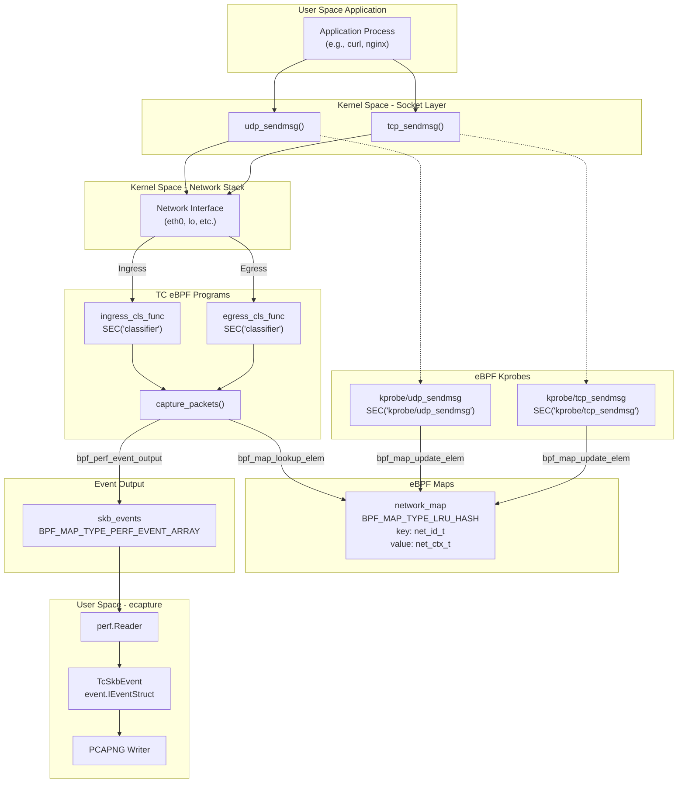
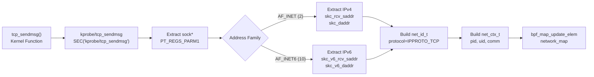
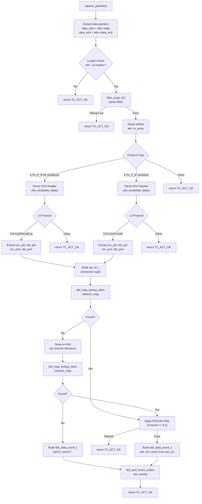
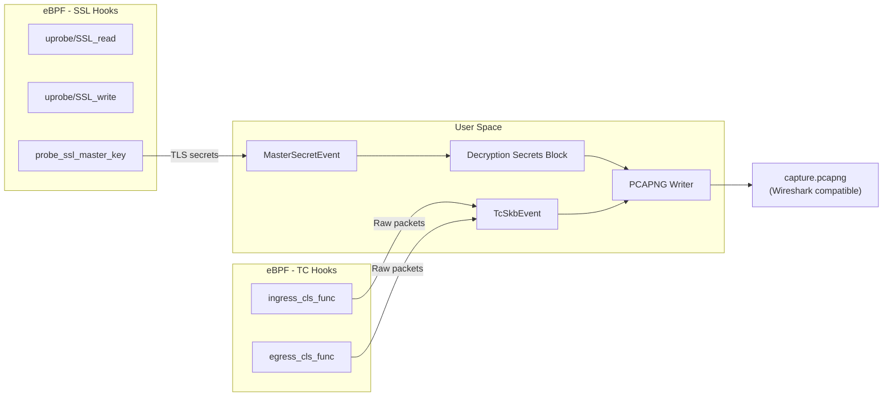

# Network Packet Capture with TC

<details>
<summary>Relevant source files</summary>

The following files were used as context for generating this wiki page:

- [CHANGELOG.md](https://github.com/gojue/ecapture/blob/ca085d05/CHANGELOG.md)
- [README.md](https://github.com/gojue/ecapture/blob/ca085d05/README.md)
- [README_CN.md](https://github.com/gojue/ecapture/blob/ca085d05/README_CN.md)
- [images/ecapture-help-v0.8.9.svg](https://github.com/gojue/ecapture/blob/ca085d05/images/ecapture-help-v0.8.9.svg)
- [kern/common.h](https://github.com/gojue/ecapture/blob/ca085d05/kern/common.h)
- [kern/ecapture.h](https://github.com/gojue/ecapture/blob/ca085d05/kern/ecapture.h)
- [kern/tc.h](https://github.com/gojue/ecapture/blob/ca085d05/kern/tc.h)
- [main.go](https://github.com/gojue/ecapture/blob/ca085d05/main.go)

</details>


## Purpose

This page documents the Traffic Control (TC) classifier-based packet capture mechanism in ecapture. TC classifiers operate at the data link layer (Layer 2), intercepting packets as they enter (ingress) or leave (egress) network interfaces. This capability is essential for the **PCAP mode** of the OpenSSL/BoringSSL module, which reconstructs full network packets and correlates them with application-layer TLS secrets.

For information about TLS secret extraction and keylog generation, see [Master Secret Extraction](3.1.4-gnutls-and-nss-modules.md). For details on PCAP output format and Wireshark integration, see [PCAP Integration](../4-output-formats/4.2-pcap-integration.md). For the overall OpenSSL module architecture, see [OpenSSL/BoringSSL Module](3.1.1-openssl-module.md).

---

## Architecture Overview

The TC packet capture system consists of three cooperating components:

1. **TC Classifiers** - eBPF programs attached to network interfaces that inspect every packet
2. **Kernel Probes** - kprobes on `tcp_sendmsg` and `udp_sendmsg` that correlate packets with processes
3. **Network Map** - An LRU hash map that stores the mapping between network connections and process metadata (PID, UID, comm)

### System Flow Diagram


```mermaid
graph TB
    subgraph "User Space Application"
        App["Application Process<br/>(e.g., curl, nginx)"]
    end
    
    subgraph "Kernel Space - Socket Layer"
        TcpSendmsg["tcp_sendmsg()"]
        UdpSendmsg["udp_sendmsg()"]
        App --> TcpSendmsg
        App --> UdpSendmsg
    end
    
    subgraph "eBPF Kprobes"
        TcpProbe["kprobe/tcp_sendmsg<br/>SEC('kprobe/tcp_sendmsg')"]
        UdpProbe["kprobe/udp_sendmsg<br/>SEC('kprobe/udp_sendmsg')"]
        TcpSendmsg -.-> TcpProbe
        UdpSendmsg -.-> UdpProbe
    end
    
    subgraph "eBPF Maps"
        NetworkMap["network_map<br/>BPF_MAP_TYPE_LRU_HASH<br/>key: net_id_t<br/>value: net_ctx_t"]
    end
    
    TcpProbe -->|"bpf_map_update_elem"| NetworkMap
    UdpProbe -->|"bpf_map_update_elem"| NetworkMap
    
    subgraph "Kernel Space - Network Stack"
        NetIf["Network Interface<br/>(eth0, lo, etc.)"]
    end
    
    TcpSendmsg --> NetIf
    UdpSendmsg --> NetIf
    
    subgraph "TC eBPF Programs"
        EgressTC["egress_cls_func<br/>SEC('classifier')"]
        IngressTC["ingress_cls_func<br/>SEC('classifier')"]
        CapturePackets["capture_packets()"]
        
        EgressTC --> CapturePackets
        IngressTC --> CapturePackets
    end
    
    NetIf -->|"Egress"| EgressTC
    NetIf -->|"Ingress"| IngressTC
    
    CapturePackets -->|"bpf_map_lookup_elem"| NetworkMap
    
    subgraph "Event Output"
        SkbEvents["skb_events<br/>BPF_MAP_TYPE_PERF_EVENT_ARRAY"]
        CapturePackets -->|"bpf_perf_event_output"| SkbEvents
    end
    
    subgraph "User Space - ecapture"
        PerfReader["perf.Reader"]
        TcSkbEvent["TcSkbEvent<br/>event.IEventStruct"]
        PcapWriter["PCAPNG Writer"]
        
        SkbEvents --> PerfReader
        PerfReader --> TcSkbEvent
        TcSkbEvent --> PcapWriter
    end
```

**Sources:** [kern/tc.h:1-398](https://github.com/gojue/ecapture/blob/ca085d05/kern/tc.h#L1-L398), [user/module/probe_openssl.go:137-148](https://github.com/gojue/ecapture/blob/ca085d05/user/module/probe_openssl.go#L137-L148)

---

## eBPF Data Structures

### Connection Identification: `net_id_t`

The `net_id_t` structure uniquely identifies a network connection using a 5-tuple for IPv4 or IPv6:

| Field | Type | Description |
|-------|------|-------------|
| `protocol` | `u32` | Protocol number (IPPROTO_TCP=6, IPPROTO_UDP=17, IPPROTO_ICMP=1, IPPROTO_ICMPV6=58) |
| `src_port` | `u32` | Source port number |
| `dst_port` | `u32` | Destination port number |
| `src_ip4` | `u32` | Source IPv4 address (for IPv4 connections) |
| `dst_ip4` | `u32` | Destination IPv4 address (for IPv4 connections) |
| `src_ip6` | `u32[4]` | Source IPv6 address (for IPv6 connections) |
| `dst_ip6` | `u32[4]` | Destination IPv6 address (for IPv6 connections) |

**Sources:** [kern/tc.h:39-47](https://github.com/gojue/ecapture/blob/ca085d05/kern/tc.h#L39-L47)

### Process Context: `net_ctx_t`

The `net_ctx_t` structure stores process metadata associated with a connection:

| Field | Type | Description |
|-------|------|-------------|
| `pid` | `u32` | Process ID |
| `uid` | `u32` | User ID |
| `comm` | `char[TASK_COMM_LEN]` | Process command name (16 bytes) |

**Sources:** [kern/tc.h:49-54](https://github.com/gojue/ecapture/blob/ca085d05/kern/tc.h#L49-L54)

### Packet Event: `skb_data_event_t`

The `skb_data_event_t` structure represents a captured packet event sent to user space:

| Field | Type | Description |
|-------|------|-------------|
| `ts` | `uint64_t` | Timestamp (nanoseconds since boot) |
| `pid` | `u32` | Process ID (from network_map lookup) |
| `comm` | `char[TASK_COMM_LEN]` | Process command name |
| `len` | `u32` | Total packet length |
| `ifindex` | `u32` | Network interface index |

**Sources:** [kern/tc.h:30-37](https://github.com/gojue/ecapture/blob/ca085d05/kern/tc.h#L30-L37)

---

## eBPF Maps

### network_map

The `network_map` is the central data structure that correlates network packets with process metadata.

```c
struct {
    __uint(type, BPF_MAP_TYPE_LRU_HASH);
    __type(key, struct net_id_t);
    __type(value, struct net_ctx_t);
    __uint(max_entries, 10240);
} network_map SEC(".maps");
```

**Type:** `BPF_MAP_TYPE_LRU_HASH` - Automatically evicts least-recently-used entries when full

**Capacity:** 10,240 connections

**Lifecycle:**
1. Populated by `tcp_sendmsg` and `udp_sendmsg` kprobes when processes initiate connections
2. Queried by TC classifiers to associate packets with processes
3. Entries automatically expire via LRU eviction

**Sources:** [kern/tc.h:72-77](https://github.com/gojue/ecapture/blob/ca085d05/kern/tc.h#L72-L77)

### skb_events

The `skb_events` map is a perf event array used to send packet data to user space:

```c
struct {
    __uint(type, BPF_MAP_TYPE_PERF_EVENT_ARRAY);
    __uint(key_size, sizeof(u32));
    __uint(value_size, sizeof(u32));
    __uint(max_entries, 10240);
} skb_events SEC(".maps");
```

**Sources:** [kern/tc.h:57-62](https://github.com/gojue/ecapture/blob/ca085d05/kern/tc.h#L57-L62)

### skb_data_buffer_heap

A per-CPU array map used for temporary storage of event structures to avoid stack limitations:

```c
struct {
    __uint(type, BPF_MAP_TYPE_PERCPU_ARRAY);
    __type(key, u32);
    __type(value, struct skb_data_event_t);
    __uint(max_entries, 1);
} skb_data_buffer_heap SEC(".maps");
```

**Sources:** [kern/tc.h:64-69](https://github.com/gojue/ecapture/blob/ca085d05/kern/tc.h#L64-L69)

---

## Kernel Probe Hooks

### tcp_sendmsg Kprobe

The `tcp_sendmsg` kprobe intercepts TCP socket send operations to populate the `network_map`:


```mermaid
graph LR
    A["tcp_sendmsg()<br/>Kernel Function"] --> B["kprobe/tcp_sendmsg<br/>SEC('kprobe/tcp_sendmsg')"]
    B --> C["Extract sock*<br/>PT_REGS_PARM1"]
    C --> D{"Address Family"}
    D -->|"AF_INET (2)"| E["Extract IPv4<br/>skc_rcv_saddr<br/>skc_daddr"]
    D -->|"AF_INET6 (10)"| F["Extract IPv6<br/>skc_v6_rcv_saddr<br/>skc_v6_daddr"]
    E --> G["Build net_id_t<br/>protocol=IPPROTO_TCP"]
    F --> G
    G --> H["Build net_ctx_t<br/>pid, uid, comm"]
    H --> I["bpf_map_update_elem<br/>network_map"]
```

**Key Operations:**
1. Extract `struct sock *` from first argument ([kern/tc.h:304](https://github.com/gojue/ecapture/blob/ca085d05/kern/tc.h#L304))
2. Read socket family field to determine IPv4 or IPv6 ([kern/tc.h:311](https://github.com/gojue/ecapture/blob/ca085d05/kern/tc.h#L311))
3. Extract local/remote IP addresses and ports from `sock->__sk_common` ([kern/tc.h:315-336](https://github.com/gojue/ecapture/blob/ca085d05/kern/tc.h#L315-L336))
4. Build `net_id_t` with protocol set to `IPPROTO_TCP` ([kern/tc.h:320-336](https://github.com/gojue/ecapture/blob/ca085d05/kern/tc.h#L320-L336))
5. Populate `net_ctx_t` with current process PID, UID, and comm ([kern/tc.h:339-342](https://github.com/gojue/ecapture/blob/ca085d05/kern/tc.h#L339-L342))
6. Update `network_map` with the connection tuple → process mapping ([kern/tc.h:345](https://github.com/gojue/ecapture/blob/ca085d05/kern/tc.h#L345))

**Sources:** [kern/tc.h:290-347](https://github.com/gojue/ecapture/blob/ca085d05/kern/tc.h#L290-L347)

### udp_sendmsg Kprobe

The `udp_sendmsg` kprobe operates identically to `tcp_sendmsg` but for UDP connections, setting `protocol = IPPROTO_UDP` in the `net_id_t` structure.

**Sources:** [kern/tc.h:349-397](https://github.com/gojue/ecapture/blob/ca085d05/kern/tc.h#L349-L397)

---

## TC Classifier Implementation

### Attachment Points

Two TC classifier programs are defined, attaching to egress and ingress hook points:

```c
SEC("classifier")
int egress_cls_func(struct __sk_buff *skb) {
    return capture_packets(skb, false);
}

SEC("classifier")
int ingress_cls_func(struct __sk_buff *skb) {
    return capture_packets(skb, true);
}
```

**Egress:** Packets leaving the host (outbound traffic)  
**Ingress:** Packets entering the host (inbound traffic)

Both classifiers invoke the common `capture_packets` function, returning `TC_ACT_OK` to allow normal packet processing.

**Sources:** [kern/tc.h:278-288](https://github.com/gojue/ecapture/blob/ca085d05/kern/tc.h#L278-L288)

### capture_packets Function

The `capture_packets` function performs the core packet processing logic:


```mermaid
graph TB
    Start["capture_packets()"] --> ExtractData["Extract data pointers<br/>data_start = skb->data<br/>data_end = skb->data_end"]
    ExtractData --> LenCheck{"Length Check<br/>eth + ip header?"}
    LenCheck -->|"No"| ReturnOK1["return TC_ACT_OK"]
    LenCheck -->|"Yes"| FilterPcap["filter_pcap_l2()<br/>(pcap filter)"]
    FilterPcap -->|"Filtered out"| ReturnOK2["return TC_ACT_OK"]
    FilterPcap -->|"Pass"| ParseEth["Parse ethhdr<br/>eth->h_proto"]
    
    ParseEth --> ProtoCheck{"Protocol Type"}
    ProtoCheck -->|"ETH_P_IPV6 (0x86DD)"| ParseIPv6["Parse IPv6 Header<br/>skb_revalidate_data()"]
    ProtoCheck -->|"ETH_P_IP (0x0800)"| ParseIPv4["Parse IPv4 Header<br/>skb_revalidate_data()"]
    ProtoCheck -->|"Other"| ReturnOK3["return TC_ACT_OK"]
    
    ParseIPv6 --> L4IPv6{"L4 Protocol"}
    L4IPv6 -->|"TCP/UDP/ICMPv6"| ExtractIPv6["Extract src_ip6, dst_ip6<br/>src_port, dst_port"]
    L4IPv6 -->|"Other"| ReturnOK4["return TC_ACT_OK"]
    
    ParseIPv4 --> L4IPv4{"L4 Protocol"}
    L4IPv4 -->|"TCP/UDP/ICMP"| ExtractIPv4["Extract src_ip4, dst_ip4<br/>src_port, dst_port"]
    L4IPv4 -->|"Other"| ReturnOK5["return TC_ACT_OK"]
    
    ExtractIPv6 --> BuildConnId["Build net_id_t<br/>connection tuple"]
    ExtractIPv4 --> BuildConnId
    
    BuildConnId --> Lookup1["bpf_map_lookup_elem<br/>network_map"]
    Lookup1 --> Found1{"Found?"}
    Found1 -->|"No"| SwapTuple["Swap src/dst<br/>(try reverse direction)"]
    SwapTuple --> Lookup2["bpf_map_lookup_elem<br/>network_map"]
    Lookup2 --> Found2{"Found?"}
    
    Found1 -->|"Yes"| FilterPidUid["Apply PID/UID Filter<br/>(if kernel >= 5.2)"]
    Found2 -->|"Yes"| FilterPidUid
    Found2 -->|"No"| BuildEvent1["Build skb_data_event_t<br/>pid=0, comm=''"]
    
    FilterPidUid -->|"Filtered"| ReturnOK6["return TC_ACT_OK"]
    FilterPidUid -->|"Pass"| BuildEvent2["Build skb_data_event_t<br/>pid, uid, comm from net_ctx"]
    
    BuildEvent1 --> SendEvent["bpf_perf_event_output<br/>skb_events"]
    BuildEvent2 --> SendEvent
    SendEvent --> ReturnOK7["return TC_ACT_OK"]
```

**Sources:** [kern/tc.h:135-276](https://github.com/gojue/ecapture/blob/ca085d05/kern/tc.h#L135-L276)

### Packet Filtering and Validation

#### Length Validation

Before processing, the function validates that the packet contains at minimum an Ethernet header and IP header:

```c
if (data_start + sizeof(struct ethhdr) + sizeof(struct iphdr) > data_end) {
    return TC_ACT_OK;
}
```

**Sources:** [kern/tc.h:141-144](https://github.com/gojue/ecapture/blob/ca085d05/kern/tc.h#L141-L144)

#### PCAP Filter Integration

When a pcap filter is specified via the `--pcapfilter` flag, the `filter_pcap_l2` function applies the compiled filter expression:

```c
if (!filter_pcap_l2(skb, data_start, data_end))
    return TC_ACT_OK;
```

The function is marked `__noinline` to allow instruction patching by the user-space loader. The instruction patcher translates libpcap filter expressions (e.g., `tcp port 443`) into eBPF instructions that are injected into this function.

**Sources:** [kern/tc.h:121-132](https://github.com/gojue/ecapture/blob/ca085d05/kern/tc.h#L121-L132), [kern/tc.h:147-150](https://github.com/gojue/ecapture/blob/ca085d05/kern/tc.h#L147-L150), [user/module/probe_openssl.go:302-307](https://github.com/gojue/ecapture/blob/ca085d05/user/module/probe_openssl.go#L302-L307)

### Protocol Parsing

#### IPv4 Packet Processing

For IPv4 packets (`eth->h_proto == ETH_P_IP`):

1. Parse `struct iphdr` at offset `sizeof(struct ethhdr)` ([kern/tc.h:206](https://github.com/gojue/ecapture/blob/ca085d05/kern/tc.h#L206))
2. Filter non-TCP/UDP/ICMP protocols ([kern/tc.h:208-210](https://github.com/gojue/ecapture/blob/ca085d05/kern/tc.h#L208-L210))
3. Extract source/destination IP addresses: `iph->saddr`, `iph->daddr` ([kern/tc.h:213-214](https://github.com/gojue/ecapture/blob/ca085d05/kern/tc.h#L213-L214))
4. Revalidate buffer for L4 header access ([kern/tc.h:215-218](https://github.com/gojue/ecapture/blob/ca085d05/kern/tc.h#L215-L218))
5. Parse TCP/UDP header (both use first 4 bytes for ports) ([kern/tc.h:221](https://github.com/gojue/ecapture/blob/ca085d05/kern/tc.h#L221))
6. Extract source/destination ports: `bpf_ntohs(hdr->source)`, `bpf_ntohs(hdr->dest)` ([kern/tc.h:222-223](https://github.com/gojue/ecapture/blob/ca085d05/kern/tc.h#L222-L223))

**Sources:** [kern/tc.h:199-224](https://github.com/gojue/ecapture/blob/ca085d05/kern/tc.h#L199-L224)

#### IPv6 Packet Processing

For IPv6 packets (`eth->h_proto == ETH_P_IPV6`):

1. Parse `struct ipv6hdr` at offset `sizeof(struct ethhdr)` ([kern/tc.h:163](https://github.com/gojue/ecapture/blob/ca085d05/kern/tc.h#L163))
2. Filter non-TCP/UDP/ICMPv6 protocols via `iph->nexthdr` ([kern/tc.h:164-166](https://github.com/gojue/ecapture/blob/ca085d05/kern/tc.h#L164-L166))
3. Extract 128-bit source/destination addresses: `iph->saddr`, `iph->daddr` ([kern/tc.h:169-170](https://github.com/gojue/ecapture/blob/ca085d05/kern/tc.h#L169-L170))
4. Process L4 header identically to IPv4 ([kern/tc.h:172-186](https://github.com/gojue/ecapture/blob/ca085d05/kern/tc.h#L172-L186))

**Sources:** [kern/tc.h:156-198](https://github.com/gojue/ecapture/blob/ca085d05/kern/tc.h#L156-L198)

### Network Map Lookup

After constructing the `net_id_t` connection tuple, the function performs a bidirectional lookup:

```c
net_ctx = bpf_map_lookup_elem(&network_map, &conn_id);
if (net_ctx == NULL) {
    // Swap src/dst and try reverse direction
    u32 tmp_ip = conn_id.src_ip4;
    conn_id.src_ip4 = conn_id.dst_ip4;
    conn_id.dst_ip4 = tmp_ip;
    u32 tmp_port = conn_id.src_port;
    conn_id.src_port = conn_id.dst_port;
    conn_id.dst_port = tmp_port;
    net_ctx = bpf_map_lookup_elem(&network_map, &conn_id);
}
```

This bidirectional lookup handles both egress and ingress packets for the same connection. When a process initiates a connection via `tcp_sendmsg`, the `network_map` is populated with the egress tuple. For response packets (ingress direction), the source and destination are swapped, so the code tries both directions.

**Sources:** [kern/tc.h:225-234](https://github.com/gojue/ecapture/blob/ca085d05/kern/tc.h#L225-L234) (IPv4), [kern/tc.h:188-198](https://github.com/gojue/ecapture/blob/ca085d05/kern/tc.h#L188-L198) (IPv6)

### Process Filtering

On kernels >= 5.2, global variables `target_pid` and `target_uid` can be set to filter packets by process:

```c
#ifndef KERNEL_LESS_5_2
    if (target_pid != 0 && target_pid != net_ctx->pid) {
        return TC_ACT_OK;
    }
    if (target_uid != 0 && target_uid != net_ctx->uid) {
        return TC_ACT_OK;
    }
#endif
```

These global variables are set via constant editors in the user-space module initialization.

**Sources:** [kern/tc.h:243-250](https://github.com/gojue/ecapture/blob/ca085d05/kern/tc.h#L243-L250), [kern/common.h:64-71](https://github.com/gojue/ecapture/blob/ca085d05/kern/common.h#L64-L71)

### Event Submission

Captured packet metadata and the raw packet data are sent to user space via `bpf_perf_event_output`:

```c
event.ts = bpf_ktime_get_ns();
event.len = skb->len;
event.ifindex = skb->ifindex;

u64 flags = BPF_F_CURRENT_CPU;
flags |= (u64)skb->len << 32;

size_t pkt_size = TC_PACKET_MIN_SIZE;
bpf_perf_event_output(skb, &skb_events, flags, &event, pkt_size);
```

The `flags` parameter encodes both the CPU number and the total packet length in the upper 32 bits. The actual packet data is read from the `skb` structure by the kernel's perf event subsystem. Only minimal metadata (`TC_PACKET_MIN_SIZE = 36` bytes) is copied from the event structure.

**Sources:** [kern/tc.h:256-271](https://github.com/gojue/ecapture/blob/ca085d05/kern/tc.h#L256-L271), [kern/tc.h:20](https://github.com/gojue/ecapture/blob/ca085d05/kern/tc.h#L20)

---

## User-Space Integration

### Module Configuration

The OpenSSL module enables TC packet capture when configured in PCAP mode:

```go
case config.TlsCaptureModelPcap, config.TlsCaptureModelPcapng:
    pcapFile := m.conf.(*config.OpensslConfig).PcapFile
    m.eBPFProgramType = TlsCaptureModelTypePcap
    var fileInfo string
    fileInfo, err = filepath.Abs(pcapFile)
    if err != nil {
        return err
    }
    m.tcPacketsChan = make(chan *TcPacket, 2048)
    m.tcPackets = make([]*TcPacket, 0, 256)
    m.pcapngFilename = fileInfo
```

**Sources:** [user/module/probe_openssl.go:137-148](https://github.com/gojue/ecapture/blob/ca085d05/user/module/probe_openssl.go#L137-L148)

### Manager Setup

The `setupManagersPcap` function configures the eBPF manager for TC and kprobe attachment:

```go
func (m *MOpenSSLProbe) setupManagersPcap() error {
    var err error
    m.bpfManager = &manager.Manager{
        Probes: []*manager.Probe{
            // SSL function uprobes...
            {
                Section:          "kprobe/tcp_sendmsg",
                EbpfFuncName:     "kprobe_tcp_sendmsg",
                AttachToFuncName: "tcp_sendmsg",
            },
            {
                Section:          "kprobe/udp_sendmsg",
                EbpfFuncName:     "kprobe_udp_sendmsg",
                AttachToFuncName: "udp_sendmsg",
            },
        },
    }
    // ... TC classifier setup
}
```

**Key components:**
- **Kprobes:** Attach to `tcp_sendmsg` and `udp_sendmsg` kernel functions
- **TC Classifiers:** Attach to network interfaces (configured separately in TCObjects)
- **Constant Editors:** Set `target_pid` and `target_uid` global variables

**Sources:** [user/module/probe_openssl.go:280-350](https://github.com/gojue/ecapture/blob/ca085d05/user/module/probe_openssl.go#L280-L350)

### PCAP Filter Compilation

When a `--pcapfilter` is specified, the instruction patcher compiles the filter expression:

```go
pcapFilter := m.conf.(*config.OpensslConfig).PcapFilter
if m.eBPFProgramType == TlsCaptureModelTypePcap && pcapFilter != "" {
    ebpfFuncs := []string{tcFuncNameIngress, tcFuncNameEgress}
    m.bpfManager.InstructionPatchers = prepareInsnPatchers(m.bpfManager,
        ebpfFuncs, pcapFilter)
}
```

The `prepareInsnPatchers` function:
1. Parses the pcap filter expression (e.g., `tcp port 443 and host 1.2.3.4`)
2. Compiles it to BPF instructions using libpcap
3. Patches the `filter_pcap_ebpf_l2` function in both `ingress_cls_func` and `egress_cls_func`

**Sources:** [user/module/probe_openssl.go:302-307](https://github.com/gojue/ecapture/blob/ca085d05/user/module/probe_openssl.go#L302-L307)

### Event Processing

TC packet events are read from the perf event array and decoded into `TcSkbEvent` structures:

```go
case *event.TcSkbEvent:
    err := m.dumpTcSkb(ev)
    if err != nil {
        m.logger.Error().Err(err).Msg("save packet error.")
    }
```

The `dumpTcSkb` function:
1. Receives `TcSkbEvent` with packet metadata and raw bytes
2. Buffers packets in `m.tcPackets` slice
3. Periodically flushes to PCAPNG file with process metadata

**Sources:** [user/module/probe_openssl.go:746-750](https://github.com/gojue/ecapture/blob/ca085d05/user/module/probe_openssl.go#L746-L750)

---

## Supported Protocols

### Layer 3 (Network Layer)

| Protocol | Constant | Value | Support |
|----------|----------|-------|---------|
| IPv4 | `ETH_P_IP` | `0x0800` | Full |
| IPv6 | `ETH_P_IPV6` | `0x86DD` | Full |

**Sources:** [kern/common.h:59-60](https://github.com/gojue/ecapture/blob/ca085d05/kern/common.h#L59-L60)

### Layer 4 (Transport Layer)

| Protocol | Constant | Value | Kprobe Hook | TC Support |
|----------|----------|-------|-------------|------------|
| TCP | `IPPROTO_TCP` | `6` | `tcp_sendmsg` | Full |
| UDP | `IPPROTO_UDP` | `17` | `udp_sendmsg` | Full |
| ICMP | `IPPROTO_ICMP` | `1` | None | Limited* |
| ICMPv6 | `IPPROTO_ICMPV6` | `58` | None | Limited* |

*ICMP/ICMPv6 packets are captured by TC classifiers but cannot be correlated with processes (no kprobe hook), so `pid=0` in events.

**Sources:** [kern/tc.h:164](https://github.com/gojue/ecapture/blob/ca085d05/kern/tc.h#L164), [kern/tc.h:208](https://github.com/gojue/ecapture/blob/ca085d05/kern/tc.h#L208), [kern/tc.h:290-397](https://github.com/gojue/ecapture/blob/ca085d05/kern/tc.h#L290-L397)

---

## Kernel Version Requirements

### Global Variables (target_pid, target_uid)

Process filtering via `target_pid` and `target_uid` requires kernel >= 5.2 for `.rodata` section support:

```c
#ifndef KERNEL_LESS_5_2
const volatile u64 target_pid = 0;
const volatile u64 target_uid = 0;
#endif
```

On kernels < 5.2, these filters are disabled, and all packets matching the pcap filter are captured.

**Sources:** [kern/common.h:64-71](https://github.com/gojue/ecapture/blob/ca085d05/kern/common.h#L64-L71), [user/module/imodule.go:145-148](https://github.com/gojue/ecapture/blob/ca085d05/user/module/imodule.go#L145-L148)

### BTF and CO-RE

The TC eBPF programs support both CO-RE and non-CO-RE modes:
- **CO-RE mode:** Uses `vmlinux.h` and kernel BTF for automatic structure relocations
- **Non-CO-RE mode:** Uses kernel headers for specific kernel versions

The mode is selected automatically based on BTF availability or via the `-b/--btf` flag.

**Sources:** [kern/ecapture.h:18-88](https://github.com/gojue/ecapture/blob/ca085d05/kern/ecapture.h#L18-L88)

---

## Limitations and Considerations

### Connection Tracking Gap

The `network_map` is only populated when processes call `tcp_sendmsg` or `udp_sendmsg`. This creates a gap for:
1. **Inbound-initiated connections:** Server processes accepting connections may not appear in the map until they send data
2. **Pre-existing connections:** Connections established before ecapture starts are not tracked
3. **Kernel-initiated traffic:** Packets sent directly by the kernel without process context

For these cases, TC classifiers capture packets with `pid=0`.

### LRU Map Eviction

The `network_map` has a maximum size of 10,240 entries. Under high connection churn, old entries may be evicted before their packets are captured. The LRU (Least Recently Used) eviction policy prioritizes active connections.

**Sources:** [kern/tc.h:76](https://github.com/gojue/ecapture/blob/ca085d05/kern/tc.h#L76)

### Packet Size

The maximum packet size supported is `SKB_MAX_DATA_SIZE = 2048` bytes. Larger packets are truncated. The actual packet length is preserved in `skb_data_event_t.len` but only 2048 bytes are captured.

**Sources:** [kern/common.h:61](https://github.com/gojue/ecapture/blob/ca085d05/kern/common.h#L61)

### Performance Impact

TC classifiers execute on **every packet** traversing the network interface, including traffic unrelated to monitored processes. The performance impact scales with total network throughput, not just monitored application traffic. Use pcap filters to reduce overhead.

---

## Integration with OpenSSL Module

The TC packet capture integrates with TLS secret extraction for complete plaintext recovery:


```mermaid
graph LR
    subgraph "eBPF - SSL Hooks"
        SSLRead["uprobe/SSL_read"]
        SSLWrite["uprobe/SSL_write"]
        SSLMasterKey["probe_ssl_master_key"]
    end
    
    subgraph "eBPF - TC Hooks"
        TCIngress["ingress_cls_func"]
        TCEgress["egress_cls_func"]
    end
    
    subgraph "User Space"
        SecretEvent["MasterSecretEvent"]
        TcSkbEvent["TcSkbEvent"]
        PcapngWriter["PCAPNG Writer"]
        DSB["Decryption Secrets Block"]
    end
    
    SSLMasterKey -->|"TLS secrets"| SecretEvent
    TCIngress -->|"Raw packets"| TcSkbEvent
    TCEgress -->|"Raw packets"| TcSkbEvent
    
    SecretEvent --> DSB
    DSB --> PcapngWriter
    TcSkbEvent --> PcapngWriter
    
    PcapngWriter --> WiresharkFile["capture.pcapng<br/>(Wireshark compatible)"]
```

The combined output includes:
1. **Network packets** captured by TC with process metadata (PID, comm)
2. **TLS master secrets** extracted from SSL library hooks
3. **PCAPNG DSB blocks** embedding secrets for automatic decryption in Wireshark

For details on DSB generation, see [PCAP Integration](../4-output-formats/4.2-pcap-integration.md).

**Sources:** [user/module/probe_openssl.go:558-565](https://github.com/gojue/ecapture/blob/ca085d05/user/module/probe_openssl.go#L558-L565)

---

## Usage Example

### Basic PCAP Capture

Capture all TLS traffic to a pcapng file:

```bash
ecapture tls --pcapng=/tmp/traffic.pcapng
```

### Filtered Capture

Capture only HTTPS traffic (port 443) for a specific process:

```bash
ecapture tls --pcapng=/tmp/https.pcapng --pcapfilter="tcp port 443" --pid=12345
```

### IPv6 Capture

Capture IPv6 TLS traffic:

```bash
ecapture tls --pcapng=/tmp/ipv6.pcapng --pcapfilter="ip6"
```

### Analysis with Wireshark

The generated PCAPNG file can be opened directly in Wireshark, which will automatically use the embedded DSB secrets to decrypt TLS traffic:

```bash
wireshark /tmp/traffic.pcapng
```

For more information on output formats, see [PCAP Integration](../4-output-formats/4.2-pcap-integration.md) and [TLS Key Logging](../4-output-formats/4.3-tls-key-logging.md).