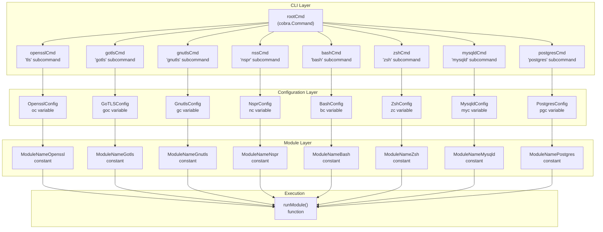
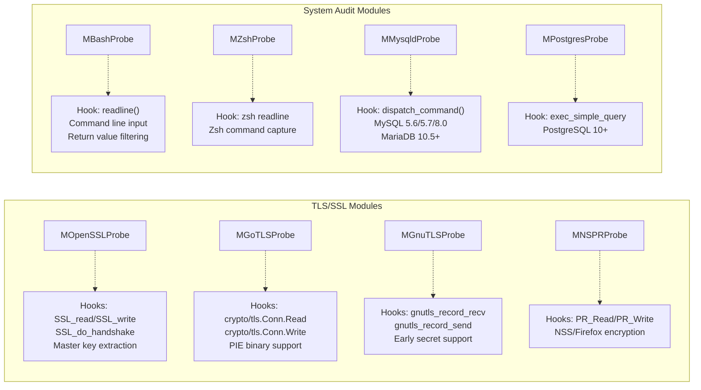
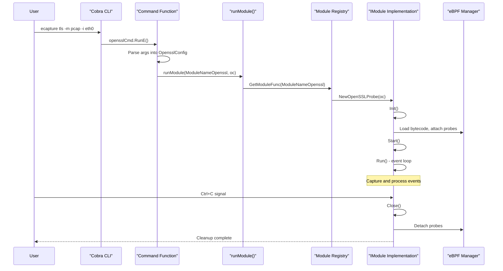

# Capture Modules

<details>
<summary>Relevant source files</summary>

The following files were used as context for generating this wiki page:

- [CHANGELOG.md](https://github.com/gojue/ecapture/blob/0766a93b/CHANGELOG.md)
- [README.md](https://github.com/gojue/ecapture/blob/0766a93b/README.md)
- [README_CN.md](https://github.com/gojue/ecapture/blob/0766a93b/README_CN.md)
- [cli/cmd/bash.go](https://github.com/gojue/ecapture/blob/0766a93b/cli/cmd/bash.go)
- [cli/cmd/gnutls.go](https://github.com/gojue/ecapture/blob/0766a93b/cli/cmd/gnutls.go)
- [cli/cmd/gotls.go](https://github.com/gojue/ecapture/blob/0766a93b/cli/cmd/gotls.go)
- [cli/cmd/mysqld.go](https://github.com/gojue/ecapture/blob/0766a93b/cli/cmd/mysqld.go)
- [cli/cmd/nspr.go](https://github.com/gojue/ecapture/blob/0766a93b/cli/cmd/nspr.go)
- [cli/cmd/postgres.go](https://github.com/gojue/ecapture/blob/0766a93b/cli/cmd/postgres.go)
- [cli/cmd/tls.go](https://github.com/gojue/ecapture/blob/0766a93b/cli/cmd/tls.go)
- [cli/cmd/zsh.go](https://github.com/gojue/ecapture/blob/0766a93b/cli/cmd/zsh.go)
- [images/ecapture-help-v0.8.9.svg](https://github.com/gojue/ecapture/blob/0766a93b/images/ecapture-help-v0.8.9.svg)
- [main.go](https://github.com/gojue/ecapture/blob/0766a93b/main.go)
- [pkg/util/ws/client.go](https://github.com/gojue/ecapture/blob/0766a93b/pkg/util/ws/client.go)
- [pkg/util/ws/client_test.go](https://github.com/gojue/ecapture/blob/0766a93b/pkg/util/ws/client_test.go)

</details>


## Purpose and Scope

This page provides an overview of eCapture's capture module system, which implements specialized data capture capabilities for different protocols, libraries, and applications. Each module targets a specific technology (OpenSSL, GnuTLS, Go TLS, Bash, MySQL, etc.) and implements a common interface to integrate with eCapture's event processing pipeline.

For detailed information about specific module types, see:
- TLS/SSL capture implementations: [TLS/SSL Modules](3.1-tlsssl-modules.md)
- Shell and database auditing: [System Audit Modules](3.2-system-audit-modules.md)
- Network packet capture mechanisms: [Network Packet Capture with TC](3.3-network-packet-capture-with-tc.md)
- Module interface and lifecycle management: [Module System and Lifecycle](../2-architecture/2.4-module-system-and-lifecycle.md)

## Module System Overview

eCapture's modular architecture allows it to capture data from diverse sources through a unified interface. Each module is responsible for:

1. **Target Detection**: Locating the appropriate binary or shared library to instrument
2. **eBPF Program Management**: Loading and attaching version-specific eBPF bytecode
3. **Event Processing**: Decoding and formatting captured data
4. **Output Generation**: Producing data in text, pcap, or keylog formats

The system currently implements **eight capture modules**, each registered via CLI subcommands and accessible through the module registry.

Sources: [README.md:152-161](https://github.com/gojue/ecapture/blob/0766a93b/README.md#L152-L161), [cli/cmd/tls.go:29-48](https://github.com/gojue/ecapture/blob/0766a93b/cli/cmd/tls.go#L29-L48), [cli/cmd/gotls.go:29-40](https://github.com/gojue/ecapture/blob/0766a93b/cli/cmd/gotls.go#L29-L40)

## Module Registry and Architecture



**Module Registration Architecture**: Each module is registered as a Cobra CLI subcommand with its own configuration object. When invoked, the command function calls `runModule()` with the module name constant and configuration, which instantiates the appropriate module implementation via the module registry.

Sources: [cli/cmd/tls.go:26-67](https://github.com/gojue/ecapture/blob/0766a93b/cli/cmd/tls.go#L26-L67), [cli/cmd/gotls.go:26-58](https://github.com/gojue/ecapture/blob/0766a93b/cli/cmd/gotls.go#L26-L58), [cli/cmd/bash.go:24-55](https://github.com/gojue/ecapture/blob/0766a93b/cli/cmd/bash.go#L24-L55), [cli/cmd/mysqld.go:27-49](https://github.com/gojue/ecapture/blob/0766a93b/cli/cmd/mysqld.go#L27-L49), [cli/cmd/postgres.go:27-45](https://github.com/gojue/ecapture/blob/0766a93b/cli/cmd/postgres.go#L27-L45), [cli/cmd/nspr.go:27-51](https://github.com/gojue/ecapture/blob/0766a93b/cli/cmd/nspr.go#L27-L51), [cli/cmd/gnutls.go:29-64](https://github.com/gojue/ecapture/blob/0766a93b/cli/cmd/gnutls.go#L29-L64), [cli/cmd/zsh.go:27-57](https://github.com/gojue/ecapture/blob/0766a93b/cli/cmd/zsh.go#L27-L57)

## Module Categories

eCapture's eight modules are organized into three functional categories based on their capture targets and techniques:

### TLS/SSL Encryption Libraries

These modules intercept cryptographic functions to capture plaintext data before encryption or after decryption:

| Module | CLI Command | Target Library | Supported Versions | Primary Use Case |
|--------|-------------|----------------|-------------------|------------------|
| **OpenSSL** | `tls`, `openssl` | libssl.so | 1.0.x, 1.1.x, 3.0.x+ | General TLS/HTTPS capture |
| **BoringSSL** | `tls` | libssl.so | Android 12-16 | Android HTTPS capture |
| **Go TLS** | `gotls`, `tlsgo` | Built-in crypto/tls | All Go versions | Go application capture |
| **GnuTLS** | `gnutls`, `gnu` | libgnutls.so | 3.x | Alternative TLS library |
| **NSPR/NSS** | `nspr`, `nss` | libnspr4.so | All versions | Firefox/Thunderbird |

Sources: [README.md:152-161](https://github.com/gojue/ecapture/blob/0766a93b/README.md#L152-L161), [README_CN.md:128-138](https://github.com/gojue/ecapture/blob/0766a93b/README_CN.md#L128-L138), [cli/cmd/tls.go:29-33](https://github.com/gojue/ecapture/blob/0766a93b/cli/cmd/tls.go#L29-L33), [cli/cmd/gotls.go:29-33](https://github.com/gojue/ecapture/blob/0766a93b/cli/cmd/gotls.go#L29-L33), [cli/cmd/gnutls.go:32-36](https://github.com/gojue/ecapture/blob/0766a93b/cli/cmd/gnutls.go#L32-L36), [cli/cmd/nspr.go:30-34](https://github.com/gojue/ecapture/blob/0766a93b/cli/cmd/nspr.go#L30-L34)

### System Audit and Command Capture

These modules hook into command interpreters and database servers for security auditing:

| Module | CLI Command | Target Binary | Hook Points | Audit Capability |
|--------|-------------|---------------|-------------|------------------|
| **Bash** | `bash` | /bin/bash | readline library | Command input/output |
| **Zsh** | `zsh` | /bin/zsh | readline functions | Command execution |
| **MySQL** | `mysqld` | /usr/sbin/mysqld | dispatch_command | SQL query logging |
| **PostgreSQL** | `postgres` | /usr/bin/postgres | Query execution | SQL audit |

Sources: [README.md:152-161](https://github.com/gojue/ecapture/blob/0766a93b/README.md#L152-L161), [cli/cmd/bash.go:27-32](https://github.com/gojue/ecapture/blob/0766a93b/cli/cmd/bash.go#L27-L32), [cli/cmd/zsh.go:30-35](https://github.com/gojue/ecapture/blob/0766a93b/cli/cmd/zsh.go#L30-L35), [cli/cmd/mysqld.go:30-36](https://github.com/gojue/ecapture/blob/0766a93b/cli/cmd/mysqld.go#L30-L36), [cli/cmd/postgres.go:30-33](https://github.com/gojue/ecapture/blob/0766a93b/cli/cmd/postgres.go#L30-L33)

### Network Packet Capture

Network-level capture is integrated into TLS/SSL modules via Traffic Control (TC) eBPF classifiers. See [Network Packet Capture with TC](3.3-network-packet-capture-with-tc.md) for details.

## Detailed Module Descriptions



**Module Implementation Details**: Each module is implemented as a separate struct that embeds common functionality and implements module-specific hook points and event processing logic.

### OpenSSL/BoringSSL Module

The `tls` command targets OpenSSL and BoringSSL libraries, providing the most comprehensive TLS capture capabilities. It supports:

- **Version Detection**: Automatic detection of OpenSSL 1.0.2 through 3.5.x and Android BoringSSL A12-A16
- **Three Capture Modes**:
  - `text`: Direct plaintext capture with HTTP/HTTP2 parsing
  - `pcap`/`pcapng`: Network packet capture with embedded decryption keys
  - `keylog`/`key`: TLS master secret extraction for external decryption
- **Hook Points**: `SSL_read`, `SSL_write`, `SSL_do_handshake`, `SSL_get_wbio`, `SSL_in_before`
- **Connection Tracking**: 4-tuple network tracking via TC and kprobe hooks

Sources: [cli/cmd/tls.go:29-48](https://github.com/gojue/ecapture/blob/0766a93b/cli/cmd/tls.go#L29-L48), [README.md:163-253](https://github.com/gojue/ecapture/blob/0766a93b/README.md#L163-L253), [CHANGELOG.md:14-24](https://github.com/gojue/ecapture/blob/0766a93b/CHANGELOG.md#L14-L24)

### Go TLS Module

The `gotls` command captures plaintext from Go applications using the standard `crypto/tls` package:

- **Binary Analysis**: Parses Go binary metadata to locate TLS functions
- **PIE Support**: Handles Position Independent Executables with dynamic offset calculation
- **ABI Compatibility**: Supports both register-based and stack-based calling conventions
- **Capture Modes**: Same three modes as OpenSSL (text, pcap, keylog)

Sources: [cli/cmd/gotls.go:29-40](https://github.com/gojue/ecapture/blob/0766a93b/cli/cmd/gotls.go#L29-L40), [README.md:254-276](https://github.com/gojue/ecapture/blob/0766a93b/README.md#L254-L276), [CHANGELOG.md:21-29](https://github.com/gojue/ecapture/blob/0766a93b/CHANGELOG.md#L21-L29)

### GnuTLS Module

The `gnutls` command targets the GnuTLS library used by wget and other applications:

- **Hook Points**: `gnutls_record_recv`, `gnutls_record_send`
- **Version Support**: GnuTLS 3.x with automatic version detection
- **Early Secret Support**: Captures TLS 1.3 early secrets for 0-RTT decryption
- **Capture Modes**: text, pcap, keylog

Sources: [cli/cmd/gnutls.go:32-45](https://github.com/gojue/ecapture/blob/0766a93b/cli/cmd/gnutls.go#L32-L45), [CHANGELOG.md:126-127](https://github.com/gojue/ecapture/blob/0766a93b/CHANGELOG.md#L126-L127)

### NSPR/NSS Module

The `nspr` command captures traffic from Firefox, Thunderbird, and other Mozilla applications:

- **Target**: NSPR (Netscape Portable Runtime) library used by NSS
- **Hook Points**: `PR_Read`, `PR_Write` functions
- **Application Support**: Firefox browser, Thunderbird email client

Sources: [cli/cmd/nspr.go:30-40](https://github.com/gojue/ecapture/blob/0766a93b/cli/cmd/nspr.go#L30-L40), [README.md:158](https://github.com/gojue/ecapture/blob/0766a93b/README.md#L158)

### Bash Module

The `bash` command provides command-line auditing for Bash shells:

- **Hook Points**: `readline()` function from libreadline
- **Capture Data**: Command input before execution, return value after execution
- **Filtering**: Optional errno filtering to capture only failed commands
- **Auto-detection**: Automatically locates bash binary from `$SHELL` environment

Command usage:
```
ecapture bash [--bash=/bin/bash] [--errnumber=N]
```

Sources: [cli/cmd/bash.go:27-55](https://github.com/gojue/ecapture/blob/0766a93b/cli/cmd/bash.go#L27-L55), [README.md:153](https://github.com/gojue/ecapture/blob/0766a93b/README.md#L153)

### Zsh Module

The `zsh` command provides similar auditing capabilities for Zsh shells:

- **Hook Points**: Zsh-specific readline implementations
- **Features**: Command capture, return value tracking, errno filtering
- **Platform Support**: Linux only (excluded from Android builds via build tags)

Sources: [cli/cmd/zsh.go:30-57](https://github.com/gojue/ecapture/blob/0766a93b/cli/cmd/zsh.go#L30-L57), [README.md:154](https://github.com/gojue/ecapture/blob/0766a93b/README.md#L154), [CHANGELOG.md:369](https://github.com/gojue/ecapture/blob/0766a93b/CHANGELOG.md#L369)

### MySQL Module

The `mysqld` command captures SQL queries from MySQL and MariaDB servers:

- **Version Support**: MySQL 5.6, 5.7, 8.0 and MariaDB 10.5+
- **Hook Points**: `dispatch_command()` function at version-specific offsets
- **Capture Data**: Full SQL query text with timestamp and connection info
- **Offset Support**: Manual offset specification for custom builds

Command usage:
```
ecapture mysqld [--mysqld=/usr/sbin/mysqld] [--funcname=dispatch_command]
```

Sources: [cli/cmd/mysqld.go:30-49](https://github.com/gojue/ecapture/blob/0766a93b/cli/cmd/mysqld.go#L30-L49), [README.md:157](https://github.com/gojue/ecapture/blob/0766a93b/README.md#L157)

### PostgreSQL Module

The `postgres` command provides query auditing for PostgreSQL databases:

- **Version Support**: PostgreSQL 10 and newer
- **Hook Points**: Query execution functions
- **Function Customization**: Allows specifying custom function names for different builds

Sources: [cli/cmd/postgres.go:30-45](https://github.com/gojue/ecapture/blob/0766a93b/cli/cmd/postgres.go#L30-L45), [README.md:159](https://github.com/gojue/ecapture/blob/0766a93b/README.md#L159)

## Common Module Features

All capture modules share a common set of capabilities through the eCapture framework:

### Configuration Interface

Each module implements an `IConfig` interface with common parameters:

| Parameter | Flag | Description | Default |
|-----------|------|-------------|---------|
| PID Filter | `--pid` | Target specific process ID | All processes |
| UID Filter | `--uid` | Target specific user ID | All users |
| Output File | `-l`, `--logaddr` | Save events to file | stdout |
| Hex Mode | `--hex` | Display data in hexadecimal | false |
| BTF Mode | `--btf` | Specify BTF bytecode mode | Auto-detect |
| Map Size | `--mapsize` | eBPF map size in KB | 5120 |

Sources: [cli/cmd/tls.go:50-58](https://github.com/gojue/ecapture/blob/0766a93b/cli/cmd/tls.go#L50-L58), [cli/cmd/gotls.go:42-48](https://github.com/gojue/ecapture/blob/0766a93b/cli/cmd/gotls.go#L42-L48)

### Output Modes

TLS/SSL modules support three output modes controlled by the `-m`/`--model` flag:

1. **Text Mode** (`-m text`): Direct plaintext output with HTTP/HTTP2 parsing
2. **PCAP Mode** (`-m pcap`): Network packet capture with decryption keys embedded
3. **Keylog Mode** (`-m keylog`): TLS master secret extraction only

See [Output Formats](../4-output-formats/index.md) for detailed information on each mode.

Sources: [cli/cmd/tls.go:53](https://github.com/gojue/ecapture/blob/0766a93b/cli/cmd/tls.go#L53), [cli/cmd/gotls.go:45](https://github.com/gojue/ecapture/blob/0766a93b/cli/cmd/gotls.go#L45), [README.md:171-253](https://github.com/gojue/ecapture/blob/0766a93b/README.md#L171-L253)

### Network Integration

TLS/SSL modules can attach TC (Traffic Control) eBPF classifiers for network packet capture:

- **Interface Selection**: `-i`/`--ifname` specifies the network interface
- **PCAP Filters**: Optional BPF filter expressions (e.g., `tcp port 443`)
- **Connection Mapping**: Maps network flows to processes via kprobe hooks

Sources: [cli/cmd/tls.go:56](https://github.com/gojue/ecapture/blob/0766a93b/cli/cmd/tls.go#L56), [README.md:180-229](https://github.com/gojue/ecapture/blob/0766a93b/README.md#L180-L229)

## Module Selection and Invocation



**Module Invocation Flow**: The CLI framework routes subcommands to their respective handler functions, which create module-specific configurations and call `runModule()` to instantiate and execute the appropriate module implementation.

The module selection process:

1. **CLI Parsing**: User invokes a subcommand (e.g., `ecapture tls`)
2. **Configuration Creation**: Command handler creates module-specific config object
3. **Module Instantiation**: `runModule()` looks up the module by name constant
4. **Lifecycle Execution**: Module progresses through Init → Start → Run → Close phases
5. **Event Processing**: Module processes events until interrupted

Sources: [cli/cmd/tls.go:62-67](https://github.com/gojue/ecapture/blob/0766a93b/cli/cmd/tls.go#L62-L67), [cli/cmd/gotls.go:52-58](https://github.com/gojue/ecapture/blob/0766a93b/cli/cmd/gotls.go#L52-L58), [main.go:1-11](https://github.com/gojue/ecapture/blob/0766a93b/main.go#L1-L11)

## Module Build Configuration

Modules can be conditionally compiled based on platform and feature requirements:

- **Build Tags**: `//go:build !androidgki` excludes modules from Android kernel builds
- **Platform-Specific**: Some modules (bash, gnutls, nspr, mysqld, postgres, zsh) are Linux-only
- **Universal Modules**: OpenSSL and GoTLS modules support both Linux and Android

Android-excluded modules:
- GnuTLS: [cli/cmd/gnutls.go:1-2](https://github.com/gojue/ecapture/blob/0766a93b/cli/cmd/gnutls.go#L1-L2)
- NSPR/NSS: [cli/cmd/nspr.go:1-2](https://github.com/gojue/ecapture/blob/0766a93b/cli/cmd/nspr.go#L1-L2)
- MySQL: [cli/cmd/mysqld.go:1-2](https://github.com/gojue/ecapture/blob/0766a93b/cli/cmd/mysqld.go#L1-L2)
- PostgreSQL: [cli/cmd/postgres.go:1-2](https://github.com/gojue/ecapture/blob/0766a93b/cli/cmd/postgres.go#L1-L2)
- Zsh: [cli/cmd/zsh.go:1-2](https://github.com/gojue/ecapture/blob/0766a93b/cli/cmd/zsh.go#L1-L2)

Sources: [cli/cmd/gnutls.go:1-2](https://github.com/gojue/ecapture/blob/0766a93b/cli/cmd/gnutls.go#L1-L2), [cli/cmd/nspr.go:1-2](https://github.com/gojue/ecapture/blob/0766a93b/cli/cmd/nspr.go#L1-L2), [cli/cmd/mysqld.go:1-2](https://github.com/gojue/ecapture/blob/0766a93b/cli/cmd/mysqld.go#L1-L2), [cli/cmd/postgres.go:1-2](https://github.com/gojue/ecapture/blob/0766a93b/cli/cmd/postgres.go#L1-L2), [cli/cmd/zsh.go:1-2](https://github.com/gojue/ecapture/blob/0766a93b/cli/cmd/zsh.go#L1-L2)

## Version History and Evolution

Recent module enhancements documented in the changelog:

- **v1.5.0**: OpenSSL 3.5.4 support, Android 16 BoringSSL, HTTP/2 parser improvements
- **v1.4.0**: WebSocket event forwarding, OpenSSL version downgrade logic
- **v1.3.0**: GnuTLS early secret support, keylog improvements
- **v1.2.0**: Dual lifecycle management for event workers
- **v1.0.0**: Stable release with multi-protocol support
- **v0.9.0**: Zsh command capture, connection cleanup improvements
- **v0.7.0**: Module split (OpenSSL/GnuTLS/NSPR separated), keylog mode introduced

Sources: [CHANGELOG.md:11-757](https://github.com/gojue/ecapture/blob/0766a93b/CHANGELOG.md#L11-L757)