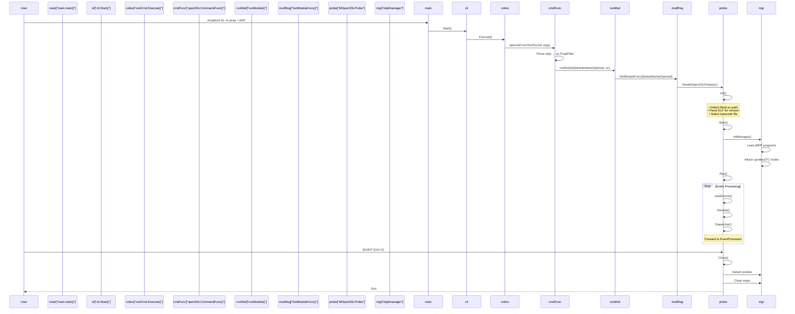

# Capture Modules

<details>
<summary>Relevant source files</summary>

The following files were used as context for generating this wiki page:

- [CHANGELOG.md](https://github.com/gojue/ecapture/blob/ca085d05/CHANGELOG.md)
- [README.md](https://github.com/gojue/ecapture/blob/ca085d05/README.md)
- [README_CN.md](https://github.com/gojue/ecapture/blob/ca085d05/README_CN.md)
- [cli/cmd/bash.go](https://github.com/gojue/ecapture/blob/ca085d05/cli/cmd/bash.go)
- [cli/cmd/gnutls.go](https://github.com/gojue/ecapture/blob/ca085d05/cli/cmd/gnutls.go)
- [cli/cmd/gotls.go](https://github.com/gojue/ecapture/blob/ca085d05/cli/cmd/gotls.go)
- [cli/cmd/mysqld.go](https://github.com/gojue/ecapture/blob/ca085d05/cli/cmd/mysqld.go)
- [cli/cmd/nspr.go](https://github.com/gojue/ecapture/blob/ca085d05/cli/cmd/nspr.go)
- [cli/cmd/postgres.go](https://github.com/gojue/ecapture/blob/ca085d05/cli/cmd/postgres.go)
- [cli/cmd/tls.go](https://github.com/gojue/ecapture/blob/ca085d05/cli/cmd/tls.go)
- [cli/cmd/zsh.go](https://github.com/gojue/ecapture/blob/ca085d05/cli/cmd/zsh.go)
- [images/ecapture-help-v0.8.9.svg](https://github.com/gojue/ecapture/blob/ca085d05/images/ecapture-help-v0.8.9.svg)
- [main.go](https://github.com/gojue/ecapture/blob/ca085d05/main.go)
- [pkg/util/ws/client.go](https://github.com/gojue/ecapture/blob/ca085d05/pkg/util/ws/client.go)
- [pkg/util/ws/client_test.go](https://github.com/gojue/ecapture/blob/ca085d05/pkg/util/ws/client_test.go)

</details>


## Overview

eCapture implements eight capture modules that provide specialized data interception capabilities for different protocols, libraries, and applications. Each module hooks specific functions using eBPF uprobes to capture plaintext data before encryption or after decryption.

The eight modules are:
- **TLS/SSL Modules**: OpenSSL/BoringSSL, GoTLS, GnuTLS, NSPR/NSS
- **System Audit Modules**: Bash, Zsh, MySQL, PostgreSQL

Each module implements the `IModule` interface and integrates with the shared eBPF engine, event processor, and output formatters. Modules are registered as CLI subcommands using Cobra and instantiated via the module registry pattern.

For detailed subsystem documentation, see:
- TLS/SSL implementations: [Page 3.1 - TLS/SSL Capture Modules]
- System auditing: [Page 3.2 - System Audit Modules]
- Network packet capture: [Page 3.3 - Network Packet Capture with TC]
- Module interface: [Page 2.5 - Module System and Lifecycle]
- Event processing: [Page 2.2 - Event Processing Pipeline]

Sources: [README.md:152-161](https://github.com/gojue/ecapture/blob/ca085d05/README.md#L152-L161), [cli/cmd/tls.go:29-48](https://github.com/gojue/ecapture/blob/ca085d05/cli/cmd/tls.go#L29-L48), [cli/cmd/gotls.go:29-40](https://github.com/gojue/ecapture/blob/ca085d05/cli/cmd/gotls.go#L29-L40)

## Module Registration Architecture

**CLI Command Registration Flow**


```mermaid
graph TB
    subgraph CLI["cli/cmd/*.go files"]
        rootCmd["rootCmd<br/>(cobra.Command)"]
        
        opensslCmd["opensslCmd = &cobra.Command<br/>Use: 'tls'<br/>Aliases: ['openssl']"]
        gotlsCmd["gotlsCmd = &cobra.Command<br/>Use: 'gotls'<br/>Aliases: ['tlsgo']"]
        gnutlsCmd["gnutlsCmd = &cobra.Command<br/>Use: 'gnutls'<br/>Aliases: ['gnu']"]
        nssCmd["nssCmd = &cobra.Command<br/>Use: 'nspr'<br/>Aliases: ['nss']"]
        bashCmd["bashCmd = &cobra.Command<br/>Use: 'bash'"]
        zshCmd["zshCmd = &cobra.Command<br/>Use: 'zsh'"]
        mysqldCmd["mysqldCmd = &cobra.Command<br/>Use: 'mysqld'"]
        postgresCmd["postgresCmd = &cobra.Command<br/>Use: 'postgres'"]
    end
    
    subgraph Config["config.New*Config()"]
        oc["oc = config.NewOpensslConfig()"]
        goc["goc = config.NewGoTLSConfig()"]
        gc["gc = config.NewGnutlsConfig()"]
        nc["nc = config.NewNsprConfig()"]
        bc["bc = config.NewBashConfig()"]
        zc["zc = config.NewZshConfig()"]
        myc["myc = config.NewMysqldConfig()"]
        pgc["pgc = config.NewPostgresConfig()"]
    end
    
    subgraph RunE["Command RunE Functions"]
        openSSLCommandFunc["openSSLCommandFunc()"]
        goTLSCommandFunc["goTLSCommandFunc()"]
        gnuTlsCommandFunc["gnuTlsCommandFunc()"]
        nssCommandFunc["nssCommandFunc()"]
        bashCommandFunc["bashCommandFunc()"]
        zshCommandFunc["zshCommandFunc()"]
        mysqldCommandFunc["mysqldCommandFunc()"]
        postgresCommandFunc["postgresCommandFunc()"]
    end
    
    subgraph ModuleNames["module.ModuleName* constants"]
        ModuleNameOpenssl["module.ModuleNameOpenssl"]
        ModuleNameGotls["module.ModuleNameGotls"]
        ModuleNameGnutls["module.ModuleNameGnutls"]
        ModuleNameNspr["module.ModuleNameNspr"]
        ModuleNameBash["module.ModuleNameBash"]
        ModuleNameZsh["module.ModuleNameZsh"]
        ModuleNameMysqld["module.ModuleNameMysqld"]
        ModuleNamePostgres["module.ModuleNamePostgres"]
    end
    
    runModule["runModule(moduleName, config)"]
    
    rootCmd --> opensslCmd
    rootCmd --> gotlsCmd
    rootCmd --> gnutlsCmd
    rootCmd --> nssCmd
    rootCmd --> bashCmd
    rootCmd --> zshCmd
    rootCmd --> mysqldCmd
    rootCmd --> postgresCmd
    
    opensslCmd --> openSSLCommandFunc
    gotlsCmd --> goTLSCommandFunc
    gnutlsCmd --> gnuTlsCommandFunc
    nssCmd --> nssCommandFunc
    bashCmd --> bashCommandFunc
    zshCmd --> zshCommandFunc
    mysqldCmd --> mysqldCommandFunc
    postgresCmd --> postgresCommandFunc
    
    oc -.->|passed to| openSSLCommandFunc
    goc -.->|passed to| goTLSCommandFunc
    gc -.->|passed to| gnuTlsCommandFunc
    nc -.->|passed to| nssCommandFunc
    bc -.->|passed to| bashCommandFunc
    zc -.->|passed to| zshCommandFunc
    myc -.->|passed to| mysqldCommandFunc
    pgc -.->|passed to| postgresCommandFunc
    
    openSSLCommandFunc --> ModuleNameOpenssl
    goTLSCommandFunc --> ModuleNameGotls
    gnuTlsCommandFunc --> ModuleNameGnutls
    nssCommandFunc --> ModuleNameNspr
    bashCommandFunc --> ModuleNameBash
    zshCommandFunc --> ModuleNameZsh
    mysqldCommandFunc --> ModuleNameMysqld
    postgresCommandFunc --> ModuleNamePostgres
    
    ModuleNameOpenssl --> runModule
    ModuleNameGotls --> runModule
    ModuleNameGnutls --> runModule
    ModuleNameNspr --> runModule
    ModuleNameBash --> runModule
    ModuleNameZsh --> runModule
    ModuleNameMysqld --> runModule
    ModuleNamePostgres --> runModule
```

Each module follows a consistent registration pattern:

1. **Command Definition**: Each `cli/cmd/*.go` file defines a `cobra.Command` struct with `Use`, `Aliases`, `Short`, `Long`, and `RunE` fields
2. **Configuration Object**: Package-level variable (e.g., `oc`, `goc`) created via `config.New*Config()` constructor
3. **Command Function**: `RunE` handler function (e.g., `openSSLCommandFunc`) processes CLI flags and invokes `runModule()`
4. **Module Constant**: String constant like `module.ModuleNameOpenssl` identifies the module implementation
5. **Registration**: `init()` function adds command to `rootCmd` and binds flags to config object

Sources: [cli/cmd/tls.go:26-67](https://github.com/gojue/ecapture/blob/ca085d05/cli/cmd/tls.go#L26-L67), [cli/cmd/gotls.go:26-58](https://github.com/gojue/ecapture/blob/ca085d05/cli/cmd/gotls.go#L26-L58), [cli/cmd/bash.go:24-55](https://github.com/gojue/ecapture/blob/ca085d05/cli/cmd/bash.go#L24-L55), [cli/cmd/mysqld.go:27-49](https://github.com/gojue/ecapture/blob/ca085d05/cli/cmd/mysqld.go#L27-L49), [cli/cmd/postgres.go:27-45](https://github.com/gojue/ecapture/blob/ca085d05/cli/cmd/postgres.go#L27-L45), [cli/cmd/nspr.go:27-51](https://github.com/gojue/ecapture/blob/ca085d05/cli/cmd/nspr.go#L27-L51), [cli/cmd/gnutls.go:29-64](https://github.com/gojue/ecapture/blob/ca085d05/cli/cmd/gnutls.go#L29-L64), [cli/cmd/zsh.go:27-57](https://github.com/gojue/ecapture/blob/ca085d05/cli/cmd/zsh.go#L27-L57)

## Module Categories and Capabilities

eCapture's eight modules are organized into three functional categories:

### TLS/SSL Encryption Libraries

Five modules intercept cryptographic library functions to capture plaintext before encryption or after decryption:

| Module | CLI Command | Target Library | Hook Functions | Supported Versions |
|--------|-------------|----------------|----------------|-------------------|
| **OpenSSL/BoringSSL** | `tls`, `openssl` | libssl.so, libcrypto.so | `SSL_read`, `SSL_write`, `SSL_do_handshake`, `SSL_get_wbio` | OpenSSL 1.0.2-3.5.x, BoringSSL Android 12-16 |
| **Go TLS** | `gotls`, `tlsgo` | crypto/tls (built-in) | `crypto/tls.(*Conn).Read`, `crypto/tls.(*Conn).Write` | All Go versions (1.x-1.24+) |
| **GnuTLS** | `gnutls`, `gnu` | libgnutls.so | `gnutls_record_recv`, `gnutls_record_send` | GnuTLS 3.x |
| **NSPR/NSS** | `nspr`, `nss` | libnspr4.so, libnss3.so | `PR_Read`, `PR_Write` | All NSS versions |

**Capture Modes**: TLS/SSL modules support three modes via `-m` flag:
- `text`: Direct plaintext output with HTTP/1.x/HTTP2 parsing
- `pcap`/`pcapng`: Network packets with embedded TLS keys in PCAPNG DSB
- `keylog`/`key`: Master secret extraction in SSLKEYLOGFILE format

Sources: [cli/cmd/tls.go:32-33](https://github.com/gojue/ecapture/blob/ca085d05/cli/cmd/tls.go#L32-L33), [cli/cmd/gotls.go:32-33](https://github.com/gojue/ecapture/blob/ca085d05/cli/cmd/gotls.go#L32-L33), [cli/cmd/gnutls.go:35-36](https://github.com/gojue/ecapture/blob/ca085d05/cli/cmd/gnutls.go#L35-L36), [cli/cmd/nspr.go:32-33](https://github.com/gojue/ecapture/blob/ca085d05/cli/cmd/nspr.go#L32-L33), [README.md:163-176](https://github.com/gojue/ecapture/blob/ca085d05/README.md#L163-L176)

### System Audit Modules

Four modules hook into command interpreters and database servers:

| Module | CLI Command | Target Binary | Hook Functions | Data Captured |
|--------|-------------|---------------|----------------|---------------|
| **Bash** | `bash` | /bin/bash | `readline()` from libreadline.so | Command input, return value, errno |
| **Zsh** | `zsh` | /bin/zsh | `zle_line_finish()` | Command input, execution result |
| **MySQL** | `mysqld` | /usr/sbin/mysqld, /usr/sbin/mariadbd | `dispatch_command()` | SQL query text, connection ID |
| **PostgreSQL** | `postgres` | /usr/bin/postgres | `exec_simple_query()` | SQL statements |

**Filtering**: Bash and Zsh support `-e`/`--errnumber` flag to filter by command exit status.

Sources: [cli/cmd/bash.go:28-32](https://github.com/gojue/ecapture/blob/ca085d05/cli/cmd/bash.go#L28-L32), [cli/cmd/zsh.go:31-35](https://github.com/gojue/ecapture/blob/ca085d05/cli/cmd/zsh.go#L31-L35), [cli/cmd/mysqld.go:31-36](https://github.com/gojue/ecapture/blob/ca085d05/cli/cmd/mysqld.go#L31-L36), [cli/cmd/postgres.go:31-33](https://github.com/gojue/ecapture/blob/ca085d05/cli/cmd/postgres.go#L31-L33)

### Network Packet Capture

TLS/SSL modules integrate with Traffic Control (TC) eBPF classifiers when using pcap mode:

- **TC Probe**: Attaches to network interface via `-i`/`--ifname` flag
- **BPF Filtering**: Supports pcap filter expressions (e.g., `tcp port 443`)
- **Connection Tracking**: Uses kprobe on `tcp_sendmsg`/`udp_sendmsg` for PID/UID mapping
- **Protocol Support**: IPv4/IPv6, TCP/UDP, ICMP

See [Page 3.3 - Network Packet Capture with TC] for implementation details.

Sources: [cli/cmd/tls.go:56](https://github.com/gojue/ecapture/blob/ca085d05/cli/cmd/tls.go#L56), [cli/cmd/gotls.go:47](https://github.com/gojue/ecapture/blob/ca085d05/cli/cmd/gotls.go#L47), [CHANGELOG.md:153](https://github.com/gojue/ecapture/blob/ca085d05/CHANGELOG.md#L153)

## Module Implementation Structure

**Module Class Hierarchy and Hook Points**


```mermaid
graph TB
    subgraph TLS["TLS/SSL Module Implementations"]
        direction TB
        
        MOpenSSL["MOpenSSLProbe struct"]
        MOpenSSL_hooks["Uprobe Hooks:<br/>• SSL_read (entry + return)<br/>• SSL_write (entry + return)<br/>• SSL_do_handshake (entry)<br/>• SSL_get_wbio (master key)<br/>• SSL_in_before (master key)"]
        
        MGoTLS["MGoTLSProbe struct"]
        MGoTLS_hooks["Uprobe Hooks:<br/>• crypto/tls.(*Conn).Read<br/>• crypto/tls.(*Conn).Write<br/>• crypto/tls.(*Config).writeKeyLog<br/>ELF Analysis:<br/>• .gopclntab parsing<br/>• PIE offset calculation"]
        
        MGnuTLS["MGnuTLSProbe struct"]
        MGnuTLS_hooks["Uprobe Hooks:<br/>• gnutls_record_recv<br/>• gnutls_record_send<br/>• gnutls_handshake (keylog)<br/>Early Secret Support:<br/>• TLS 1.3 0-RTT secrets"]
        
        MNSPR["MNSPRProbe struct"]
        MNSPR_hooks["Uprobe Hooks:<br/>• PR_Read<br/>• PR_Write<br/>Target Apps:<br/>• Firefox<br/>• Thunderbird"]
        
        MOpenSSL --> MOpenSSL_hooks
        MGoTLS --> MGoTLS_hooks
        MGnuTLS --> MGnuTLS_hooks
        MNSPR --> MNSPR_hooks
    end
    
    subgraph Audit["System Audit Module Implementations"]
        direction TB
        
        MBash["MBashProbe struct"]
        MBash_hooks["Uprobe Hook:<br/>• readline() from libreadline.so<br/>Uretprobe:<br/>• readline() return value<br/>Captures:<br/>• Command text<br/>• Exit errno"]
        
        MZsh["MZshProbe struct"]
        MZsh_hooks["Uprobe Hook:<br/>• zle_line_finish()<br/>Captures:<br/>• Command text<br/>• Execution status"]
        
        MMySQL["MMysqldProbe struct"]
        MMySQL_hooks["Uprobe Hook:<br/>• dispatch_command()<br/>• COM_QUERY handler<br/>Versions:<br/>• MySQL 5.6/5.7/8.0<br/>• MariaDB 10.5+"]
        
        MPostgres["MPostgresProbe struct"]
        MPostgres_hooks["Uprobe Hook:<br/>• exec_simple_query()<br/>Versions:<br/>• PostgreSQL 10+"]
        
        MBash --> MBash_hooks
        MZsh --> MZsh_hooks
        MMySQL --> MMySQL_hooks
        MPostgres --> MPostgres_hooks
    end
```

All module structs embed common functionality through the `Module` base struct and implement the `IModule` interface with these methods:

- `Init()`: Initialize module, detect target binary/library, load eBPF bytecode
- `Start()`: Attach eBPF probes to hook points
- `Run()`: Start event loop, process captured data
- `Close()`: Cleanup, detach probes, close resources
- `Decode()`: Parse raw eBPF event data into typed event structs
- `Dispatcher()`: Route events to appropriate processors

Sources: [README.md:36-43](https://github.com/gojue/ecapture/blob/ca085d05/README.md#L36-L43), [cli/cmd/tls.go:29-48](https://github.com/gojue/ecapture/blob/ca085d05/cli/cmd/tls.go#L29-L48), [cli/cmd/gotls.go:29-40](https://github.com/gojue/ecapture/blob/ca085d05/cli/cmd/gotls.go#L29-L40), [cli/cmd/gnutls.go:32-45](https://github.com/gojue/ecapture/blob/ca085d05/cli/cmd/gnutls.go#L32-L45), [cli/cmd/nspr.go:30-40](https://github.com/gojue/ecapture/blob/ca085d05/cli/cmd/nspr.go#L30-L40), [cli/cmd/bash.go:27-33](https://github.com/gojue/ecapture/blob/ca085d05/cli/cmd/bash.go#L27-L33), [cli/cmd/zsh.go:30-36](https://github.com/gojue/ecapture/blob/ca085d05/cli/cmd/zsh.go#L30-L36), [cli/cmd/mysqld.go:30-36](https://github.com/gojue/ecapture/blob/ca085d05/cli/cmd/mysqld.go#L30-L36), [cli/cmd/postgres.go:30-33](https://github.com/gojue/ecapture/blob/ca085d05/cli/cmd/postgres.go#L30-L33)

## Module-Specific Features

### OpenSSL/BoringSSL Module (`tls`)

**Command**: `ecapture tls [flags] [pcap filter expression]`

**Key Features**:
- **Automatic Version Detection**: Parses ELF `.rodata` section to extract version string from libssl.so
- **Version Support**: OpenSSL 1.0.2a-1.1.1w, 3.0.0-3.5.x; BoringSSL Android 12-16
- **Downgrade Strategy**: Iterative version string truncation for closest bytecode match
- **Three Modes**: `-m text`, `-m pcap`, `-m keylog`

**Hook Functions**:
- `SSL_read()`: Capture decrypted data
- `SSL_write()`: Capture plaintext before encryption
- `SSL_do_handshake()`: Intercept handshake for connection tracking
- `SSL_get_wbio()`: Extract master key for TLS 1.2
- `SSL_in_before()`: Extract early secrets for TLS 1.3

**Library Detection**: Searches `/etc/ld.so.conf` and common paths (`/usr/lib*/libssl.so*`). Override with `--libssl` flag.

**Example**:
```
ecapture tls -m pcap -i eth0 -w capture.pcapng tcp port 443
```

Sources: [cli/cmd/tls.go:29-67](https://github.com/gojue/ecapture/blob/ca085d05/cli/cmd/tls.go#L29-L67), [README.md:163-229](https://github.com/gojue/ecapture/blob/ca085d05/README.md#L163-L229), [CHANGELOG.md:14-15,98-99]()

### Go TLS Module (`gotls`)

**Command**: `ecapture gotls --elfpath=/path/to/binary [flags]`

**Key Features**:
- **ELF Parsing**: Locates TLS functions via `.gopclntab` section
- **PIE Binary Support**: Calculates runtime offsets for Position Independent Executables
- **ABI Versions**: Supports both stack-based (Go <1.17) and register-based (Go ≥1.17) ABIs
- **Three Modes**: `-m text`, `-m pcap`, `-m keylog`

**Hook Functions**:
- `crypto/tls.(*Conn).Read()`: Capture decrypted data
- `crypto/tls.(*Conn).Write()`: Capture plaintext
- `crypto/tls.(*Config).writeKeyLog()`: Extract master secrets

**Example**:
```
ecapture gotls --elfpath=/usr/bin/myapp -m keylog -k keys.log
```

Sources: [cli/cmd/gotls.go:29-58](https://github.com/gojue/ecapture/blob/ca085d05/cli/cmd/gotls.go#L29-L58), [README.md:254-276](https://github.com/gojue/ecapture/blob/ca085d05/README.md#L254-L276), [CHANGELOG.md:21](https://github.com/gojue/ecapture/blob/ca085d05/CHANGELOG.md#L21)

### GnuTLS Module (`gnutls`)

**Command**: `ecapture gnutls [flags]`

**Key Features**:
- **Target Applications**: wget, curl (when built with GnuTLS)
- **Early Secret Support**: Captures TLS 1.3 early traffic secrets for 0-RTT data
- **Three Modes**: `-m text`, `-m pcap`, `-m keylog`

**Hook Functions**:
- `gnutls_record_recv()`: Capture decrypted data
- `gnutls_record_send()`: Capture plaintext
- `gnutls_handshake()`: Extract session keys

**Library Detection**: Auto-detects libgnutls.so. Override with `--gnutls` flag.

Sources: [cli/cmd/gnutls.go:32-64](https://github.com/gojue/ecapture/blob/ca085d05/cli/cmd/gnutls.go#L32-L64), [CHANGELOG.md:126](https://github.com/gojue/ecapture/blob/ca085d05/CHANGELOG.md#L126)

### NSPR/NSS Module (`nspr`)

**Command**: `ecapture nspr [flags]`

**Key Features**:
- **Target Applications**: Firefox, Thunderbird, Chrome (on some Linux distros)
- **NSS Versions**: All versions using NSPR I/O layer

**Hook Functions**:
- `PR_Read()`: Capture decrypted data from NSPR sockets
- `PR_Write()`: Capture plaintext before encryption

**Library Detection**: Auto-detects libnspr4.so. Override with `--nspr` flag.

**Note**: TLS key extraction not supported in current version; text mode only.

Sources: [cli/cmd/nspr.go:30-51](https://github.com/gojue/ecapture/blob/ca085d05/cli/cmd/nspr.go#L30-L51), [README.md:158](https://github.com/gojue/ecapture/blob/ca085d05/README.md#L158), [CHANGELOG.md:402](https://github.com/gojue/ecapture/blob/ca085d05/CHANGELOG.md#L402)

### Bash Module (`bash`)

**Command**: `ecapture bash [--errnumber=N]`

**Key Features**:
- **Command Capture**: Intercepts all commands entered in Bash shell
- **Return Value Tracking**: Captures command exit status via uretprobe
- **Errno Filtering**: `-e`/`--errnumber` flag filters commands by exit code (default: all commands)

**Hook Functions**:
- `readline()` from libreadline.so: Entry probe captures command text
- `readline()` return: Uretprobe captures return address and errno

**Auto-Detection**: Uses `$SHELL` environment variable. Override with `--bash` flag.

Sources: [cli/cmd/bash.go:27-55](https://github.com/gojue/ecapture/blob/ca085d05/cli/cmd/bash.go#L27-L55), [README.md:153](https://github.com/gojue/ecapture/blob/ca085d05/README.md#L153)

### Zsh Module (`zsh`)

**Command**: `ecapture zsh [--errnumber=N]`

**Key Features**:
- **Zsh-Specific Hooks**: Targets zsh's line editor (zle) functions
- **Command Tracking**: Captures command text and execution result
- **Platform**: Linux only (excluded from Android via `//go:build !androidgki`)

**Hook Functions**:
- `zle_line_finish()`: Captures completed command line

**Auto-Detection**: Uses `$SHELL` environment variable. Override with `--zsh` flag.

Sources: [cli/cmd/zsh.go:30-57](https://github.com/gojue/ecapture/blob/ca085d05/cli/cmd/zsh.go#L30-L57), [CHANGELOG.md:369](https://github.com/gojue/ecapture/blob/ca085d05/CHANGELOG.md#L369)

### MySQL Module (`mysqld`)

**Command**: `ecapture mysqld [--mysqld=/path/to/mysqld] [--funcname=dispatch_command]`

**Key Features**:
- **Version Support**: MySQL 5.6, 5.7, 8.0; MariaDB 10.5+
- **Query Capture**: Intercepts SQL queries at protocol dispatch layer
- **Offset Customization**: `--offset` flag for non-standard builds

**Hook Functions**:
- `dispatch_command()`: Main SQL query dispatcher
- `COM_QUERY` handler: Captures query text

**Detection**: Default paths `/usr/sbin/mysqld`, `/usr/sbin/mariadbd`.

Sources: [cli/cmd/mysqld.go:30-49](https://github.com/gojue/ecapture/blob/ca085d05/cli/cmd/mysqld.go#L30-L49), [README.md:157](https://github.com/gojue/ecapture/blob/ca085d05/README.md#L157)

### PostgreSQL Module (`postgres`)

**Command**: `ecapture postgres [--postgres=/path/to/postgres] [--funcname=exec_simple_query]`

**Key Features**:
- **Version Support**: PostgreSQL 10 and newer
- **Query Capture**: Intercepts simple query execution path

**Hook Functions**:
- `exec_simple_query()`: Main query execution entry point

**Detection**: Default path `/usr/bin/postgres`.

Sources: [cli/cmd/postgres.go:30-45](https://github.com/gojue/ecapture/blob/ca085d05/cli/cmd/postgres.go#L30-L45), [README.md:159](https://github.com/gojue/ecapture/blob/ca085d05/README.md#L159)

## Common Configuration Parameters

All modules accept these shared flags defined in `BaseConfig`:

| Flag | Type | Description | Default |
|------|------|-------------|---------|
| `--pid` | uint64 | Target specific process ID | 0 (all processes) |
| `--uid` | uint64 | Target specific user ID | 0 (all users) |
| `-l`, `--logaddr` | string | Output file path | "" (stdout) |
| `--hex` | bool | Display payload in hexadecimal | false |
| `--btf` | string | BTF file path for non-CO-RE mode | "" (auto) |
| `--mapsize` | uint64 | eBPF map size in KB | 5120 |

**TLS/SSL Module-Specific Flags**:

| Flag | Modules | Description | Default |
|------|---------|-------------|---------|
| `-m`, `--model` | tls, gotls, gnutls | Capture mode: text/pcap/keylog | "text" |
| `-w`, `--pcapfile` | tls, gotls, gnutls | PCAPNG output file | "save.pcapng" |
| `-k`, `--keylogfile` | tls, gotls, gnutls | Key log file (SSLKEYLOGFILE format) | "ecapture_*_key.log" |
| `-i`, `--ifname` | tls, gotls, gnutls | Network interface for TC probe | "" (required for pcap mode) |
| `--libssl` | tls | Path to libssl.so | Auto-detect |
| `--ssl_version` | tls, gnutls | Force specific version | Auto-detect |
| `--elfpath` | gotls | Path to Go binary | Required |

**System Audit Module-Specific Flags**:

| Flag | Modules | Description | Default |
|------|---------|-------------|---------|
| `--bash` | bash | Path to bash binary | $SHELL |
| `--zsh` | zsh | Path to zsh binary | $SHELL |
| `-e`, `--errnumber` | bash, zsh | Filter by exit code | 0 (all) |
| `--mysqld` | mysqld | Path to mysqld binary | /usr/sbin/mariadbd |
| `--postgres` | postgres | Path to postgres binary | /usr/bin/postgres |
| `-f`, `--funcname` | mysqld, postgres | Target function name | dispatch_command/exec_simple_query |
| `--offset` | mysqld | Manual function offset | 0 |

Sources: [cli/cmd/tls.go:50-58](https://github.com/gojue/ecapture/blob/ca085d05/cli/cmd/tls.go#L50-L58), [cli/cmd/gotls.go:42-48](https://github.com/gojue/ecapture/blob/ca085d05/cli/cmd/gotls.go#L42-L48), [cli/cmd/bash.go:36-38](https://github.com/gojue/ecapture/blob/ca085d05/cli/cmd/bash.go#L36-L38), [cli/cmd/mysqld.go:40-42](https://github.com/gojue/ecapture/blob/ca085d05/cli/cmd/mysqld.go#L40-L42)

## TLS/SSL Module Output Modes

TLS/SSL modules (tls, gotls, gnutls) support three output modes via `-m`/`--model` flag:

### Text Mode (`-m text`)

**Default mode**. Captures and displays plaintext data directly to console or file.

**Features**:
- HTTP/1.x request/response parsing with headers
- HTTP/2 frame parsing with HPACK header decompression
- Automatic gzip decompression for `Content-Encoding: gzip`
- Color-coded output (requests in green, responses in blue)
- UUID-based connection tracking

**Output Destination**: stdout or file specified by `-l` flag.

### PCAP Mode (`-m pcap`)

Captures network packets and saves them in PCAPNG format with embedded TLS keys.

**Features**:
- Requires `-i`/`--ifname` to specify network interface
- Embeds TLS master secrets in Decryption Secrets Block (DSB)
- Supports optional BPF filter expressions (e.g., `tcp port 443`)
- Compatible with Wireshark for direct decryption
- IPv4/IPv6 support

**Output**: File specified by `-w`/`--pcapfile` flag.

**Example**:
```
ecapture tls -m pcap -i eth0 -w capture.pcapng host 192.168.1.100 and tcp port 443
```

### Keylog Mode (`-m keylog`)

Extracts TLS master secrets only without capturing data payloads.

**Features**:
- Saves keys in SSLKEYLOGFILE format compatible with Wireshark/tshark
- TLS 1.2: `CLIENT_RANDOM` with master key
- TLS 1.3: Multiple secrets (early, handshake, traffic)
- Can be combined with tcpdump for offline decryption

**Output**: File specified by `-k`/`--keylogfile` flag.

**Example**:
```
# Terminal 1: Capture keys
ecapture tls -m keylog -k keys.log

# Terminal 2: Decrypt with tshark
tshark -o tls.keylog_file:keys.log -Y http -T fields -e http.file_data -i eth0
```

Sources: [cli/cmd/tls.go:53-56](https://github.com/gojue/ecapture/blob/ca085d05/cli/cmd/tls.go#L53-L56), [README.md:171-247](https://github.com/gojue/ecapture/blob/ca085d05/README.md#L171-L247), [CHANGELOG.md:687-743](https://github.com/gojue/ecapture/blob/ca085d05/CHANGELOG.md#L687-L743)

## Module Lifecycle and Execution Flow

**Module Invocation Sequence Diagram**


```mermaid
sequenceDiagram
    participant User
    participant main["main.main()"]
    participant cli["cli.Start()"]
    participant cobra["rootCmd.Execute()"]
    participant cmdFunc["openSSLCommandFunc()"]
    participant runMod["runModule()"]
    participant modReg["GetModuleFunc()"]
    participant probe["MOpenSSLProbe"]
    participant mgr["ebpfmanager"]
    
    User->>main: ./ecapture tls -m pcap -i eth0
    main->>cli: Start()
    cli->>cobra: Execute()
    cobra->>cmdFunc: opensslCmd.RunE(cmd, args)
    
    cmdFunc->>cmdFunc: Parse args → oc.PcapFilter
    cmdFunc->>runMod: runModule(ModuleNameOpenssl, oc)
    
    runMod->>modReg: GetModuleFunc(ModuleNameOpenssl)
    modReg->>probe: NewMOpenSSLProbe(oc)
    
    probe->>probe: Init()
    Note over probe: • Detect libssl.so path<br/>• Parse ELF for version<br/>• Select bytecode file
    
    probe->>probe: Start()
    probe->>mgr: InitManager()
    mgr->>mgr: Load eBPF programs
    mgr->>mgr: Attach uprobes/TC hooks
    
    probe->>probe: Run()
    loop Event Processing
        probe->>probe: readEvents()
        probe->>probe: Decode()
        probe->>probe: Dispatcher()
        Note over probe: Forward to EventProcessor
    end
    
    User->>probe: SIGINT (Ctrl+C)
    probe->>probe: Close()
    probe->>mgr: Detach probes
    probe->>mgr: Close maps
    probe-->>User: Exit
```

**Execution Steps**:

1. **Entry Point**: `main.main()` calls `cli.Start()` → [main.go:9-11](https://github.com/gojue/ecapture/blob/ca085d05/main.go#L9-L11)
2. **Command Routing**: Cobra framework executes matched subcommand's `RunE` function
3. **Config Preparation**: Command function parses flags, creates config object (e.g., `OpensslConfig`)
4. **Module Lookup**: `runModule()` retrieves module factory function from registry
5. **Module Construction**: Factory creates module instance (e.g., `MOpenSSLProbe`)
6. **Initialization**: `Init()` method detects target binary, selects eBPF bytecode
7. **Probe Attachment**: `Start()` loads eBPF programs and attaches to hook points
8. **Event Loop**: `Run()` processes events until signal received
9. **Cleanup**: `Close()` detaches probes and releases resources

Sources: [main.go:1-11](https://github.com/gojue/ecapture/blob/ca085d05/main.go#L1-L11), [cli/cmd/tls.go:62-67](https://github.com/gojue/ecapture/blob/ca085d05/cli/cmd/tls.go#L62-L67), [cli/cmd/gotls.go:52-58](https://github.com/gojue/ecapture/blob/ca085d05/cli/cmd/gotls.go#L52-L58)

## Platform-Specific Module Availability

Modules use Go build tags to control platform compilation:

**Build Tag: `//go:build !androidgki`**

Five modules are excluded from Android GKI (Generic Kernel Image) builds:

| Module | File | Reason for Exclusion |
|--------|------|---------------------|
| GnuTLS | [cli/cmd/gnutls.go:1-2](https://github.com/gojue/ecapture/blob/ca085d05/cli/cmd/gnutls.go#L1-L2) | Library not available on Android |
| NSPR/NSS | [cli/cmd/nspr.go:1-2](https://github.com/gojue/ecapture/blob/ca085d05/cli/cmd/nspr.go#L1-L2) | Mozilla libraries not on Android |
| MySQL | [cli/cmd/mysqld.go:1-2](https://github.com/gojue/ecapture/blob/ca085d05/cli/cmd/mysqld.go#L1-L2) | Server software not on Android |
| PostgreSQL | [cli/cmd/postgres.go:1-2](https://github.com/gojue/ecapture/blob/ca085d05/cli/cmd/postgres.go#L1-L2) | Server software not on Android |
| Zsh | [cli/cmd/zsh.go:1-2](https://github.com/gojue/ecapture/blob/ca085d05/cli/cmd/zsh.go#L1-L2) | Shell not on Android |

**Universal Modules** (Linux + Android):

- OpenSSL/BoringSSL (`tls`): Supports both OpenSSL on Linux and BoringSSL on Android
- Go TLS (`gotls`): Go binaries run on both platforms
- Bash (`bash`): Available on both Linux and Android (via Termux)

**Platform Detection**: Build system automatically selects appropriate modules based on target platform specified during compilation.

Sources: [cli/cmd/gnutls.go:1-2](https://github.com/gojue/ecapture/blob/ca085d05/cli/cmd/gnutls.go#L1-L2), [cli/cmd/nspr.go:1-2](https://github.com/gojue/ecapture/blob/ca085d05/cli/cmd/nspr.go#L1-L2), [cli/cmd/mysqld.go:1-2](https://github.com/gojue/ecapture/blob/ca085d05/cli/cmd/mysqld.go#L1-L2), [cli/cmd/postgres.go:1-2](https://github.com/gojue/ecapture/blob/ca085d05/cli/cmd/postgres.go#L1-L2), [cli/cmd/zsh.go:1-2](https://github.com/gojue/ecapture/blob/ca085d05/cli/cmd/zsh.go#L1-L2)

## Version History and Evolution

Recent module enhancements documented in the changelog:

- **v1.5.0**: OpenSSL 3.5.4 support, Android 16 BoringSSL, HTTP/2 parser improvements
- **v1.4.0**: WebSocket event forwarding, OpenSSL version downgrade logic
- **v1.3.0**: GnuTLS early secret support, keylog improvements
- **v1.2.0**: Dual lifecycle management for event workers
- **v1.0.0**: Stable release with multi-protocol support
- **v0.9.0**: Zsh command capture, connection cleanup improvements
- **v0.7.0**: Module split (OpenSSL/GnuTLS/NSPR separated), keylog mode introduced

Sources: [CHANGELOG.md:11-757](https://github.com/gojue/ecapture/blob/ca085d05/CHANGELOG.md#L11-L757)