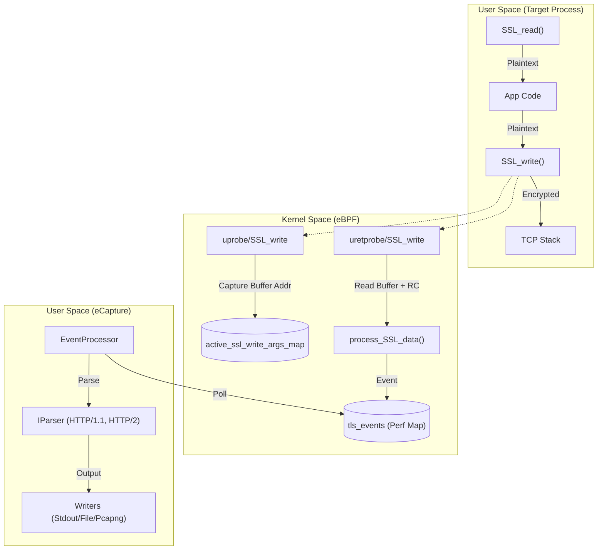
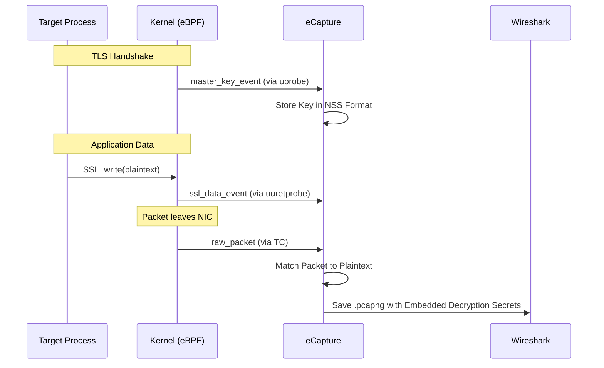

# TLS/SSL Plaintext Capture (OpenSSL / BoringSSL)

<details>
<summary>Relevant source files</summary>

The following files were used as context for generating this wiki page:

- [.github/agents/pr-agent.md](https://github.com/gojue/ecapture/blob/943a19fe/.github/agents/pr-agent.md)
- [cli/cmd/gnutls.go](https://github.com/gojue/ecapture/blob/943a19fe/cli/cmd/gnutls.go)
- [cli/cmd/gotls.go](https://github.com/gojue/ecapture/blob/943a19fe/cli/cmd/gotls.go)
- [cli/cmd/nss.go](https://github.com/gojue/ecapture/blob/943a19fe/cli/cmd/nss.go)
- [cli/cmd/tls.go](https://github.com/gojue/ecapture/blob/943a19fe/cli/cmd/tls.go)
- [internal/probe/bash/bash_probe.go](https://github.com/gojue/ecapture/blob/943a19fe/internal/probe/bash/bash_probe.go)
- [internal/probe/gotls/config_iface.go](https://github.com/gojue/ecapture/blob/943a19fe/internal/probe/gotls/config_iface.go)
- [internal/probe/gotls/config_iface_test.go](https://github.com/gojue/ecapture/blob/943a19fe/internal/probe/gotls/config_iface_test.go)
- [internal/probe/mysql/mysql_probe.go](https://github.com/gojue/ecapture/blob/943a19fe/internal/probe/mysql/mysql_probe.go)
- [internal/probe/openssl/config_ecandroid.go](https://github.com/gojue/ecapture/blob/943a19fe/internal/probe/openssl/config_ecandroid.go)
- [internal/probe/openssl/config_iface.go](https://github.com/gojue/ecapture/blob/943a19fe/internal/probe/openssl/config_iface.go)
- [internal/probe/openssl/config_iface_test.go](https://github.com/gojue/ecapture/blob/943a19fe/internal/probe/openssl/config_iface_test.go)
- [internal/probe/openssl/config_linux.go](https://github.com/gojue/ecapture/blob/943a19fe/internal/probe/openssl/config_linux.go)
- [internal/probe/openssl/openssl_probe.go](https://github.com/gojue/ecapture/blob/943a19fe/internal/probe/openssl/openssl_probe.go)
- [internal/probe/postgres/postgres_probe.go](https://github.com/gojue/ecapture/blob/943a19fe/internal/probe/postgres/postgres_probe.go)
- [internal/probe/zsh/zsh_probe.go](https://github.com/gojue/ecapture/blob/943a19fe/internal/probe/zsh/zsh_probe.go)
- [kern/boringssl_const.h](https://github.com/gojue/ecapture/blob/943a19fe/kern/boringssl_const.h)
- [kern/boringssl_masterkey.h](https://github.com/gojue/ecapture/blob/943a19fe/kern/boringssl_masterkey.h)
- [kern/gnutls.h](https://github.com/gojue/ecapture/blob/943a19fe/kern/gnutls.h)
- [kern/gnutls_masterkey.h](https://github.com/gojue/ecapture/blob/943a19fe/kern/gnutls_masterkey.h)
- [kern/go_argument.h](https://github.com/gojue/ecapture/blob/943a19fe/kern/go_argument.h)
- [kern/include/openssl_masterkey_common.h](https://github.com/gojue/ecapture/blob/943a19fe/kern/include/openssl_masterkey_common.h)
- [kern/include/tls_constants.h](https://github.com/gojue/ecapture/blob/943a19fe/kern/include/tls_constants.h)
- [kern/openssl.h](https://github.com/gojue/ecapture/blob/943a19fe/kern/openssl.h)
- [kern/openssl_1_0_2a_kern.c](https://github.com/gojue/ecapture/blob/943a19fe/kern/openssl_1_0_2a_kern.c)
- [kern/openssl_1_1_0a_kern.c](https://github.com/gojue/ecapture/blob/943a19fe/kern/openssl_1_1_0a_kern.c)
- [kern/openssl_1_1_1b_kern.c](https://github.com/gojue/ecapture/blob/943a19fe/kern/openssl_1_1_1b_kern.c)
- [kern/openssl_1_1_1d_kern.c](https://github.com/gojue/ecapture/blob/943a19fe/kern/openssl_1_1_1d_kern.c)
- [kern/openssl_1_1_1j_kern.c](https://github.com/gojue/ecapture/blob/943a19fe/kern/openssl_1_1_1j_kern.c)
- [kern/openssl_3_0_0_kern.c](https://github.com/gojue/ecapture/blob/943a19fe/kern/openssl_3_0_0_kern.c)
- [kern/openssl_masterkey.h](https://github.com/gojue/ecapture/blob/943a19fe/kern/openssl_masterkey.h)
- [kern/openssl_masterkey_3.0.h](https://github.com/gojue/ecapture/blob/943a19fe/kern/openssl_masterkey_3.0.h)
- [kern/openssl_masterkey_3.2.h](https://github.com/gojue/ecapture/blob/943a19fe/kern/openssl_masterkey_3.2.h)
- [kern/zsh_kern.c](https://github.com/gojue/ecapture/blob/943a19fe/kern/zsh_kern.c)
- [test/e2e/android/android_tls_e2e_test.sh](https://github.com/gojue/ecapture/blob/943a19fe/test/e2e/android/android_tls_e2e_test.sh)
- [utils/openssl_offset_1.0.2.sh](https://github.com/gojue/ecapture/blob/943a19fe/utils/openssl_offset_1.0.2.sh)
- [utils/openssl_offset_1.1.0.sh](https://github.com/gojue/ecapture/blob/943a19fe/utils/openssl_offset_1.1.0.sh)
- [utils/openssl_offset_1.1.1.sh](https://github.com/gojue/ecapture/blob/943a19fe/utils/openssl_offset_1.1.1.sh)
- [utils/openssl_offset_3.0.sh](https://github.com/gojue/ecapture/blob/943a19fe/utils/openssl_offset_3.0.sh)
- [utils/openssl_offset_3.1.sh](https://github.com/gojue/ecapture/blob/943a19fe/utils/openssl_offset_3.1.sh)
- [utils/openssl_offset_3.2.sh](https://github.com/gojue/ecapture/blob/943a19fe/utils/openssl_offset_3.2.sh)
- [utils/openssl_offset_3.3.sh](https://github.com/gojue/ecapture/blob/943a19fe/utils/openssl_offset_3.3.sh)
- [utils/openssl_offset_3.4.sh](https://github.com/gojue/ecapture/blob/943a19fe/utils/openssl_offset_3.4.sh)

</details>


The `tls` probe is eCapture's primary module for intercepting plaintext communication from applications using **OpenSSL** or **BoringSSL** libraries. By utilizing eBPF `uprobes`, eCapture hooks into the library's read/write functions to capture data after decryption (for ingress) or before encryption (for egress), eliminating the need for CA certificate installation or proxy configuration.

## Implementation Overview

The probe operates by attaching eBPF programs to the symbol table of target shared libraries (e.g., `libssl.so`). It hooks the primary data processing functions `SSL_read` and `SSL_write`.

### Hooking Mechanism
1.  **Entry Hooks**: Attached to the start of `SSL_read` and `SSL_write`. These hooks capture the function arguments (buffer pointer and file descriptor) and store them in a BPF map indexed by the Thread ID (TID) [kern/openssl.h:97-110](https://github.com/gojue/ecapture/blob/943a19fe/kern/openssl.h#L97-L110).
2.  **Return Hooks (uuretprobes)**: Attached to the return point of these functions. These hooks retrieve the previously stored buffer pointer, read the now-populated plaintext data from user space, and send it to the userspace control plane via a Perf Event Array [kern/openssl.h:163-190](https://github.com/gojue/ecapture/blob/943a19fe/kern/openssl.h#L163-L190).

### Data Flow Architecture

The following diagram illustrates the lifecycle of a TLS data capture event:

**TLS Capture Data Path**

Sources: [kern/openssl.h:163-190](https://github.com/gojue/ecapture/blob/943a19fe/kern/openssl.h#L163-L190), [internal/probe/openssl/openssl_probe.go:1-50](https://github.com/gojue/ecapture/blob/943a19fe/internal/probe/openssl/openssl_probe.go#L1-L50), [cli/cmd/tls.go:29-48](https://github.com/gojue/ecapture/blob/943a19fe/cli/cmd/tls.go#L29-L48)

## Supported Versions and Discovery

eCapture supports a wide range of OpenSSL and BoringSSL versions by maintaining a mapping of internal structure offsets (such as `SSL_ST_VERSION`, `SSL_ST_S3`, and `SSL_SESSION_ST_MASTER_KEY`).

### Supported Ranges
*   **OpenSSL**: 1.0.2, 1.1.0, 1.1.1, and 3.0.x through 3.x [cli/cmd/tls.go:32-32](https://github.com/gojue/ecapture/blob/943a19fe/cli/cmd/tls.go#L32-L32).
*   **BoringSSL**: Commonly found in Android and Chromium-based applications.

### Automatic Discovery
The probe attempts to locate the `libssl.so` path automatically using system defaults (e.g., via `ldconfig` or common paths used by `curl`) [cli/cmd/tls.go:51-51](https://github.com/gojue/ecapture/blob/943a19fe/cli/cmd/tls.go#L51-L51). Users can manually specify a path using the `--libssl` flag.

## Android BoringSSL Handling

Android utilizes BoringSSL, which often lacks standard symbol tables in production builds or uses non-standard offsets across different Android versions (GKI). eCapture includes specialized handling for:
*   **Version Branches**: Specific support for Android 13 (`a_13`) through Android 16 (`a_16`) and `na` branches [kern/boringssl_masterkey.h:84-84](https://github.com/gojue/ecapture/blob/943a19fe/kern/boringssl_masterkey.h#L84-L84).
*   **Master Secret Capture**: For TLS 1.3, eCapture hooks internal BoringSSL handshake states to extract the `client_random` and traffic secrets [kern/boringssl_masterkey.h:33-52](https://github.com/gojue/ecapture/blob/943a19fe/kern/boringssl_masterkey.h#L33-L52).

## Output Modes

The `tls` probe supports three distinct output models configured via the `-m` or `--model` flag [cli/cmd/tls.go:53-53](https://github.com/gojue/ecapture/blob/943a19fe/cli/cmd/tls.go#L53-L53).

| Mode | CLI Flag | Description | Use Case |
| :--- | :--- | :--- | :--- |
| **Text** | `-m text` | Direct plaintext output to console or log file. | Quick debugging, grep-ing for specific strings. |
| **Keylog** | `-m keylog` | Saves TLS Master Secrets to an NSS Key Log format file. | Decrypting traffic in Wireshark that was captured by other tools (e.g., tcpdump). |
| **Pcapng** | `-m pcap` | Captures raw network packets via TC and injects decrypted plaintext as metadata. | Full protocol analysis in Wireshark. |

### CLI Examples
```bash
# Capture as plaintext and filter by PID
ecapture tls -m text --pid 1234

# Save keys for Wireshark
ecapture tls -m keylog -k my_keys.log

# Capture pcapng on wlan0 interface
ecapture tls -m pcap -i wlan0 -w capture.pcapng
```
Sources: [cli/cmd/tls.go:35-40](https://github.com/gojue/ecapture/blob/943a19fe/cli/cmd/tls.go#L35-L40)

## Wireshark Integration Flow

The `pcapng` mode provides the most seamless integration with Wireshark. eCapture uses eBPF TC (Traffic Control) classifiers to capture packets and associates them with the decrypted data captured via uprobes.

**Wireshark Integration Logic**


### Integration Steps
1.  **Capture**: Run `ecapture tls -m pcap -i eth0 -w out.pcapng`.
2.  **Open**: Open `out.pcapng` in Wireshark.
3.  **Configure**: In Wireshark, go to `Preferences` -> `Protocols` -> `TLS` -> `(Pre)-Master-Secret log filename` and point it to the keylog file generated by eCapture (if using `-m keylog`) or rely on the embedded secrets in pcapng mode.

Sources: [kern/openssl.h:15-16](https://github.com/gojue/ecapture/blob/943a19fe/kern/openssl.h#L15-L16), [cli/cmd/tls.go:33-40](https://github.com/gojue/ecapture/blob/943a19fe/cli/cmd/tls.go#L33-L40), [kern/openssl_masterkey.h:24-32](https://github.com/gojue/ecapture/blob/943a19fe/kern/openssl_masterkey.h#L24-L32)