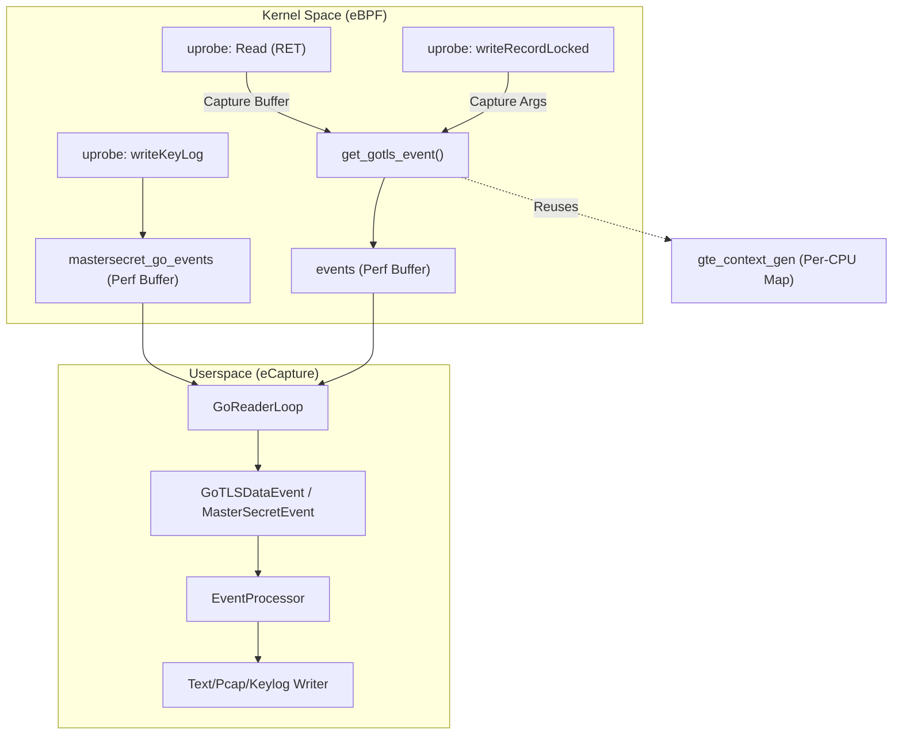
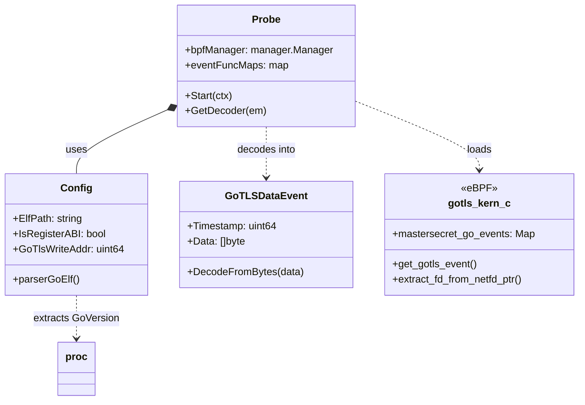

# GoTLS Capture

<details>
<summary>Relevant source files</summary>

The following files were used as context for generating this wiki page:

- [cli/cmd/gnutls.go](https://github.com/gojue/ecapture/blob/943a19fe/cli/cmd/gnutls.go)
- [cli/cmd/gotls.go](https://github.com/gojue/ecapture/blob/943a19fe/cli/cmd/gotls.go)
- [cli/cmd/nss.go](https://github.com/gojue/ecapture/blob/943a19fe/cli/cmd/nss.go)
- [cli/cmd/tls.go](https://github.com/gojue/ecapture/blob/943a19fe/cli/cmd/tls.go)
- [internal/config/base_config.go](https://github.com/gojue/ecapture/blob/943a19fe/internal/config/base_config.go)
- [internal/domain/configuration.go](https://github.com/gojue/ecapture/blob/943a19fe/internal/domain/configuration.go)
- [internal/probe/base/base_probe.go](https://github.com/gojue/ecapture/blob/943a19fe/internal/probe/base/base_probe.go)
- [internal/probe/gotls/config.go](https://github.com/gojue/ecapture/blob/943a19fe/internal/probe/gotls/config.go)
- [internal/probe/gotls/event.go](https://github.com/gojue/ecapture/blob/943a19fe/internal/probe/gotls/event.go)
- [internal/probe/gotls/event_test.go](https://github.com/gojue/ecapture/blob/943a19fe/internal/probe/gotls/event_test.go)
- [internal/probe/gotls/gotls_probe.go](https://github.com/gojue/ecapture/blob/943a19fe/internal/probe/gotls/gotls_probe.go)
- [internal/probe/openssl/config.go](https://github.com/gojue/ecapture/blob/943a19fe/internal/probe/openssl/config.go)
- [internal/probe/openssl/config_test.go](https://github.com/gojue/ecapture/blob/943a19fe/internal/probe/openssl/config_test.go)
- [kern/gotls_kern.c](https://github.com/gojue/ecapture/blob/943a19fe/kern/gotls_kern.c)
- [pkg/proc/go_elf/eprint.go](https://github.com/gojue/ecapture/blob/943a19fe/pkg/proc/go_elf/eprint.go)
- [pkg/proc/go_elf/gccgo.go](https://github.com/gojue/ecapture/blob/943a19fe/pkg/proc/go_elf/gccgo.go)
- [pkg/proc/proc.go](https://github.com/gojue/ecapture/blob/943a19fe/pkg/proc/proc.go)
- [pkg/proc/proc_test.go](https://github.com/gojue/ecapture/blob/943a19fe/pkg/proc/proc_test.go)

</details>


The `gotls` probe is a specialized eCapture module designed to intercept plaintext communication from applications built with the Go programming language that use the native `crypto/tls` package. Unlike the `tls` probe which targets shared libraries like OpenSSL, the `gotls` probe must handle Go's unique runtime characteristics, including its custom calling conventions and statically linked binaries.

## Implementation Details

The GoTLS probe functions by attaching eBPF `uprobes` to specific functions within the Go binary's `crypto/tls` package. Because Go binaries are typically statically linked, eCapture must locate these functions within the target ELF file's symbol table at runtime.

### Key Hook Points

The probe targets three primary functions in the Go standard library:

| Function Name | Purpose | eBPF Hook Type |
| :--- | :--- | :--- |
| `crypto/tls.(*Conn).Read` | Captures incoming plaintext data. | `uprobe` (on RET instructions) |
| `crypto/tls.(*Conn).writeRecordLocked` | Captures outgoing plaintext data. | `uprobe` (on entry) |
| `crypto/tls.(*Config).writeKeyLog` | Captures TLS Master Secrets for Wireshark. | `uprobe` (on entry) |

Sources: [internal/probe/gotls/gotls_probe.go:45-49](https://github.com/gojue/ecapture/blob/943a19fe/internal/probe/gotls/gotls_probe.go#L45-L49), [internal/probe/gotls/config.go:201-240](https://github.com/gojue/ecapture/blob/943a19fe/internal/probe/gotls/config.go#L201-L240)

### Calling Conventions (ABI)

Go transitioned its calling convention in version 1.17. eCapture automatically detects the Go version of the target binary to determine how to extract function arguments:

1.  **Stack-based (Pre-1.17):** Arguments are passed on the stack. eBPF programs must calculate offsets relative to the stack pointer (`sp`).
2.  **Register-based (Post-1.17):** Arguments are passed in registers (e.g., `RAX`, `RBX` on x86_64). This is referred to as the `Register ABI`.

The `Config` object determines this during the `Initialize` phase by calling `proc.ExtraceGoVersion`.

Sources: [internal/probe/gotls/config.go:146-154](https://github.com/gojue/ecapture/blob/943a19fe/internal/probe/gotls/config.go#L146-L154), [pkg/proc/proc.go:34-45](https://github.com/gojue/ecapture/blob/943a19fe/pkg/proc/proc.go#L34-L45)

### Data Flow Architecture

The following diagram illustrates the lifecycle of a GoTLS event from the kernel hook to the userspace output.

**GoTLS Event Processing Flow**



Sources: [kern/gotls_kern.c:61-81](https://github.com/gojue/ecapture/blob/943a19fe/kern/gotls_kern.c#L61-L81), [internal/probe/gotls/gotls_probe.go:142-152](https://github.com/gojue/ecapture/blob/943a19fe/internal/probe/gotls/gotls_probe.go#L142-L152), [internal/probe/gotls/event.go:54-74](https://github.com/gojue/ecapture/blob/943a19fe/internal/probe/gotls/event.go#L54-L74)

## Supported Versions and Requirements

*   **Go Versions:** Supports Go 1.13 through the latest stable release.
*   **Symbol Table:** The target Go binary **must not be fully stripped** of its symbol table. eCapture requires symbols to locate the offsets for `Read`, `Write`, and `writeKeyLog`. 
*   **PIE Support:** Supports Position-Independent Executables (PIE). eCapture calculates the base address and offsets accordingly.

Sources: [internal/probe/gotls/config.go:185-200](https://github.com/gojue/ecapture/blob/943a19fe/internal/probe/gotls/config.go#L185-L200), [internal/probe/gotls/config.go:36-44](https://github.com/gojue/ecapture/blob/943a19fe/internal/probe/gotls/config.go#L36-L44)

## Technical Mapping: Code to Logic

The following diagram maps the logical capture requirements to specific code entities within the `gotls` package.

**GoTLS Logic Mapping**



Sources: [internal/probe/gotls/gotls_probe.go:52-67](https://github.com/gojue/ecapture/blob/943a19fe/internal/probe/gotls/gotls_probe.go#L52-L67), [internal/probe/gotls/config.go:47-92](https://github.com/gojue/ecapture/blob/943a19fe/internal/probe/gotls/config.go#L47-L92), [internal/probe/gotls/event.go:54-74](https://github.com/gojue/ecapture/blob/943a19fe/internal/probe/gotls/event.go#L54-L74), [kern/gotls_kern.c:132-144](https://github.com/gojue/ecapture/blob/943a19fe/kern/gotls_kern.c#L132-L144)

## Usage Examples

### Text Mode (Standard Output)
Capture plaintext from a specific Go binary:
```bash
ecapture gotls --elfpath=/path/to/go_binary --pid=1234
```

### Keylog Mode (Wireshark Decryption)
Save TLS secrets to an NSS-formatted keylog file:
```bash
ecapture gotls -m keylog -k /tmp/gotls.keylog --elfpath=/path/to/go_binary
```

### PCAP Mode
Capture raw packets and associate them with plaintext via a pcapng file:
```bash
ecapture gotls -m pcap -i eth0 -w output.pcapng --elfpath=/path/to/go_binary
```

Sources: [cli/cmd/gotls.go:29-43](https://github.com/gojue/ecapture/blob/943a19fe/cli/cmd/gotls.go#L29-L43)

## Known Limitations

1.  **Stripped Binaries:** If a binary is stripped using `ldflags="-s -w"`, the probe will fail to find function offsets.
2.  **Custom TLS Libraries:** This probe only supports the standard `crypto/tls` library. Applications using CGO to call OpenSSL should use the `tls` (OpenSSL) probe instead.
3.  **Inlining:** If the Go compiler inlines the targeted functions (rare for these specific methods in the standard library), the `uprobe` may not trigger correctly.

Sources: [internal/probe/gotls/config.go:36-44](https://github.com/gojue/ecapture/blob/943a19fe/internal/probe/gotls/config.go#L36-L44), [internal/probe/gotls/gotls_probe.go:45-49](https://github.com/gojue/ecapture/blob/943a19fe/internal/probe/gotls/gotls_probe.go#L45-L49)