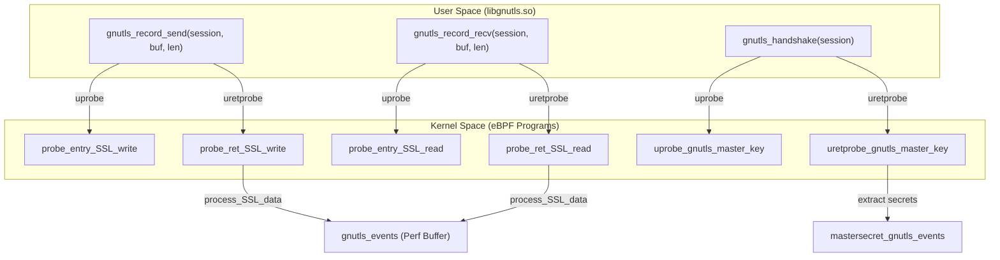
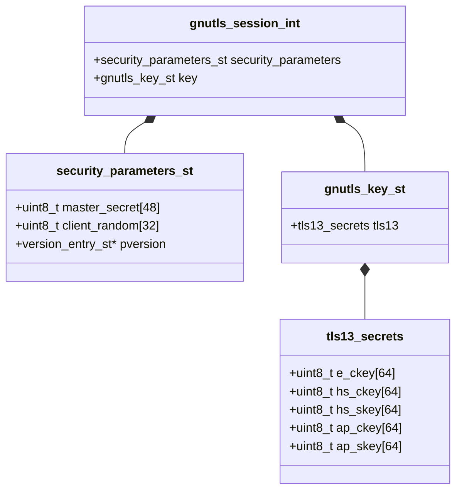

# GnuTLS Capture

<details>
<summary>Relevant source files</summary>

The following files were used as context for generating this wiki page:

- [cli/cmd/gnutls.go](https://github.com/gojue/ecapture/blob/943a19fe/cli/cmd/gnutls.go)
- [cli/cmd/gotls.go](https://github.com/gojue/ecapture/blob/943a19fe/cli/cmd/gotls.go)
- [cli/cmd/nss.go](https://github.com/gojue/ecapture/blob/943a19fe/cli/cmd/nss.go)
- [cli/cmd/tls.go](https://github.com/gojue/ecapture/blob/943a19fe/cli/cmd/tls.go)
- [kern/gnutls.h](https://github.com/gojue/ecapture/blob/943a19fe/kern/gnutls.h)
- [kern/gnutls_3_6_12_kern.c](https://github.com/gojue/ecapture/blob/943a19fe/kern/gnutls_3_6_12_kern.c)
- [kern/gnutls_3_7_0_kern.c](https://github.com/gojue/ecapture/blob/943a19fe/kern/gnutls_3_7_0_kern.c)
- [kern/gnutls_3_7_3_kern.c](https://github.com/gojue/ecapture/blob/943a19fe/kern/gnutls_3_7_3_kern.c)
- [kern/gnutls_3_7_7_kern.c](https://github.com/gojue/ecapture/blob/943a19fe/kern/gnutls_3_7_7_kern.c)
- [kern/gnutls_3_8_4_kern.c](https://github.com/gojue/ecapture/blob/943a19fe/kern/gnutls_3_8_4_kern.c)
- [kern/gnutls_3_8_7_kern.c](https://github.com/gojue/ecapture/blob/943a19fe/kern/gnutls_3_8_7_kern.c)
- [kern/gnutls_masterkey.h](https://github.com/gojue/ecapture/blob/943a19fe/kern/gnutls_masterkey.h)
- [kern/openssl_masterkey_3.2.h](https://github.com/gojue/ecapture/blob/943a19fe/kern/openssl_masterkey_3.2.h)
- [kern/zsh_kern.c](https://github.com/gojue/ecapture/blob/943a19fe/kern/zsh_kern.c)
- [utils/gnutls_offset.c](https://github.com/gojue/ecapture/blob/943a19fe/utils/gnutls_offset.c)

</details>


The `gnutls` probe is designed to capture plaintext communication from applications using the GnuTLS library, such as `wget`, `curl` (when compiled with GnuTLS support), and various microservices. Similar to the OpenSSL probe, it uses eBPF uprobes to intercept data at the library level before encryption or after decryption, eliminating the need for CA certificates or man-in-the-middle proxies.

## Applicable Binaries and Scope

The GnuTLS probe targets binaries linked against `libgnutls.so`. Common examples include:
*   **Wget**: Almost always uses GnuTLS on modern Linux distributions.
*   **Curl**: Some distributions (like Debian/Ubuntu variants) provide a `curl-gnutls` package.
*   **Microservices**: Applications written in C/C++ that prefer GnuTLS over OpenSSL for licensing or architectural reasons.
*   **Android (Termux)**: Can be used to capture traffic from GnuTLS installed via the Termux package manager [cli/cmd/gnutls.go:45-47](https://github.com/gojue/ecapture/blob/943a19fe/cli/cmd/gnutls.go#L45-L47).

### Supported Versions
eCapture supports a wide range of GnuTLS versions, specifically covering the branch from **3.6.12 to 3.8.7** [cli/cmd/gnutls.go:32-32](https://github.com/gojue/ecapture/blob/943a19fe/cli/cmd/gnutls.go#L32-L32). Because GnuTLS internal structures (like `gnutls_session_int`) change frequently between versions, eCapture uses specific header files to define offsets for different version ranges:
*   **3.6.12**: [kern/gnutls_3_6_12_kern.c:1-49](https://github.com/gojue/ecapture/blob/943a19fe/kern/gnutls_3_6_12_kern.c#L1-L49)
*   **3.7.3 ~ 3.7.6**: [kern/gnutls_3_7_3_kern.c:1-49](https://github.com/gojue/ecapture/blob/943a19fe/kern/gnutls_3_7_3_kern.c#L1-L49)
*   **3.8.7 ~ 3.8.9**: [kern/gnutls_3_8_7_kern.c:1-49](https://github.com/gojue/ecapture/blob/943a19fe/kern/gnutls_3_8_7_kern.c#L1-L49)

## Implementation Detail

### Data Flow and Hook Points
The probe hooks two primary functions for data capture: `gnutls_record_send` and `gnutls_record_recv`.

1.  **gnutls_record_send**: Intercepts plaintext data being sent by the application before it is encrypted.
2.  **gnutls_record_recv**: Intercepts plaintext data received by the application after it has been decrypted.

For master key extraction (used in `keylog` and `pcap` modes), the probe hooks `gnutls_handshake` [kern/gnutls_masterkey.h:161-161](https://github.com/gojue/ecapture/blob/943a19fe/kern/gnutls_masterkey.h#L161-L161).

### GnuTLS Code-to-Kernel Mapping
The following diagram illustrates how userspace GnuTLS function calls are mapped to eBPF programs in the kernel.

**Diagram: GnuTLS Probe Hook Mapping**

Sources: [kern/gnutls.h:117-187](https://github.com/gojue/ecapture/blob/943a19fe/kern/gnutls.h#L117-L187), [kern/gnutls_masterkey.h:161-210](https://github.com/gojue/ecapture/blob/943a19fe/kern/gnutls_masterkey.h#L161-L210)

### Internal Structures
eCapture replicates internal GnuTLS structures to navigate the session object and extract secrets. The primary structure used for event reporting is `ssl_data_event_t` [kern/gnutls.h:20-28](https://github.com/gojue/ecapture/blob/943a19fe/kern/gnutls.h#L20-L28). For TLS 1.3 master secrets, it navigates the `gnutls_session_int` to reach the `gnutls_key_st` union [kern/gnutls_masterkey.h:56-82](https://github.com/gojue/ecapture/blob/943a19fe/kern/gnutls_masterkey.h#L56-L82).

**Diagram: GnuTLS Session Navigation for TLS 1.3 Secrets**

Sources: [kern/gnutls_masterkey.h:19-82](https://github.com/gojue/ecapture/blob/943a19fe/kern/gnutls_masterkey.h#L19-L82), [utils/gnutls_offset.c:10-21](https://github.com/gojue/ecapture/blob/943a19fe/utils/gnutls_offset.c#L10-L21)

## CLI Usage and Configuration

The `gnutls` command provides several flags to customize capture behavior.

| Flag | Description | Default |
| :--- | :--- | :--- |
| `--gnutls` | Path to `libgnutls.so`. If empty, eCapture attempts automatic discovery. | `""` |
| `-m, --model` | Capture mode: `text`, `pcap`, or `keylog`. | `text` |
| `-k, --keylogfile` | File to save TLS master keys (NSS Key Log format). | `ecapture_gnutls_key.log` |
| `--ssl_version` | Force a specific GnuTLS version (e.g., "3.7.9"). | `""` |
| `-i, --ifname` | Network interface for TC-based packet capture (pcap mode). | `""` |

### Examples

**Basic Text Capture:**
```bash
ecapture gnutls --pid=1234
```

**Capture to PCAPNG with Keylog:**
```bash
ecapture gnutls -m pcap -i eth0 -w output.pcapng -k keys.log
```
Sources: [cli/cmd/gnutls.go:38-59](https://github.com/gojue/ecapture/blob/943a19fe/cli/cmd/gnutls.go#L38-L59)

## Automatic Library Discovery
The probe attempts to find the GnuTLS library path automatically if `--gnutls` is not provided. It typically looks in standard system paths such as `/lib/x86_64-linux-gnu/libgnutls.so` or searches via common binary dependencies (like `curl`) [cli/cmd/gnutls.go:52-52](https://github.com/gojue/ecapture/blob/943a19fe/cli/cmd/gnutls.go#L52-L52).

## GnuTLS vs. OpenSSL Probe
Users often ask which probe to use. While many tools support both libraries, the choice depends on the target binary's linkage:

*   **Use `tls` (OpenSSL)**: For `nginx`, `openssl` CLI, Node.js, Python, and most modern server software.
*   **Use `gnutls`**: For `wget`, `apt`, and specific Linux utilities compiled against GnuTLS.
*   **Discovery Tip**: Use `ldd $(which <binary>) | grep -E 'ssl|gnutls'` to identify which library the application is using.

Sources: [cli/cmd/tls.go:32-32](https://github.com/gojue/ecapture/blob/943a19fe/cli/cmd/tls.go#L32-L32), [cli/cmd/gnutls.go:36-36](https://github.com/gojue/ecapture/blob/943a19fe/cli/cmd/gnutls.go#L36-L36)