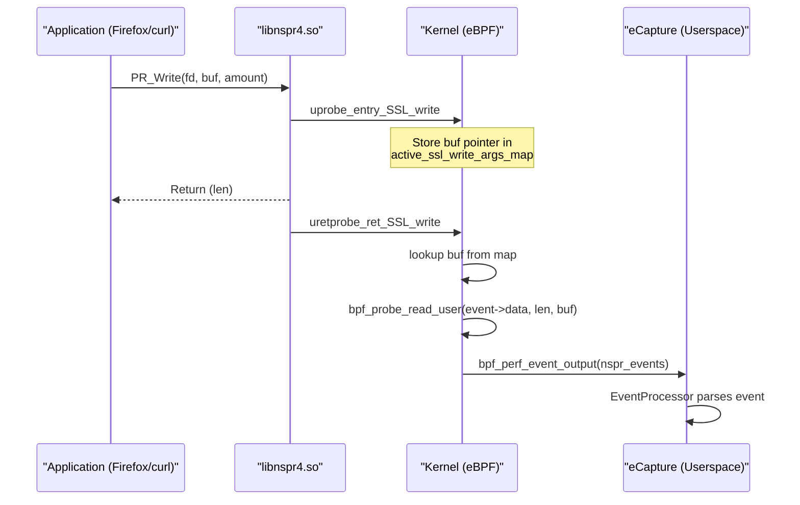
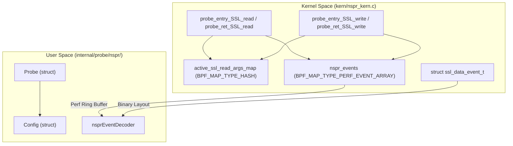

# NSS / NSPR Capture

Relevant source files

The following files were used as context for generating this wiki page:

- [cli/cmd/gnutls.go](https://github.com/gojue/ecapture/blob/943a19fe/cli/cmd/gnutls.go)
- [cli/cmd/gotls.go](https://github.com/gojue/ecapture/blob/943a19fe/cli/cmd/gotls.go)
- [cli/cmd/nss.go](https://github.com/gojue/ecapture/blob/943a19fe/cli/cmd/nss.go)
- [cli/cmd/tls.go](https://github.com/gojue/ecapture/blob/943a19fe/cli/cmd/tls.go)
- [internal/probe/bash/bash_probe.go](https://github.com/gojue/ecapture/blob/943a19fe/internal/probe/bash/bash_probe.go)
- [internal/probe/mysql/mysql_probe.go](https://github.com/gojue/ecapture/blob/943a19fe/internal/probe/mysql/mysql_probe.go)
- [internal/probe/openssl/openssl_probe.go](https://github.com/gojue/ecapture/blob/943a19fe/internal/probe/openssl/openssl_probe.go)
- [internal/probe/postgres/postgres_probe.go](https://github.com/gojue/ecapture/blob/943a19fe/internal/probe/postgres/postgres_probe.go)
- [internal/probe/zsh/zsh_probe.go](https://github.com/gojue/ecapture/blob/943a19fe/internal/probe/zsh/zsh_probe.go)
- [kern/bash_kern.c](https://github.com/gojue/ecapture/blob/943a19fe/kern/bash_kern.c)
- [kern/mysqld_kern.c](https://github.com/gojue/ecapture/blob/943a19fe/kern/mysqld_kern.c)
- [kern/nspr_kern.c](https://github.com/gojue/ecapture/blob/943a19fe/kern/nspr_kern.c)

The `nspr` probe in eCapture is designed to intercept plaintext communication from applications utilizing the **Netscape Portable Runtime (NSPR)** and **Network Security Services (NSS)** libraries. This is the primary cryptographic stack for applications like **Mozilla Firefox**, **Thunderbird**, and versions of `curl` compiled with NSS support [cli/cmd/nss.go:30-33](https://github.com/gojue/ecapture/blob/943a19fe/cli/cmd/nss.go#L30-L33).

## Principle of Operation

Unlike the OpenSSL probe which hooks `SSL_read` and `SSL_write`, the NSS probe targets the underlying NSPR (Netscape Portable Runtime) I/O layer. Specifically, it hooks the `PR_Read` and `PR_Write` functions within `libnspr4.so` [kern/nspr_kern.c:113-152](https://github.com/gojue/ecapture/blob/943a19fe/kern/nspr_kern.c#L113-L152).

### Hook Strategy

The probe utilizes eBPF `uprobe` and `uretprobe` to capture data:
1.  **uprobe**: Attached to the entry of `PR_Read` and `PR_Write` to capture the buffer pointer (`buf`) passed by the application [kern/nspr_kern.c:113-126](https://github.com/gojue/ecapture/blob/943a19fe/kern/nspr_kern.c#L113-L126), [kern/nspr_kern.c:152-165](https://github.com/gojue/ecapture/blob/943a19fe/kern/nspr_kern.c#L152-L165).
2.  **uretprobe**: Attached to the return of these functions. At this point, the return value (`PT_REGS_RC`) indicates the number of bytes actually read or written. eCapture then reads that amount of data from the previously captured buffer pointer [kern/nspr_kern.c:128-145](https://github.com/gojue/ecapture/blob/943a19fe/kern/nspr_kern.c#L128-L145), [kern/nspr_kern.c:167-184](https://github.com/gojue/ecapture/blob/943a19fe/kern/nspr_kern.c#L167-L184).

### Data Flow Diagram: NSPR Hooking

This diagram illustrates how the eBPF programs interact with the NSPR library functions to extract plaintext.

"NSPR Capture Flow"

**Sources:** [kern/nspr_kern.c:113-184](https://github.com/gojue/ecapture/blob/943a19fe/kern/nspr_kern.c#L113-L184), [internal/probe/nspr/nspr_probe.go:114-118](https://github.com/gojue/ecapture/blob/943a19fe/internal/probe/nspr/nspr_probe.go#L114-L118) (inferred from typical manager setup)

## Code Entity Mapping

The following diagram maps the logical capture components to the specific code entities in the kernel and userspace.

"NSS/NSPR Code Entity Map"

**Sources:** [kern/nspr_kern.c:19-53](https://github.com/gojue/ecapture/blob/943a19fe/kern/nspr_kern.c#L19-L53), [cli/cmd/nss.go:24-27](https://github.com/gojue/ecapture/blob/943a19fe/cli/cmd/nss.go#L24-L27).

## Configuration and Usage

The `nspr` command allows users to specify the path to the NSPR library if it is not in a standard location.

### CLI Examples
*   **Basic Capture**: `ecapture nspr`
*   **Filter by PID**: `ecapture nspr --pid=3423` [cli/cmd/nss.go:36](https://github.com/gojue/ecapture/blob/943a19fe/cli/cmd/nss.go#L36)
*   **Custom Library Path**: `ecapture nspr --nspr=/usr/lib/libnspr4.so` [cli/cmd/nss.go:38](https://github.com/gojue/ecapture/blob/943a19fe/cli/cmd/nss.go#L38)

### Key Parameters
| Flag | Description | Default |
| :--- | :--- | :--- |
| `--nspr` | Path to `libnspr4.so`. If empty, eCapture attempts to find it automatically. | `""` |
| `--hex` | Print captured data in hex format. | `false` |
| `--pid` | Filter capture by Process ID. | `0` (all) |

**Sources:** [cli/cmd/nss.go:44-47](https://github.com/gojue/ecapture/blob/943a19fe/cli/cmd/nss.go#L44-L47)

## Implementation Details

### Kernel Data Structures
The kernel program defines a `ssl_data_event_t` structure to pass data to userspace:
*   `type`: Indicates if it's a Read or Write event [kern/nspr_kern.c:20](https://github.com/gojue/ecapture/blob/943a19fe/kern/nspr_kern.c#L20).
*   `timestamp_ns`: Kernel monotonic time [kern/nspr_kern.c:21](https://github.com/gojue/ecapture/blob/943a19fe/kern/nspr_kern.c#L21).
*   `pid`/`tid`: Process and Thread IDs [kern/nspr_kern.c:22-23](https://github.com/gojue/ecapture/blob/943a19fe/kern/nspr_kern.c#L22-L23).
*   `data`: The actual plaintext payload (up to `MAX_DATA_SIZE_OPENSSL`) [kern/nspr_kern.c:24](https://github.com/gojue/ecapture/blob/943a19fe/kern/nspr_kern.c#L24).

### Userspace Probe Initialization
The `nssCommandFunc` initializes the probe using the factory pattern:
1.  Sets the global configuration (PID, Debug, etc.) into `nsprConfig` [cli/cmd/nss.go:50-53](https://github.com/gojue/ecapture/blob/943a19fe/cli/cmd/nss.go#L50-L53).
2.  Invokes `runProbe` with `factory.ProbeTypeNSPR` [cli/cmd/nss.go:55](https://github.com/gojue/ecapture/blob/943a19fe/cli/cmd/nss.go#L55).

## Choosing Between Probes

When targeting an application, use the following logic to decide if the `nspr` probe is appropriate:

| Target Application | Recommended Probe | Reason |
| :--- | :--- | :--- |
| **Firefox / Thunderbird** | `nspr` | These use NSS/NSPR exclusively for TLS. |
| **curl (standard)** | `tls` | Most distros link `curl` against OpenSSL. |
| **curl (libcurl-nss)** | `nspr` | Some older RHEL/CentOS systems use the NSS variant. |
| **wget** | `gnutls` | `wget` typically uses GnuTLS. |
| **Nginx / Apache** | `tls` | Standard web servers use OpenSSL. |

**Sources:** [cli/cmd/nss.go:30-33](https://github.com/gojue/ecapture/blob/943a19fe/cli/cmd/nss.go#L30-L33), [cli/cmd/gnutls.go:33-36](https://github.com/gojue/ecapture/blob/943a19fe/cli/cmd/gnutls.go#L33-L36), [cli/cmd/tls.go:32](https://github.com/gojue/ecapture/blob/943a19fe/cli/cmd/tls.go#L32).