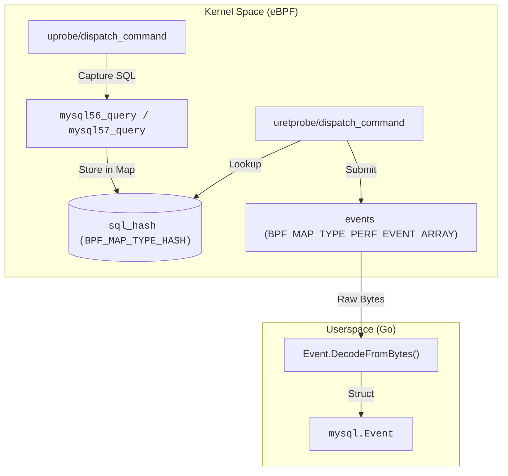
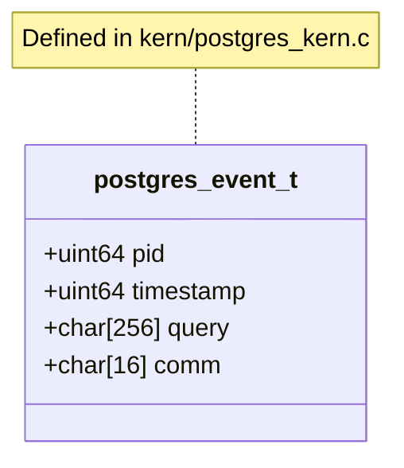

# Database Traffic Capture (MySQL / PostgreSQL)

<details>
<summary>Relevant source files</summary>

The following files were used as context for generating this wiki page:

- [cli/cmd/bash.go](https://github.com/gojue/ecapture/blob/943a19fe/cli/cmd/bash.go)
- [cli/cmd/mysqld.go](https://github.com/gojue/ecapture/blob/943a19fe/cli/cmd/mysqld.go)
- [cli/cmd/postgres.go](https://github.com/gojue/ecapture/blob/943a19fe/cli/cmd/postgres.go)
- [internal/probe/mysql/event.go](https://github.com/gojue/ecapture/blob/943a19fe/internal/probe/mysql/event.go)
- [internal/probe/postgres/event.go](https://github.com/gojue/ecapture/blob/943a19fe/internal/probe/postgres/event.go)
- [kern/bash_kern.c](https://github.com/gojue/ecapture/blob/943a19fe/kern/bash_kern.c)
- [kern/mysqld_kern.c](https://github.com/gojue/ecapture/blob/943a19fe/kern/mysqld_kern.c)
- [kern/nspr_kern.c](https://github.com/gojue/ecapture/blob/943a19fe/kern/nspr_kern.c)
- [kern/postgres_kern.c](https://github.com/gojue/ecapture/blob/943a19fe/kern/postgres_kern.c)

</details>


eCapture provides specialized probes for auditing database traffic by intercepting plaintext SQL statements directly within the database server process. By using eBPF `uprobes`, eCapture captures queries before they are processed (or as they are dispatched), allowing for high-performance monitoring without requiring database-level logging or network-layer decryption.

## Supported Databases and Versions

The database probes are designed to target specific symbols within the server binaries.

| Database | Supported Versions | Hook Point |
| :--- | :--- | :--- |
| **MySQL** | 5.6, 5.7, 8.0 | `dispatch_command` |
| **MariaDB** | 10.5+ | `dispatch_command` |
| **PostgreSQL** | 10 and newer | `exec_simple_query` |

Sources: [cli/cmd/mysqld.go:30-35](https://github.com/gojue/ecapture/blob/943a19fe/cli/cmd/mysqld.go#L30-L35), [cli/cmd/postgres.go:29-33](https://github.com/gojue/ecapture/blob/943a19fe/cli/cmd/postgres.go#L29-L33), [kern/postgres_kern.c:31-35](https://github.com/gojue/ecapture/blob/943a19fe/kern/postgres_kern.c#L31-L35)

## Implementation Principle

The database probes operate by attaching `uprobes` and `uretprobes` to the internal functions responsible for command dispatching. 

### MySQL / MariaDB Capture Flow
MySQL uses the `dispatch_command` function. The signature and data structures evolved between versions 5.6, 5.7, and 8.0, requiring different handling in the kernel-side eBPF program.

1.  **Entry Hook (`uprobe`)**: eCapture reads the command type. It specifically filters for `COM_QUERY` (0x03) to avoid capturing internal heartbeat or administrative traffic [kern/mysqld_kern.c:60-62](https://github.com/gojue/ecapture/blob/943a19fe/kern/mysqld_kern.c#L60-L62).
2.  **Data Extraction**: 
    *   In **MySQL 5.6**, the query string and length are passed directly as parameters [kern/mysqld_kern.c:71-85](https://github.com/gojue/ecapture/blob/943a19fe/kern/mysqld_kern.c#L71-L85).
    *   In **MySQL 5.7/8.0**, the query is wrapped in a `COM_DATA` union/struct, requiring a multi-stage `bpf_probe_read_user` to dereference the string pointer [kern/mysqld_kern.c:190-193](https://github.com/gojue/ecapture/blob/943a19fe/kern/mysqld_kern.c#L190-L193).
3.  **State Management**: The query data is stored in a BPF Hash Map (`sql_hash`) keyed by the Thread Group ID (TGID/PID) [kern/mysqld_kern.c:29-34](https://github.com/gojue/ecapture/blob/943a19fe/kern/mysqld_kern.c#L29-L34).
4.  **Exit Hook (`uretprobe`)**: When `dispatch_command` returns, the probe captures the return value (status) and sends the complete event to userspace [kern/mysqld_kern.c:93-125](https://github.com/gojue/ecapture/blob/943a19fe/kern/mysqld_kern.c#L93-L125).

### PostgreSQL Capture Flow
PostgreSQL is simpler, hooking `exec_simple_query(const char *query_string)`. Since the query string is the first argument, eCapture extracts it using `PT_REGS_PARM1` [kern/postgres_kern.c:35-53](https://github.com/gojue/ecapture/blob/943a19fe/kern/postgres_kern.c#L35-L53).

### Code Entity Mapping: MySQL Probe
The following diagram maps the logical capture flow to specific C and Go entities in the codebase.

Title: MySQL Capture Data Flow

Sources: [kern/mysqld_kern.c:19-41](https://github.com/gojue/ecapture/blob/943a19fe/kern/mysqld_kern.c#L19-L41), [internal/probe/mysql/event.go:62-70](https://github.com/gojue/ecapture/blob/943a19fe/internal/probe/mysql/event.go#L62-L70)

## Configuration and Usage

### MySQL / MariaDB
Users must specify the path to the `mysqld` or `mariadbd` binary. If symbols are stripped or the function name differs, the `--offset` or `--funcname` flags can be used.

```bash
# Capture from default MariaDB path
ecapture mysqld --mysqld /usr/sbin/mariadbd

# Capture from a specific MySQL 8.0 instance with manual offset
ecapture mysqld --mysqld /usr/local/mysql/bin/mysqld --offset 0x710410
```

### PostgreSQL
Similar to MySQL, the path to the `postgres` server binary is required.

```bash
ecapture postgres --postgres /usr/lib/postgresql/14/bin/postgres
```

### Key CLI Flags
*   `-m, --mysqld / --postgres`: Path to the database server binary [cli/cmd/mysqld.go:40](https://github.com/gojue/ecapture/blob/943a19fe/cli/cmd/mysqld.go#L40), [cli/cmd/postgres.go:37](https://github.com/gojue/ecapture/blob/943a19fe/cli/cmd/postgres.go#L37).
*   `-f, --funcname`: Manually specify the function name to hook (e.g., if using a custom build) [cli/cmd/mysqld.go:42](https://github.com/gojue/ecapture/blob/943a19fe/cli/cmd/mysqld.go#L42).
*   `--offset`: Hexadecimal offset for the function entry point [cli/cmd/mysqld.go:41](https://github.com/gojue/ecapture/blob/943a19fe/cli/cmd/mysqld.go#L41).
*   `--perf-reorder`: Enables userspace reordering of events based on BPF ktime to ensure chronological output [cli/cmd/mysqld.go:43](https://github.com/gojue/ecapture/blob/943a19fe/cli/cmd/mysqld.go#L43).

## Data Structures

### MySQL Event (`data_t`)
The event captures the query, its original length (to detect truncation), and the execution return status.

| Field | Type | Description |
| :--- | :--- | :--- |
| `pid` | `u64` | Process ID of the database worker thread |
| `query` | `char[]` | The SQL statement (truncated to `MAX_DATA_SIZE_MYSQL`) |
| `alllen` | `u64` | Original length of the SQL statement |
| `retval` | `s8` | Return status (e.g., `SUCCESS`, `WOULDBLOCK`) |

Sources: [kern/mysqld_kern.c:19-27](https://github.com/gojue/ecapture/blob/943a19fe/kern/mysqld_kern.c#L19-L27), [internal/probe/mysql/event.go:62-70](https://github.com/gojue/ecapture/blob/943a19fe/internal/probe/mysql/event.go#L62-L70)

### PostgreSQL Event (`data_t`)
PostgreSQL events are streamlined for query string capture.

Title: PostgreSQL Event Structure

Sources: [kern/postgres_kern.c:17-22](https://github.com/gojue/ecapture/blob/943a19fe/kern/postgres_kern.c#L17-L22), [internal/probe/postgres/event.go:42-47](https://github.com/gojue/ecapture/blob/943a19fe/internal/probe/postgres/event.go#L42-L47)

## Production Caveats

### Performance Impact
*   **Uprobe Overhead**: Every SQL query triggers a context switch into the eBPF program. For high-TPS (Transactions Per Second) environments, this can add a few microseconds of latency per query.
*   **Data Truncation**: By default, SQL queries are truncated (typically to 256 bytes) to fit within the eBPF stack and map limits [internal/probe/mysql/event.go:29](https://github.com/gojue/ecapture/blob/943a19fe/internal/probe/mysql/event.go#L29). This can be adjusted via `--truncate-size` [cli/cmd/mysqld.go:57](https://github.com/gojue/ecapture/blob/943a19fe/cli/cmd/mysqld.go#L57).

### Permissions
*   **Root/CAP_SYS_ADMIN**: eCapture requires high privileges to load eBPF programs and attach uprobes to system processes.
*   **Binary Access**: The eCapture process must have read access to the database server binary to parse symbols or apply offsets.

### Stability
*   **Symbol Dependency**: These probes rely on the presence of specific symbols (`dispatch_command`, `exec_simple_query`). If the database was compiled with `--strip-all` and no symbol table is available, the probe will fail to attach unless a manual `--offset` is provided.

Sources: [cli/cmd/mysqld.go:41-45](https://github.com/gojue/ecapture/blob/943a19fe/cli/cmd/mysqld.go#L41-L45), [internal/probe/mysql/event.go:145-157](https://github.com/gojue/ecapture/blob/943a19fe/internal/probe/mysql/event.go#L145-L157)