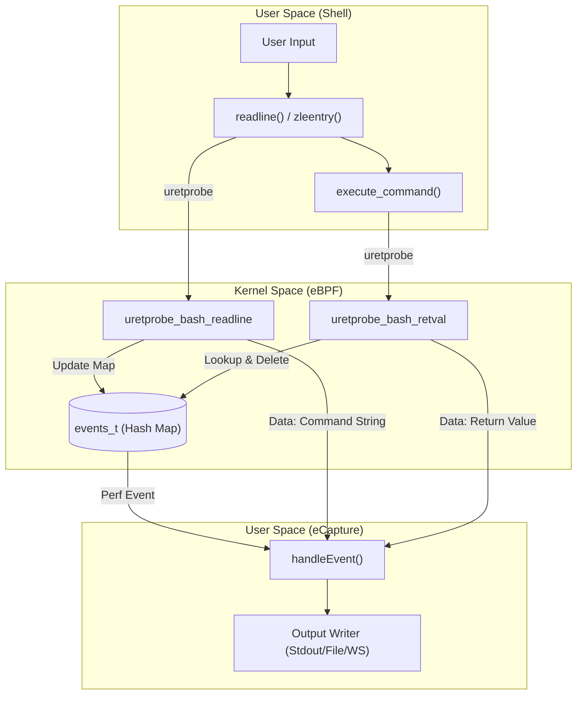
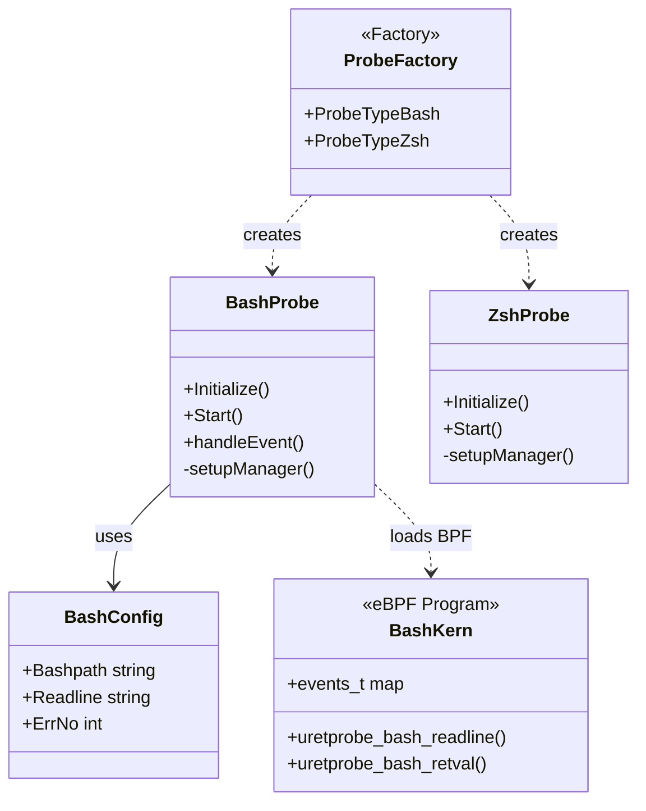

# Shell Auditing (Bash / Zsh)

<details>
<summary>Relevant source files</summary>

The following files were used as context for generating this wiki page:

- [cli/cmd/bash.go](https://github.com/gojue/ecapture/blob/943a19fe/cli/cmd/bash.go)
- [cli/cmd/mysqld.go](https://github.com/gojue/ecapture/blob/943a19fe/cli/cmd/mysqld.go)
- [cli/cmd/postgres.go](https://github.com/gojue/ecapture/blob/943a19fe/cli/cmd/postgres.go)
- [cli/cmd/zsh.go](https://github.com/gojue/ecapture/blob/943a19fe/cli/cmd/zsh.go)
- [internal/probe/bash/bash_probe.go](https://github.com/gojue/ecapture/blob/943a19fe/internal/probe/bash/bash_probe.go)
- [internal/probe/mysql/mysql_probe.go](https://github.com/gojue/ecapture/blob/943a19fe/internal/probe/mysql/mysql_probe.go)
- [internal/probe/openssl/openssl_probe.go](https://github.com/gojue/ecapture/blob/943a19fe/internal/probe/openssl/openssl_probe.go)
- [internal/probe/postgres/postgres_probe.go](https://github.com/gojue/ecapture/blob/943a19fe/internal/probe/postgres/postgres_probe.go)
- [internal/probe/zsh/zsh_probe.go](https://github.com/gojue/ecapture/blob/943a19fe/internal/probe/zsh/zsh_probe.go)
- [kern/bash_kern.c](https://github.com/gojue/ecapture/blob/943a19fe/kern/bash_kern.c)
- [kern/mysqld_kern.c](https://github.com/gojue/ecapture/blob/943a19fe/kern/mysqld_kern.c)
- [kern/nspr_kern.c](https://github.com/gojue/ecapture/blob/943a19fe/kern/nspr_kern.c)
- [pkg/util/ws/client.go](https://github.com/gojue/ecapture/blob/943a19fe/pkg/util/ws/client.go)
- [pkg/util/ws/client_test.go](https://github.com/gojue/ecapture/blob/943a19fe/pkg/util/ws/client_test.go)

</details>


The Shell Auditing probes in eCapture provide a mechanism for real-time command-line auditing of `bash` and `zsh` sessions. By hooking into the shell's line-editing and command execution functions via eBPF `uprobes` and `uretprobes`, eCapture captures every command entered by users, including the username, process ID (PID), and the command's return value (exit status). This is particularly useful for security auditing, compliance monitoring, and detecting unauthorized lateral movement within a system.

## Implementation Overview

eCapture implements shell auditing through two distinct probes: `bash` and `zsh`. While both utilize similar eBPF techniques, they target different internal functions based on the shell's architecture.

### Bash Auditing Principle
Bash uses the `readline` library for command input. eCapture hooks the `readline` function (or `rl_line_buffer`) to capture the command string. To associate commands with their results, it also hooks `execute_command` to capture the return value.

*   **Hook Points**:
    *   `uretprobe/bash_readline`: Attached to `readline` in `libreadline.so` or the `bash` binary itself [internal/probe/bash/bash_probe.go:237-241](https://github.com/gojue/ecapture/blob/943a19fe/internal/probe/bash/bash_probe.go#L237-L241).
    *   `uretprobe/bash_retval`: Attached to `execute_command` in the `bash` binary [internal/probe/bash/bash_probe.go:243-247](https://github.com/gojue/ecapture/blob/943a19fe/internal/probe/bash/bash_probe.go#L243-L247).
    *   `uprobe/exec_builtin` & `uprobe/exit_builtin`: Used to track shell lifecycle events [kern/bash_kern.c:117-121](https://github.com/gojue/ecapture/blob/943a19fe/kern/bash_kern.c#L117-L121).

### Zsh Auditing Principle
Zsh auditing targets the Zsh Line Editor (ZLE).
*   **Hook Point**:
    *   `uretprobe/zsh_zleentry`: Attached to the configured readline function (typically `zleentry`) in the `zsh` binary [internal/probe/zsh/zsh_probe.go:205-210](https://github.com/gojue/ecapture/blob/943a19fe/internal/probe/zsh/zsh_probe.go#L205-L210).

### Data Flow Diagram
The following diagram illustrates how a command entered in a shell travels from the user space into the eBPF kernel program and back to eCapture's output.

**Shell Command Capture Pipeline**

Sources: [kern/bash_kern.c:42-64](https://github.com/gojue/ecapture/blob/943a19fe/kern/bash_kern.c#L42-L64), [kern/bash_kern.c:65-100](https://github.com/gojue/ecapture/blob/943a19fe/kern/bash_kern.c#L65-L100), [internal/probe/bash/bash_probe.go:171-209](https://github.com/gojue/ecapture/blob/943a19fe/internal/probe/bash/bash_probe.go#L171-L209)

## Technical Detail: Bash Probe

The Bash probe manages the state of commands because the command string and the return value are captured at different execution points.

### Kernel Logic
In `bash_kern.c`, the `event` struct stores the context of the command:
[kern/bash_kern.c:17-24](https://github.com/gojue/ecapture/blob/943a19fe/kern/bash_kern.c#L17-L24)
```c
struct event {
    u32 type;
    u32 pid;
    u32 uid;
    u8 line[MAX_DATA_SIZE_BASH];
    u32 retval;
    char comm[TASK_COMM_LEN];
};
```

1.  **Readline Hook**: When `readline` returns, the kernel program reads the command string from the return register (`PT_REGS_RC`) and stores it in the `events_t` hash map, keyed by the PID [kern/bash_kern.c:58-60](https://github.com/gojue/ecapture/blob/943a19fe/kern/bash_kern.c#L58-L60).
2.  **Retval Hook**: When `execute_command` returns, the program looks up the existing event in `events_t` using the PID, attaches the return value, and sends the completed event to userspace via a perf buffer [kern/bash_kern.c:77-97](https://github.com/gojue/ecapture/blob/943a19fe/kern/bash_kern.c#L77-L97).

### Userspace Handling
The `handleEvent` function in `bash_probe.go` manages multi-line command accumulation and filters output based on the user-provided error number (`--errnumber`) [internal/probe/bash/bash_probe.go:171-209](https://github.com/gojue/ecapture/blob/943a19fe/internal/probe/bash/bash_probe.go#L171-L209).

Sources: [kern/bash_kern.c:17-100](https://github.com/gojue/ecapture/blob/943a19fe/kern/bash_kern.c#L17-L100), [internal/probe/bash/bash_probe.go:171-209](https://github.com/gojue/ecapture/blob/943a19fe/internal/probe/bash/bash_probe.go#L171-L209)

## CLI Usage and Configuration

The shell probes are invoked via the `bash` and `zsh` subcommands.

### Command Options
| Flag | Description | Default |
| :--- | :--- | :--- |
| `--bash` | Path to the bash binary. | Auto-detected |
| `--zsh` | Path to the zsh binary. | Auto-detected |
| `--readlineso` | Path to `libreadline.so` if bash is dynamically linked. | Auto-detected |
| `-e, --errnumber` | Only show commands with this exit code. | 128 (Show all) |

### Example Commands
Capture all bash commands:
```bash
ecapture bash
```

Capture only failed bash commands (where exit code is non-zero, e.g., 1):
```bash
ecapture bash -e 1
```

Sources: [cli/cmd/bash.go:27-41](https://github.com/gojue/ecapture/blob/943a19fe/cli/cmd/bash.go#L27-L41), [cli/cmd/zsh.go:30-41](https://github.com/gojue/ecapture/blob/943a19fe/cli/cmd/zsh.go#L30-L41)

## Code Entity Mapping

The following diagram maps the logical auditing components to their specific implementation classes and files.

**Component to Code Entity Map**

Sources: [internal/probe/bash/bash_probe.go:39-49](https://github.com/gojue/ecapture/blob/943a19fe/internal/probe/bash/bash_probe.go#L39-L49), [internal/probe/zsh/zsh_probe.go:37-44](https://github.com/gojue/ecapture/blob/943a19fe/internal/probe/zsh/zsh_probe.go#L37-L44), [cli/cmd/bash.go:24-33](https://github.com/gojue/ecapture/blob/943a19fe/cli/cmd/bash.go#L24-L33), [kern/bash_kern.c:42-65](https://github.com/gojue/ecapture/blob/943a19fe/kern/bash_kern.c#L42-L65)

## Output Format
The output provides a structured view of the shell activity:
*   **PID**: Process ID of the shell.
*   **UID**: User ID of the person executing the command.
*   **Comm**: The process name (usually `bash` or `zsh`).
*   **Retval**: The exit status of the command.
*   **Line**: The actual command string executed.

This data is processed through the `EventProcessor` and can be directed to standard output, a file, or streamed via WebSocket using eCaptureQ [internal/probe/bash/bash_probe.go:171-209](https://github.com/gojue/ecapture/blob/943a19fe/internal/probe/bash/bash_probe.go#L171-L209).

Sources: [kern/bash_kern.c:17-24](https://github.com/gojue/ecapture/blob/943a19fe/kern/bash_kern.c#L17-L24), [internal/probe/bash/bash_probe.go:171-209](https://github.com/gojue/ecapture/blob/943a19fe/internal/probe/bash/bash_probe.go#L171-L209)