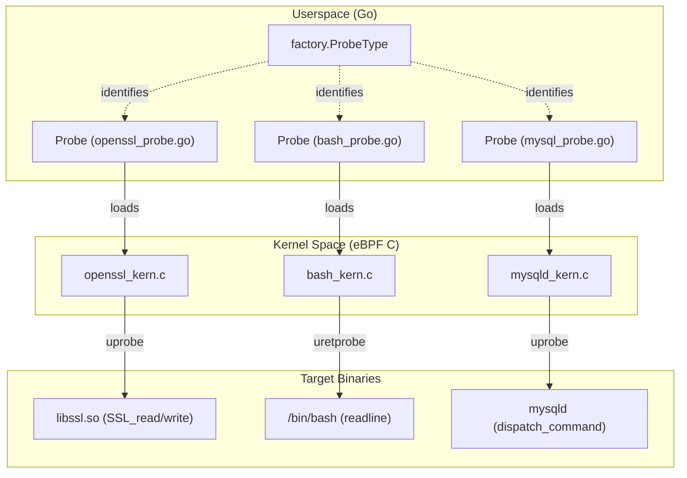
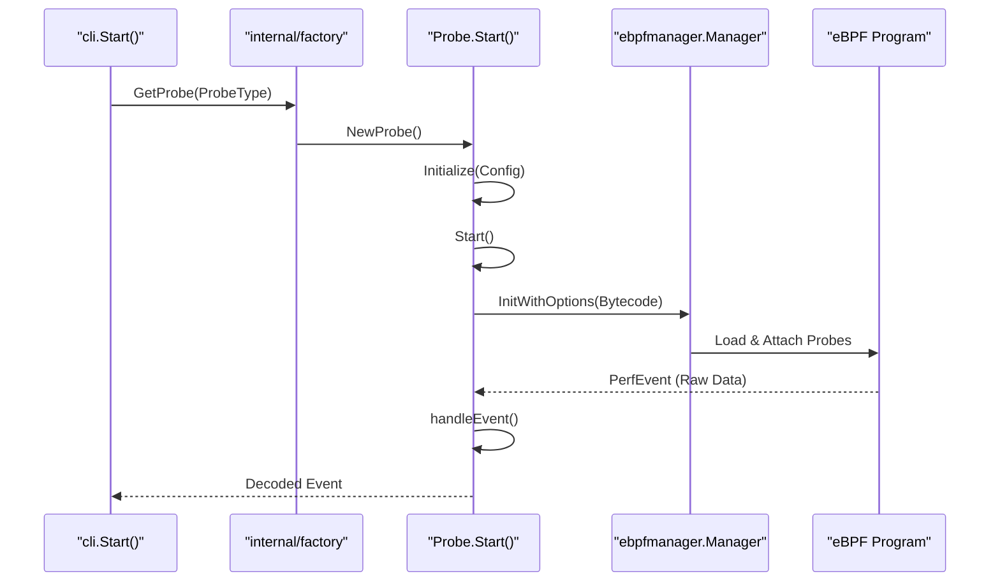

# Probe Reference

Relevant source files

The following files were used as context for generating this wiki page:

- [CHANGELOG.md](https://github.com/gojue/ecapture/blob/943a19fe/CHANGELOG.md)
- [README.md](https://github.com/gojue/ecapture/blob/943a19fe/README.md)
- [internal/probe/bash/bash_probe.go](https://github.com/gojue/ecapture/blob/943a19fe/internal/probe/bash/bash_probe.go)
- [internal/probe/mysql/mysql_probe.go](https://github.com/gojue/ecapture/blob/943a19fe/internal/probe/mysql/mysql_probe.go)
- [internal/probe/openssl/openssl_probe.go](https://github.com/gojue/ecapture/blob/943a19fe/internal/probe/openssl/openssl_probe.go)
- [internal/probe/postgres/postgres_probe.go](https://github.com/gojue/ecapture/blob/943a19fe/internal/probe/postgres/postgres_probe.go)
- [internal/probe/zsh/zsh_probe.go](https://github.com/gojue/ecapture/blob/943a19fe/internal/probe/zsh/zsh_probe.go)
- [main.go](https://github.com/gojue/ecapture/blob/943a19fe/main.go)

eCapture utilizes eBPF `uprobes` to intercept plaintext data at the boundary of user-space libraries and applications. This reference provides an index of the specialized probe modules available in eCapture, categorized by their target protocols and applications.

Each probe follows a standardized lifecycle managed by the `internal/probe` framework, implementing the `Probe` interface to handle initialization, eBPF manager setup, and event dispatching [internal/probe/openssl/openssl_probe.go:45-58](https://github.com/gojue/ecapture/blob/943a19fe/internal/probe/openssl/openssl_probe.go#L45-L58), [internal/probe/bash/bash_probe.go:39-49](https://github.com/gojue/ecapture/blob/943a19fe/internal/probe/bash/bash_probe.go#L39-L49).

### Probe Categories and Modules

The following table summarizes the available probes and their primary targets:

| Category | Module Name | Target Libraries / Applications |
| :--- | :--- | :--- |
| **TLS/SSL** | `tls` | OpenSSL, BoringSSL, LibreSSL |
| **TLS/SSL** | `gotls` | Go native `crypto/tls` |
| **TLS/SSL** | `gnutls` | GnuTLS |
| **TLS/SSL** | `nss` | NSS (Network Security Services) / NSPR |
| **Database** | `mysqld` | MySQL (5.6, 5.7, 8.0), MariaDB |
| **Database** | `postgres` | PostgreSQL (10+) |
| **Shell** | `bash` | Bash Shell |
| **Shell** | `zsh` | Zsh Shell |

### Technical Architecture Mapping

The diagram below illustrates how userspace probe definitions in Go map to their corresponding eBPF kernel implementations and the functions they hook.

**System to Code Entity Mapping**

Sources: [internal/probe/openssl/openssl_probe.go:45-68](https://github.com/gojue/ecapture/blob/943a19fe/internal/probe/openssl/openssl_probe.go#L45-L68), [internal/probe/bash/bash_probe.go:39-59](https://github.com/gojue/ecapture/blob/943a19fe/internal/probe/bash/bash_probe.go#L39-L59), [internal/probe/mysql/mysql_probe.go:37-50](https://github.com/gojue/ecapture/blob/943a19fe/internal/probe/mysql/mysql_probe.go#L37-L50)

---

### Module Details

#### TLS/SSL Plaintext Capture
These probes target various cryptographic libraries to extract plaintext before encryption or after decryption.
* **[TLS/SSL Plaintext Capture (OpenSSL / BoringSSL)](3.1-tlsssl-plaintext-capture-openssl--boringssl.md)**: The primary probe for most Linux and Android applications. It hooks `SSL_read` and `SSL_write` [internal/probe/openssl/openssl_probe.go:115-140](https://github.com/gojue/ecapture/blob/943a19fe/internal/probe/openssl/openssl_probe.go#L115-L140).
* **[GoTLS Capture](3.2-gotls-capture.md)**: Specifically designed for Go binaries, handling the unique calling conventions and internal `crypto/tls` structures.
* **[GnuTLS Capture](3.3-gnutls-capture.md)**: Targets applications like `wget` or `curl` compiled against GnuTLS.
* **[NSS / NSPR Capture](3.4-nss--nspr-capture.md)**: Targets Firefox, Thunderbird, and other applications using the Network Security Services library.

#### Database Traffic Capture
These probes audit database queries by hooking the command dispatching logic within the database server process.
* **[Database Traffic Capture (MySQL / PostgreSQL)](3.5-database-traffic-capture-mysql--postgresql.md)**: Hooks `dispatch_command` in MySQL [internal/probe/mysql/mysql_probe.go:204-240](https://github.com/gojue/ecapture/blob/943a19fe/internal/probe/mysql/mysql_probe.go#L204-L240) and `exec_simple_query` in PostgreSQL [internal/probe/postgres/postgres_probe.go:141-150](https://github.com/gojue/ecapture/blob/943a19fe/internal/probe/postgres/postgres_probe.go#L141-L150) to capture SQL statements in plaintext.

#### Shell Auditing
Used for security compliance and host auditing by capturing user input at the shell level.
* **[Shell Auditing (Bash / Zsh)](3.6-shell-auditing-bash--zsh.md)**: Hooks `readline` functions to capture interactive commands. The Bash probe specifically handles multi-line command accumulation using a `lineMap` indexed by UUID [internal/probe/bash/bash_probe.go:171-209](https://github.com/gojue/ecapture/blob/943a19fe/internal/probe/bash/bash_probe.go#L171-L209).

### Probe Execution Flow

The following diagram shows the common execution path for any probe module initialized via the CLI.

**Probe Lifecycle and Data Path**

Sources: [main.go:9-11](https://github.com/gojue/ecapture/blob/943a19fe/main.go#L9-L11), [internal/probe/openssl/openssl_probe.go:101-159](https://github.com/gojue/ecapture/blob/943a19fe/internal/probe/openssl/openssl_probe.go#L101-L159), [internal/probe/mysql/mysql_probe.go:88-136](https://github.com/gojue/ecapture/blob/943a19fe/internal/probe/mysql/mysql_probe.go#L88-L136)

### Common Caveats
* **Kernel Versions**: Most probes require Linux kernel >= 4.18 (x86_64) or >= 5.5 (aarch64) [README.md:12-13](https://github.com/gojue/ecapture/blob/943a19fe/README.md#L12-L13).
* **BTF Support**: eCapture attempts to use CO-RE (Compile Once – Run Everywhere) if BTF is available, otherwise it falls back to non-CO-RE bytecode [internal/probe/postgres/postgres_probe.go:171-188](https://github.com/gojue/ecapture/blob/943a19fe/internal/probe/postgres/postgres_probe.go#L171-L188).
* **Symbol Tables**: For `uprobes` to work, the target binary must either have a symbol table or the user must provide manual offsets via configuration [internal/probe/mysql/mysql_probe.go:75-82](https://github.com/gojue/ecapture/blob/943a19fe/internal/probe/mysql/mysql_probe.go#L75-L82).

Sources: [README.md:12-13](https://github.com/gojue/ecapture/blob/943a19fe/README.md#L12-L13), [internal/probe/openssl/openssl_probe.go:43-159](https://github.com/gojue/ecapture/blob/943a19fe/internal/probe/openssl/openssl_probe.go#L43-L159), [internal/probe/bash/bash_probe.go:39-127](https://github.com/gojue/ecapture/blob/943a19fe/internal/probe/bash/bash_probe.go#L39-L127), [internal/probe/mysql/mysql_probe.go:37-136](https://github.com/gojue/ecapture/blob/943a19fe/internal/probe/mysql/mysql_probe.go#L37-L136), [internal/probe/postgres/postgres_probe.go:37-111](https://github.com/gojue/ecapture/blob/943a19fe/internal/probe/postgres/postgres_probe.go#L37-L111), [internal/probe/zsh/zsh_probe.go:37-121](https://github.com/gojue/ecapture/blob/943a19fe/internal/probe/zsh/zsh_probe.go#L37-L121)