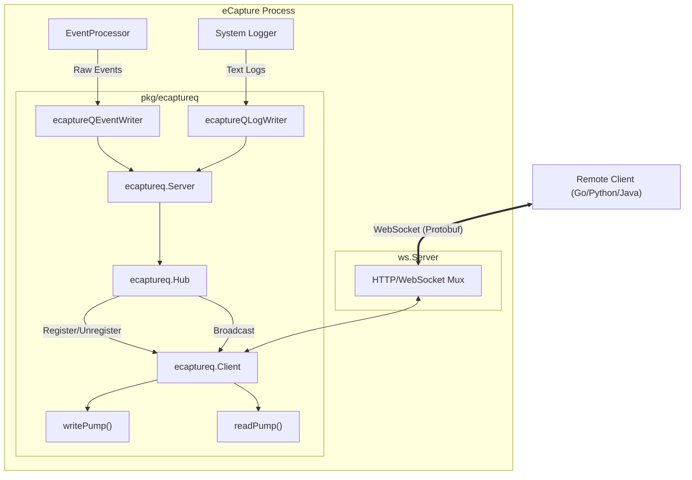
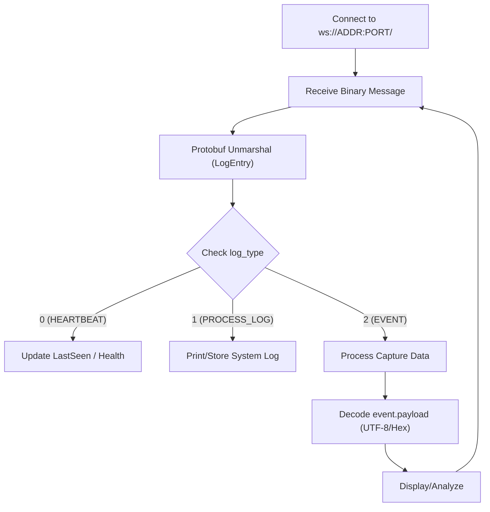

# Remote Event Streaming (eCaptureQ WebSocket)

Relevant source files

The following files were used as context for generating this wiki page:

- [cli/cmd/ecaptureq.go](https://github.com/gojue/ecapture/blob/943a19fe/cli/cmd/ecaptureq.go)
- [examples/ecaptureq_client/README.md](https://github.com/gojue/ecapture/blob/943a19fe/examples/ecaptureq_client/README.md)
- [examples/ecaptureq_client/TESTING.md](https://github.com/gojue/ecapture/blob/943a19fe/examples/ecaptureq_client/TESTING.md)
- [examples/ecaptureq_client/go.mod](https://github.com/gojue/ecapture/blob/943a19fe/examples/ecaptureq_client/go.mod)
- [examples/ecaptureq_client/go.sum](https://github.com/gojue/ecapture/blob/943a19fe/examples/ecaptureq_client/go.sum)
- [examples/ecaptureq_client/main.go](https://github.com/gojue/ecapture/blob/943a19fe/examples/ecaptureq_client/main.go)
- [internal/output/writers/iowriter_adapter.go](https://github.com/gojue/ecapture/blob/943a19fe/internal/output/writers/iowriter_adapter.go)
- [pkg/ecaptureq/README.md](https://github.com/gojue/ecapture/blob/943a19fe/pkg/ecaptureq/README.md)
- [pkg/ecaptureq/client.go](https://github.com/gojue/ecapture/blob/943a19fe/pkg/ecaptureq/client.go)
- [pkg/ecaptureq/hub.go](https://github.com/gojue/ecapture/blob/943a19fe/pkg/ecaptureq/hub.go)
- [pkg/ecaptureq/server.go](https://github.com/gojue/ecapture/blob/943a19fe/pkg/ecaptureq/server.go)
- [pkg/util/ws/server.go](https://github.com/gojue/ecapture/blob/943a19fe/pkg/util/ws/server.go)
- [pkg/util/ws/server_test.go](https://github.com/gojue/ecapture/blob/943a19fe/pkg/util/ws/server_test.go)
- [protobuf/PROTOCOLS.md](https://github.com/gojue/ecapture/blob/943a19fe/protobuf/PROTOCOLS.md)
- [protobuf/README.md](https://github.com/gojue/ecapture/blob/943a19fe/protobuf/README.md)
- [protobuf/gen/v1/ecaptureq.pb.go](https://github.com/gojue/ecapture/blob/943a19fe/protobuf/gen/v1/ecaptureq.pb.go)
- [protobuf/proto/v1/ecaptureq.proto](protobuf/proto/v1/ecaptureq.proto)
- [utils/protobuf_visualizer/README.md](https://github.com/gojue/ecapture/blob/943a19fe/utils/protobuf_visualizer/README.md)
- [utils/protobuf_visualizer/README_CN.md](https://github.com/gojue/ecapture/blob/943a19fe/utils/protobuf_visualizer/README_CN.md)

The eCaptureQ live event push mechanism provides a real-time, structured data stream from eCapture to external consumers. By utilizing WebSockets and Protocol Buffers (Protobuf), it enables low-latency delivery of captured plaintext events and system logs to remote analysis platforms, security dashboards, or custom collectors.

## Architecture Overview

The eCaptureQ system follows a hub-and-spoke model where the eCapture process acts as a WebSocket server. It manages multiple client connections and broadcasts events as they are processed by the userspace pipeline.

### System Components and Data Flow

The following diagram illustrates the relationship between the internal eCapture components and the eCaptureQ streaming service.

**Diagram: eCaptureQ Streaming Architecture**

Sources: [pkg/ecaptureq/server.go:31-57](https://github.com/gojue/ecapture/blob/943a19fe/pkg/ecaptureq/server.go#L31-L57), [pkg/ecaptureq/client.go:34-48](https://github.com/gojue/ecapture/blob/943a19fe/pkg/ecaptureq/client.go#L34-L48), [cli/cmd/ecaptureq.go:21-36](https://github.com/gojue/ecapture/blob/943a19fe/cli/cmd/ecaptureq.go#L21-L36)

## Starting the Server

The WebSocket server is enabled via the `--ecaptureq` flag followed by a WebSocket URL. 

*   **Command Example**: `sudo ecapture tls --ecaptureq ws://127.0.0.1:28257/`
*   **Requirement**: The URL must include a trailing slash `/` [pkg/ecaptureq/README.md:12-12](https://github.com/gojue/ecapture/blob/943a19fe/pkg/ecaptureq/README.md#L12-L12).
*   **Default Port**: While the user can specify any port, `28257` is the convention used in examples [examples/ecaptureq_client/main.go:40-40](https://github.com/gojue/ecapture/blob/943a19fe/examples/ecaptureq_client/main.go#L40-L40).

## Message Format (Protobuf)

eCaptureQ uses Protocol Buffers for efficient serialization. The top-level message is `LogEntry`, which uses a `oneof` field to encapsulate different data types.

### LogEntry Structure
The `LogEntry` structure identifies the message type using the `LogType` enum [protobuf/PROTOCOLS.md:53-62](https://github.com/gojue/ecapture/blob/943a19fe/protobuf/PROTOCOLS.md#L53-L62).

| Field | Type | Description |
| :--- | :--- | :--- |
| `log_type` | `LogType` | `0`: Heartbeat, `1`: Process Log, `2`: Event [pkg/ecaptureq/README.md:34-39](https://github.com/gojue/ecapture/blob/943a19fe/pkg/ecaptureq/README.md#L34-L39) |
| `payload` | `oneof` | Contains `event_payload`, `heartbeat_payload`, or `run_log` [protobuf/PROTOCOLS.md:53-62](https://github.com/gojue/ecapture/blob/943a19fe/protobuf/PROTOCOLS.md#L53-L62) |

### Data Types

#### 1. Event (`LOG_TYPE_EVENT`)
Represents a captured traffic fragment (e.g., a decrypted TLS packet).
*   **Key Fields**: `timestamp`, `uuid`, `src_ip`, `src_port`, `dst_ip`, `dst_port`, `pid`, `pname`, `type` (Protocol ID), and the raw `payload` bytes [protobuf/PROTOCOLS.md:24-41](https://github.com/gojue/ecapture/blob/943a19fe/protobuf/PROTOCOLS.md#L24-L41).

#### 2. Process Log (`LOG_TYPE_PROCESS_LOG`)
Contains standard eCapture execution logs (e.g., version info, probe attachment status).
*   **Format**: Plain string delivered via the `run_log` field [pkg/ecaptureq/server.go:94-94](https://github.com/gojue/ecapture/blob/943a19fe/pkg/ecaptureq/server.go#L94-L94).

#### 3. Heartbeat (`LOG_TYPE_HEARTBEAT`)
Used for connection keep-alive and health monitoring.
*   **Interval**: The server sends a heartbeat every 15 seconds [pkg/ecaptureq/client.go:83-83](https://github.com/gojue/ecapture/blob/943a19fe/pkg/ecaptureq/client.go#L83-L83).
*   **Fields**: `timestamp`, `count` (sequence number), and a status `message` [protobuf/PROTOCOLS.md:45-51](https://github.com/gojue/ecapture/blob/943a19fe/protobuf/PROTOCOLS.md#L45-L51).

## Implementation Details

### Startup Buffer (History Replay)
To ensure clients don't miss critical initialization logs (like version info or probe status) that occur before the client connects, the `Server` maintains a `logbuff`.
*   **Capacity**: Fixed at 128 messages [pkg/ecaptureq/server.go:29-29](https://github.com/gojue/ecapture/blob/943a19fe/pkg/ecaptureq/server.go#L29-L29).
*   **Behavior**: When a new client connects, the server immediately replays all messages in `logbuff` to that client before streaming live events [pkg/ecaptureq/server.go:75-75](https://github.com/gojue/ecapture/blob/943a19fe/pkg/ecaptureq/server.go#L75-L75).

### Connection Management
*   **Hub**: The `Hub` manages the set of active clients and handles the broadcasting of messages to ensure thread-safety [pkg/ecaptureq/server.go:47-47](https://github.com/gojue/ecapture/blob/943a19fe/pkg/ecaptureq/server.go#L47-L47).
*   **Pump Pattern**: Each client connection spawns two goroutines:
    *   `writePump()`: Consumes messages from the `send` channel and pushes them to the WebSocket [pkg/ecaptureq/client.go:82-117](https://github.com/gojue/ecapture/blob/943a19fe/pkg/ecaptureq/client.go#L82-L117).
    *   `readPump()`: Monitors the connection for closure or incoming control messages [pkg/ecaptureq/client.go:55-75](https://github.com/gojue/ecapture/blob/943a19fe/pkg/ecaptureq/client.go#L55-L75).

## Client Integration

### Reference Go Client
A reference implementation is provided in `examples/ecaptureq_client/main.go`. It demonstrates:
1.  Connecting to the server using `websocket.Dial` [examples/ecaptureq_client/main.go:50-50](https://github.com/gojue/ecapture/blob/943a19fe/examples/ecaptureq_client/main.go#L50-L50).
2.  Receiving raw bytes and unmarshaling them into `pb.LogEntry` [examples/ecaptureq_client/main.go:87-88](https://github.com/gojue/ecapture/blob/943a19fe/examples/ecaptureq_client/main.go#L87-L88).
3.  Switching logic based on `LogType` to process events or heartbeats [examples/ecaptureq_client/main.go:100-110](https://github.com/gojue/ecapture/blob/943a19fe/examples/ecaptureq_client/main.go#L100-L110).

### Multi-language Integration Pattern
For non-Go languages (Python, Rust, etc.), the integration follows this pattern:

**Diagram: Integration Logic**

Sources: [pkg/ecaptureq/README.md:166-169](https://github.com/gojue/ecapture/blob/943a19fe/pkg/ecaptureq/README.md#L166-L169), [examples/ecaptureq_client/main.go:99-110](https://github.com/gojue/ecapture/blob/943a19fe/examples/ecaptureq_client/main.go#L99-L110)

### Debugging Tools
The project includes a `protobuf_visualizer` utility (located in `utils/protobuf_visualizer/`) that can connect to an eCaptureQ stream and display messages in compact or hex formats for debugging [utils/protobuf_visualizer/README.md:1-31](https://github.com/gojue/ecapture/blob/943a19fe/utils/protobuf_visualizer/README.md#L1-L31).

Sources:
- [cli/cmd/ecaptureq.go:21-36](https://github.com/gojue/ecapture/blob/943a19fe/cli/cmd/ecaptureq.go#L21-L36)
- [pkg/ecaptureq/server.go:29-124](https://github.com/gojue/ecapture/blob/943a19fe/pkg/ecaptureq/server.go#L29-L124)
- [pkg/ecaptureq/client.go:34-135](https://github.com/gojue/ecapture/blob/943a19fe/pkg/ecaptureq/client.go#L34-L135)
- [pkg/ecaptureq/README.md:1-169](https://github.com/gojue/ecapture/blob/943a19fe/pkg/ecaptureq/README.md#L1-L169)
- [protobuf/PROTOCOLS.md:1-62](https://github.com/gojue/ecapture/blob/943a19fe/protobuf/PROTOCOLS.md#L1-L62)
- [examples/ecaptureq_client/main.go:40-198](https://github.com/gojue/ecapture/blob/943a19fe/examples/ecaptureq_client/main.go#L40-L198)
- [pkg/util/ws/server.go:25-46](https://github.com/gojue/ecapture/blob/943a19fe/pkg/util/ws/server.go#L25-L46)