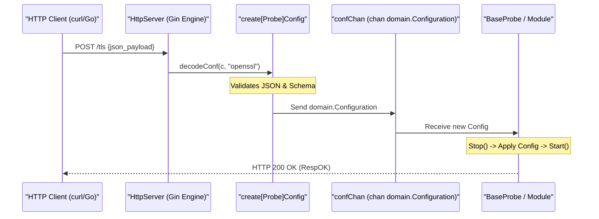
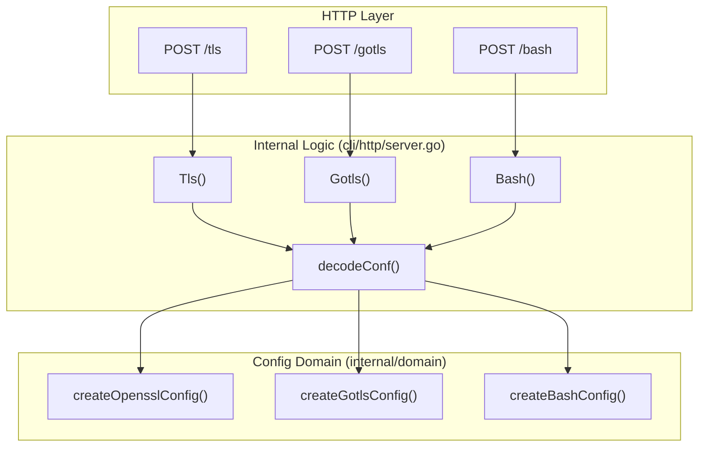

# Remote Dynamic Configuration API

<details>
<summary>Relevant source files</summary>

The following files were used as context for generating this wiki page:

- [cli/cmd/root.go](https://github.com/gojue/ecapture/blob/943a19fe/cli/cmd/root.go)
- [cli/http/logger.go](https://github.com/gojue/ecapture/blob/943a19fe/cli/http/logger.go)
- [cli/http/resp.go](https://github.com/gojue/ecapture/blob/943a19fe/cli/http/resp.go)
- [cli/http/server.go](https://github.com/gojue/ecapture/blob/943a19fe/cli/http/server.go)
- [docs/event-forward-api.md](https://github.com/gojue/ecapture/blob/943a19fe/docs/event-forward-api.md)
- [docs/remote-config-update-api-zh_Hans.md](https://github.com/gojue/ecapture/blob/943a19fe/docs/remote-config-update-api-zh_Hans.md)
- [docs/remote-config-update-api.md](https://github.com/gojue/ecapture/blob/943a19fe/docs/remote-config-update-api.md)
- [pkg/event_processor/http_request.go](https://github.com/gojue/ecapture/blob/943a19fe/pkg/event_processor/http_request.go)
- [pkg/event_processor/http_response.go](https://github.com/gojue/ecapture/blob/943a19fe/pkg/event_processor/http_response.go)
- [pkg/event_processor/iparser.go](https://github.com/gojue/ecapture/blob/943a19fe/pkg/event_processor/iparser.go)
- [pkg/event_processor/iworker.go](https://github.com/gojue/ecapture/blob/943a19fe/pkg/event_processor/iworker.go)
- [pkg/event_processor/processor.go](https://github.com/gojue/ecapture/blob/943a19fe/pkg/event_processor/processor.go)

</details>


The Remote Dynamic Configuration API allows users to hot-update eCapture's runtime configuration without restarting the process. By enabling a built-in HTTP server, eCapture exposes endpoints for each probe module, allowing for live retargeting of PIDs, UIDs, process name filters, and other capture parameters.

## 1. Enabling the API Server

The HTTP server is disabled by default. It is activated using the `--listen` global flag.

*   **Flag**: `--listen [address:port]` [cli/cmd/root.go:171-171]()
*   **Default Address**: `127.0.0.1:28256` (if specified as `--listen 127.0.0.1:28256`)
*   **Implementation**: The server is built using the Gin Gonic framework [cli/http/server.go:20-20](https://github.com/gojue/ecapture/blob/943a19fe/cli/http/server.go#L20-L20).

### Use Cases
*   **Live Retargeting**: Change the target `--pid` or `--uid` on a running instance.
*   **Filter Adjustment**: Update `target_process` or `ignore_process` lists dynamically.
*   **Debug Toggling**: Enable or disable `--debug` or `--hex` modes without losing existing capture state.
*   **External Control**: Integration with security orchestration tools or custom management dashboards.

## 2. API Architecture and Data Flow

When a configuration update is received via the HTTP API, the `HttpServer` decodes the JSON payload into a `domain.Configuration` object and sends it through a dedicated configuration channel (`confChan`). The underlying probe listens to this channel and performs a hot-reload.

### Configuration Update Sequence
The following diagram illustrates the flow from an external `curl` request to the internal probe reload.

**Diagram: Configuration Update Data Path**

Sources: [cli/http/server.go:108-178](https://github.com/gojue/ecapture/blob/943a19fe/cli/http/server.go#L108-L178), [cli/http/server.go:46-51](https://github.com/gojue/ecapture/blob/943a19fe/cli/http/server.go#L46-L51)

## 3. Supported Endpoints and Platform Differences

The available paths correspond to the specific capture modules. Some modules are exclusive to Linux and are not exposed on Android GKI.

### 3.1 Linux vs. Android Path Support

| Path | Alias | Module | Linux | Android |
| :--- | :--- | :--- | :---: | :---: |
| `/tls` | `/openssl`, `/boringssl` | OpenSSL/BoringSSL | Yes | Yes |
| `/gotls` | - | Go crypto/tls | Yes | Yes |
| `/gnutls` | - | GnuTLS | Yes | Yes |
| `/nss` | `/nspr` | NSS/NSPR | Yes | Yes |
| `/bash` | - | Bash Shell | Yes | No |
| `/mysqld` | - | MySQL | Yes | No |
| `/postgress`| `/postgres` | PostgreSQL | Yes | No |

Sources: [cli/http/server.go:57-74](https://github.com/gojue/ecapture/blob/943a19fe/cli/http/server.go#L57-L74), [docs/remote-config-update-api.md:37-75](https://github.com/gojue/ecapture/blob/943a19fe/docs/remote-config-update-api.md#L37-L75)

## 4. Request and Response Shapes

### 4.1 Response Structure
Every API request returns a unified JSON response defined by the `Resp` struct in `cli/http/resp.go`.

```json
{
  "code": 0,
  "module_type": "openssl",
  "msg": "RespOK",
  "data": null
}
```

**Status Codes (`Status` type):**
*   `0` (`RespOK`): Success. [cli/http/resp.go:21-21](https://github.com/gojue/ecapture/blob/943a19fe/cli/http/resp.go#L21-L21)
*   `4` (`RespConfigDecodeFailed`): JSON payload does not match the expected struct. [cli/http/resp.go:25-25](https://github.com/gojue/ecapture/blob/943a19fe/cli/http/resp.go#L25-L25)
*   `5` (`RespConfigCheckFailed`): Validation failed (e.g., invalid PID). [cli/http/resp.go:26-26](https://github.com/gojue/ecapture/blob/943a19fe/cli/http/resp.go#L26-L26)
*   `6` (`RespSendToChanFailed`): Internal buffer full; eCapture is busy. [cli/http/resp.go:27-27](https://github.com/gojue/ecapture/blob/943a19fe/cli/http/resp.go#L27-L27)

### 4.2 Code Entity Mapping
The API maps HTTP routes to specific configuration creators that populate domain-specific structures.

**Diagram: Route to Code Entity Mapping**

Sources: [cli/http/server.go:80-106](https://github.com/gojue/ecapture/blob/943a19fe/cli/http/server.go#L80-L106), [cli/http/server.go:113-136](https://github.com/gojue/ecapture/blob/943a19fe/cli/http/server.go#L113-L136)

## 5. Usage Examples

### 5.1 Update TLS Filter via `curl`
To update a running eCapture instance to only capture traffic from `nginx` and `curl` processes:

```bash
curl -X POST http://127.0.0.1:28256/tls \
  -H "Content-Type: application/json" \
  -d '{
    "pid": 0,
    "uid": 0,
    "debug": false,
    "hex": false,
    "btf": 0,
    "per_cpu_map_size": 1024,
    "truncate_size": 0,
    "filters": {
      "target_process": ["nginx", "curl"],
      "ignore_process": ["ecapture"]
    }
  }'
```
Sources: [docs/remote-config-update-api.md:147-167](https://github.com/gojue/ecapture/blob/943a19fe/docs/remote-config-update-api.md#L147-L167)

### 5.2 Implementation in Go
A client-side implementation must match the JSON tags of the internal configuration structs.

```go
type TlsConfig struct {
    Pid           uint64 `json:"pid"`
    Uid           uint64 `json:"uid"`
    Debug         bool   `json:"debug"`
    Hex           bool   `json:"hex"`
    Btf           uint8  `json:"btf"`
    PerCpuMapSize int    `json:"per_cpu_map_size"`
    TruncateSize  uint64 `json:"truncate_size"`
}

// ... send via http.Post to /tls
```
Sources: [docs/remote-config-update-api.md:183-201](https://github.com/gojue/ecapture/blob/943a19fe/docs/remote-config-update-api.md#L183-L201)

## 6. Implementation Details

*   **Concurrency**: The `HttpServer` uses a `confChan chan domain.Configuration` to safely pass updates to the probe goroutines [cli/http/server.go:47-47](https://github.com/gojue/ecapture/blob/943a19fe/cli/http/server.go#L47-L47).
*   **Validation**: Before an update is accepted, the `Validate()` method of the `domain.Configuration` interface is called [cli/http/server.go:150-150](https://github.com/gojue/ecapture/blob/943a19fe/cli/http/server.go#L150-L150).
*   **Logging**: API interactions (successes and errors) are piped into the main eCapture logger using `ErrLogger` and `InfoLogger` wrappers [cli/http/logger.go:23-39](https://github.com/gojue/ecapture/blob/943a19fe/cli/http/logger.go#L23-L39).

Sources: [cli/http/server.go:148-158](https://github.com/gojue/ecapture/blob/943a19fe/cli/http/server.go#L148-L158), [cli/http/server.go:162-177](https://github.com/gojue/ecapture/blob/943a19fe/cli/http/server.go#L162-L177)