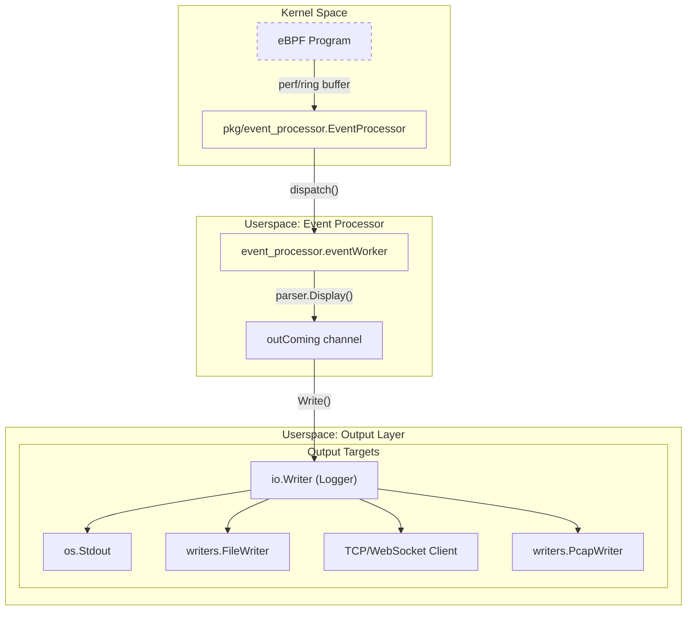
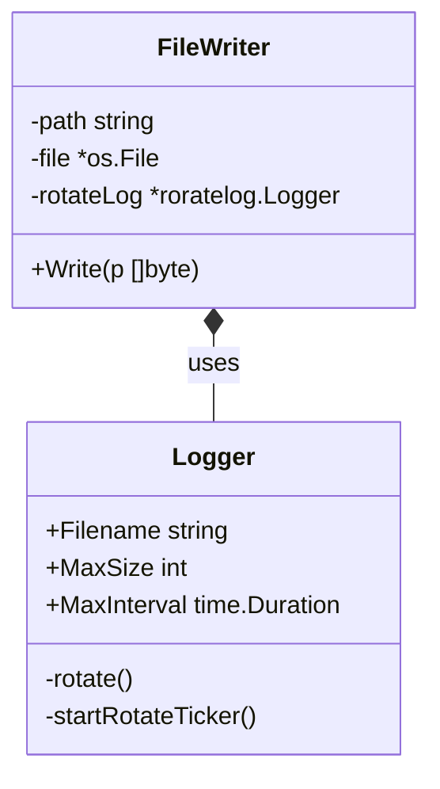
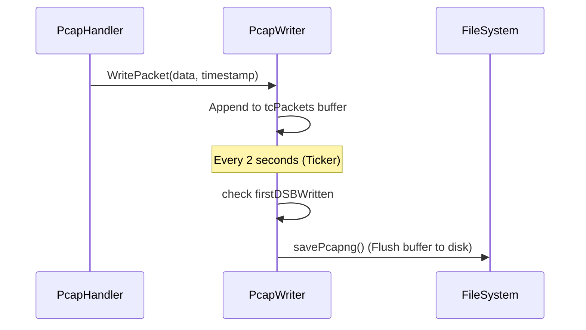

# Logging and Output Configuration

Relevant source files

The following files were used as context for generating this wiki page:

- [cli/cmd/root.go](https://github.com/gojue/ecapture/blob/943a19fe/cli/cmd/root.go)
- [internal/output/writers/file_writer.go](https://github.com/gojue/ecapture/blob/943a19fe/internal/output/writers/file_writer.go)
- [internal/output/writers/pcap_writer.go](https://github.com/gojue/ecapture/blob/943a19fe/internal/output/writers/pcap_writer.go)
- [internal/probe/base/handlers/pcap_handler.go](https://github.com/gojue/ecapture/blob/943a19fe/internal/probe/base/handlers/pcap_handler.go)
- [pkg/event_processor/http_request.go](https://github.com/gojue/ecapture/blob/943a19fe/pkg/event_processor/http_request.go)
- [pkg/event_processor/http_response.go](https://github.com/gojue/ecapture/blob/943a19fe/pkg/event_processor/http_response.go)
- [pkg/event_processor/iparser.go](https://github.com/gojue/ecapture/blob/943a19fe/pkg/event_processor/iparser.go)
- [pkg/event_processor/iworker.go](https://github.com/gojue/ecapture/blob/943a19fe/pkg/event_processor/iworker.go)
- [pkg/event_processor/processor.go](https://github.com/gojue/ecapture/blob/943a19fe/pkg/event_processor/processor.go)
- [pkg/util/roratelog/rorate.go](https://github.com/gojue/ecapture/blob/943a19fe/pkg/util/roratelog/rorate.go)

eCapture provides a flexible output system designed for both interactive debugging and large-scale production integration. It supports multiple output targets (stdout, files, TCP, and WebSockets), structured data formats (Plaintext, JSON, Protobuf), and advanced features like log rotation and PCAPNG generation with embedded TLS secrets.

## Output Architecture and Data Flow

The output system follows a three-stage pipeline: **Event Generation** (Kernel), **Event Processing** (Userspace), and **Writing/Encoding** (Output Layer).

### Data Flow Diagram
This diagram traces the flow from an eBPF event to its final destination based on the configured flags.

**Sources:** [pkg/event_processor/processor.go:64-87](https://github.com/gojue/ecapture/blob/943a19fe/pkg/event_processor/processor.go#L64-L87), [pkg/event_processor/iworker.go:174-227](https://github.com/gojue/ecapture/blob/943a19fe/pkg/event_processor/iworker.go#L174-L227), [cli/cmd/root.go:179-183](https://github.com/gojue/ecapture/blob/943a19fe/cli/cmd/root.go#L179-L183)

---

## Configuration Flags

Output behavior is controlled via persistent flags defined in the root command.

| Flag | Description | Code Reference |
| :--- | :--- | :--- |
| `--logaddr`, `-l` | Primary log/event destination. Supports `stdout`, file paths, `tcp://`, or `ws://`. | [cli/cmd/root.go:168-168](https://github.com/gojue/ecapture/blob/943a19fe/cli/cmd/root.go#L168-L168) |
| `--eventaddr` | Dedicated event forwarding address. Defaults to `--logaddr` if unset. | [cli/cmd/root.go:169-169](https://github.com/gojue/ecapture/blob/943a19fe/cli/cmd/root.go#L169-L169) |
| `--ecaptureq` | Enables WebSocket server mode for event pushing. | [cli/cmd/root.go:170-170](https://github.com/gojue/ecapture/blob/943a19fe/cli/cmd/root.go#L170-L170) |
| `--hex` | Prints byte strings as hex-encoded strings. | [cli/cmd/root.go:164-164](https://github.com/gojue/ecapture/blob/943a19fe/cli/cmd/root.go#L164-L164) |
| `--tsize`, `-t` | Truncates event payload to N bytes. | [cli/cmd/root.go:172-172](https://github.com/gojue/ecapture/blob/943a19fe/cli/cmd/root.go#L172-L172) |
| `--eventroratesize` | Max size (MB) for log rotation (file output only). | [cli/cmd/root.go:173-173](https://github.com/gojue/ecapture/blob/943a19fe/cli/cmd/root.go#L173-L173) |
| `--eventroratetime` | Rotation interval (seconds) for log rotation. | [cli/cmd/root.go:174-174](https://github.com/gojue/ecapture/blob/943a19fe/cli/cmd/root.go#L174-L174) |

---

## Log Rotation (roratelog)

When outputting to a file, eCapture uses the `roratelog` package to prevent disk exhaustion. This is particularly critical for high-traffic TLS capture.

### Implementation Details
The `FileWriter` checks if rotation is enabled and wraps the file handle in a `roratelog.Logger`.
*   **Size-based:** Triggered when `l.size + writeLen >= MaxSize`. [pkg/util/roratelog/rorate.go:131-135](https://github.com/gojue/ecapture/blob/943a19fe/pkg/util/roratelog/rorate.go#L131-L135)
*   **Time-based:** A background goroutine `startRotateTicker` checks the file age. [pkg/util/roratelog/rorate.go:143-154](https://github.com/gojue/ecapture/blob/943a19fe/pkg/util/roratelog/rorate.go#L143-L154)

**Sources:** [internal/output/writers/file_writer.go:27-43](https://github.com/gojue/ecapture/blob/943a19fe/internal/output/writers/file_writer.go#L27-L43), [pkg/util/roratelog/rorate.go:67-93](https://github.com/gojue/ecapture/blob/943a19fe/pkg/util/roratelog/rorate.go#L67-L93)

---

## Remote Forwarding Patterns

### TCP/WebSocket Forwarding
By using `--logaddr tcp://host:port`, eCapture initializes a network-based writer. The `eventWorker` serializes events into Protobuf messages (if `ecaptureq` is used) or plain text before transmission.

### Integration with ELK / Kafka
For production pipelines, eCapture is typically deployed in one of two ways:
1.  **File-beat Pattern:** eCapture writes to a local file with `--eventroratesize`. A sidecar (like Filebeat) ships logs to Logstash/Elasticsearch.
2.  **Direct Streaming:** eCapture streams via TCP to a listener that acts as a Kafka producer.

---

## PCAPNG and TLS Decryption Secrets

When capturing network traffic (TC probe), eCapture uses a specialized `PcapWriter` to generate PCAPNG files.

### Decryption Secrets Block (DSB)
To allow Wireshark to decrypt captured TLS traffic without a CA certificate, eCapture writes "Decryption Secrets Blocks" into the PCAPNG file. 
*   **Serialization:** The `Serve()` loop in `PcapWriter` ensures that DSBs are written *before* the encrypted packets they correspond to. [internal/output/writers/pcap_writer.go:161-226](https://github.com/gojue/ecapture/blob/943a19fe/internal/output/writers/pcap_writer.go#L161-L226)
*   **Grace Period:** A 3-second grace period exists where packets are buffered until the first secret arrives, ensuring the secrets appear at the start of the capture. [internal/output/writers/pcap_writer.go:171-184](https://github.com/gojue/ecapture/blob/943a19fe/internal/output/writers/pcap_writer.go#L171-L184)

### PCAP Writer Logic

**Sources:** [internal/output/writers/pcap_writer.go:138-157](https://github.com/gojue/ecapture/blob/943a19fe/internal/output/writers/pcap_writer.go#L138-L157), [internal/probe/base/handlers/pcap_handler.go:126-159](https://github.com/gojue/ecapture/blob/943a19fe/internal/probe/base/handlers/pcap_handler.go#L126-L159)

---

## Priority and Resolution Rules

The final output destination is resolved in `cli/cmd/root.go`. 
1.  If `--ecaptureq` is set, the system initializes a WebSocket server.
2.  If `--eventaddr` is provided, it takes precedence for captured events.
3.  If only `--logaddr` is provided, both system logs and captured events are sent there.
4.  Default is `os.Stdout` with a `zerolog.ConsoleWriter`. [cli/cmd/root.go:182-184](https://github.com/gojue/ecapture/blob/943a19fe/cli/cmd/root.go#L182-L184)

**Sources:** [cli/cmd/root.go:79-103](https://github.com/gojue/ecapture/blob/943a19fe/cli/cmd/root.go#L79-L103), [pkg/event_processor/processor.go:204-213](https://github.com/gojue/ecapture/blob/943a19fe/pkg/event_processor/processor.go#L204-L213)