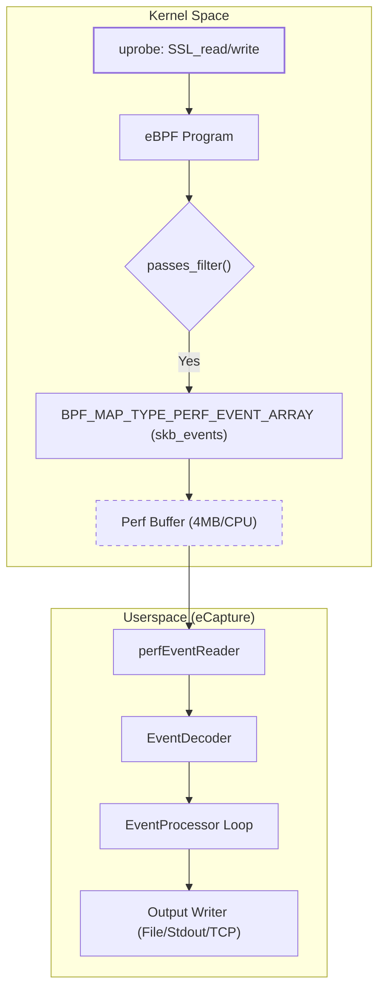
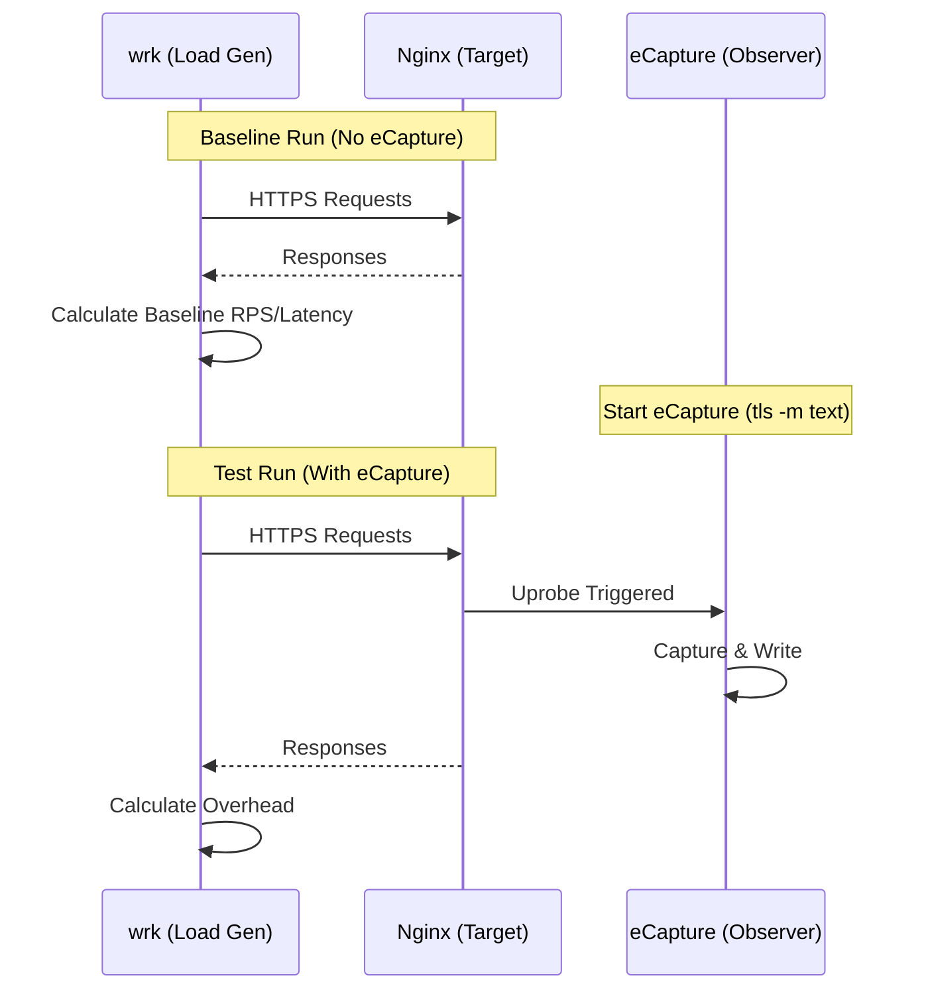

# Performance Overhead and Benchmarks

Relevant source files

The following files were used as context for generating this wiki page:

- [README-zh_Hans.md](https://github.com/gojue/ecapture/blob/943a19fe/README-zh_Hans.md)
- [SECURITY.md](https://github.com/gojue/ecapture/blob/943a19fe/SECURITY.md)
- [docs/README.md](https://github.com/gojue/ecapture/blob/943a19fe/docs/README.md)
- [docs/defense-detection.md](https://github.com/gojue/ecapture/blob/943a19fe/docs/defense-detection.md)
- [docs/example-outputs.md](https://github.com/gojue/ecapture/blob/943a19fe/docs/example-outputs.md)
- [docs/minimum-privileges.md](https://github.com/gojue/ecapture/blob/943a19fe/docs/minimum-privileges.md)
- [docs/performance-benchmarks.md](https://github.com/gojue/ecapture/blob/943a19fe/docs/performance-benchmarks.md)
- [docs/refactoring-guide.md](https://github.com/gojue/ecapture/blob/943a19fe/docs/refactoring-guide.md)
- [docs/release-verification.md](https://github.com/gojue/ecapture/blob/943a19fe/docs/release-verification.md)
- [internal/domain/perf_event.go](https://github.com/gojue/ecapture/blob/943a19fe/internal/domain/perf_event.go)
- [internal/probe/base/perf_reorder.go](https://github.com/gojue/ecapture/blob/943a19fe/internal/probe/base/perf_reorder.go)
- [internal/probe/base/perf_reorder_test.go](https://github.com/gojue/ecapture/blob/943a19fe/internal/probe/base/perf_reorder_test.go)
- [kern/common.h](https://github.com/gojue/ecapture/blob/943a19fe/kern/common.h)
- [kern/ecapture.h](https://github.com/gojue/ecapture/blob/943a19fe/kern/ecapture.h)
- [kern/tc.h](https://github.com/gojue/ecapture/blob/943a19fe/kern/tc.h)

eCapture utilizes eBPF uprobes and Traffic Control (TC) filters to intercept plaintext data from userspace libraries and kernel network buffers. This page details the performance model, benchmarking methodology, and tuning strategies for production deployments.

## Performance Model

The total overhead of eCapture is the sum of kernel-space interception costs and userspace processing costs.

### 1. Interception Overhead (Kernel-space)
When a probe is attached to a function (e.g., `SSL_read` in OpenSSL), the following sequence occurs:
*   **Uprobe Entry/Exit**: The CPU executes a trap, context switches to the kernel, and executes the eBPF program. This typically costs **1-2μs** per event [docs/performance-benchmarks.md:9](https://github.com/gojue/ecapture/blob/943a19fe/docs/performance-benchmarks.md#L9).
*   **eBPF Program Execution**: The logic within the C program (e.g., PID filtering, data copying). This is highly optimized and costs approximately **0.1-0.5μs** per event [docs/performance-benchmarks.md:10](https://github.com/gojue/ecapture/blob/943a19fe/docs/performance-benchmarks.md#L10).
*   **Data Copying**: eBPF programs use `bpf_probe_read` or `bpf_core_read` to copy data from userspace memory into BPF maps or buffers [kern/tc.h:22-28](https://github.com/gojue/ecapture/blob/943a19fe/kern/tc.h#L22-L28).

### 2. Data Transport and Userspace Cost
*   **Perf Buffer Transfer**: Data is pushed into a `BPF_MAP_TYPE_PERF_EVENT_ARRAY`. The default size is **4 MB per CPU core** [docs/performance-benchmarks.md:151](https://github.com/gojue/ecapture/blob/943a19fe/docs/performance-benchmarks.md#L151).
*   **Userspace Decoding**: The Go-based userspace layer reads from the perf buffer, identifies the protocol (HTTP/1.1, HTTP/2, etc.), and encodes the output [docs/performance-benchmarks.md:12](https://github.com/gojue/ecapture/blob/943a19fe/docs/performance-benchmarks.md#L12).

### Data Flow and Entity Mapping
The following diagram illustrates the relationship between kernel-space BPF entities and userspace processing components.

**Diagram: Performance Data Path**

Sources: [kern/tc.h:58-63](https://github.com/gojue/ecapture/blob/943a19fe/kern/tc.h#L58-L63), [kern/ecapture.h:127-146](https://github.com/gojue/ecapture/blob/943a19fe/kern/ecapture.h#L127-L146), [docs/performance-benchmarks.md:151](https://github.com/gojue/ecapture/blob/943a19fe/docs/performance-benchmarks.md#L151), [docs/example-outputs.md:39](https://github.com/gojue/ecapture/blob/943a19fe/docs/example-outputs.md#L39)

---

## Benchmarking Methodology

To evaluate the impact on a production system, eCapture recommends using `wrk` against a target HTTPS server.

### Metrics for Evaluation
| Metric | Description | Tool |
| :--- | :--- | :--- |
| **Throughput Impact** | Reduction in Requests Per Second (RPS) | `wrk` |
| **Latency Penalty** | Increase in p99/p50 response times | `wrk --latency` |
| **CPU Overhead** | CPU consumption of the target process vs eCapture | `pidstat -p <pid> 1` |
| **Event Loss Rate** | Frequency of "lost X events" in eCapture logs | `ecapture` stdout |

Sources: [docs/performance-benchmarks.md:77-85](https://github.com/gojue/ecapture/blob/943a19fe/docs/performance-benchmarks.md#L77-L85)

### Benchmark Execution Flow

Sources: [docs/performance-benchmarks.md:46-73](https://github.com/gojue/ecapture/blob/943a19fe/docs/performance-benchmarks.md#L46-L73)

---

## Tuning and Optimization

### 1. Filtering (Scope Reduction)
The most effective way to reduce overhead is to minimize the number of events processed by the kernel.
*   **PID/UID Filtering**: Use `--pid` or `--uid` to ensure `passes_filter()` returns `false` for irrelevant processes, preventing data copying to the perf buffer [kern/ecapture.h:127-146](https://github.com/gojue/ecapture/blob/943a19fe/kern/ecapture.h#L127-L146).
*   **Cgroup Filtering**: Available on kernels >= 4.18 via `target_cgroup_id` [kern/common.h:73](https://github.com/gojue/ecapture/blob/943a19fe/kern/common.h#L73).

### 2. Perf Buffer Tuning
If the userspace reader cannot keep up with the kernel, events are dropped.
*   **Buffer Size**: Default is 4MB per CPU. High-throughput scenarios may require increasing this (if supported by the version) [docs/performance-benchmarks.md:151](https://github.com/gojue/ecapture/blob/943a19fe/docs/performance-benchmarks.md#L151).
*   **Mode Selection**: 
    *   `keylog` mode: Low overhead. Only captures keys, allowing Wireshark to decrypt later [docs/performance-benchmarks.md:155](https://github.com/gojue/ecapture/blob/943a19fe/docs/performance-benchmarks.md#L155).
    *   `text` mode: High overhead. Captures full plaintext fragments up to 16KB [kern/common.h:39](https://github.com/gojue/ecapture/blob/943a19fe/kern/common.h#L39).

### 3. Event Reordering
Under high load, events from different CPUs may arrive out of order in userspace. eCapture implements a `perfLagReorder` mechanism to buffer and sort events by monotonic timestamp before processing [internal/probe/base/perf_reorder_test.go:59-77](https://github.com/gojue/ecapture/blob/943a19fe/internal/probe/base/perf_reorder_test.go#L59-L77).
*   **Configuration**: Controlled via `PerfReorder` and `PerfReorderLagMs` (default 10ms-20ms) [internal/probe/base/perf_reorder_test.go:130-137](https://github.com/gojue/ecapture/blob/943a19fe/internal/probe/base/perf_reorder_test.go#L130-L137).

---

## Production Performance Checklist

Before deploying eCapture in a high-traffic production environment, verify the following:

1.  **Kernel Support**: Ensure kernel is >= 5.8 to use `CAP_BPF` and `CAP_PERFMON` for more granular resource control [docs/minimum-privileges.md:7-16](https://github.com/gojue/ecapture/blob/943a19fe/docs/minimum-privileges.md#L7-L16).
2.  **Scope**: Always use the `--pid` flag to isolate the capture to the specific application under investigation [docs/performance-benchmarks.md:154](https://github.com/gojue/ecapture/blob/943a19fe/docs/performance-benchmarks.md#L154).
3.  **Output Mode**: Prefer `keylog` mode for long-term monitoring; use `text` or `pcapng` only for short-term debugging [docs/performance-benchmarks.md:155](https://github.com/gojue/ecapture/blob/943a19fe/docs/performance-benchmarks.md#L155).
4.  **Monitoring**: Monitor eCapture's own CPU usage and log output for "lost events" messages [docs/performance-benchmarks.md:80-84](https://github.com/gojue/ecapture/blob/943a19fe/docs/performance-benchmarks.md#L80-L84).

Sources: [docs/performance-benchmarks.md:141-158](https://github.com/gojue/ecapture/blob/943a19fe/docs/performance-benchmarks.md#L141-L158), [docs/minimum-privileges.md:29-34](https://github.com/gojue/ecapture/blob/943a19fe/docs/minimum-privileges.md#L29-L34)