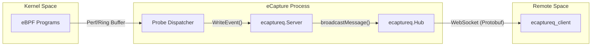
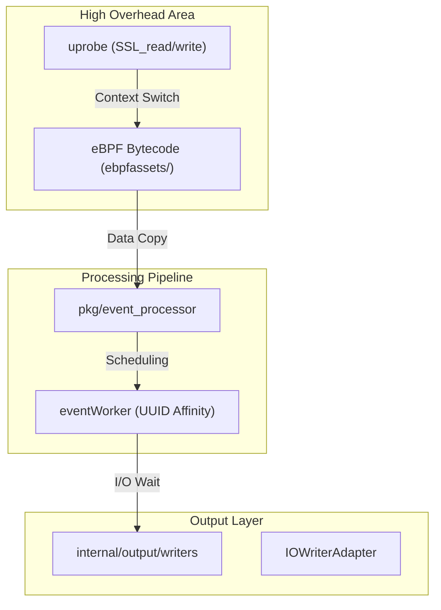

# Integration and Deployment

Relevant source files

The following files were used as context for generating this wiki page:

- [CHANGELOG.md](https://github.com/gojue/ecapture/blob/943a19fe/CHANGELOG.md)
- [README.md](https://github.com/gojue/ecapture/blob/943a19fe/README.md)
- [cli/cmd/ecaptureq.go](https://github.com/gojue/ecapture/blob/943a19fe/cli/cmd/ecaptureq.go)
- [examples/ecaptureq_client/main.go](https://github.com/gojue/ecapture/blob/943a19fe/examples/ecaptureq_client/main.go)
- [internal/output/writers/iowriter_adapter.go](https://github.com/gojue/ecapture/blob/943a19fe/internal/output/writers/iowriter_adapter.go)
- [main.go](https://github.com/gojue/ecapture/blob/943a19fe/main.go)
- [pkg/ecaptureq/server.go](https://github.com/gojue/ecapture/blob/943a19fe/pkg/ecaptureq/server.go)

This page provides a high-level overview of how to integrate eCapture into production environments and manage its lifecycle. It covers mechanisms for remote event streaming, dynamic configuration updates, output management, and performance considerations.

## Remote Event Streaming (eCaptureQ)

For large-scale deployments, eCapture provides a WebSocket-based streaming service called **eCaptureQ**. This allows users to centralize traffic capture from multiple nodes into a single processing backend.

The system uses a Protobuf-based messaging protocol defined in `protobuf/gen/v1` [pkg/ecaptureq/server.go:23](https://github.com/gojue/ecapture/blob/943a19fe/pkg/ecaptureq/server.go#L23). The server maintains a 128-message history buffer (`LogBuffLen`) [pkg/ecaptureq/server.go:29](https://github.com/gojue/ecapture/blob/943a19fe/pkg/ecaptureq/server.go#L29) to ensure that new clients receive recent context upon connection.

For details, see [Remote Event Streaming (eCaptureQ WebSocket)](4.1-remote-event-streaming-ecaptureq-websocket.md).

### eCaptureQ Data Flow
The following diagram illustrates how events move from the eBPF kernel space through the eCaptureQ server to remote clients.

**Diagram: eCaptureQ Streaming Architecture**

**Sources:** [pkg/ecaptureq/server.go:31-57](https://github.com/gojue/ecapture/blob/943a19fe/pkg/ecaptureq/server.go#L31-L57), [cli/cmd/ecaptureq.go:30-36](https://github.com/gojue/ecapture/blob/943a19fe/cli/cmd/ecaptureq.go#L30-L36), [examples/ecaptureq_client/main.go:44-58](https://github.com/gojue/ecapture/blob/943a19fe/examples/ecaptureq_client/main.go#L44-L58)

## Remote Dynamic Configuration API

eCapture supports hot-reloading certain configurations without restarting the process. This is achieved via a built-in HTTP server (disabled by default as of v2.3.0 [CHANGELOG.md:6](https://github.com/gojue/ecapture/blob/943a19fe/CHANGELOG.md#L6)). When enabled via the `--listen` flag, it exposes endpoints for various probes (e.g., `/tls`, `/gotls`, `/bash`).

This API allows SREs to:
* Change capture filters (PID, UID).
* Update target library paths (`--libssl` or `--elfpath`).
* Toggle output modes (text vs. pcapng).

For details, see [Remote Dynamic Configuration API](4.2-remote-dynamic-configuration-api.md).

## Logging and Output Configuration

eCapture provides flexible output routing through its `internal/output` module. It can simultaneously write to multiple destinations using adapters like `IOWriterAdapter` [internal/output/writers/iowriter_adapter.go:22](https://github.com/gojue/ecapture/blob/943a19fe/internal/output/writers/iowriter_adapter.go#L22).

Key capabilities include:
* **Log Forwarding**: Sending operational logs to a remote TCP address via `--logaddr`.
* **Event Forwarding**: Streaming captured data to a remote address via `--eventaddr`.
* **Rotation**: Integrated log rotation to prevent disk exhaustion in production.
* **Format Selection**: Choosing between human-readable text, structured JSON, or binary PCAPNG/Keylog formats.

For details, see [Logging and Output Configuration](4.3-logging-and-output-configuration.md).

## Performance Overhead and Benchmarks

Running eBPF uprobes introduces a small latency (typically 1-2 microseconds) per function call entry/exit. In high-throughput environments, such as a busy Nginx load balancer, this overhead can accumulate.

eCapture provides tuning parameters to mitigate impact:
* **Buffer Selection**: Choosing between `perf_buffer` and `ring_buffer` based on kernel support and throughput requirements.
* **Sampling**: Filtering by PID or CGroup to limit the scope of capture [CHANGELOG.md:20](https://github.com/gojue/ecapture/blob/943a19fe/CHANGELOG.md#L20).
* **Batching**: Using buffered writers like the `pcapng` packet writer [CHANGELOG.md:117](https://github.com/gojue/ecapture/blob/943a19fe/CHANGELOG.md#L117).

For details, see [Performance Overhead and Benchmarks](4.4-performance-overhead-and-benchmarks.md).

### Performance and Logic Entities
The following diagram maps performance-sensitive components to their code implementations.

**Diagram: Performance Impact Mapping**

**Sources:** [README.md:114-118](https://github.com/gojue/ecapture/blob/943a19fe/README.md#L114-L118), [internal/output/writers/iowriter_adapter.go:22-38](https://github.com/gojue/ecapture/blob/943a19fe/internal/output/writers/iowriter_adapter.go#L22-L38), [CHANGELOG.md:100-107](https://github.com/gojue/ecapture/blob/943a19fe/CHANGELOG.md#L100-L107)

## Integration Summary Table

| Feature | Primary Flag | Implementation Component | Typical Use Case |
| :--- | :--- | :--- | :--- |
| **Event Streaming** | `--ecaptureq` | `pkg/ecaptureq` | Centralized Security Operation Center (SOC) |
| **Hot Config** | `--listen` | `internal/probe` (HTTP) | Dynamic target adjustment in CI/CD |
| **PCAP Export** | `-m pcap` | `pcapwriter` | Deep packet analysis in Wireshark |
| **Remote Logs** | `--logaddr` | `IOWriterAdapter` | ELK/Splunk log aggregation |

**Sources:** [README.md:114-123](https://github.com/gojue/ecapture/blob/943a19fe/README.md#L114-L123), [cli/cmd/ecaptureq.go:21-36](https://github.com/gojue/ecapture/blob/943a19fe/cli/cmd/ecaptureq.go#L21-L36), [internal/output/writers/iowriter_adapter.go:22-33](https://github.com/gojue/ecapture/blob/943a19fe/internal/output/writers/iowriter_adapter.go#L22-L33)