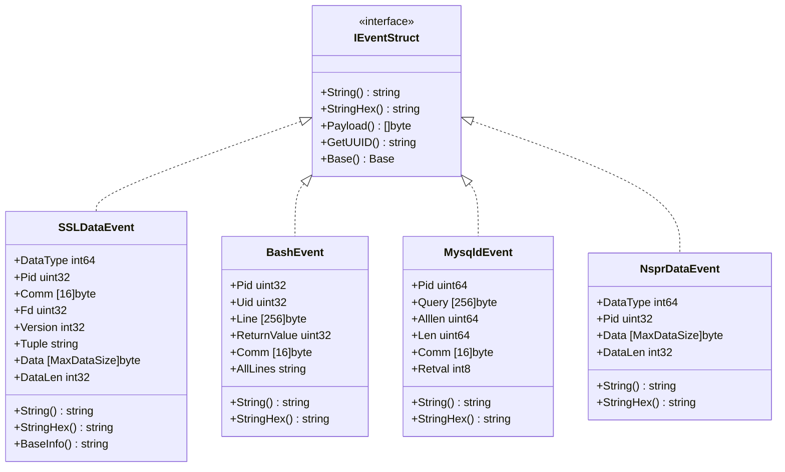
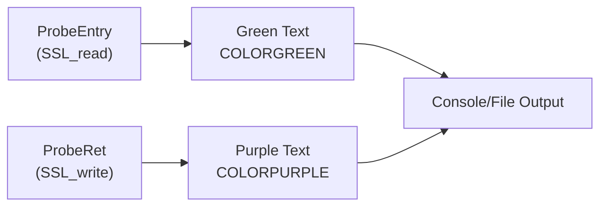
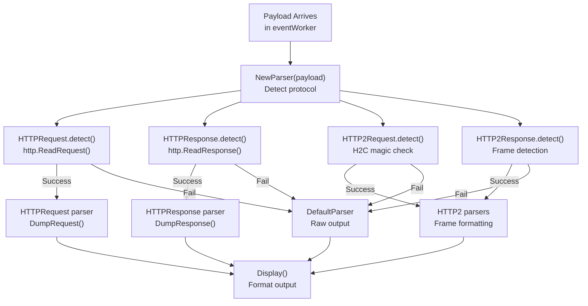
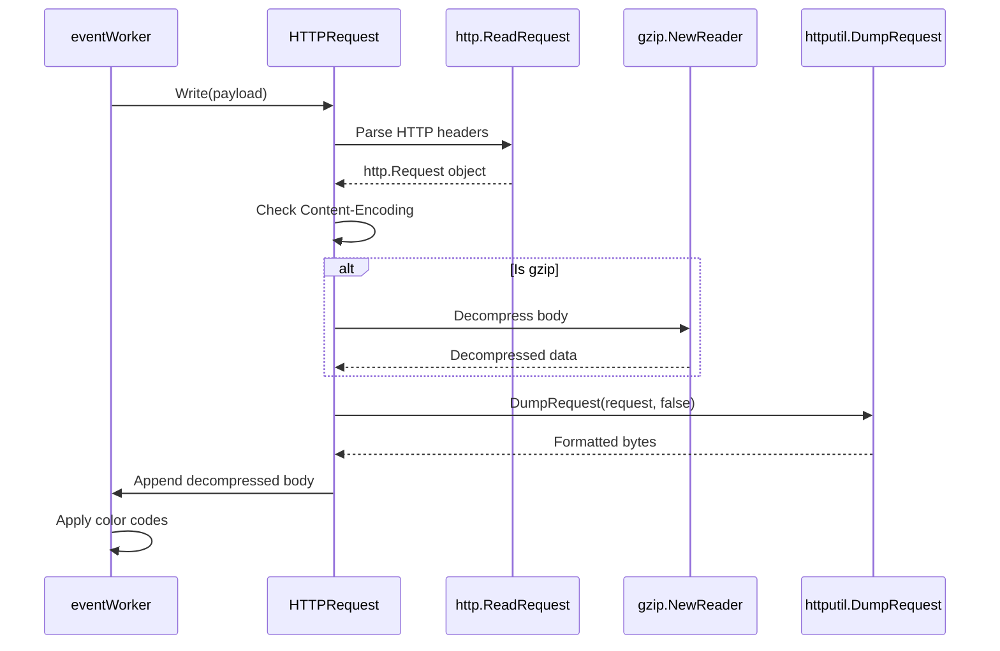
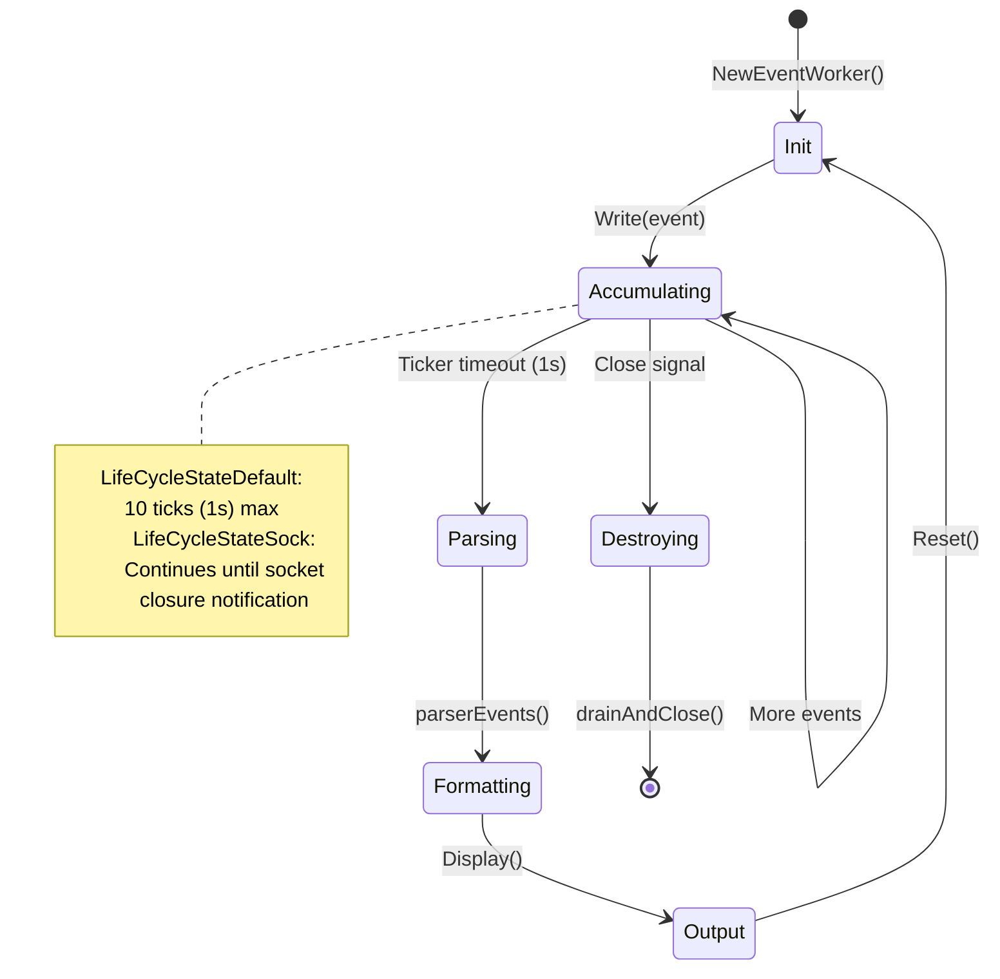
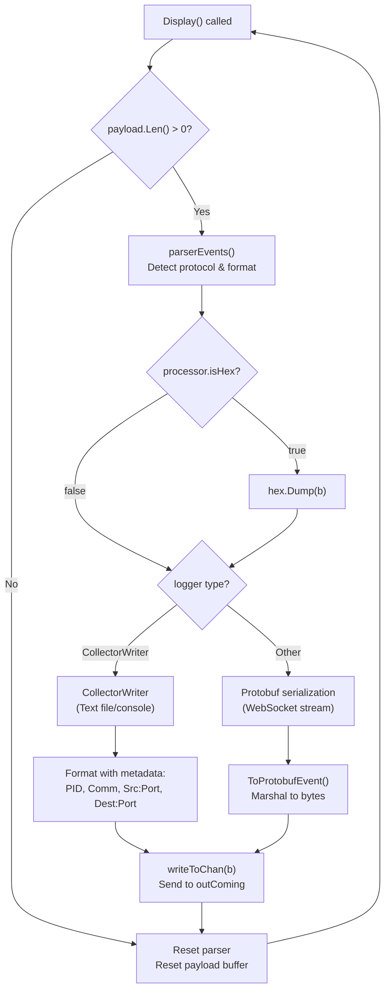
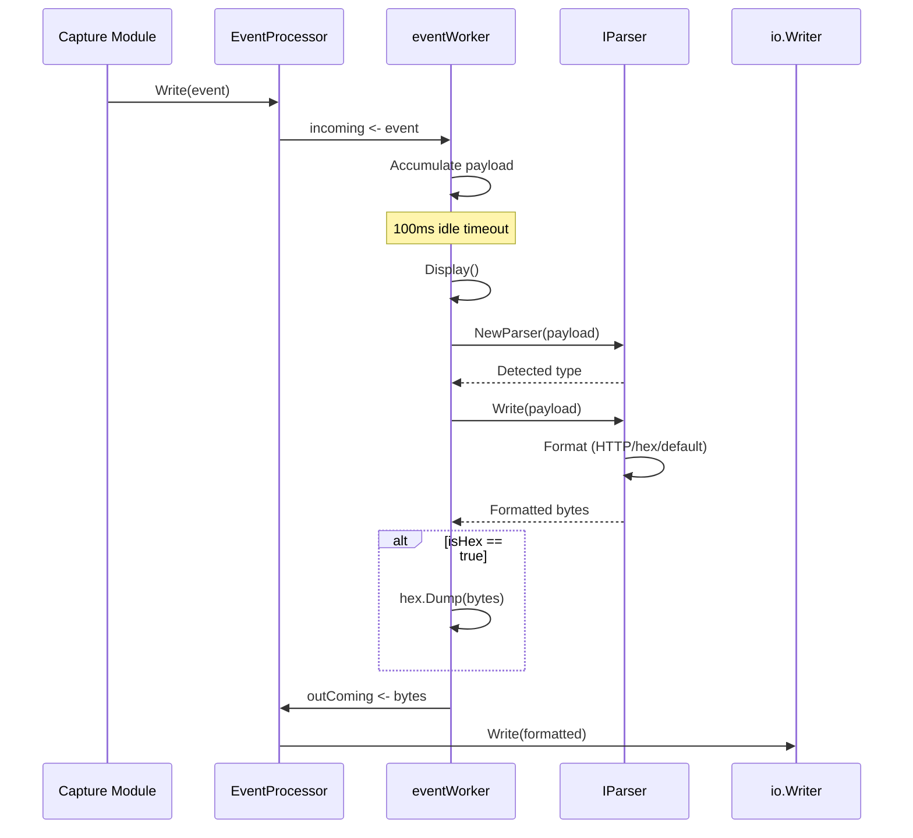

# Text Output Mode

<details>
<summary>Relevant source files</summary>

The following files were used as context for generating this wiki page:

- [pkg/event_processor/base_event.go](https://github.com/gojue/ecapture/blob/0766a93b/pkg/event_processor/base_event.go)
- [pkg/event_processor/http_request.go](https://github.com/gojue/ecapture/blob/0766a93b/pkg/event_processor/http_request.go)
- [pkg/event_processor/http_response.go](https://github.com/gojue/ecapture/blob/0766a93b/pkg/event_processor/http_response.go)
- [pkg/event_processor/iparser.go](https://github.com/gojue/ecapture/blob/0766a93b/pkg/event_processor/iparser.go)
- [pkg/event_processor/iworker.go](https://github.com/gojue/ecapture/blob/0766a93b/pkg/event_processor/iworker.go)
- [pkg/event_processor/processor.go](https://github.com/gojue/ecapture/blob/0766a93b/pkg/event_processor/processor.go)
- [user/event/event_bash.go](https://github.com/gojue/ecapture/blob/0766a93b/user/event/event_bash.go)
- [user/event/event_gnutls.go](https://github.com/gojue/ecapture/blob/0766a93b/user/event/event_gnutls.go)
- [user/event/event_masterkey.go](https://github.com/gojue/ecapture/blob/0766a93b/user/event/event_masterkey.go)
- [user/event/event_mysqld.go](https://github.com/gojue/ecapture/blob/0766a93b/user/event/event_mysqld.go)
- [user/event/event_nspr.go](https://github.com/gojue/ecapture/blob/0766a93b/user/event/event_nspr.go)
- [user/event/event_openssl.go](https://github.com/gojue/ecapture/blob/0766a93b/user/event/event_openssl.go)
- [user/event/event_openssl_tc.go](https://github.com/gojue/ecapture/blob/0766a93b/user/event/event_openssl_tc.go)
- [user/event/event_postgres.go](https://github.com/gojue/ecapture/blob/0766a93b/user/event/event_postgres.go)
- [user/event/ievent.go](https://github.com/gojue/ecapture/blob/0766a93b/user/event/ievent.go)

</details>


## Purpose and Scope

Text Output Mode provides human-readable console and file output for captured network traffic and system events. This mode formats captured SSL/TLS plaintext, database queries, and shell commands into structured text with protocol parsing, color coding, and connection metadata. Unlike PCAP mode (see [PCAP Integration](4.2-pcap-integration.md)) which generates binary packet captures, or keylog mode (see [TLS Key Logging](4.3-tls-key-logging.md)) which exports decryption keys, Text Output Mode is designed for immediate viewing and log file analysis.

This page covers:
- Event string formatting mechanisms (`String()` and `StringHex()` methods)
- Protocol-aware parsing (HTTP/1.x, HTTP/2, gzip decompression)
- Color-coded output for traffic direction
- The event processing pipeline from capture to console
- Configuration options for hex dumps and truncation

---

## Event Formatting Architecture

Text Output Mode relies on a polymorphic formatting system where each event type implements the `IEventStruct` interface, providing two output methods:



**Sources:** [user/event/ievent.go:41-52](https://github.com/gojue/ecapture/blob/0766a93b/user/event/ievent.go#L41-L52), [user/event/event_openssl.go:77-92](https://github.com/gojue/ecapture/blob/0766a93b/user/event/event_openssl.go#L77-L92), [user/event/event_bash.go:37-47](https://github.com/gojue/ecapture/blob/0766a93b/user/event/event_bash.go#L37-L47), [user/event/event_mysqld.go:68-78](https://github.com/gojue/ecapture/blob/0766a93b/user/event/event_mysqld.go#L68-L78), [user/event/event_nspr.go:26-36](https://github.com/gojue/ecapture/blob/0766a93b/user/event/event_nspr.go#L26-L36)

### String vs StringHex Methods

Each event type provides two formatting variants:

| Method | Purpose | Output Format |
|--------|---------|---------------|
| `String()` | Default text output | Plain text payload with metadata header |
| `StringHex()` | Hexadecimal dump | Multi-line hex dump with ASCII sidebar |

The `EventProcessor` selects between these based on the `isHex` flag:

[pkg/event_processor/processor.go:48](https://github.com/gojue/ecapture/blob/0766a93b/pkg/event_processor/processor.go#L48)
```
isHex        bool
```

When `eventWorker.Display()` is called, it checks this flag and applies hex encoding if enabled:

[pkg/event_processor/iworker.go:192-194](https://github.com/gojue/ecapture/blob/0766a93b/pkg/event_processor/iworker.go#L192-L194)
```
if ew.processor.isHex {
    b = []byte(hex.Dump(b))
}
```

**Sources:** [pkg/event_processor/processor.go:48](https://github.com/gojue/ecapture/blob/0766a93b/pkg/event_processor/processor.go#L48), [pkg/event_processor/iworker.go:192-194](https://github.com/gojue/ecapture/blob/0766a93b/pkg/event_processor/iworker.go#L192-L194)

---

## Connection Metadata Display

Text output includes rich connection metadata extracted from eBPF events. For SSL/TLS connections, the `SSLDataEvent.BaseInfo()` method formats this information:

**Example Output Format:**
```
PID:1234, Comm:curl, TID:1234, Version:TLS1_3_VERSION, Received 512 bytes from 93.184.216.34:443
```

**Formatted Fields:**

| Field | Source | Description |
|-------|--------|-------------|
| PID | `SSLDataEvent.Pid` | Process identifier |
| Comm | `SSLDataEvent.Comm` | Process command name (16 bytes max) |
| TID | `SSLDataEvent.Tid` | Thread identifier |
| Version | `SSLDataEvent.Version` | TLS version (converted via `TlsVersion.String()`) |
| Direction | `SSLDataEvent.DataType` | ProbeEntry (Received) or ProbeRet (Send) |
| Tuple | `SSLDataEvent.Tuple` | IP:Port-IP:Port connection tuple |

[user/event/event_openssl.go:181-198](https://github.com/gojue/ecapture/blob/0766a93b/user/event/event_openssl.go#L181-L198)

The `Tuple` field is populated by `ConnDataEvent` from TC (Traffic Control) hook events and provides the network 4-tuple for connection attribution.

**Sources:** [user/event/event_openssl.go:181-198](https://github.com/gojue/ecapture/blob/0766a93b/user/event/event_openssl.go#L181-L198), [user/event/event_openssl.go:55-75](https://github.com/gojue/ecapture/blob/0766a93b/user/event/event_openssl.go#L55-L75)

---

## Color-Coded Output System

Text Output Mode uses ANSI color codes to visually distinguish traffic direction and event types:



**Color Code Definitions:**

[user/event/event.go:8-13](https://github.com/gojue/ecapture/blob/0766a93b/user/event/event.go#L8-L13)
```
COLORPURPLE = "\033[35m"  // Send (outbound traffic)
COLORGREEN  = "\033[32m"  // Received (inbound traffic)
COLORYELLOW = "\033[33m"  // Address/Tuple highlighting
COLORRED    = "\033[31m"  // Errors/Unknown types
COLORRESET  = "\033[0m"   // Reset to default
COLORBLUE   = "\033[34m"  // Filtering indicators
```

### Application in SSLDataEvent

[user/event/event_openssl.go:168-179](https://github.com/gojue/ecapture/blob/0766a93b/user/event/event_openssl.go#L168-L179)

The `String()` method applies colors based on `AttachType`:
```
switch AttachType(se.DataType) {
case ProbeEntry:
    prefix = COLORGREEN
case ProbeRet:
    prefix = COLORPURPLE
}
```

For received data (green):
```
Received 256 bytes from 93.184.216.34:443
<green text>GET / HTTP/1.1
Host: example.com
...</green text>
```

For sent data (purple):
```
Send 512 bytes to 93.184.216.34:443
<purple text>HTTP/1.1 200 OK
Content-Type: text/html
...</purple text>
```

**Sources:** [user/event/event.go:8-13](https://github.com/gojue/ecapture/blob/0766a93b/user/event/event.go#L8-L13), [user/event/event_openssl.go:168-179](https://github.com/gojue/ecapture/blob/0766a93b/user/event/event_openssl.go#L168-L179), [user/event/event_openssl.go:151-166](https://github.com/gojue/ecapture/blob/0766a93b/user/event/event_openssl.go#L151-L166)

---

## Protocol-Aware Parsing

Text Output Mode includes automatic protocol detection and parsing for HTTP traffic, providing structured formatting instead of raw byte dumps.

### Parser Detection Flow



**Sources:** [pkg/event_processor/iparser.go:85-115](https://github.com/gojue/ecapture/blob/0766a93b/pkg/event_processor/iparser.go#L85-L115)

### HTTP/1.x Request Parsing

[pkg/event_processor/http_request.go:28-35](https://github.com/gojue/ecapture/blob/0766a93b/pkg/event_processor/http_request.go#L28-L35)

The `HTTPRequest` parser uses Go's `net/http` package to parse requests:



[pkg/event_processor/http_request.go:105-157](https://github.com/gojue/ecapture/blob/0766a93b/pkg/event_processor/http_request.go#L105-L157)

**Key Features:**
- Automatic gzip decompression when `Content-Encoding: gzip` header is present
- Uses `httputil.DumpRequest()` for consistent formatting
- HTTP/2.0 detection (returns raw bytes for HTTP/2)
- Handles truncated bodies with `io.ErrUnexpectedEOF`

**Sources:** [pkg/event_processor/http_request.go:54-81](https://github.com/gojue/ecapture/blob/0766a93b/pkg/event_processor/http_request.go#L54-L81), [pkg/event_processor/http_request.go:105-157](https://github.com/gojue/ecapture/blob/0766a93b/pkg/event_processor/http_request.go#L105-L157)

### HTTP/1.x Response Parsing

[pkg/event_processor/http_response.go:28-37](https://github.com/gojue/ecapture/blob/0766a93b/pkg/event_processor/http_response.go#L28-L37)

Response parsing follows a similar pattern with additional considerations:

[pkg/event_processor/http_response.go:115-175](https://github.com/gojue/ecapture/blob/0766a93b/pkg/event_processor/http_response.go#L115-L175)

**Chunked Transfer Handling:**
- Detects `ContentLength < 0` indicating chunked encoding
- Logs truncation warnings when `ContentLength > rawLength`
- Supports HEAD method responses (zero-length body with Content-Length header)

**Gzip Support:**
```
switch hr.response.Header.Get("Content-Encoding") {
case "gzip":
    reader, err = gzip.NewReader(bytes.NewReader(rawData))
    rawData, err = io.ReadAll(reader)
    hr.packerType = PacketTypeGzip
```

**Sources:** [pkg/event_processor/http_response.go:115-175](https://github.com/gojue/ecapture/blob/0766a93b/pkg/event_processor/http_response.go#L115-L175)

### Default Parser (Non-HTTP)

[pkg/event_processor/iparser.go:117-166](https://github.com/gojue/ecapture/blob/0766a93b/pkg/event_processor/iparser.go#L117-L166)

When no protocol is detected, the `DefaultParser` provides fallback formatting:

**Behavior:**
1. Check first byte: if `< 32` or `> 126` (non-ASCII), output hex dump
2. Otherwise, output as trimmed string

```
if b[0] < 32 || b[0] > 126 {
    return []byte(hex.Dump(b))
}
return []byte(CToGoString(dp.reader.Bytes()))
```

**Sources:** [pkg/event_processor/iparser.go:152-160](https://github.com/gojue/ecapture/blob/0766a93b/pkg/event_processor/iparser.go#L152-L160)

---

## Event Processing Pipeline

The text output system processes events through a multi-stage pipeline:

```mermaid
flowchart TB
    subgraph "Module Layer"
        Module["Capture Module<br/>(TLS/Bash/MySQL)"]
    end
    
    subgraph "EventProcessor"
        Incoming["incoming chan<br/>IEventStruct"]
        Dispatch["dispatch()<br/>Route by UUID"]
        WorkerQueue["workerQueue<br/>map[string]IWorker"]
    end
    
    subgraph "eventWorker (per connection)"
        IncomingChan["incoming chan<br/>IEventStruct"]
        WriteEvent["writeEvent()<br/>Accumulate payload"]
        PayloadBuf["payload *bytes.Buffer"]
        Ticker["ticker (100ms)<br/>Idle detection"]
        ParserEvents["parserEvents()<br/>Protocol detection"]
        ParserInst["parser IParser<br/>(HTTP/HTTP2/Default)"]
        Display["Display()<br/>Format output"]
    end
    
    subgraph "Output"
        OutComing["outComing chan []byte"]
        Logger["logger io.Writer"]
    end
    
    Module -->|Write()| Incoming
    Incoming --> Dispatch
    Dispatch -->|Get/Create| WorkerQueue
    WorkerQueue -->|Route to| IncomingChan
    
    IncomingChan --> WriteEvent
    WriteEvent --> PayloadBuf
    
    Ticker -->|Timeout| ParserEvents
    PayloadBuf --> ParserEvents
    ParserEvents --> ParserInst
    ParserInst --> Display
    
    Display -->|isHex check| OutComing
    OutComing --> Logger
```

**Sources:** [pkg/event_processor/processor.go:66-89](https://github.com/gojue/ecapture/blob/0766a93b/pkg/event_processor/processor.go#L66-L89), [pkg/event_processor/iworker.go:262-306](https://github.com/gojue/ecapture/blob/0766a93b/pkg/event_processor/iworker.go#L262-L306), [pkg/event_processor/iworker.go:174-228](https://github.com/gojue/ecapture/blob/0766a93b/pkg/event_processor/iworker.go#L174-L228)

### EventProcessor: Central Dispatcher

[pkg/event_processor/processor.go:30-50](https://github.com/gojue/ecapture/blob/0766a93b/pkg/event_processor/processor.go#L30-L50)

The `EventProcessor` maintains a worker queue indexed by connection UUID:

**Key Fields:**
- `incoming chan event.IEventStruct` - Receives events from modules
- `outComing chan []byte` - Sends formatted output to logger
- `workerQueue map[string]IWorker` - Active workers per connection
- `isHex bool` - Global hex dump flag
- `truncateSize uint64` - Payload truncation limit

**Dispatch Logic:**

[pkg/event_processor/processor.go:91-109](https://github.com/gojue/ecapture/blob/0766a93b/pkg/event_processor/processor.go#L91-L109)

```
uuid := e.GetUUID()  // Format: "PID_TID_Comm_FD_DataType"
found, eWorker := ep.getWorkerByUUID(uuid)
if !found {
    eWorker = NewEventWorker(uuid, ep)
    ep.addWorkerByUUID(eWorker)
}
err := eWorker.Write(e)
```

**Sources:** [pkg/event_processor/processor.go:30-50](https://github.com/gojue/ecapture/blob/0766a93b/pkg/event_processor/processor.go#L30-L50), [pkg/event_processor/processor.go:91-109](https://github.com/gojue/ecapture/blob/0766a93b/pkg/event_processor/processor.go#L91-L109)

### eventWorker: Per-Connection State Machine

[pkg/event_processor/iworker.go:70-89](https://github.com/gojue/ecapture/blob/0766a93b/pkg/event_processor/iworker.go#L70-L89)

Each `eventWorker` manages a single connection's event stream:

**Lifecycle States:**



**Two Lifecycle Modes:**

[pkg/event_processor/iworker.go:57-63](https://github.com/gojue/ecapture/blob/0766a93b/pkg/event_processor/iworker.go#L57-L63)

| State | Trigger | Behavior |
|-------|---------|----------|
| `LifeCycleStateDefault` | Standard UUID | Self-destructs after 1 second idle |
| `LifeCycleStateSock` | UUID starts with "sock:" | Persists until socket destroyed |

**Sources:** [pkg/event_processor/iworker.go:57-89](https://github.com/gojue/ecapture/blob/0766a93b/pkg/event_processor/iworker.go#L57-L89), [pkg/event_processor/iworker.go:262-306](https://github.com/gojue/ecapture/blob/0766a93b/pkg/event_processor/iworker.go#L262-L306)

### Display Method: Output Formatting

[pkg/event_processor/iworker.go:174-228](https://github.com/gojue/ecapture/blob/0766a93b/pkg/event_processor/iworker.go#L174-L228)

The `Display()` method coordinates final output formatting:



**Output Format Selection:**

[pkg/event_processor/iworker.go:198-227](https://github.com/gojue/ecapture/blob/0766a93b/pkg/event_processor/iworker.go#L198-L227)

1. **CollectorWriter (Text Mode):**
   ```
   PID:1234, Comm:curl, Src:192.168.1.100:54321, Dest:93.184.216.34:443,
   <formatted payload>
   ```

2. **Protobuf Mode:**
   - Serialized `pb.LogEntry` with `pb.Event` payload
   - Used for WebSocket streaming to eCaptureQ GUI
   - See [Protobuf and External Integration](4.4-protobuf-and-external-integration.md) for details

**Sources:** [pkg/event_processor/iworker.go:174-228](https://github.com/gojue/ecapture/blob/0766a93b/pkg/event_processor/iworker.go#L174-L228)

---

## Payload Truncation

To prevent memory exhaustion from large payloads, Text Output Mode supports configurable truncation:

[pkg/event_processor/iworker.go:230-245](https://github.com/gojue/ecapture/blob/0766a93b/pkg/event_processor/iworker.go#L230-L245)

```
tsize := int(ew.processor.truncateSize)
if tsize > 0 && ew.payload.Len() >= tsize {
    ew.payload.Truncate(tsize)
    ew.Log(fmt.Sprintf("Events truncated, size: %d bytes\n", tsize))
    return
}
```

**Configuration:**

[pkg/event_processor/processor.go:206-215](https://github.com/gojue/ecapture/blob/0766a93b/pkg/event_processor/processor.go#L206-L215)

```
func NewEventProcessor(logger io.Writer, isHex bool, truncateSize uint64) *EventProcessor
```

**Truncation Behavior:**
- Applied when accumulated payload reaches `truncateSize` bytes
- Stops accepting new events for that worker
- Logs truncation message
- Worker continues with truncated payload

**Sources:** [pkg/event_processor/iworker.go:230-245](https://github.com/gojue/ecapture/blob/0766a93b/pkg/event_processor/iworker.go#L230-L245), [pkg/event_processor/processor.go:206-215](https://github.com/gojue/ecapture/blob/0766a93b/pkg/event_processor/processor.go#L206-L215)

---

## Hex Dump Format

When `isHex` mode is enabled, the system uses a structured hex dump format:

[pkg/event_processor/base_event.go:211-252](https://github.com/gojue/ecapture/blob/0766a93b/pkg/event_processor/base_event.go#L211-L252)

**Format Layout:**
```
0000    47 45 54 20 2F 20 48 54    54 50 2F 31 2E 31 0D 0A    GET / HTTP/1.1..
0016    48 6F 73 74 3A 20 65 78    61 6D 70 6C 65 2E 63 6F    Host: example.co
0032    6D 0D 0A 0D 0A                                       m....
```

**Column Structure:**
| Column | Width | Content |
|--------|-------|---------|
| Offset | 4 chars | Byte position (hex) |
| Hex Group 1 | 24 chars | 8 bytes in hex (2 spaces after 4th byte) |
| Hex Group 2 | 24 chars | 8 bytes in hex (2 spaces after 4th byte) |
| ASCII | 16 chars | ASCII representation (non-printable → '.') |

**Implementation Details:**

```
ChunkSize = 16       // Bytes per line
ChunkSizeHalf = 8    // Split point for spacing

for i := 0; i < n; i++ {
    if i%ChunkSize == 0 {
        fmt.Fprintf(bb, "%04d", i)  // Offset
    }
    if i%ChunkSizeHalf == 0 {
        bb.WriteString("    ")      // Group separator
    }
    fmt.Fprintf(bb, " %02X", b[i])  // Hex byte
    
    // Convert non-ASCII to '.'
    if b[i] < 32 || b[i] > 126 {
        a[i%ChunkSize] = '.'
    } else {
        a[i%ChunkSize] = b[i]
    }
}
```

**Sources:** [pkg/event_processor/base_event.go:35-36](https://github.com/gojue/ecapture/blob/0766a93b/pkg/event_processor/base_event.go#L35-L36), [pkg/event_processor/base_event.go:211-252](https://github.com/gojue/ecapture/blob/0766a93b/pkg/event_processor/base_event.go#L211-L252)

---

## Module-Specific Output Examples

### SSL/TLS Data Output

**Standard Format:**
```
PID:12345, Comm:curl, TID:12345, Version:TLS1_3_VERSION, Received 1024 bytes from 93.184.216.34:443
GET /api/v1/users HTTP/1.1
Host: api.example.com
User-Agent: curl/7.68.0
Accept: */*
```

**Hex Format:**
```
PID:12345, Comm:curl, TID:12345, Received 1024 bytes, Payload:
0000    47 45 54 20 2F 61 70 69    2F 76 31 2F 75 73 65 72    GET /api/v1/user
0016    73 20 48 54 54 50 2F 31    2E 31 0D 0A 48 6F 73 74    s HTTP/1.1..Host
...
```

**Sources:** [user/event/event_openssl.go:168-179](https://github.com/gojue/ecapture/blob/0766a93b/user/event/event_openssl.go#L168-L179), [user/event/event_openssl.go:151-166](https://github.com/gojue/ecapture/blob/0766a93b/user/event/event_openssl.go#L151-L166)

### Bash Command Output

[user/event/event_bash.go:72-74](https://github.com/gojue/ecapture/blob/0766a93b/user/event/event_bash.go#L72-L74)

```
PID:5678, UID:1000, 	Comm:bash, 	Retvalue:0, 	Line:
ls -la /etc/passwd && cat /etc/hosts
```

**Sources:** [user/event/event_bash.go:72-80](https://github.com/gojue/ecapture/blob/0766a93b/user/event/event_bash.go#L72-L80)

### MySQL Query Output

[user/event/event_mysqld.go:112-114](https://github.com/gojue/ecapture/blob/0766a93b/user/event/event_mysqld.go#L112-L114)

```
PID:3306, Comm:mysqld, Time:1634567890000000000,  length:(45/45),  return:DISPATCH_COMMAND_SUCCESS, Line:SELECT * FROM users WHERE id = 1234
```

**Return Status Values:**

| Code | Constant | Meaning |
|------|----------|---------|
| 0 | `DISPATCH_COMMAND_SUCCESS` | Query executed successfully |
| 1 | `DISPATCH_COMMAND_CLOSE_CONNECTION` | Connection closed |
| 2 | `DISPATCH_COMMAND_WOULDBLOCK` | Non-blocking operation pending |
| -1 | `DISPATCH_COMMAND_NOT_CAPTURED` | Failed to capture query |
| -2 | `DISPATCH_COMMAND_V57_FAILED` | MySQL 5.7 specific failure |

**Sources:** [user/event/event_mysqld.go:40-66](https://github.com/gojue/ecapture/blob/0766a93b/user/event/event_mysqld.go#L40-L66), [user/event/event_mysqld.go:112-114](https://github.com/gojue/ecapture/blob/0766a93b/user/event/event_mysqld.go#L112-L114)

### PostgreSQL Query Output

[user/event/event_postgres.go:68-69](https://github.com/gojue/ecapture/blob/0766a93b/user/event/event_postgres.go#L68-L69)

```
PID: 5432, Comm: postgres, Time: 1634567890000000000, Query: SELECT id, name FROM accounts WHERE created_at > '2023-01-01'
```

**Sources:** [user/event/event_postgres.go:68-69](https://github.com/gojue/ecapture/blob/0766a93b/user/event/event_postgres.go#L68-L69)

### NSPR/NSS (Firefox) Output

[user/event/event_nspr.go:98-120](https://github.com/gojue/ecapture/blob/0766a93b/user/event/event_nspr.go#L98-L120)

```
PID:9876, Comm:Socket Thread, TID:9877, TYPE:Received, DataLen:512 bytes, Payload:
HTTP/1.1 200 OK
Content-Type: application/json
...
```

**Thread Filtering:**
- Firefox SSL communication occurs on dedicated "Socket Thread"
- Optional filtering based on thread name (currently disabled by default)

**Sources:** [user/event/event_nspr.go:98-120](https://github.com/gojue/ecapture/blob/0766a93b/user/event/event_nspr.go#L98-L120)

---

## Configuration and Usage

### Initialization

[pkg/event_processor/processor.go:206-215](https://github.com/gojue/ecapture/blob/0766a93b/pkg/event_processor/processor.go#L206-L215)

```
processor := NewEventProcessor(logger, isHex, truncateSize)
```

**Parameters:**
- `logger io.Writer` - Output destination (console, file, or custom writer)
- `isHex bool` - Enable hex dump mode
- `truncateSize uint64` - Maximum payload size (0 = unlimited)

### Logger Types

**1. CollectorWriter (Text Mode):**

[user/event/ievent.go:54-70](https://github.com/gojue/ecapture/blob/0766a93b/user/event/ievent.go#L54-L70)

```
logger := zerolog.New(os.Stdout).With().Timestamp().Logger()
collectorWriter := event.NewCollectorWriter(&logger)
processor := NewEventProcessor(collectorWriter, false, 0)
```

**2. Standard io.Writer:**
```
file, _ := os.OpenFile("capture.log", os.O_CREATE|os.O_WRONLY, 0644)
processor := NewEventProcessor(file, false, 0)
```

**Sources:** [user/event/ievent.go:54-70](https://github.com/gojue/ecapture/blob/0766a93b/user/event/ievent.go#L54-L70), [pkg/event_processor/processor.go:206-215](https://github.com/gojue/ecapture/blob/0766a93b/pkg/event_processor/processor.go#L206-L215)

### Runtime Operation



**Sources:** [pkg/event_processor/processor.go:66-89](https://github.com/gojue/ecapture/blob/0766a93b/pkg/event_processor/processor.go#L66-L89), [pkg/event_processor/iworker.go:262-306](https://github.com/gojue/ecapture/blob/0766a93b/pkg/event_processor/iworker.go#L262-L306)

---

## Performance Considerations

### Buffering and Channels

[pkg/event_processor/processor.go:25-28](https://github.com/gojue/ecapture/blob/0766a93b/pkg/event_processor/processor.go#L25-L28)

```
MaxIncomingChanLen = 1024
MaxParserQueueLen  = 1024
MaxChanLen         = 1024  // per eventWorker
```

**Channel Depths:**
- `EventProcessor.incoming` - 1024 events
- `EventProcessor.outComing` - 1024 formatted outputs
- `eventWorker.incoming` - 1024 events per connection

**Backpressure Handling:**
- If channels are full, events are dropped silently
- No blocking to prevent eBPF ringbuffer overflow

**Sources:** [pkg/event_processor/processor.go:25-28](https://github.com/gojue/ecapture/blob/0766a93b/pkg/event_processor/processor.go#L25-L28), [pkg/event_processor/iworker.go:51-55](https://github.com/gojue/ecapture/blob/0766a93b/pkg/event_processor/iworker.go#L51-L55)

### Worker Lifecycle Management

**Idle Timeout:**

[pkg/event_processor/iworker.go:51-52](https://github.com/gojue/ecapture/blob/0766a93b/pkg/event_processor/iworker.go#L51-L52)

```
MaxTickerCount = 10   // 10 ticks × 100ms = 1 second
```

**Default Lifecycle:**
- Workers self-destruct after 1 second of inactivity
- Reduces memory usage for short-lived connections

**Socket Lifecycle:**
- Workers with "sock:" UUID prefix persist until socket closure
- Enables connection-oriented aggregation
- See [Network Connection Tracking](../2-architecture/2.6-network-connection-tracking.md) for details

**Sources:** [pkg/event_processor/iworker.go:51-63](https://github.com/gojue/ecapture/blob/0766a93b/pkg/event_processor/iworker.go#L51-L63), [pkg/event_processor/iworker.go:262-306](https://github.com/gojue/ecapture/blob/0766a93b/pkg/event_processor/iworker.go#L262-L306)

### Memory Optimization

**Truncation:**
- Prevents unbounded payload growth
- Applied per-worker before parsing
- Configurable via `truncateSize` parameter

**Parser Reset:**

[pkg/event_processor/iworker.go:183-187](https://github.com/gojue/ecapture/blob/0766a93b/pkg/event_processor/iworker.go#L183-L187)

```
defer func() {
    ew.parser.Reset()
    ew.payload.Reset()
    ew.status = ProcessStateInit
}()
```

Each display cycle resets buffers to reclaim memory.

**Sources:** [pkg/event_processor/iworker.go:230-245](https://github.com/gojue/ecapture/blob/0766a93b/pkg/event_processor/iworker.go#L230-L245), [pkg/event_processor/iworker.go:183-187](https://github.com/gojue/ecapture/blob/0766a93b/pkg/event_processor/iworker.go#L183-L187)