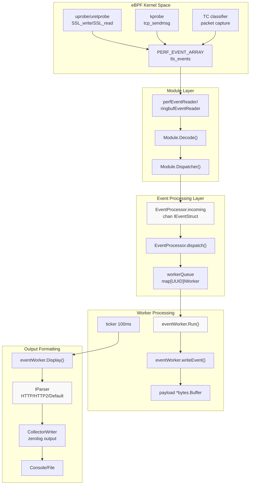
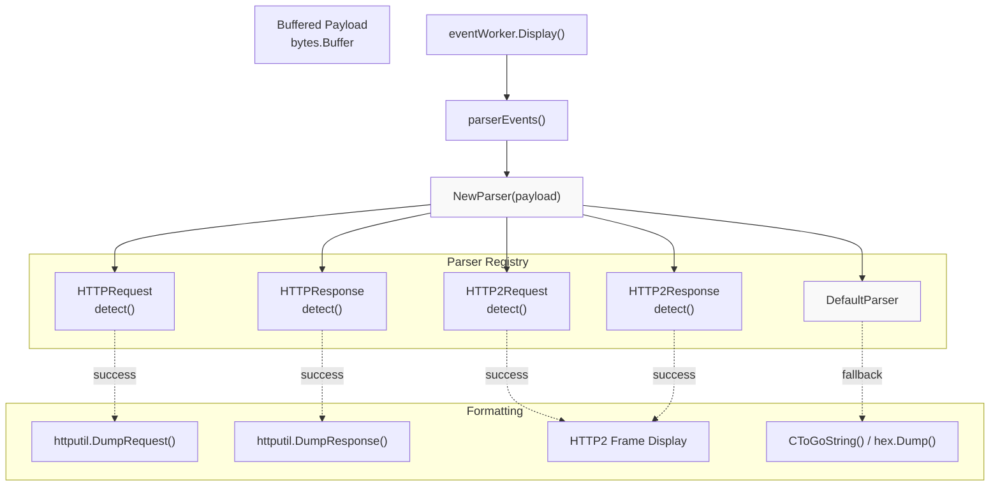
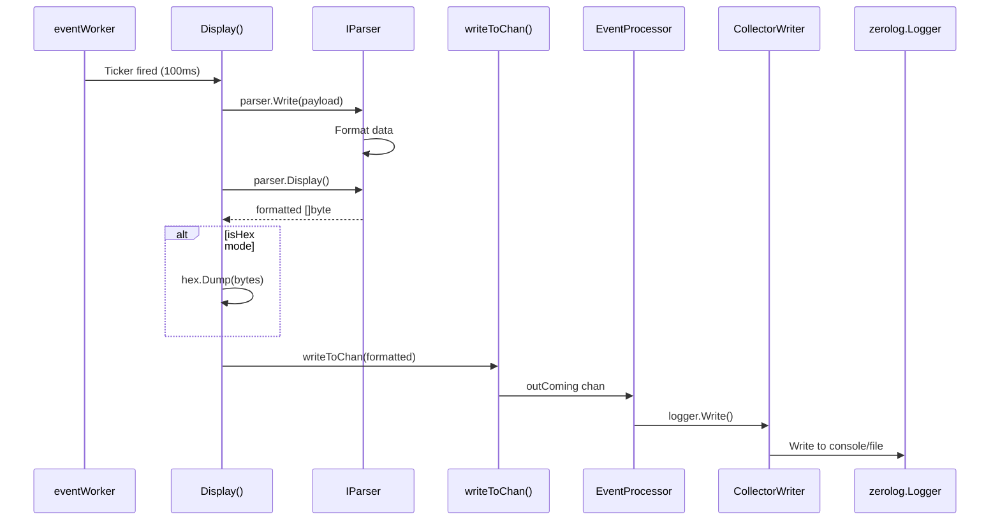
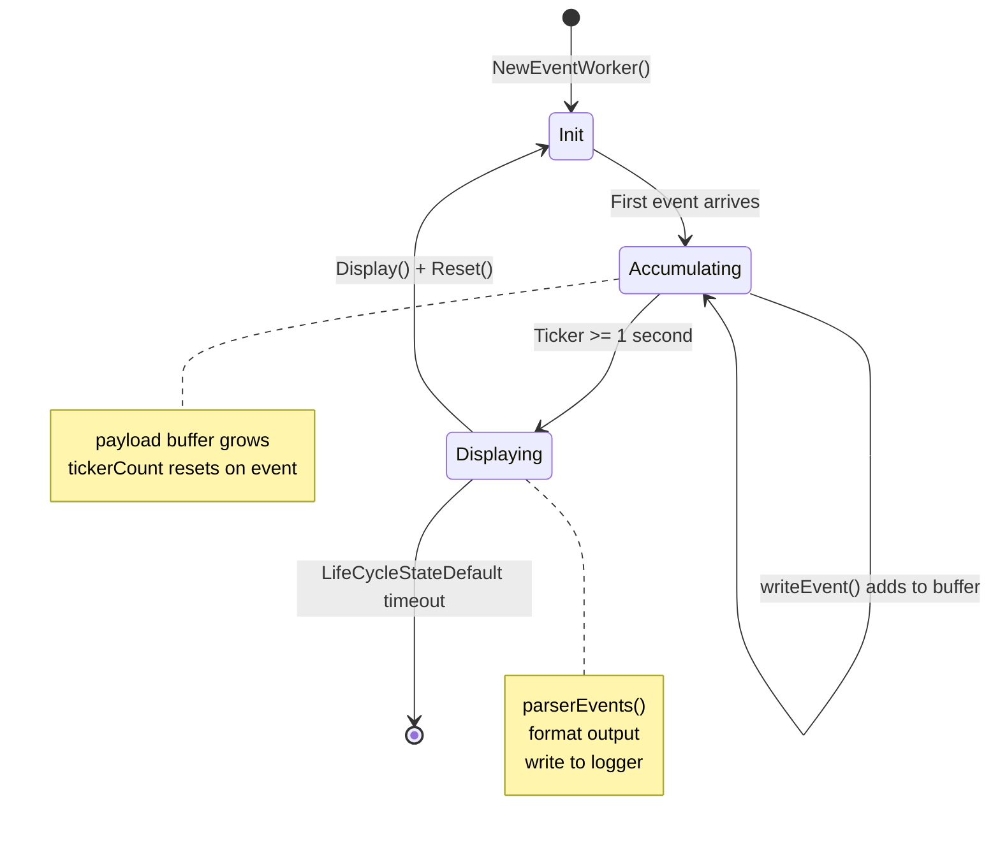

# Text Output Mode

<details>
<summary>Relevant source files</summary>

The following files were used as context for generating this wiki page:

- [CHANGELOG.md](https://github.com/gojue/ecapture/blob/ca085d05/CHANGELOG.md)
- [README.md](https://github.com/gojue/ecapture/blob/ca085d05/README.md)
- [README_CN.md](https://github.com/gojue/ecapture/blob/ca085d05/README_CN.md)
- [images/ecapture-help-v0.8.9.svg](https://github.com/gojue/ecapture/blob/ca085d05/images/ecapture-help-v0.8.9.svg)
- [main.go](https://github.com/gojue/ecapture/blob/ca085d05/main.go)
- [pkg/event_processor/http_request.go](https://github.com/gojue/ecapture/blob/ca085d05/pkg/event_processor/http_request.go)
- [pkg/event_processor/http_response.go](https://github.com/gojue/ecapture/blob/ca085d05/pkg/event_processor/http_response.go)
- [pkg/event_processor/iparser.go](https://github.com/gojue/ecapture/blob/ca085d05/pkg/event_processor/iparser.go)
- [pkg/event_processor/iworker.go](https://github.com/gojue/ecapture/blob/ca085d05/pkg/event_processor/iworker.go)
- [pkg/event_processor/processor.go](https://github.com/gojue/ecapture/blob/ca085d05/pkg/event_processor/processor.go)
- [user/event/ievent.go](https://github.com/gojue/ecapture/blob/ca085d05/user/event/ievent.go)

</details>


Text output mode is the default capture mode for eCapture, which displays captured plaintext data directly to the console or log files in human-readable format. Unlike pcap mode ([4.2](4.2-pcap-integration.md)) which saves packets for Wireshark, or keylog mode ([4.3](4.3-tls-key-logging.md)) which only captures TLS keys, text mode provides real-time visibility into decrypted communication content with minimal configuration.

For remote/GUI integration using protobuf format, see [Protobuf and External Integration](4.4-protobuf-and-external-integration.md). For general event processing architecture, see [Event Processing Pipeline](../2-architecture/2.2-event-processing-pipeline.md).

---

## Overview

Text mode operates as a streaming output mechanism that:
- **Default behavior**: Activates when no `-m` flag is specified or explicitly set with `-m text`
- **Real-time display**: Events are processed and displayed as they occur
- **Protocol-aware formatting**: Automatically detects and formats HTTP/1.x, HTTP/2, and other protocols
- **Flexible output**: Supports both console output and file logging
- **Metadata enrichment**: Includes process context (PID, command name, network tuple) with each event

Starting from version v0.7.0, text mode no longer captures TLS master keys; use keylog mode ([4.3](4.3-tls-key-logging.md)) for key extraction.

**Sources:** [README.md:249-253](https://github.com/gojue/ecapture/blob/ca085d05/README.md#L249-L253), [CHANGELOG.md:697-723](https://github.com/gojue/ecapture/blob/ca085d05/CHANGELOG.md#L697-L723)

---

## Configuration

### Command Line Flags

Text mode is controlled through several flags passed to capture modules (tls, gotls, gnutls, etc.):

| Flag | Type | Default | Description |
|------|------|---------|-------------|
| `-m text` | string | (default) | Explicitly set text output mode |
| `--hex` | boolean | false | Output payload in hexadecimal dump format |
| `--logaddr` | string | "" | Network address for log forwarding |
| `-w` / `--output` | string | "" | Write output to specified file instead of stdout |
| `--truncate` | uint64 | 0 | Truncate event payloads to specified size (bytes) |

### Logger Configuration

The text output system uses two writer implementations:

1. **CollectorWriter**: Uses `zerolog` for structured console/file logging (default for text mode)
2. **ProtobufWriter**: Marshals events to protobuf format for WebSocket transmission

**Sources:** [pkg/event_processor/processor.go:42-49](https://github.com/gojue/ecapture/blob/ca085d05/pkg/event_processor/processor.go#L42-L49), [user/event/ievent.go:54-70](https://github.com/gojue/ecapture/blob/ca085d05/user/event/ievent.go#L54-L70)

---

## Output Format

### Standard Text Format

Each captured event is formatted with metadata and payload:

```
UUID:<PID>_<TID>_<Comm>_<FD>_<DataType>_<Tuple>, Name:<ParserType>, Type:<TypeID>, Length:<Bytes>
PID:<PID>, Comm:<CommandName>, Src:<SrcIP>:<SrcPort>, Dest:<DstIP>:<DstPort>,
<Formatted Payload>
```

**Example output from OpenSSL capture:**

```
2024-09-15T11:50:31Z ??? UUID:233479_233479_curl_5_1_39.156.66.10:443, Name:HTTPRequest, Type:1, Length:73
GET / HTTP/1.1
Host: baidu.com
Accept: */*
User-Agent: curl/7.81.0
```

### Hexadecimal Mode

When `--hex` flag is enabled, payloads are displayed as hexadecimal dump instead of formatted text:

```go
// Hexadecimal dump format (example)
00000000  47 45 54 20 2f 20 48 54  54 50 2f 31 2e 31 0d 0a  |GET / HTTP/1.1..|
00000010  48 6f 73 74 3a 20 62 61  69 64 75 2e 63 6f 6d 0d  |Host: baidu.com.|
```

**Sources:** [pkg/event_processor/iworker.go:192-194](https://github.com/gojue/ecapture/blob/ca085d05/pkg/event_processor/iworker.go#L192-L194), [README_CN.md:103-126](https://github.com/gojue/ecapture/blob/ca085d05/README_CN.md#L103-L126)

---

## Event Flow Architecture

### Data Pipeline


```mermaid
graph TB
    subgraph "eBPF Kernel Space"
        UPROBE["uprobe/uretprobe<br/>SSL_write/SSL_read"]
        KPROBE["kprobe<br/>tcp_sendmsg"]
        TC["TC classifier<br/>packet capture"]
        PERFMAP["PERF_EVENT_ARRAY<br/>tls_events"]
    end
    
    subgraph "Module Layer"
        READER["perfEventReader/<br/>ringbufEventReader"]
        DECODE["Module.Decode()"]
        DISPATCHER["Module.Dispatcher()"]
    end
    
    subgraph "Event Processing Layer"
        EVTPROC["EventProcessor.incoming<br/>chan IEventStruct"]
        DISPATCH2["EventProcessor.dispatch()"]
        WORKERQ["workerQueue<br/>map[UUID]IWorker"]
    end
    
    subgraph "Worker Processing"
        WORKER["eventWorker.Run()"]
        WRITEEVENT["eventWorker.writeEvent()"]
        PAYLOAD["payload *bytes.Buffer"]
        TICKER["ticker 100ms"]
    end
    
    subgraph "Output Formatting"
        DISPLAY["eventWorker.Display()"]
        PARSER["IParser<br/>HTTP/HTTP2/Default"]
        LOGGER["CollectorWriter<br/>zerolog output"]
        STDOUT["Console/File"]
    end
    
    UPROBE --> PERFMAP
    KPROBE --> PERFMAP
    TC --> PERFMAP
    
    PERFMAP --> READER
    READER --> DECODE
    DECODE --> DISPATCHER
    
    DISPATCHER --> EVTPROC
    EVTPROC --> DISPATCH2
    DISPATCH2 --> WORKERQ
    WORKERQ --> WORKER
    
    WORKER --> WRITEEVENT
    WRITEEVENT --> PAYLOAD
    TICKER --> DISPLAY
    
    DISPLAY --> PARSER
    PARSER --> LOGGER
    LOGGER --> STDOUT
    
    style EVTPROC fill:#f9f9f9
    style WORKER fill:#f9f9f9
    style PARSER fill:#f9f9f9
```

**Flow description:**

1. **eBPF Events**: Captured by uprobes/kprobes and sent through `PERF_EVENT_ARRAY` maps
2. **Module Decode**: Module-specific decoder (e.g., OpenSSL, GoTLS) parses raw eBPF event into `IEventStruct`
3. **Event Dispatch**: `EventProcessor` receives events and routes them to UUID-specific workers
4. **Worker Accumulation**: Each `eventWorker` buffers events in `payload` until a display trigger occurs
5. **Display Trigger**: 100ms ticker fires when no new data arrives
6. **Parser Selection**: System detects protocol (HTTP/HTTP2/Default) and applies appropriate formatter
7. **Output**: Formatted data written to console or file via `CollectorWriter`

**Sources:** [pkg/event_processor/processor.go:65-89](https://github.com/gojue/ecapture/blob/ca085d05/pkg/event_processor/processor.go#L65-L89), [pkg/event_processor/iworker.go:262-306](https://github.com/gojue/ecapture/blob/ca085d05/pkg/event_processor/iworker.go#L262-L306)

---

## Parser Selection and Formatting

### Parser Detection Flow


```mermaid
graph TB
    PAYLOAD["Buffered Payload<br/>bytes.Buffer"]
    DISPLAY["eventWorker.Display()"]
    PARSEREVENTS["parserEvents()"]
    NEWPARSER["NewParser(payload)"]
    
    subgraph "Parser Registry"
        HTTP_REQ["HTTPRequest<br/>detect()"]
        HTTP_RESP["HTTPResponse<br/>detect()"]
        HTTP2_REQ["HTTP2Request<br/>detect()"]
        HTTP2_RESP["HTTP2Response<br/>detect()"]
        DEFAULT["DefaultParser"]
    end
    
    subgraph "Formatting"
        HTTP_REQ_FMT["httputil.DumpRequest()"]
        HTTP_RESP_FMT["httputil.DumpResponse()"]
        HTTP2_FMT["HTTP2 Frame Display"]
        DEFAULT_FMT["CToGoString() / hex.Dump()"]
    end
    
    DISPLAY --> PARSEREVENTS
    PARSEREVENTS --> NEWPARSER
    
    NEWPARSER --> HTTP_REQ
    NEWPARSER --> HTTP_RESP
    NEWPARSER --> HTTP2_REQ
    NEWPARSER --> HTTP2_RESP
    NEWPARSER --> DEFAULT
    
    HTTP_REQ -.success.-> HTTP_REQ_FMT
    HTTP_RESP -.success.-> HTTP_RESP_FMT
    HTTP2_REQ -.success.-> HTTP2_FMT
    HTTP2_RESP -.success.-> HTTP2_FMT
    DEFAULT -.fallback.-> DEFAULT_FMT
    
    style NEWPARSER fill:#f9f9f9
    style DEFAULT fill:#f9f9f9
```

### Parser Types

| Parser | Detection Method | Output Format | ParserType ID |
|--------|-----------------|---------------|---------------|
| `HTTPRequest` | `http.ReadRequest()` success | HTTP request headers + body | 1 |
| `HTTPResponse` | `http.ReadResponse()` success | HTTP response headers + body | 3 |
| `HTTP2Request` | HTTP/2 frame preface detection | HTTP/2 frame-by-frame display | 2 |
| `HTTP2Response` | HTTP/2 frame detection | HTTP/2 frame-by-frame display | 4 |
| `DefaultParser` | Fallback if all fail | Raw text or hex dump | 0 |

**Sources:** [pkg/event_processor/iparser.go:85-115](https://github.com/gojue/ecapture/blob/ca085d05/pkg/event_processor/iparser.go#L85-L115), [pkg/event_processor/http_request.go:83-92](https://github.com/gojue/ecapture/blob/ca085d05/pkg/event_processor/http_request.go#L83-L92), [pkg/event_processor/http_response.go:94-102](https://github.com/gojue/ecapture/blob/ca085d05/pkg/event_processor/http_response.go#L94-L102)

---

## CollectorWriter Implementation

### Text Output Path


```mermaid
sequenceDiagram
    participant Worker as eventWorker
    participant Display as Display()
    participant Parser as IParser
    participant Writer as writeToChan()
    participant Processor as EventProcessor
    participant Logger as CollectorWriter
    participant Zerolog as zerolog.Logger
    
    Worker->>Display: Ticker fired (100ms)
    Display->>Parser: parser.Write(payload)
    Parser->>Parser: Format data
    Display->>Parser: parser.Display()
    Parser-->>Display: formatted []byte
    
    alt isHex mode
        Display->>Display: hex.Dump(bytes)
    end
    
    Display->>Writer: writeToChan(formatted)
    Writer->>Processor: outComing chan
    Processor->>Logger: logger.Write()
    Logger->>Zerolog: Write to console/file
```

The `CollectorWriter` wraps a `zerolog.Logger` instance and implements the standard `io.Writer` interface, enabling seamless integration with the event processing pipeline:

```go
// CollectorWriter struct (conceptual)
type CollectorWriter struct {
    logger *zerolog.Logger
}

func (e CollectorWriter) Write(p []byte) (n int, err error) {
    return e.logger.Write(p)
}
```

**Output format includes:**
- Timestamp (RFC3339 format)
- Log level (INFO/WARN/ERROR)
- Event UUID
- Parser name
- Formatted payload

**Sources:** [user/event/ievent.go:54-70](https://github.com/gojue/ecapture/blob/ca085d05/user/event/ievent.go#L54-L70), [pkg/event_processor/iworker.go:198-212](https://github.com/gojue/ecapture/blob/ca085d05/pkg/event_processor/iworker.go#L198-L212)

---

## Worker Lifecycle and Display Triggers

### Event Worker State Machine


```mermaid
stateDiagram-v2
    [*] --> Init: NewEventWorker()
    Init --> Accumulating: First event arrives
    Accumulating --> Accumulating: writeEvent() adds to buffer
    Accumulating --> Displaying: Ticker >= 1 second
    Displaying --> Init: Display() + Reset()
    Displaying --> [*]: LifeCycleStateDefault timeout
    
    note right of Accumulating
        payload buffer grows
        tickerCount resets on event
    end note
    
    note right of Displaying
        parserEvents()
        format output
        write to logger
    end note
```

### Display Trigger Logic

The `eventWorker` uses a 100ms ticker to detect idle periods:

| Condition | Action |
|-----------|--------|
| `tickerCount > 10` (1 second) | Trigger `Display()` |
| After `Display()` | Reset payload buffer and parser |
| `LifeCycleStateDefault` mode | Delete worker and exit |
| `LifeCycleStateSock` mode | Continue running, start new ticker |

**Truncation behavior:**

If `truncateSize` is configured and `payload.Len() >= truncateSize`, the worker:
1. Truncates payload to specified size: `payload.Truncate(tsize)`
2. Logs truncation message
3. Stops accepting new events for that UUID

**Sources:** [pkg/event_processor/iworker.go:262-306](https://github.com/gojue/ecapture/blob/ca085d05/pkg/event_processor/iworker.go#L262-L306), [pkg/event_processor/iworker.go:236-245](https://github.com/gojue/ecapture/blob/ca085d05/pkg/event_processor/iworker.go#L236-L245)

---

## Configuration Examples

### Basic Text Mode (Console Output)

```bash
# OpenSSL module, text mode, console output
sudo ecapture tls

# GoTLS module, text mode with hex dump
sudo ecapture gotls --elfpath=/path/to/go_binary --hex

# Target specific PID
sudo ecapture tls --pid=1234
```

### File Output

```bash
# Write to file instead of console
sudo ecapture tls -w output.log

# With truncation to limit memory usage
sudo ecapture tls -w output.log --truncate=4096
```

### Filtered Output

```bash
# Capture only specific process
sudo ecapture tls --pid=5678 -w tls_capture.log

# Capture specific user's traffic
sudo ecapture tls --uid=1000
```

**Sources:** [README.md:72-149](https://github.com/gojue/ecapture/blob/ca085d05/README.md#L72-L149), [README_CN.md:74-126](https://github.com/gojue/ecapture/blob/ca085d05/README_CN.md#L74-L126)

---

## HTTP/HTTP2 Formatting Examples

### HTTP/1.x Request Display

```
2024-09-15T11:50:31Z ??? UUID:233479_233479_curl_5_1_39.156.66.10:443, Name:HTTPRequest, Type:1, Length:73
GET / HTTP/1.1
Host: baidu.com
Accept: */*
User-Agent: curl/7.81.0
```

### HTTP/1.x Response Display

```
2024-09-15T11:50:32Z ??? UUID:233479_233479_curl_5_0_39.156.66.10:443, Name:HTTPResponse, Type:3, Length:357
HTTP/1.1 302 Moved Temporarily
Content-Length: 161
Connection: keep-alive
Content-Type: text/html
Date: Sun, 15 Sep 2024 11:50:30 GMT
Location: http://www.baidu.com/
Server: bfe/1.0.8.18

<html>
<head><title>302 Found</title></head>
<body bgcolor="white">
<center><h1>302 Found</h1></center>
</body></html>
```

### HTTP/2 Request Display

```
2024-09-15T11:51:53Z ??? UUID:233851_233851_curl_5_1_172.16.71.1:51837, Name:HTTP2Request, Type:2, Length:304

Frame Type	=>	SETTINGS

Frame Type	=>	WINDOW_UPDATE

Frame Type	=>	HEADERS
header field ":method" = "GET"
header field ":path" = "/"
header field ":scheme" = "https"
header field ":authority" = "google.com"
header field "user-agent" = "curl/7.81.0"
header field "accept" = "*/*"
```

**Sources:** [README.md:102-148](https://github.com/gojue/ecapture/blob/ca085d05/README.md#L102-L148), [README_CN.md:103-126](https://github.com/gojue/ecapture/blob/ca085d05/README_CN.md#L103-L126)

---

## Protocol-Specific Formatting

### HTTP Request Formatter

The `HTTPRequest` parser processes HTTP/1.x requests:

1. **Detection**: Calls `http.ReadRequest()` on first chunk
2. **Accumulation**: Buffers subsequent chunks until complete
3. **Decompression**: Handles `Content-Encoding: gzip` automatically
4. **Output**: Uses `httputil.DumpRequest()` for formatted display

**Key functions:**
- `HTTPRequest.detect()`: Validates HTTP request syntax [pkg/event_processor/http_request.go:83-92](https://github.com/gojue/ecapture/blob/ca085d05/pkg/event_processor/http_request.go#L83-L92)
- `HTTPRequest.Display()`: Formats and decompresses body [pkg/event_processor/http_request.go:105-157](https://github.com/gojue/ecapture/blob/ca085d05/pkg/event_processor/http_request.go#L105-L157)

### HTTP Response Formatter

The `HTTPResponse` parser handles server responses:

1. **Detection**: Calls `http.ReadResponse()` on payload
2. **Body handling**: Reads full response body with `io.ReadAll()`
3. **Compression**: Detects and decompresses gzip-encoded bodies
4. **Special cases**: Handles chunked transfer encoding and truncated bodies

**Key functions:**
- `HTTPResponse.detect()`: Validates response structure [pkg/event_processor/http_response.go:94-102](https://github.com/gojue/ecapture/blob/ca085d05/pkg/event_processor/http_response.go#L94-L102)
- `HTTPResponse.Display()`: Formats headers and body [pkg/event_processor/http_response.go:115-175](https://github.com/gojue/ecapture/blob/ca085d05/pkg/event_processor/http_response.go#L115-L175)

### Default Parser

When no specialized parser matches, `DefaultParser` provides:
- Raw byte output for binary data
- C-string to Go string conversion for text
- Hexadecimal dump for non-printable characters

**Detection logic** [pkg/event_processor/iparser.go:157-160](https://github.com/gojue/ecapture/blob/ca085d05/pkg/event_processor/iparser.go#L157-L160):
```go
// Display decision based on first byte
if b[0] < 32 || b[0] > 126 {
    return []byte(hex.Dump(b))  // Non-printable: hex dump
}
return []byte(CToGoString(b))  // Printable: text
```

**Sources:** [pkg/event_processor/http_request.go:105-157](https://github.com/gojue/ecapture/blob/ca085d05/pkg/event_processor/http_request.go#L105-L157), [pkg/event_processor/http_response.go:115-175](https://github.com/gojue/ecapture/blob/ca085d05/pkg/event_processor/http_response.go#L115-L175), [pkg/event_processor/iparser.go:117-166](https://github.com/gojue/ecapture/blob/ca085d05/pkg/event_processor/iparser.go#L117-L166)

---

## Memory Management and Truncation

### Truncation Mechanism

To prevent memory exhaustion from large payloads, text mode supports truncation:

```go
// Truncation check before writing events
tsize := int(processor.truncateSize)
if tsize > 0 && payload.Len() >= tsize {
    payload.Truncate(tsize)
    Log(fmt.Sprintf("Events truncated, size: %d bytes\n", tsize))
    return  // Stop accepting more events
}
```

**Configuration:**
- Set via `--truncate=<bytes>` flag
- Default: 0 (no truncation)
- When triggered: Worker stops accumulating and displays truncated content

### Memory Efficiency Improvements

Version 1.1.0 introduced memory optimizations:
- **Redesigned truncation logic** to reduce memory cost in text mode
- **Per-worker buffering** instead of global accumulation
- **Early truncation** prevents oversized payloads from being allocated

**Sources:** [pkg/event_processor/iworker.go:236-245](https://github.com/gojue/ecapture/blob/ca085d05/pkg/event_processor/iworker.go#L236-L245), [CHANGELOG.md:163-164](https://github.com/gojue/ecapture/blob/ca085d05/CHANGELOG.md#L163-L164)

---

## Metadata and Context Enrichment

### UUID Format

Each event includes a UUID that encodes connection context:

**Standard format:**
```
<PID>_<TID>_<Comm>_<FD>_<DataType>_<SrcIP:SrcPort-DstIP:DstPort>
```

**Socket lifecycle format** (for connection-bound workers):
```
sock:<PID>_<TID>_<Comm>_<FD>_<DataType>_<SrcIP:SrcPort-DstIP:DstPort>_<SocketPtr>
```

The UUID parser extracts:
- `uuidOutput`: Display format (without socket pointer)
- `DestroyUUID`: Socket pointer for lifecycle management
- `ewLifeCycleState`: Worker lifecycle mode

**Sources:** [pkg/event_processor/iworker.go:100-123](https://github.com/gojue/ecapture/blob/ca085d05/pkg/event_processor/iworker.go#L100-L123), [user/event/ievent.go:39](https://github.com/gojue/ecapture/blob/ca085d05/user/event/ievent.go#L39)

### Event Base Structure

Every event includes common metadata fields:

| Field | Type | Description |
|-------|------|-------------|
| `PID` | uint32 | Process ID |
| `PName` | string | Command name |
| `SrcIP` | string | Source IP address |
| `SrcPort` | uint16 | Source port |
| `DstIP` | string | Destination IP address |
| `DstPort` | uint16 | Destination port |
| `Timestamp` | uint64 | Kernel timestamp (nanoseconds) |

This metadata is displayed in the formatted output header.

**Sources:** [pkg/event_processor/iworker.go:200-212](https://github.com/gojue/ecapture/blob/ca085d05/pkg/event_processor/iworker.go#L200-L212)

---

## Integration with Other Modules

### Module-Specific Text Output

Each capture module (OpenSSL, GoTLS, GnuTLS, etc.) generates events that flow through the text output pipeline:

| Module | Event Types | Text Mode Support |
|--------|-------------|-------------------|
| **OpenSSL** ([3.1.1](../3-capture-modules/3.1.1-openssl-module.md)) | SSLDataEvent | Full HTTP/HTTP2 parsing |
| **GoTLS** ([3.1.3](../3-capture-modules/3.1.3-go-tls-module.md)) | SSLDataEvent | Full HTTP/HTTP2 parsing |
| **GnuTLS** ([3.1.4](../3-capture-modules/3.1.4-gnutls-and-nss-modules.md)) | SSLDataEvent | Full HTTP/HTTP2 parsing |
| **Bash** ([3.2.1](../3-capture-modules/3.2.1-shell-command-auditing.md)) | BashEvent | Command-line text display |
| **MySQL** ([3.2.2](../3-capture-modules/3.2.2-database-query-auditing.md)) | MySQLEvent | SQL query text display |
| **Postgres** ([3.2.2](../3-capture-modules/3.2.2-database-query-auditing.md)) | PostgresEvent | SQL query text display |

All modules share the same `EventProcessor` and output formatting pipeline.

**Sources:** [README.md:152-161](https://github.com/gojue/ecapture/blob/ca085d05/README.md#L152-L161)

---

## Comparison with Other Output Modes

| Feature | Text Mode | Pcap Mode ([4.2](4.2-pcap-integration.md)) | Keylog Mode ([4.3](4.3-tls-key-logging.md)) |
|---------|-----------|-------------------------|---------------------------|
| **Real-time display** | ✓ Console/log output | × Buffered to file | × File only |
| **Protocol parsing** | ✓ HTTP/HTTP2 formatted | × Raw packets | × Keys only |
| **Master key capture** | × (since v0.7.0) | ✓ DSB block in pcapng | ✓ SSLKEYLOGFILE format |
| **Wireshark compatible** | × | ✓ Native support | ✓ Via keylog file |
| **Memory usage** | Low (streaming) | Higher (packet buffering) | Minimal (keys only) |
| **Use case** | Live monitoring | Forensic analysis | Offline decryption |

**Sources:** [CHANGELOG.md:697-723](https://github.com/gojue/ecapture/blob/ca085d05/CHANGELOG.md#L697-L723)

---

## Error Handling and Logging

### Event Processing Errors

When parsers encounter errors during formatting:

1. **HTTP/HTTP2 parse errors**: Logged but do not stop processing
2. **Truncation errors**: Logged with truncation size
3. **Write errors**: Logged but events continue to flow
4. **EOF errors**: Ignored (normal for incomplete streams)

**Example error messages:**
```
eventWorker: write events failed, unknow eventWorker status: 2
ew.parser uuid: sock:1234_1234_curl_5_1... type 1 write payload 2048 bytes, error:unexpected EOF
```

### Worker Error Handling

The `eventWorker.Run()` loop handles errors gracefully:
- **Incoming channel full**: Drops event, logs error
- **Outgoing channel full**: Logs error, continues processing
- **Parser errors**: Logged but not fatal, falls back to hex dump

**Sources:** [pkg/event_processor/iworker.go:154-172](https://github.com/gojue/ecapture/blob/ca085d05/pkg/event_processor/iworker.go#L154-L172), [pkg/event_processor/iworker.go:254-257](https://github.com/gojue/ecapture/blob/ca085d05/pkg/event_processor/iworker.go#L254-L257)

---

## Performance Considerations

### Throughput and Latency

Text mode characteristics:

- **Latency**: 100ms baseline (ticker interval) + parsing time
- **Throughput**: Limited by console/file I/O, not CPU-bound
- **CPU usage**: Parser overhead for HTTP/HTTP2 detection and formatting
- **Memory**: Configurable via `--truncate` flag

### Optimization Strategies

1. **Use truncation** for high-volume captures to prevent memory growth
2. **Write to file** instead of console for better throughput
3. **Filter by PID/UID** to reduce event volume
4. **Use hex mode** to skip protocol parsing overhead

**Sources:** [CHANGELOG.md:163-164](https://github.com/gojue/ecapture/blob/ca085d05/CHANGELOG.md#L163-L164), [pkg/event_processor/iworker.go:236-245](https://github.com/gojue/ecapture/blob/ca085d05/pkg/event_processor/iworker.go#L236-L245)