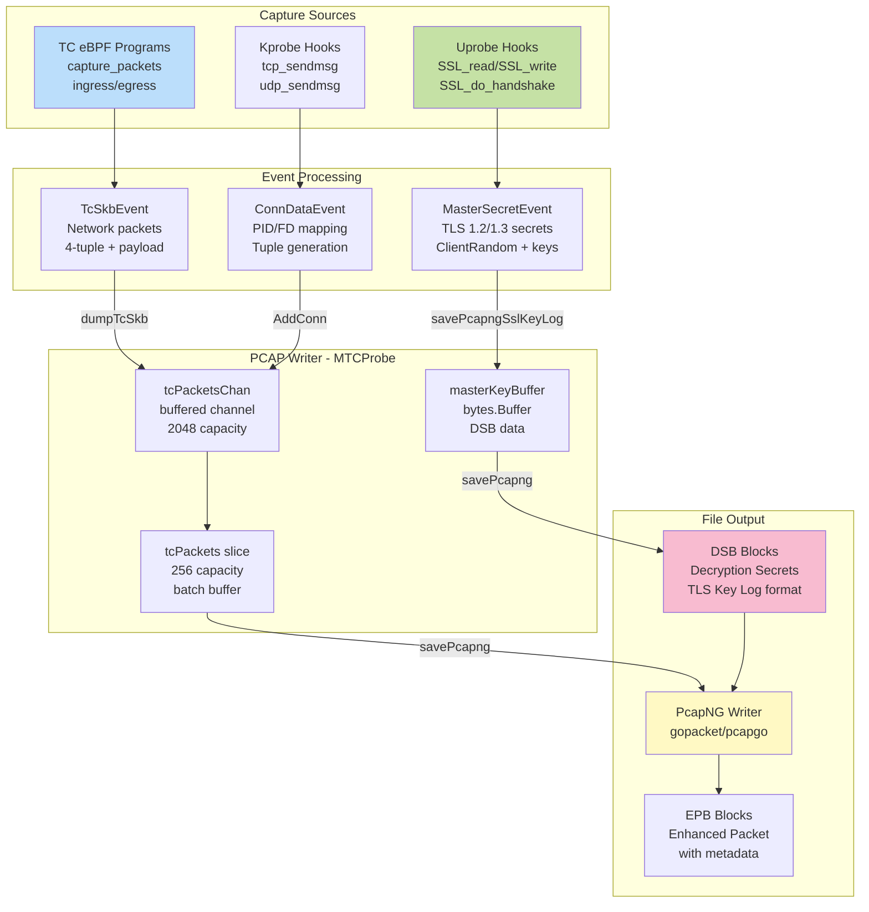
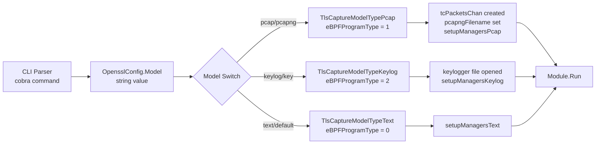
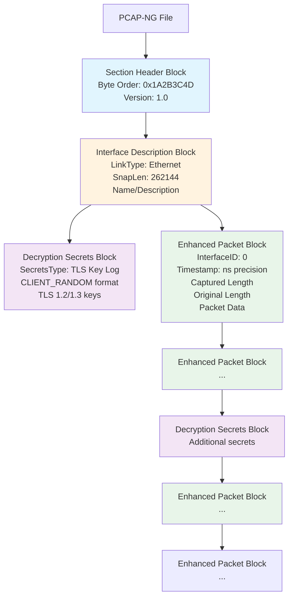
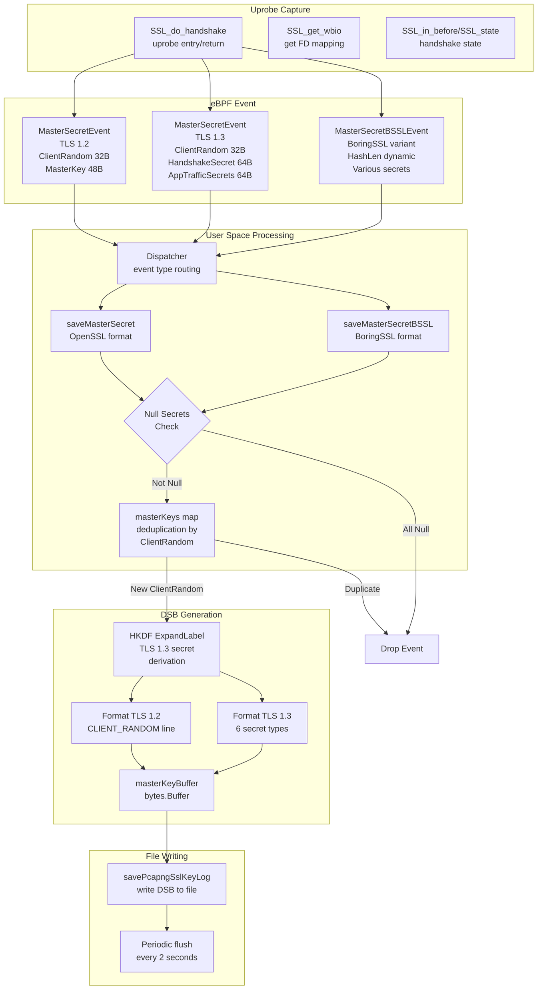
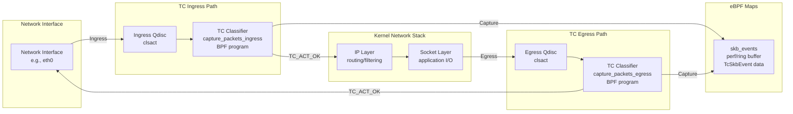
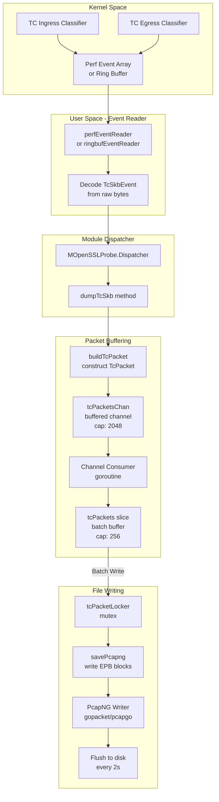
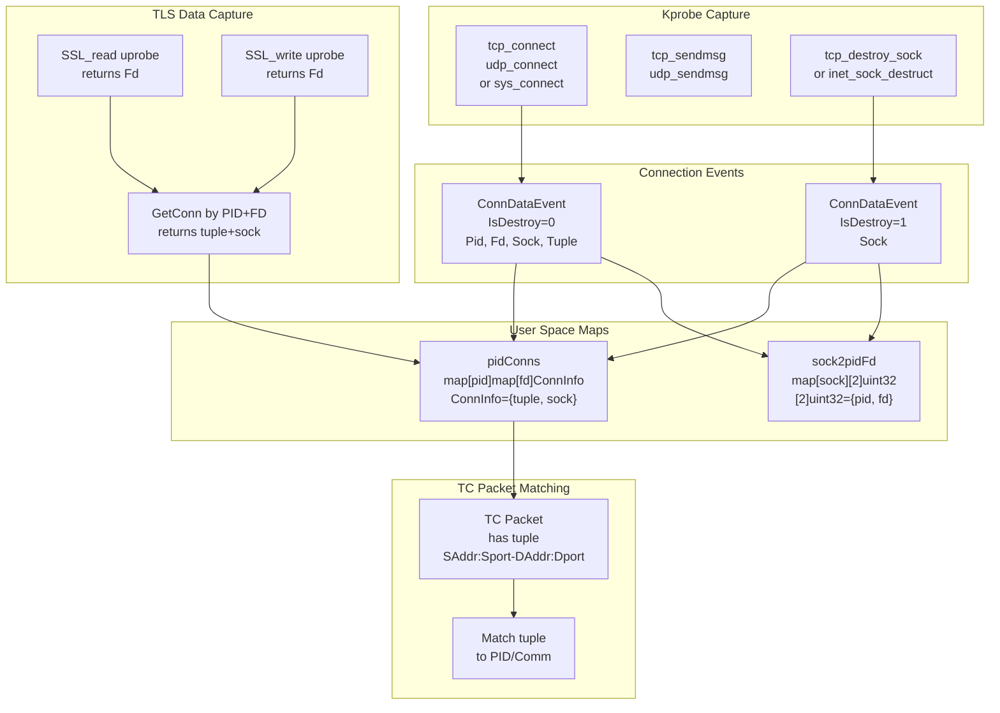
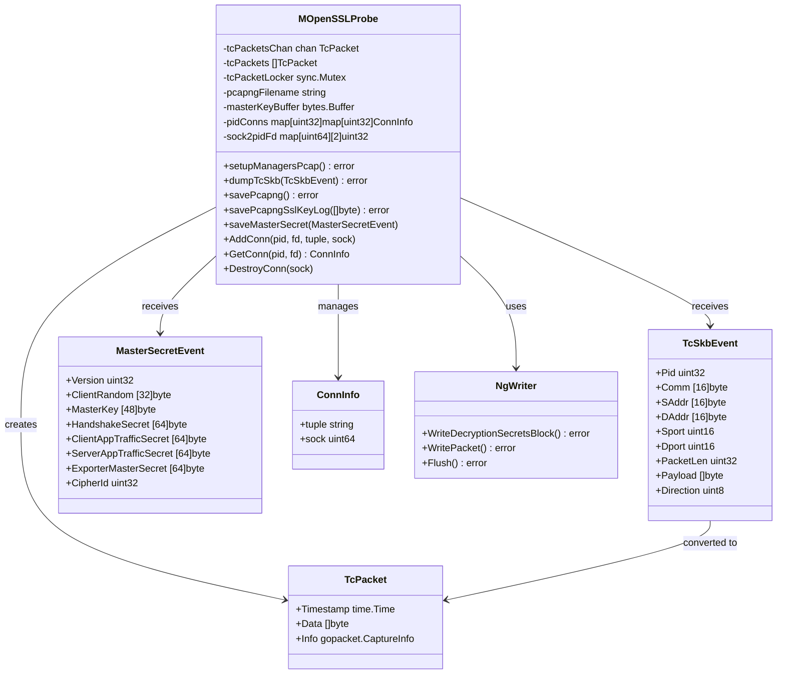

# PCAP Integration

<details>
<summary>Relevant source files</summary>

The following files were used as context for generating this wiki page:

- [CHANGELOG.md](https://github.com/gojue/ecapture/blob/0766a93b/CHANGELOG.md)
- [README.md](https://github.com/gojue/ecapture/blob/0766a93b/README.md)
- [README_CN.md](https://github.com/gojue/ecapture/blob/0766a93b/README_CN.md)
- [cli/cmd/root.go](https://github.com/gojue/ecapture/blob/0766a93b/cli/cmd/root.go)
- [images/ecapture-help-v0.8.9.svg](https://github.com/gojue/ecapture/blob/0766a93b/images/ecapture-help-v0.8.9.svg)
- [main.go](https://github.com/gojue/ecapture/blob/0766a93b/main.go)
- [user/config/iconfig.go](https://github.com/gojue/ecapture/blob/0766a93b/user/config/iconfig.go)
- [user/module/imodule.go](https://github.com/gojue/ecapture/blob/0766a93b/user/module/imodule.go)
- [user/module/probe_openssl.go](https://github.com/gojue/ecapture/blob/0766a93b/user/module/probe_openssl.go)

</details>


## Purpose and Scope

This document describes eCapture's PCAP-NG file generation capabilities, which enable network packet capture and storage in a format compatible with Wireshark and other network analysis tools. The PCAP integration captures both encrypted network traffic and the TLS/SSL decryption keys required to decrypt it, storing them together in a single PCAP-NG file with Decryption Secrets Blocks (DSB).

For information about other output formats, see [Text Output Mode](4.1-text-output-mode.md) and [TLS Key Logging](4.3-tls-key-logging.md). For details on the underlying packet capture mechanism, see [Network Connection Tracking](../2-architecture/2.6-network-connection-tracking.md).

---

## Overview

eCapture's PCAP integration operates in `pcap` or `pcapng` mode, which differs fundamentally from text mode by capturing complete network packets rather than just plaintext content. This mode combines three data sources into a unified PCAP-NG file:

1. **Network packets** captured via TC (Traffic Control) eBPF classifiers on ingress/egress
2. **TLS master secrets** extracted via uprobe hooks on SSL/TLS functions  
3. **Connection metadata** including process information (PID, UID, command name)

The resulting PCAP-NG file can be opened in Wireshark with automatic decryption of TLS traffic using the embedded master secrets.

**PCAP Integration Architecture**



Sources: [user/module/probe_openssl.go:137-148](https://github.com/gojue/ecapture/blob/0766a93b/user/module/probe_openssl.go#L137-L148), [user/module/probe_openssl.go:287-296](https://github.com/gojue/ecapture/blob/0766a93b/user/module/probe_openssl.go#L287-L296), [README.md:173-187](https://github.com/gojue/ecapture/blob/0766a93b/README.md#L173-L187)

---

## Activation and Configuration

### Command Line Usage

PCAP mode is activated using the `-m pcap` or `-m pcapng` flag with the `tls` or `gotls` modules. Required parameters include:

| Parameter | Description | Default Value |
|-----------|-------------|---------------|
| `-m pcap` or `-m pcapng` | Activates PCAP mode | N/A (required) |
| `--pcapfile` | Output file path | `ecapture_openssl.pcapng` |
| `-i` | Network interface to capture | N/A (required) |
| PCAP filter expression | Optional BPF filter | None |

Example command:
```bash
sudo ecapture tls -m pcap -i eth0 --pcapfile=capture.pcapng tcp port 443
```

**Mode Selection Implementation**



Sources: [user/module/probe_openssl.go:127-154](https://github.com/gojue/ecapture/blob/0766a93b/user/module/probe_openssl.go#L127-L154), [user/config/iconfig.go:73-79](https://github.com/gojue/ecapture/blob/0766a93b/user/config/iconfig.go#L73-L79), [cli/cmd/root.go:249-296](https://github.com/gojue/ecapture/blob/0766a93b/cli/cmd/root.go#L249-L296)

### Configuration Structure

The PCAP mode is configured through `OpensslConfig`:

```
OpensslConfig.Model = "pcap" or "pcapng"
OpensslConfig.PcapFile = output file path
OpensslConfig.Ifname = network interface name
OpensslConfig.PcapFilter = optional BPF filter expression
```

This configuration triggers initialization of:
- `tcPacketsChan`: Buffered channel (capacity 2048) for packet queueing
- `tcPackets`: Slice buffer (capacity 256) for batch writing
- `pcapngFilename`: Absolute path to output file

Sources: [user/module/probe_openssl.go:137-148](https://github.com/gojue/ecapture/blob/0766a93b/user/module/probe_openssl.go#L137-L148)

---

## PCAP-NG File Format

### File Structure

eCapture generates PCAP-NG (Next Generation) files, which extend the classic PCAP format with richer metadata. The file structure consists of:

1. **Section Header Block (SHB)**: File identification and byte order
2. **Interface Description Block (IDB)**: Network interface metadata
3. **Decryption Secrets Block (DSB)**: TLS master secrets for decryption
4. **Enhanced Packet Block (EPB)**: Individual packet data with timestamps

**PCAP-NG Block Structure**



Sources: [user/module/probe_openssl.go:558-565](https://github.com/gojue/ecapture/blob/0766a93b/user/module/probe_openssl.go#L558-L565), [user/module/probe_openssl.go:625-632](https://github.com/gojue/ecapture/blob/0766a93b/user/module/probe_openssl.go#L625-L632)

### Enhanced Packet Block (EPB) Content

Each captured packet is stored as an EPB with:

- **Interface ID**: Links to the IDB (typically 0)
- **Timestamp**: Nanosecond precision (boot time + monotonic clock)
- **Captured packet length**: Actual bytes captured
- **Original packet length**: Length on wire (may exceed captured if truncated)
- **Packet data**: Raw Ethernet frame including:
  - Ethernet header (14 bytes)
  - IP header (IPv4 or IPv6)
  - Transport header (TCP/UDP)
  - Application payload (encrypted or decrypted)

The packet data comes from TC eBPF programs that capture the complete network frame at ingress/egress points.

Sources: [user/module/probe_openssl.go:747-750](https://github.com/gojue/ecapture/blob/0766a93b/user/module/probe_openssl.go#L747-L750)

---

## Decryption Secrets Block (DSB)

### Purpose and Format

The DSB is a PCAP-NG block type that stores TLS decryption keys, enabling Wireshark to automatically decrypt captured TLS traffic. eCapture embeds DSB blocks containing master secrets in the SSLKEYLOGFILE format used by browsers and other TLS tools.

### DSB Data Format

DSB blocks contain TLS secrets in the standard key log format:

```
CLIENT_RANDOM <client_random_hex> <master_secret_hex>
CLIENT_HANDSHAKE_TRAFFIC_SECRET <client_random_hex> <secret_hex>
SERVER_HANDSHAKE_TRAFFIC_SECRET <client_random_hex> <secret_hex>
CLIENT_TRAFFIC_SECRET_0 <client_random_hex> <secret_hex>
SERVER_TRAFFIC_SECRET_0 <client_random_hex> <secret_hex>
EXPORTER_SECRET <client_random_hex> <secret_hex>
```

For TLS 1.2, only `CLIENT_RANDOM` is written. For TLS 1.3, multiple traffic secrets are derived and written.

**Master Secret Extraction and DSB Writing**



Sources: [user/module/probe_openssl.go:482-575](https://github.com/gojue/ecapture/blob/0766a93b/user/module/probe_openssl.go#L482-L575), [user/module/probe_openssl.go:577-642](https://github.com/gojue/ecapture/blob/0766a93b/user/module/probe_openssl.go#L577-L642)

### Implementation Details

#### TLS 1.2 Master Secret

For TLS 1.2, the master secret is captured directly from the SSL structure:

1. Uprobe on `SSL_do_handshake` captures the SSL context
2. Navigate to `s3->tmp.new_cipher` to get cipher suite
3. Read `session->master_key` (48 bytes)
4. Read `session->client_random` (32 bytes)
5. Format: `CLIENT_RANDOM <32 hex bytes> <48 hex bytes>`

#### TLS 1.3 Traffic Secrets

For TLS 1.3, multiple secrets are extracted and derived:

1. Capture `handshake_secret`, `handshake_traffic_hash` from SSL structure
2. Use HKDF to derive:
   - `client_handshake_traffic_secret` = HKDF-Expand-Label(handshake_secret, "c hs traffic", handshake_traffic_hash, hash_len)
   - `server_handshake_traffic_secret` = HKDF-Expand-Label(handshake_secret, "s hs traffic", handshake_traffic_hash, hash_len)
3. Capture `client_app_traffic_secret`, `server_app_traffic_secret`, `exporter_master_secret` directly
4. Write all six secret types to DSB

The HKDF expansion is performed in user space using the captured hash algorithm (SHA256 or SHA384 based on cipher suite).

Sources: [user/module/probe_openssl.go:502-551](https://github.com/gojue/ecapture/blob/0766a93b/user/module/probe_openssl.go#L502-L551), [pkg/util/hkdf/hkdf.go](https://github.com/gojue/ecapture/blob/0766a93b/pkg/util/hkdf/hkdf.go)

#### Null Secret Detection

eCapture validates that captured secrets are not null (all zeros) before writing to DSB. This prevents corruption of the keylog:

- For TLS 1.2: Check if all 48 bytes of `master_key` are zero
- For TLS 1.3: Check if all traffic secrets are zero (5 different secrets)
- If all secrets are null, the event is dropped

Sources: [user/module/probe_openssl.go:644-731](https://github.com/gojue/ecapture/blob/0766a93b/user/module/probe_openssl.go#L644-L731)

#### Deduplication

Master secrets are deduplicated using a `map[string]bool` keyed by the hex-encoded `ClientRandom`:

```
ClientRandom (32 bytes) -> hex string (64 characters) -> map key
```

If a `ClientRandom` already exists in the map, the duplicate secret is not written. This prevents the same TLS session from writing multiple identical DSB blocks.

Sources: [user/module/probe_openssl.go:483-489](https://github.com/gojue/ecapture/blob/0766a93b/user/module/probe_openssl.go#L483-L489), [user/module/probe_openssl.go:578-584](https://github.com/gojue/ecapture/blob/0766a93b/user/module/probe_openssl.go#L578-L584)

---

## TC Packet Capture Integration

### Traffic Control (TC) eBPF Programs

PCAP mode relies on TC eBPF classifiers attached to network interfaces for packet capture. Unlike uprobes that capture plaintext at the application layer, TC programs capture complete network packets including encrypted payloads.

**TC Classifier Attachment Points**



Sources: [user/module/probe_openssl.go:303-307](https://github.com/gojue/ecapture/blob/0766a93b/user/module/probe_openssl.go#L303-L307)

### TcSkbEvent Structure

Each captured packet generates a `TcSkbEvent` containing:

| Field | Type | Description |
|-------|------|-------------|
| `Pid` | uint32 | Process ID that sent/received packet |
| `Tid` | uint32 | Thread ID |
| `Uid` | uint32 | User ID |
| `Gid` | uint32 | Group ID |
| `Comm` | [16]byte | Command name (process) |
| `SAddr` | [16]byte | Source IP address (IPv4/IPv6) |
| `DAddr` | [16]byte | Destination IP address |
| `Sport` | uint16 | Source port |
| `Dport` | uint16 | Destination port |
| `PacketLen` | uint32 | Total packet length |
| `Payload` | []byte | Packet data (Ethernet frame) |
| `Direction` | uint8 | 0=egress, 1=ingress |

The complete Ethernet frame is captured, including headers and encrypted payload.

Sources: [user/event/event_tc.go](https://github.com/gojue/ecapture/blob/0766a93b/user/event/event_tc.go)

### BPF Filter Integration

When a PCAP filter expression is provided (e.g., `tcp port 443`), it is compiled into eBPF instructions and patched into the TC classifier programs at load time:

1. Parse filter expression using libpcap syntax
2. Compile to classic BPF instructions
3. Convert to eBPF instructions
4. Patch into TC programs using `InstructionPatchers`

This filtering occurs in kernel space, reducing the volume of events sent to user space.

Sources: [user/module/probe_openssl.go:303-307](https://github.com/gojue/ecapture/blob/0766a93b/user/module/probe_openssl.go#L303-L307)

---

## Packet Processing Pipeline

### Event Flow from TC to File

**Packet Capture Pipeline**



Sources: [user/module/probe_openssl.go:747-750](https://github.com/gojue/ecapture/blob/0766a93b/user/module/probe_openssl.go#L747-L750), [user/module/probe_tc.go](https://github.com/gojue/ecapture/blob/0766a93b/user/module/probe_tc.go)

### TcPacket Construction

The `dumpTcSkb` method converts `TcSkbEvent` into `TcPacket` structures:

1. **Timestamp conversion**: Convert kernel monotonic time to wall clock time
   - `timestamp_ns = boot_time + skb_event.timestamp_ns`
2. **Packet data extraction**: Copy Ethernet frame from event payload
3. **Metadata attachment**: Include PID, command, tuple information
4. **Enqueue**: Send to `tcPacketsChan` for buffered processing

The `TcPacket` structure holds:
- Timestamp (nanosecond precision)
- Packet data (Ethernet frame bytes)
- Connection information (for correlation with uprobes)

Sources: [user/module/probe_tc.go](https://github.com/gojue/ecapture/blob/0766a93b/user/module/probe_tc.go)

### Batch Writing

Packets are written to the PCAP-NG file in batches for performance:

1. Consumer goroutine reads from `tcPacketsChan`
2. Accumulates packets in `tcPackets` slice (up to 256)
3. When slice is full or timeout occurs, calls `savePcapng`
4. `savePcapng` acquires lock and writes all packets as EPB blocks
5. Flushes writer to disk every 2 seconds

This batching reduces system call overhead and improves throughput.

Sources: [user/module/probe_tc.go](https://github.com/gojue/ecapture/blob/0766a93b/user/module/probe_tc.go)

---

## File Writer Implementation

### PcapNG Writer Initialization

eCapture uses the `gopacket/pcapgo` library for PCAP-NG file generation:

```
Writer: *pcapgo.NgWriter
File: *os.File opened with O_CREATE | O_WRONLY | O_TRUNC
Interface: pcapgo.NgInterface with LinkType, SnapLen, Name, Description
```

Initialization sequence:
1. Create/truncate output file
2. Create `NgWriter` with file handle
3. Write Section Header Block (SHB)
4. Write Interface Description Block (IDB)
5. Set up periodic flush timer (2 seconds)

Sources: [user/module/probe_tc.go](https://github.com/gojue/ecapture/blob/0766a93b/user/module/probe_tc.go)

### DSB Writing

Decryption secrets are written via `savePcapngSslKeyLog`:

1. Format master secrets as TLS Key Log lines in `masterKeyBuffer`
2. Call `NgWriter.WriteDecryptionSecretsBlock`:
   - SecretsType: `pcapgo.DSB_SECRETS_TYPE_TLS` (0x544c534b)
   - SecretsData: Key log formatted bytes
3. Clear `masterKeyBuffer` for next batch

DSB blocks can appear anywhere in the file, interleaved with EPB blocks. Wireshark processes all DSB blocks to build its decryption key table.

Sources: [user/module/probe_openssl.go:558-565](https://github.com/gojue/ecapture/blob/0766a93b/user/module/probe_openssl.go#L558-L565)

### EPB Writing

Each packet is written as an Enhanced Packet Block:

```
CaptureInfo: gopacket.CaptureInfo {
    Timestamp: time.Unix(0, timestamp_ns)
    CaptureLength: len(packet_data)
    Length: len(packet_data)
    InterfaceIndex: 0
}
```

The `NgWriter.WritePacket` method handles EPB block formatting, including:
- Block type and length fields
- Interface ID
- Timestamp (high/low 32-bit split)
- Captured and original lengths
- Packet data
- Padding to 32-bit boundary
- Block total length trailer

Sources: [user/module/probe_tc.go](https://github.com/gojue/ecapture/blob/0766a93b/user/module/probe_tc.go)

### Periodic Flushing

To ensure data is written to disk even with infrequent packets:

1. Start ticker goroutine with 2-second interval
2. On each tick, acquire lock and flush writer
3. Log packet count statistics
4. Continue until context cancellation

This prevents data loss if the program is terminated.

Sources: [user/module/probe_tc.go](https://github.com/gojue/ecapture/blob/0766a93b/user/module/probe_tc.go)

---

## Process and Connection Correlation

### PID/FD to Socket Mapping

To correlate network packets (captured at TC layer) with TLS plaintext (captured at SSL layer), eCapture maintains bidirectional mappings:

**Connection Tracking Architecture**



Sources: [user/module/probe_openssl.go:398-480](https://github.com/gojue/ecapture/blob/0766a93b/user/module/probe_openssl.go#L398-L480)

### Connection Lifecycle

1. **Creation**: When a connection is established (detected via kprobe on `tcp_connect` or `sys_connect`):
   - Generate 4-tuple: `SrcIP:SrcPort-DstIP:DstPort`
   - Map PID+FD -> {tuple, sock}
   - Map sock -> {PID, FD}

2. **Usage**: When SSL data is captured (via uprobe on `SSL_read`/`SSL_write`):
   - Lookup tuple and sock by PID+FD
   - Attach tuple to `SSLDataEvent`
   - Event processor uses tuple to correlate with TC packets

3. **Destruction**: When socket is closed (detected via kprobe on `tcp_destroy_sock`):
   - Remove PID+FD -> ConnInfo mapping
   - Remove sock -> PID+FD mapping
   - Delayed deletion (3 seconds) to allow in-flight events to complete

This correlation enables Wireshark to display:
- Which process generated each packet
- Which user owns the process
- Command name for the process

Sources: [user/module/probe_openssl.go:398-462](https://github.com/gojue/ecapture/blob/0766a93b/user/module/probe_openssl.go#L398-L462)

---

## Wireshark Integration

### Opening PCAP-NG Files

To view captured traffic in Wireshark:

1. **Direct open**: `wireshark ecapture.pcapng`
   - TLS traffic is automatically decrypted using embedded DSB blocks
   - No additional configuration needed

2. **Manual keylog**: If DSB is not embedded, use `Edit -> Preferences -> Protocols -> TLS -> (Pre)-Master-Secret log filename`

3. **Live capture**: While eCapture is running, Wireshark can open the file for live viewing (file is flushed every 2 seconds)

### Display Filters

Useful Wireshark filters for eCapture PCAP-NG files:

| Filter | Purpose |
|--------|---------|
| `http` | HTTP/1.x decrypted requests/responses |
| `http2` | HTTP/2 decrypted frames |
| `http3` | HTTP/3 QUIC decrypted streams |
| `tls.handshake.type == 1` | TLS ClientHello messages |
| `frame.comment` | Packets with comments (PID/Comm) |

Sources: [README.md:189-230](https://github.com/gojue/ecapture/blob/0766a93b/README.md#L189-L230)

### Protocol Hierarchy

The PCAP-NG file contains complete protocol stacks:

```
Ethernet II
  └─ IPv4 or IPv6
      └─ TCP or UDP
          └─ TLS 1.2/1.3
              └─ HTTP/1.1, HTTP/2, or HTTP/3 (QUIC)
```

Wireshark automatically dissects all layers and displays decrypted application data when DSB blocks are present.

---

## Performance Considerations

### Buffer Sizing

| Buffer | Size | Purpose |
|--------|------|---------|
| `tcPacketsChan` | 2048 packets | Asynchronous producer/consumer buffering |
| `tcPackets` slice | 256 packets | Batch writing to reduce system calls |
| Per-CPU map | Configurable (default 1024 * PAGE_SIZE) | eBPF event buffer size |

Larger buffers reduce packet loss under high traffic but increase memory usage.

Sources: [user/module/probe_openssl.go:137-148](https://github.com/gojue/ecapture/blob/0766a93b/user/module/probe_openssl.go#L137-L148), [cli/cmd/root.go:143](https://github.com/gojue/ecapture/blob/0766a93b/cli/cmd/root.go#L143)

### Packet Loss Scenarios

1. **eBPF map overflow**: If per-CPU map fills, events are dropped in kernel
2. **Channel overflow**: If `tcPacketsChan` fills (2048 packets), blocking may occur
3. **Processing latency**: If user space cannot keep up with kernel event rate

The system logs warnings when packets are lost, including lost sample counts from perf buffers.

Sources: [user/module/imodule.go:336-338](https://github.com/gojue/ecapture/blob/0766a93b/user/module/imodule.go#L336-L338)

### Optimization Strategies

1. **Increase map size**: Use `--mapsize` flag to allocate more memory for eBPF maps
2. **Filter aggressively**: Use PCAP filter expressions to reduce captured packet volume
3. **Target specific processes**: Use `-p` flag to capture only specific PIDs
4. **SSD storage**: Write PCAP-NG files to fast storage (SSD) to reduce I/O bottlenecks

---

## Implementation Class Diagram

**Key Classes and Their Relationships**



Sources: [user/module/probe_openssl.go:83-106](https://github.com/gojue/ecapture/blob/0766a93b/user/module/probe_openssl.go#L83-L106), [user/event/event_tc.go](https://github.com/gojue/ecapture/blob/0766a93b/user/event/event_tc.go), [user/event/event_ssl.go](https://github.com/gojue/ecapture/blob/0766a93b/user/event/event_ssl.go)

---

## Error Handling

### Common Issues

| Issue | Cause | Solution |
|-------|-------|----------|
| Empty PCAP file | No packets matched filter | Check interface and filter expression |
| Missing DSB blocks | TLS handshake not captured | Ensure capture starts before connections |
| Wireshark cannot decrypt | Wrong cipher suite / version | Check TLS version compatibility |
| File not flushed | Program killed without cleanup | Wait for graceful shutdown or use longer captures |

### Logging

PCAP mode logs include:

- Packet save counts (every 2 seconds): `INF packets saved into pcapng file. count=123`
- Master secret saves: `INF CLIENT_RANDOM save success CLientRandom=... TlsVersion=...`
- DSB write failures: `WRN save sslKeylog failed`
- File path on initialization: `INF packets saved into pcapng file. pcapng path=...`

Sources: [README.md:189-230](https://github.com/gojue/ecapture/blob/0766a93b/README.md#L189-L230)

---

## Comparison with Other Modes

| Feature | PCAP Mode | Text Mode | Keylog Mode |
|---------|-----------|-----------|-------------|
| Output format | PCAP-NG file | Text logs | SSLKEYLOGFILE |
| Network packets | Full capture | Not captured | Not captured |
| Plaintext content | Via DSB decryption | Direct output | Not included |
| Wireshark compatible | Yes (native) | No | Yes (manual import) |
| Performance impact | Highest (full packets) | Lowest | Low |
| Use case | Network analysis | Quick inspection | tcpdump integration |

For details on other modes, see [Text Output Mode](4.1-text-output-mode.md) and [TLS Key Logging](4.3-tls-key-logging.md).

---

## Related Components

This PCAP integration relies on several other eCapture subsystems:

- **TC Programs**: See [Network Connection Tracking](../2-architecture/2.6-network-connection-tracking.md) for TC eBPF classifier details
- **Master Secret Extraction**: See [Master Secret Extraction](../3-capture-modules/3.1.4-master-secret-extraction.md) for TLS key capture
- **Event Processing**: See [Event Processing Pipeline](../2-architecture/2.2-event-processing-pipeline.md) for event routing
- **Module System**: See [Module System and Lifecycle](../2-architecture/2.4-module-system-and-lifecycle.md) for `IModule` interface

The PCAP mode is one of three output formats supported by TLS modules, each optimized for different use cases and workflows.