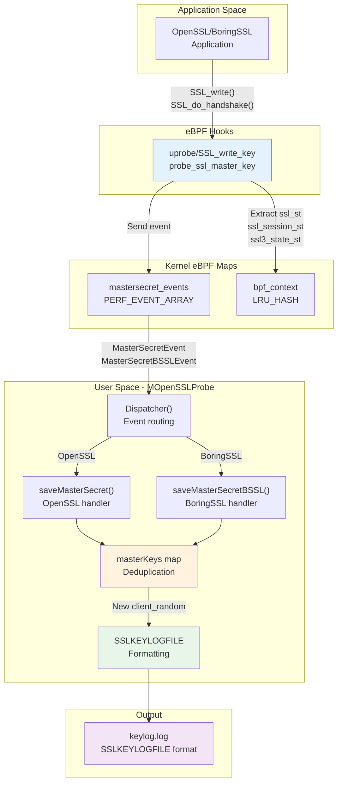
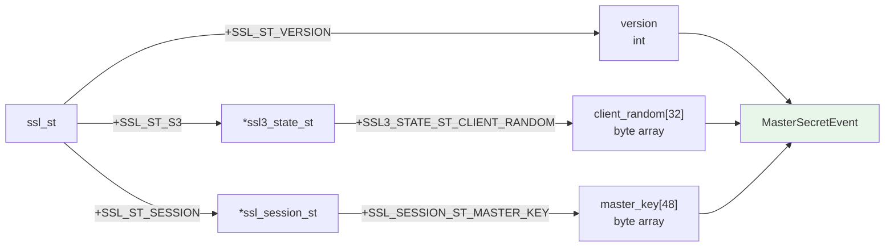
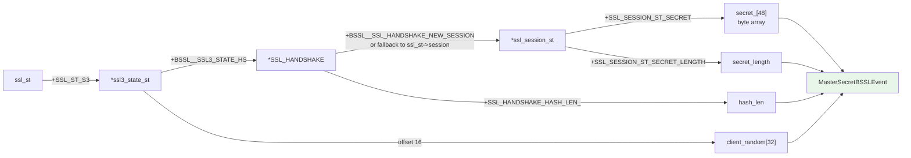
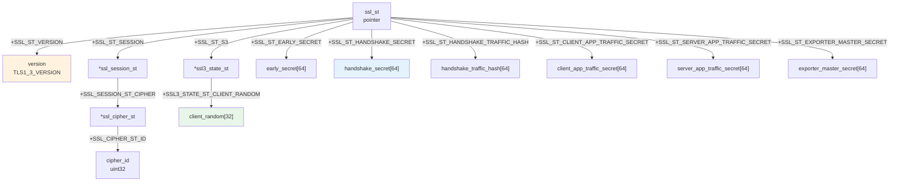
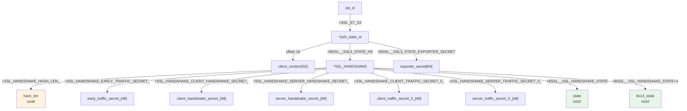
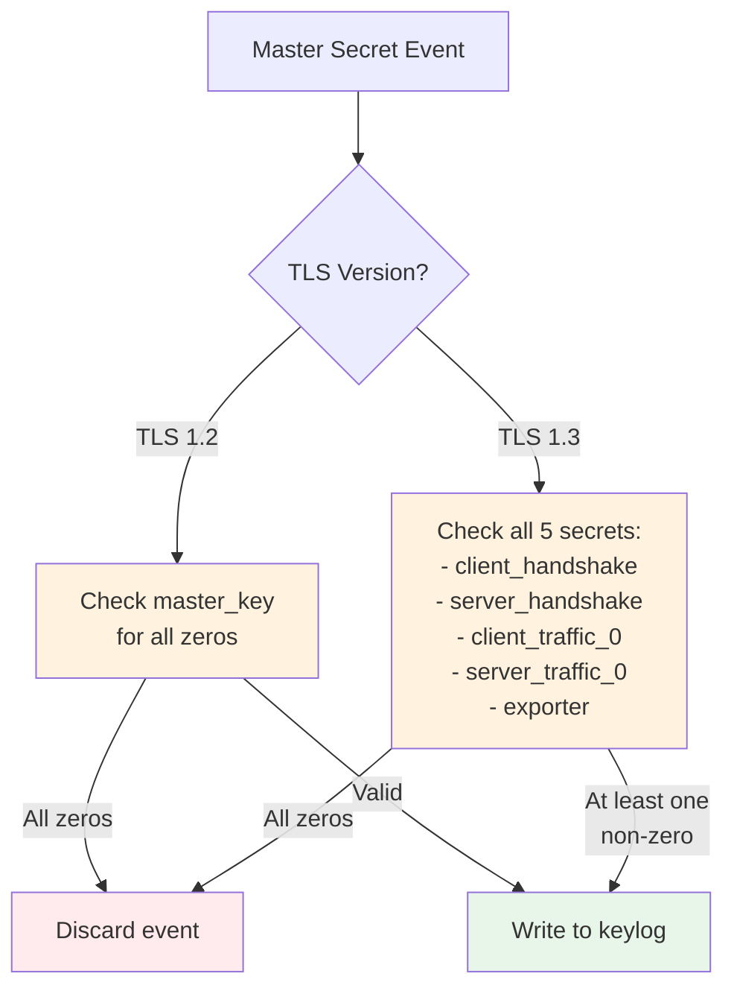
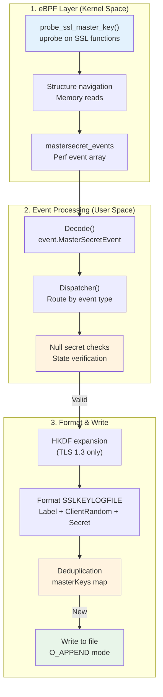

# TLS Key Logging

<details>
<summary>Relevant source files</summary>

The following files were used as context for generating this wiki page:

- [cli/cmd/root.go](https://github.com/gojue/ecapture/blob/0766a93b/cli/cmd/root.go)
- [kern/boringssl_const.h](https://github.com/gojue/ecapture/blob/0766a93b/kern/boringssl_const.h)
- [kern/boringssl_masterkey.h](https://github.com/gojue/ecapture/blob/0766a93b/kern/boringssl_masterkey.h)
- [kern/openssl_masterkey.h](https://github.com/gojue/ecapture/blob/0766a93b/kern/openssl_masterkey.h)
- [kern/openssl_masterkey_3.0.h](https://github.com/gojue/ecapture/blob/0766a93b/kern/openssl_masterkey_3.0.h)
- [user/config/iconfig.go](https://github.com/gojue/ecapture/blob/0766a93b/user/config/iconfig.go)
- [user/module/imodule.go](https://github.com/gojue/ecapture/blob/0766a93b/user/module/imodule.go)
- [user/module/probe_openssl.go](https://github.com/gojue/ecapture/blob/0766a93b/user/module/probe_openssl.go)
- [utils/boringssl-offset.c](https://github.com/gojue/ecapture/blob/0766a93b/utils/boringssl-offset.c)

</details>


## Purpose and Scope

This document describes eCapture's TLS key logging capability, which extracts TLS/SSL master secrets from OpenSSL and BoringSSL applications and writes them to a file in SSLKEYLOGFILE format. This format is compatible with network protocol analyzers like Wireshark, enabling decryption of captured TLS traffic without requiring the server's private key.

For information about capturing the actual network packets to decrypt, see [PCAP Integration](4.2-pcap-integration.md). For text-based plaintext capture without network packet correlation, see [Text Output Mode](4.1-text-output-mode.md).

## Overview

TLS key logging operates by:
1. **Extracting master secrets** from SSL/TLS library structures using eBPF uprobes
2. **Formatting secrets** according to the SSLKEYLOGFILE specification
3. **Writing to a file** that can be loaded by Wireshark or other decryption tools
4. **Deduplicating entries** to avoid writing the same client_random multiple times

The output file follows the NSS Key Log Format, where each line contains a label, client random, and the corresponding secret in hexadecimal format.

Sources: [user/module/probe_openssl.go:58-76](https://github.com/gojue/ecapture/blob/0766a93b/user/module/probe_openssl.go#L58-L76), [user/config/iconfig.go:72-79](https://github.com/gojue/ecapture/blob/0766a93b/user/config/iconfig.go#L72-L79)

## Key Logging Architecture



**Diagram: TLS Key Logging Data Flow**

The system hooks SSL/TLS handshake functions to extract master secrets at the point where they become available in memory. The eBPF program reads secret material from SSL library structures and sends events to user space, where they are formatted and written to the keylog file.

Sources: [user/module/probe_openssl.go:482-575](https://github.com/gojue/ecapture/blob/0766a93b/user/module/probe_openssl.go#L482-L575), [kern/openssl_masterkey.h:80-257](https://github.com/gojue/ecapture/blob/0766a93b/kern/openssl_masterkey.h#L80-L257), [kern/boringssl_masterkey.h:169-403](https://github.com/gojue/ecapture/blob/0766a93b/kern/boringssl_masterkey.h#L169-L403)

## Configuration

Key logging mode is configured through the `OpensslConfig.Model` field:

| Configuration Value | Constant | Description |
|---------------------|----------|-------------|
| `"keylog"` | `TlsCaptureModelKeylog` | Write master secrets only |
| `"key"` | `TlsCaptureModelKey` | Alias for keylog mode |

The keylog file path is specified via `OpensslConfig.KeylogFile` (default: `./ecapture.keylog`).

```go
// Example initialization from probe_openssl.go:128-136
switch model {
case config.TlsCaptureModelKeylog, config.TlsCaptureModelKey:
    m.keyloggerFilename = m.conf.(*config.OpensslConfig).KeylogFile
    m.keylogger, err = os.OpenFile(m.keyloggerFilename, 
        os.O_APPEND|os.O_WRONLY|os.O_CREATE, 0o600)
    m.eBPFProgramType = TlsCaptureModelTypeKeylog
}
```

Sources: [user/module/probe_openssl.go:128-136](https://github.com/gojue/ecapture/blob/0766a93b/user/module/probe_openssl.go#L128-L136), [user/config/iconfig.go:72-79](https://github.com/gojue/ecapture/blob/0766a93b/user/config/iconfig.go#L72-L79)

## SSLKEYLOGFILE Format

The SSLKEYLOGFILE format consists of space-separated records, one per line:

```
<Label> <ClientRandom> <Secret>
```

Where:
- **Label**: Identifies the type of secret (e.g., `CLIENT_RANDOM`, `CLIENT_HANDSHAKE_TRAFFIC_SECRET`)
- **ClientRandom**: 32-byte random value from TLS handshake, hex-encoded
- **Secret**: The secret material, hex-encoded (48 bytes for TLS 1.2, 32 or 48 bytes for TLS 1.3 depending on cipher)

### Supported Labels

| Label | TLS Version | Description |
|-------|-------------|-------------|
| `CLIENT_RANDOM` | TLS 1.2 | Master secret for TLS 1.2 and earlier |
| `CLIENT_EARLY_TRAFFIC_SECRET` | TLS 1.3 | 0-RTT secret (if early data enabled) |
| `CLIENT_HANDSHAKE_TRAFFIC_SECRET` | TLS 1.3 | Client handshake traffic key |
| `SERVER_HANDSHAKE_TRAFFIC_SECRET` | TLS 1.3 | Server handshake traffic key |
| `CLIENT_TRAFFIC_SECRET_0` | TLS 1.3 | Client application traffic key |
| `SERVER_TRAFFIC_SECRET_0` | TLS 1.3 | Server application traffic key |
| `EXPORTER_SECRET` | TLS 1.3 | Exporter master secret |

Sources: [user/module/probe_openssl.go:499-553](https://github.com/gojue/ecapture/blob/0766a93b/user/module/probe_openssl.go#L499-L553), [pkg/util/hkdf/hkdf.go](https://github.com/gojue/ecapture/blob/0766a93b/pkg/util/hkdf/hkdf.go)

## TLS 1.2 Master Secret Extraction

### OpenSSL TLS 1.2



**Diagram: OpenSSL TLS 1.2 Structure Navigation**

For TLS 1.2, the eBPF program extracts:
1. **Client Random**: From `ssl_st->s3->client_random` 
2. **Master Key**: From `ssl_st->session->master_key` (48 bytes)
3. **Version**: From `ssl_st->version`

The user-space handler formats this as:
```
CLIENT_RANDOM <32-byte-hex> <48-byte-hex>
```

Sources: [kern/openssl_masterkey.h:82-168](https://github.com/gojue/ecapture/blob/0766a93b/kern/openssl_masterkey.h#L82-L168), [user/module/probe_openssl.go:493-500](https://github.com/gojue/ecapture/blob/0766a93b/user/module/probe_openssl.go#L493-L500)

### BoringSSL TLS 1.2

BoringSSL uses a different structure layout:



**Diagram: BoringSSL TLS 1.2 Structure Navigation**

BoringSSL stores secrets in `ssl_session_st->secret_` with a variable length stored in `secret_length`. The eBPF program checks multiple locations to find the session:
1. First: `ssl_st->s3->hs->new_session`
2. Fallback: `ssl_st->session`

Sources: [kern/boringssl_masterkey.h:139-342](https://github.com/gojue/ecapture/blob/0766a93b/kern/boringssl_masterkey.h#L139-L342), [user/module/probe_openssl.go:577-642](https://github.com/gojue/ecapture/blob/0766a93b/user/module/probe_openssl.go#L577-L642)

## TLS 1.3 Master Secret Extraction

TLS 1.3 uses multiple secrets derived through HKDF (HMAC-based Key Derivation Function). eCapture extracts the base secrets and performs HKDF expansion in user space.

### OpenSSL TLS 1.3 Structure Layout



**Diagram: OpenSSL TLS 1.3 Secret Locations in ssl_st**

The secrets are stored directly in the `ssl_st` structure for OpenSSL 1.1.1+. The cipher ID determines the hash function (SHA-256 for 32-byte secrets, SHA-384 for 48-byte secrets).

Sources: [kern/openssl_masterkey.h:171-256](https://github.com/gojue/ecapture/blob/0766a93b/kern/openssl_masterkey.h#L171-L256), [user/module/probe_openssl.go:501-551](https://github.com/gojue/ecapture/blob/0766a93b/user/module/probe_openssl.go#L501-L551)

### BoringSSL TLS 1.3 Structure Layout



**Diagram: BoringSSL TLS 1.3 Secret Locations in SSL_HANDSHAKE**

BoringSSL stores TLS 1.3 secrets in private fields of the `SSL_HANDSHAKE` structure. The offsets are calculated based on the known layout of the structure, accounting for memory alignment. The secrets are maximum 48 bytes (SSL_MAX_MD_SIZE).

Sources: [kern/boringssl_masterkey.h:343-402](https://github.com/gojue/ecapture/blob/0766a93b/kern/boringssl_masterkey.h#L343-L402), [kern/boringssl_const.h:1-63](https://github.com/gojue/ecapture/blob/0766a93b/kern/boringssl_const.h#L1-L63)

### HKDF Expansion for TLS 1.3

For TLS 1.3, eCapture extracts the `handshake_secret` and `handshake_traffic_hash` from the SSL structure, then computes client and server handshake traffic secrets using HKDF-Expand-Label:

```
CLIENT_HANDSHAKE_TRAFFIC_SECRET = HKDF-Expand-Label(
    handshake_secret,
    "c hs traffic",
    handshake_traffic_hash,
    hash_length
)

SERVER_HANDSHAKE_TRAFFIC_SECRET = HKDF-Expand-Label(
    handshake_secret,
    "s hs traffic",
    handshake_traffic_hash,
    hash_length
)
```

The hash function (SHA-256 or SHA-384) is determined by the cipher suite:
- **TLS_AES_128_GCM_SHA256** (0x1301): 32 bytes, SHA-256
- **TLS_CHACHA20_POLY1305_SHA256** (0x1303): 32 bytes, SHA-256
- **TLS_AES_256_GCM_SHA384** (0x1302): 48 bytes, SHA-384

Sources: [user/module/probe_openssl.go:502-551](https://github.com/gojue/ecapture/blob/0766a93b/user/module/probe_openssl.go#L502-L551), [pkg/util/hkdf/hkdf.go](https://github.com/gojue/ecapture/blob/0766a93b/pkg/util/hkdf/hkdf.go)

## Key Deduplication

eCapture maintains a `masterKeys` map keyed by the client_random (hex-encoded) to prevent duplicate entries:

```go
type MOpenSSLProbe struct {
    masterKeys map[string]bool  // map[client_random_hex]bool
    // ...
}

func (m *MOpenSSLProbe) saveMasterSecret(secretEvent *event.MasterSecretEvent) {
    k := fmt.Sprintf("%02x", secretEvent.ClientRandom)
    
    _, f := m.masterKeys[k]
    if f {
        // Already exists, skip
        return
    }
    
    // ... format and write ...
    m.masterKeys[k] = true
}
```

This is necessary because:
1. SSL/TLS functions may be called multiple times during a connection
2. Session resumption can reuse the same client_random
3. Multiple capture points (SSL_write, SSL_read, SSL_do_handshake) may observe the same secret

Sources: [user/module/probe_openssl.go:96-99](https://github.com/gojue/ecapture/blob/0766a93b/user/module/probe_openssl.go#L96-L99), [user/module/probe_openssl.go:482-575](https://github.com/gojue/ecapture/blob/0766a93b/user/module/probe_openssl.go#L482-L575)

## Null Secret Detection

eCapture validates that secrets are not all zeros before writing to the keylog file. This prevents writing invalid or uninitialized secrets:



**Diagram: Null Secret Detection Logic**

The validation occurs in functions `mk12NullSecrets()` and `mk13NullSecrets()`:

```go
// TLS 1.2: Check if all bytes in range [0:hashLen] are zero
func (m *MOpenSSLProbe) mk12NullSecrets(hashLen int, secret []byte) bool {
    isNull := true
    for i := 0; i < hashLen; i++ {
        if secret[i] != 0 {
            isNull = false
            break
        }
    }
    return isNull
}

// TLS 1.3: Check if all 5 secrets are zero
func (m *MOpenSSLProbe) mk13NullSecrets(hashLen int,
    ClientHandshakeSecret [64]byte,
    ClientTrafficSecret0 [64]byte,
    ServerHandshakeSecret [64]byte,
    ServerTrafficSecret0 [64]byte,
    ExporterSecret [64]byte) bool {
    // Returns true if all 5 secrets are null (isNullCount == 5)
    // Returns false if at least one secret has non-zero bytes
}
```

Sources: [user/module/probe_openssl.go:652-731](https://github.com/gojue/ecapture/blob/0766a93b/user/module/probe_openssl.go#L652-L731)

## Output File Format Example

A typical keylog file contains entries like:

```
CLIENT_RANDOM 0123456789abcdef... 0a1b2c3d4e5f6789...
CLIENT_HANDSHAKE_TRAFFIC_SECRET 0123456789abcdef... 1a2b3c4d5e6f7890...
SERVER_HANDSHAKE_TRAFFIC_SECRET 0123456789abcdef... 2b3c4d5e6f789012...
CLIENT_TRAFFIC_SECRET_0 0123456789abcdef... 3c4d5e6f78901234...
SERVER_TRAFFIC_SECRET_0 0123456789abcdef... 4d5e6f7890123456...
EXPORTER_SECRET 0123456789abcdef... 5e6f789012345678...
```

The file is opened with `O_APPEND` mode, allowing multiple eCapture runs to accumulate keys in the same file. The file permissions are set to `0o600` (read/write for owner only) for security.

Sources: [user/module/probe_openssl.go:131-136](https://github.com/gojue/ecapture/blob/0766a93b/user/module/probe_openssl.go#L131-L136), [user/module/probe_openssl.go:567-572](https://github.com/gojue/ecapture/blob/0766a93b/user/module/probe_openssl.go#L567-L572)

## Integration with Wireshark

To decrypt TLS traffic in Wireshark using the keylog file:

1. **Capture packets** using eCapture's PCAP mode or tcpdump
2. **Generate keylog file** using eCapture's keylog mode:
   ```bash
   ecapture tls --keylogfile=/tmp/keys.log
   ```
3. **Configure Wireshark**:
   - Edit → Preferences → Protocols → TLS
   - Set "(Pre)-Master-Secret log filename" to `/tmp/keys.log`
4. **Reload capture** or restart Wireshark

Wireshark will automatically decrypt TLS traffic matching the client_random values in the keylog file.

### Combined PCAP + Keylog Mode

When using PCAP mode, eCapture can embed the keylog data directly into the PCAPNG file as Decryption Secrets Blocks (DSB), eliminating the need for a separate keylog file. See [PCAP Integration](4.2-pcap-integration.md) for details.

Sources: [user/module/probe_openssl.go:560-564](https://github.com/gojue/ecapture/blob/0766a93b/user/module/probe_openssl.go#L560-L564)

## State Verification for Secret Extraction

The eBPF programs verify that the TLS handshake has reached an appropriate state before extracting secrets:

### OpenSSL State Requirements

For OpenSSL, secret extraction occurs during any SSL_write or SSL_read call after the handshake completes. The version field is checked, but no explicit state verification is performed since the secrets are stored in persistent structures.

### BoringSSL State Requirements

BoringSSL maintains explicit handshake state machines. The eBPF program verifies:

**TLS 1.2 States:**
- Client: `state >= CLIENT_STATE12_SEND_CLIENT_FINISHED` (16)
- Server: `state >= SERVER_STATE12_READ_CLIENT_FINISHED` (18)

**TLS 1.3 States:**
- Client: `tls13_state >= CLIENT_STATE13_READ_SERVER_FINISHED` (8)
- Server: `tls13_state >= SERVER_STATE13_READ_CLIENT_FINISHED` (14)

```c
// From boringssl_masterkey.h:289-293
if (ssl3_hs_state.state < CLIENT_STATE12_SEND_CLIENT_FINISHED) {
    // not finished yet.
    return 0;
}

// From boringssl_masterkey.h:345-348
if (ssl3_hs_state.tls13_state < CLIENT_STATE13_READ_SERVER_FINISHED) {
    // not finished yet.
    return 0;
}
```

This ensures secrets are only extracted after the handshake completes and all secret material is available.

Sources: [kern/boringssl_masterkey.h:263-348](https://github.com/gojue/ecapture/blob/0766a93b/kern/boringssl_masterkey.h#L263-L348), [kern/boringssl_masterkey.h:77-86](https://github.com/gojue/ecapture/blob/0766a93b/kern/boringssl_masterkey.h#L77-L86)

## Error Handling

The key logging system handles several error conditions:

| Condition | Behavior |
|-----------|----------|
| File open failure | Initialization fails, error returned to user |
| Write failure | Warning logged, event discarded |
| Null secrets detected | Event discarded silently |
| Duplicate client_random | Event skipped, no write |
| Hash length exceeds buffer | Truncated to maximum size with warning |
| eBPF probe read failure | Event not sent to user space |

The logger provides detailed information about each successfully written secret:

```go
m.logger.Info().
    Str("TlsVersion", v.String()).
    Str("CLientRandom", k).
    Int("bytes", l).
    Msg("CLIENT_RANDOM save success")
```

Sources: [user/module/probe_openssl.go:567-572](https://github.com/gojue/ecapture/blob/0766a93b/user/module/probe_openssl.go#L567-L572), [user/module/probe_openssl.go:594-607](https://github.com/gojue/ecapture/blob/0766a93b/user/module/probe_openssl.go#L594-L607)

## Implementation Summary

The key logging implementation spans three layers:



**Diagram: Key Logging Implementation Layers**

The system achieves high reliability through:
- **Atomic writes**: Each line is written atomically to the file
- **Deduplication**: Prevents redundant entries
- **Validation**: Ensures secrets are non-null before writing
- **State checking**: Extracts secrets only after handshake completion
- **Error handling**: Graceful degradation on failures

Sources: [user/module/probe_openssl.go:733-754](https://github.com/gojue/ecapture/blob/0766a93b/user/module/probe_openssl.go#L733-L754), [kern/openssl_masterkey.h:80-257](https://github.com/gojue/ecapture/blob/0766a93b/kern/openssl_masterkey.h#L80-L257), [kern/boringssl_masterkey.h:169-403](https://github.com/gojue/ecapture/blob/0766a93b/kern/boringssl_masterkey.h#L169-L403)