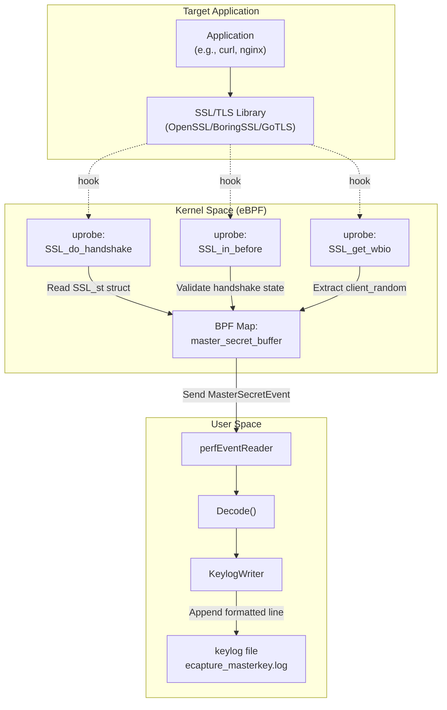
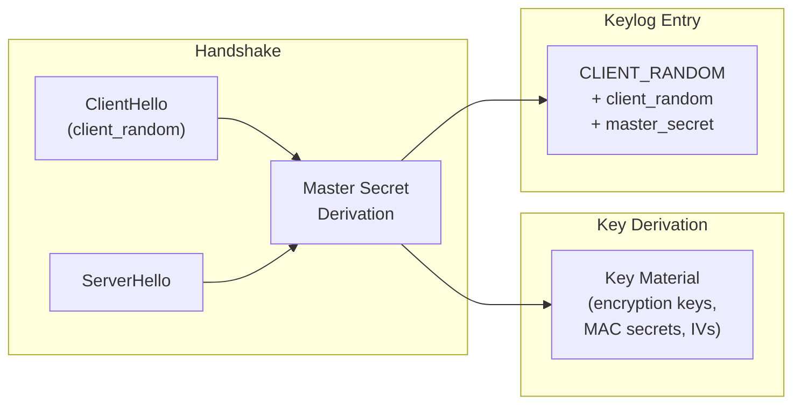
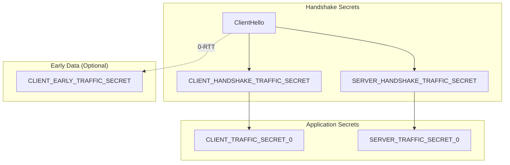
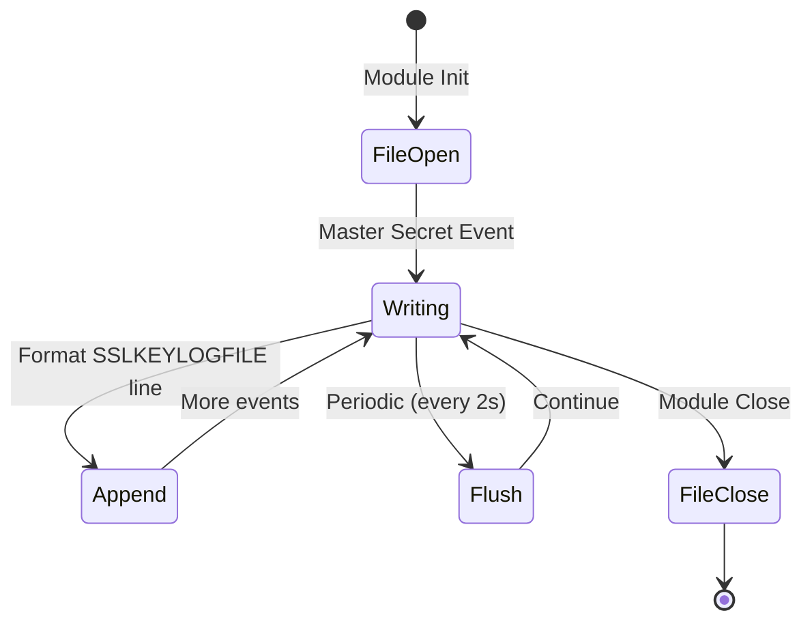

# TLS Key Logging

<details>
<summary>Relevant source files</summary>

The following files were used as context for generating this wiki page:

- [CHANGELOG.md](https://github.com/gojue/ecapture/blob/ca085d05/CHANGELOG.md)
- [README.md](https://github.com/gojue/ecapture/blob/ca085d05/README.md)
- [README_CN.md](https://github.com/gojue/ecapture/blob/ca085d05/README_CN.md)
- [README_JA.md](https://github.com/gojue/ecapture/blob/ca085d05/README_JA.md)
- [images/ecapture-help-v0.8.9.svg](https://github.com/gojue/ecapture/blob/ca085d05/images/ecapture-help-v0.8.9.svg)
- [images/ecapture-logo.png](images/ecapture-logo.png)
- [main.go](https://github.com/gojue/ecapture/blob/ca085d05/main.go)
- [protobuf/PROTOCOLS.md](https://github.com/gojue/ecapture/blob/ca085d05/protobuf/PROTOCOLS.md)
- [protobuf/PROTOCOLS_CN.md](https://github.com/gojue/ecapture/blob/ca085d05/protobuf/PROTOCOLS_CN.md)
- [protobuf/README.md](https://github.com/gojue/ecapture/blob/ca085d05/protobuf/README.md)
- [protobuf/README_CN.md](https://github.com/gojue/ecapture/blob/ca085d05/protobuf/README_CN.md)
- [utils/protobuf_visualizer/README.md](https://github.com/gojue/ecapture/blob/ca085d05/utils/protobuf_visualizer/README.md)
- [utils/protobuf_visualizer/README_CN.md](https://github.com/gojue/ecapture/blob/ca085d05/utils/protobuf_visualizer/README_CN.md)

</details>


## Purpose and Scope

This page documents eCapture's keylog output mode (`-m keylog`), which captures TLS/SSL master secrets and traffic secrets from encrypted connections and writes them in the standard SSLKEYLOGFILE format. This enables post-capture decryption of TLS traffic using tools like Wireshark and tshark without requiring changes to target applications.

For information about capturing decrypted plaintext directly, see [Text Output Mode](4.1-text-output-mode.md). For capturing both encrypted packets and decryption keys together, see [PCAP Integration](4.2-pcap-integration.md). For details on how master secrets are extracted from different TLS libraries, see [Master Secret Extraction](../3-capture-modules/3.1.5-master-secret-extraction.md).

---

## Overview

Keylog mode captures cryptographic key material from TLS/SSL handshakes as they occur in memory, writing them to a file in the industry-standard SSLKEYLOGFILE format. This file can then be loaded into Wireshark or used with tshark to decrypt captured TLS traffic, equivalent to setting the `SSLKEYLOGFILE` environment variable but without requiring application modifications.

**Key Characteristics:**
- **Non-intrusive**: No application restart or configuration changes required
- **Standard format**: Compatible with all tools that support SSLKEYLOGFILE
- **Real-time**: Keys are captured as handshakes complete
- **Protocol support**: TLS 1.2 (CLIENT_RANDOM + Master Secret) and TLS 1.3 (multiple traffic secrets)

Sources: [README.md:234-248](https://github.com/gojue/ecapture/blob/ca085d05/README.md#L234-L248), [CHANGELOG.md:695-723](https://github.com/gojue/ecapture/blob/ca085d05/CHANGELOG.md#L695-L723)

---

## Command Usage

### Basic Keylog Capture

```bash
# Capture to default file (ecapture_masterkey.log)
sudo ecapture tls -m keylog

# Specify custom keylog file
sudo ecapture tls -m keylog --keylogfile=/path/to/keys.log

# Alternative syntax
sudo ecapture gotls -m key --keylogfile=gotls_keys.log
```

### Command Line Parameters

| Parameter | Alias | Default | Description |
|-----------|-------|---------|-------------|
| `-m keylog` | `-m key` | - | Enable keylog capture mode |
| `--keylogfile` | - | `ecapture_masterkey.log` | Output file path for captured keys |
| `--libssl` | - | auto-detected | Target SSL/TLS library path |
| `-i` | - | - | Network interface (optional, not used in keylog-only mode) |

Sources: [README.md:234-248](https://github.com/gojue/ecapture/blob/ca085d05/README.md#L234-L248), [README_CN.md:206-216](https://github.com/gojue/ecapture/blob/ca085d05/README_CN.md#L206-L216)

---

## SSLKEYLOGFILE Format

The keylog file follows the NSS Key Log Format, which is the de facto standard for TLS key logging. Each line contains a label followed by hex-encoded key material.

### TLS 1.2 Format

```
CLIENT_RANDOM <64 hex chars: client random> <96 hex chars: 48-byte master secret>
```

**Example:**
```
CLIENT_RANDOM 52b5f8fe00c0d970c46b63e48a30c5e0c77c7a4e65ea8d5ce3d3e7c76f8c4e11 1d927f7d2e2c8b0f3e0c5a2b7d9e6f4a1c8d0e2f5b7c9a0d1e3f6a8b0c2d4e6f8a1c3d5e7f9b1c3d5e7f9b1c3d
```

### TLS 1.3 Format

TLS 1.3 generates multiple secrets for different traffic phases:

```
CLIENT_HANDSHAKE_TRAFFIC_SECRET <64 hex chars: client random> <64+ hex chars: secret>
SERVER_HANDSHAKE_TRAFFIC_SECRET <64 hex chars: client random> <64+ hex chars: secret>
CLIENT_TRAFFIC_SECRET_0 <64 hex chars: client random> <64+ hex chars: secret>
SERVER_TRAFFIC_SECRET_0 <64 hex chars: client random> <64+ hex chars: secret>
```

**Example:**
```
CLIENT_HANDSHAKE_TRAFFIC_SECRET e3b0c44298fc1c149afbf4c8996fb92427ae41e4649b934ca495991b7852b855 a1b2c3d4e5f6...
SERVER_HANDSHAKE_TRAFFIC_SECRET e3b0c44298fc1c149afbf4c8996fb92427ae41e4649b934ca495991b7852b855 f6e5d4c3b2a1...
```

### Format Specification

| Field | Format | Description |
|-------|--------|-------------|
| Label | ASCII string | Key type identifier (e.g., `CLIENT_RANDOM`) |
| Client Random | 64 hex chars | 32-byte random value from TLS handshake |
| Secret | Variable hex | Master secret (48 bytes for TLS 1.2) or traffic secret (32+ bytes for TLS 1.3) |

Sources: [README.md:234-248](https://github.com/gojue/ecapture/blob/ca085d05/README.md#L234-L248), [CHANGELOG.md:695-723](https://github.com/gojue/ecapture/blob/ca085d05/CHANGELOG.md#L695-L723)

---

## Master Secret Capture Architecture

### eBPF Capture Flow


```mermaid
flowchart TB
    subgraph "Target Application"
        APP["Application<br/>(e.g., curl, nginx)"]
        SSL_LIB["SSL/TLS Library<br/>(OpenSSL/BoringSSL/GoTLS)"]
    end
    
    subgraph "Kernel Space (eBPF)"
        UPROBE_HANDSHAKE["uprobe:<br/>SSL_do_handshake"]
        UPROBE_BEFORE["uprobe:<br/>SSL_in_before"]
        UPROBE_WBIO["uprobe:<br/>SSL_get_wbio"]
        MS_MAP["BPF Map:<br/>master_secret_buffer"]
    end
    
    subgraph "User Space"
        READER["perfEventReader"]
        DECODER["Decode()"]
        KEYLOGGER["KeylogWriter"]
        KEYLOG_FILE["keylog file<br/>ecapture_masterkey.log"]
    end
    
    APP --> SSL_LIB
    SSL_LIB -.hook.-> UPROBE_HANDSHAKE
    SSL_LIB -.hook.-> UPROBE_BEFORE
    SSL_LIB -.hook.-> UPROBE_WBIO
    
    UPROBE_HANDSHAKE -->|"Read SSL_st struct"| MS_MAP
    UPROBE_BEFORE -->|"Validate handshake state"| MS_MAP
    UPROBE_WBIO -->|"Extract client_random"| MS_MAP
    
    MS_MAP -->|"Send MasterSecretEvent"| READER
    READER --> DECODER
    DECODER --> KEYLOGGER
    KEYLOGGER -->|"Append formatted line"| KEYLOG_FILE
```

Sources: Architecture diagrams provided, [README.md:91-95](https://github.com/gojue/ecapture/blob/ca085d05/README.md#L91-L95)

### Event Structure

The `MasterSecretEvent` structure carries captured key material from kernel to user space:

**Key Fields:**
- `timestamp`: Nanosecond precision event time
- `pid`: Process ID of the TLS connection
- `tid`: Thread ID
- `client_random`: 32-byte random from ClientHello
- `master_secret`: 48-byte master secret (TLS 1.2) or traffic secrets (TLS 1.3)
- `version`: TLS protocol version (0x0303 for TLS 1.2, 0x0304 for TLS 1.3)

Sources: [README.md:91-95](https://github.com/gojue/ecapture/blob/ca085d05/README.md#L91-L95), Event structure from architecture overview

---

## Integration with Decryption Tools

### Wireshark Integration

After capturing a keylog file, use it with Wireshark for GUI-based decryption:

1. **Capture packets** (in separate terminal):
   ```bash
   sudo tcpdump -i eth0 -w traffic.pcap port 443
   ```

2. **Capture keys** (simultaneously):
   ```bash
   sudo ecapture tls -m keylog --keylogfile=keys.log
   ```

3. **Configure Wireshark**:
   - Open Wireshark preferences: Edit → Preferences → Protocols → TLS
   - Set "(Pre)-Master-Secret log filename" to `keys.log`
   - Open `traffic.pcap` to view decrypted traffic

### tshark Real-Time Decryption

Use tshark for command-line real-time decryption without needing a separate pcap file:

```bash
# Terminal 1: Start keylog capture
sudo ecapture tls -m keylog --keylogfile=ecapture_keys.log

# Terminal 2: Decrypt and display HTTP/1.x traffic
tshark -o tls.keylog_file:ecapture_keys.log \
       -Y http \
       -T fields \
       -e http.file_data \
       -f "port 443" \
       -i eth0

# For HTTP/2 traffic
tshark -o tls.keylog_file:ecapture_keys.log \
       -Y http2 \
       -T fields \
       -e http2.data.data \
       -f "port 443" \
       -i eth0
```

### Combined PCAP + Keylog Mode

For convenience, use PCAP mode which automatically captures both packets and keys:

```bash
# Single command captures encrypted packets and keys
sudo ecapture tls -m pcap -i eth0 --pcapfile=capture.pcapng

# The pcapng file includes embedded Decryption Secrets Block (DSB)
# Open directly in Wireshark without separate keylog configuration
```

Sources: [README.md:234-248](https://github.com/gojue/ecapture/blob/ca085d05/README.md#L234-L248), [CHANGELOG.md:724-757](https://github.com/gojue/ecapture/blob/ca085d05/CHANGELOG.md#L724-L757)

---

## TLS Protocol Version Differences

### TLS 1.2 Key Material


```mermaid
flowchart LR
    subgraph "Handshake"
        CH["ClientHello<br/>(client_random)"]
        SH["ServerHello"]
        MS["Master Secret<br/>Derivation"]
    end
    
    subgraph "Key Derivation"
        MS --> KM["Key Material<br/>(encryption keys,<br/>MAC secrets, IVs)"]
    end
    
    subgraph "Keylog Entry"
        LOG["CLIENT_RANDOM<br/>+ client_random<br/>+ master_secret"]
    end
    
    CH --> MS
    SH --> MS
    MS --> LOG
```

**TLS 1.2 Characteristics:**
- **Single master secret**: One 48-byte value derives all session keys
- **Static keys**: Same keys used throughout entire connection
- **Format**: `CLIENT_RANDOM <random> <master_secret>`
- **eBPF hook point**: `SSL_do_handshake` return, after master secret computation

### TLS 1.3 Key Material


```mermaid
flowchart TB
    subgraph "Handshake Secrets"
        CH["ClientHello"]
        CHS["CLIENT_HANDSHAKE_TRAFFIC_SECRET"]
        SHS["SERVER_HANDSHAKE_TRAFFIC_SECRET"]
    end
    
    subgraph "Application Secrets"
        CTS["CLIENT_TRAFFIC_SECRET_0"]
        STS["SERVER_TRAFFIC_SECRET_0"]
    end
    
    subgraph "Early Data (Optional)"
        EARLY["CLIENT_EARLY_TRAFFIC_SECRET"]
    end
    
    CH --> CHS
    CH --> SHS
    CHS --> CTS
    SHS --> STS
    CH -.0-RTT.-> EARLY
```

**TLS 1.3 Characteristics:**
- **Multiple secrets**: Separate secrets for handshake and application data phases
- **Forward secrecy**: Different secrets for client→server and server→client
- **Key update**: Can generate new secrets mid-connection
- **eBPF capture points**: Must hook multiple functions to capture all secrets:
  - Handshake secrets: During key schedule computation
  - Application secrets: After key derivation completes
  - Early secrets: During 0-RTT processing (if used)

Sources: [CHANGELOG.md:695-723](https://github.com/gojue/ecapture/blob/ca085d05/CHANGELOG.md#L695-L723), [README.md:91-95](https://github.com/gojue/ecapture/blob/ca085d05/README.md#L91-L95)

---

## Library-Specific Implementation

### OpenSSL/BoringSSL

**Hooked Functions:**
- `SSL_do_handshake`: Primary handshake completion point
- `SSL_in_before`: Validates handshake state before extraction
- `SSL_get_wbio`: Used to validate SSL context

**Structure Offsets:**
Different OpenSSL versions have different `SSL` and `SSL_SESSION` structure layouts. eCapture uses pre-computed offsets:

| OpenSSL Version | Offset File | Master Secret Location |
|-----------------|-------------|------------------------|
| 1.0.2a-u | `openssl_1_0_2_kern.c` | `ssl->s3->tmp.master_secret` |
| 1.1.0-1.1.1 | `openssl_1_1_1_kern.c` | `ssl->session->master_secret` |
| 3.0.0+ | `openssl_3_0_0_kern.c` | `ssl_connection_st->session->master_secret` |

**TLS Version Detection:**
```c
// Read TLS version from SSL structure
u16 version = ssl->version;  // 0x0303 = TLS 1.2, 0x0304 = TLS 1.3

// TLS 1.3 requires reading multiple secrets
if (version == 0x0304) {
    // Read from ssl->s3->client_handshake_traffic_secret
    // Read from ssl->s3->server_handshake_traffic_secret
    // Read from ssl->s3->client_traffic_secret_0
    // Read from ssl->s3->server_traffic_secret_0
}
```

Sources: [README.md:91-95](https://github.com/gojue/ecapture/blob/ca085d05/README.md#L91-L95), Architecture diagrams

### Go TLS

**Hooked Functions:**
- `crypto/tls.(*Conn).writeKeyLog`: Direct hook on Go's built-in keylog writer
- `crypto/tls.(*Conn).Write`: Intercept after handshake completes

**Key Capture Method:**
Go's standard library has built-in support for `SSLKEYLOGFILE`. eCapture hooks the internal `writeKeyLog` function to intercept the same data Go would write to a keylog file:

```
uprobe: crypto/tls.(*Conn).writeKeyLog
  -> Read arguments: label, clientRandom, secret
  -> Format according to label type
  -> Send to user space
```

**Structure Navigation:**
- Go TLS connection: `*tls.Conn`
- Access via reflection: `conn.config.KeyLogWriter` path
- For stripped binaries: Use pclntab to locate symbol offsets

Sources: [README.md:257-276](https://github.com/gojue/ecapture/blob/ca085d05/README.md#L257-L276)

### GnuTLS

**Hooked Functions:**
- `gnutls_session_get_random`: Extract client random
- `gnutls_session_get_master_secret`: Extract master secret
- Early secret support added in v1.3.0

**Capture Flow:**
1. Hook `gnutls_handshake` completion
2. Call `gnutls_session_get_random` to get client_random
3. Call `gnutls_session_get_master_secret` to get master_secret
4. Format and write to keylog

Sources: [CHANGELOG.md:129-139](https://github.com/gojue/ecapture/blob/ca085d05/CHANGELOG.md#L129-L139)

---

## Keylog File Management

### File Writing Strategy


```mermaid
stateDiagram-v2
    [*] --> FileOpen: Module Init
    FileOpen --> Writing: Master Secret Event
    Writing --> Append: Format SSLKEYLOGFILE line
    Append --> Writing: More events
    Writing --> Flush: Periodic (every 2s)
    Flush --> Writing: Continue
    Writing --> FileClose: Module Close
    FileClose --> [*]
```

**Key Behaviors:**
- **Append mode**: File opened with O_APPEND to prevent data loss
- **Buffered writes**: Use buffered writer for efficiency
- **Periodic flush**: Flush every 2 seconds or on module close
- **No duplicates**: Same client_random + master_secret combination written only once
- **Concurrent safe**: Mutex protection for multi-threaded writes

### File Rotation

The keylog file does not automatically rotate. For long-running captures, consider:

```bash
# Use logrotate or manual rotation
sudo logrotate -f /etc/logrotate.d/ecapture

# Or stop/restart capture periodically
sudo ecapture tls -m keylog --keylogfile=keys-$(date +%Y%m%d-%H%M%S).log
```

Sources: Architecture overview, [CHANGELOG.md:671-675](https://github.com/gojue/ecapture/blob/ca085d05/CHANGELOG.md#L671-L675)

---

## Usage Examples

### Example 1: Decrypt curl HTTPS Request

```bash
# Terminal 1: Start keylog capture
sudo ecapture tls -m keylog --keylogfile=/tmp/keys.log

# Terminal 2: Make HTTPS request
curl https://example.com

# Terminal 3: View captured key (wait a moment for handshake)
cat /tmp/keys.log
# Output:
# CLIENT_RANDOM 8e4fb5f2c19f1c4d5e6a7b8c9d0e1f2a3b4c5d6e7f8a9b0c1d2e3f4a5b6c7d8e ...
```

### Example 2: Combined tcpdump + Keylog Decryption

```bash
# Terminal 1: Capture packets
sudo tcpdump -i any -w /tmp/traffic.pcap 'tcp port 443'

# Terminal 2: Capture keys
sudo ecapture tls -m keylog --keylogfile=/tmp/keys.log

# Terminal 3: Generate traffic
curl https://www.google.com
curl https://www.github.com

# Later: Decrypt with tshark
tshark -r /tmp/traffic.pcap \
       -o tls.keylog_file:/tmp/keys.log \
       -Y http \
       -T fields \
       -e frame.number \
       -e http.request.full_uri \
       -e http.response.code
```

### Example 3: Multi-Process Monitoring

```bash
# Capture keys from all processes
sudo ecapture tls -m keylog --keylogfile=/tmp/all_keys.log

# Filter by specific PID in keylog processing
# (Note: SSLKEYLOGFILE format doesn't include PID, but eCapture logs it)
sudo ecapture tls -m keylog --keylogfile=/tmp/keys.log -p 1234
```

### Example 4: Go TLS Application

```bash
# Capture Go TLS keys
sudo ecapture gotls -m keylog \
    --elfpath=/usr/local/bin/mygoapp \
    --keylogfile=/tmp/gotls_keys.log

# Run Go application
/usr/local/bin/mygoapp

# Verify key capture
cat /tmp/gotls_keys.log
```

Sources: [README.md:234-248](https://github.com/gojue/ecapture/blob/ca085d05/README.md#L234-L248), [README_CN.md:206-216](https://github.com/gojue/ecapture/blob/ca085d05/README_CN.md#L206-L216)

---

## Troubleshooting

### No Keys Captured

**Possible causes:**
1. **Handshake not completing**: Check if TLS connection successfully established
2. **Wrong library version**: Verify detected OpenSSL version matches bytecode
3. **Statically linked**: Use `--libssl` to point to binary, not shared library
4. **Permissions**: Ensure running as root or with CAP_BPF capability

**Debug steps:**
```bash
# Check detected library version
sudo ecapture tls -m keylog --keylogfile=/tmp/test.log
# Look for log line: "OpenSSL/BoringSSL version not found..." or version detected

# Verify library path
ldd /usr/bin/curl | grep ssl
# Use detected path with --libssl flag
```

### Incomplete TLS 1.3 Keys

**Symptoms:** Only some secrets captured, decryption partially works

**Solution:** TLS 1.3 requires multiple hook points. Ensure eCapture supports the library version:
- OpenSSL 3.0+: Requires `ssl_connection_st` structure support
- BoringSSL: May have different secret storage layout
- Check CHANGELOG for version-specific fixes

### Format Errors in Keylog File

**Symptoms:** Wireshark/tshark reports invalid keylog format

**Validation:**
```bash
# Check format: each line should match pattern
grep -E '^(CLIENT_RANDOM|SERVER_RANDOM|CLIENT_HANDSHAKE_TRAFFIC_SECRET) [0-9a-f]{64} [0-9a-f]+$' /tmp/keys.log

# Count entries
wc -l /tmp/keys.log

# Check for duplicates (should have none or few)
sort /tmp/keys.log | uniq -d
```

Sources: [README.md:91-95](https://github.com/gojue/ecapture/blob/ca085d05/README.md#L91-L95), [CHANGELOG.md:695-723](https://github.com/gojue/ecapture/blob/ca085d05/CHANGELOG.md#L695-L723)

---

## Performance Considerations

### Overhead Analysis

| Aspect | Impact | Mitigation |
|--------|--------|------------|
| eBPF overhead | ~1-5% CPU per hooked function call | Minimal; occurs only during handshakes |
| Memory usage | ~100 bytes per captured secret | Negligible for typical workloads |
| Disk I/O | Buffered writes, flush every 2s | Use fast storage for high-throughput scenarios |
| File size growth | ~150 bytes per TLS connection | Rotate files for long-running captures |

**Recommended limits:**
- Max connections/sec: ~10,000 (limited by eBPF map size and event throughput)
- Max concurrent connections: ~100,000 (limited by map size configuration)

### Optimization Tips

1. **Target specific processes**: Use `-p` flag to reduce eBPF overhead
2. **Use SSD storage**: For high-frequency handshake scenarios
3. **Disable if not needed**: Use `-m text` or `-m pcap` without keylog if keys not required
4. **Monitor map fullness**: Check for "map full" errors in logs

Sources: Architecture overview, general eBPF performance characteristics