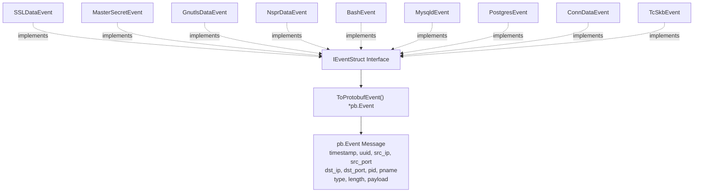
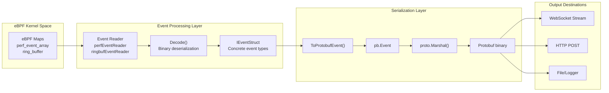
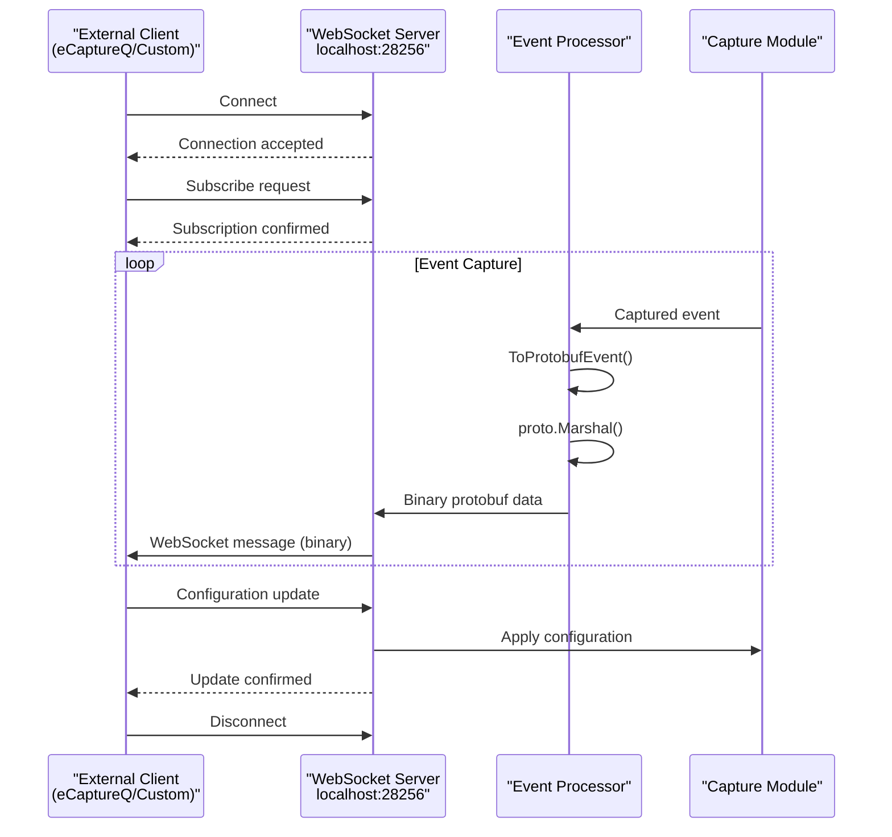
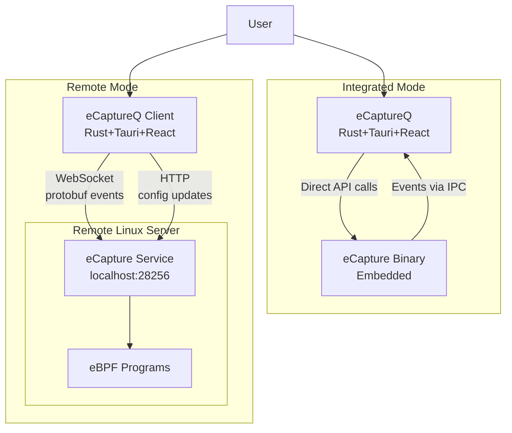
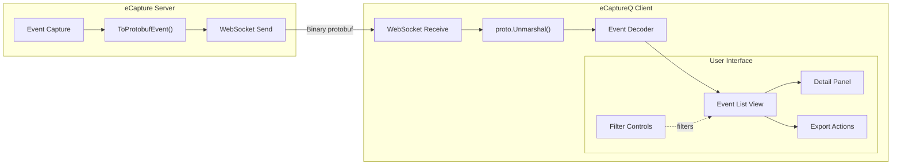

# Protobuf and External Integration

<details>
<summary>Relevant source files</summary>

The following files were used as context for generating this wiki page:

- [CHANGELOG.md](https://github.com/gojue/ecapture/blob/0766a93b/CHANGELOG.md)
- [README.md](https://github.com/gojue/ecapture/blob/0766a93b/README.md)
- [README_CN.md](https://github.com/gojue/ecapture/blob/0766a93b/README_CN.md)
- [images/ecapture-help-v0.8.9.svg](https://github.com/gojue/ecapture/blob/0766a93b/images/ecapture-help-v0.8.9.svg)
- [main.go](https://github.com/gojue/ecapture/blob/0766a93b/main.go)
- [pkg/event_processor/base_event.go](https://github.com/gojue/ecapture/blob/0766a93b/pkg/event_processor/base_event.go)
- [user/event/event_bash.go](https://github.com/gojue/ecapture/blob/0766a93b/user/event/event_bash.go)
- [user/event/event_gnutls.go](https://github.com/gojue/ecapture/blob/0766a93b/user/event/event_gnutls.go)
- [user/event/event_masterkey.go](https://github.com/gojue/ecapture/blob/0766a93b/user/event/event_masterkey.go)
- [user/event/event_mysqld.go](https://github.com/gojue/ecapture/blob/0766a93b/user/event/event_mysqld.go)
- [user/event/event_nspr.go](https://github.com/gojue/ecapture/blob/0766a93b/user/event/event_nspr.go)
- [user/event/event_openssl.go](https://github.com/gojue/ecapture/blob/0766a93b/user/event/event_openssl.go)
- [user/event/event_openssl_tc.go](https://github.com/gojue/ecapture/blob/0766a93b/user/event/event_openssl_tc.go)
- [user/event/event_postgres.go](https://github.com/gojue/ecapture/blob/0766a93b/user/event/event_postgres.go)

</details>


## Purpose and Scope

This document describes eCapture's protobuf-based event serialization and external integration capabilities. It covers how captured events are converted to Protocol Buffer format for transmission to external systems, the WebSocket streaming protocol for real-time event forwarding, and integration with the eCaptureQ graphical user interface.

For information about text-based output formatting, see [Text Output Mode](4.1-text-output-mode.md). For PCAP file generation, see [PCAP Integration](4.2-pcap-integration.md). For configuration management via HTTP API, see [Configuration System](../2-architecture/2.3-configuration-system.md).

---

## Protobuf Event Schema

### Event Interface and Serialization

All event types in eCapture implement the `IEventStruct` interface, which includes a `ToProtobufEvent()` method for serialization. This standardized approach enables uniform event transmission to external systems regardless of the originating module.

**Diagram: Event Serialization Interface**



Sources: [user/event/event_openssl.go:237-266](https://github.com/gojue/ecapture/blob/0766a93b/user/event/event_openssl.go#L237-L266), [user/event/event_masterkey.go:123-137](https://github.com/gojue/ecapture/blob/0766a93b/user/event/event_masterkey.go#L123-L137), [user/event/event_gnutls.go:125-138](https://github.com/gojue/ecapture/blob/0766a93b/user/event/event_gnutls.go#L125-L138), [user/event/event_nspr.go:143-157](https://github.com/gojue/ecapture/blob/0766a93b/user/event/event_nspr.go#L143-L157), [user/event/event_bash.go:103-117](https://github.com/gojue/ecapture/blob/0766a93b/user/event/event_bash.go#L103-L117), [user/event/event_mysqld.go:138-152](https://github.com/gojue/ecapture/blob/0766a93b/user/event/event_mysqld.go#L138-L152), [user/event/event_postgres.go:87-102](https://github.com/gojue/ecapture/blob/0766a93b/user/event/event_postgres.go#L87-L102)

### Protobuf Event Structure

The unified `pb.Event` protobuf message contains the following fields:

| Field | Type | Description |
|-------|------|-------------|
| `timestamp` | int64 | Event timestamp in nanoseconds (Unix epoch) |
| `uuid` | string | Unique event identifier (varies by event type) |
| `src_ip` | string | Source IP address (when available) |
| `src_port` | uint32 | Source port number (when available) |
| `dst_ip` | string | Destination IP address (when available) |
| `dst_port` | uint32 | Destination port number (when available) |
| `pid` | int64 | Process ID that generated the event |
| `pname` | string | Process name (command) |
| `type` | uint32 | Event-specific type field (varies by module) |
| `length` | uint32 | Payload length in bytes |
| `payload` | bytes | Raw event data (varies by event type) |

Sources: [user/event/event_openssl.go:237-266](https://github.com/gojue/ecapture/blob/0766a93b/user/event/event_openssl.go#L237-L266), [protobuf/PROTOCOLS.md](https://github.com/gojue/ecapture/blob/0766a93b/protobuf/PROTOCOLS.md)

### Event Type Conversions

Each event type implements `ToProtobufEvent()` differently based on its data structure:

**Table: Event Type Protobuf Mappings**

| Event Type | UUID Format | Type Field | Payload Content | IP/Port Available |
|------------|-------------|------------|-----------------|-------------------|
| `SSLDataEvent` | `sock:PID_TID_Comm_FD_DataType_Tuple_Sock` | Data direction (0=recv, 1=send) | SSL/TLS plaintext | Yes (from tuple) |
| `MasterSecretEvent` | `ClientRandom` (hex) | TLS version | Keylog format string | No (127.0.0.1:0) |
| `MasterSecretBSSLEvent` | `ClientRandom` (hex) | TLS version | Keylog format string | No (127.0.0.1:0) |
| `GnutlsDataEvent` | `PID_TID_Comm_DataType` | Data direction | GnuTLS plaintext | No (127.0.0.1:0) |
| `NsprDataEvent` | `PID_TID_Comm_DataType` | Data direction | NSS plaintext | No (127.0.0.1:0) |
| `BashEvent` | `PID_UID_Comm` | Bash event type | Command line | No (127.0.0.1:0) |
| `MysqldEvent` | `PID_Comm` | Return value | SQL query | No (127.0.0.1:0) |
| `PostgresEvent` | `PID_Comm` | 0 | SQL query | No (127.0.0.1:0) |
| `ConnDataEvent` | `PID_TID_Comm_FD` | 0 | Connection tuple | Yes (from tuple) |
| `TcSkbEvent` | `PID_Ifindex_Comm` | 0 | Network packet | No (127.0.0.1:0) |

Sources: [user/event/event_openssl.go:237-266](https://github.com/gojue/ecapture/blob/0766a93b/user/event/event_openssl.go#L237-L266), [user/event/event_masterkey.go:123-137,242-256](), [user/event/event_gnutls.go:125-138](https://github.com/gojue/ecapture/blob/0766a93b/user/event/event_gnutls.go#L125-L138), [user/event/event_nspr.go:143-157](https://github.com/gojue/ecapture/blob/0766a93b/user/event/event_nspr.go#L143-L157), [user/event/event_bash.go:103-117](https://github.com/gojue/ecapture/blob/0766a93b/user/event/event_bash.go#L103-L117), [user/event/event_mysqld.go:138-152](https://github.com/gojue/ecapture/blob/0766a93b/user/event/event_mysqld.go#L138-L152), [user/event/event_postgres.go:87-102](https://github.com/gojue/ecapture/blob/0766a93b/user/event/event_postgres.go#L87-L102), [user/event/event_openssl_tc.go:99-113](https://github.com/gojue/ecapture/blob/0766a93b/user/event/event_openssl_tc.go#L99-L113)

---

## Event Serialization Architecture

### Serialization Pipeline

Events flow from eBPF programs through the event processing pipeline and are optionally serialized to protobuf format for external transmission.

**Diagram: Protobuf Serialization Pipeline**



Sources: [user/event/event_openssl.go:237-266](https://github.com/gojue/ecapture/blob/0766a93b/user/event/event_openssl.go#L237-L266), [pkg/event_processor/base_event.go:185-194](https://github.com/gojue/ecapture/blob/0766a93b/pkg/event_processor/base_event.go#L185-L194)

### Implementation Details

The `ToProtobufEvent()` method follows a consistent pattern across all event types:

1. **Create protobuf message**: Instantiate `pb.Event` structure
2. **Populate common fields**: Set timestamp, UUID, PID, process name
3. **Parse connection information**: Extract IP addresses and ports when available (from tuple strings)
4. **Set event-specific fields**: Populate `type`, `length`, and `payload` based on event content
5. **Return pointer**: Return `*pb.Event` for marshaling

**Example: SSLDataEvent Protobuf Conversion**

```
// SSLDataEvent.ToProtobufEvent() implementation pattern:
1. Create pb.Event with timestamp and UUID
2. Parse tuple string format "IP:Port-IP:Port"
3. Split into source and destination parts
4. Extract IP addresses and port numbers
5. Set payload from Data[:DataLen]
6. Return protobuf event pointer
```

Sources: [user/event/event_openssl.go:237-266](https://github.com/gojue/ecapture/blob/0766a93b/user/event/event_openssl.go#L237-L266)

### IP Address and Port Extraction

Events with network connection information (primarily from TLS/SSL modules) extract IP addresses and ports from tuple strings:

**Tuple Format Parsing Logic**:
- **IPv4 Format**: `192.168.1.1:443-10.0.0.1:54321`
- **IPv6 Format**: `[2001:db8::1]:443-[fe80::1]:54321`
- **Parsing Steps**:
  1. Split on `-` delimiter to separate source and destination
  2. Split each part on `:` to separate IP and port
  3. Handle IPv6 bracket notation
  4. Convert port strings to uint32

Sources: [user/event/event_openssl.go:245-263](https://github.com/gojue/ecapture/blob/0766a93b/user/event/event_openssl.go#L245-L263), [user/event/event_openssl.go:361-379](https://github.com/gojue/ecapture/blob/0766a93b/user/event/event_openssl.go#L361-L379)

---

## WebSocket Streaming Protocol

### Server Architecture

eCapture provides a WebSocket server for real-time event streaming to external clients. The server operates on `localhost:28256` by default and implements a bidirectional protocol for event transmission and configuration updates.

**Diagram: WebSocket Communication Architecture**



Sources: [CHANGELOG.md:82-87](https://github.com/gojue/ecapture/blob/0766a93b/CHANGELOG.md#L82-L87), [README.md:322-327](https://github.com/gojue/ecapture/blob/0766a93b/README.md#L322-L327)

### WebSocket Message Format

The WebSocket protocol uses binary frames containing protobuf-serialized events:

| Component | Description |
|-----------|-------------|
| **Frame Type** | Binary (0x02) |
| **Payload** | Protobuf-encoded `pb.Event` message |
| **Encoding** | Protocol Buffers binary format |
| **Compression** | Optional (negotiated during handshake) |

**Message Flow Pattern**:
1. **Heartbeat**: Periodic ping/pong to maintain connection
2. **Event Stream**: Continuous flow of protobuf-encoded events
3. **Control Messages**: Configuration updates and subscription management

Sources: [CHANGELOG.md:82-87](https://github.com/gojue/ecapture/blob/0766a93b/CHANGELOG.md#L82-L87)

### Event Forwarding Configuration

The WebSocket server can be configured to forward events selectively:

- **Module Filtering**: Forward events only from specific modules (tls, gotls, etc.)
- **Process Filtering**: Filter by PID or UID
- **Event Type Filtering**: Select specific event types (data, masterkey, connection)
- **Rate Limiting**: Control event transmission rate to prevent client overload

Sources: [README.md:322-327](https://github.com/gojue/ecapture/blob/0766a93b/README.md#L322-L327), [docs/event-forward-api.md](https://github.com/gojue/ecapture/blob/0766a93b/docs/event-forward-api.md)

---

## eCaptureQ Integration

### Remote Mode Architecture

eCaptureQ is a cross-platform GUI client that visualizes eCapture events. It operates in two modes:

**Diagram: eCaptureQ Integration Modes**



Sources: [README.md:267-281](https://github.com/gojue/ecapture/blob/0766a93b/README.md#L267-L281), [README_CN.md:267-281](https://github.com/gojue/ecapture/blob/0766a93b/README_CN.md#L267-L281)

### Remote Mode Communication Protocol

In remote mode, eCaptureQ communicates with eCapture via two channels:

**1. WebSocket Event Stream (Binary)**
- **Endpoint**: `ws://host:28256/ws`
- **Protocol**: WebSocket with protobuf binary frames
- **Purpose**: Real-time event streaming from eCapture to GUI
- **Flow**: Server → Client (unidirectional for events)

**2. HTTP Configuration API (JSON)**
- **Endpoint**: `http://host:28256/config`
- **Protocol**: RESTful HTTP with JSON payloads
- **Purpose**: Runtime configuration updates
- **Flow**: Client → Server (request/response)

Sources: [README.md:322-327](https://github.com/gojue/ecapture/blob/0766a93b/README.md#L322-L327), [docs/remote-config-update-api.md](https://github.com/gojue/ecapture/blob/0766a93b/docs/remote-config-update-api.md)

### Event Visualization Pipeline

eCaptureQ processes protobuf events for visualization:

**Diagram: eCaptureQ Event Processing**



Sources: [README.md:287-302](https://github.com/gojue/ecapture/blob/0766a93b/README.md#L287-L302)

### Protocol Documentation

Complete protobuf schema definitions and protocol specifications are documented in:

- **English**: [protobuf/PROTOCOLS.md](https://github.com/gojue/ecapture/blob/0766a93b/protobuf/PROTOCOLS.md)
- **Chinese**: [protobuf/PROTOCOLS_CN.md](https://github.com/gojue/ecapture/blob/0766a93b/protobuf/PROTOCOLS_CN.md)

These documents detail:
- Message field definitions
- Event type enumerations
- Serialization examples
- Version compatibility guidelines

Sources: [README.md:304-308](https://github.com/gojue/ecapture/blob/0766a93b/README.md#L304-L308), [README_CN.md:283-287](https://github.com/gojue/ecapture/blob/0766a93b/README_CN.md#L283-L287)

---

## HTTP API for External Systems

### Configuration Update API

eCapture exposes an HTTP API on `localhost:28256` for runtime configuration management. This enables external systems to dynamically control capture behavior without restarting the process.

**API Endpoints**:

| Method | Endpoint | Purpose | Request Format |
|--------|----------|---------|----------------|
| GET | `/config` | Retrieve current configuration | N/A |
| POST | `/config` | Update configuration parameters | JSON |
| GET | `/status` | Query module status | N/A |

**Configuration Update Example**:
```json
POST /config
{
  "pid": 1234,
  "uid": 1000,
  "btf_mode": 0,
  "log_level": "info"
}
```

Sources: [README.md:322-324](https://github.com/gojue/ecapture/blob/0766a93b/README.md#L322-L324), [docs/remote-config-update-api.md](https://github.com/gojue/ecapture/blob/0766a93b/docs/remote-config-update-api.md)

### Event Forwarding API

External systems can receive events via HTTP POST callbacks:

**Forwarding Configuration**:
```json
POST /config
{
  "event_forward": {
    "enabled": true,
    "url": "http://external-system:8080/events",
    "format": "protobuf",
    "modules": ["tls", "gotls"],
    "batch_size": 100,
    "batch_timeout_ms": 1000
  }
}
```

**Event POST Format**:
- **Content-Type**: `application/x-protobuf` or `application/json`
- **Body**: Protobuf binary or JSON-serialized event
- **Headers**: Custom headers for authentication/routing

Sources: [README.md:325-327](https://github.com/gojue/ecapture/blob/0766a93b/README.md#L325-L327), [docs/event-forward-api.md](https://github.com/gojue/ecapture/blob/0766a93b/docs/event-forward-api.md)

### Security Considerations

The HTTP API is bound to `localhost:28256` by default for security:

1. **Local-only Access**: Only localhost connections accepted by default
2. **No Authentication**: Relies on OS-level process isolation
3. **Remote Access**: Requires SSH tunneling or reverse proxy configuration
4. **Rate Limiting**: Configurable request rate limits to prevent abuse

For remote access, use SSH port forwarding:
```bash
ssh -L 28256:localhost:28256 user@remote-host
```

Sources: [README.md:82-85](https://github.com/gojue/ecapture/blob/0766a93b/README.md#L82-L85), [README_CN.md:83-88](https://github.com/gojue/ecapture/blob/0766a93b/README_CN.md#L83-L88)

---

## Integration Examples

### Custom Client Implementation

Implementing a custom protobuf client requires:

1. **Protobuf Definitions**: Import or compile `protobuf/gen/v1/event.proto`
2. **WebSocket Connection**: Establish connection to `ws://host:28256/ws`
3. **Binary Deserialization**: Use language-specific protobuf library to unmarshal
4. **Event Handling**: Process events based on `type` and `uuid` fields

**Python Example Pattern**:
```python
# 1. Import generated protobuf classes
from ecapture.protobuf.gen.v1 import event_pb2

# 2. Connect to WebSocket
ws = websocket.WebSocketApp("ws://localhost:28256/ws")

# 3. Handle binary messages
def on_message(ws, message):
    event = event_pb2.Event()
    event.ParseFromString(message)
    # Process event fields
    print(f"PID: {event.pid}, Payload: {event.payload}")
```

Sources: [CHANGELOG.md:16](https://github.com/gojue/ecapture/blob/0766a93b/CHANGELOG.md#L16)

### Burp Suite Integration

eCapture can forward HTTP/HTTPS events to Burp Suite for security analysis:

**Configuration**:
```json
POST /config
{
  "event_forward": {
    "enabled": true,
    "url": "http://localhost:8080",
    "format": "http_proxy",
    "modules": ["tls", "gotls"],
    "filter": {
      "protocols": ["http", "https"]
    }
  }
}
```

The event payload is reconstructed as HTTP requests/responses and forwarded to Burp's proxy port.

Sources: [README.md:325-327](https://github.com/gojue/ecapture/blob/0766a93b/README.md#L325-L327), [docs/event-forward-api.md](https://github.com/gojue/ecapture/blob/0766a93b/docs/event-forward-api.md)

### Monitoring System Integration

Integrate eCapture with monitoring platforms (Prometheus, Grafana, ELK):

**Metric Export Pattern**:
1. **WebSocket Subscriber**: Consume protobuf events
2. **Metric Aggregation**: Count events by type, PID, protocol
3. **Time-series Export**: Push metrics to Prometheus/InfluxDB
4. **Alerting**: Trigger alerts on anomalous patterns (e.g., unusual SQL queries)

**Example Metrics**:
- `ecapture_events_total{module="tls", pid="1234"}` - Event counter
- `ecapture_payload_bytes{module="tls"}` - Total bytes captured
- `ecapture_connections_active` - Active connection count

Sources: [README.md:325-327](https://github.com/gojue/ecapture/blob/0766a93b/README.md#L325-L327)

---

## Implementation Notes

### Event Batching

For high-throughput scenarios, events can be batched before protobuf serialization:

- **Batch Size**: Configurable (default: 100 events)
- **Timeout**: Max wait time before flushing partial batch (default: 1s)
- **Compression**: Optional gzip compression for batched messages
- **Ordering**: Events maintain timestamp-based ordering within batches

Sources: [docs/event-forward-api.md](https://github.com/gojue/ecapture/blob/0766a93b/docs/event-forward-api.md)

### Version Compatibility

The protobuf schema uses field numbering to ensure backward/forward compatibility:

- **New Fields**: Can be added without breaking existing clients
- **Deprecated Fields**: Marked but not removed to maintain compatibility
- **Version Header**: WebSocket handshake includes protocol version
- **Graceful Degradation**: Unknown fields are ignored by older clients

Sources: [protobuf/PROTOCOLS.md](https://github.com/gojue/ecapture/blob/0766a93b/protobuf/PROTOCOLS.md)

### Performance Optimization

Protobuf serialization is optimized for performance:

- **Zero-Copy**: Where possible, payload bytes are referenced not copied
- **Pool Allocation**: Event objects are pooled to reduce GC pressure
- **Async Marshaling**: Serialization occurs in background goroutines
- **Buffer Sizing**: Pre-allocated buffers sized based on typical event sizes

Sources: [user/event/event_openssl.go:237-266](https://github.com/gojue/ecapture/blob/0766a93b/user/event/event_openssl.go#L237-L266)