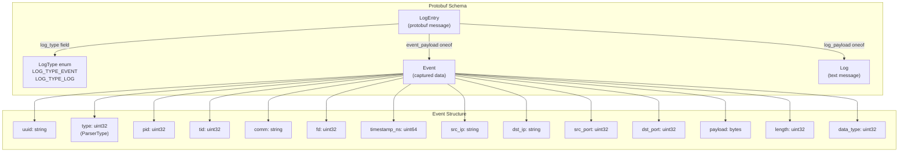
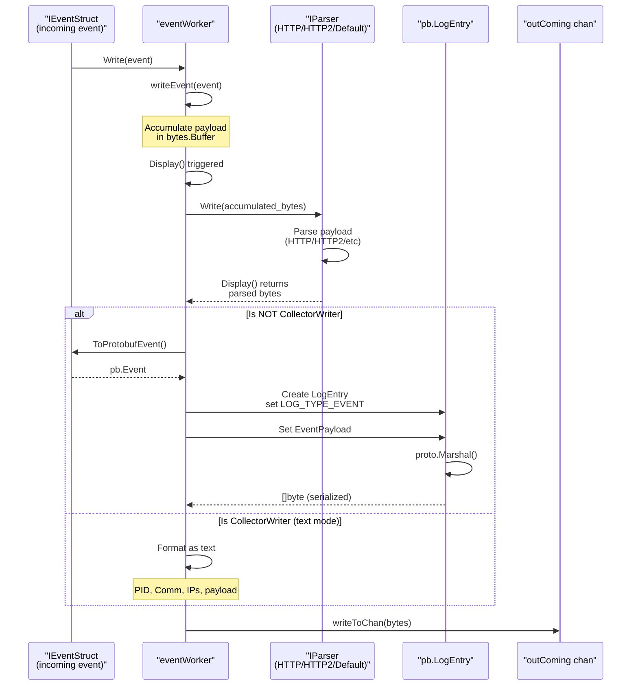
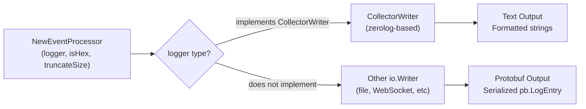
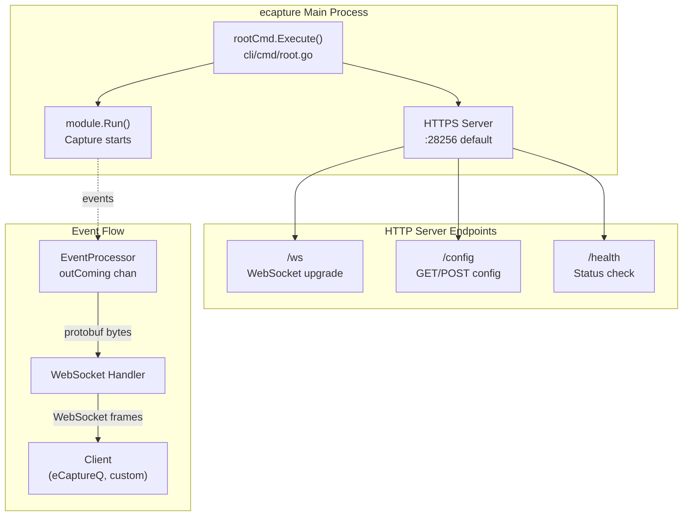
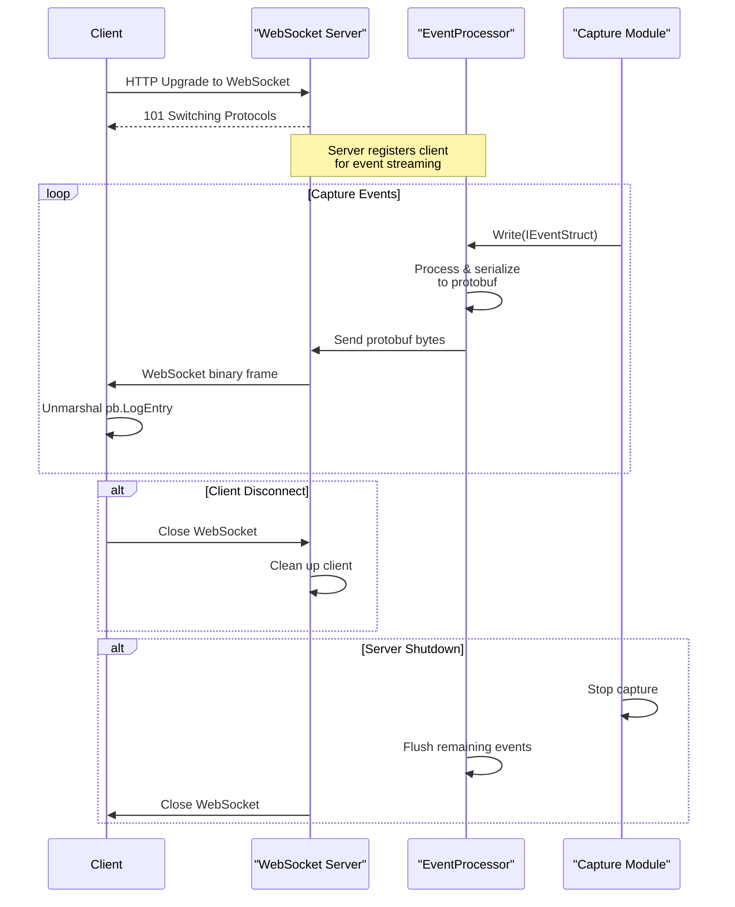
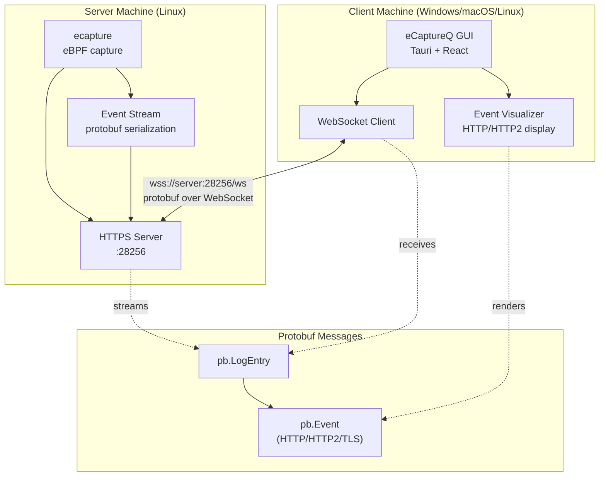
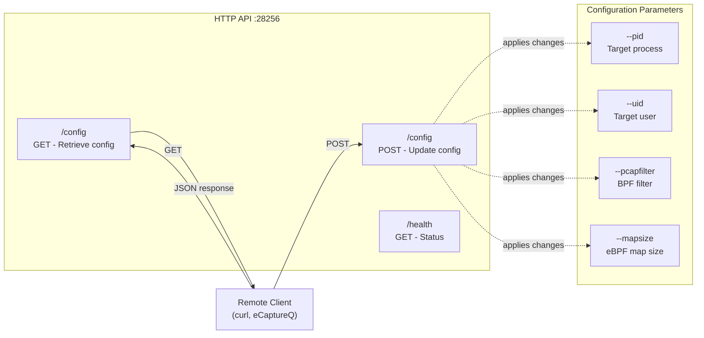
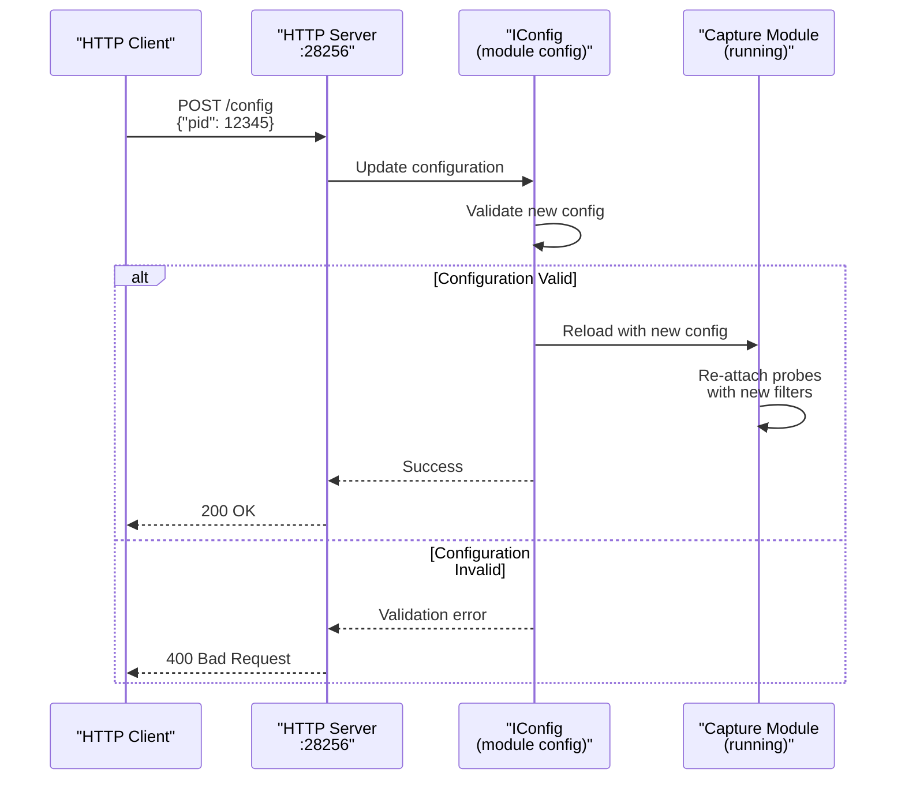
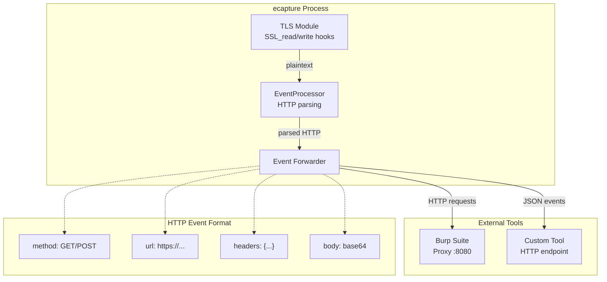
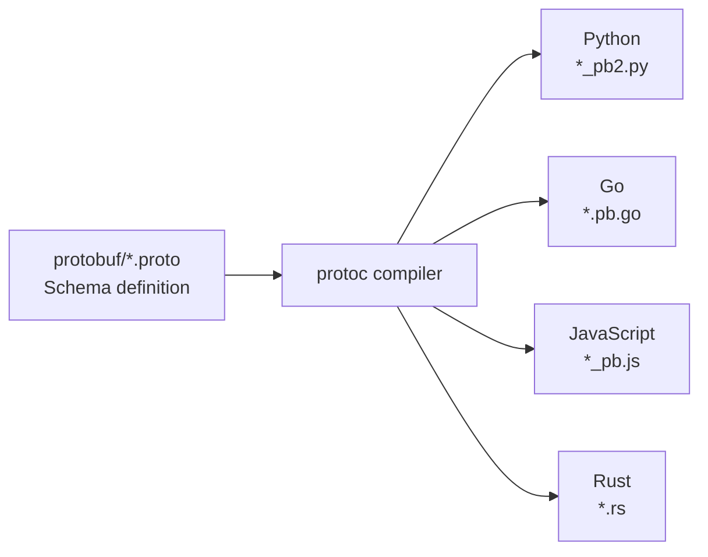

# Protobuf and External Integration

<details>
<summary>Relevant source files</summary>

The following files were used as context for generating this wiki page:

- [README_JA.md](https://github.com/gojue/ecapture/blob/ca085d05/README_JA.md)
- [images/ecapture-logo.png](images/ecapture-logo.png)
- [pkg/event_processor/http_request.go](https://github.com/gojue/ecapture/blob/ca085d05/pkg/event_processor/http_request.go)
- [pkg/event_processor/http_response.go](https://github.com/gojue/ecapture/blob/ca085d05/pkg/event_processor/http_response.go)
- [pkg/event_processor/iparser.go](https://github.com/gojue/ecapture/blob/ca085d05/pkg/event_processor/iparser.go)
- [pkg/event_processor/iworker.go](https://github.com/gojue/ecapture/blob/ca085d05/pkg/event_processor/iworker.go)
- [pkg/event_processor/processor.go](https://github.com/gojue/ecapture/blob/ca085d05/pkg/event_processor/processor.go)
- [protobuf/PROTOCOLS.md](https://github.com/gojue/ecapture/blob/ca085d05/protobuf/PROTOCOLS.md)
- [protobuf/PROTOCOLS_CN.md](https://github.com/gojue/ecapture/blob/ca085d05/protobuf/PROTOCOLS_CN.md)
- [protobuf/README.md](https://github.com/gojue/ecapture/blob/ca085d05/protobuf/README.md)
- [protobuf/README_CN.md](https://github.com/gojue/ecapture/blob/ca085d05/protobuf/README_CN.md)
- [user/event/ievent.go](https://github.com/gojue/ecapture/blob/ca085d05/user/event/ievent.go)
- [utils/protobuf_visualizer/README.md](https://github.com/gojue/ecapture/blob/ca085d05/utils/protobuf_visualizer/README.md)
- [utils/protobuf_visualizer/README_CN.md](https://github.com/gojue/ecapture/blob/ca085d05/utils/protobuf_visualizer/README_CN.md)

</details>


## Purpose and Scope

This document describes ecapture's protobuf-based event serialization format and external integration capabilities. Starting from version 0.8.0, ecapture provides structured event streaming through Protocol Buffers, enabling real-time integration with external tools, GUIs, and analysis platforms. For information about text-based console output, see [4.1 Text Output Mode](4.1-text-output-mode.md). For PCAP file generation, see [4.2 PCAP Integration](4.2-pcap-integration.md).

The protobuf format enables:
- Structured event serialization for programmatic consumption
- WebSocket streaming for real-time event delivery
- Integration with the eCaptureQ graphical interface
- HTTP APIs for remote configuration and event forwarding
- Compatibility with tools like Burp Suite for security analysis

## Protobuf Event Structure

### LogEntry and Event Schema

ecapture uses a hierarchical protobuf schema where all output is wrapped in a `LogEntry` message. Each `LogEntry` can contain either log messages or captured events:


```mermaid
graph TB
    subgraph "Protobuf Schema"
        LogEntry["LogEntry<br/>(protobuf message)"]
        LogType["LogType enum<br/>LOG_TYPE_EVENT<br/>LOG_TYPE_LOG"]
        EventPayload["Event<br/>(captured data)"]
        LogPayload["Log<br/>(text message)"]
        
        LogEntry -->|"log_type field"| LogType
        LogEntry -->|"event_payload oneof"| EventPayload
        LogEntry -->|"log_payload oneof"| LogPayload
    end
    
    subgraph "Event Structure"
        EventPayload --> UUID["uuid: string"]
        EventPayload --> Type["type: uint32<br/>(ParserType)"]
        EventPayload --> PID["pid: uint32"]
        EventPayload --> TID["tid: uint32"]
        EventPayload --> Comm["comm: string"]
        EventPayload --> FD["fd: uint32"]
        EventPayload --> Timestamp["timestamp_ns: uint64"]
        EventPayload --> SrcIP["src_ip: string"]
        EventPayload --> DstIP["dst_ip: string"]
        EventPayload --> SrcPort["src_port: uint32"]
        EventPayload --> DstPort["dst_port: uint32"]
        EventPayload --> Payload["payload: bytes"]
        EventPayload --> Length["length: uint32"]
        EventPayload --> DataType["data_type: uint32"]
    end
```

**Protobuf Event Serialization Flow**

Sources: [pkg/event_processor/iworker.go:214-227](https://github.com/gojue/ecapture/blob/ca085d05/pkg/event_processor/iworker.go#L214-L227), [user/event/ievent.go:51](https://github.com/gojue/ecapture/blob/ca085d05/user/event/ievent.go#L51)

### Event Type Enumeration

The `type` field in the `Event` message corresponds to the `ParserType` enumeration, indicating how the payload should be interpreted:

| ParserType Value | Name | Description |
|-----------------|------|-------------|
| 0 | `ParserTypeNull` | Raw binary data, no parsing applied |
| 1 | `ParserTypeHttpRequest` | HTTP/1.x request |
| 2 | `ParserTypeHttp2Request` | HTTP/2 request with HPACK decompression |
| 3 | `ParserTypeHttpResponse` | HTTP/1.x response |
| 4 | `ParserTypeHttp2Response` | HTTP/2 response with HPACK decompression |
| 5 | `ParserTypeWebSocket` | WebSocket frame |

The parser type is determined dynamically based on payload content inspection and assigned when the event worker completes processing.

Sources: [pkg/event_processor/iparser.go:40-47](https://github.com/gojue/ecapture/blob/ca085d05/pkg/event_processor/iparser.go#L40-L47), [pkg/event_processor/iworker.go:218](https://github.com/gojue/ecapture/blob/ca085d05/pkg/event_processor/iworker.go#L218)

## Event Serialization in the Pipeline

### EventProcessor to Protobuf Conversion

When events flow through the event processing pipeline, they are converted to protobuf format at the output stage. The conversion occurs in the `eventWorker.Display()` method:


```mermaid
sequenceDiagram
    participant IEventStruct as "IEventStruct<br/>(incoming event)"
    participant Worker as "eventWorker"
    participant Parser as "IParser<br/>(HTTP/HTTP2/Default)"
    participant LogEntry as "pb.LogEntry"
    participant Output as "outComing chan"
    
    IEventStruct->>Worker: Write(event)
    Worker->>Worker: writeEvent(event)
    Note over Worker: Accumulate payload<br/>in bytes.Buffer
    
    Worker->>Worker: Display() triggered
    Worker->>Parser: Write(accumulated_bytes)
    Parser->>Parser: Parse payload<br/>(HTTP/HTTP2/etc)
    Parser-->>Worker: Display() returns<br/>parsed bytes
    
    alt Is NOT CollectorWriter
        Worker->>IEventStruct: ToProtobufEvent()
        IEventStruct-->>Worker: pb.Event
        Worker->>LogEntry: Create LogEntry<br/>set LOG_TYPE_EVENT
        Worker->>LogEntry: Set EventPayload
        LogEntry->>LogEntry: proto.Marshal()
        LogEntry-->>Worker: []byte (serialized)
    else Is CollectorWriter (text mode)
        Worker->>Worker: Format as text
        Note over Worker: PID, Comm, IPs, payload
    end
    
    Worker->>Output: writeToChan(bytes)
```

**Event-to-Protobuf Conversion Sequence**

The key distinction is whether the configured logger implements the `CollectorWriter` interface. If not, events are serialized as protobuf; otherwise, they are formatted as human-readable text.

Sources: [pkg/event_processor/iworker.go:174-228](https://github.com/gojue/ecapture/blob/ca085d05/pkg/event_processor/iworker.go#L174-L228), [user/event/ievent.go:54-70](https://github.com/gojue/ecapture/blob/ca085d05/user/event/ievent.go#L54-L70)

### Protobuf vs. Text Mode Selection

The output mode is determined by the logger type passed to `NewEventProcessor()`:


```mermaid
graph LR
    NewEventProcessor["NewEventProcessor<br/>(logger, isHex, truncateSize)"]
    
    LoggerCheck{"logger type?"}
    
    CollectorWriter["CollectorWriter<br/>(zerolog-based)"]
    OtherWriter["Other io.Writer<br/>(file, WebSocket, etc)"]
    
    TextOutput["Text Output<br/>Formatted strings"]
    ProtobufOutput["Protobuf Output<br/>Serialized pb.LogEntry"]
    
    NewEventProcessor --> LoggerCheck
    LoggerCheck -->|"implements CollectorWriter"| CollectorWriter
    LoggerCheck -->|"does not implement"| OtherWriter
    
    CollectorWriter --> TextOutput
    OtherWriter --> ProtobufOutput
```

**Logger Type Determines Serialization Format**

This design allows the same event processing pipeline to serve both human-readable console output and structured protobuf streaming without code duplication.

Sources: [pkg/event_processor/iworker.go:198-228](https://github.com/gojue/ecapture/blob/ca085d05/pkg/event_processor/iworker.go#L198-L228), [pkg/event_processor/processor.go:206-215](https://github.com/gojue/ecapture/blob/ca085d05/pkg/event_processor/processor.go#L206-L215)

## WebSocket Streaming Server

### Server Architecture

Starting from version 1.4.0, ecapture includes an embedded HTTPS server that provides WebSocket endpoints for real-time event streaming. The server runs concurrently with the capture modules:


```mermaid
graph TB
    subgraph "ecapture Main Process"
        RootCmd["rootCmd.Execute()<br/>cli/cmd/root.go"]
        ModuleRun["module.Run()<br/>Capture starts"]
        HTTPServer["HTTPS Server<br/>:28256 default"]
        
        RootCmd --> ModuleRun
        RootCmd --> HTTPServer
    end
    
    subgraph "HTTP Server Endpoints"
        WSEndpoint["/ws<br/>WebSocket upgrade"]
        ConfigAPI["/config<br/>GET/POST config"]
        HealthAPI["/health<br/>Status check"]
        
        HTTPServer --> WSEndpoint
        HTTPServer --> ConfigAPI
        HTTPServer --> HealthAPI
    end
    
    subgraph "Event Flow"
        EventProcessor["EventProcessor<br/>outComing chan"]
        WSHandler["WebSocket Handler"]
        Client["Client<br/>(eCaptureQ, custom)"]
        
        EventProcessor -->|"protobuf bytes"| WSHandler
        WSHandler -->|"WebSocket frames"| Client
    end
    
    ModuleRun -.->|"events"| EventProcessor
```

**Embedded HTTPS Server Architecture**

The server listens on `localhost:28256` by default (configurable via `--listen` flag) and provides WebSocket connections for clients to subscribe to the event stream.

Sources: [CHANGELOG.md:82-87](https://github.com/gojue/ecapture/blob/ca085d05/CHANGELOG.md#L82-L87), [README.md:82-86](https://github.com/gojue/ecapture/blob/ca085d05/README.md#L82-L86)

### WebSocket Protocol

Clients connect to the WebSocket endpoint and receive a continuous stream of protobuf-serialized `LogEntry` messages. Each WebSocket message contains exactly one marshaled `LogEntry`:

| Field | Type | Description |
|-------|------|-------------|
| WebSocket Message | Binary | Contains one `pb.LogEntry` |
| `LogEntry.log_type` | enum | `LOG_TYPE_EVENT` or `LOG_TYPE_LOG` |
| `LogEntry.event_payload` | `pb.Event` | If `log_type` is `LOG_TYPE_EVENT` |
| `LogEntry.log_payload` | `pb.Log` | If `log_type` is `LOG_TYPE_LOG` |

Clients must:
1. Establish WebSocket connection to `wss://localhost:28256/ws`
2. Continuously read binary WebSocket messages
3. Unmarshal each message as `pb.LogEntry`
4. Process based on `log_type` discriminator

Sources: [CHANGELOG.md:16](https://github.com/gojue/ecapture/blob/ca085d05/CHANGELOG.md#L16), [README.md:304-308](https://github.com/gojue/ecapture/blob/ca085d05/README.md#L304-L308)

### Connection Lifecycle


```mermaid
sequenceDiagram
    participant Client
    participant WSServer as "WebSocket Server"
    participant EventProc as "EventProcessor"
    participant Module as "Capture Module"
    
    Client->>WSServer: HTTP Upgrade to WebSocket
    WSServer-->>Client: 101 Switching Protocols
    
    Note over WSServer,EventProc: Server registers client<br/>for event streaming
    
    loop Capture Events
        Module->>EventProc: Write(IEventStruct)
        EventProc->>EventProc: Process & serialize<br/>to protobuf
        EventProc->>WSServer: Send protobuf bytes
        WSServer->>Client: WebSocket binary frame
        Client->>Client: Unmarshal pb.LogEntry
    end
    
    alt Client Disconnect
        Client->>WSServer: Close WebSocket
        WSServer->>WSServer: Clean up client
    end
    
    alt Server Shutdown
        Module->>Module: Stop capture
        EventProc->>EventProc: Flush remaining events
        WSServer->>Client: Close WebSocket
    end
```

**WebSocket Connection Lifecycle**

Sources: [CHANGELOG.md:82-89](https://github.com/gojue/ecapture/blob/ca085d05/CHANGELOG.md#L82-L89)

## eCaptureQ GUI Integration

### Remote Mode Architecture

[eCaptureQ](https://github.com/gojue/ecaptureq) is the official cross-platform GUI client for ecapture. It connects to ecapture's WebSocket endpoint to receive events and provides real-time visualization. The remote mode architecture enables Windows/macOS clients to connect to Linux servers:


```mermaid
graph TB
    subgraph "Client Machine (Windows/macOS/Linux)"
        eCaptureQ["eCaptureQ GUI<br/>Tauri + React"]
        WSClient["WebSocket Client"]
        Visualizer["Event Visualizer<br/>HTTP/HTTP2 display"]
        
        eCaptureQ --> WSClient
        eCaptureQ --> Visualizer
    end
    
    subgraph "Server Machine (Linux)"
        ecapture["ecapture<br/>eBPF capture"]
        HTTPSServer["HTTPS Server<br/>:28256"]
        EventStream["Event Stream<br/>protobuf serialization"]
        
        ecapture --> HTTPSServer
        ecapture --> EventStream
        EventStream --> HTTPSServer
    end
    
    WSClient <-->|"wss://server:28256/ws<br/>protobuf over WebSocket"| HTTPSServer
    
    subgraph "Protobuf Messages"
        LogEntry["pb.LogEntry"]
        Event["pb.Event<br/>(HTTP/HTTP2/TLS)"]
        
        LogEntry --> Event
    end
    
    HTTPSServer -.->|"streams"| LogEntry
    WSClient -.->|"receives"| LogEntry
    Visualizer -.->|"renders"| Event
```

**eCaptureQ Remote Mode Integration**

Sources: [README.md:287-302](https://github.com/gojue/ecapture/blob/ca085d05/README.md#L287-L302), [README_CN.md:267-281](https://github.com/gojue/ecapture/blob/ca085d05/README_CN.md#L267-L281)

### Integrated Mode vs. Remote Mode

eCaptureQ supports two deployment models:

| Mode | Description | Client Platforms | Server Platforms |
|------|-------------|------------------|------------------|
| **Integrated** | eCaptureQ bundles ecapture binary and runs it locally | Linux, Android | N/A (local only) |
| **Remote** | eCaptureQ connects to remote ecapture server | Windows, macOS, Linux | Linux, Android |

In integrated mode, eCaptureQ spawns the ecapture process and connects to its WebSocket endpoint via localhost. In remote mode, users configure the remote server address, and eCaptureQ establishes a WebSocket connection over the network.

Sources: [README.md:293-296](https://github.com/gojue/ecapture/blob/ca085d05/README.md#L293-L296), [README_CN.md:273-276](https://github.com/gojue/ecapture/blob/ca085d05/README_CN.md#L273-L276)

## HTTP Configuration API

### Remote Configuration Updates

ecapture exposes HTTP endpoints for dynamic configuration updates without restarting the capture process. The API enables remote control of capture parameters:

**Configuration API Endpoints**


```mermaid
graph LR
    subgraph "HTTP API :28256"
        GET["/config<br/>GET - Retrieve config"]
        POST["/config<br/>POST - Update config"]
        Health["/health<br/>GET - Status"]
    end
    
    subgraph "Configuration Parameters"
        PID["--pid<br/>Target process"]
        UID["--uid<br/>Target user"]
        Filter["--pcapfilter<br/>BPF filter"]
        MapSize["--mapsize<br/>eBPF map size"]
    end
    
    Client["Remote Client<br/>(curl, eCaptureQ)"]
    
    Client -->|"GET"| GET
    Client -->|"POST"| POST
    GET -->|"JSON response"| Client
    POST -.->|"applies changes"| PID
    POST -.->|"applies changes"| UID
    POST -.->|"applies changes"| Filter
    POST -.->|"applies changes"| MapSize
```

**HTTP Configuration API Structure**

The API accepts JSON payloads to modify capture behavior at runtime. For example, changing the target PID or updating BPF filters without stopping the capture.

Sources: [README.md:321-323](https://github.com/gojue/ecapture/blob/ca085d05/README.md#L321-L323), [README_CN.md:302-303](https://github.com/gojue/ecapture/blob/ca085d05/README_CN.md#L302-L303)

### Configuration Update Flow


```mermaid
sequenceDiagram
    participant Client as "HTTP Client"
    participant API as "HTTP Server<br/>:28256"
    participant Config as "IConfig<br/>(module config)"
    participant Module as "Capture Module<br/>(running)"
    
    Client->>API: POST /config<br/>{"pid": 12345}
    API->>Config: Update configuration
    Config->>Config: Validate new config
    
    alt Configuration Valid
        Config->>Module: Reload with new config
        Module->>Module: Re-attach probes<br/>with new filters
        Config-->>API: Success
        API-->>Client: 200 OK
    else Configuration Invalid
        Config-->>API: Validation error
        API-->>Client: 400 Bad Request
    end
```

**Configuration Update Sequence**

The module may need to reload eBPF programs if certain parameters (like PID filters) are changed. The API provides atomic configuration updates to prevent inconsistent state.

Sources: [README.md:321-323](https://github.com/gojue/ecapture/blob/ca085d05/README.md#L321-L323), [CHANGELOG.md:27](https://github.com/gojue/ecapture/blob/ca085d05/CHANGELOG.md#L27)

## Event Forwarding Integration

### Burp Suite Integration

ecapture supports forwarding captured HTTP/HTTPS events to external tools like Burp Suite for security analysis. This enables SSL/TLS traffic inspection without certificate installation:


```mermaid
graph TB
    subgraph "ecapture Process"
        TLSCapture["TLS Module<br/>SSL_read/write hooks"]
        EventProc["EventProcessor<br/>HTTP parsing"]
        Forwarder["Event Forwarder"]
        
        TLSCapture -->|"plaintext"| EventProc
        EventProc -->|"parsed HTTP"| Forwarder
    end
    
    subgraph "External Tools"
        BurpSuite["Burp Suite<br/>Proxy :8080"]
        CustomTool["Custom Tool<br/>HTTP endpoint"]
        
        Forwarder -->|"HTTP requests"| BurpSuite
        Forwarder -->|"JSON events"| CustomTool
    end
    
    subgraph "HTTP Event Format"
        Method["method: GET/POST"]
        URL["url: https://..."]
        Headers["headers: {...}"]
        Body["body: base64"]
        
        Forwarder -.-> Method
        Forwarder -.-> URL
        Forwarder -.-> Headers
        Forwarder -.-> Body
    end
```

**Event Forwarding to External Tools**

Events are reconstructed as HTTP requests and forwarded to configured endpoints. Burp Suite can intercept and analyze the traffic as if it were a proxy, but without requiring certificate trust.

Sources: [README.md:325-327](https://github.com/gojue/ecapture/blob/ca085d05/README.md#L325-L327), [README_CN.md:305-306](https://github.com/gojue/ecapture/blob/ca085d05/README_CN.md#L305-L306)

### Forwarding Configuration

Event forwarding is configured via command-line flags or the HTTP configuration API:

| Parameter | Description | Example |
|-----------|-------------|---------|
| `--forward-url` | Destination HTTP endpoint | `http://localhost:8080` |
| `--forward-filter` | Filter events by content-type | `application/json` |
| `--forward-method` | HTTP method for forwarding | `POST` |

The forwarder converts each parsed event into an HTTP request payload and sends it to the configured endpoint. Response status is logged but does not affect capture.

Sources: [README.md:325-327](https://github.com/gojue/ecapture/blob/ca085d05/README.md#L325-L327)

## Custom Client Implementation

### WebSocket Client Example

For custom integrations, clients can connect directly to ecapture's WebSocket endpoint. A minimal Python client example:

```
# Pseudocode structure - not actual code
import websocket
import protobuf_generated.log_entry_pb2

def on_message(ws, message):
    log_entry = log_entry_pb2.LogEntry()
    log_entry.ParseFromString(message)
    
    if log_entry.log_type == LOG_TYPE_EVENT:
        event = log_entry.event_payload
        print(f"Event: {event.uuid}")
        print(f"Payload: {event.payload}")

ws = websocket.WebSocketApp(
    "wss://localhost:28256/ws",
    on_message=on_message
)
ws.run_forever()
```

The protobuf schema definitions are available in the repository at `protobuf/PROTOCOLS.md` for generating language-specific bindings.

Sources: [CHANGELOG.md:16](https://github.com/gojue/ecapture/blob/ca085d05/CHANGELOG.md#L16), [README.md:304-308](https://github.com/gojue/ecapture/blob/ca085d05/README.md#L304-L308)

### Protobuf Schema Generation

Clients must generate protobuf bindings from the `.proto` definition files in the `protobuf/` directory:


```mermaid
graph LR
    ProtoFiles["protobuf/*.proto<br/>Schema definition"]
    ProtocCompiler["protoc compiler"]
    PythonBindings["Python<br/>*_pb2.py"]
    GoBindings["Go<br/>*.pb.go"]
    JSBindings["JavaScript<br/>*_pb.js"]
    RustBindings["Rust<br/>*.rs"]
    
    ProtoFiles --> ProtocCompiler
    ProtocCompiler --> PythonBindings
    ProtocCompiler --> GoBindings
    ProtocCompiler --> JSBindings
    ProtocCompiler --> RustBindings
```

**Protobuf Schema Compilation for Multiple Languages**

The repository includes pre-generated Go bindings at `protobuf/gen/v1/`. For other languages, developers run `protoc` with the appropriate language plugin against the source `.proto` files.

Sources: [pkg/event_processor/iworker.go:29](https://github.com/gojue/ecapture/blob/ca085d05/pkg/event_processor/iworker.go#L29), [user/event/ievent.go:21](https://github.com/gojue/ecapture/blob/ca085d05/user/event/ievent.go#L21)

## Integration Security Considerations

### TLS Certificate Verification

The embedded HTTPS server uses self-signed certificates by default. Clients connecting to remote ecapture instances should:

1. Verify the server certificate fingerprint out-of-band
2. Use certificate pinning for production deployments
3. Restrict listener addresses (use `--listen 127.0.0.1:28256` for local-only access)

For remote access, consider SSH tunneling or VPN instead of exposing the port directly:

```
# SSH tunnel example (not actual code)
ssh -L 28256:localhost:28256 user@remote-server
# Then connect local client to localhost:28256
```

Sources: [README.md:82-86](https://github.com/gojue/ecapture/blob/ca085d05/README.md#L82-L86)

### Authentication and Authorization

As of version 1.5.1, ecapture does not implement authentication on the HTTP/WebSocket endpoints. The security model assumes:

- The listener is bound to localhost by default (`localhost:28256`)
- Remote access requires SSH tunneling or similar secure transport
- The system-level requirement for root privileges provides process isolation

Future versions may add API key authentication for remote deployments.

Sources: [README.md:82-86](https://github.com/gojue/ecapture/blob/ca085d05/README.md#L82-L86), [CHANGELOG.md:1-35](https://github.com/gojue/ecapture/blob/ca085d05/CHANGELOG.md#L1-L35)