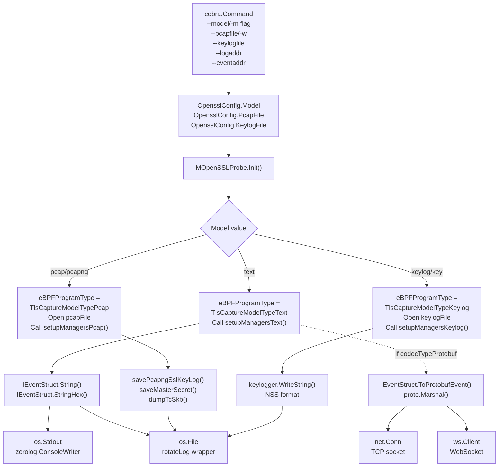
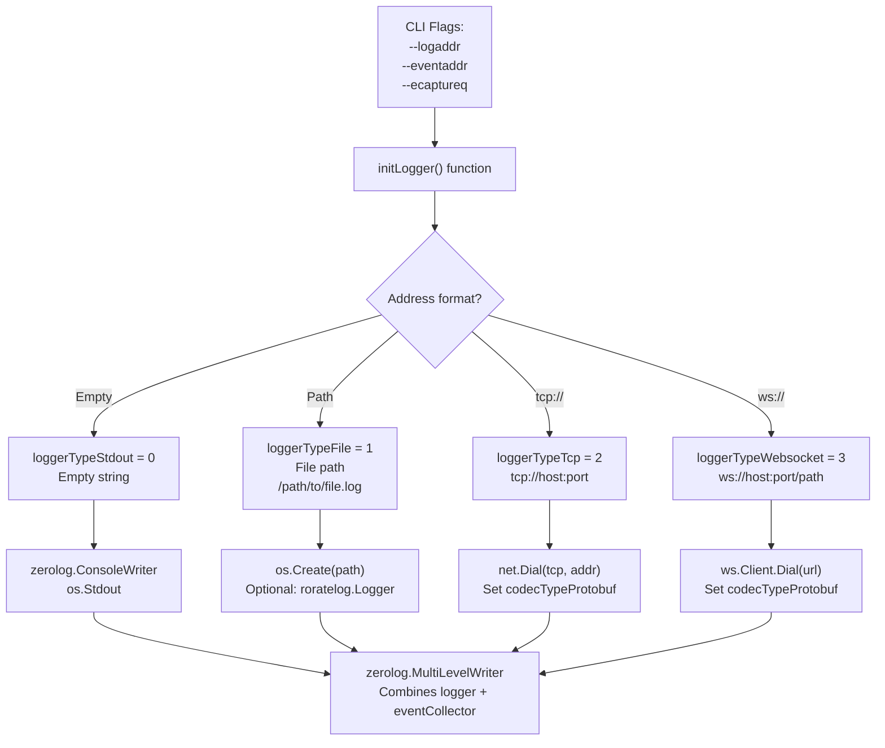
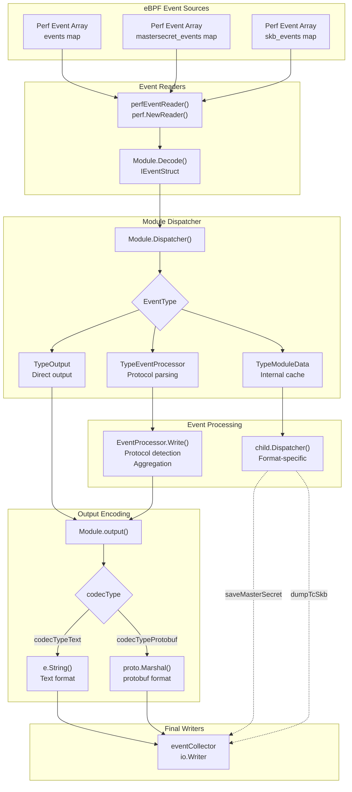

# Output Formats

<details>
<summary>Relevant source files</summary>

The following files were used as context for generating this wiki page:

- [CHANGELOG.md](https://github.com/gojue/ecapture/blob/0766a93b/CHANGELOG.md)
- [README.md](https://github.com/gojue/ecapture/blob/0766a93b/README.md)
- [README_CN.md](https://github.com/gojue/ecapture/blob/0766a93b/README_CN.md)
- [images/ecapture-help-v0.8.9.svg](https://github.com/gojue/ecapture/blob/0766a93b/images/ecapture-help-v0.8.9.svg)
- [main.go](https://github.com/gojue/ecapture/blob/0766a93b/main.go)
- [pkg/event_processor/base_event.go](https://github.com/gojue/ecapture/blob/0766a93b/pkg/event_processor/base_event.go)
- [user/event/event_bash.go](https://github.com/gojue/ecapture/blob/0766a93b/user/event/event_bash.go)
- [user/event/event_gnutls.go](https://github.com/gojue/ecapture/blob/0766a93b/user/event/event_gnutls.go)
- [user/event/event_masterkey.go](https://github.com/gojue/ecapture/blob/0766a93b/user/event/event_masterkey.go)
- [user/event/event_mysqld.go](https://github.com/gojue/ecapture/blob/0766a93b/user/event/event_mysqld.go)
- [user/event/event_nspr.go](https://github.com/gojue/ecapture/blob/0766a93b/user/event/event_nspr.go)
- [user/event/event_openssl.go](https://github.com/gojue/ecapture/blob/0766a93b/user/event/event_openssl.go)
- [user/event/event_openssl_tc.go](https://github.com/gojue/ecapture/blob/0766a93b/user/event/event_openssl_tc.go)
- [user/event/event_postgres.go](https://github.com/gojue/ecapture/blob/0766a93b/user/event/event_postgres.go)

</details>


eCapture provides four distinct output formats for captured network traffic, master secrets, and audit data. Each format serves specific use cases and integrates with different analysis tools. The output format determines both the data encoding (text, binary PCAP, keylog, protobuf) and the destination (console, file, TCP socket, WebSocket).

## Output Format Overview

| Format | Primary Use Case | Output Destination | Wireshark Compatible | Real-time |
|--------|------------------|-------------------|---------------------|-----------|
| **Text** | Interactive debugging, log analysis | Console, file, WebSocket | No | Yes |
| **PCAP** | Network analysis, traffic replay | PCAP-NG file | Yes | No |
| **Keylog** | TLS decryption with external tools | NSS keylog file | Yes (with tcpdump) | No |
| **Protobuf** | Tool integration, eCaptureQ GUI | TCP, WebSocket | No | Yes |

For detailed information about specific output modes, see:
- [Text Output Mode](4.1-text-output-mode.md) - Plain text formatting, HTTP parsing, color coding
- [PCAP Integration](4.2-pcap-integration.md) - PCAP-NG file generation, DSB blocks, Wireshark workflow
- [TLS Key Logging](4.3-tls-key-logging.md) - Master secret extraction, SSLKEYLOGFILE format
- [Protobuf and External Integration](4.4-protobuf-and-external-integration.md) - Binary protocol, WebSocket streaming, eCaptureQ

**Sources:** [README.md:172-253](https://github.com/gojue/ecapture/blob/0766a93b/README.md#L172-L253), [user/module/probe_openssl.go:58-76](https://github.com/gojue/ecapture/blob/0766a93b/user/module/probe_openssl.go#L58-L76), [user/config/iconfig.go:73-79](https://github.com/gojue/ecapture/blob/0766a93b/user/config/iconfig.go#L73-L79)

## Output Format Architecture

### Format Selection and Encoding Pipeline

The following diagram shows how CLI flags are translated into output encoders and destination writers:



**Sources:** [user/module/probe_openssl.go:109-176](https://github.com/gojue/ecapture/blob/0766a93b/user/module/probe_openssl.go#L109-L176), [user/config/iconfig.go:95-112](https://github.com/gojue/ecapture/blob/0766a93b/user/config/iconfig.go#L95-L112), [cli/cmd/root.go:178-247](https://github.com/gojue/ecapture/blob/0766a93b/cli/cmd/root.go#L178-L247)

### Format Type Constants

Output formats are defined using the `TlsCaptureModelType` enumeration in the codebase:

| Enum Value | Constant Name | CLI Flag | Description |
|------------|--------------|----------|-------------|
| `0` | `TlsCaptureModelTypePcap` | `pcap`, `pcapng` | PCAP-NG binary format |
| `1` | `TlsCaptureModelTypeText` | `text` (default) | Human-readable text |
| `2` | `TlsCaptureModelTypeKeylog` | `keylog`, `key` | NSS Key Log format |

The CLI accepts string values via the `--model/-m` flag:
- `text` → `TlsCaptureModelTypeText` → Uses `setupManagersText()`
- `pcap` or `pcapng` → `TlsCaptureModelTypePcap` → Uses `setupManagersPcap()`
- `keylog` or `key` → `TlsCaptureModelTypeKeylog` → Uses `setupManagersKeylog()`

Protobuf format is automatically enabled when using remote destinations (`tcp://` or `ws://` in `--eventaddr`).

**Sources:** [user/module/probe_openssl.go:58-76](https://github.com/gojue/ecapture/blob/0766a93b/user/module/probe_openssl.go#L58-L76), [user/config/iconfig.go:73-79](https://github.com/gojue/ecapture/blob/0766a93b/user/config/iconfig.go#L73-L79)

## Event Structure and Serialization

All captured events implement the `IEventStruct` interface, which defines methods for multiple output formats:

### IEventStruct Interface Methods

```go
type IEventStruct interface {
    Decode(payload []byte) error
    String() string                    // Text format
    StringHex() string                 // Text format with hex dump
    Clone() IEventStruct
    EventType() Type
    GetUUID() string
    Payload() []byte
    PayloadLen() int
    Base() Base                        // Common metadata
    ToProtobufEvent() *pb.Event       // Protobuf format
}
```

### Event Types by Module

| Module | Event Structure | Contains | Output Modes |
|--------|----------------|----------|--------------|
| TLS/SSL | `SSLDataEvent` | Encrypted payload, tuple, TLS version | Text, PCAP, Protobuf |
| TLS/SSL | `ConnDataEvent` | Connection 4-tuple (IP:port pairs) | PCAP, Protobuf |
| TLS/SSL | `MasterSecretEvent` | Client random, master key | Keylog, PCAP (DSB) |
| TLS/SSL | `TcSkbEvent` | Raw packet data from TC hook | PCAP |
| GoTLS | `TlsDataEvent` | Go TLS plaintext, connection info | Text, PCAP, Protobuf |
| GnuTLS | `GnutlsDataEvent` | GnuTLS plaintext | Text, Protobuf |
| NSS | `NsprDataEvent` | NSS/NSPR plaintext | Text, Protobuf |
| Bash | `BashEvent` | Shell command line | Text, Protobuf |
| MySQL | `MysqldEvent` | SQL query, return value | Text, Protobuf |
| PostgreSQL | `PostgresEvent` | SQL query | Text, Protobuf |

Each event structure implements serialization for its supported output formats:
- `String()` / `StringHex()` for text output with optional color coding
- `ToProtobufEvent()` for binary protobuf serialization
- Module-specific methods (`saveMasterSecret()`, `dumpTcSkb()`) for PCAP/keylog

**Sources:** [user/event/event_openssl.go:77-391](https://github.com/gojue/ecapture/blob/0766a93b/user/event/event_openssl.go#L77-L391), [user/event/event_masterkey.go:37-273](https://github.com/gojue/ecapture/blob/0766a93b/user/event/event_masterkey.go#L37-L273), [user/event/event_bash.go:37-133](https://github.com/gojue/ecapture/blob/0766a93b/user/event/event_bash.go#L37-L133), [user/event/event_mysqld.go:68-168](https://github.com/gojue/ecapture/blob/0766a93b/user/event/event_mysqld.go#L68-L168)

## Output Destination Configuration

eCapture separates logging (diagnostic messages) from event output (captured data). Both support multiple destination types.

### Destination Type Detection



**Sources:** [cli/cmd/root.go:68-73](https://github.com/gojue/ecapture/blob/0766a93b/cli/cmd/root.go#L68-L73), [cli/cmd/root.go:178-247](https://github.com/gojue/ecapture/blob/0766a93b/cli/cmd/root.go#L178-L247)

### Destination Type Constants and Behavior

| Constant | Value | Trigger Pattern | Writer Implementation | Codec Type |
|----------|-------|----------------|----------------------|------------|
| `loggerTypeStdout` | `0` | Empty string | `zerolog.ConsoleWriter` → `os.Stdout` | Text |
| `loggerTypeFile` | `1` | `/path/to/file` | `os.Create()` + optional `roratelog.Logger` | Text |
| `loggerTypeTcp` | `2` | `tcp://host:port` | `net.Dial("tcp", addr)` | Protobuf |
| `loggerTypeWebsocket` | `3` | `ws://` or `wss://` | `ws.Client.Dial(url)` | Protobuf |

### Codec Selection Logic

The destination type determines which codec is used for event serialization:

```go
// In initLogger() function
if strings.Contains(addr, "tcp://") || strings.Contains(addr, "ws://") {
    // Remote destinations use protobuf
    module.eventOutputType = codecTypeProtobuf
} else {
    // Local destinations use text
    module.eventOutputType = codecTypeText
}
```

Remote destinations (`tcp://`, `ws://`) automatically enable protobuf encoding via `IEventStruct.ToProtobufEvent()`, while local destinations use `IEventStruct.String()`.

### Log Rotation

File destinations support automatic rotation when configured:
- `--eventroratesize <MB>` - Rotate when file reaches size limit
- `--eventroratetime <seconds>` - Rotate at time intervals

Rotation is handled by the `roratelog.Logger` wrapper around the file handle.

**Sources:** [cli/cmd/root.go:68-73](https://github.com/gojue/ecapture/blob/0766a93b/cli/cmd/root.go#L68-L73), [cli/cmd/root.go:178-247](https://github.com/gojue/ecapture/blob/0766a93b/cli/cmd/root.go#L178-L247), [cli/cmd/root.go:151-152](https://github.com/gojue/ecapture/blob/0766a93b/cli/cmd/root.go#L151-L152)

---

## Event Output Pipeline

Captured events flow through a multi-stage pipeline before reaching their final destination.

### Event Flow Architecture



**Sources:** [user/module/imodule.go:285-448](https://github.com/gojue/ecapture/blob/0766a93b/user/module/imodule.go#L285-L448), [user/module/probe_openssl.go:733-775](https://github.com/gojue/ecapture/blob/0766a93b/user/module/probe_openssl.go#L733-L775)

### Event Routing by Type

The event pipeline uses three classification types to route events through different processing stages:

| Event Type | Constant Value | Handler | Purpose |
|------------|---------------|---------|---------|
| `TypeOutput` | `event.TypeOutput` | `module.output()` | Pre-formatted events, direct output |
| `TypeEventProcessor` | `event.TypeEventProcessor` | `EventProcessor.Write()` | HTTP/HTTP2 parsing, protocol detection |
| `TypeModuleData` | `event.TypeModuleData` | `module.Dispatcher()` | Internal caching, PCAP writes, keylog |

Events are assigned types during `Clone()`:

```go
// Example from SSLDataEvent
func (se *SSLDataEvent) Clone() IEventStruct {
    event := new(SSLDataEvent)
    event.eventType = TypeModuleData  // Routes to module dispatcher
    return event
}
```

**Sources:** [user/event/event_openssl.go:200-204](https://github.com/gojue/ecapture/blob/0766a93b/user/event/event_openssl.go#L200-L204), [user/module/imodule.go:430-447](https://github.com/gojue/ecapture/blob/0766a93b/user/module/imodule.go#L430-L447)

---

## Format-Specific Processing

Each output format implements specialized processing logic within the module's dispatcher.

## Format-Specific Use Cases

### Text Mode

**When to use:**
- Interactive debugging and real-time monitoring
- Console-based traffic inspection
- Log file analysis with grep/awk
- HTTP/HTTP2 protocol analysis

**Output examples:**
- Plain text request/response bodies with color coding
- HTTP/1.1 headers and content
- HTTP/2 frame-by-frame decoding with stream IDs
- Connection metadata (PID, process name, IP:port tuples)

See [Text Output Mode](4.1-text-output-mode.md) for formatting details, color schemes, and HTTP parsing.

**Sources:** [user/module/probe_openssl.go:756-775](https://github.com/gojue/ecapture/blob/0766a93b/user/module/probe_openssl.go#L756-L775), [user/event/event_openssl.go:167-198](https://github.com/gojue/ecapture/blob/0766a93b/user/event/event_openssl.go#L167-L198)

### PCAP Mode

**When to use:**
- Network analysis with Wireshark
- Traffic archival for later analysis
- Integration with existing PCAP-based tools
- Combining plaintext capture with packet inspection

**Output structure:**
- PCAP-NG file format with Interface Description Block (IDB)
- Enhanced Packet Blocks (EPB) for captured packets
- Decryption Secrets Blocks (DSB) containing master keys
- Automatic key-to-connection association

See [PCAP Integration](4.2-pcap-integration.md) for file format details and Wireshark workflow.

**Sources:** [user/module/probe_openssl.go:733-754](https://github.com/gojue/ecapture/blob/0766a93b/user/module/probe_openssl.go#L733-L754)

### Keylog Mode

**When to use:**
- Decrypting existing pcap files with Wireshark
- Real-time decryption with tshark
- Compliance with SSLKEYLOGFILE-based tools
- Separating key capture from packet capture

**Output format:**
```
CLIENT_RANDOM <32-byte-hex> <48-byte-hex-master-key>
CLIENT_HANDSHAKE_TRAFFIC_SECRET <32-byte-hex> <secret>
SERVER_HANDSHAKE_TRAFFIC_SECRET <32-byte-hex> <secret>
```

See [TLS Key Logging](4.3-tls-key-logging.md) for TLS 1.2/1.3 key extraction and integration examples.

**Sources:** [user/module/probe_openssl.go:482-642](https://github.com/gojue/ecapture/blob/0766a93b/user/module/probe_openssl.go#L482-L642)

### Protobuf Mode

**When to use:**
- eCaptureQ GUI integration
- Custom tool development with structured data
- Remote monitoring over TCP/WebSocket
- Event forwarding to SIEM systems

**Protocol:**
- Binary protobuf encoding via `pb.Event` message type
- Fields: `timestamp`, `uuid`, `pid`, `pname`, `src_ip`, `dst_ip`, `payload`
- WebSocket framing with heartbeat mechanism

See [Protobuf and External Integration](4.4-protobuf-and-external-integration.md) for protocol schema and client examples.

**Sources:** [user/event/event_openssl.go:237-266](https://github.com/gojue/ecapture/blob/0766a93b/user/event/event_openssl.go#L237-L266), [protobuf/PROTOCOLS.md](https://github.com/gojue/ecapture/blob/0766a93b/protobuf/PROTOCOLS.md)

## CLI Configuration Reference

### Global Output Flags

| Flag | Short | Type | Default | Description |
|------|-------|------|---------|-------------|
| `--logaddr` | `-l` | string | `""` | Logger destination: file path, `tcp://host:port`, `ws://host:port` |
| `--eventaddr` | | string | `""` | Event collector destination (if unset, uses `--logaddr`) |
| `--ecaptureq` | | string | `""` | Local WebSocket server for eCaptureQ integration |
| `--listen` | | string | `localhost:28256` | HTTP API server for runtime configuration updates |
| `--eventroratesize` | | uint16 | `0` | Rotate event file when size exceeds N MB (0=disabled) |
| `--eventroratetime` | | uint16 | `0` | Rotate event file every N seconds (0=disabled) |

### Module-Specific Format Flags

Available for `tls`, `gotls`, `gnutls`, `nss` modules:

| Flag | Short | Type | Default | Description |
|------|-------|------|---------|-------------|
| `--model` | `-m` | string | `text` | Format: `text`, `pcap`, `pcapng`, `keylog`, `key` |
| `--pcapfile` | `-w` | string | `ecapture_openssl.pcapng` | Output file for PCAP mode |
| `--keylogfile` | | string | `ecapture_masterkey.log` | Output file for keylog mode |
| `--hex` | | bool | `false` | Hex dump payload in text mode |

### Example Commands

```bash
# Text mode to console
sudo ecapture tls

# Text mode to file with rotation
sudo ecapture tls --eventaddr=/var/log/ecapture.log --eventroratesize=100

# PCAP mode with custom file
sudo ecapture tls -m pcap -w /tmp/capture.pcapng -i eth0

# Keylog mode for Wireshark decryption
sudo ecapture tls -m keylog --keylogfile=/tmp/keys.log

# Protobuf streaming to eCaptureQ
sudo ecapture tls --ecaptureq=:9090

# Remote TCP streaming
sudo ecapture tls --eventaddr=tcp://192.168.1.100:8080
```

**Sources:** [cli/cmd/root.go:136-153](https://github.com/gojue/ecapture/blob/0766a93b/cli/cmd/root.go#L136-L153), [README.md:172-253](https://github.com/gojue/ecapture/blob/0766a93b/README.md#L172-L253)

### Configuration Structure

The output configuration is stored in multiple places:

1. **BaseConfig**: Common settings for all modules
   - `LoggerAddr`: Logger destination
   - `EventCollectorAddr`: Event collector destination
   - `LoggerType`: Destination type (stdout/file/tcp/ws)

2. **OpensslConfig**: SSL module-specific settings
   - `Model`: Output format mode
   - `PcapFile`: PCAP file path
   - `KeylogFile`: Keylog file path

3. **Module Runtime State**: Derived from configuration
   - `eBPFProgramType`: Internal format type enum
   - `keylogger`: Open file handle for keylog
   - `pcapngFilename`: Resolved PCAP file path

**Sources:** [user/config/iconfig.go:95-112](https://github.com/gojue/ecapture/blob/0766a93b/user/config/iconfig.go#L95-L112), [user/module/probe_openssl.go:83-106](https://github.com/gojue/ecapture/blob/0766a93b/user/module/probe_openssl.go#L83-L106)

---

## Output Format Selection Matrix

The following table summarizes format capabilities and requirements:

| Format | CLI Flag | File Output | Real-time | Wireshark Compatible | Master Secrets | Protocol Parsing |
|--------|----------|-------------|-----------|---------------------|----------------|------------------|
| **Text** | `-m text` | Optional (--eventaddr) | Yes (stdout) | No | No (v0.7.0+) | Yes (HTTP/1.1, HTTP/2) |
| **PCAP** | `-m pcap` | Required (--pcapfile) | No | Yes | Yes (DSB blocks) | No |
| **Keylog** | `-m keylog` | Required (--keylogfile) | No | Yes (with tcpdump) | Yes (NSS format) | No |
| **Protobuf** | Auto (--ecaptureq) | Optional (--eventaddr) | Yes (WebSocket) | No | Embedded | Varies |

**Compatibility Notes:**
- Text mode with HTTP/2 support added in v0.8.5
- PCAP DSB block support for embedded master secrets
- Keylog format compatible with Wireshark's "Pre-Master-Secret log filename" setting
- Protobuf mode automatically enabled when using eCaptureQ integration

**Sources:** [README.md:172-253](https://github.com/gojue/ecapture/blob/0766a93b/README.md#L172-L253), [CHANGELOG.md:487-493](https://github.com/gojue/ecapture/blob/0766a93b/CHANGELOG.md#L487-L493)