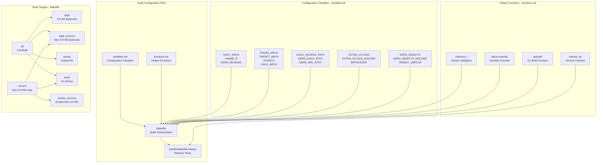
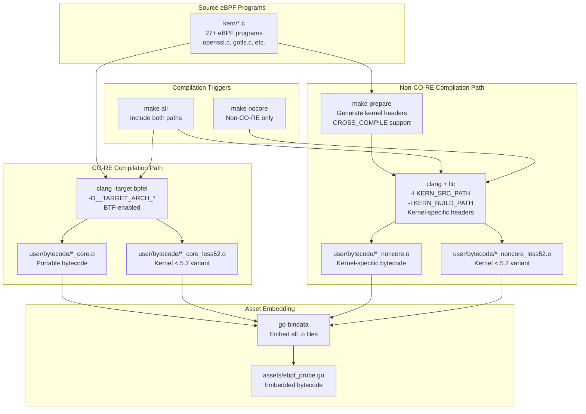
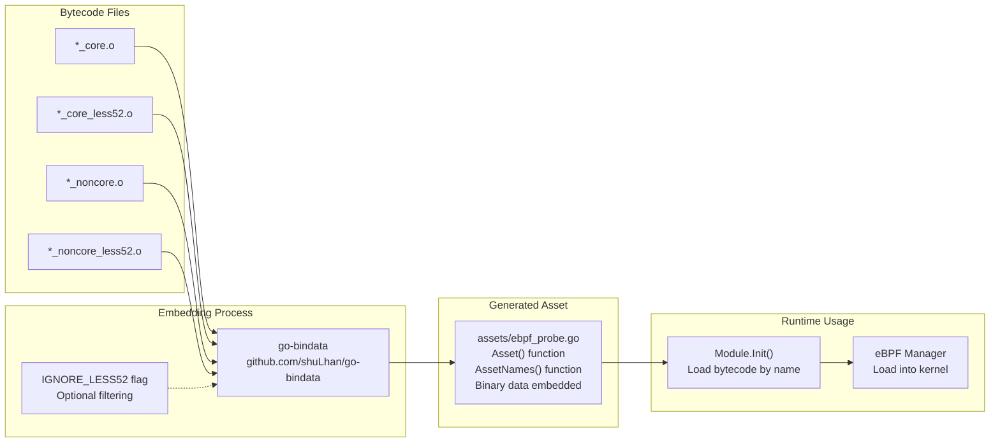
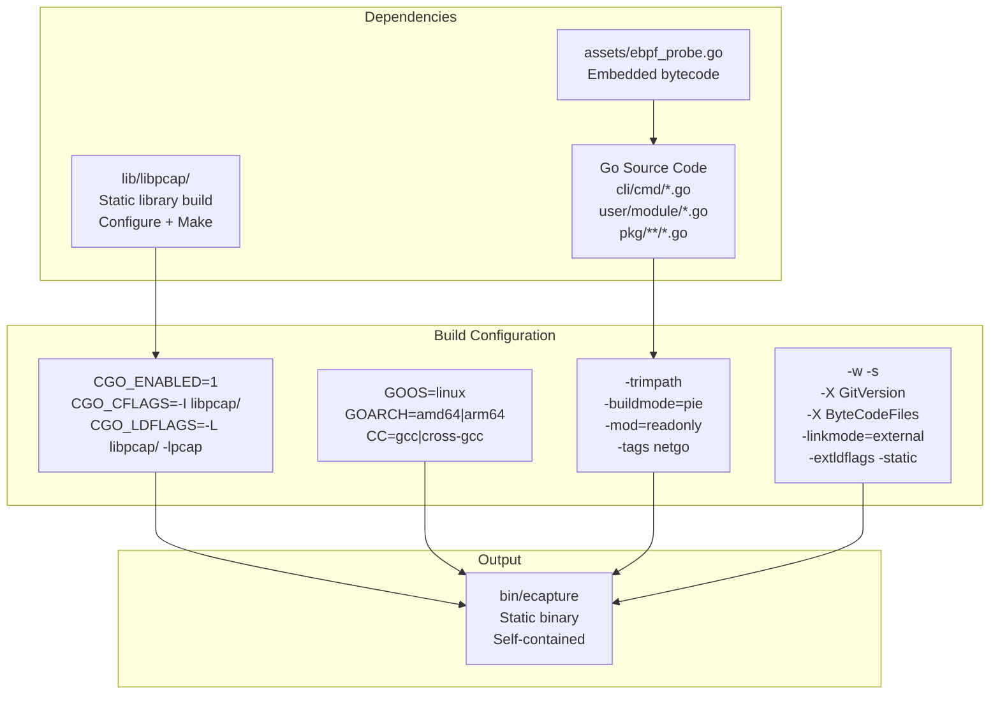
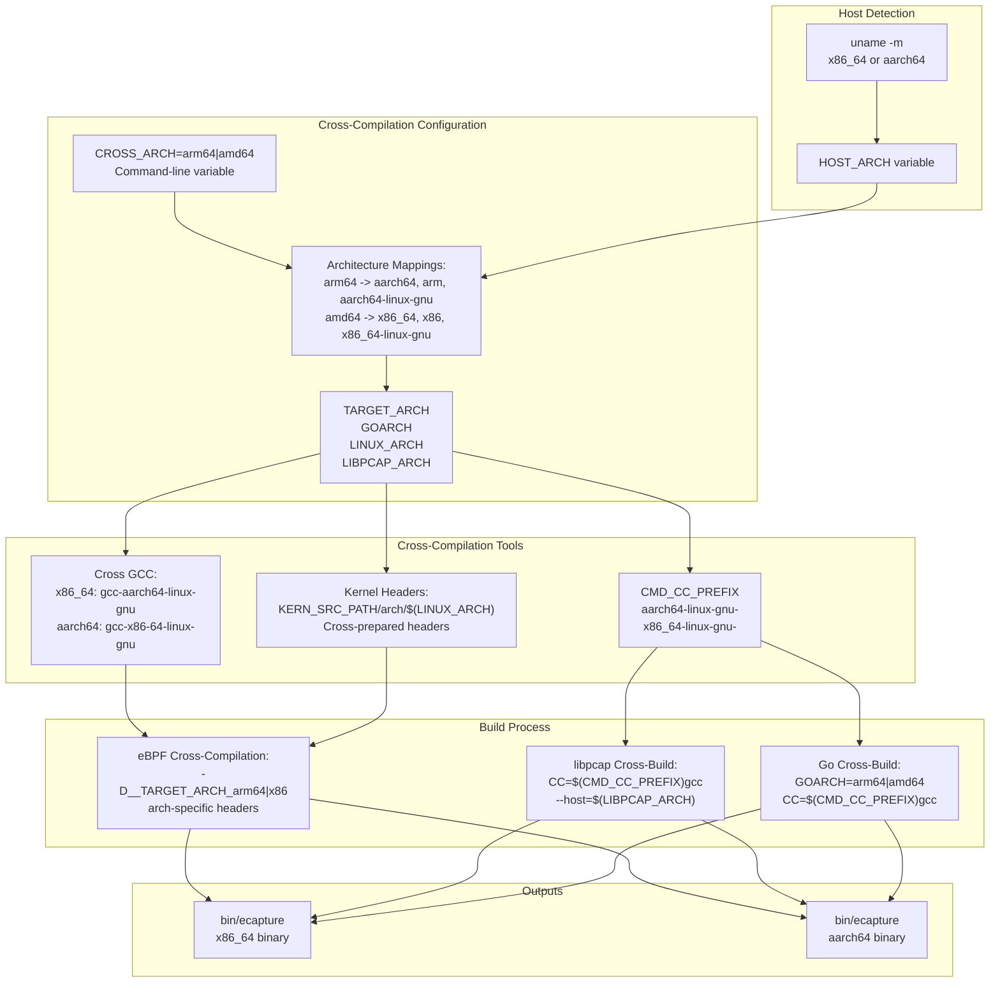
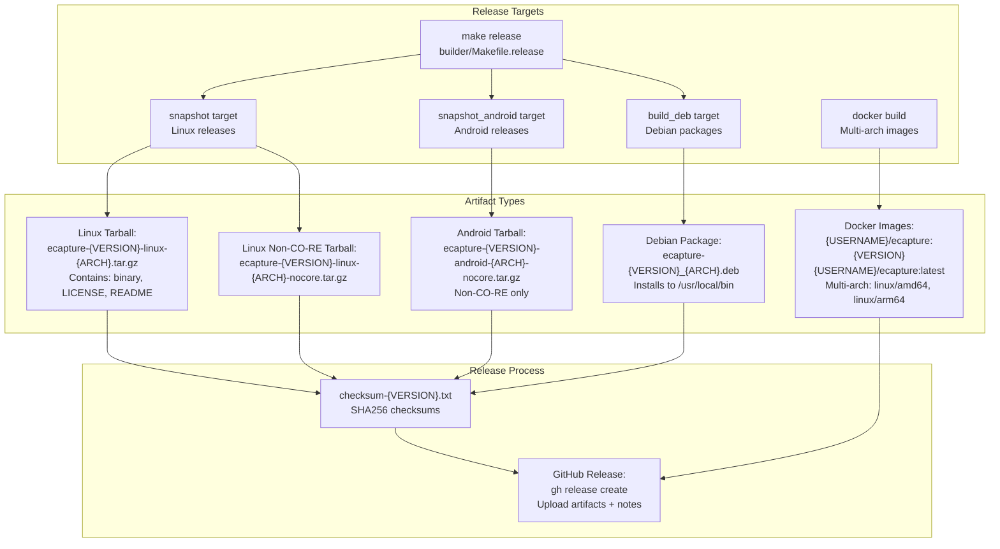
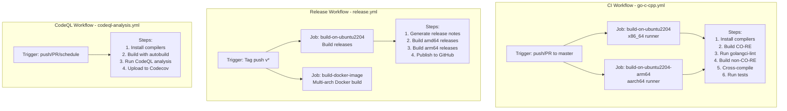

# Build System

<details>
<summary>Relevant source files</summary>

The following files were used as context for generating this wiki page:

- [.github/workflows/codeql-analysis.yml](https://github.com/gojue/ecapture/blob/0766a93b/.github/workflows/codeql-analysis.yml)
- [.github/workflows/go-c-cpp.yml](https://github.com/gojue/ecapture/blob/0766a93b/.github/workflows/go-c-cpp.yml)
- [.github/workflows/release.yml](https://github.com/gojue/ecapture/blob/0766a93b/.github/workflows/release.yml)
- [Makefile](https://github.com/gojue/ecapture/blob/0766a93b/Makefile)
- [builder/Dockerfile](https://github.com/gojue/ecapture/blob/0766a93b/builder/Dockerfile)
- [builder/Makefile.release](https://github.com/gojue/ecapture/blob/0766a93b/builder/Makefile.release)
- [builder/init_env.sh](https://github.com/gojue/ecapture/blob/0766a93b/builder/init_env.sh)
- [functions.mk](https://github.com/gojue/ecapture/blob/0766a93b/functions.mk)
- [go.mod](https://github.com/gojue/ecapture/blob/0766a93b/go.mod)
- [go.sum](https://github.com/gojue/ecapture/blob/0766a93b/go.sum)

</details>


The eCapture build system is a sophisticated Makefile-based build orchestration that implements dual eBPF compilation paths (CO-RE and non-CO-RE), cross-architecture compilation, asset embedding, and multi-format release artifact generation. This page documents the build configuration, compilation pipelines, dependency management, and release processes.

For information about developing new eBPF programs, see [eBPF Program Development](5.2-ebpf-program-development.md). For module development, see [Adding New Modules](5.3-adding-new-modules.md).

## Build Configuration Architecture

The build system is structured across three interconnected Makefiles that manage configuration, orchestration, and release processes.



**Sources:** [Makefile:1-2](https://github.com/gojue/ecapture/blob/0766a93b/Makefile#L1-L2), [functions.mk:1-76](https://github.com/gojue/ecapture/blob/0766a93b/functions.mk#L1-L76), [builder/Makefile.release:1-3](https://github.com/gojue/ecapture/blob/0766a93b/builder/Makefile.release#L1-L3)

### Configuration Variables

The `variables.mk` file (not shown but referenced in [Makefile:1](https://github.com/gojue/ecapture/blob/0766a93b/Makefile#L1)) defines critical build configuration:

| Variable Category | Key Variables | Purpose |
|------------------|---------------|---------|
| **Architecture Detection** | `HOST_ARCH`, `UNAME_R`, `CLANG_VERSION`, `GO_VERSION` | Detect host environment |
| **Cross-Compilation** | `CROSS_ARCH`, `TARGET_ARCH`, `GOARCH`, `LINUX_ARCH`, `LIBPCAP_ARCH` | Target architecture configuration |
| **Kernel Paths** | `LINUX_SOURCE_PATH`, `KERN_BUILD_PATH`, `KERN_SRC_PATH` | Kernel header locations |
| **Build Flags** | `EXTRA_CFLAGS`, `EXTRA_CFLAGS_NOCORE`, `BPFHEADER` | Compiler flags for eBPF |
| **Versioning** | `VERSION_NUM`, `LAST_GIT_TAG`, `BPF_NOCORE_TAG`, `PACKAGE_VERSION` | Version information |
| **Tools** | `CMD_CLANG`, `CMD_LLC`, `CMD_GO`, `CMD_CC_PREFIX` | Command paths |

The build system prints all configuration with `make env` ([Makefile:19-63](https://github.com/gojue/ecapture/blob/0766a93b/Makefile#L19-L63)).

**Sources:** [Makefile:19-63](https://github.com/gojue/ecapture/blob/0766a93b/Makefile#L19-L63), [.github/workflows/go-c-cpp.yml:16-33](https://github.com/gojue/ecapture/blob/0766a93b/.github/workflows/go-c-cpp.yml#L16-L33)

### Helper Functions

The [functions.mk:1-76](https://github.com/gojue/ecapture/blob/0766a93b/functions.mk#L1-L76) file provides reusable build functions:

#### Version Checking Functions

```makefile
.checkver_$(CMD_CLANG)  # Validates clang >= 9
.checkver_$(CMD_GO)      # Validates go >= 1.24
.checkver_$(CMD_BPFTOOL) # Validates bpftool availability
```

These functions ([functions.mk:13-40](https://github.com/gojue/ecapture/blob/0766a93b/functions.mk#L13-L40)) create marker files to avoid repeated checks and fail the build if requirements aren't met.

#### Variable Override Function

The `allow-override` function ([functions.mk:41-45](https://github.com/gojue/ecapture/blob/0766a93b/functions.mk#L41-L45)) enables conditional variable defaults:

```makefile
$(call allow-override,VERSION_FLAG,$(UNAME_R))
```

This pattern allows command-line or environment variables to override defaults.

#### Go Build Function

The `gobuild` function ([functions.mk:47-54](https://github.com/gojue/ecapture/blob/0766a93b/functions.mk#L47-L54)) encapsulates the Go build command with static linking:

- Enables CGO with static libpcap linking
- Sets build mode to PIE (Position Independent Executable)
- Injects version information via `-ldflags`
- Injects bytecode file list via `ByteCodeFiles` variable
- Performs static linking with `-extldflags -static`

#### Release Archive Function

The `release_tar` function ([functions.mk:62-76](https://github.com/gojue/ecapture/blob/0766a93b/functions.mk#L62-L76)) creates release archives:

```makefile
$(call release_tar,linux,)        # Linux release
$(call release_tar,android,nocore) # Android release (non-CO-RE only)
```

**Sources:** [functions.mk:1-76](https://github.com/gojue/ecapture/blob/0766a93b/functions.mk#L1-L76)

## eBPF Compilation Pipeline

The build system implements two parallel eBPF compilation paths: CO-RE (Compile Once - Run Everywhere) for modern kernels with BTF, and non-CO-RE for older kernels requiring specific headers.



**Sources:** [Makefile:117-183](https://github.com/gojue/ecapture/blob/0766a93b/Makefile#L117-L183), [Makefile:186-195](https://github.com/gojue/ecapture/blob/0766a93b/Makefile#L186-L195)

### CO-RE Compilation

CO-RE compilation ([Makefile:117-134](https://github.com/gojue/ecapture/blob/0766a93b/Makefile#L117-L134)) generates portable eBPF bytecode using BTF (BPF Type Format):

**Compilation Command:**
```makefile
$(CMD_CLANG) -D__TARGET_ARCH_$(LINUX_ARCH) \
    $(EXTRA_CFLAGS) \
    $(BPFHEADER) \
    -target bpfel -c $< -o $(OUTPUT) \
    -fno-ident -fdebug-compilation-dir . -g \
    -D__BPF_TARGET_MISSING="..." \
    -MD -MP
```

**Key aspects:**

1. **Target Architecture:** `-D__TARGET_ARCH_x86` or `-D__TARGET_ARCH_arm64` ([Makefile:122](https://github.com/gojue/ecapture/blob/0766a93b/Makefile#L122))
2. **BTF-enabled:** Uses `-target bpfel` for BPF ELF format with CO-RE relocations
3. **Debug Info:** Includes `-g` for BTF generation and `-gdwarf-4` (via `EXTRA_CFLAGS`)
4. **Dependency Tracking:** `-MD -MP` generates `.d` files for incremental builds

**Outputs:**
- `user/bytecode/*_core.o` - Standard CO-RE bytecode
- `user/bytecode/*_core_less52.o` - Variant for kernels < 5.2 with `-DKERNEL_LESS_5_2` ([Makefile:131](https://github.com/gojue/ecapture/blob/0766a93b/Makefile#L131))

The kernel < 5.2 variant is necessary because early kernels lack certain eBPF features (e.g., bounded loops, specific helper functions).

**Sources:** [Makefile:117-134](https://github.com/gojue/ecapture/blob/0766a93b/Makefile#L117-L134), [.github/workflows/go-c-cpp.yml:38-42](https://github.com/gojue/ecapture/blob/0766a93b/.github/workflows/go-c-cpp.yml#L38-L42)

### Non-CO-RE Compilation

Non-CO-RE compilation ([Makefile:146-183](https://github.com/gojue/ecapture/blob/0766a93b/Makefile#L146-L183)) generates kernel-specific bytecode using explicit header includes:

**Preparation Step:**
```makefile
make prepare  # Generates kernel headers if needed
```

This step ([Makefile:98-104](https://github.com/gojue/ecapture/blob/0766a93b/Makefile#L98-L104)) invokes kernel header generation for cross-compilation scenarios:
```bash
cd $(LINUX_SOURCE_PATH) && $(KERNEL_HEADER_GEN)
```

**Compilation Command:**
```makefile
$(CMD_CLANG) \
    $(EXTRA_CFLAGS_NOCORE) \
    $(BPFHEADER) \
    -I $(KERN_SRC_PATH)/arch/$(LINUX_ARCH)/include \
    -I $(KERN_BUILD_PATH)/arch/$(LINUX_ARCH)/include/generated \
    -I $(KERN_SRC_PATH)/include \
    [... 8 include paths total ...] \
    -c $< -o - | $(CMD_LLC) \
    -march=bpf -filetype=obj -o $(OUTPUT)
```

**Key aspects:**

1. **Kernel Headers:** Uses 8 include paths for kernel headers ([Makefile:154-161](https://github.com/gojue/ecapture/blob/0766a93b/Makefile#L154-L161))
2. **Two-Stage Compilation:** 
   - Stage 1: `clang` compiles to LLVM bitcode (`-o -`)
   - Stage 2: `llc` converts to BPF object file
3. **Architecture-Specific:** Includes `arch/$(LINUX_ARCH)/include` headers
4. **Cross-Compilation:** Supports `CROSS_COMPILE` prefix for cross-arch builds

**Outputs:**
- `user/bytecode/*_noncore.o` - Kernel-specific bytecode
- `user/bytecode/*_noncore_less52.o` - Kernel < 5.2 variant ([Makefile:178](https://github.com/gojue/ecapture/blob/0766a93b/Makefile#L178))

**Sources:** [Makefile:98-104](https://github.com/gojue/ecapture/blob/0766a93b/Makefile#L98-L104), [Makefile:146-183](https://github.com/gojue/ecapture/blob/0766a93b/Makefile#L146-L183)

### Kernel < 5.2 Support

Both compilation paths generate variants for kernels < 5.2 using the `-DKERNEL_LESS_5_2` preprocessor flag. This enables conditional compilation in the C code:

```c
#ifdef KERNEL_LESS_5_2
    // Use older eBPF features
#else
    // Use modern eBPF features
#endif
```

These variants have a `_less52` suffix in their filenames ([Makefile:132](https://github.com/gojue/ecapture/blob/0766a93b/Makefile#L132), [Makefile:183](https://github.com/gojue/ecapture/blob/0766a93b/Makefile#L183)).

**Sources:** [Makefile:131-134](https://github.com/gojue/ecapture/blob/0766a93b/Makefile#L131-L134), [Makefile:178-183](https://github.com/gojue/ecapture/blob/0766a93b/Makefile#L178-L183)

## Asset Embedding System

After eBPF compilation, all bytecode files are embedded into the Go binary using `go-bindata`.



**Sources:** [Makefile:186-195](https://github.com/gojue/ecapture/blob/0766a93b/Makefile#L186-L195)

### Asset Generation

The `assets` target ([Makefile:186-188](https://github.com/gojue/ecapture/blob/0766a93b/Makefile#L186-L188)) embeds all bytecode:

```makefile
.PHONY: assets
assets: .checkver_$(CMD_GO) ebpf ebpf_noncore
	$(CMD_GO) run github.com/shuLhan/go-bindata/cmd/go-bindata \
	    $(IGNORE_LESS52) -pkg assets -o "assets/ebpf_probe.go" \
	    $(wildcard ./user/bytecode/*.o)
```

The `assets_noncore` target ([Makefile:191-195](https://github.com/gojue/ecapture/blob/0766a93b/Makefile#L191-L195)) embeds only non-CO-RE bytecode for specialized builds (e.g., Android).

**Key aspects:**

1. **Package Name:** Generated in `assets` package
2. **Output File:** `assets/ebpf_probe.go`
3. **Input Files:** All `.o` files in `user/bytecode/`
4. **Optional Filtering:** `IGNORE_LESS52` can exclude kernel < 5.2 variants

### Generated Asset Interface

The `go-bindata` tool generates Go code with functions:

```go
// Asset loads and returns the asset for the given name
func Asset(name string) ([]byte, error)

// AssetNames returns the names of all embedded assets
func AssetNames() []string

// AssetInfo returns metadata about an asset
func AssetInfo(name string) (os.FileInfo, error)
```

At runtime, modules load their bytecode by filename:

```go
bytecode, err := assets.Asset("user/bytecode/openssl_kern_core.o")
```

The build system injects the list of available bytecode files into the binary via the `ByteCodeFiles` build variable ([functions.mk:52](https://github.com/gojue/ecapture/blob/0766a93b/functions.mk#L52)):

```makefile
-X 'github.com/gojue/ecapture/cli/cmd.ByteCodeFiles=$(BYTECODE_FILES)'
```

This allows runtime selection between CO-RE and non-CO-RE bytecode.

**Sources:** [Makefile:186-195](https://github.com/gojue/ecapture/blob/0766a93b/Makefile#L186-L195), [go.mod:12](https://github.com/gojue/ecapture/blob/0766a93b/go.mod#L12), [functions.mk:52](https://github.com/gojue/ecapture/blob/0766a93b/functions.mk#L52)

## Go Binary Compilation

The Go binary compilation integrates static linking with embedded assets.



**Sources:** [Makefile:199-208](https://github.com/gojue/ecapture/blob/0766a93b/Makefile#L199-L208), [Makefile:211-225](https://github.com/gojue/ecapture/blob/0766a93b/Makefile#L211-L225), [functions.mk:47-54](https://github.com/gojue/ecapture/blob/0766a93b/functions.mk#L47-L54)

### libpcap Static Build

Before Go compilation, the build system compiles a static `libpcap` library ([Makefile:199-208](https://github.com/gojue/ecapture/blob/0766a93b/Makefile#L199-L208)):

```makefile
$(TARGET_LIBPCAP):
	test -f ./lib/libpcap/configure || git submodule update --init
	cd lib/libpcap && \
	    CC=$(CMD_CC_PREFIX)$(CMD_CC) AR=$(CMD_AR_PREFIX)$(CMD_AR) \
	    CFLAGS="-O2 -g -gdwarf-4 -static -Wno-unused-result" \
	    ./configure --disable-rdma --disable-shared --disable-usb \
	        --disable-netmap --disable-bluetooth --disable-dbus \
	        --without-libnl --without-dpdk --without-dag \
	        --without-septel --without-snf --without-gcc \
	        --with-pcap=linux --without-turbocap \
	        --host=$(LIBPCAP_ARCH) && \
	    CC=$(CMD_CC_PREFIX)$(CMD_CC) AR=$(CMD_AR_PREFIX)$(CMD_AR) make
```

**Configuration highlights:**

- **Static build:** `--disable-shared` and `-static` in CFLAGS
- **Minimal features:** Disables RDMA, USB, Bluetooth, DBus
- **Linux-only:** `--with-pcap=linux`
- **Cross-compilation:** Uses `$(CMD_CC_PREFIX)` and `--host=$(LIBPCAP_ARCH)`
- **Debug info:** `-g -gdwarf-4` for debugging

The static `libpcap.a` is linked into the final binary.

**Sources:** [Makefile:199-208](https://github.com/gojue/ecapture/blob/0766a93b/Makefile#L199-L208)

### Go Build Command

The `gobuild` function ([functions.mk:47-54](https://github.com/gojue/ecapture/blob/0766a93b/functions.mk#L47-L54)) performs the Go compilation:

```makefile
CGO_ENABLED=1 \
CGO_CFLAGS='-O2 -g -gdwarf-4 -I$(CURDIR)/lib/libpcap/' \
CGO_LDFLAGS='-O2 -g -L$(CURDIR)/lib/libpcap/ -lpcap -static' \
GOOS=linux GOARCH=$(GOARCH) CC=$(CMD_CC_PREFIX)$(CMD_CC) \
$(CMD_GO) build -trimpath -buildmode=pie -mod=readonly \
    -tags '$(TARGET_TAG),netgo' \
    -ldflags "-w -s \
        -X 'github.com/gojue/ecapture/cli/cmd.GitVersion=$(TARGET_TAG)_$(GOARCH):$(VERSION_NUM):$(VERSION_FLAG)' \
        -X 'github.com/gojue/ecapture/cli/cmd.ByteCodeFiles=$(BYTECODE_FILES)' \
        -linkmode=external -extldflags -static" \
    -o $(OUT_BIN)
```

**Build flags explained:**

| Flag | Purpose |
|------|---------|
| `CGO_ENABLED=1` | Enable CGO for libpcap integration |
| `CGO_CFLAGS` | Include libpcap headers |
| `CGO_LDFLAGS` | Link static libpcap |
| `-trimpath` | Remove build paths for reproducibility |
| `-buildmode=pie` | Position Independent Executable |
| `-mod=readonly` | Fail if `go.mod` needs updates |
| `-tags netgo` | Use pure Go network stack (backup) |
| `-w -s` | Strip debugging symbols |
| `-X` | Inject version and bytecode list |
| `-linkmode=external` | Use external C linker |
| `-extldflags -static` | Fully static binary |

**Version injection:**

The build injects two key variables:
1. `GitVersion` - Format: `{TAG}_{ARCH}:{VERSION_NUM}:{VERSION_FLAG}`
2. `ByteCodeFiles` - List of bytecode types (e.g., "core", "noncore")

These are accessible at runtime via `cli/cmd` package variables.

**Sources:** [functions.mk:47-54](https://github.com/gojue/ecapture/blob/0766a93b/functions.mk#L47-L54)

### Build Targets

| Target | eBPF Bytecode | Assets | Description |
|--------|---------------|--------|-------------|
| `make all` | CO-RE + non-CO-RE | All | Full build with both bytecode types |
| `make nocore` | non-CO-RE only | Non-CO-RE | Kernel-specific build |
| `make build` | (uses existing) | All | Go binary only |
| `make build_noncore` | (uses existing) | Non-CO-RE | Non-CO-RE Go binary |

The `all` target ([Makefile:6](https://github.com/gojue/ecapture/blob/0766a93b/Makefile#L6)) is the default and produces a binary containing both CO-RE and non-CO-RE bytecode, allowing runtime selection.

The `nocore` target ([Makefile:10](https://github.com/gojue/ecapture/blob/0766a93b/Makefile#L10)) produces a smaller binary with only kernel-specific bytecode, useful for resource-constrained environments or Android.

**Sources:** [Makefile:4-14](https://github.com/gojue/ecapture/blob/0766a93b/Makefile#L4-L14), [Makefile:211-225](https://github.com/gojue/ecapture/blob/0766a93b/Makefile#L211-L225)

## Cross-Compilation Architecture

eCapture supports bidirectional cross-compilation between x86_64 and aarch64 architectures.



**Sources:** [.github/workflows/go-c-cpp.yml:56-65](https://github.com/gojue/ecapture/blob/0766a93b/.github/workflows/go-c-cpp.yml#L56-L65), [.github/workflows/release.yml:93-97](https://github.com/gojue/ecapture/blob/0766a93b/.github/workflows/release.yml#L93-L97), [builder/init_env.sh:43-61](https://github.com/gojue/ecapture/blob/0766a93b/builder/init_env.sh#L43-L61)

### Cross-Compilation Variables

Cross-compilation is triggered by setting `CROSS_ARCH`:

```bash
CROSS_ARCH=arm64 make    # Build arm64 on x86_64 host
CROSS_ARCH=amd64 make    # Build amd64 on aarch64 host
```

The build system maps `CROSS_ARCH` to multiple architecture-specific variables:

| Variable | arm64 Value | amd64 Value | Purpose |
|----------|-------------|-------------|---------|
| `GOARCH` | `arm64` | `amd64` | Go architecture target |
| `LINUX_ARCH` | `arm64` | `x86` | Linux kernel architecture name |
| `TARGET_ARCH` | `aarch64` | `x86_64` | GCC target architecture |
| `LIBPCAP_ARCH` | `aarch64-linux-gnu` | `x86_64-linux-gnu` | libpcap configure host |
| `CMD_CC_PREFIX` | `aarch64-linux-gnu-` | `x86_64-linux-gnu-` | Cross-compiler prefix |

These mappings are defined in `variables.mk` (referenced but not shown).

**Sources:** [builder/init_env.sh:43-61](https://github.com/gojue/ecapture/blob/0766a93b/builder/init_env.sh#L43-L61)

### Cross-Compilation Toolchain Setup

The CI workflows ([.github/workflows/go-c-cpp.yml:16-33](https://github.com/gojue/ecapture/blob/0766a93b/.github/workflows/go-c-cpp.yml#L16-L33)) and initialization script ([builder/init_env.sh:1-106](https://github.com/gojue/ecapture/blob/0766a93b/builder/init_env.sh#L1-L106)) install cross-compilation toolchains:

**On x86_64 host (targeting arm64):**
```bash
sudo apt-get install gcc-aarch64-linux-gnu linux-source
cd /usr/src/linux-source-*
sudo make ARCH=arm64 CROSS_COMPILE=aarch64-linux-gnu- prepare
```

**On aarch64 host (targeting x86_64):**
```bash
sudo apt-get install gcc-x86-64-linux-gnu linux-source
cd /usr/src/linux-source-*
sudo make ARCH=x86 CROSS_COMPILE=x86_64-linux-gnu- prepare
```

The `make prepare` command generates architecture-specific kernel headers required for non-CO-RE eBPF compilation.

**Sources:** [.github/workflows/go-c-cpp.yml:16-33](https://github.com/gojue/ecapture/blob/0766a93b/.github/workflows/go-c-cpp.yml#L16-L33), [.github/workflows/go-c-cpp.yml:76-93](https://github.com/gojue/ecapture/blob/0766a93b/.github/workflows/go-c-cpp.yml#L76-L93), [builder/init_env.sh:72-89](https://github.com/gojue/ecapture/blob/0766a93b/builder/init_env.sh#L72-L89)

### Cross-Compilation in Action

#### eBPF Cross-Compilation

CO-RE eBPF bytecode is architecture-aware via the `-D__TARGET_ARCH_$(LINUX_ARCH)` flag ([Makefile:122](https://github.com/gojue/ecapture/blob/0766a93b/Makefile#L122)), which resolves to:
- `-D__TARGET_ARCH_x86` for x86_64
- `-D__TARGET_ARCH_arm64` for aarch64

Non-CO-RE compilation uses cross-prepared kernel headers from the target architecture ([Makefile:154-161](https://github.com/gojue/ecapture/blob/0766a93b/Makefile#L154-L161)).

#### libpcap Cross-Build

The libpcap configure step ([Makefile:203-207](https://github.com/gojue/ecapture/blob/0766a93b/Makefile#L203-L207)) uses:
```makefile
CC=$(CMD_CC_PREFIX)$(CMD_CC) --host=$(LIBPCAP_ARCH)
```

Where:
- `CMD_CC_PREFIX` is `aarch64-linux-gnu-` or `x86_64-linux-gnu-`
- `LIBPCAP_ARCH` is `aarch64-linux-gnu` or `x86_64-linux-gnu`

#### Go Cross-Build

The Go build ([functions.mk:51](https://github.com/gojue/ecapture/blob/0766a93b/functions.mk#L51)) sets:
```makefile
GOARCH=$(GOARCH) CC=$(CMD_CC_PREFIX)$(CMD_CC)
```

This tells Go to use the cross-compiler for CGO compilation and to target the specified architecture.

**Sources:** [Makefile:122](https://github.com/gojue/ecapture/blob/0766a93b/Makefile#L122), [Makefile:154-161](https://github.com/gojue/ecapture/blob/0766a93b/Makefile#L154-L161), [Makefile:203-207](https://github.com/gojue/ecapture/blob/0766a93b/Makefile#L203-L207), [functions.mk:51](https://github.com/gojue/ecapture/blob/0766a93b/functions.mk#L51)

### CI/CD Cross-Compilation Workflow

The GitHub Actions workflow demonstrates the cross-compilation process:

```yaml
- name: Build CO-RE (Cross-Compilation)
  run: |
    make clean
    CROSS_ARCH=arm64 make env
    CROSS_ARCH=arm64 make -j8

- name: Build non-CO-RE (Cross-Compilation/Android)
  run: |
    make clean
    CROSS_ARCH=arm64 make env
    ANDROID=1 CROSS_ARCH=arm64 make nocore -j8
```

This workflow ([.github/workflows/go-c-cpp.yml:56-65](https://github.com/gojue/ecapture/blob/0766a93b/.github/workflows/go-c-cpp.yml#L56-L65)) validates that:
1. CO-RE cross-compilation works
2. Non-CO-RE cross-compilation works
3. Android-specific builds work (non-CO-RE only)

The workflow runs on both x86_64 ([.github/workflows/go-c-cpp.yml:9-11](https://github.com/gojue/ecapture/blob/0766a93b/.github/workflows/go-c-cpp.yml#L9-L11)) and aarch64 ([.github/workflows/go-c-cpp.yml:69-71](https://github.com/gojue/ecapture/blob/0766a93b/.github/workflows/go-c-cpp.yml#L69-L71)) runners.

**Sources:** [.github/workflows/go-c-cpp.yml:56-65](https://github.com/gojue/ecapture/blob/0766a93b/.github/workflows/go-c-cpp.yml#L56-L65), [.github/workflows/go-c-cpp.yml:116-125](https://github.com/gojue/ecapture/blob/0766a93b/.github/workflows/go-c-cpp.yml#L116-L125)

## Release Artifact Generation

The build system produces multiple release artifact formats: tarballs, Debian packages, Docker images, and Android-specific builds.



**Sources:** [builder/Makefile.release:1-151](https://github.com/gojue/ecapture/blob/0766a93b/builder/Makefile.release#L1-L151), [.github/workflows/release.yml:1-129](https://github.com/gojue/ecapture/blob/0766a93b/.github/workflows/release.yml#L1-L129)

### Release Tarball Generation

The `release_tar` function ([functions.mk:62-76](https://github.com/gojue/ecapture/blob/0766a93b/functions.mk#L62-L76)) creates release archives:

```makefile
$(call release_tar,linux,)          # Full build (CO-RE + non-CO-RE)
$(call release_tar,linux,nocore)    # Non-CO-RE only
$(call release_tar,android,nocore)  # Android (non-CO-RE only)
```

**Tarball contents:**
1. `ecapture` binary
2. `LICENSE` file
3. `CHANGELOG.md`
4. `README.md` and `README_CN.md`

**Naming convention:**
```
ecapture-{VERSION}-{PLATFORM}-{ARCH}{CORE_SUFFIX}.tar.gz
```

Where:
- `VERSION` is from `SNAPSHOT_VERSION` or git tag
- `PLATFORM` is `linux` or `android`
- `ARCH` is `amd64` or `arm64`
- `CORE_SUFFIX` is empty or `-nocore`

Examples:
- `ecapture-v0.8.0-linux-amd64.tar.gz` (full build)
- `ecapture-v0.8.0-linux-arm64-nocore.tar.gz` (non-CO-RE)
- `ecapture-v0.8.0-android-arm64-nocore.tar.gz` (Android)

**Sources:** [functions.mk:62-76](https://github.com/gojue/ecapture/blob/0766a93b/functions.mk#L62-L76), [builder/Makefile.release:94-112](https://github.com/gojue/ecapture/blob/0766a93b/builder/Makefile.release#L94-L112)

### Debian Package Generation

The `build_deb` target ([builder/Makefile.release:135-151](https://github.com/gojue/ecapture/blob/0766a93b/builder/Makefile.release#L135-L151)) creates `.deb` packages:

**Package structure:**
```
BUILD_DIR/
├── DEBIAN/
│   └── control         # Package metadata
└── usr/local/bin/
    └── ecapture        # Binary
```

**Control file fields:**
- `Package`: `ecapture`
- `Version`: From `PACKAGE_VERSION`
- `Architecture`: `amd64` or `arm64`
- `Maintainer`: Package maintainer
- `Description`: Short description
- `Homepage`: Project URL

**Output filename:**
```
ecapture-{VERSION}_{ARCH}.deb
```

Example: `ecapture-0.8.0_amd64.deb`

The package installs the binary to `/usr/local/bin/ecapture`, making it globally accessible after installation with `dpkg -i`.

**Sources:** [builder/Makefile.release:135-151](https://github.com/gojue/ecapture/blob/0766a93b/builder/Makefile.release#L135-L151)

### Docker Multi-Architecture Images

The Docker build ([builder/Dockerfile:1-39](https://github.com/gojue/ecapture/blob/0766a93b/builder/Dockerfile#L1-L39)) creates multi-architecture images using BuildKit:

**Build process:**

1. **Base image:** `ubuntu:22.04` with build dependencies
2. **Compiler installation:** clang-14, llvm-14, gcc
3. **Go installation:** Version-specific Go binary for target architecture
4. **eCapture build:** Full `make all` with embedded bytecode
5. **Final image:** Minimal `alpine:latest` with only the binary

**Multi-arch workflow** ([.github/workflows/release.yml:101-129](https://github.com/gojue/ecapture/blob/0766a93b/.github/workflows/release.yml#L101-L129)):

```yaml
- name: Build and push
  uses: docker/build-push-action@v5
  with:
    platforms: linux/amd64,linux/arm64
    push: true
    tags: |
      {USERNAME}/ecapture:{VERSION}
      {USERNAME}/ecapture:latest
```

**Key features:**

- **Build cache:** Uses registry cache for faster builds
- **Version injection:** `--build-args VERSION={VERSION}`
- **Entrypoint:** `/ecapture` for direct execution
- **Multi-platform:** Builds both amd64 and arm64 simultaneously

Usage:
```bash
docker run --rm -it --privileged {USERNAME}/ecapture:latest tls
```

**Sources:** [builder/Dockerfile:1-39](https://github.com/gojue/ecapture/blob/0766a93b/builder/Dockerfile#L1-L39), [.github/workflows/release.yml:101-129](https://github.com/gojue/ecapture/blob/0766a93b/.github/workflows/release.yml#L101-L129)

### Release Publishing Workflow

The `publish` target ([builder/Makefile.release:114-124](https://github.com/gojue/ecapture/blob/0766a93b/builder/Makefile.release#L114-L124)) publishes artifacts to GitHub:

```makefile
publish:
	cd $(OUTPUT_DIR)
	$(CMD_CHECKSUM) ecapture*v* | $(CMD_SED) 's/.\/bin\///g' > checksum-{VERSION}.txt
	FILES=$$(ls ecapture-*.tar.gz ecapture*.deb checksum-*.txt)
	$(CMD_GITHUB) release create $(DEB_VERSION) $$FILES \
	    --title "eCapture $(DEB_VERSION)" \
	    --notes-file $(RELEASE_NOTES)
```

**Process:**

1. Generate SHA256 checksums for all artifacts
2. Collect tarballs, `.deb` files, and checksum file
3. Create GitHub release with tag
4. Upload all files
5. Include release notes from `bin/release_notes.txt`

**Release notes generation** ([.github/workflows/release.yml:68-80](https://github.com/gojue/ecapture/blob/0766a93b/.github/workflows/release.yml#L68-L80)) uses GitHub API:

```bash
gh api /repos/{repo}/releases/generate-notes \
    -f tag_name={VERSION} \
    -f previous_tag_name={PREVIOUS_TAG}
```

This auto-generates release notes from commit messages and PRs.

**Sources:** [builder/Makefile.release:114-124](https://github.com/gojue/ecapture/blob/0766a93b/builder/Makefile.release#L114-L124), [.github/workflows/release.yml:63-87](https://github.com/gojue/ecapture/blob/0766a93b/.github/workflows/release.yml#L63-L87)

### Android-Specific Builds

Android builds use non-CO-RE compilation exclusively ([.github/workflows/go-c-cpp.yml:61-65](https://github.com/gojue/ecapture/blob/0766a93b/.github/workflows/go-c-cpp.yml#L61-L65)):

```bash
ANDROID=1 CROSS_ARCH=arm64 make nocore
```

**Rationale:**

1. Android kernels often lack BTF support
2. Android uses custom kernel versions
3. Non-CO-RE ensures compatibility with Android's kernel
4. Smaller binary (no CO-RE bytecode overhead)

The `ANDROID` flag may trigger Android-specific preprocessor directives or configurations in `variables.mk`.

Android releases are tagged with `android` platform name:
```
ecapture-v0.8.0-android-arm64-nocore.tar.gz
```

**Sources:** [.github/workflows/go-c-cpp.yml:61-65](https://github.com/gojue/ecapture/blob/0766a93b/.github/workflows/go-c-cpp.yml#L61-L65), [builder/Makefile.release:104-112](https://github.com/gojue/ecapture/blob/0766a93b/builder/Makefile.release#L104-L112)

## CI/CD Integration

The GitHub Actions workflows automate building, testing, and releasing.



**Sources:** [.github/workflows/go-c-cpp.yml:1-128](https://github.com/gojue/ecapture/blob/0766a93b/.github/workflows/go-c-cpp.yml#L1-L128), [.github/workflows/release.yml:1-129](https://github.com/gojue/ecapture/blob/0766a93b/.github/workflows/release.yml#L1-L129), [.github/workflows/codeql-analysis.yml:1-92](https://github.com/gojue/ecapture/blob/0766a93b/.github/workflows/codeql-analysis.yml#L1-L92)

### CI Workflow (go-c-cpp.yml)

This workflow ([.github/workflows/go-c-cpp.yml:1-128](https://github.com/gojue/ecapture/blob/0766a93b/.github/workflows/go-c-cpp.yml#L1-L128)) runs on every push and PR:

**Build matrix:**
- **x86_64 job:** Ubuntu 22.04 on x86_64 runner ([.github/workflows/go-c-cpp.yml:9-67](https://github.com/gojue/ecapture/blob/0766a93b/.github/workflows/go-c-cpp.yml#L9-L67))
- **aarch64 job:** Ubuntu 22.04 on ARM64 runner ([.github/workflows/go-c-cpp.yml:69-127](https://github.com/gojue/ecapture/blob/0766a93b/.github/workflows/go-c-cpp.yml#L69-L127))

**Build sequence:**

1. **Install dependencies** ([.github/workflows/go-c-cpp.yml:16-33](https://github.com/gojue/ecapture/blob/0766a93b/.github/workflows/go-c-cpp.yml#L16-L33)):
   - Go 1.24.6
   - clang-14, llvm-14, gcc
   - Cross-compilation toolchains
   - Linux kernel source

2. **Native CO-RE build** ([.github/workflows/go-c-cpp.yml:38-44](https://github.com/gojue/ecapture/blob/0766a93b/.github/workflows/go-c-cpp.yml#L38-L44)):
   ```bash
   make clean
   make env
   DEBUG=1 make -j8
   ```

3. **Linting** ([.github/workflows/go-c-cpp.yml:45-50](https://github.com/gojue/ecapture/blob/0766a93b/.github/workflows/go-c-cpp.yml#L45-L50)):
   ```bash
   golangci-lint run
   ```

4. **Native non-CO-RE build** ([.github/workflows/go-c-cpp.yml:51-55](https://github.com/gojue/ecapture/blob/0766a93b/.github/workflows/go-c-cpp.yml#L51-L55)):
   ```bash
   make nocore
   ```

5. **Cross-compilation CO-RE** ([.github/workflows/go-c-cpp.yml:56-60](https://github.com/gojue/ecapture/blob/0766a93b/.github/workflows/go-c-cpp.yml#L56-L60)):
   ```bash
   CROSS_ARCH=arm64 make  # On x86_64
   CROSS_ARCH=amd64 make  # On ARM64
   ```

6. **Cross-compilation Android** ([.github/workflows/go-c-cpp.yml:61-65](https://github.com/gojue/ecapture/blob/0766a93b/.github/workflows/go-c-cpp.yml#L61-L65)):
   ```bash
   ANDROID=1 CROSS_ARCH=arm64 make nocore
   ```

7. **Run tests** ([.github/workflows/go-c-cpp.yml:66-67](https://github.com/gojue/ecapture/blob/0766a93b/.github/workflows/go-c-cpp.yml#L66-L67)):
   ```bash
   go test -v -race ./...
   ```

This comprehensive CI ensures all build configurations work correctly.

**Sources:** [.github/workflows/go-c-cpp.yml:1-128](https://github.com/gojue/ecapture/blob/0766a93b/.github/workflows/go-c-cpp.yml#L1-L128)

### Release Workflow (release.yml)

This workflow ([.github/workflows/release.yml:1-129](https://github.com/gojue/ecapture/blob/0766a93b/.github/workflows/release.yml#L1-L129)) triggers on version tags (`v*`):

**Jobs:**

1. **Build and release** ([.github/workflows/release.yml:13-100](https://github.com/gojue/ecapture/blob/0766a93b/.github/workflows/release.yml#L13-L100)):
   - Generate release notes from commits
   - Build amd64 native releases
   - Build arm64 cross-compiled releases
   - Create GitHub release
   - Upload all artifacts

2. **Docker multi-arch build** ([.github/workflows/release.yml:101-129](https://github.com/gojue/ecapture/blob/0766a93b/.github/workflows/release.yml#L101-L129)):
   - Build for `linux/amd64` and `linux/arm64`
   - Push to Docker Hub
   - Tag with version and `latest`

**Release artifacts generated:**

For **amd64** (native build on x86_64):
- `ecapture-{VERSION}-linux-amd64.tar.gz`
- `ecapture-{VERSION}-linux-amd64.deb`

For **arm64** (cross-compiled on x86_64):
- `ecapture-{VERSION}-linux-arm64.tar.gz`
- `ecapture-{VERSION}-android-arm64-nocore.tar.gz`
- `ecapture-{VERSION}-linux-arm64.deb`

Plus:
- `checksum-{VERSION}.txt` with SHA256 hashes
- `release_notes.txt` with generated release notes

**Sources:** [.github/workflows/release.yml:1-129](https://github.com/gojue/ecapture/blob/0766a93b/.github/workflows/release.yml#L1-L129)

### CodeQL Analysis Workflow

The CodeQL workflow ([.github/workflows/codeql-analysis.yml:1-92](https://github.com/gojue/ecapture/blob/0766a93b/.github/workflows/codeql-analysis.yml#L1-L92)) performs security scanning:

**Triggers:**
- Push to master
- Pull requests
- Weekly schedule (Wednesday 15:42)

**Language matrix:**
- C/C++ analysis for eBPF code
- Go analysis for application code

**Process:**
1. Install build dependencies
2. Run autobuild (attempts automatic build detection)
3. If autobuild fails, run `make nocore` explicitly
4. Perform CodeQL analysis
5. Upload results to GitHub Security tab
6. Upload coverage to Codecov

This ensures continuous security monitoring of the codebase.

**Sources:** [.github/workflows/codeql-analysis.yml:1-92](https://github.com/gojue/ecapture/blob/0766a93b/.github/workflows/codeql-analysis.yml#L1-L92)

## Development Environment Setup

The `builder/init_env.sh` script ([builder/init_env.sh:1-106](https://github.com/gojue/ecapture/blob/0766a93b/builder/init_env.sh#L1-L106)) automates development environment setup on Ubuntu:

**Features:**

1. **Distribution detection:** Selects appropriate clang version based on Ubuntu release
2. **Architecture detection:** Configures cross-compilation toolchain
3. **Dependency installation:** Installs all required build tools
4. **Kernel header preparation:** Prepares headers for both native and cross-compilation
5. **Go installation:** Downloads and installs Go 1.24.6
6. **Repository cloning:** Clones eCapture source

**Usage:**
```bash
/bin/bash -c "$(curl -fsSL https://raw.githubusercontent.com/gojue/ecapture/master/builder/init_env.sh)"
```

**Supported Ubuntu versions:**
- 20.04 (clang-10)
- 20.10, 21.04, 21.10, 22.04, 22.10 (clang-11/12)
- 23.04, 23.10 (clang-15)
- 24.04 (clang-18)

After running, developers can immediately build eCapture with `make`.

**Sources:** [builder/init_env.sh:1-106](https://github.com/gojue/ecapture/blob/0766a93b/builder/init_env.sh#L1-L106)

## Build System Summary

The eCapture build system implements a production-grade compilation and release pipeline with the following characteristics:

**Architecture:**
- Three-file Makefile system with separation of concerns
- Dual eBPF compilation (CO-RE and non-CO-RE)
- Bidirectional cross-compilation (x86_64 ↔ aarch64)
- Static linking for self-contained binaries
- Asset embedding via go-bindata

**Outputs:**
- Linux native builds (CO-RE + non-CO-RE)
- Linux non-CO-RE only builds
- Android ARM64 builds
- Debian packages
- Multi-architecture Docker images
- SHA256 checksums

**Automation:**
- Continuous integration on x86_64 and aarch64
- Automated release on version tags
- Security analysis with CodeQL
- Environment setup script

This comprehensive build system ensures eCapture runs reliably across diverse Linux environments, from modern servers with BTF-enabled kernels to older systems and Android devices.