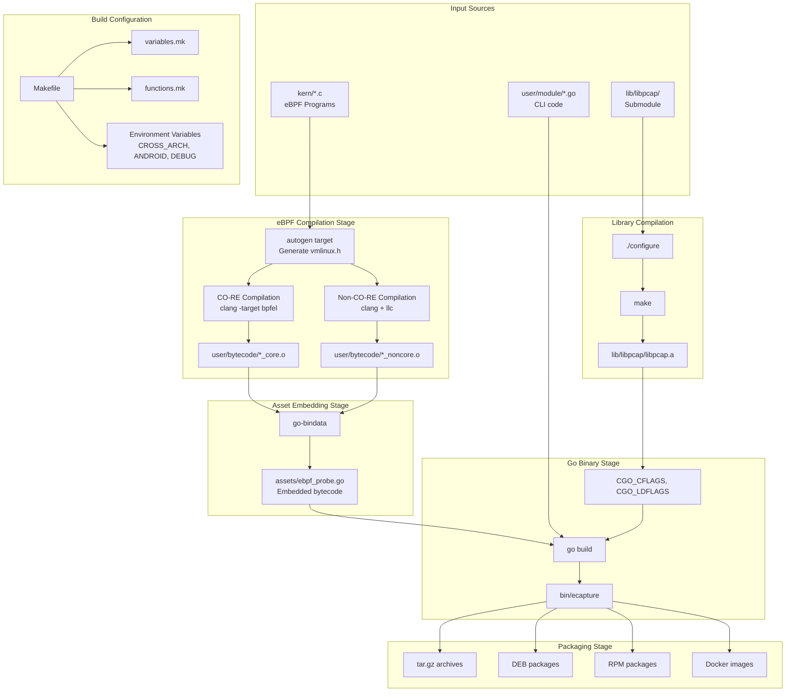
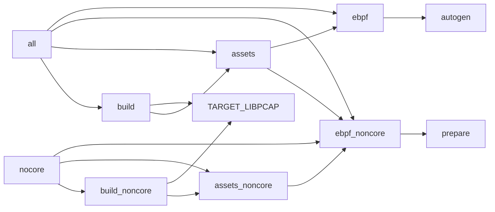
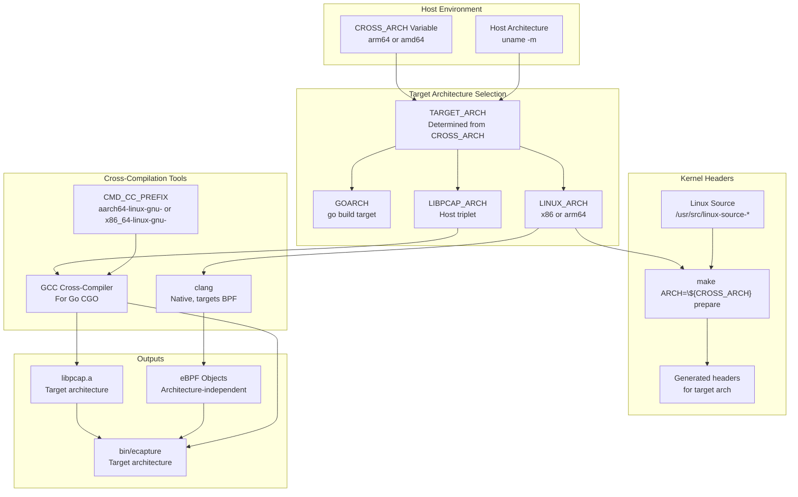
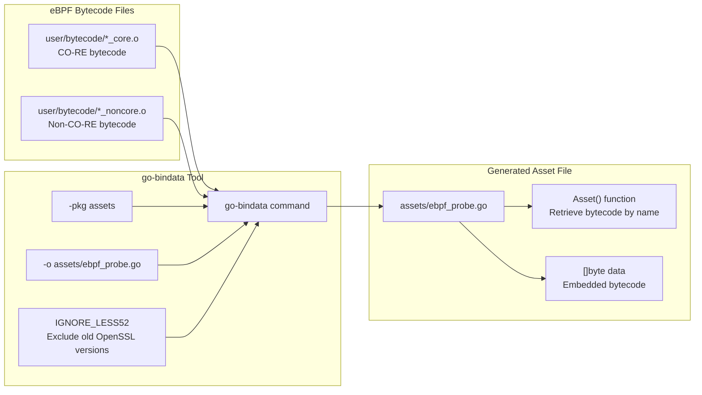
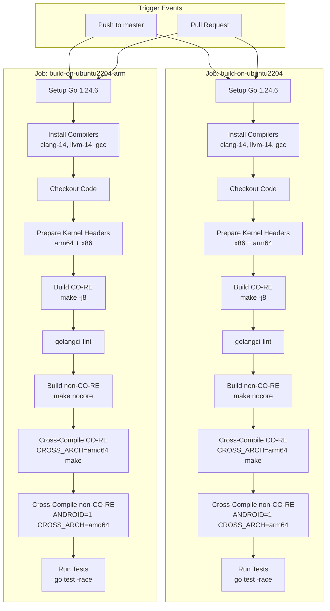
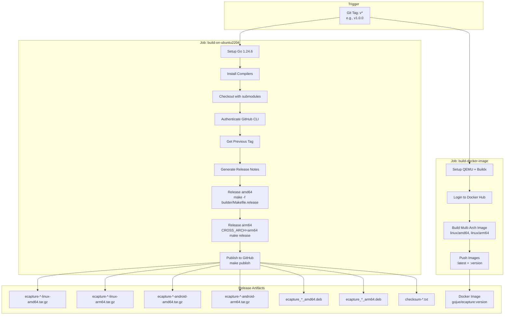

# Build System

<details>
<summary>Relevant source files</summary>

The following files were used as context for generating this wiki page:

- [.github/workflows/codeql-analysis.yml](https://github.com/gojue/ecapture/blob/ca085d05/.github/workflows/codeql-analysis.yml)
- [.github/workflows/go-c-cpp.yml](https://github.com/gojue/ecapture/blob/ca085d05/.github/workflows/go-c-cpp.yml)
- [.github/workflows/release.yml](https://github.com/gojue/ecapture/blob/ca085d05/.github/workflows/release.yml)
- [Makefile](https://github.com/gojue/ecapture/blob/ca085d05/Makefile)
- [builder/Dockerfile](https://github.com/gojue/ecapture/blob/ca085d05/builder/Dockerfile)
- [builder/Makefile.release](https://github.com/gojue/ecapture/blob/ca085d05/builder/Makefile.release)
- [builder/init_env.sh](https://github.com/gojue/ecapture/blob/ca085d05/builder/init_env.sh)
- [functions.mk](https://github.com/gojue/ecapture/blob/ca085d05/functions.mk)

</details>


## Purpose and Scope

This document describes the eCapture build system, including Makefile targets, compilation processes, cross-compilation support, asset embedding, and CI/CD workflows. The build system handles both CO-RE (Compile Once - Run Everywhere) and non-CO-RE eBPF bytecode compilation, produces multiple package formats, and supports cross-platform builds for x86_64 and arm64 architectures.

For information about eBPF program development and structure, see [eBPF Program Development](5.2-ebpf-program-development.md). For release and deployment details, see [CI/CD and Release Process](5.5-cicd-and-release-process.md).

---

## Build System Architecture

The build system is orchestrated through a main Makefile that delegates to specialized makefiles for different build targets. The overall architecture follows a multi-stage process: eBPF compilation, asset embedding, and Go binary compilation.

### Build Flow Overview


```mermaid
graph TB
    subgraph "Input Sources"
        KERN_C["kern/*.c<br/>eBPF Programs"]
        USER_GO["user/module/*.go<br/>CLI code"]
        LIBPCAP_SRC["lib/libpcap/<br/>Submodule"]
    end
    
    subgraph "Build Configuration"
        MAKEFILE["Makefile"]
        VARIABLES["variables.mk"]
        FUNCTIONS["functions.mk"]
        ENV_VARS["Environment Variables<br/>CROSS_ARCH, ANDROID, DEBUG"]
    end
    
    subgraph "eBPF Compilation Stage"
        AUTOGEN["autogen target<br/>Generate vmlinux.h"]
        CORE_COMPILE["CO-RE Compilation<br/>clang -target bpfel"]
        NONCORE_COMPILE["Non-CO-RE Compilation<br/>clang + llc"]
        BYTECODE_CORE["user/bytecode/*_core.o"]
        BYTECODE_NONCORE["user/bytecode/*_noncore.o"]
    end
    
    subgraph "Asset Embedding Stage"
        GOBINDATA["go-bindata"]
        ASSETS["assets/ebpf_probe.go<br/>Embedded bytecode"]
    end
    
    subgraph "Library Compilation"
        LIBPCAP_CONF["./configure"]
        LIBPCAP_MAKE["make"]
        LIBPCAP_A["lib/libpcap/libpcap.a"]
    end
    
    subgraph "Go Binary Stage"
        GO_BUILD["go build"]
        CGO_FLAGS["CGO_CFLAGS, CGO_LDFLAGS"]
        BINARY["bin/ecapture"]
    end
    
    subgraph "Packaging Stage"
        TAR["tar.gz archives"]
        DEB["DEB packages"]
        RPM["RPM packages"]
        DOCKER["Docker images"]
    end
    
    MAKEFILE --> VARIABLES
    MAKEFILE --> FUNCTIONS
    MAKEFILE --> ENV_VARS
    
    KERN_C --> AUTOGEN
    AUTOGEN --> CORE_COMPILE
    AUTOGEN --> NONCORE_COMPILE
    CORE_COMPILE --> BYTECODE_CORE
    NONCORE_COMPILE --> BYTECODE_NONCORE
    
    BYTECODE_CORE --> GOBINDATA
    BYTECODE_NONCORE --> GOBINDATA
    GOBINDATA --> ASSETS
    
    LIBPCAP_SRC --> LIBPCAP_CONF
    LIBPCAP_CONF --> LIBPCAP_MAKE
    LIBPCAP_MAKE --> LIBPCAP_A
    
    ASSETS --> GO_BUILD
    USER_GO --> GO_BUILD
    LIBPCAP_A --> CGO_FLAGS
    CGO_FLAGS --> GO_BUILD
    GO_BUILD --> BINARY
    
    BINARY --> TAR
    BINARY --> DEB
    BINARY --> RPM
    BINARY --> DOCKER
```

**Sources:** [Makefile:1-245](https://github.com/gojue/ecapture/blob/ca085d05/Makefile#L1-L245), [functions.mk:1-76](https://github.com/gojue/ecapture/blob/ca085d05/functions.mk#L1-L76)

---

## Primary Build Targets

The Makefile provides several top-level targets for different build scenarios. Each target represents a complete build pipeline from source to binary.

| Target | Description | eBPF Mode | Use Case |
|--------|-------------|-----------|----------|
| `all` | Full build with CO-RE and non-CO-RE bytecode | Both | Development and testing on systems with BTF support |
| `nocore` / `noncore` | Build with non-CO-RE bytecode only | Non-CO-RE only | Production builds for maximum compatibility |
| `ebpf` | Compile CO-RE eBPF programs only | CO-RE | Testing eBPF changes without full rebuild |
| `ebpf_noncore` | Compile non-CO-RE eBPF programs only | Non-CO-RE | Testing non-CO-RE eBPF changes |
| `assets` | Embed all bytecode files into Go | Both | Manual asset generation |
| `assets_noncore` | Embed non-CO-RE bytecode only | Non-CO-RE | Manual asset generation for non-CO-RE builds |
| `build` | Compile Go binary with CO-RE assets | CO-RE | Manual binary compilation |
| `build_noncore` | Compile Go binary with non-CO-RE assets | Non-CO-RE | Manual binary compilation |
| `clean` | Remove build artifacts | N/A | Clean slate for fresh builds |
| `env` | Display build environment variables | N/A | Debugging build configuration |

**Sources:** [Makefile:4-11](https://github.com/gojue/ecapture/blob/ca085d05/Makefile#L4-L11), [Makefile:106-245](https://github.com/gojue/ecapture/blob/ca085d05/Makefile#L106-L245)

### Target Dependency Graph


```mermaid
graph LR
    all["all"]
    nocore["nocore"]
    ebpf["ebpf"]
    ebpf_noncore["ebpf_noncore"]
    assets["assets"]
    assets_noncore["assets_noncore"]
    build["build"]
    build_noncore["build_noncore"]
    autogen["autogen"]
    prepare["prepare"]
    libpcap["TARGET_LIBPCAP"]
    
    all --> ebpf
    all --> ebpf_noncore
    all --> assets
    all --> build
    
    nocore --> ebpf_noncore
    nocore --> assets_noncore
    nocore --> build_noncore
    
    ebpf --> autogen
    ebpf_noncore --> prepare
    
    assets --> ebpf
    assets --> ebpf_noncore
    assets_noncore --> ebpf_noncore
    
    build --> libpcap
    build --> assets
    build_noncore --> libpcap
    build_noncore --> assets_noncore
```

**Sources:** [Makefile:6-11](https://github.com/gojue/ecapture/blob/ca085d05/Makefile#L6-L11), [Makefile:134-201](https://github.com/gojue/ecapture/blob/ca085d05/Makefile#L134-L201)

---

## CO-RE vs Non-CO-RE Compilation

eCapture supports two eBPF compilation modes: CO-RE (Compile Once - Run Everywhere) and non-CO-RE. The build system handles both modes with different compilation flags and kernel header requirements.

### CO-RE Compilation

CO-RE bytecode is compiled with BTF (BPF Type Format) support, allowing a single binary to work across different kernel versions without recompilation.

**Compilation Command:**
```
clang -D__TARGET_ARCH_$(LINUX_ARCH) \
    -target bpfel \
    -O2 -g -Wall -Werror \
    -c kern/source.c \
    -o user/bytecode/source_core.o
```

**Key characteristics:**
- Uses `-target bpfel` for BPF ELF format
- Requires BTF support in the kernel (Linux 5.2+)
- Generates `*_core.o` files in `user/bytecode/`
- Includes CO-RE relocations for structure field offsets
- Requires `vmlinux.h` generated by `bpftool`

**Sources:** [Makefile:117-127](https://github.com/gojue/ecapture/blob/ca085d05/Makefile#L117-L127)

### Non-CO-RE Compilation

Non-CO-RE bytecode is compiled against specific kernel headers, requiring kernel source to be available at build time. This mode provides broader compatibility with older kernels.

**Compilation Command:**
```
clang \
    -I $(KERN_SRC_PATH)/arch/$(LINUX_ARCH)/include \
    -I $(KERN_BUILD_PATH)/arch/$(LINUX_ARCH)/include/generated \
    -I $(KERN_SRC_PATH)/include \
    -c kern/source.c \
    -o - | llc -march=bpf -filetype=obj \
    -o user/bytecode/source_noncore.o
```

**Key characteristics:**
- Two-stage compilation: `clang` → LLVM IR → `llc` → BPF object
- Requires kernel source at build time
- Generates `*_noncore.o` files in `user/bytecode/`
- No CO-RE relocations; structure offsets are hardcoded
- Works on kernels without BTF support

**Sources:** [Makefile:139-159](https://github.com/gojue/ecapture/blob/ca085d05/Makefile#L139-L159)

### Compilation Comparison

| Aspect | CO-RE | Non-CO-RE |
|--------|-------|-----------|
| Kernel Headers | `vmlinux.h` only | Full kernel source tree |
| Portability | Single binary for all kernels | Kernel-specific binary |
| Kernel Requirement | Linux 5.2+ with BTF | Linux 4.15+ |
| Build Output | `*_core.o` | `*_noncore.o` |
| Compilation Tool | `clang` only | `clang` + `llc` |
| Structure Offsets | CO-RE relocations | Hardcoded at compile time |

**Sources:** [Makefile:117-159](https://github.com/gojue/ecapture/blob/ca085d05/Makefile#L117-L159)

---

## Cross-Compilation Support

The build system supports cross-compilation for arm64 and amd64 architectures. Cross-compilation is controlled by the `CROSS_ARCH` environment variable.

### Cross-Compilation Architecture


```mermaid
graph TB
    subgraph "Host Environment"
        HOST_ARCH["Host Architecture<br/>uname -m"]
        CROSS_VAR["CROSS_ARCH Variable<br/>arm64 or amd64"]
    end
    
    subgraph "Target Architecture Selection"
        TARGET_ARCH["TARGET_ARCH<br/>Determined from CROSS_ARCH"]
        GOARCH["GOARCH<br/>go build target"]
        LINUX_ARCH["LINUX_ARCH<br/>x86 or arm64"]
        LIBPCAP_ARCH["LIBPCAP_ARCH<br/>Host triplet"]
    end
    
    subgraph "Kernel Headers"
        LINUX_SOURCE["Linux Source<br/>/usr/src/linux-source-*"]
        KERN_PREPARE["make ARCH=\${CROSS_ARCH} prepare"]
        KERN_HEADERS["Generated headers<br/>for target arch"]
    end
    
    subgraph "Cross-Compilation Tools"
        CLANG["clang<br/>Native, targets BPF"]
        CC_PREFIX["CMD_CC_PREFIX<br/>aarch64-linux-gnu- or x86_64-linux-gnu-"]
        GCC["GCC Cross-Compiler<br/>For Go CGO"]
    end
    
    subgraph "Outputs"
        EBPF_OBJ["eBPF Objects<br/>Architecture-independent"]
        LIBPCAP["libpcap.a<br/>Target architecture"]
        BINARY["bin/ecapture<br/>Target architecture"]
    end
    
    HOST_ARCH --> TARGET_ARCH
    CROSS_VAR --> TARGET_ARCH
    TARGET_ARCH --> GOARCH
    TARGET_ARCH --> LINUX_ARCH
    TARGET_ARCH --> LIBPCAP_ARCH
    
    LINUX_SOURCE --> KERN_PREPARE
    LINUX_ARCH --> KERN_PREPARE
    KERN_PREPARE --> KERN_HEADERS
    
    LINUX_ARCH --> CLANG
    CLANG --> EBPF_OBJ
    
    CC_PREFIX --> GCC
    LIBPCAP_ARCH --> GCC
    GCC --> LIBPCAP
    GCC --> BINARY
    
    EBPF_OBJ --> BINARY
    LIBPCAP --> BINARY
```

**Sources:** [Makefile:99-104](https://github.com/gojue/ecapture/blob/ca085d05/Makefile#L99-L104), [.github/workflows/go-c-cpp.yml:56-65](https://github.com/gojue/ecapture/blob/ca085d05/.github/workflows/go-c-cpp.yml#L56-L65)

### Cross-Compilation Examples

**Build for arm64 on x86_64 host:**
```bash
CROSS_ARCH=arm64 make all
```

**Build for amd64 on arm64 host:**
```bash
CROSS_ARCH=amd64 make all
```

**Android build for arm64:**
```bash
ANDROID=1 CROSS_ARCH=arm64 make nocore
```

**Sources:** [Makefile:92-96](https://github.com/gojue/ecapture/blob/ca085d05/Makefile#L92-L96), [.github/workflows/go-c-cpp.yml:56-65](https://github.com/gojue/ecapture/blob/ca085d05/.github/workflows/go-c-cpp.yml#L56-L65)

### Kernel Source Requirements

For non-CO-RE cross-compilation, the build system requires prepared kernel headers for the target architecture. The `prepare` target handles this:

```makefile
prepare:
	if [ -d "$(LINUX_SOURCE_PATH)" ]; then \
		$(CMD_CD) $(LINUX_SOURCE_PATH) && $(KERNEL_HEADER_GEN) || exit 1; \
	elif [ -n "$(CROSS_ARCH)" ]; then \
		echo "linux source not found"; exit 1; \
	fi
```

The kernel headers are prepared with architecture-specific commands:
- For arm64: `make ARCH=arm64 CROSS_COMPILE=aarch64-linux-gnu- prepare`
- For x86_64: `make ARCH=x86 CROSS_COMPILE=x86_64-linux-gnu- prepare`

**Sources:** [Makefile:98-104](https://github.com/gojue/ecapture/blob/ca085d05/Makefile#L98-L104), [.github/workflows/go-c-cpp.yml:25-32](https://github.com/gojue/ecapture/blob/ca085d05/.github/workflows/go-c-cpp.yml#L25-L32), [.github/workflows/go-c-cpp.yml:86-92](https://github.com/gojue/ecapture/blob/ca085d05/.github/workflows/go-c-cpp.yml#L86-L92)

---

## Asset Embedding with go-bindata

The build system uses `go-bindata` to embed all compiled eBPF bytecode files into the Go binary. This allows eCapture to be distributed as a single executable without external dependencies on bytecode files.

### Asset Embedding Process


```mermaid
graph LR
    subgraph "eBPF Bytecode Files"
        CORE_O["user/bytecode/*_core.o<br/>CO-RE bytecode"]
        NONCORE_O["user/bytecode/*_noncore.o<br/>Non-CO-RE bytecode"]
    end
    
    subgraph "go-bindata Tool"
        BINDATA["go-bindata command"]
        PKG_FLAG["-pkg assets"]
        OUTPUT_FLAG["-o assets/ebpf_probe.go"]
        IGNORE["IGNORE_LESS52<br/>Exclude old OpenSSL versions"]
    end
    
    subgraph "Generated Asset File"
        ASSET_GO["assets/ebpf_probe.go"]
        ASSET_FUNC["Asset() function<br/>Retrieve bytecode by name"]
        BYTE_ARRAY["[]byte data<br/>Embedded bytecode"]
    end
    
    CORE_O --> BINDATA
    NONCORE_O --> BINDATA
    PKG_FLAG --> BINDATA
    OUTPUT_FLAG --> BINDATA
    IGNORE --> BINDATA
    
    BINDATA --> ASSET_GO
    ASSET_GO --> ASSET_FUNC
    ASSET_GO --> BYTE_ARRAY
```

**Sources:** [Makefile:162-171](https://github.com/gojue/ecapture/blob/ca085d05/Makefile#L162-L171)

### Asset Generation Commands

**Full asset generation (CO-RE + non-CO-RE):**
```makefile
assets: ebpf ebpf_noncore
	$(CMD_GO) run github.com/shuLhan/go-bindata/cmd/go-bindata \
		$(IGNORE_LESS52) -pkg assets -o "assets/ebpf_probe.go" \
		$(wildcard ./user/bytecode/*.o)
```

**Non-CO-RE only asset generation:**
```makefile
assets_noncore: ebpf_noncore
	$(CMD_GO) run github.com/shuLhan/go-bindata/cmd/go-bindata \
		$(IGNORE_LESS52) -pkg assets -o "assets/ebpf_probe.go" \
		$(wildcard ./user/bytecode/*.o)
```

The `IGNORE_LESS52` variable excludes older OpenSSL 1.0.2 and 1.1.0 versions to reduce binary size for builds targeting newer systems.

**Sources:** [Makefile:162-171](https://github.com/gojue/ecapture/blob/ca085d05/Makefile#L162-L171)

### Asset Usage in Code

The generated `assets/ebpf_probe.go` file provides an `Asset()` function that modules use to retrieve embedded bytecode:

```go
// Example usage in module code
bytecode, err := assets.Asset("openssl_3_0_0_kern_core.o")
```

This allows the module system to select and load the appropriate eBPF bytecode based on detected library versions at runtime.

**Sources:** [Makefile:162-171](https://github.com/gojue/ecapture/blob/ca085d05/Makefile#L162-L171)

---

## libpcap Static Library Compilation

eCapture requires libpcap for packet capture functionality. The build system compiles libpcap as a static library to avoid runtime dependencies.

### libpcap Build Configuration

```makefile
$(TARGET_LIBPCAP):
	test -f ./lib/libpcap/configure || git submodule update --init
	cd lib/libpcap && \
		CC=$(CMD_CC_PREFIX)$(CMD_CC) AR=$(CMD_AR_PREFIX)$(CMD_AR) \
		CFLAGS="-O2 -g -gdwarf-4 -static -Wno-unused-result" \
		./configure \
			--disable-rdma \
			--disable-shared \
			--disable-usb \
			--disable-netmap \
			--disable-bluetooth \
			--disable-dbus \
			--without-libnl \
			--without-dpdk \
			--without-dag \
			--without-septel \
			--without-snf \
			--without-gcc \
			--with-pcap=linux \
			--without-turbocap \
			--host=$(LIBPCAP_ARCH) && \
		CC=$(CMD_CC_PREFIX)$(CMD_CC) AR=$(CMD_AR_PREFIX)$(CMD_AR) make
```

**Key configuration points:**
- `--disable-shared`: Build only static library (`.a`)
- `--with-pcap=linux`: Use Linux native packet capture
- `--host=$(LIBPCAP_ARCH)`: Cross-compilation target triplet
- `CFLAGS` includes `-static` and `-gdwarf-4` for debugging

**Sources:** [Makefile:175-184](https://github.com/gojue/ecapture/blob/ca085d05/Makefile#L175-L184)

### CGO Integration

The compiled libpcap static library is linked into the Go binary via CGO flags:

```makefile
CGO_ENABLED=1
CGO_CFLAGS='-O2 -g -I$(CURDIR)/lib/libpcap/'
CGO_LDFLAGS='-O2 -g -L$(CURDIR)/lib/libpcap/ -lpcap -static'
```

This produces a fully statically-linked binary with no external library dependencies.

**Sources:** [functions.mk:47-54](https://github.com/gojue/ecapture/blob/ca085d05/functions.mk#L47-L54)

---

## Build Variables and Configuration

The build system uses numerous variables defined in `variables.mk` and can be overridden via environment variables or command-line arguments.

### Key Build Variables

| Variable | Default / Detection | Purpose |
|----------|---------------------|---------|
| `CROSS_ARCH` | Empty (native) | Target architecture: `arm64` or `amd64` |
| `ANDROID` | `0` | Enable Android-specific build flags |
| `DEBUG` | `0` | Enable debug symbols and verbose output |
| `SNAPSHOT_VERSION` | Git describe | Version string for release builds |
| `CLANG_VERSION` | Detected from `clang --version` | Clang major version number |
| `GO_VERSION` | Detected from `go version` | Go version (must be 1.24+) |
| `HOST_ARCH` | `uname -m` | Host machine architecture |
| `TARGET_ARCH` | Derived from `CROSS_ARCH` | Target architecture for compilation |
| `GOARCH` | Derived from `TARGET_ARCH` | Go architecture: `amd64` or `arm64` |
| `LINUX_ARCH` | Derived from `TARGET_ARCH` | Linux kernel architecture: `x86` or `arm64` |
| `KERN_RELEASE` | `uname -r` | Kernel version for native builds |
| `LINUX_SOURCE_PATH` | Auto-detected in `/usr/src` | Path to kernel source for non-CO-RE |
| `BPF_NOCORE_TAG` | Kernel version tag | Tag for non-CO-RE bytecode versioning |

**Sources:** [Makefile:1-2](https://github.com/gojue/ecapture/blob/ca085d05/Makefile#L1-L2), [Makefile:20-63](https://github.com/gojue/ecapture/blob/ca085d05/Makefile#L20-L63)

### Environment Display

The `env` target displays all build configuration:

```bash
make env
```

Example output:
```
eCapture Makefile Environment:
---------------------------------------
PARALLEL                 -j8
----------------[ from args ]---------------
CROSS_ARCH               arm64
ANDROID                  0
DEBUG                    1
---------------------------------------
HOST_ARCH                x86_64
CLANG_VERSION            14
GO_VERSION               1.24.6
TARGET_ARCH              arm64
GOARCH                   arm64
LINUX_ARCH               arm64
---------------------------------------
```

**Sources:** [Makefile:19-63](https://github.com/gojue/ecapture/blob/ca085d05/Makefile#L19-L63)

---

## Makefile Functions

The `functions.mk` file provides reusable functions for build logic.

### Version Check Functions

```makefile
.checkver_$(CMD_CLANG):
	@if [ ${CLANG_VERSION} -lt 9 ]; then
		echo "you MUST use clang 9 or newer"
		exit 1
	fi
	
.checkver_$(CMD_GO):
	@if [ ${GO_VERSION_MAJ} -eq 1 ]; then
		if [ ${GO_VERSION_MIN} -lt 24 ]; then
			echo "you MUST use golang 1.24 or newer"
			exit 1
		fi
	fi
```

These check functions ensure minimum tool versions:
- Clang 9+
- Go 1.24+
- bpftool (for CO-RE vmlinux.h generation)

**Sources:** [functions.mk:12-40](https://github.com/gojue/ecapture/blob/ca085d05/functions.mk#L12-L40)

### Go Build Function

```makefile
define gobuild
	CGO_ENABLED=1 \
	CGO_CFLAGS='-O2 -g -gdwarf-4 -I$(CURDIR)/lib/libpcap/' \
	CGO_LDFLAGS='-O2 -g -L$(CURDIR)/lib/libpcap/ -lpcap -static' \
	GOOS=linux GOARCH=$(GOARCH) CC=$(CMD_CC_PREFIX)$(CMD_CC) \
	$(CMD_GO) build -trimpath -buildmode=pie -mod=readonly \
		-tags '$(TARGET_TAG),netgo' \
		-ldflags "-w -s \
			-X 'github.com/gojue/ecapture/cli/cmd.GitVersion=$(TARGET_TAG)_$(GOARCH):$(VERSION_NUM):$(VERSION_FLAG)' \
			-X 'github.com/gojue/ecapture/cli/cmd.ByteCodeFiles=$(BYTECODE_FILES)' \
			-linkmode=external -extldflags -static" \
		-o $(OUT_BIN)
endef
```

This function compiles the Go binary with:
- Static linking (`-linkmode=external -extldflags -static`)
- PIE (Position Independent Executable) for security
- Version information embedded via `-ldflags -X`
- CGO enabled with libpcap linkage

**Sources:** [functions.mk:47-54](https://github.com/gojue/ecapture/blob/ca085d05/functions.mk#L47-L54)

### Release Tar Function

```makefile
define release_tar
	$(call allow-override,TAR_DIR,ecapture-$(DEB_VERSION)-$(1)-$(GOARCH)$(CORE_PREFIX))
	$(call allow-override,OUT_ARCHIVE,$(OUTPUT_DIR)/$(TAR_DIR).tar.gz)
	$(CMD_MAKE) clean
	ANDROID=$(ANDROID) $(CMD_MAKE) $(2)
	$(CMD_MKDIR) -p $(TAR_DIR)
	$(CMD_CP) LICENSE $(TAR_DIR)/
	$(CMD_CP) CHANGELOG.md $(TAR_DIR)/
	$(CMD_CP) README.md $(TAR_DIR)/
	$(CMD_CP) $(OUTPUT_DIR)/ecapture $(TAR_DIR)/
	$(CMD_TAR) -czf $(OUT_ARCHIVE) $(TAR_DIR)
endef
```

This function creates release archives with documentation and the binary.

**Sources:** [functions.mk:62-76](https://github.com/gojue/ecapture/blob/ca085d05/functions.mk#L62-L76)

---

## CI/CD Pipeline

The CI/CD system is implemented using GitHub Actions with two primary workflows: continuous integration and release.

### Continuous Integration Workflow


```mermaid
graph TB
    subgraph "Trigger Events"
        PUSH["Push to master"]
        PR["Pull Request"]
    end
    
    subgraph "Job: build-on-ubuntu2204"
        SETUP_GO_X86["Setup Go 1.24.6"]
        INSTALL_X86["Install Compilers<br/>clang-14, llvm-14, gcc"]
        CHECKOUT_X86["Checkout Code"]
        KERNEL_X86["Prepare Kernel Headers<br/>x86 + arm64"]
        BUILD_CORE_X86["Build CO-RE<br/>make -j8"]
        LINT_X86["golangci-lint"]
        BUILD_NOCORE_X86["Build non-CO-RE<br/>make nocore"]
        CROSS_CORE_X86["Cross-Compile CO-RE<br/>CROSS_ARCH=arm64 make"]
        CROSS_NOCORE_X86["Cross-Compile non-CO-RE<br/>ANDROID=1 CROSS_ARCH=arm64"]
        TEST_X86["Run Tests<br/>go test -race"]
    end
    
    subgraph "Job: build-on-ubuntu2204-arm"
        SETUP_GO_ARM["Setup Go 1.24.6"]
        INSTALL_ARM["Install Compilers<br/>clang-14, llvm-14, gcc"]
        CHECKOUT_ARM["Checkout Code"]
        KERNEL_ARM["Prepare Kernel Headers<br/>arm64 + x86"]
        BUILD_CORE_ARM["Build CO-RE<br/>make -j8"]
        LINT_ARM["golangci-lint"]
        BUILD_NOCORE_ARM["Build non-CO-RE<br/>make nocore"]
        CROSS_CORE_ARM["Cross-Compile CO-RE<br/>CROSS_ARCH=amd64 make"]
        CROSS_NOCORE_ARM["Cross-Compile non-CO-RE<br/>ANDROID=1 CROSS_ARCH=amd64"]
        TEST_ARM["Run Tests<br/>go test -race"]
    end
    
    PUSH --> SETUP_GO_X86
    PR --> SETUP_GO_X86
    PUSH --> SETUP_GO_ARM
    PR --> SETUP_GO_ARM
    
    SETUP_GO_X86 --> INSTALL_X86
    INSTALL_X86 --> CHECKOUT_X86
    CHECKOUT_X86 --> KERNEL_X86
    KERNEL_X86 --> BUILD_CORE_X86
    BUILD_CORE_X86 --> LINT_X86
    LINT_X86 --> BUILD_NOCORE_X86
    BUILD_NOCORE_X86 --> CROSS_CORE_X86
    CROSS_CORE_X86 --> CROSS_NOCORE_X86
    CROSS_NOCORE_X86 --> TEST_X86
    
    SETUP_GO_ARM --> INSTALL_ARM
    INSTALL_ARM --> CHECKOUT_ARM
    CHECKOUT_ARM --> KERNEL_ARM
    KERNEL_ARM --> BUILD_CORE_ARM
    BUILD_CORE_ARM --> LINT_ARM
    LINT_ARM --> BUILD_NOCORE_ARM
    BUILD_NOCORE_ARM --> CROSS_CORE_ARM
    CROSS_CORE_ARM --> CROSS_NOCORE_ARM
    CROSS_NOCORE_ARM --> TEST_ARM
```

**Sources:** [.github/workflows/go-c-cpp.yml:1-128](https://github.com/gojue/ecapture/blob/ca085d05/.github/workflows/go-c-cpp.yml#L1-L128)

### Key CI Steps

1. **Compiler Installation**: Installs clang-14, llvm-14, and cross-compilation toolchains
2. **Kernel Header Preparation**: Extracts and prepares Linux kernel headers for both native and cross-compilation
3. **CO-RE Build**: Compiles with full CO-RE support and runs linter
4. **Non-CO-RE Build**: Compiles kernel-specific bytecode
5. **Cross-Compilation**: Builds for opposite architecture (x86→arm64, arm64→x86)
6. **Android Build**: Creates Android-compatible non-CO-RE binaries
7. **Testing**: Runs unit tests with race detector

**Sources:** [.github/workflows/go-c-cpp.yml:12-67](https://github.com/gojue/ecapture/blob/ca085d05/.github/workflows/go-c-cpp.yml#L12-L67), [.github/workflows/go-c-cpp.yml:69-127](https://github.com/gojue/ecapture/blob/ca085d05/.github/workflows/go-c-cpp.yml#L69-L127)

---

## Release Process

The release workflow is triggered by version tags and produces multiple artifact types.

### Release Workflow


```mermaid
graph TB
    subgraph "Trigger"
        TAG["Git Tag: v*<br/>e.g., v1.0.0"]
    end
    
    subgraph "Job: build-on-ubuntu2204"
        SETUP["Setup Go 1.24.6"]
        INSTALL["Install Compilers"]
        CHECKOUT["Checkout with submodules"]
        AUTH["Authenticate GitHub CLI"]
        PREV_TAG["Get Previous Tag"]
        NOTES["Generate Release Notes"]
        
        RELEASE_AMD64["Release amd64<br/>make -f builder/Makefile.release"]
        RELEASE_ARM64["Release arm64<br/>CROSS_ARCH=arm64 make release"]
        PUBLISH["Publish to GitHub<br/>make publish"]
    end
    
    subgraph "Job: build-docker-image"
        DOCKER_SETUP["Setup QEMU + Buildx"]
        DOCKER_LOGIN["Login to Docker Hub"]
        DOCKER_BUILD["Build Multi-Arch Image<br/>linux/amd64, linux/arm64"]
        DOCKER_PUSH["Push Images<br/>:latest + :version"]
    end
    
    subgraph "Release Artifacts"
        TAR_AMD64["ecapture-*-linux-amd64.tar.gz"]
        TAR_ARM64["ecapture-*-linux-arm64.tar.gz"]
        TAR_ANDROID_AMD64["ecapture-*-android-amd64.tar.gz"]
        TAR_ANDROID_ARM64["ecapture-*-android-arm64.tar.gz"]
        DEB_AMD64["ecapture_*_amd64.deb"]
        DEB_ARM64["ecapture_*_arm64.deb"]
        CHECKSUMS["checksum-*.txt"]
        DOCKER_IMAGE["Docker Image<br/>gojue/ecapture:version"]
    end
    
    TAG --> SETUP
    SETUP --> INSTALL
    INSTALL --> CHECKOUT
    CHECKOUT --> AUTH
    AUTH --> PREV_TAG
    PREV_TAG --> NOTES
    NOTES --> RELEASE_AMD64
    RELEASE_AMD64 --> RELEASE_ARM64
    RELEASE_ARM64 --> PUBLISH
    
    TAG --> DOCKER_SETUP
    DOCKER_SETUP --> DOCKER_LOGIN
    DOCKER_LOGIN --> DOCKER_BUILD
    DOCKER_BUILD --> DOCKER_PUSH
    
    PUBLISH --> TAR_AMD64
    PUBLISH --> TAR_ARM64
    PUBLISH --> TAR_ANDROID_AMD64
    PUBLISH --> TAR_ANDROID_ARM64
    PUBLISH --> DEB_AMD64
    PUBLISH --> DEB_ARM64
    PUBLISH --> CHECKSUMS
    
    DOCKER_PUSH --> DOCKER_IMAGE
```

**Sources:** [.github/workflows/release.yml:1-129](https://github.com/gojue/ecapture/blob/ca085d05/.github/workflows/release.yml#L1-L129)

### Release Makefile Targets

The `builder/Makefile.release` provides specialized targets for creating release artifacts:

| Target | Description | Output |
|--------|-------------|--------|
| `snapshot` | Build Linux non-CO-RE release | `ecapture-*-linux-*.tar.gz` |
| `snapshot_android` | Build Android non-CO-RE release | `ecapture-*-android-*.tar.gz` |
| `build_deb` | Create Debian package | `ecapture_*_*.deb` |
| `publish` | Upload all artifacts to GitHub | GitHub Release with all files |

**Sources:** [builder/Makefile.release:1-151](https://github.com/gojue/ecapture/blob/ca085d05/builder/Makefile.release#L1-L151)

### Release Archive Structure

Each release archive includes:
- `ecapture` binary (statically linked)
- `LICENSE` file
- `CHANGELOG.md`
- `README.md`
- `README_CN.md`

**Sources:** [builder/Makefile.release:69-75](https://github.com/gojue/ecapture/blob/ca085d05/builder/Makefile.release#L69-L75)

---

## Package Formats

### DEB Package

The build system creates Debian packages with the following structure:

```
ecapture_<version>_<arch>.deb
├── DEBIAN/
│   └── control (metadata)
└── usr/local/bin/
    └── ecapture (binary)
```

**Control file fields:**
- Package: ecapture
- Version: Semantic version (e.g., 1.0.0)
- Architecture: amd64 or arm64
- Maintainer: Package maintainer info
- Description: eCapture description
- Homepage: https://ecapture.cc

**Sources:** [builder/Makefile.release:134-151](https://github.com/gojue/ecapture/blob/ca085d05/builder/Makefile.release#L134-L151)

### RPM Package

RPM packages can be built using the `rpm` target with a spec file:

```bash
make rpm VERSION=0.0.0 RELEASE=1
```

The spec file is located at `builder/rpmBuild.spec`.

**Sources:** [Makefile:65-71](https://github.com/gojue/ecapture/blob/ca085d05/Makefile#L65-L71)

### Docker Image

Multi-architecture Docker images are built using a two-stage Dockerfile:

**Stage 1: Builder**
- Base: `ubuntu:22.04`
- Installs compilers and Go
- Builds eCapture with `make all`

**Stage 2: Runtime**
- Base: `alpine:latest`
- Contains only the `ecapture` binary
- Entrypoint: `/ecapture`

**Sources:** [builder/Dockerfile:1-39](https://github.com/gojue/ecapture/blob/ca085d05/builder/Dockerfile#L1-L39)

---

## Build Environment Setup

For developers setting up a build environment, the `builder/init_env.sh` script automates installation of all dependencies.

### Automated Setup Script

```bash
/bin/bash -c "$(curl -fsSL https://raw.githubusercontent.com/gojue/ecapture/master/builder/init_env.sh)"
```

This script:
1. Detects Ubuntu version and selects appropriate Clang version
2. Detects host architecture (x86_64 or aarch64)
3. Installs build dependencies via apt-get
4. Installs cross-compilation toolchain
5. Downloads and extracts Linux kernel source
6. Prepares kernel headers for native and cross-compilation
7. Downloads and installs Go 1.24.6
8. Clones the eCapture repository

**Supported Ubuntu versions:**
- 20.04 (Clang 10)
- 20.10 (Clang 10)
- 21.04 (Clang 11)
- 21.10, 22.04, 22.10 (Clang 12)
- 23.04, 23.10 (Clang 15)
- 24.04 (Clang 18)

**Sources:** [builder/init_env.sh:1-106](https://github.com/gojue/ecapture/blob/ca085d05/builder/init_env.sh#L1-L106)

---

## Build Verification

### Version Checks

The build system enforces minimum tool versions through `.checkver_*` targets that must pass before compilation begins:

```makefile
.checkver_$(CMD_CLANG): | .check_$(CMD_CLANG)
	@if [ ${CLANG_VERSION} -lt 9 ]; then
		echo "you MUST use clang 9 or newer"
		exit 1
	fi

.checkver_$(CMD_GO): | .check_$(CMD_GO)
	@if [ ${GO_VERSION_MIN} -lt 24 ]; then
		echo "you MUST use golang 1.24 or newer"
		exit 1
	fi
```

**Sources:** [functions.mk:13-35](https://github.com/gojue/ecapture/blob/ca085d05/functions.mk#L13-L35)

### Build Testing

The CI system runs comprehensive tests:

```bash
# Unit tests with race detector
go test -v -race ./... -coverprofile=coverage.out

# E2E tests for specific modules
bash ./test/e2e/tls_e2e_test.sh
bash ./test/e2e/gnutls_e2e_test.sh
bash ./test/e2e/gotls_e2e_test.sh
```

**Sources:** [Makefile:216-244](https://github.com/gojue/ecapture/blob/ca085d05/Makefile#L216-L244), [.github/workflows/go-c-cpp.yml:66-67](https://github.com/gojue/ecapture/blob/ca085d05/.github/workflows/go-c-cpp.yml#L66-L67)

---

## Common Build Scenarios

### Native Build (Development)

```bash
# Full build with CO-RE and non-CO-RE
make clean
make all

# Non-CO-RE only (faster, smaller binary)
make clean
make nocore
```

### Cross-Compilation

```bash
# Build for arm64 on x86_64
make clean
CROSS_ARCH=arm64 make all

# Build for amd64 on arm64
make clean
CROSS_ARCH=amd64 make all
```

### Android Build

```bash
# Android arm64
make clean
ANDROID=1 CROSS_ARCH=arm64 make nocore

# Android amd64
make clean
ANDROID=1 CROSS_ARCH=amd64 make nocore
```

### Debug Build

```bash
# Enable debug symbols and verbose output
make clean
DEBUG=1 make all
```

### Release Build

```bash
# Create versioned release archives
make clean
SNAPSHOT_VERSION=v1.0.0 make -f builder/Makefile.release release

# Publish to GitHub
SNAPSHOT_VERSION=v1.0.0 make -f builder/Makefile.release publish
```

**Sources:** [Makefile:1-245](https://github.com/gojue/ecapture/blob/ca085d05/Makefile#L1-L245), [builder/Makefile.release:1-151](https://github.com/gojue/ecapture/blob/ca085d05/builder/Makefile.release#L1-L151)