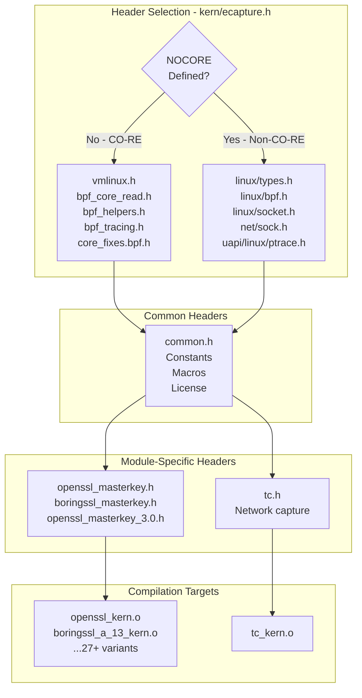
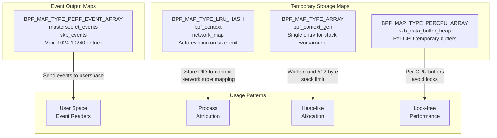
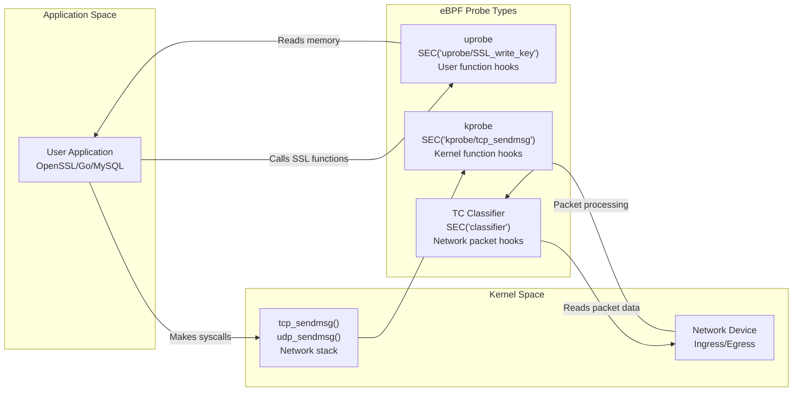
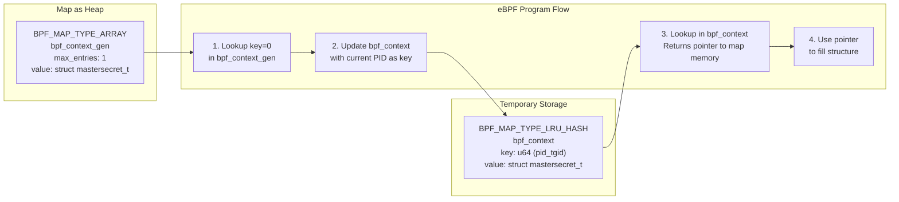
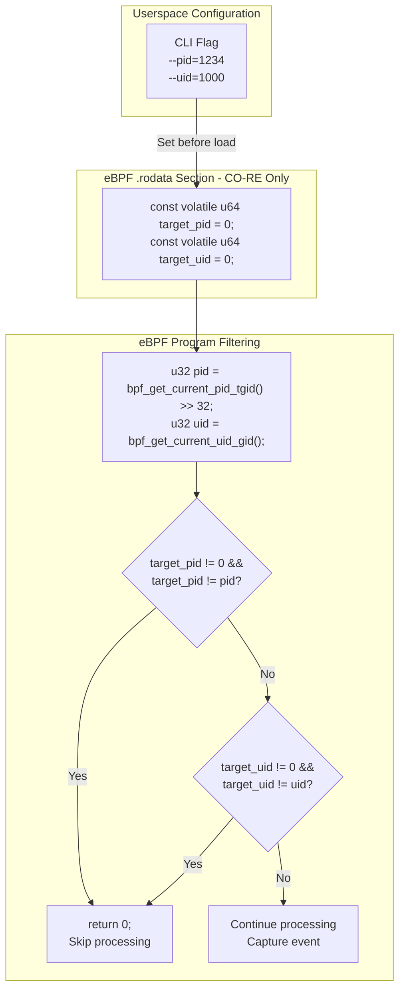
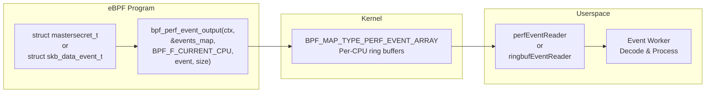
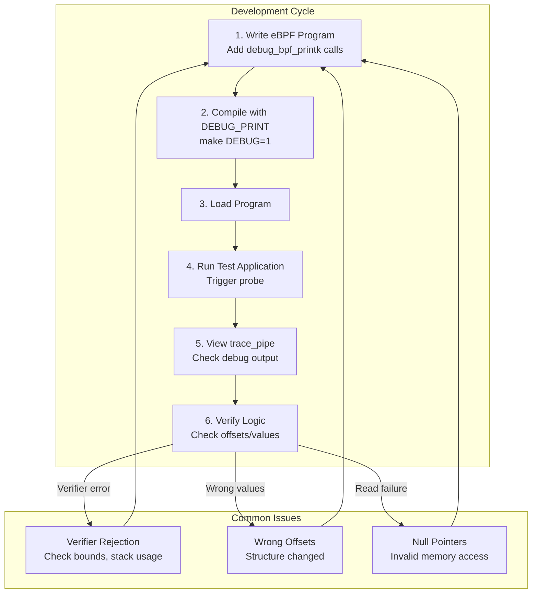
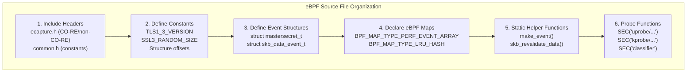

# eBPF Program Development

<details>
<summary>Relevant source files</summary>

The following files were used as context for generating this wiki page:

- [kern/boringssl_const.h](https://github.com/gojue/ecapture/blob/0766a93b/kern/boringssl_const.h)
- [kern/boringssl_masterkey.h](https://github.com/gojue/ecapture/blob/0766a93b/kern/boringssl_masterkey.h)
- [kern/common.h](https://github.com/gojue/ecapture/blob/0766a93b/kern/common.h)
- [kern/ecapture.h](https://github.com/gojue/ecapture/blob/0766a93b/kern/ecapture.h)
- [kern/openssl_masterkey.h](https://github.com/gojue/ecapture/blob/0766a93b/kern/openssl_masterkey.h)
- [kern/openssl_masterkey_3.0.h](https://github.com/gojue/ecapture/blob/0766a93b/kern/openssl_masterkey_3.0.h)
- [kern/tc.h](https://github.com/gojue/ecapture/blob/0766a93b/kern/tc.h)
- [utils/boringssl-offset.c](https://github.com/gojue/ecapture/blob/0766a93b/utils/boringssl-offset.c)

</details>


## Purpose and Scope

This page provides a comprehensive guide to developing eBPF programs for eCapture. It covers the development environment setup, common patterns, helper functions, map types, probe attachment mechanisms, memory management strategies, and debugging techniques used throughout the codebase. 

For detailed information about eBPF program structure patterns and organization, see [eBPF Program Structure](5.2.1-ebpf-program-structure.md). For techniques to calculate offsets in complex structures like SSL/TLS libraries, see [Structure Offset Calculation](5.2.2-structure-offset-calculation.md). For the overall build process that compiles these eBPF programs, see [Build System](5.1-build-system.md).

---

## Development Environment

### CO-RE vs Non-CO-RE Compilation Modes

eCapture eBPF programs support two compilation modes, controlled by the `NOCORE` preprocessor flag defined in [kern/ecapture.h:18-88](https://github.com/gojue/ecapture/blob/0766a93b/kern/ecapture.h#L18-L88):

**CO-RE Mode (Compile Once - Run Everywhere):**
- Uses BTF (BPF Type Format) for kernel compatibility
- Includes `vmlinux.h` with all kernel types
- Leverages `bpf_core_read()` helpers for portable structure access
- Requires kernel 5.2+ with BTF support
- Enables use of `.rodata` section for constant values

**Non-CO-RE Mode:**
- Uses traditional kernel headers from specific kernel versions
- Directly includes `<linux/types.h>`, `<linux/bpf.h>`, etc.
- Requires compilation for each target kernel version
- Supports older kernels (< 5.2)
- Cannot use `.rodata` section (see [kern/common.h:63-71](https://github.com/gojue/ecapture/blob/0766a93b/kern/common.h#L63-L71))



**Sources:** [kern/ecapture.h:18-92](https://github.com/gojue/ecapture/blob/0766a93b/kern/ecapture.h#L18-L92), [kern/common.h:63-71](https://github.com/gojue/ecapture/blob/0766a93b/kern/common.h#L63-L71)

---

## Common Headers and Definitions

### Core Header: ecapture.h

The [kern/ecapture.h:1-92](https://github.com/gojue/ecapture/blob/0766a93b/kern/ecapture.h#L1-L92) header serves as the foundation for all eBPF programs, providing:

| Feature | Purpose | Location |
|---------|---------|----------|
| Mode Selection | Switch between CO-RE and non-CO-RE | Lines 18-28, 27-88 |
| Helper Macros | `asm_inline` redefinition for Clang compatibility | Lines 43-46 |
| Kernel Types | `tcphdr`, `ipv6hdr` structures for non-CO-RE | Lines 69-86 |
| Common Include | Always includes `common.h` | Line 90 |

### Common Definitions: common.h

The [kern/common.h:1-85](https://github.com/gojue/ecapture/blob/0766a93b/kern/common.h#L1-L85) header defines constants and macros used across all eBPF programs:

**Debug Macro:**
```c
#ifdef DEBUG_PRINT
#define debug_bpf_printk(fmt, ...)                     \
    do {                                               \
        char s[] = fmt;                                \
        bpf_trace_printk(s, sizeof(s), ##__VA_ARGS__); \
    } while (0)
#else
#define debug_bpf_printk(fmt, ...)
#endif
```

**Key Constants:**

| Constant | Value | Purpose |
|----------|-------|---------|
| `TASK_COMM_LEN` | 16 | Process command name length |
| `PATH_MAX_LEN` | 256 | Maximum path length |
| `MAX_DATA_SIZE_OPENSSL` | 16384 | TLS record max size (RFC 5246) |
| `MAX_DATA_SIZE_MYSQL` | 256 | MySQL query capture size |
| `MAX_DATA_SIZE_BASH` | 256 | Bash command capture size |
| `SKB_MAX_DATA_SIZE` | 2048 | Network packet buffer size |
| `AF_INET` | 2 | IPv4 address family |
| `AF_INET6` | 10 | IPv6 address family |
| `TC_ACT_OK` | 0 | TC program return value |

**Target Filtering (CO-RE Mode Only):**
```c
#ifndef KERNEL_LESS_5_2
const volatile u64 target_pid = 0;
const volatile u64 target_uid = 0;
const volatile u64 target_errno = BASH_ERRNO_DEFAULT;
#endif
```

These volatile constants in `.rodata` allow userspace to set filtering parameters before loading the eBPF program.

**Sources:** [kern/common.h:18-85](https://github.com/gojue/ecapture/blob/0766a93b/kern/common.h#L18-L85), [kern/ecapture.h:18-92](https://github.com/gojue/ecapture/blob/0766a93b/kern/ecapture.h#L18-L92)

---

## eBPF Map Types and Usage

eCapture uses several BPF map types for different purposes. Here's a comprehensive overview:



### Map Type Comparison

| Map Type | Use Cases | Key Features | Example |
|----------|-----------|--------------|---------|
| `PERF_EVENT_ARRAY` | Send events to userspace | High-throughput streaming | `mastersecret_events` [kern/openssl_masterkey.h:48-53](https://github.com/gojue/ecapture/blob/0766a93b/kern/openssl_masterkey.h#L48-L53) |
| `LRU_HASH` | PID/connection tracking | Auto-eviction on capacity | `bpf_context` [kern/boringssl_masterkey.h:115-119](https://github.com/gojue/ecapture/blob/0766a93b/kern/boringssl_masterkey.h#L115-L119), `network_map` [kern/tc.h:73-77](https://github.com/gojue/ecapture/blob/0766a93b/kern/tc.h#L73-L77) |
| `ARRAY` | Fixed-size lookup | Fast indexed access | `bpf_context_gen` [kern/openssl_masterkey.h:62-67](https://github.com/gojue/ecapture/blob/0766a93b/kern/openssl_masterkey.h#L62-L67) |
| `PERCPU_ARRAY` | Temporary per-CPU buffers | Lock-free operation | `skb_data_buffer_heap` [kern/tc.h:65-69](https://github.com/gojue/ecapture/blob/0766a93b/kern/tc.h#L65-L69) |

### Common Map Definitions

**Event Output Map (Master Secret Extraction):**
```c
struct {
    __uint(type, BPF_MAP_TYPE_PERF_EVENT_ARRAY);
    __uint(key_size, sizeof(u32));
    __uint(value_size, sizeof(u32));
    __uint(max_entries, 1024);
} mastersecret_events SEC(".maps");
```

**Network Connection Tracking Map:**
```c
struct {
    __uint(type, BPF_MAP_TYPE_LRU_HASH);
    __type(key, struct net_id_t);      // 4-tuple
    __type(value, struct net_ctx_t);   // PID/UID/comm
    __uint(max_entries, 10240);
} network_map SEC(".maps");
```

**Sources:** [kern/tc.h:57-77](https://github.com/gojue/ecapture/blob/0766a93b/kern/tc.h#L57-L77), [kern/openssl_masterkey.h:48-67](https://github.com/gojue/ecapture/blob/0766a93b/kern/openssl_masterkey.h#L48-L67), [kern/boringssl_masterkey.h:107-126](https://github.com/gojue/ecapture/blob/0766a93b/kern/boringssl_masterkey.h#L107-L126)

---

## Probe Types and Attachment Points

eCapture uses three primary eBPF program types for different interception scenarios:



### Uprobe Programs

Uprobes attach to user-space functions to intercept function calls and extract data. Primary use case: SSL/TLS master secret extraction.

**Example: SSL Master Key Capture**
[kern/openssl_masterkey.h:81-82](https://github.com/gojue/ecapture/blob/0766a93b/kern/openssl_masterkey.h#L81-L82)
```c
SEC("uprobe/SSL_write_key")
int probe_ssl_master_key(struct pt_regs *ctx)
```

**Key Patterns:**
1. **Access function parameters:** `PT_REGS_PARM1(ctx)` for first argument (ssl_st pointer)
2. **Read user-space memory:** `bpf_probe_read_user()` for structure fields
3. **Filter by PID/UID:** Check against `target_pid`, `target_uid` in CO-RE mode

**Sources:** [kern/openssl_masterkey.h:81-257](https://github.com/gojue/ecapture/blob/0766a93b/kern/openssl_masterkey.h#L81-L257), [kern/boringssl_masterkey.h:169-403](https://github.com/gojue/ecapture/blob/0766a93b/kern/boringssl_masterkey.h#L169-L403)

### Kprobe Programs

Kprobes attach to kernel functions for connection tracking and network attribution.

**Example: TCP Connection Tracking**
[kern/tc.h:290-347](https://github.com/gojue/ecapture/blob/0766a93b/kern/tc.h#L290-L347)
```c
SEC("kprobe/tcp_sendmsg")
int tcp_sendmsg(struct pt_regs *ctx)
```

**Purpose:** Extract connection 4-tuple (src_ip, src_port, dst_ip, dst_port) and associate with PID/UID.

**Key Operations:**
1. Extract PID/UID: `bpf_get_current_pid_tgid()`, `bpf_get_current_uid_gid()`
2. Read socket structure: `PT_REGS_PARM1(ctx)` gets `struct sock *`
3. Extract connection info: IPv4/IPv6 addresses and ports
4. Store in map: `bpf_map_update_elem(&network_map, &conn_id, &net_ctx, BPF_ANY)`

**Sources:** [kern/tc.h:290-397](https://github.com/gojue/ecapture/blob/0766a93b/kern/tc.h#L290-L397)

### TC Classifier Programs

TC (Traffic Control) classifiers capture network packets at the device layer for both ingress and egress traffic.

**Example: Packet Capture**
[kern/tc.h:279-288](https://github.com/gojue/ecapture/blob/0766a93b/kern/tc.h#L279-L288)
```c
SEC("classifier")
int egress_cls_func(struct __sk_buff *skb)
SEC("classifier")
int ingress_cls_func(struct __sk_buff *skb)
```

**Both call common function:** [kern/tc.h:135-276](https://github.com/gojue/ecapture/blob/0766a93b/kern/tc.h#L135-L276)
```c
static __always_inline int capture_packets(struct __sk_buff *skb, bool is_ingress)
```

**Key Operations:**
1. Parse packet headers: Ethernet → IP/IPv6 → TCP/UDP
2. Extract 4-tuple from packet
3. Lookup in `network_map` for PID attribution
4. Apply PID/UID filters
5. Send to userspace via `bpf_perf_event_output()`

**Sources:** [kern/tc.h:135-288](https://github.com/gojue/ecapture/blob/0766a93b/kern/tc.h#L135-L288)

---

## Memory Management and Stack Limitations

### The 512-Byte Stack Problem

eBPF programs have a strict **512-byte stack limit**. Large structures (e.g., `mastersecret_t` ~320 bytes) cannot be allocated on stack.

### Workaround: Heap-like Allocation Pattern

eCapture uses a clever pattern with `BPF_MAP_TYPE_ARRAY` to simulate heap allocation:



**Implementation:**
[kern/openssl_masterkey.h:71-78](https://github.com/gojue/ecapture/blob/0766a93b/kern/openssl_masterkey.h#L71-L78)
```c
static __always_inline struct mastersecret_t *make_event() {
    u32 key_gen = 0;
    struct mastersecret_t *bpf_ctx = bpf_map_lookup_elem(&bpf_context_gen, &key_gen);
    if (!bpf_ctx) return 0;
    u64 id = bpf_get_current_pid_tgid();
    bpf_map_update_elem(&bpf_context, &id, bpf_ctx, BPF_ANY);
    return bpf_map_lookup_elem(&bpf_context, &id);
}
```

**How it works:**
1. `bpf_context_gen` is a single-entry array holding the structure template
2. Lookup at key 0 returns pointer to map-allocated memory
3. Copy to `bpf_context` hash map with PID as key
4. Return pointer from hash map (guaranteed valid for duration of program)
5. This pointer references map memory (not stack), bypassing the 512-byte limit

**Alternative: Per-CPU Array**
[kern/tc.h:92-100](https://github.com/gojue/ecapture/blob/0766a93b/kern/tc.h#L92-L100)
```c
static __always_inline struct skb_data_event_t *make_skb_data_event() {
    u32 kZero = 0;
    struct skb_data_event_t *event =
        bpf_map_lookup_elem(&skb_data_buffer_heap, &kZero);
    if (event == NULL) {
        return NULL;
    }
    return event;
}
```

This uses `BPF_MAP_TYPE_PERCPU_ARRAY` for lock-free per-CPU temporary storage.

**Sources:** [kern/openssl_masterkey.h:71-78](https://github.com/gojue/ecapture/blob/0766a93b/kern/openssl_masterkey.h#L71-L78), [kern/boringssl_masterkey.h:130-137](https://github.com/gojue/ecapture/blob/0766a93b/kern/boringssl_masterkey.h#L130-L137), [kern/tc.h:92-100](https://github.com/gojue/ecapture/blob/0766a93b/kern/tc.h#L92-L100)

---

## Filtering and Target Selection

### PID and UID Filtering

eCapture implements optional filtering to reduce overhead and focus on specific processes:



**Implementation Pattern:**
[kern/openssl_masterkey.h:88-96](https://github.com/gojue/ecapture/blob/0766a93b/kern/openssl_masterkey.h#L88-L96)
```c
#ifndef KERNEL_LESS_5_2
    // if target_ppid is 0 then we target all pids
    if (target_pid != 0 && target_pid != pid) {
        return 0;
    }
    if (target_uid != 0 && target_uid != uid) {
        return 0;
    }
#endif
```

**Key Points:**
- Only available in CO-RE mode (kernel 5.2+)
- Variables declared as `const volatile` in `.rodata`
- Value 0 means "capture all" (no filtering)
- Early return minimizes overhead for filtered processes

### Network-Level Filtering

TC programs additionally support L2/L3/L4 packet filtering via a stub function:

[kern/tc.h:122-132](https://github.com/gojue/ecapture/blob/0766a93b/kern/tc.h#L122-L132)
```c
// filter_pcap_ebpf_l2 is a stub to inject pcap-filter.
static __noinline bool filter_pcap_ebpf_l2(void *_skb, void *__skb,
                                           void *___skb, void *data,
                                           void* data_end) {
    return data != data_end && _skb == __skb && __skb == ___skb;
}

static __always_inline bool filter_pcap_l2(struct __sk_buff *skb, void *data,
                                           void *data_end) {
    return filter_pcap_ebpf_l2((void *) skb, (void *) skb, (void *) skb, data,
                               data_end);
}
```

This stub can be replaced at compile-time with pcap-filter bytecode for BPF-level packet filtering.

**Sources:** [kern/common.h:66-71](https://github.com/gojue/ecapture/blob/0766a93b/kern/common.h#L66-L71), [kern/openssl_masterkey.h:88-96](https://github.com/gojue/ecapture/blob/0766a93b/kern/openssl_masterkey.h#L88-L96), [kern/tc.h:122-150](https://github.com/gojue/ecapture/blob/0766a93b/kern/tc.h#L122-L150)

---

## Helper Functions and Macros

### Memory Access Helpers

**CO-RE Safe Reading:**
[kern/tc.h:22-28](https://github.com/gojue/ecapture/blob/0766a93b/kern/tc.h#L22-L28)
```c
#define READ_KERN(ptr)                                                  \
    ({                                                                  \
        typeof(ptr) _val;                                               \
        __builtin_memset((void *)&_val, 0, sizeof(_val));               \
        bpf_core_read((void *)&_val, sizeof(_val), &ptr);               \
        _val;                                                           \
    })
```

**User-Space Memory Reading:**
- `bpf_probe_read_user()` - Read from user-space addresses
- `bpf_probe_read_kernel()` - Read from kernel memory (after initial copy)

### SKB Data Validation

Network packet processing requires careful bounds checking due to eBPF verifier:

[kern/tc.h:102-119](https://github.com/gojue/ecapture/blob/0766a93b/kern/tc.h#L102-L119)
```c
static __always_inline bool skb_revalidate_data(struct __sk_buff *skb,
                                                uint8_t **head, uint8_t **tail,
                                                const u32 offset) {
    if (*head + offset > *tail) {
        if (bpf_skb_pull_data(skb, offset) < 0) {
            return false;
        }

        *head = (uint8_t *)(long)skb->data;
        *tail = (uint8_t *)(long)skb->data_end;

        if (*head + offset > *tail) {
            return false;
        }
    }

    return true;
}
```

**Purpose:** Ensure packet data is available in linear buffer before access. The verifier tracks `skb->data` and `skb->data_end` pointers and requires proof that accesses are within bounds.

### Helper Function Summary Table

| Function | Purpose | Usage Context |
|----------|---------|---------------|
| `bpf_get_current_pid_tgid()` | Get current PID/TID | All probe types |
| `bpf_get_current_uid_gid()` | Get current UID/GID | All probe types |
| `bpf_get_current_comm()` | Get process name | All probe types |
| `bpf_probe_read_user()` | Read user-space memory | Uprobe programs |
| `bpf_probe_read_kernel()` | Read kernel memory | After copying to stack |
| `bpf_map_lookup_elem()` | Lookup map entry | All contexts |
| `bpf_map_update_elem()` | Update map entry | All contexts |
| `bpf_perf_event_output()` | Send event to userspace | Event reporting |
| `bpf_ntohs()` / `bpf_htons()` | Network byte order conversion | Network programs |
| `bpf_skb_pull_data()` | Pull packet data to linear | TC programs |
| `bpf_core_read()` | CO-RE safe field reading | CO-RE mode only |

**Sources:** [kern/tc.h:22-119](https://github.com/gojue/ecapture/blob/0766a93b/kern/tc.h#L22-L119), [kern/openssl_masterkey.h:71-78](https://github.com/gojue/ecapture/blob/0766a93b/kern/openssl_masterkey.h#L71-L78)

---

## Event Reporting Mechanisms

### Perf Event Output

The primary mechanism for sending data from eBPF to userspace:



**Standard Pattern:**
[kern/openssl_masterkey.h:165-168](https://github.com/gojue/ecapture/blob/0766a93b/kern/openssl_masterkey.h#L165-L168)
```c
bpf_perf_event_output(
    ctx, &mastersecret_events, BPF_F_CURRENT_CPU, 
    mastersecret, sizeof(struct mastersecret_t));
```

**Flags:**
- `BPF_F_CURRENT_CPU` - Send to current CPU's buffer (no locking)
- For TC programs, encode packet length: `flags |= (u64)skb->len << 32;` [kern/tc.h:260-261](https://github.com/gojue/ecapture/blob/0766a93b/kern/tc.h#L260-L261)

### Minimal vs Full Event Data

TC programs optimize bandwidth by sending minimal metadata when possible:

[kern/tc.h:263-271](https://github.com/gojue/ecapture/blob/0766a93b/kern/tc.h#L263-L271)
```c
// if net_packet event not chosen, send minimal data only:
//     timestamp (u64)      8 bytes
//     pid (u32)            4 bytes
//     comm (char[])       16 bytes
//     packet len (u32)     4 bytes
//     ifindex (u32)        4 bytes
size_t pkt_size = TC_PACKET_MIN_SIZE;
bpf_perf_event_output(skb, &skb_events, flags, &event, pkt_size);
```

This allows the eBPF program to send metadata plus full packet data when needed, or just metadata for volume reduction.

**Sources:** [kern/tc.h:260-271](https://github.com/gojue/ecapture/blob/0766a93b/kern/tc.h#L260-L271), [kern/openssl_masterkey.h:165-168](https://github.com/gojue/ecapture/blob/0766a93b/kern/openssl_masterkey.h#L165-L168), [kern/boringssl_masterkey.h:339-341](https://github.com/gojue/ecapture/blob/0766a93b/kern/boringssl_masterkey.h#L339-L341)

---

## Debugging Techniques

### Debug Print Macro

[kern/common.h:18-26](https://github.com/gojue/ecapture/blob/0766a93b/kern/common.h#L18-L26)
```c
#ifdef DEBUG_PRINT
#define debug_bpf_printk(fmt, ...)                     \
    do {                                               \
        char s[] = fmt;                                \
        bpf_trace_printk(s, sizeof(s), ##__VA_ARGS__); \
    } while (0)
#else
#define debug_bpf_printk(fmt, ...)
#endif
```

**Usage Pattern:**
```c
debug_bpf_printk("TLS version :%d\n", mastersecret->version);
debug_bpf_printk("client_random: %x %x %x\n", 
    mastersecret->client_random[0], 
    mastersecret->client_random[1],
    mastersecret->client_random[2]);
```

**Viewing Output:**
```bash
# Read trace_pipe to see bpf_printk output
sudo cat /sys/kernel/debug/tracing/trace_pipe
```

### Debugging Workflow



### Common Debugging Scenarios

**Scenario 1: Verifier Rejection**
```
; ret = bpf_probe_read_user(&mastersecret->secret_, sizeof(mastersecret->secret_), ms_ptr);
R0=inv(id=0) R1_w=map_value(id=0,off=40,ks=4,vs=320,imm=0) 
R2=inv48 R3_w=inv(id=0) R6=ctx(id=0,off=0,imm=0) R10=fp0
; stack out of bounds
```

**Solution:** Use map-based allocation pattern instead of stack allocation

**Scenario 2: Read Failures (ret != 0)**
```c
ret = bpf_probe_read_user(&version, sizeof(version), (void *)ssl_version_ptr);
if (ret) {
    debug_bpf_printk("bpf_probe_read tls_version failed, ret :%d\n", ret);
    return 0;
}
```

**Possible causes:** Invalid pointer, wrong offset, paged-out memory

**Scenario 3: Wrong Structure Offsets**

Use userspace tools to verify offsets:
- [utils/boringssl-offset.c:1-78](https://github.com/gojue/ecapture/blob/0766a93b/utils/boringssl-offset.c#L1-L78) - Generate BoringSSL offsets
- Compile against target library headers
- Compare with eBPF program's offset constants

**Sources:** [kern/common.h:18-26](https://github.com/gojue/ecapture/blob/0766a93b/kern/common.h#L18-L26), [kern/openssl_masterkey.h:97-257](https://github.com/gojue/ecapture/blob/0766a93b/kern/openssl_masterkey.h#L97-L257)

---

## Code Organization Patterns

### Structure Declaration Pattern



### File Naming Conventions

| Pattern | Purpose | Examples |
|---------|---------|----------|
| `*_masterkey.h` | Master secret extraction | `openssl_masterkey.h`, `boringssl_masterkey.h` |
| `*_const.h` | Offset constants | `boringssl_const.h` |
| `tc.h` | Traffic control programs | Packet capture and connection tracking |
| `common.h` | Shared definitions | Constants, macros, license |
| `ecapture.h` | Main header | Mode switching, includes |

### Multi-Version Support Pattern

eCapture maintains separate eBPF programs for different library versions:

```
kern/
├── openssl_1_0_2a_kern.c        # OpenSSL 1.0.2a
├── openssl_1_1_0a_kern.c        # OpenSSL 1.1.0a
├── openssl_1_1_1j_kern.c        # OpenSSL 1.1.1j
├── openssl_3_0_0_kern.c         # OpenSSL 3.0.0
├── openssl_3_2_0_kern.c         # OpenSSL 3.2.0
├── boringssl_a_13_kern.c        # Android 13 BoringSSL
├── boringssl_a_14_kern.c        # Android 14 BoringSSL
└── ...
```

Each includes version-specific offset constants but shares common logic from header files.

**Sources:** [kern/openssl_masterkey.h:1-257](https://github.com/gojue/ecapture/blob/0766a93b/kern/openssl_masterkey.h#L1-L257), [kern/boringssl_masterkey.h:1-403](https://github.com/gojue/ecapture/blob/0766a93b/kern/boringssl_masterkey.h#L1-L403), [kern/tc.h:1-397](https://github.com/gojue/ecapture/blob/0766a93b/kern/tc.h#L1-L397)

---

## Best Practices Summary

| Practice | Rationale | Implementation |
|----------|-----------|----------------|
| **Use map-based allocation** | Avoid 512-byte stack limit | `make_event()` pattern |
| **Always check bpf_probe_read return** | Detect invalid memory access | `if (ret) return 0;` |
| **Use `__always_inline` for helpers** | Reduce stack usage, improve performance | All helper functions |
| **Validate pointers before dereferencing** | Prevent verifier rejection | `if (!ptr) return 0;` |
| **Use `debug_bpf_printk` liberally** | Aid debugging during development | Throughout probe functions |
| **Apply early filtering** | Minimize overhead | PID/UID checks at function start |
| **Revalidate SKB data after pulls** | Satisfy verifier for packet access | `skb_revalidate_data()` |
| **Use CO-RE when possible** | Improve portability | `bpf_core_read()` macros |
| **Keep probe functions focused** | Reduce complexity, aid verifier | Single responsibility per probe |
| **Document offset calculations** | Maintain version compatibility | Comments + offset tool |

**Sources:** [kern/common.h:1-85](https://github.com/gojue/ecapture/blob/0766a93b/kern/common.h#L1-L85), [kern/tc.h:1-397](https://github.com/gojue/ecapture/blob/0766a93b/kern/tc.h#L1-L397), [kern/openssl_masterkey.h:1-257](https://github.com/gojue/ecapture/blob/0766a93b/kern/openssl_masterkey.h#L1-L257)