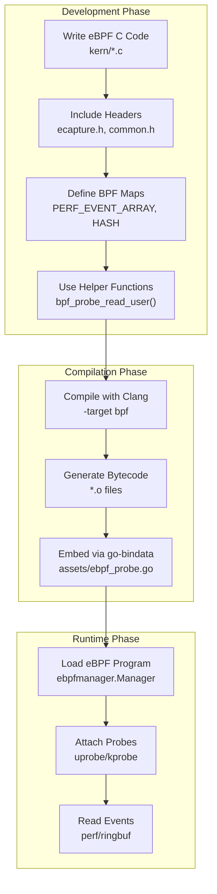
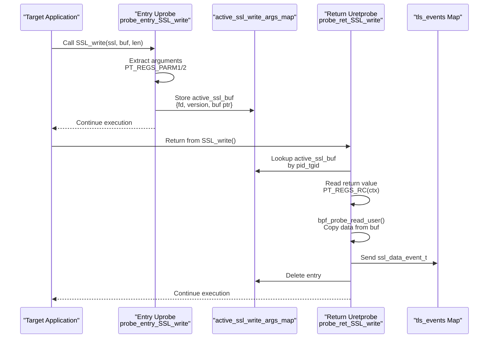
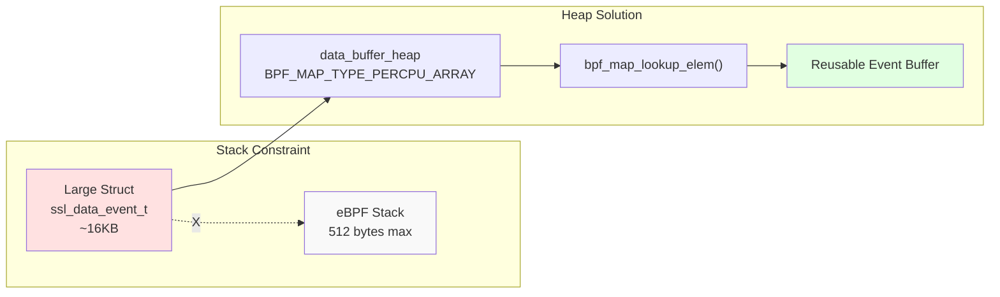

# eBPF Program Development

<details>
<summary>Relevant source files</summary>

The following files were used as context for generating this wiki page:

- [kern/common.h](https://github.com/gojue/ecapture/blob/ca085d05/kern/common.h)
- [kern/ecapture.h](https://github.com/gojue/ecapture/blob/ca085d05/kern/ecapture.h)
- [kern/openssl.h](https://github.com/gojue/ecapture/blob/ca085d05/kern/openssl.h)
- [kern/openssl_masterkey.h](https://github.com/gojue/ecapture/blob/ca085d05/kern/openssl_masterkey.h)
- [kern/openssl_masterkey_3.0.h](https://github.com/gojue/ecapture/blob/ca085d05/kern/openssl_masterkey_3.0.h)
- [kern/tc.h](https://github.com/gojue/ecapture/blob/ca085d05/kern/tc.h)
- [user/module/probe_openssl_keylog.go](https://github.com/gojue/ecapture/blob/ca085d05/user/module/probe_openssl_keylog.go)
- [user/module/probe_openssl_text.go](https://github.com/gojue/ecapture/blob/ca085d05/user/module/probe_openssl_text.go)

</details>


This page provides guidance for developing eBPF programs within eCapture. It covers common patterns, helper functions, memory management strategies, and constraints specific to eBPF programming. For information about eBPF program structure and organization, see [eBPF Program Structure](5.2.1-ebpf-program-structure.md). For details on generating structure offsets for library support, see [Structure Offset Calculation](5.2.2-structure-offset-calculation.md).

## Overview

eCapture's eBPF programs hook into user-space functions (uprobes) and kernel functions (kprobes) to capture TLS traffic, network packets, and system events. All eBPF programs are written in C and located in the `kern/` directory. They are compiled to eBPF bytecode and embedded into the Go binary at build time.

**Key eBPF Program Types:**

| Program Type | Purpose | Examples |
|--------------|---------|----------|
| `uprobe` | Hook user-space function entry | `SSL_write`, `SSL_read` |
| `uretprobe` | Hook user-space function return | Capture function return values |
| `kprobe` | Hook kernel function entry | `tcp_sendmsg`, `__sys_connect` |
| `kretprobe` | Hook kernel function return | `__sys_accept4` |
| `classifier` (TC) | Traffic Control packet filtering | Egress/ingress packet capture |

Sources: [kern/openssl.h:331-351](https://github.com/gojue/ecapture/blob/ca085d05/kern/openssl.h#L331-L351), [kern/tc.h:274-283](https://github.com/gojue/ecapture/blob/ca085d05/kern/tc.h#L274-L283)

## eBPF Development Workflow


```mermaid
graph TB
    subgraph "Development Phase"
        WRITE["Write eBPF C Code<br/>kern/*.c"]
        HEADERS["Include Headers<br/>ecapture.h, common.h"]
        MAPS["Define BPF Maps<br/>PERF_EVENT_ARRAY, HASH"]
        HELPERS["Use Helper Functions<br/>bpf_probe_read_user()"]
    end
    
    subgraph "Compilation Phase"
        CLANG["Compile with Clang<br/>-target bpf"]
        BYTECODE["Generate Bytecode<br/>*.o files"]
        EMBED["Embed via go-bindata<br/>assets/ebpf_probe.go"]
    end
    
    subgraph "Runtime Phase"
        LOAD["Load eBPF Program<br/>ebpfmanager.Manager"]
        ATTACH["Attach Probes<br/>uprobe/kprobe"]
        READ["Read Events<br/>perf/ringbuf"]
    end
    
    WRITE --> HEADERS
    HEADERS --> MAPS
    MAPS --> HELPERS
    HELPERS --> CLANG
    CLANG --> BYTECODE
    BYTECODE --> EMBED
    EMBED --> LOAD
    LOAD --> ATTACH
    ATTACH --> READ
```

Sources: [kern/openssl.h:1-14](https://github.com/gojue/ecapture/blob/ca085d05/kern/openssl.h#L1-L14), [kern/ecapture.h:15-90](https://github.com/gojue/ecapture/blob/ca085d05/kern/ecapture.h#L15-L90)

## Common eBPF Patterns

### Two-Stage Uprobe Pattern

The most common pattern in eCapture is the **two-stage uprobe approach**: an entry probe stores function arguments, and a return probe reads the actual data after the function completes.


```mermaid
sequenceDiagram
    participant App as "Target Application"
    participant Entry as "Entry Uprobe<br/>probe_entry_SSL_write"
    participant Map as "active_ssl_write_args_map"
    participant Ret as "Return Uretprobe<br/>probe_ret_SSL_write"
    participant Event as "tls_events Map"
    
    App->>Entry: Call SSL_write(ssl, buf, len)
    Entry->>Entry: Extract arguments<br/>PT_REGS_PARM1/2
    Entry->>Map: Store active_ssl_buf<br/>{fd, version, buf ptr}
    Entry-->>App: Continue execution
    
    App->>Ret: Return from SSL_write()
    Ret->>Map: Lookup active_ssl_buf<br/>by pid_tgid
    Ret->>Ret: Read return value<br/>PT_REGS_RC(ctx)
    Ret->>Ret: bpf_probe_read_user()<br/>Copy data from buf
    Ret->>Event: Send ssl_data_event_t
    Ret->>Map: Delete entry
    Ret-->>App: Continue execution
```

**Implementation:**

Entry probe stores context:
```c
// kern/openssl.h:268-304
static __inline int probe_entry_SSL(struct pt_regs* ctx, void *map, int bio_offset) {
    void* ssl = (void*)PT_REGS_PARM1(ctx);  // First argument
    const char* buf = (const char*)PT_REGS_PARM2(ctx);  // Second argument
    
    struct active_ssl_buf active_ssl_buf_t;
    active_ssl_buf_t.fd = fd;
    active_ssl_buf_t.buf = buf;
    
    u64 current_pid_tgid = bpf_get_current_pid_tgid();
    bpf_map_update_elem(map, &current_pid_tgid, &active_ssl_buf_t, BPF_ANY);
    return 0;
}
```

Return probe retrieves data:
```c
// kern/openssl.h:306-323
static __inline int probe_ret_SSL(struct pt_regs* ctx, void *map, enum ssl_data_event_type type) {
    u64 current_pid_tgid = bpf_get_current_pid_tgid();
    
    struct active_ssl_buf* active_ssl_buf_t = bpf_map_lookup_elem(map, &current_pid_tgid);
    if (active_ssl_buf_t != NULL) {
        const char* buf;
        bpf_probe_read(&buf, sizeof(const char*), &active_ssl_buf_t->buf);
        process_SSL_data(ctx, current_pid_tgid, type, buf, fd, version, bio_type);
    }
    bpf_map_delete_elem(map, &current_pid_tgid);
    return 0;
}
```

**Why This Pattern?**

1. Function arguments are only available at entry, not at return
2. Return value (bytes written/read) is only available at return
3. Cannot read user-space buffer until function completes (data may not be ready)

Sources: [kern/openssl.h:268-323](https://github.com/gojue/ecapture/blob/ca085d05/kern/openssl.h#L268-L323), [kern/openssl.h:331-351](https://github.com/gojue/ecapture/blob/ca085d05/kern/openssl.h#L331-L351)

### Per-CPU Heap Allocation

eBPF programs have a **512-byte stack limit**. To work with larger structures, eCapture uses per-CPU BPF maps as heap storage.


```mermaid
graph LR
    subgraph "Stack Constraint"
        STACK["eBPF Stack<br/>512 bytes max"]
        LARGE["Large Struct<br/>ssl_data_event_t<br/>~16KB"]
    end
    
    subgraph "Heap Solution"
        HEAP_MAP["data_buffer_heap<br/>BPF_MAP_TYPE_PERCPU_ARRAY"]
        LOOKUP["bpf_map_lookup_elem()"]
        EVENT["Reusable Event Buffer"]
    end
    
    LARGE -.X.-> STACK
    LARGE --> HEAP_MAP
    HEAP_MAP --> LOOKUP
    LOOKUP --> EVENT
    
    style STACK fill:#f9f9f9
    style LARGE fill:#ffe1e1
    style EVENT fill:#e1ffe1
```

**Implementation:**

Map definition:
```c
// kern/openssl.h:113-118
struct {
    __uint(type, BPF_MAP_TYPE_PERCPU_ARRAY);
    __type(key, u32);
    __type(value, struct ssl_data_event_t);
    __uint(max_entries, 1);
} data_buffer_heap SEC(".maps");
```

Helper function:
```c
// kern/openssl.h:141-158
static __inline struct ssl_data_event_t* create_ssl_data_event(u64 current_pid_tgid) {
    u32 kZero = 0;
    struct ssl_data_event_t* event = bpf_map_lookup_elem(&data_buffer_heap, &kZero);
    if (event == NULL) {
        return NULL;
    }
    
    event->timestamp_ns = bpf_ktime_get_ns();
    event->pid = current_pid_tgid >> 32;
    event->tid = current_pid_tgid & kMask32b;
    return event;
}
```

**Key Points:**

- `BPF_MAP_TYPE_PERCPU_ARRAY` provides one instance per CPU
- Key is always 0 (single entry per CPU)
- No race conditions between CPUs
- Memory is reused across invocations

Sources: [kern/openssl.h:113-158](https://github.com/gojue/ecapture/blob/ca085d05/kern/openssl.h#L113-L158), [kern/openssl_masterkey.h:69-78](https://github.com/gojue/ecapture/blob/ca085d05/kern/openssl_masterkey.h#L69-L78)

## BPF Maps Reference

eCapture uses several BPF map types for different purposes:

| Map Name | Type | Purpose | Key | Value |
|----------|------|---------|-----|-------|
| `tls_events` | `PERF_EVENT_ARRAY` | Send SSL data to userspace | CPU ID | - |
| `connect_events` | `PERF_EVENT_ARRAY` | Send connection events | CPU ID | - |
| `active_ssl_read_args_map` | `HASH` | Store SSL_read context | pid_tgid | `active_ssl_buf` |
| `active_ssl_write_args_map` | `HASH` | Store SSL_write context | pid_tgid | `active_ssl_buf` |
| `data_buffer_heap` | `PERCPU_ARRAY` | Large event buffer | 0 | `ssl_data_event_t` |
| `ssl_st_fd` | `HASH` | SSL pointer to FD mapping | ssl_st addr | fd |
| `tcp_fd_infos` | `HASH` | Temporary FD info storage | pid_tgid | `tcp_fd_info` |
| `network_map` | `LRU_HASH` | PID to socket mapping | `net_id_t` | `net_ctx_t` |
| `skb_events` | `PERF_EVENT_ARRAY` | Send packet data | CPU ID | - |

**Map Definition Pattern:**
```c
// kern/openssl.h:79-84
struct {
    __uint(type, BPF_MAP_TYPE_PERF_EVENT_ARRAY);
    __uint(key_size, sizeof(u32));
    __uint(value_size, sizeof(u32));
    __uint(max_entries, 1024);
} tls_events SEC(".maps");
```

Sources: [kern/openssl.h:79-135](https://github.com/gojue/ecapture/blob/ca085d05/kern/openssl.h#L79-L135), [kern/tc.h:57-77](https://github.com/gojue/ecapture/blob/ca085d05/kern/tc.h#L57-L77)

## Memory Access Patterns

### Reading User-Space Memory

Use `bpf_probe_read_user()` to safely read from user-space pointers:

```c
// kern/openssl.h:186
bpf_probe_read_user(event->data, event->data_len, buf);
```

### Reading Kernel-Space Memory

Use `bpf_probe_read_kernel()` or `bpf_probe_read()` for kernel memory:

```c
// kern/openssl.h:409
bpf_probe_read_kernel(&address_family, sizeof(address_family), &sk->__sk_common.skc_family);
```

### Pointer Chasing

When following multiple pointer dereferences, read each level separately:

```c
// kern/openssl.h:232-241
// Get ssl->bio pointer
ssl_bio_ptr = (u64 *)(ssl + bio_offset);
ret = bpf_probe_read_user(&ssl_bio_addr, sizeof(ssl_bio_addr), ssl_bio_ptr);

// Get ssl->bio->num
ssl_bio_num_ptr = (u64 *)(ssl_bio_addr + BIO_ST_NUM);
ret = bpf_probe_read_user(&ssl_bio_num_addr, sizeof(ssl_bio_num_addr), ssl_bio_num_ptr);
```

**Important:** Never dereference user-space pointers directly. Always use `bpf_probe_read_*()` helpers.

Sources: [kern/openssl.h:186-266](https://github.com/gojue/ecapture/blob/ca085d05/kern/openssl.h#L186-L266)

## Filtering and Context

### PID/UID Filtering

eCapture supports filtering by PID and UID using global constants:

```c
// kern/common.h:66-70
const volatile u64 target_pid = 0;
const volatile u64 target_uid = 0;
```

Filter helper:
```c
// kern/ecapture.h:93-105
static __inline bool filter_rejects(u32 pid, u32 uid) {
    if (less52 == 1) {
        return false;  // Filtering disabled for kernel < 5.2
    }
    if (target_pid != 0 && target_pid != pid) {
        return true;
    }
    if (target_uid != 0 && target_uid != uid) {
        return true;
    }
    return false;
}
```

Usage in probe:
```c
// kern/openssl.h:269-271
if (!passes_filter(ctx)) {
    return 0;
}
```

Sources: [kern/ecapture.h:93-127](https://github.com/gojue/ecapture/blob/ca085d05/kern/ecapture.h#L93-L127), [kern/common.h:66-70](https://github.com/gojue/ecapture/blob/ca085d05/kern/common.h#L66-L70)

### Context Extraction

Common context information:

| Information | Helper Function | Notes |
|-------------|----------------|-------|
| PID/TID | `bpf_get_current_pid_tgid()` | Upper 32 bits = PID, lower 32 bits = TID |
| UID/GID | `bpf_get_current_uid_gid()` | Upper 32 bits = GID, lower 32 bits = UID |
| Process name | `bpf_get_current_comm()` | Max 16 characters (TASK_COMM_LEN) |
| Timestamp | `bpf_ktime_get_ns()` | Nanoseconds since boot |

```c
// kern/openssl.h:151-153
event->timestamp_ns = bpf_ktime_get_ns();
event->pid = current_pid_tgid >> 32;
event->tid = current_pid_tgid & kMask32b;
```

Sources: [kern/openssl.h:151-157](https://github.com/gojue/ecapture/blob/ca085d05/kern/openssl.h#L151-L157), [kern/common.h:28](https://github.com/gojue/ecapture/blob/ca085d05/kern/common.h#L28)

## Data Structure Patterns

### Event Structures

All events sent to userspace follow a consistent pattern:

```c
// kern/openssl.h:28-39
struct ssl_data_event_t {
    enum ssl_data_event_type type;  // kSSLRead or kSSLWrite
    u64 timestamp_ns;
    u32 pid;
    u32 tid;
    char data[MAX_DATA_SIZE_OPENSSL];  // 16KB payload
    s32 data_len;
    char comm[TASK_COMM_LEN];
    u32 fd;
    s32 version;
    u32 bio_type;
};
```

**Design Principles:**

1. Fixed-size structures (no pointers in userspace-bound events)
2. Timestamp for ordering
3. PID/TID for identification
4. Inline data arrays (not pointers)
5. Packed when necessary: `__attribute__((packed))`

Sources: [kern/openssl.h:28-55](https://github.com/gojue/ecapture/blob/ca085d05/kern/openssl.h#L28-L55)

### Connection Tracking Structures

```c
// kern/openssl.h:41-55
struct connect_event_t {
    unsigned __int128 saddr;
    unsigned __int128 daddr;
    char comm[TASK_COMM_LEN];
    u64 timestamp_ns;
    u64 sock;
    u32 pid;
    u32 tid;
    u32 fd;
    u16 family;
    u16 sport;
    u16 dport;
    u8 is_destroy;
    u8 pad[7];
} __attribute__((packed));  // Prevent padding holes
```

Sources: [kern/openssl.h:41-55](https://github.com/gojue/ecapture/blob/ca085d05/kern/openssl.h#L41-L55)

## Sending Events to Userspace

Use `bpf_perf_event_output()` or `bpf_ringbuf_output()` to send events:

```c
// kern/openssl.h:188-189
bpf_perf_event_output(ctx, &tls_events, BPF_F_CURRENT_CPU, event,
                      sizeof(struct ssl_data_event_t));
```

**Parameters:**

- `ctx`: Program context (pt_regs or sk_buff)
- `map`: PERF_EVENT_ARRAY or RINGBUF map
- `flags`: `BPF_F_CURRENT_CPU` for perf events
- `data`: Pointer to event structure
- `size`: Size of event structure

**For TC programs with packet data:**
```c
// kern/tc.h:255-266
u64 flags = BPF_F_CURRENT_CPU;
flags |= (u64)skb->len << 32;  // Encode packet length in flags

bpf_perf_event_output(skb, &skb_events, flags, &event, pkt_size);
```

Sources: [kern/openssl.h:188-189](https://github.com/gojue/ecapture/blob/ca085d05/kern/openssl.h#L188-L189), [kern/tc.h:255-266](https://github.com/gojue/ecapture/blob/ca085d05/kern/tc.h#L255-L266)

## Debugging Techniques

### Debug Printing

Use the `debug_bpf_printk` macro for conditional debugging:

```c
// kern/common.h:18-26
#ifdef DEBUG_PRINT
#define debug_bpf_printk(fmt, ...)                     \
    do {                                               \
        char s[] = fmt;                                \
        bpf_trace_printk(s, sizeof(s), ##__VA_ARGS__); \
    } while (0)
#else
#define debug_bpf_printk(fmt, ...)
#endif
```

Usage:
```c
debug_bpf_printk("SSL_write fd: %d, version: %d\n", fd, ssl_version);
```

View output:
```bash
cat /sys/kernel/debug/tracing/trace_pipe
```

**Note:** `bpf_trace_printk()` has format string limitations and performance impact. Use only during development.

Sources: [kern/common.h:18-26](https://github.com/gojue/ecapture/blob/ca085d05/kern/common.h#L18-L26)

### Error Handling

Always check return values from BPF helpers:

```c
// kern/openssl.h:280-283
ret = bpf_probe_read_user(&ssl_version, sizeof(ssl_version), (void *)ssl_ver_ptr);
if (ret) {
    debug_bpf_printk("(OPENSSL) bpf_probe_read ssl_ver_ptr failed, ret: %d\n", ret);
}
```

Common error codes:
- `-EFAULT`: Invalid memory access
- `-EINVAL`: Invalid argument
- `-E2BIG`: Size too large

Sources: [kern/openssl.h:280-283](https://github.com/gojue/ecapture/blob/ca085d05/kern/openssl.h#L280-L283)

## CO-RE vs Non-CO-RE Considerations

eCapture supports both CO-RE (Compile Once, Run Everywhere) and non-CO-RE modes.

### CO-RE Mode

```c
// kern/ecapture.h:18-25
#ifndef NOCORE
// CO-RE is enabled
#include "vmlinux.h"
#include "bpf/bpf_core_read.h"
#include "bpf/bpf_helpers.h"
#include "bpf/bpf_tracing.h"
#include "bpf/bpf_endian.h"
#include "core_fixes.bpf.h"
```

Benefits:
- Portable across kernel versions
- Uses BTF (BPF Type Format) information
- Requires kernel 5.2+ with BTF enabled

### Non-CO-RE Mode

```c
// kern/ecapture.h:27-73
#else
// CO-RE is disabled
#include <linux/kconfig.h>
#include <linux/types.h>
#include <uapi/linux/ptrace.h>
#include <linux/bpf.h>
#include <linux/socket.h>
#include <net/sock.h>
```

Benefits:
- Works on older kernels
- No BTF requirement
- Requires kernel headers at compile time

**Development Tip:** Write code compatible with both modes when possible. The build system handles conditional compilation.

Sources: [kern/ecapture.h:18-88](https://github.com/gojue/ecapture/blob/ca085d05/kern/ecapture.h#L18-L88)

## Common Pitfalls

### Stack Overflow

❌ **Don't allocate large structures on stack:**
```c
struct ssl_data_event_t event;  // 16KB+ - stack overflow!
```

✅ **Do use per-CPU heap maps:**
```c
struct ssl_data_event_t* event = create_ssl_data_event(id);
```

### Unbounded Loops

❌ **Don't use unbounded loops:**
```c
while (condition) { ... }  // Verifier will reject
```

✅ **Do use bounded loops with `#pragma unroll`:**
```c
#pragma unroll
for (int i = 0; i < 32; i++) { ... }  // Max iterations known
```

### Direct Pointer Dereference

❌ **Don't dereference user pointers directly:**
```c
u32 value = *user_ptr;  // Crash or rejected by verifier
```

✅ **Do use bpf_probe_read_user():**
```c
u32 value;
bpf_probe_read_user(&value, sizeof(value), user_ptr);
```

### Missing Null Checks

❌ **Don't assume map lookups succeed:**
```c
struct data *d = bpf_map_lookup_elem(&map, &key);
d->field = value;  // Crash if d is NULL
```

✅ **Do check for NULL:**
```c
struct data *d = bpf_map_lookup_elem(&map, &key);
if (d != NULL) {
    d->field = value;
}
```

## Integration with Userspace

### Defining Probes in Go

Probes are registered in the module's setup function:

```go
// user/module/probe_openssl_text.go:47-72
m.bpfManager = &manager.Manager{
    Probes: []*manager.Probe{
        {
            Section:          "uprobe/SSL_write",
            EbpfFuncName:     "probe_entry_SSL_write",
            AttachToFuncName: "SSL_write",
            BinaryPath:       binaryPath,
        },
        {
            Section:          "uretprobe/SSL_write",
            EbpfFuncName:     "probe_ret_SSL_write",
            AttachToFuncName: "SSL_write",
            BinaryPath:       binaryPath,
        },
    ],
}
```

Sources: [user/module/probe_openssl_text.go:46-164](https://github.com/gojue/ecapture/blob/ca085d05/user/module/probe_openssl_text.go#L46-L164)

### Constant Editors for Runtime Configuration

Global constants can be set from userspace:

```go
// Set target PID at runtime
m.bpfManagerOptions.ConstantEditors = []manager.ConstantEditor{
    {
        Name:  "target_pid",
        Value: uint64(config.Pid),
    },
}
```

**Note:** Only works on kernel 5.2+ where global variables are supported.

Sources: [user/module/probe_openssl_text.go:181-186](https://github.com/gojue/ecapture/blob/ca085d05/user/module/probe_openssl_text.go#L181-L186)

## Testing and Verification

### Verifier Logs

If the verifier rejects your program, check the logs:

```go
// user/module/probe_openssl_text.go:169-173
VerifierOptions: ebpf.CollectionOptions{
    Programs: ebpf.ProgramOptions{
        LogSizeStart: 2097152,  // 2MB log buffer
    },
},
```

### Testing Checklist

- [ ] Check all `bpf_probe_read_*()` return values
- [ ] Verify stack usage < 512 bytes
- [ ] Confirm loops are bounded
- [ ] Test with target_pid/target_uid filters
- [ ] Verify event structures are packed correctly
- [ ] Check for NULL after map lookups
- [ ] Test on both CO-RE and non-CO-RE builds

Sources: [user/module/probe_openssl_text.go:166-179](https://github.com/gojue/ecapture/blob/ca085d05/user/module/probe_openssl_text.go#L166-L179)

---

This guide covers the essential patterns and constraints for eBPF development in eCapture. For details on how eBPF programs are structured and organized, see [eBPF Program Structure](5.2.1-ebpf-program-structure.md). For information on supporting new library versions through offset generation, see [Structure Offset Calculation](5.2.2-structure-offset-calculation.md).