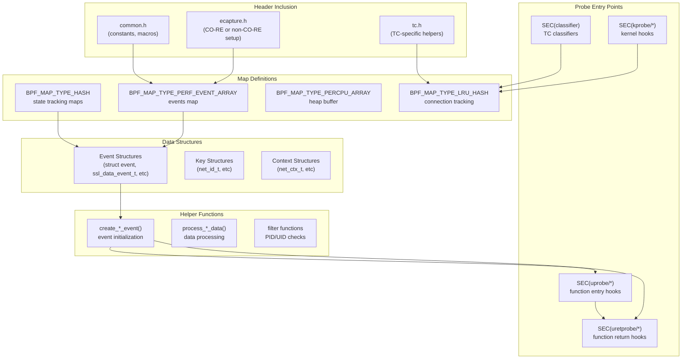
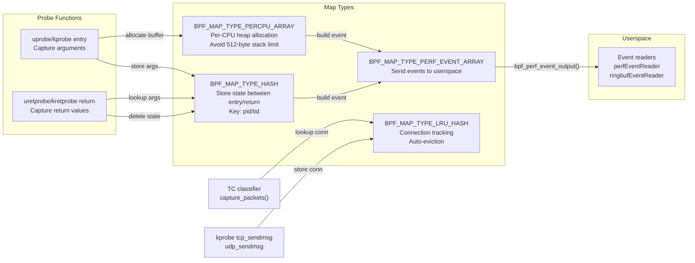
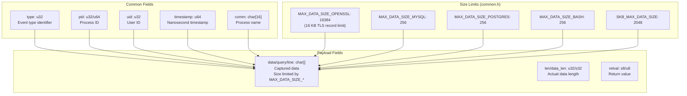
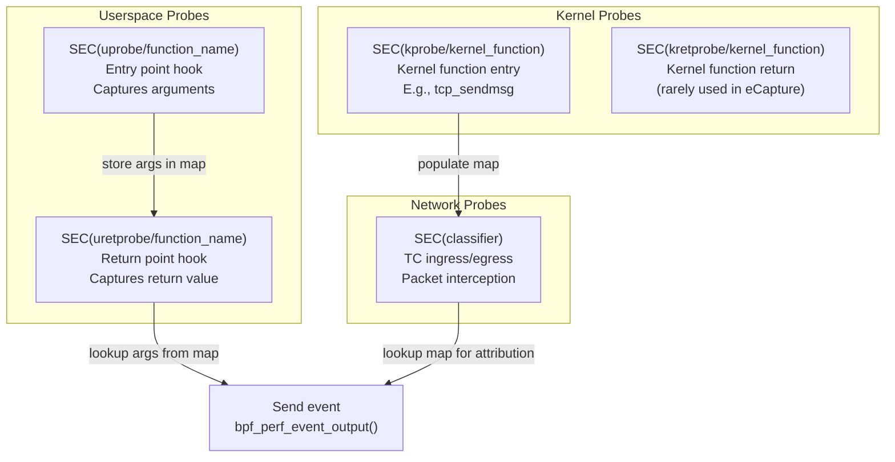
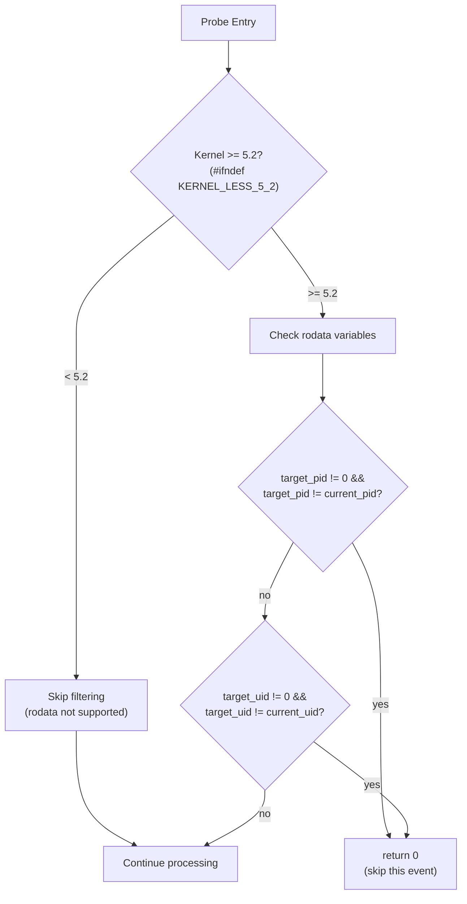

# eBPF Program Structure

<details>
<summary>Relevant source files</summary>

The following files were used as context for generating this wiki page:

- [kern/bash_kern.c](https://github.com/gojue/ecapture/blob/0766a93b/kern/bash_kern.c)
- [kern/common.h](https://github.com/gojue/ecapture/blob/0766a93b/kern/common.h)
- [kern/ecapture.h](https://github.com/gojue/ecapture/blob/0766a93b/kern/ecapture.h)
- [kern/mysqld_kern.c](https://github.com/gojue/ecapture/blob/0766a93b/kern/mysqld_kern.c)
- [kern/nspr_kern.c](https://github.com/gojue/ecapture/blob/0766a93b/kern/nspr_kern.c)
- [kern/postgres_kern.c](https://github.com/gojue/ecapture/blob/0766a93b/kern/postgres_kern.c)
- [kern/tc.h](https://github.com/gojue/ecapture/blob/0766a93b/kern/tc.h)

</details>


This page documents the common structural patterns, conventions, and mechanisms used in eCapture's eBPF programs. It covers map types, probe attachment strategies, event structures, filtering patterns, and data export mechanisms that are shared across all capture modules.

For information about building and compiling eBPF programs, see [Build System](5.1-build-system.md). For guidance on calculating structure offsets for library-specific hooks, see [Structure Offset Calculation](5.2.2-structure-offset-calculation.md). For information about creating new modules that use eBPF programs, see [Adding New Modules](5.3-adding-new-modules.md).

## eBPF Program Anatomy

All eBPF programs in eCapture follow a common structure consisting of header inclusion, map definitions, event structures, helper functions, and probe entry points. The following diagram illustrates this standard anatomy:



Sources: [kern/ecapture.h](https://github.com/gojue/ecapture/blob/0766a93b/kern/ecapture.h), [kern/common.h](https://github.com/gojue/ecapture/blob/0766a93b/kern/common.h), [kern/bash_kern.c](https://github.com/gojue/ecapture/blob/0766a93b/kern/bash_kern.c), [kern/nspr_kern.c](https://github.com/gojue/ecapture/blob/0766a93b/kern/nspr_kern.c), [kern/mysqld_kern.c](https://github.com/gojue/ecapture/blob/0766a93b/kern/mysqld_kern.c), [kern/postgres_kern.c](https://github.com/gojue/ecapture/blob/0766a93b/kern/postgres_kern.c), [kern/tc.h](https://github.com/gojue/ecapture/blob/0766a93b/kern/tc.h)

## Header Files and Compilation Modes

eCapture supports two eBPF compilation modes: CO-RE (Compile Once - Run Everywhere) and non-CO-RE. The mode is determined by the presence of the `NOCORE` preprocessor define.

### CO-RE Mode (BTF-enabled)

When CO-RE is enabled (no `NOCORE` define), programs use:
- `vmlinux.h` - kernel type definitions from BTF
- `bpf/bpf_core_read.h` - CO-RE field access macros
- `core_fixes.bpf.h` - workarounds for kernel compatibility issues

### Non-CO-RE Mode (Traditional)

When `NOCORE` is defined, programs use:
- Kernel headers from the build system
- Traditional `bpf_probe_read()` helpers
- Architecture-specific structure definitions

Both modes include:
- `bpf/bpf_helpers.h` - BPF helper function declarations
- `bpf/bpf_tracing.h` - tracing macros like `PT_REGS_PARM*`
- `bpf/bpf_endian.h` - endianness conversion helpers

**Header Inclusion Pattern:**

```
ecapture.h includes:
├── CO-RE mode (#ifndef NOCORE)
│   ├── vmlinux.h
│   ├── bpf/bpf_core_read.h
│   ├── bpf/bpf_helpers.h
│   ├── bpf/bpf_tracing.h
│   ├── bpf/bpf_endian.h
│   └── core_fixes.bpf.h
├── Non-CO-RE mode (#ifdef NOCORE)
│   ├── linux/types.h
│   ├── uapi/linux/ptrace.h
│   ├── linux/bpf.h
│   ├── linux/socket.h
│   ├── net/sock.h
│   ├── bpf/bpf_helpers.h
│   ├── bpf/bpf_tracing.h
│   ├── bpf/bpf_endian.h
│   └── uapi/linux/pkt_cls.h (for TC programs)
└── common.h (always included)
```

Sources: [kern/ecapture.h:15-93](https://github.com/gojue/ecapture/blob/0766a93b/kern/ecapture.h#L15-L93), [kern/common.h:15-85](https://github.com/gojue/ecapture/blob/0766a93b/kern/common.h#L15-L85)

## Map Types and Usage Patterns

eCapture eBPF programs use several BPF map types, each serving a specific purpose in the data flow from kernel to userspace.



### BPF_MAP_TYPE_PERF_EVENT_ARRAY

Used for sending captured events from kernel to userspace. Each module defines one or more perf event arrays:

| Module | Map Name | Event Type |
|--------|----------|------------|
| bash | `events` | `struct event` |
| nspr | `nspr_events` | `struct ssl_data_event_t` |
| mysqld | `events` | `struct data_t` |
| postgres | `events` | `struct data_t` |
| tc | `skb_events` | `struct skb_data_event_t` |

**Definition Pattern:**
```c
struct {
    __uint(type, BPF_MAP_TYPE_PERF_EVENT_ARRAY);
    __uint(key_size, sizeof(u32));
    __uint(value_size, sizeof(u32));
    __uint(max_entries, 1024);
} events SEC(".maps");
```

Sources: [kern/bash_kern.c:26-31](https://github.com/gojue/ecapture/blob/0766a93b/kern/bash_kern.c#L26-L31), [kern/nspr_kern.c:29-34](https://github.com/gojue/ecapture/blob/0766a93b/kern/nspr_kern.c#L29-L34), [kern/mysqld_kern.c:36-41](https://github.com/gojue/ecapture/blob/0766a93b/kern/mysqld_kern.c#L36-L41), [kern/postgres_kern.c:24-29](https://github.com/gojue/ecapture/blob/0766a93b/kern/postgres_kern.c#L24-L29), [kern/tc.h:57-62](https://github.com/gojue/ecapture/blob/0766a93b/kern/tc.h#L57-L62)

### BPF_MAP_TYPE_HASH

Used for storing state between probe entry and return, typically mapping thread ID to captured arguments:

**Common Pattern - Argument Storage:**
```c
// Store buffer pointer at function entry
struct {
    __uint(type, BPF_MAP_TYPE_HASH);
    __type(key, u64);              // pid_tgid
    __type(value, const char*);    // buffer pointer
    __uint(max_entries, 1024);
} active_ssl_read_args_map SEC(".maps");

// Store complete event for return value tracking
struct {
    __uint(type, BPF_MAP_TYPE_HASH);
    __type(key, u32);              // pid
    __type(value, struct event);
    __uint(max_entries, 1024);
} events_t SEC(".maps");
```

**Lifecycle Pattern:**
1. Entry probe: `bpf_map_update_elem(&map, &key, &value, BPF_ANY)`
2. Return probe: `bpf_map_lookup_elem(&map, &key)`
3. Return probe: `bpf_map_delete_elem(&map, &key)` (cleanup)

Sources: [kern/nspr_kern.c:41-53](https://github.com/gojue/ecapture/blob/0766a93b/kern/nspr_kern.c#L41-L53), [kern/bash_kern.c:33-38](https://github.com/gojue/ecapture/blob/0766a93b/kern/bash_kern.c#L33-L38), [kern/mysqld_kern.c:29-34](https://github.com/gojue/ecapture/blob/0766a93b/kern/mysqld_kern.c#L29-L34)

### BPF_MAP_TYPE_PERCPU_ARRAY

Used as a per-CPU heap to avoid the 512-byte BPF stack limit. Allows allocating large event structures:

```c
struct {
    __uint(type, BPF_MAP_TYPE_PERCPU_ARRAY);
    __type(key, u32);
    __type(value, struct ssl_data_event_t);  // Can be > 512 bytes
    __uint(max_entries, 1);
} data_buffer_heap SEC(".maps");

// Usage in helper function:
static __inline struct ssl_data_event_t* create_ssl_data_event(u64 current_pid_tgid) {
    u32 kZero = 0;
    struct ssl_data_event_t* event = bpf_map_lookup_elem(&data_buffer_heap, &kZero);
    if (event == NULL) {
        return NULL;
    }
    // Initialize event fields...
    return event;
}
```

Sources: [kern/nspr_kern.c:57-62,68-80](), [kern/tc.h:64-69,92-100]()

### BPF_MAP_TYPE_LRU_HASH

Used for connection tracking in TC programs. Automatically evicts least-recently-used entries when full:

```c
struct {
    __uint(type, BPF_MAP_TYPE_LRU_HASH);
    __type(key, struct net_id_t);      // 4-tuple + protocol
    __type(value, struct net_ctx_t);    // pid, uid, comm
    __uint(max_entries, 10240);
} network_map SEC(".maps");
```

This map is populated by kprobes on `tcp_sendmsg`/`udp_sendmsg` and queried by TC classifiers to attribute packets to processes.

Sources: [kern/tc.h:72-77,290-347,349-397]()

## Event Structures

Each eBPF program defines event structures that match the data captured. These structures have size constraints based on the data they carry.

### Event Structure Pattern



### Event Structure Examples

| Module | Structure | Data Field | Max Size |
|--------|-----------|------------|----------|
| bash | `struct event` | `line[256]` | 256 bytes |
| nspr | `struct ssl_data_event_t` | `data[16384]` | 16 KB |
| mysqld | `struct data_t` | `query[256]` | 256 bytes |
| postgres | `struct data_t` | `query[256]` | 256 bytes |
| tc | `struct skb_data_event_t` | (no data, uses perf flags) | 36 bytes (header only) |

**Size Rationale:**
- TLS/SSL modules use `MAX_DATA_SIZE_OPENSSL` (16384) to accommodate maximum TLS record size per RFC 5246
- Database modules use smaller buffers (256) since only query text is captured
- Shell modules use 256 bytes for command lines
- TC module sends minimal metadata and uses `bpf_perf_event_output()` flags to include packet data

Sources: [kern/common.h:28-43](https://github.com/gojue/ecapture/blob/0766a93b/kern/common.h#L28-L43), [kern/bash_kern.c:17-24](https://github.com/gojue/ecapture/blob/0766a93b/kern/bash_kern.c#L17-L24), [kern/nspr_kern.c:19-27](https://github.com/gojue/ecapture/blob/0766a93b/kern/nspr_kern.c#L19-L27), [kern/mysqld_kern.c:19-27](https://github.com/gojue/ecapture/blob/0766a93b/kern/mysqld_kern.c#L19-L27), [kern/postgres_kern.c:17-22](https://github.com/gojue/ecapture/blob/0766a93b/kern/postgres_kern.c#L17-L22), [kern/tc.h:30-37](https://github.com/gojue/ecapture/blob/0766a93b/kern/tc.h#L30-L37)

## Probe Attachment and SEC() Macros

The `SEC()` macro defines the probe type and attachment point. eCapture uses four primary probe types:



### Uprobe/Uretprobe Pattern

Most eCapture modules follow the entry/return probe pair pattern:

```
Entry Probe (uprobe):
1. Extract function arguments using PT_REGS_PARM* macros
2. Store arguments in hash map (key: pid/tid)
3. Optionally: filter by PID/UID
4. Return

Return Probe (uretprobe):
1. Extract return value using PT_REGS_RC()
2. Lookup stored arguments from hash map
3. Combine arguments + return value into event
4. Send event via bpf_perf_event_output()
5. Delete map entry for cleanup
```

**Example - NSPR SSL_write:**
- Entry: `SEC("uprobe/PR_Write")` stores buffer pointer
- Return: `SEC("uretprobe/PR_Write")` reads buffer content and length

Sources: [kern/nspr_kern.c:114-162](https://github.com/gojue/ecapture/blob/0766a93b/kern/nspr_kern.c#L114-L162)

**Example - Bash readline:**
- Entry: Not hooked (function pointer from readline library)
- Return: `SEC("uretprobe/bash_readline")` captures returned string
- Additional: `SEC("uretprobe/bash_retval")` captures command exit status

Sources: [kern/bash_kern.c:42-112](https://github.com/gojue/ecapture/blob/0766a93b/kern/bash_kern.c#L42-L112)

### Kprobe Usage

eCapture uses kprobes primarily for connection tracking, not data capture:

```c
SEC("kprobe/tcp_sendmsg")
int tcp_sendmsg(struct pt_regs *ctx) {
    // Extract socket structure
    struct sock *sk = (struct sock *)PT_REGS_PARM1(ctx);
    
    // Read connection 4-tuple from socket
    bpf_probe_read(&family, sizeof(family), &sk->__sk_common.skc_family);
    bpf_probe_read(&lport, sizeof(lport), &sk->__sk_common.skc_num);
    bpf_probe_read(&dport, sizeof(dport), &sk->__sk_common.skc_dport);
    bpf_probe_read(&src_ip4, sizeof(src_ip4), &sk->__sk_common.skc_rcv_saddr);
    bpf_probe_read(&dst_ip4, sizeof(dst_ip4), &sk->__sk_common.skc_daddr);
    
    // Store pid/uid/comm associated with connection
    struct net_ctx_t net_ctx = {.pid = pid, .uid = uid};
    bpf_get_current_comm(&net_ctx.comm, sizeof(net_ctx.comm));
    bpf_map_update_elem(&network_map, &conn_id, &net_ctx, BPF_ANY);
}
```

The same pattern is used for `udp_sendmsg`. The TC classifier later uses this map to attribute packets to processes.

Sources: [kern/tc.h:290-347,349-397]()

### TC Classifier Pattern

TC classifiers (`SEC("classifier")`) are attached to network interfaces for packet capture:

```c
SEC("classifier")
int egress_cls_func(struct __sk_buff *skb) {
    return capture_packets(skb, false);  // false = egress
}

SEC("classifier")
int ingress_cls_func(struct __sk_buff *skb) {
    return capture_packets(skb, true);   // true = ingress
}
```

The `capture_packets()` function:
1. Parses Ethernet, IP, and TCP/UDP headers
2. Extracts 4-tuple (src_ip, dst_ip, src_port, dst_port)
3. Looks up connection in `network_map` (populated by kprobes)
4. Applies PID/UID filters if connection found
5. Sends packet metadata + data via `bpf_perf_event_output()`

Sources: [kern/tc.h:135-289](https://github.com/gojue/ecapture/blob/0766a93b/kern/tc.h#L135-L289)

## PID/UID Filtering

eCapture supports optional filtering by process ID and user ID. The filtering mechanism depends on kernel version:



### Read-Only Data Variables (Kernel >= 5.2)

For kernels that support BTF and rodata, filter targets are defined as constants in `common.h`:

```c
#ifndef KERNEL_LESS_5_2
const volatile u64 target_pid = 0;  // 0 = capture all processes
const volatile u64 target_uid = 0;  // 0 = capture all users
const volatile u64 target_errno = BASH_ERRNO_DEFAULT;
#endif
```

These variables are marked `const volatile` so the BPF verifier can optimize them but userspace can still modify them before program loading. When set to 0, no filtering is applied.

Sources: [kern/common.h:64-71](https://github.com/gojue/ecapture/blob/0766a93b/kern/common.h#L64-L71)

### Filter Application Pattern

Standard filtering code appears in every probe:

```c
u64 current_pid_tgid = bpf_get_current_pid_tgid();
u32 pid = current_pid_tgid >> 32;
u64 current_uid_gid = bpf_get_current_uid_gid();
u32 uid = current_uid_gid;

#ifndef KERNEL_LESS_5_2
    if (target_pid != 0 && target_pid != pid) {
        return 0;  // Skip this event
    }
    if (target_uid != 0 && target_uid != uid) {
        return 0;  // Skip this event
    }
#endif
```

The filter checks are omitted for kernels < 5.2 (when `KERNEL_LESS_5_2` is defined during compilation).

Sources: [kern/bash_kern.c:44-57](https://github.com/gojue/ecapture/blob/0766a93b/kern/bash_kern.c#L44-L57), [kern/nspr_kern.c:116-130](https://github.com/gojue/ecapture/blob/0766a93b/kern/nspr_kern.c#L116-L130), [kern/mysqld_kern.c:64-77](https://github.com/gojue/ecapture/blob/0766a93b/kern/mysqld_kern.c#L64-L77), [kern/postgres_kern.c:37-49](https://github.com/gojue/ecapture/blob/0766a93b/kern/postgres_kern.c#L37-L49)

### Special Case - Bash Return Value Filtering

The bash module includes an additional filter for command exit codes:

```c
#ifndef KERNEL_LESS_5_2
    if (target_errno != BASH_ERRNO_DEFAULT && target_errno != retval) {
        // Command exit code doesn't match target
        if (event_p) {
            // Send event with default errno to indicate mismatch
            event_p->retval = BASH_ERRNO_DEFAULT;
            event_p->type = BASH_EVENT_TYPE_RETVAL;
            bpf_perf_event_output(ctx, &events, BPF_F_CURRENT_CPU, event_p, 
                                  sizeof(struct event));
            bpf_map_delete_elem(&events_t, &pid);
        }
        return 0;
    }
#endif
```

When `target_errno` is set to a value other than `BASH_ERRNO_DEFAULT` (128), only commands with that exit code are fully captured.

Sources: [kern/bash_kern.c:79-102](https://github.com/gojue/ecapture/blob/0766a93b/kern/bash_kern.c#L79-L102), [kern/common.h:51,69]()

## Data Extraction Patterns

eCapture uses different BPF helpers to read data depending on the source location.

### Reading from User Space

For data in userspace memory (function arguments, buffers):

```c
// Read into local variable
char buf[256];
bpf_probe_read_user(buf, sizeof(buf), user_ptr);

// Read into event structure
bpf_probe_read_user(&event.data, event.data_len, buf_ptr);

// Read struct members
struct COM_QUERY_DATA query;
bpf_probe_read_user(&query, sizeof(query), st);
bpf_probe_read_user(&data.query, sizeof(data.query), query.query);
```

Sources: [kern/bash_kern.c:64](https://github.com/gojue/ecapture/blob/0766a93b/kern/bash_kern.c#L64), [kern/nspr_kern.c:101](https://github.com/gojue/ecapture/blob/0766a93b/kern/nspr_kern.c#L101), [kern/mysqld_kern.c:214-216](https://github.com/gojue/ecapture/blob/0766a93b/kern/mysqld_kern.c#L214-L216)

### Reading from Kernel Space

For kernel structures (sockets, tasks):

```c
// Read socket family
u16 family;
bpf_probe_read(&family, sizeof(family), &sk->__sk_common.skc_family);

// Read IP addresses
u32 src_ip4, dst_ip4;
bpf_probe_read(&src_ip4, sizeof(src_ip4), &sk->__sk_common.skc_rcv_saddr);
bpf_probe_read(&dst_ip4, sizeof(dst_ip4), &sk->__sk_common.skc_daddr);

// CO-RE alternative (when BTF available):
family = BPF_CORE_READ(sk, __sk_common.skc_family);
```

Sources: [kern/tc.h:311-336](https://github.com/gojue/ecapture/blob/0766a93b/kern/tc.h#L311-L336)

### Reading from pt_regs

Function arguments and return values are extracted from `struct pt_regs`:

```c
// Function arguments (x86_64):
void *arg1 = (void *)PT_REGS_PARM1(ctx);
void *arg2 = (void *)PT_REGS_PARM2(ctx);
void *arg3 = (void *)PT_REGS_PARM3(ctx);
u64 arg4 = (u64)PT_REGS_PARM4(ctx);

// Return value:
int retval = (int)PT_REGS_RC(ctx);
```

The `PT_REGS_PARM*` and `PT_REGS_RC` macros are architecture-aware and defined in `bpf/bpf_tracing.h`. They abstract register access for x86_64, aarch64, etc.

Sources: [kern/bash_kern.c:64,77](), [kern/nspr_kern.c:87,132](), [kern/mysqld_kern.c:59,79]()

### Getting Process Information

Standard helpers for retrieving process context:

```c
// Get PID and TID
u64 pid_tgid = bpf_get_current_pid_tgid();
u32 pid = pid_tgid >> 32;
u32 tid = pid_tgid & 0xFFFFFFFF;

// Get UID and GID
u64 uid_gid = bpf_get_current_uid_gid();
u32 uid = uid_gid;
u32 gid = uid_gid >> 32;

// Get process name
char comm[TASK_COMM_LEN];  // TASK_COMM_LEN = 16
bpf_get_current_comm(&comm, sizeof(comm));

// Get timestamp
u64 timestamp_ns = bpf_ktime_get_ns();
```

Sources: [kern/bash_kern.c:44-46,65](), [kern/nspr_kern.c:76-78](https://github.com/gojue/ecapture/blob/0766a93b/kern/nspr_kern.c#L76-L78)

## Helper Functions

eBPF programs define helper functions to avoid code duplication and stay within the BPF complexity limits.

### Event Creation Helpers

Allocate events from per-CPU heap and initialize common fields:

```c
static __inline struct ssl_data_event_t* create_ssl_data_event(u64 current_pid_tgid) {
    u32 kZero = 0;
    struct ssl_data_event_t* event = bpf_map_lookup_elem(&data_buffer_heap, &kZero);
    if (event == NULL) {
        return NULL;
    }
    
    const u32 kMask32b = 0xffffffff;
    event->timestamp_ns = bpf_ktime_get_ns();
    event->pid = current_pid_tgid >> 32;
    event->tid = current_pid_tgid & kMask32b;
    return event;
}
```

Sources: [kern/nspr_kern.c:68-80](https://github.com/gojue/ecapture/blob/0766a93b/kern/nspr_kern.c#L68-L80), [kern/tc.h:92-100](https://github.com/gojue/ecapture/blob/0766a93b/kern/tc.h#L92-L100)

### Data Processing Helpers

Centralize common processing logic:

```c
static int process_SSL_data(struct pt_regs* ctx, u64 id, 
                           enum ssl_data_event_type type, const char* buf) {
    // Get return value (bytes read/written)
    int len = (int)PT_REGS_RC(ctx);
    if (len < 0) {
        return 0;
    }
    
    // Create event
    struct ssl_data_event_t* event = create_ssl_data_event(id);
    if (event == NULL) {
        return 0;
    }
    
    // Fill event fields
    event->type = type;
    event->data_len = (len < MAX_DATA_SIZE_OPENSSL ? 
                       (len & (MAX_DATA_SIZE_OPENSSL - 1)) : 
                       MAX_DATA_SIZE_OPENSSL);
    bpf_probe_read_user(event->data, event->data_len, buf);
    bpf_get_current_comm(&event->comm, sizeof(event->comm));
    
    // Send to userspace
    bpf_perf_event_output(ctx, &nspr_events, BPF_F_CURRENT_CPU, 
                         event, sizeof(struct ssl_data_event_t));
    return 0;
}
```

Sources: [kern/nspr_kern.c:86-105](https://github.com/gojue/ecapture/blob/0766a93b/kern/nspr_kern.c#L86-L105)

### Packet Validation Helpers

TC programs need to handle packet boundary checks:

```c
static __always_inline bool skb_revalidate_data(struct __sk_buff *skb,
                                                uint8_t **head, uint8_t **tail,
                                                const u32 offset) {
    if (*head + offset > *tail) {
        // Need to pull more data into linear section
        if (bpf_skb_pull_data(skb, offset) < 0) {
            return false;
        }
        
        // Update pointers after pull
        *head = (uint8_t *)(long)skb->data;
        *tail = (uint8_t *)(long)skb->data_end;
        
        // Verify offset is now accessible
        if (*head + offset > *tail) {
            return false;
        }
    }
    
    return true;
}
```

This helper ensures packet data is accessible before dereferencing, required for BPF verifier to prove safety.

Sources: [kern/tc.h:102-119](https://github.com/gojue/ecapture/blob/0766a93b/kern/tc.h#L102-L119)

### PCAP Filter Injection Point

eCapture supports injecting pcap-filter expressions as eBPF code. The injection point is marked with a stub function:

```c
// Stub function for pcap-filter injection
static __noinline bool filter_pcap_ebpf_l2(void *_skb, void *__skb,
                                           void *___skb, void *data,
                                           void* data_end) {
    return data != data_end && _skb == __skb && __skb == ___skb;
}

static __always_inline bool filter_pcap_l2(struct __sk_buff *skb, void *data,
                                           void *data_end) {
    return filter_pcap_ebpf_l2((void *) skb, (void *) skb, (void *) skb, data,
                               data_end);
}
```

The `__noinline` attribute prevents inlining, allowing the userspace program to replace this function's bytecode with compiled pcap-filter logic.

Sources: [kern/tc.h:121-132](https://github.com/gojue/ecapture/blob/0766a93b/kern/tc.h#L121-L132)

## Event Output Mechanisms

Events are sent from kernel to userspace via `bpf_perf_event_output()`.

### Standard Event Output

```c
bpf_perf_event_output(ctx, &events, BPF_F_CURRENT_CPU, &event, sizeof(event));
```

Parameters:
- `ctx` - probe context (`struct pt_regs*` or `struct __sk_buff*`)
- `&events` - perf event array map
- `BPF_F_CURRENT_CPU` - send to current CPU's perf buffer
- `&event` - pointer to event structure
- `sizeof(event)` - size to copy

Sources: [kern/bash_kern.c:67](https://github.com/gojue/ecapture/blob/0766a93b/kern/bash_kern.c#L67), [kern/nspr_kern.c:103](https://github.com/gojue/ecapture/blob/0766a93b/kern/nspr_kern.c#L103), [kern/mysqld_kern.c:139,263](), [kern/postgres_kern.c:58](https://github.com/gojue/ecapture/blob/0766a93b/kern/postgres_kern.c#L58)

### Variable-Size Event Output

For events with variable-length data, adjust the size parameter:

```c
// MySQL: only send actual query length
size_t event_size = sizeof(struct data_t);
bpf_perf_event_output(ctx, &events, BPF_F_CURRENT_CPU, data, event_size);

// TC: send minimal header + use flags for packet data
u64 flags = BPF_F_CURRENT_CPU;
flags |= (u64)skb->len << 32;  // Encode packet length in upper 32 bits
size_t pkt_size = TC_PACKET_MIN_SIZE;  // 36 bytes
bpf_perf_event_output(skb, &skb_events, flags, &event, pkt_size);
```

The TC approach encodes the packet length in the flags parameter, allowing the kernel to append packet data to the perf event without copying it into an event structure.

Sources: [kern/tc.h:260-271](https://github.com/gojue/ecapture/blob/0766a93b/kern/tc.h#L260-L271)

## Debugging

eCapture provides conditional debug output using BPF trace printk.

### Debug Macro

```c
#ifdef DEBUG_PRINT
#define debug_bpf_printk(fmt, ...)                     \
    do {                                               \
        char s[] = fmt;                                \
        bpf_trace_printk(s, sizeof(s), ##__VA_ARGS__); \
    } while (0)
#else
#define debug_bpf_printk(fmt, ...)
#endif
```

When `DEBUG_PRINT` is defined during compilation, debug messages are written to `/sys/kernel/debug/tracing/trace_pipe`. When not defined, the macro compiles to nothing (zero overhead).

Sources: [kern/common.h:18-26](https://github.com/gojue/ecapture/blob/0766a93b/kern/common.h#L18-L26)

### Debug Usage Examples

```c
debug_bpf_printk("nspr uprobe/PR_Write pid :%d\n", pid);
debug_bpf_printk("capture packet process found, pid: %d, comm :%s\n", 
                 event.pid, event.comm);
debug_bpf_printk("mysql query:%s\n", data->query);
debug_bpf_printk("tcp_sendmsg pid : %d, comm :%s\n", net_ctx.pid, net_ctx.comm);
```

Debug statements help trace program execution, verify filters, and diagnose issues without modifying the main logic.

Sources: [kern/nspr_kern.c:120](https://github.com/gojue/ecapture/blob/0766a93b/kern/nspr_kern.c#L120), [kern/tc.h:253](https://github.com/gojue/ecapture/blob/0766a93b/kern/tc.h#L253), [kern/mysqld_kern.c:136](https://github.com/gojue/ecapture/blob/0766a93b/kern/mysqld_kern.c#L136), [kern/tc.h:344](https://github.com/gojue/ecapture/blob/0766a93b/kern/tc.h#L344)

## License and Version Metadata

All eBPF programs must include license and version information:

```c
char __license[] SEC("license") = "Dual MIT/GPL";
__u32 _version SEC("version") = 0xFFFFFFFE;
```

- License must be GPL-compatible for using GPL-only BPF helpers
- Version `0xFFFFFFFE` is a special value indicating the program works across kernel versions

Sources: [kern/common.h:82-83](https://github.com/gojue/ecapture/blob/0766a93b/kern/common.h#L82-L83)

## Summary Table: Common Patterns

| Pattern | Location | Purpose |
|---------|----------|---------|
| `struct { __uint(type, BPF_MAP_TYPE_*); } map SEC(".maps")` | All modules | Define BPF maps |
| `SEC("uprobe/function")` / `SEC("uretprobe/function")` | TLS, shell, DB modules | Hook userspace functions |
| `SEC("kprobe/function")` | tc.h | Hook kernel functions |
| `SEC("classifier")` | tc.h | TC packet capture |
| `#ifndef KERNEL_LESS_5_2` ... `#endif` | All modules | Kernel version-specific code |
| `const volatile u64 target_pid` | common.h | Filtering targets (rodata) |
| `bpf_get_current_pid_tgid()` | All modules | Get PID/TID |
| `bpf_get_current_uid_gid()` | All modules | Get UID/GID |
| `PT_REGS_PARM*()` / `PT_REGS_RC()` | All modules | Extract function args/return |
| `bpf_probe_read_user()` | All modules | Read userspace memory |
| `bpf_probe_read()` / `BPF_CORE_READ()` | tc.h | Read kernel memory |
| `bpf_map_update_elem()` | All modules | Store state |
| `bpf_map_lookup_elem()` | All modules | Retrieve state |
| `bpf_map_delete_elem()` | All modules | Cleanup state |
| `bpf_perf_event_output()` | All modules | Send events to userspace |
| `BPF_MAP_TYPE_PERCPU_ARRAY` | nspr, tc | Avoid stack limit |
| `static __always_inline` / `static __inline` | All modules | Helper functions |
| `debug_bpf_printk()` | All modules | Conditional debug output |

Sources: All kern/*.c and kern/*.h files referenced throughout this document.