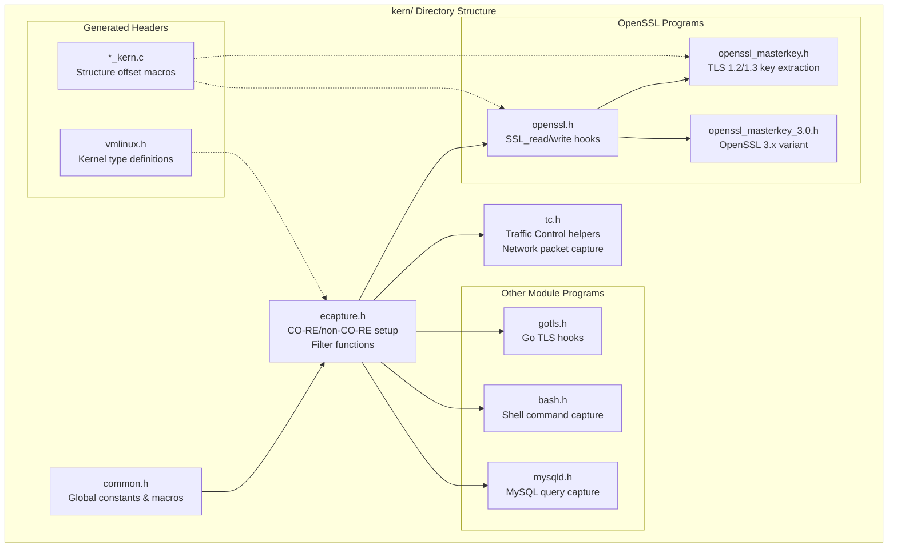
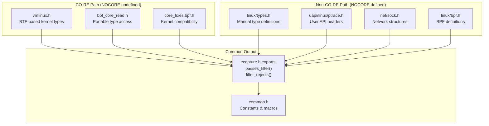
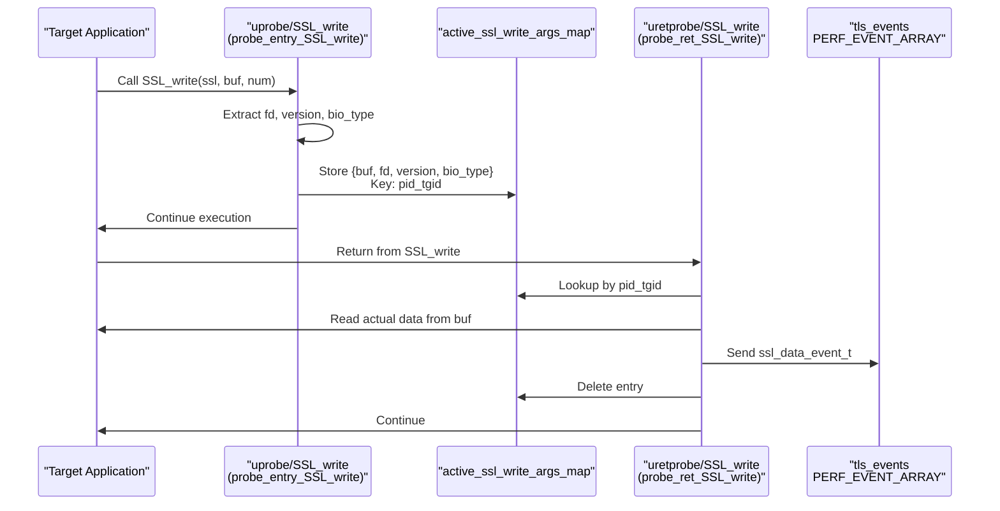
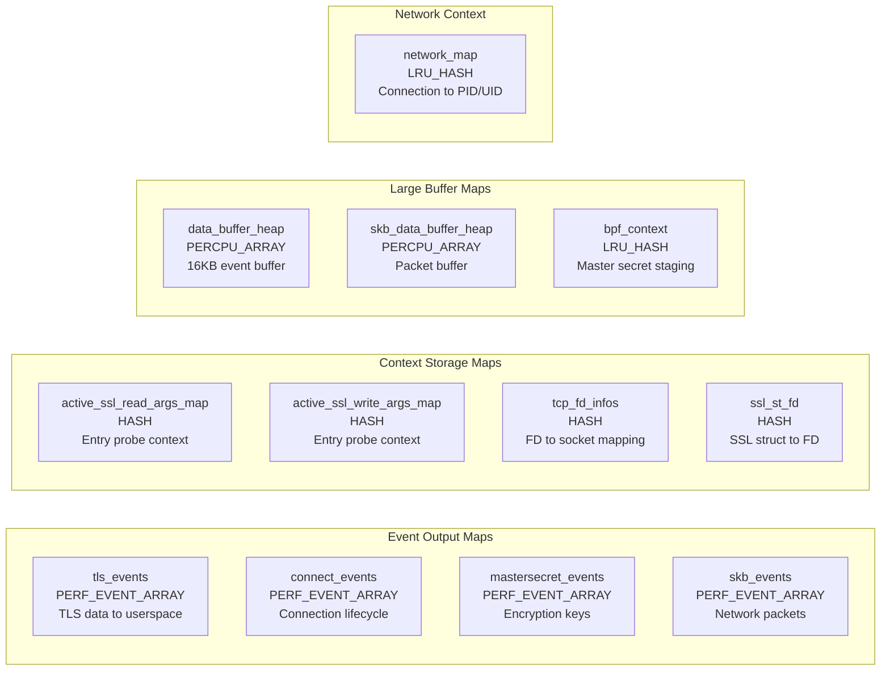
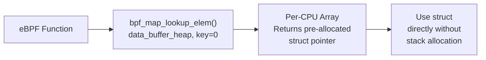
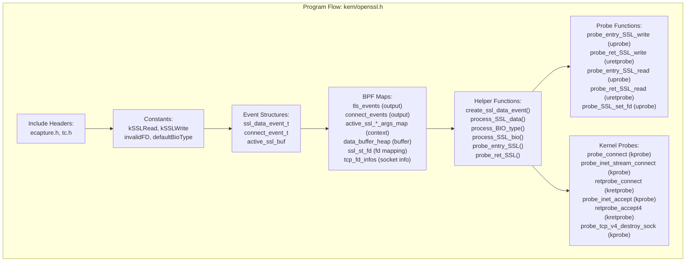
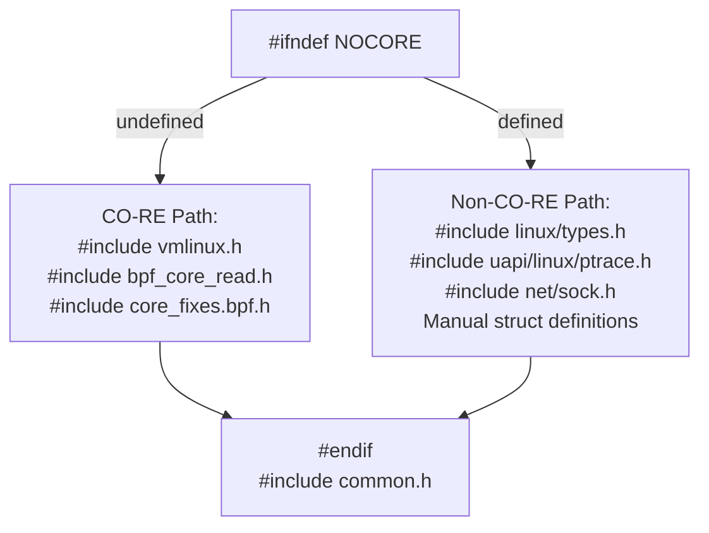

# eBPF Program Structure

<details>
<summary>Relevant source files</summary>

The following files were used as context for generating this wiki page:

- [kern/common.h](https://github.com/gojue/ecapture/blob/ca085d05/kern/common.h)
- [kern/ecapture.h](https://github.com/gojue/ecapture/blob/ca085d05/kern/ecapture.h)
- [kern/openssl.h](https://github.com/gojue/ecapture/blob/ca085d05/kern/openssl.h)
- [kern/openssl_masterkey.h](https://github.com/gojue/ecapture/blob/ca085d05/kern/openssl_masterkey.h)
- [kern/openssl_masterkey_3.0.h](https://github.com/gojue/ecapture/blob/ca085d05/kern/openssl_masterkey_3.0.h)
- [kern/tc.h](https://github.com/gojue/ecapture/blob/ca085d05/kern/tc.h)
- [user/module/probe_openssl_keylog.go](https://github.com/gojue/ecapture/blob/ca085d05/user/module/probe_openssl_keylog.go)
- [user/module/probe_openssl_text.go](https://github.com/gojue/ecapture/blob/ca085d05/user/module/probe_openssl_text.go)

</details>


This page documents the organization and structure of eBPF programs in the eCapture codebase, including common headers, probe type definitions, event structures, BPF maps, and helper functions. It serves as a reference for developers writing or modifying eBPF programs.

For information about generating structure offsets for specific library versions, see [Structure Offset Calculation](5.2.2-structure-offset-calculation.md). For guidance on implementing complete capture modules, see [Adding New Modules](5.3-adding-new-modules.md).

---

## Directory Organization

All eBPF kernel-space programs reside in the `kern/` directory. The programs follow a modular structure with shared headers and module-specific implementation files.


```mermaid
graph TB
    subgraph "kern/ Directory Structure"
        COMMON["common.h<br/>Global constants & macros"]
        ECAPTURE["ecapture.h<br/>CO-RE/non-CO-RE setup<br/>Filter functions"]
        TC["tc.h<br/>Traffic Control helpers<br/>Network packet capture"]
        
        subgraph "OpenSSL Programs"
            OPENSSL["openssl.h<br/>SSL_read/write hooks"]
            MASTERKEY["openssl_masterkey.h<br/>TLS 1.2/1.3 key extraction"]
            MASTERKEY3["openssl_masterkey_3.0.h<br/>OpenSSL 3.x variant"]
        end
        
        subgraph "Other Module Programs"
            GOTLS["gotls.h<br/>Go TLS hooks"]
            BASH["bash.h<br/>Shell command capture"]
            MYSQL["mysqld.h<br/>MySQL query capture"]
        end
        
        subgraph "Generated Headers"
            VMLINUX["vmlinux.h<br/>Kernel type definitions"]
            OFFSETS["*_kern.c<br/>Structure offset macros"]
        end
    end
    
    COMMON --> ECAPTURE
    ECAPTURE --> OPENSSL
    ECAPTURE --> TC
    ECAPTURE --> GOTLS
    ECAPTURE --> BASH
    ECAPTURE --> MYSQL
    
    OPENSSL --> MASTERKEY
    OPENSSL --> MASTERKEY3
    
    VMLINUX -.-> ECAPTURE
    OFFSETS -.-> OPENSSL
    OFFSETS -.-> MASTERKEY
```

**Sources:** [kern/common.h](https://github.com/gojue/ecapture/blob/ca085d05/kern/common.h), [kern/ecapture.h](https://github.com/gojue/ecapture/blob/ca085d05/kern/ecapture.h), [kern/openssl.h](https://github.com/gojue/ecapture/blob/ca085d05/kern/openssl.h), [kern/tc.h](https://github.com/gojue/ecapture/blob/ca085d05/kern/tc.h)

---

## Common Headers

### common.h - Global Definitions

The `common.h` header defines constants, macros, and global variables used across all eBPF programs.

| Definition | Purpose | Line Reference |
|------------|---------|----------------|
| `debug_bpf_printk()` | Conditional debug output macro | [kern/common.h:19-26](https://github.com/gojue/ecapture/blob/ca085d05/kern/common.h#L19-L26) |
| `TASK_COMM_LEN` | Process name length (16 bytes) | [kern/common.h:28](https://github.com/gojue/ecapture/blob/ca085d05/kern/common.h#L28) |
| `MAX_DATA_SIZE_OPENSSL` | TLS data buffer size (16KB) | [kern/common.h:39](https://github.com/gojue/ecapture/blob/ca085d05/kern/common.h#L39) |
| `MAX_DATA_SIZE_MYSQL` | MySQL query buffer size (256B) | [kern/common.h:40](https://github.com/gojue/ecapture/blob/ca085d05/kern/common.h#L40) |
| `AF_INET`, `AF_INET6` | Address family constants | [kern/common.h:49-50](https://github.com/gojue/ecapture/blob/ca085d05/kern/common.h#L49-L50) |
| `target_pid`, `target_uid` | Global filter variables (volatile) | [kern/common.h:68-69](https://github.com/gojue/ecapture/blob/ca085d05/kern/common.h#L68-L69) |
| `less52` | Kernel version flag (< 5.2) | [kern/common.h:66](https://github.com/gojue/ecapture/blob/ca085d05/kern/common.h#L66) |

**Key Features:**

1. **Debug Printing:** The `debug_bpf_printk()` macro conditionally compiles debug output based on `DEBUG_PRINT` flag. This avoids performance overhead in production builds.

2. **Buffer Size Constants:** RFC-compliant sizes for different protocols (TLS max fragment = 16KB, database query limits).

3. **Global Variables:** Marked `volatile` to indicate they are initialized from user-space via constant editors.

**Sources:** [kern/common.h:15-86](https://github.com/gojue/ecapture/blob/ca085d05/kern/common.h#L15-L86)

---

### ecapture.h - Core Infrastructure

The `ecapture.h` header provides the foundation for all eBPF programs, handling CO-RE (Compile Once, Run Everywhere) vs non-CO-RE compilation paths.


```mermaid
graph TB
    subgraph "CO-RE Path (NOCORE undefined)"
        VMLINUX["vmlinux.h<br/>BTF-based kernel types"]
        BPF_CORE["bpf_core_read.h<br/>Portable type access"]
        CORE_FIXES["core_fixes.bpf.h<br/>Kernel compatibility"]
    end
    
    subgraph "Non-CO-RE Path (NOCORE defined)"
        LINUX_TYPES["linux/types.h<br/>Manual type definitions"]
        UAPI["uapi/linux/ptrace.h<br/>User API headers"]
        NET_SOCK["net/sock.h<br/>Network structures"]
        LINUX_BPF["linux/bpf.h<br/>BPF definitions"]
    end
    
    subgraph "Common Output"
        ECAPTURE["ecapture.h exports:<br/>passes_filter()<br/>filter_rejects()"]
        COMMON["common.h<br/>Constants & macros"]
    end
    
    VMLINUX --> ECAPTURE
    BPF_CORE --> ECAPTURE
    CORE_FIXES --> ECAPTURE
    
    LINUX_TYPES --> ECAPTURE
    UAPI --> ECAPTURE
    NET_SOCK --> ECAPTURE
    LINUX_BPF --> ECAPTURE
    
    ECAPTURE --> COMMON
```

**Conditional Compilation:**

The preprocessor directive `#ifndef NOCORE` at [kern/ecapture.h:18](https://github.com/gojue/ecapture/blob/ca085d05/kern/ecapture.h#L18) determines which path is used:

- **CO-RE Mode:** Uses BTF (BPF Type Format) from `vmlinux.h` for kernel structure definitions. Requires kernel >= 5.2 with BTF support.
- **Non-CO-RE Mode:** Manually includes kernel headers. Compatible with older kernels but less portable.

**Filter Functions:**

Two key filtering functions are defined in [kern/ecapture.h:93-127](https://github.com/gojue/ecapture/blob/ca085d05/kern/ecapture.h#L93-L127):

```c
// Check if PID/UID should be rejected
static __inline bool filter_rejects(u32 pid, u32 uid)

// Check if event passes all filters
static __always_inline bool passes_filter(struct pt_regs *ctx)
```

These functions check against `target_pid` and `target_uid` global variables to implement selective tracing.

**Sources:** [kern/ecapture.h:1-130](https://github.com/gojue/ecapture/blob/ca085d05/kern/ecapture.h#L1-L130)

---

## SEC() Macro and Probe Types

eBPF programs use the `SEC()` macro to declare their attachment type. The section name determines how the program is loaded and attached.

### Probe Type Reference

| Section Name | Probe Type | Purpose | Example Function |
|--------------|------------|---------|------------------|
| `uprobe/<func>` | User-space entry probe | Hook function entry | [kern/openssl.h:331](https://github.com/gojue/ecapture/blob/ca085d05/kern/openssl.h#L331) |
| `uretprobe/<func>` | User-space return probe | Hook function return | [kern/openssl.h:336](https://github.com/gojue/ecapture/blob/ca085d05/kern/openssl.h#L336) |
| `kprobe/<func>` | Kernel entry probe | Hook kernel function entry | [kern/openssl.h:374](https://github.com/gojue/ecapture/blob/ca085d05/kern/openssl.h#L374) |
| `kretprobe/<func>` | Kernel return probe | Hook kernel function return | [kern/openssl.h:456](https://github.com/gojue/ecapture/blob/ca085d05/kern/openssl.h#L456) |
| `classifier` | Traffic Control classifier | Network packet filtering | [kern/tc.h:274](https://github.com/gojue/ecapture/blob/ca085d05/kern/tc.h#L274) |

### Probe Pattern: Entry/Return Pairs

Most uprobe hooks follow a two-stage pattern:


```mermaid
sequenceDiagram
    participant App as "Target Application"
    participant Entry as "uprobe/SSL_write<br/>(probe_entry_SSL_write)"
    participant Map as "active_ssl_write_args_map"
    participant Return as "uretprobe/SSL_write<br/>(probe_ret_SSL_write)"
    participant Events as "tls_events<br/>PERF_EVENT_ARRAY"
    
    App->>Entry: Call SSL_write(ssl, buf, num)
    Entry->>Entry: Extract fd, version, bio_type
    Entry->>Map: Store {buf, fd, version, bio_type}<br/>Key: pid_tgid
    Entry->>App: Continue execution
    
    App->>Return: Return from SSL_write
    Return->>Map: Lookup by pid_tgid
    Return->>App: Read actual data from buf
    Return->>Events: Send ssl_data_event_t
    Return->>Map: Delete entry
    Return->>App: Continue
```

**Entry Probe (`probe_entry_SSL_write`):**
- Captures function arguments before execution
- Stores context in BPF map keyed by thread ID
- Example: [kern/openssl.h:331-334](https://github.com/gojue/ecapture/blob/ca085d05/kern/openssl.h#L331-L334)

**Return Probe (`probe_ret_SSL_write`):**
- Retrieves stored context from BPF map
- Reads actual data after function completes
- Sends event to user-space
- Example: [kern/openssl.h:336-339](https://github.com/gojue/ecapture/blob/ca085d05/kern/openssl.h#L336-L339)

**Why This Pattern?**
1. Function arguments are only valid at entry time
2. Return values and buffer contents are only valid at return time
3. Thread ID (`bpf_get_current_pid_tgid()`) correlates entry and return

**Sources:** [kern/openssl.h:268-323](https://github.com/gojue/ecapture/blob/ca085d05/kern/openssl.h#L268-L323), [kern/openssl.h:331-351](https://github.com/gojue/ecapture/blob/ca085d05/kern/openssl.h#L331-L351)

---

## Event Structure Definitions

Event structures define the data format sent from kernel to user-space. All event structures are packed and declared at the top of eBPF program files.

### SSL Data Event

The primary event for TLS plaintext capture:

```c
struct ssl_data_event_t {
    enum ssl_data_event_type type;    // kSSLRead or kSSLWrite
    u64 timestamp_ns;                 // Nanosecond timestamp
    u32 pid;                          // Process ID
    u32 tid;                          // Thread ID
    char data[MAX_DATA_SIZE_OPENSSL]; // Captured plaintext (16KB)
    s32 data_len;                     // Actual data length
    char comm[TASK_COMM_LEN];         // Process name
    u32 fd;                           // File descriptor
    s32 version;                      // TLS version
    u32 bio_type;                     // OpenSSL BIO type
};
```

Defined at [kern/openssl.h:28-39](https://github.com/gojue/ecapture/blob/ca085d05/kern/openssl.h#L28-L39).

### Connection Event

Tracks TCP connection lifecycle:

```c
struct connect_event_t {
    unsigned __int128 saddr;          // Source address (IPv4/IPv6)
    unsigned __int128 daddr;          // Destination address
    char comm[TASK_COMM_LEN];         // Process name
    u64 timestamp_ns;                 // Event timestamp
    u64 sock;                         // Kernel socket pointer
    u32 pid;                          // Process ID
    u32 tid;                          // Thread ID
    u32 fd;                           // File descriptor
    u16 family;                       // AF_INET or AF_INET6
    u16 sport;                        // Source port
    u16 dport;                        // Destination port
    u8 is_destroy;                    // Connection close flag
    u8 pad[7];                        // Padding
} __attribute__((packed));
```

Defined at [kern/openssl.h:41-55](https://github.com/gojue/ecapture/blob/ca085d05/kern/openssl.h#L41-L55). Note the `__attribute__((packed))` to eliminate padding holes.

### Master Secret Event

For TLS 1.2 and 1.3 key extraction:

```c
struct mastersecret_t {
    // TLS 1.2
    s32 version;
    u8 client_random[SSL3_RANDOM_SIZE];
    u8 master_key[MASTER_SECRET_MAX_LEN];
    
    // TLS 1.3
    u32 cipher_id;
    u8 early_secret[EVP_MAX_MD_SIZE];
    u8 handshake_secret[EVP_MAX_MD_SIZE];
    u8 handshake_traffic_hash[EVP_MAX_MD_SIZE];
    u8 client_app_traffic_secret[EVP_MAX_MD_SIZE];
    u8 server_app_traffic_secret[EVP_MAX_MD_SIZE];
    u8 exporter_master_secret[EVP_MAX_MD_SIZE];
};
```

Defined at [kern/openssl_masterkey.h:25-39](https://github.com/gojue/ecapture/blob/ca085d05/kern/openssl_masterkey.h#L25-L39). Contains different fields for TLS 1.2 (single master key) vs TLS 1.3 (multiple traffic secrets).

**Sources:** [kern/openssl.h:23-55](https://github.com/gojue/ecapture/blob/ca085d05/kern/openssl.h#L23-L55), [kern/openssl_masterkey.h:21-43](https://github.com/gojue/ecapture/blob/ca085d05/kern/openssl_masterkey.h#L21-L43)

---

## BPF Map Definitions

BPF maps provide storage and communication between kernel and user-space. Maps are declared using the `SEC(".maps")` annotation.

### Map Type Reference


```mermaid
graph LR
    subgraph "Event Output Maps"
        TLS_EVENTS["tls_events<br/>PERF_EVENT_ARRAY<br/>TLS data to userspace"]
        CONN_EVENTS["connect_events<br/>PERF_EVENT_ARRAY<br/>Connection lifecycle"]
        MASTER_EVENTS["mastersecret_events<br/>PERF_EVENT_ARRAY<br/>Encryption keys"]
        SKB_EVENTS["skb_events<br/>PERF_EVENT_ARRAY<br/>Network packets"]
    end
    
    subgraph "Context Storage Maps"
        ACTIVE_READ["active_ssl_read_args_map<br/>HASH<br/>Entry probe context"]
        ACTIVE_WRITE["active_ssl_write_args_map<br/>HASH<br/>Entry probe context"]
        TCP_FD["tcp_fd_infos<br/>HASH<br/>FD to socket mapping"]
        SSL_FD["ssl_st_fd<br/>HASH<br/>SSL struct to FD"]
    end
    
    subgraph "Large Buffer Maps"
        DATA_HEAP["data_buffer_heap<br/>PERCPU_ARRAY<br/>16KB event buffer"]
        SKB_HEAP["skb_data_buffer_heap<br/>PERCPU_ARRAY<br/>Packet buffer"]
        BPF_CTX["bpf_context<br/>LRU_HASH<br/>Master secret staging"]
    end
    
    subgraph "Network Context"
        NETWORK_MAP["network_map<br/>LRU_HASH<br/>Connection to PID/UID"]
    end
```

### PERF_EVENT_ARRAY Maps

Used for sending data to user-space. Each CPU core has a dedicated ring buffer.

```c
struct {
    __uint(type, BPF_MAP_TYPE_PERF_EVENT_ARRAY);
    __uint(key_size, sizeof(u32));
    __uint(value_size, sizeof(u32));
    __uint(max_entries, 1024);
} tls_events SEC(".maps");
```

Defined at [kern/openssl.h:79-84](https://github.com/gojue/ecapture/blob/ca085d05/kern/openssl.h#L79-L84). Similar definitions exist for:
- `connect_events` at [kern/openssl.h:87-92](https://github.com/gojue/ecapture/blob/ca085d05/kern/openssl.h#L87-L92)
- `mastersecret_events` at [kern/openssl_masterkey.h:48-53](https://github.com/gojue/ecapture/blob/ca085d05/kern/openssl_masterkey.h#L48-L53)
- `skb_events` at [kern/tc.h:57-62](https://github.com/gojue/ecapture/blob/ca085d05/kern/tc.h#L57-L62)

### HASH Maps for Context Storage

Store temporary data between probe entry and return:

```c
struct {
    __uint(type, BPF_MAP_TYPE_HASH);
    __type(key, u64);                      // Thread ID
    __type(value, struct active_ssl_buf);  // Function arguments
    __uint(max_entries, 1024);
} active_ssl_write_args_map SEC(".maps");
```

Defined at [kern/openssl.h:104-109](https://github.com/gojue/ecapture/blob/ca085d05/kern/openssl.h#L104-L109). The key is always `bpf_get_current_pid_tgid()` for thread correlation.

### PERCPU_ARRAY for Large Buffers

Circumvents eBPF's 512-byte stack limit by using per-CPU map storage:

```c
struct {
    __uint(type, BPF_MAP_TYPE_PERCPU_ARRAY);
    __type(key, u32);
    __type(value, struct ssl_data_event_t);  // 16KB+ struct
    __uint(max_entries, 1);
} data_buffer_heap SEC(".maps");
```

Defined at [kern/openssl.h:113-118](https://github.com/gojue/ecapture/blob/ca085d05/kern/openssl.h#L113-L118). Always accessed with key `0`, provides heap-allocated storage for large event structures.

### LRU_HASH for Network Context

Maps network connections to process context:

```c
struct {
    __uint(type, BPF_MAP_TYPE_LRU_HASH);
    __type(key, struct net_id_t);     // 5-tuple: proto, src/dst IP/port
    __type(value, struct net_ctx_t);  // PID, UID, comm
    __uint(max_entries, 10240);
} network_map SEC(".maps");
```

Defined at [kern/tc.h:72-77](https://github.com/gojue/ecapture/blob/ca085d05/kern/tc.h#L72-L77). LRU (Least Recently Used) automatically evicts old entries.

**Sources:** [kern/openssl.h:74-134](https://github.com/gojue/ecapture/blob/ca085d05/kern/openssl.h#L74-L134), [kern/tc.h:56-77](https://github.com/gojue/ecapture/blob/ca085d05/kern/tc.h#L56-L77), [kern/openssl_masterkey.h:45-67](https://github.com/gojue/ecapture/blob/ca085d05/kern/openssl_masterkey.h#L45-L67)

---

## Helper Function Patterns

### Stack Limit Workaround

eBPF programs have a 512-byte stack limit. Large structures must be allocated via maps:


```mermaid
graph LR
    FUNC["eBPF Function"] --> LOOKUP["bpf_map_lookup_elem()<br/>data_buffer_heap, key=0"]
    LOOKUP --> PERCPU["Per-CPU Array<br/>Returns pre-allocated<br/>struct pointer"]
    PERCPU --> USE["Use struct<br/>directly without<br/>stack allocation"]
```

**Pattern Implementation:**

```c
static __inline struct ssl_data_event_t* create_ssl_data_event(u64 current_pid_tgid) {
    u32 kZero = 0;
    struct ssl_data_event_t* event = 
        bpf_map_lookup_elem(&data_buffer_heap, &kZero);
    if (event == NULL) {
        return NULL;
    }
    // Initialize fields...
    return event;
}
```

Defined at [kern/openssl.h:141-158](https://github.com/gojue/ecapture/blob/ca085d05/kern/openssl.h#L141-L158). Similar pattern in `make_event()` at [kern/openssl_masterkey.h:71-78](https://github.com/gojue/ecapture/blob/ca085d05/kern/openssl_masterkey.h#L71-L78).

### Data Reading Helpers

**Reading User-Space Memory:**

```c
bpf_probe_read_user(&dest, sizeof(dest), src_ptr);
```

Used for reading data from target application's memory space. Example at [kern/openssl.h:186](https://github.com/gojue/ecapture/blob/ca085d05/kern/openssl.h#L186).

**Reading Kernel Memory:**

```c
bpf_probe_read_kernel(&dest, sizeof(dest), kernel_ptr);
```

Used for reading kernel structures like `struct sock`. Example at [kern/openssl.h:409](https://github.com/gojue/ecapture/blob/ca085d05/kern/openssl.h#L409).

**CO-RE Field Access:**

```c
#define READ_KERN(ptr)                                                  \
    ({                                                                  \
        typeof(ptr) _val;                                               \
        __builtin_memset((void *)&_val, 0, sizeof(_val));               \
        bpf_core_read((void *)&_val, sizeof(_val), &ptr);               \
        _val;                                                           \
    })
```

Defined at [kern/tc.h:22-28](https://github.com/gojue/ecapture/blob/ca085d05/kern/tc.h#L22-L28). Provides portable field access in CO-RE mode.

### Filtering Pattern

Standard filtering check at the beginning of probes:

```c
if (!passes_filter(ctx)) {
    return 0;
}
```

Checks `target_pid` and `target_uid` against current process. Example at [kern/openssl.h:269](https://github.com/gojue/ecapture/blob/ca085d05/kern/openssl.h#L269).

**Sources:** [kern/openssl.h:141-191](https://github.com/gojue/ecapture/blob/ca085d05/kern/openssl.h#L141-L191), [kern/tc.h:22-28](https://github.com/gojue/ecapture/blob/ca085d05/kern/tc.h#L22-L28), [kern/ecapture.h:93-127](https://github.com/gojue/ecapture/blob/ca085d05/kern/ecapture.h#L93-L127)

---

## Complete Program Structure Example

### OpenSSL TLS Capture Program


```mermaid
graph TB
    subgraph "Program Flow: kern/openssl.h"
        INCLUDES["Include Headers:<br/>ecapture.h, tc.h"]
        
        CONSTS["Constants:<br/>kSSLRead, kSSLWrite<br/>invalidFD, defaultBioType"]
        
        STRUCTS["Event Structures:<br/>ssl_data_event_t<br/>connect_event_t<br/>active_ssl_buf"]
        
        MAPS["BPF Maps:<br/>tls_events (output)<br/>connect_events (output)<br/>active_ssl_*_args_map (context)<br/>data_buffer_heap (buffer)<br/>ssl_st_fd (fd mapping)<br/>tcp_fd_infos (socket info)"]
        
        HELPERS["Helper Functions:<br/>create_ssl_data_event()<br/>process_SSL_data()<br/>process_BIO_type()<br/>process_SSL_bio()<br/>probe_entry_SSL()<br/>probe_ret_SSL()"]
        
        PROBES["Probe Functions:<br/>probe_entry_SSL_write (uprobe)<br/>probe_ret_SSL_write (uretprobe)<br/>probe_entry_SSL_read (uprobe)<br/>probe_ret_SSL_read (uretprobe)<br/>probe_SSL_set_fd (uprobe)"]
        
        KPROBES["Kernel Probes:<br/>probe_connect (kprobe)<br/>probe_inet_stream_connect (kprobe)<br/>retprobe_connect (kretprobe)<br/>probe_inet_accept (kprobe)<br/>retprobe_accept4 (kretprobe)<br/>probe_tcp_v4_destroy_sock (kprobe)"]
    end
    
    INCLUDES --> CONSTS
    CONSTS --> STRUCTS
    STRUCTS --> MAPS
    MAPS --> HELPERS
    HELPERS --> PROBES
    HELPERS --> KPROBES
```

### File Structure Breakdown

| Section | Line Range | Purpose |
|---------|------------|---------|
| License & Includes | [kern/openssl.h:1-16](https://github.com/gojue/ecapture/blob/ca085d05/kern/openssl.h#L1-L16) | Header dependencies |
| Constants & Enums | [kern/openssl.h:19-26](https://github.com/gojue/ecapture/blob/ca085d05/kern/openssl.h#L19-L26) | Event types, defaults |
| Event Structures | [kern/openssl.h:28-72](https://github.com/gojue/ecapture/blob/ca085d05/kern/openssl.h#L28-L72) | Data format definitions |
| BPF Maps | [kern/openssl.h:74-134](https://github.com/gojue/ecapture/blob/ca085d05/kern/openssl.h#L74-L134) | Storage declarations |
| Helper Functions | [kern/openssl.h:136-323](https://github.com/gojue/ecapture/blob/ca085d05/kern/openssl.h#L136-L323) | Shared logic |
| Uprobe Entry Points | [kern/openssl.h:325-351](https://github.com/gojue/ecapture/blob/ca085d05/kern/openssl.h#L325-L351) | SSL_read/write hooks |
| Connection Tracking | [kern/openssl.h:354-525](https://github.com/gojue/ecapture/blob/ca085d05/kern/openssl.h#L354-L525) | Kprobe implementations |
| SSL FD Mapping | [kern/openssl.h:528-543](https://github.com/gojue/ecapture/blob/ca085d05/kern/openssl.h#L528-L543) | SSL_set_fd hook |

### Typical Program Flow

1. **Include Dependencies:** Standard headers (`ecapture.h`, `tc.h`)
2. **Define Event Types:** Enums and constants
3. **Declare Event Structures:** Packed structs for user-space communication
4. **Declare BPF Maps:** Storage for events, context, and large buffers
5. **Implement Helpers:** Reusable logic for data extraction
6. **Implement Probes:** Entry/return probe pairs with SEC() annotations
7. **Implement Kprobes:** Kernel-level tracking for network context

**Sources:** [kern/openssl.h:1-544](https://github.com/gojue/ecapture/blob/ca085d05/kern/openssl.h#L1-L544)

---

## CO-RE vs Non-CO-RE Differences

The codebase supports both compilation modes, determined at build time.

### Compilation Flags

| Mode | Flag | vmlinux.h | Kernel Headers | Portability |
|------|------|-----------|----------------|-------------|
| CO-RE | (default) | Required | Not needed | High - runs on any BTF kernel |
| Non-CO-RE | `-D NOCORE` | Not used | Required | Low - kernel-specific |

### Preprocessor Conditionals


```mermaid
graph TB
    START["#ifndef NOCORE"]
    
    CORE_PATH["CO-RE Path:<br/>#include vmlinux.h<br/>#include bpf_core_read.h<br/>#include core_fixes.bpf.h"]
    
    NONCORE_PATH["Non-CO-RE Path:<br/>#include linux/types.h<br/>#include uapi/linux/ptrace.h<br/>#include net/sock.h<br/>Manual struct definitions"]
    
    ENDIF["#endif<br/>#include common.h"]
    
    START -->|undefined| CORE_PATH
    START -->|defined| NONCORE_PATH
    CORE_PATH --> ENDIF
    NONCORE_PATH --> ENDIF
```

Conditional compilation at [kern/ecapture.h:18-88](https://github.com/gojue/ecapture/blob/ca085d05/kern/ecapture.h#L18-L88).

### Key Differences

**Type Definitions:**

- **CO-RE:** Uses BTF (BPF Type Format) from `vmlinux.h` for all kernel types
- **Non-CO-RE:** Manually includes kernel headers and may define simplified structs (e.g., `struct tcphdr` at [kern/ecapture.h:69-72](https://github.com/gojue/ecapture/blob/ca085d05/kern/ecapture.h#L69-L72))

**Field Access:**

- **CO-RE:** Uses `bpf_core_read()` for portable field access that handles offset differences
- **Non-CO-RE:** Direct pointer arithmetic with hardcoded offsets (generated by offset scripts)

**Compatibility Macros:**

```c
#ifdef asm_inline
#undef asm_inline
#define asm_inline asm
#endif
```

At [kern/ecapture.h:43-46](https://github.com/gojue/ecapture/blob/ca085d05/kern/ecapture.h#L43-L46), handles CLANG incompatibility with kernel's `asm_inline` macro.

**Sources:** [kern/ecapture.h:18-88](https://github.com/gojue/ecapture/blob/ca085d05/kern/ecapture.h#L18-L88)

---

## Summary

eBPF programs in eCapture follow a consistent structure:

1. **Modular Headers:** Common definitions separated into reusable headers
2. **Event-Driven:** Structured events sent via PERF_EVENT_ARRAY maps
3. **Two-Stage Probes:** Entry probes store context, return probes read results
4. **Stack Workarounds:** Large structures allocated via PERCPU_ARRAY maps
5. **Dual Compilation:** Supports both CO-RE (portable) and non-CO-RE (compatible) modes
6. **Filtering:** Global variables enable PID/UID-based selective tracing
7. **Network Context:** Kprobes build process-to-connection mappings for TC classifiers

All programs include comprehensive error handling with debug print statements and null checks for map lookups. The architecture maximizes code reuse through helper functions while maintaining clear separation between different capture modules.