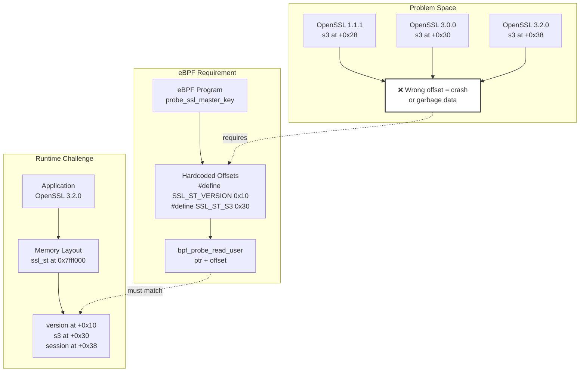
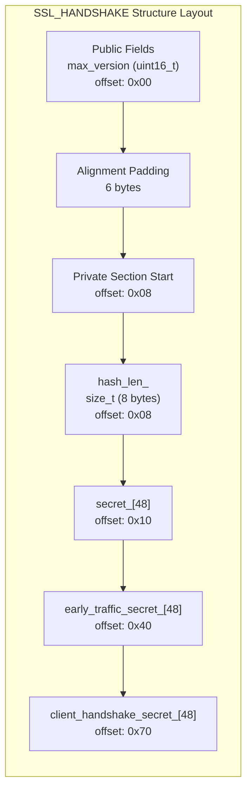
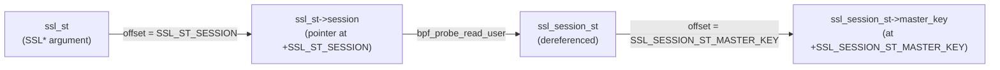
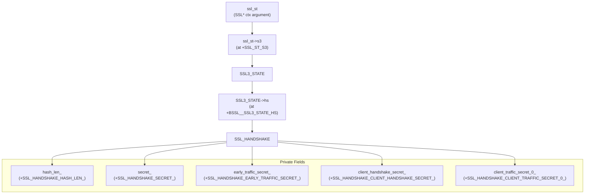
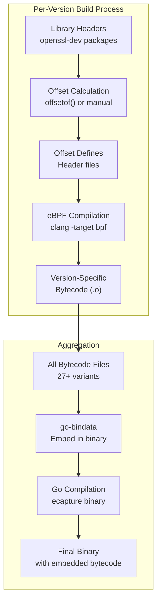

# Structure Offset Calculation

<details>
<summary>Relevant source files</summary>

The following files were used as context for generating this wiki page:

- [kern/boringssl_const.h](https://github.com/gojue/ecapture/blob/0766a93b/kern/boringssl_const.h)
- [kern/boringssl_masterkey.h](https://github.com/gojue/ecapture/blob/0766a93b/kern/boringssl_masterkey.h)
- [kern/openssl_masterkey.h](https://github.com/gojue/ecapture/blob/0766a93b/kern/openssl_masterkey.h)
- [kern/openssl_masterkey_3.0.h](https://github.com/gojue/ecapture/blob/0766a93b/kern/openssl_masterkey_3.0.h)
- [user/module/probe_openssl_lib.go](https://github.com/gojue/ecapture/blob/0766a93b/user/module/probe_openssl_lib.go)
- [utils/boringssl-offset.c](https://github.com/gojue/ecapture/blob/0766a93b/utils/boringssl-offset.c)
- [variables.mk](https://github.com/gojue/ecapture/blob/0766a93b/variables.mk)

</details>


## Purpose and Scope

This document explains the techniques used in eCapture to calculate memory offsets within SSL/TLS library structures for eBPF programs. Structure offset calculation is necessary because eBPF programs must read internal, non-public structures from OpenSSL and BoringSSL, which change between versions. 

For general eBPF program structure, see [eBPF Program Structure](5.2.1-ebpf-program-structure.md). For adding new capture modules, see [Adding New Modules](5.3-adding-new-modules.md). For the version detection system that uses these offsets, see [Version Detection and Bytecode Selection](../2-architecture/2.5-version-detection-and-bytecode-selection.md).

---

## The Offset Problem

eBPF programs attached to SSL/TLS functions need to extract cryptographic keys and session data from internal library structures. These structures are not part of the public API and their memory layout varies across versions. The challenge has three dimensions:

**Version Diversity**: eCapture supports OpenSSL 1.0.2 through 3.5.x and BoringSSL Android 13-16, with each version potentially having different structure layouts [user/module/probe_openssl_lib.go:30-62](https://github.com/gojue/ecapture/blob/0766a93b/user/module/probe_openssl_lib.go#L30-L62).

**Public vs Private Fields**: Some critical fields are marked `private` in C++, making them inaccessible to standard offset calculation tools [kern/boringssl_const.h:11-27](https://github.com/gojue/ecapture/blob/0766a93b/kern/boringssl_const.h#L11-L27).

**Compile-Time Requirements**: eBPF bytecode must embed offset values at compile time since runtime introspection is not possible in the kernel.



**Diagram: The Offset Mismatch Problem**

Sources: [kern/boringssl_masterkey.h:169-257](https://github.com/gojue/ecapture/blob/0766a93b/kern/boringssl_masterkey.h#L169-L257), [user/module/probe_openssl_lib.go:73-187](https://github.com/gojue/ecapture/blob/0766a93b/user/module/probe_openssl_lib.go#L73-L187)

---

## Offset Calculation Techniques

### Using offsetof() with Library Headers

The primary method for calculating offsets is using the C `offsetof()` macro with the actual library headers. The utility program [utils/boringssl-offset.c](https://github.com/gojue/ecapture/blob/0766a93b/utils/boringssl-offset.c) demonstrates this approach:

| Technique | Description | Example |
|-----------|-------------|---------|
| **Macro Definition** | Define structure/field pairs to process | `X(ssl_st, version)` |
| **offsetof() Application** | Standard C macro calculates offset | `offsetof(struct ssl_st, version)` |
| **Code Generation** | Output C preprocessor defines | `#define SSL_ST_VERSION 0x10` |

**Key Implementation**:

```c
#define SSL_STRUCT_OFFSETS                   \
    X(ssl_st, version)                       \
    X(ssl_st, session)                       \
    X(ssl_st, s3)                            \
    X(ssl_session_st, secret_length)         \
    X(ssl_session_st, secret)
```

The `X` macro pattern enables iteration over all structure/field pairs [utils/boringssl-offset.c:23-46](https://github.com/gojue/ecapture/blob/0766a93b/utils/boringssl-offset.c#L23-L46). Each pair is processed to generate offset defines:

```c
#define X(struct_name, field_name) \
    format(#struct_name, #field_name, offsetof(struct struct_name, field_name));
SSL_STRUCT_OFFSETS
#undef X
```

This technique requires:
1. Access to library headers during build
2. Compilation against specific library versions
3. Separate compilation for each supported version

Sources: [utils/boringssl-offset.c:1-78](https://github.com/gojue/ecapture/blob/0766a93b/utils/boringssl-offset.c#L1-L78)

---

### Manual Calculation for Private Fields

BoringSSL uses C++ private fields for TLS 1.3 secrets, making them inaccessible to `offsetof()`. The solution is manual offset calculation based on memory layout analysis:



**Diagram: Private Field Layout in BoringSSL SSL_HANDSHAKE**

The calculation process [kern/boringssl_const.h:34-60](https://github.com/gojue/ecapture/blob/0766a93b/kern/boringssl_const.h#L34-L60):

| Step | Calculation | Result | Comment |
|------|-------------|--------|---------|
| 1. Find last public field | `BSSL__SSL_HANDSHAKE_MAX_VERSION` | Varies | From offsetof() |
| 2. Add field size | `+sizeof(uint16_t)` = `+2` | offset+2 | Size of max_version |
| 3. Apply alignment | `roundup(offset+2, 8)` | Aligned | 8-byte boundary |
| 4. First private field | `+sizeof(size_t)` = `+8` | `hash_len_` offset | |
| 5. Subsequent fields | `+SSL_MAX_MD_SIZE` | Sequential | Each secret is 48 bytes |

**Offset Formulas**:
- `SSL_HANDSHAKE_HASH_LEN_ = roundup(BSSL__SSL_HANDSHAKE_MAX_VERSION+2, 8)`
- `SSL_HANDSHAKE_SECRET_ = SSL_HANDSHAKE_HASH_LEN_ + 8`
- `SSL_HANDSHAKE_EARLY_TRAFFIC_SECRET_ = SSL_HANDSHAKE_SECRET_ + 48*1`
- `SSL_HANDSHAKE_CLIENT_HANDSHAKE_SECRET_ = SSL_HANDSHAKE_SECRET_ + 48*2`

This approach requires understanding:
1. C++ memory layout rules
2. Structure alignment (typically 8 bytes on x86_64)
3. Member declaration order in source code

Sources: [kern/boringssl_const.h:1-63](https://github.com/gojue/ecapture/blob/0766a93b/kern/boringssl_const.h#L1-L63)

---

### Memory Alignment Considerations

Structure padding affects offset calculations. eBPF programs must account for compiler-inserted padding:

**Alignment Rules**:
- Scalar types align to their size (uint16_t → 2 bytes, uint64_t → 8 bytes)
- Structure alignment matches largest member
- Padding inserted to maintain alignment

**Example from ssl3_state_st**:

```c
struct ssl3_state_st {
    u64 read_sequence;          // offset: 0x00, size: 8
    u64 write_sequence;         // offset: 0x08, size: 8
    unsigned char server_random[32];  // offset: 0x10, size: 32
    unsigned char client_random[32];  // offset: 0x30, size: 32
};
```

The `client_random` field is at offset `0x30` (48 bytes) because:
- `read_sequence`: 0 + 8 = 8
- `write_sequence`: 8 + 8 = 16 (0x10)
- `server_random`: 16 + 32 = 48 (0x30)

Sources: [kern/boringssl_masterkey.h:59-65](https://github.com/gojue/ecapture/blob/0766a93b/kern/boringssl_masterkey.h#L59-L65)

---

## Version-Specific Bytecode Strategy

eCapture solves the offset variation problem by pre-compiling separate eBPF bytecode for each supported library version. The build system generates multiple bytecode files, each with version-specific offsets.

### Bytecode Variant Matrix

```mermaid
graph TB
    subgraph "OpenSSL Variants"
        O102["openssl_1_0_2a_kern.o<br/>Versions: 1.0.2a-u"]
        O110["openssl_1_1_0a_kern.o<br/>Versions: 1.1.0a-l"]
        O111A["openssl_1_1_1a_kern.o<br/>Version: 1.1.1a"]
        O111B["openssl_1_1_1b_kern.o<br/>Versions: 1.1.1b-c"]
        O111D["openssl_1_1_1d_kern.o<br/>Versions: 1.1.1d-i"]
        O111J["openssl_1_1_1j_kern.o<br/>Versions: 1.1.1j-w"]
        O300["openssl_3_0_0_kern.o<br/>Versions: 3.0.0-11,13-17"]
        O3012["openssl_3_0_12_kern.o<br/>Version: 3.0.12"]
        O320["openssl_3_2_0_kern.o<br/>Versions: 3.2.0-2"]
        O350["openssl_3_5_0_kern.o<br/>Versions: 3.5.0-4"]
    end
    
    subgraph "BoringSSL Variants"
        BA13["boringssl_a_13_kern.o<br/>Android 13"]
        BA14["boringssl_a_14_kern.o<br/>Android 14"]
        BA15["boringssl_a_15_kern.o<br/>Android 15"]
        BA16["boringssl_a_16_kern.o<br/>Android 16"]
        BNA["boringssl_na_kern.o<br/>Non-Android"]
    end
    
    subgraph "Selection Logic"
        DETECT["Version Detection<br/>Parse .rodata section"]
        MAP["sslVersionBpfMap<br/>version → bytecode"]
        LOAD["Load Appropriate<br/>Bytecode"]
    end
    
    DETECT --> MAP
    MAP --> LOAD
    
    O102 -.-> LOAD
    O111J -.-> LOAD
    O300 -.-> LOAD
    BA13 -.-> LOAD
```



**Diagram: Bytecode Variant Selection System**

The mapping is defined in `initOpensslOffset()` [user/module/probe_openssl_lib.go:73-187](https://github.com/gojue/ecapture/blob/0766a93b/user/module/probe_openssl_lib.go#L73-L187):

| Version Pattern | Bytecode File | Offset Source |
|-----------------|---------------|---------------|
| OpenSSL 1.0.2a-u (21 versions) | `openssl_1_0_2a_kern.o` | Single offset set |
| OpenSSL 1.1.1a | `openssl_1_1_1a_kern.o` | Unique offsets |
| OpenSSL 1.1.1b-c | `openssl_1_1_1b_kern.o` | Shared offsets |
| OpenSSL 1.1.1d-i | `openssl_1_1_1d_kern.o` | Shared offsets |
| OpenSSL 1.1.1j-w | `openssl_1_1_1j_kern.o` | Shared offsets |
| OpenSSL 3.0.12 | `openssl_3_0_12_kern.o` | Special case |
| OpenSSL 3.0.x (others) | `openssl_3_0_0_kern.o` | Shared offsets |

Sources: [user/module/probe_openssl_lib.go:73-187](https://github.com/gojue/ecapture/blob/0766a93b/user/module/probe_openssl_lib.go#L73-L187), [variables.mk:189-228](https://github.com/gojue/ecapture/blob/0766a93b/variables.mk#L189-L228)

---

## Practical Examples

### Example 1: Reading TLS 1.2 Master Secret (OpenSSL)

The eBPF program must navigate multiple pointer indirections to read the master secret:

**Navigation Path**: `ssl_st` → `ssl_st->session` → `ssl_session_st->master_key`



**Diagram: TLS 1.2 Master Secret Access Path**

**Code Implementation** [kern/openssl_masterkey.h:140-165](https://github.com/gojue/ecapture/blob/0766a93b/kern/openssl_masterkey.h#L140-L165):

```c
// Step 1: Get ssl_session_st pointer from ssl_st
u64 *ssl_session_st_ptr = (u64 *)(ssl_st_ptr + SSL_ST_SESSION);
u64 ssl_session_st_addr;
ret = bpf_probe_read_user(&ssl_session_st_addr, sizeof(ssl_session_st_addr), 
                          ssl_session_st_ptr);

// Step 2: Read master_key from ssl_session_st
void *ms_ptr = (void *)(ssl_session_st_addr + SSL_SESSION_ST_MASTER_KEY);
ret = bpf_probe_read_user(&mastersecret->master_key, 
                          sizeof(mastersecret->master_key), ms_ptr);
```

**Offset Dependencies**:
- `SSL_ST_SESSION`: Varies by OpenSSL version (typically 0x38 for 3.0+)
- `SSL_SESSION_ST_MASTER_KEY`: Varies by version (typically 0x50-0x60)

Sources: [kern/openssl_masterkey.h:140-168](https://github.com/gojue/ecapture/blob/0766a93b/kern/openssl_masterkey.h#L140-L168)

---

### Example 2: Reading TLS 1.3 Secrets (BoringSSL)

TLS 1.3 secrets in BoringSSL require accessing private fields through the handshake structure:

**Navigation Path**: `ssl_st` → `ssl_st->s3` → `SSL3_STATE->hs` → `SSL_HANDSHAKE-><private fields>`



**Diagram: TLS 1.3 Secret Access in BoringSSL**

**Code Implementation** [kern/boringssl_masterkey.h:235-382](https://github.com/gojue/ecapture/blob/0766a93b/kern/boringssl_masterkey.h#L235-L382):

```c
// Step 1: Get s3 pointer
u64 *ssl_s3_st_ptr = (u64 *)(ssl_st_ptr + SSL_ST_S3);
ret = bpf_probe_read_user(&s3_address, sizeof(s3_address), ssl_s3_st_ptr);

// Step 2: Get handshake structure pointer
u64 *ssl_hs_st_ptr = (u64 *)(s3_address + BSSL__SSL3_STATE_HS);
ret = bpf_probe_read_user(&ssl_hs_st_addr, sizeof(ssl_hs_st_addr), ssl_hs_st_ptr);

// Step 3: Read hash length
u64 *ssl_hs_hashlen_ptr = (u64 *)(ssl_hs_st_addr + SSL_HANDSHAKE_HASH_LEN_);
ret = bpf_probe_read_user(&hash_len, sizeof(hash_len), ssl_hs_hashlen_ptr);

// Step 4: Read TLS 1.3 secrets (using calculated offsets for private fields)
void *cats_ptr_tls13 = (void *)(ssl_hs_st_addr + SSL_HANDSHAKE_CLIENT_TRAFFIC_SECRET_0_);
ret = bpf_probe_read_user(&mastersecret->client_traffic_secret_0_, 
                          sizeof(mastersecret->client_traffic_secret_0_),
                          cats_ptr_tls13);
```

**Critical Offsets**:
- `SSL_HANDSHAKE_CLIENT_TRAFFIC_SECRET_0_ = SSL_HANDSHAKE_SECRET_ + 48*4`
- Each TLS 1.3 secret is 48 bytes (`SSL_MAX_MD_SIZE`)
- Sequential layout enables arithmetic offset calculation

Sources: [kern/boringssl_masterkey.h:235-402](https://github.com/gojue/ecapture/blob/0766a93b/kern/boringssl_masterkey.h#L235-L402), [kern/boringssl_const.h:34-60](https://github.com/gojue/ecapture/blob/0766a93b/kern/boringssl_const.h#L34-L60)

---

### Example 3: Version-Specific Offset Differences

OpenSSL 3.0.12 is a special case where structure offsets differ from other 3.0.x versions:

**Build System Logic** [user/module/probe_openssl_lib.go:128-130](https://github.com/gojue/ecapture/blob/0766a93b/user/module/probe_openssl_lib.go#L128-L130):

```go
// OpenSSL 3.0.0-3.0.11 and 3.0.13-3.0.17 use same bytecode
for ch := 0; ch <= MaxSupportedOpenSSL30Version; ch++ {
    m.sslVersionBpfMap[fmt.Sprintf("openssl 3.0.%d", ch)] = "openssl_3_0_0_kern.o"
}

// OpenSSL 3.0.12 requires special bytecode
m.sslVersionBpfMap["openssl 3.0.12"] = "openssl_3_0_12_kern.o"
```

**Rationale**: Internal structure reorganization in 3.0.12 changed field offsets, requiring separate offset calculations and bytecode compilation.

**Detection and Selection Flow**:

| Step | Function | Action |
|------|----------|--------|
| 1 | `detectOpenssl()` | Parse `.rodata` section for version string |
| 2 | Version normalization | Convert "OpenSSL 3.0.12" → "openssl 3.0.12" |
| 3 | Map lookup | Check `sslVersionBpfMap["openssl 3.0.12"]` |
| 4 | Bytecode selection | Return `"openssl_3_0_12_kern.o"` |

Sources: [user/module/probe_openssl_lib.go:128-136](https://github.com/gojue/ecapture/blob/0766a93b/user/module/probe_openssl_lib.go#L128-L136), [variables.mk:202](https://github.com/gojue/ecapture/blob/0766a93b/variables.mk#L202)

---

## Tools and Utilities

### Offset Calculator Utility

The `boringssl-offset.c` utility generates offset definitions for a specific BoringSSL version:

**Compilation and Usage**:
```bash
# Compile against BoringSSL headers
g++ -I include/ -I src/ utils/boringssl-offset.c -o offset-calc

# Run to generate offset definitions
./offset-calc > generated_offsets.h
```

**Output Format** [utils/boringssl-offset.c:60-67](https://github.com/gojue/ecapture/blob/0766a93b/utils/boringssl-offset.c#L60-L67):
```c
// ssl_st->version
#define SSL_ST_VERSION 0x10

// ssl_st->session
#define SSL_ST_SESSION 0x38

// bssl::SSL3_STATE->hs
#define BSSL__SSL3_STATE_HS 0x50
```

**Supported Structures**:
- `ssl_st`: Main SSL context structure
- `ssl_session_st`: Session state including master secrets
- `ssl_cipher_st`: Cipher suite information
- `bssl::SSL3_STATE`: SSL 3.0/TLS state
- `bssl::SSL_HANDSHAKE`: Handshake state and secrets

Sources: [utils/boringssl-offset.c:1-78](https://github.com/gojue/ecapture/blob/0766a93b/utils/boringssl-offset.c#L1-L78)

---

### Build System Integration

The Makefile orchestrates offset generation and bytecode compilation for all versions:



**Diagram: Build System Flow for Offset-Aware Bytecode**

**Target Definitions** [variables.mk:190-228](https://github.com/gojue/ecapture/blob/0766a93b/variables.mk#L190-L228):
- 27+ TARGETS entries, each representing a library version
- Each target compiles to `<name>_kern.o`
- Separate compilation for CO-RE and non-CO-RE modes
- Android variants excluded from shell/database modules

**Compilation Flags for Offset Support**:
- `-D__TARGET_ARCH_x86` or `-D__TARGET_ARCH_arm64`: Architecture-specific
- `-I ./kern/bpf/$(LINUX_ARCH)`: Include architecture headers
- Version-specific offset headers included via `#include` directives

Sources: [variables.mk:189-228](https://github.com/gojue/ecapture/blob/0766a93b/variables.mk#L189-L228), [Makefile (referenced)]()

---

## Version Detection and Downgrade Strategy

When the exact version's bytecode is not available, eCapture implements a fallback strategy:

### Downgrade Algorithm

**Logic** [user/module/probe_openssl_lib.go:341-369](https://github.com/gojue/ecapture/blob/0766a93b/user/module/probe_openssl_lib.go#L341-L369):

1. **Progressive Prefix Matching**: Iteratively shorten version string
   - "openssl 3.2.7" → try "openssl 3.2", then "openssl 3", etc.

2. **Version Comparison**: Select highest compatible version ≤ detected version
   - If version 3.2.7 detected and only 3.2.0 available, use 3.2.0

3. **Library Path Heuristics**: Fallback based on library filename
   - `libssl.so.3` → use OpenSSL 3.0 default
   - Other → use OpenSSL 1.1.1 default

**Implementation**:

```go
func (m *MOpenSSLProbe) downgradeOpensslVersion(ver string, soPath string) (string, bool) {
    var candidates []string
    for i := len(ver) - 1; i > 0; i-- {
        prefix := ver[:i]
        for libKey := range m.sslVersionBpfMap {
            if strings.HasPrefix(libKey, prefix) && isVersionLessOrEqual(libKey, ver) {
                candidates = append(candidates, libKey)
            }
        }
        if len(candidates) > 0 {
            sort.Strings(candidates)
            return m.sslVersionBpfMap[candidates[len(candidates)-1]], true
        }
    }
    // Fallback logic based on soPath
}
```

**Version Comparison**: Custom comparison handles both numeric and alphabetic suffixes (e.g., "1.1.1w") [user/module/probe_openssl_lib.go:371-448](https://github.com/gojue/ecapture/blob/0766a93b/user/module/probe_openssl_lib.go#L371-L448).

Sources: [user/module/probe_openssl_lib.go:341-448](https://github.com/gojue/ecapture/blob/0766a93b/user/module/probe_openssl_lib.go#L341-L448)

---

## Best Practices for Offset Maintenance

### When Adding New Library Versions

1. **Obtain Source Code**: Download exact version source code
2. **Generate Offsets**: Use offset calculator utility or manual analysis
3. **Create Header File**: Generate version-specific offset definitions
4. **Compile Bytecode**: Build eBPF program with new offsets
5. **Update Mapping**: Add entry to `sslVersionBpfMap`
6. **Update Build System**: Add target to `variables.mk`
7. **Test**: Verify with actual applications using that version

### Common Pitfalls

| Issue | Cause | Solution |
|-------|-------|----------|
| **Incorrect alignment** | Missed compiler padding | Use `pahole` tool to inspect actual layout |
| **Private field access** | C++ access control | Manual calculation from public fields |
| **Pointer chase errors** | Wrong dereference order | Draw structure navigation diagram |
| **Version detection failure** | Missing version string | Add version to detection regex |

### Debugging Offset Issues

**eBPF Debug Prints** [kern/boringssl_masterkey.h:273-275](https://github.com/gojue/ecapture/blob/0766a93b/kern/boringssl_masterkey.h#L273-L275):
```c
debug_bpf_printk("client_version:%d, state:%d, tls13_state:%d\n", 
                 client_version, ssl3_hs_state.state, ssl3_hs_state.tls13_state);
```

**Verification Steps**:
1. Enable debug prints (`DEBUG=1` build flag)
2. Check `bpf_probe_read_user()` return values
3. Verify pointer addresses are non-zero
4. Compare extracted values against known good data
5. Use GDB to inspect actual structure layout in target process

Sources: [kern/boringssl_masterkey.h:169-402](https://github.com/gojue/ecapture/blob/0766a93b/kern/boringssl_masterkey.h#L169-L402), [kern/openssl_masterkey.h:80-257](https://github.com/gojue/ecapture/blob/0766a93b/kern/openssl_masterkey.h#L80-L257)