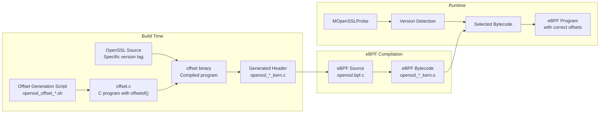
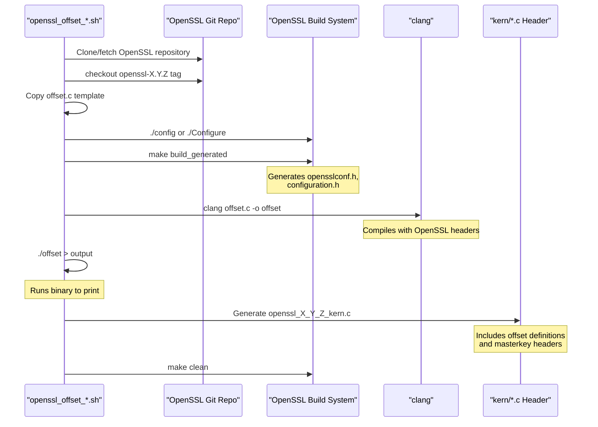
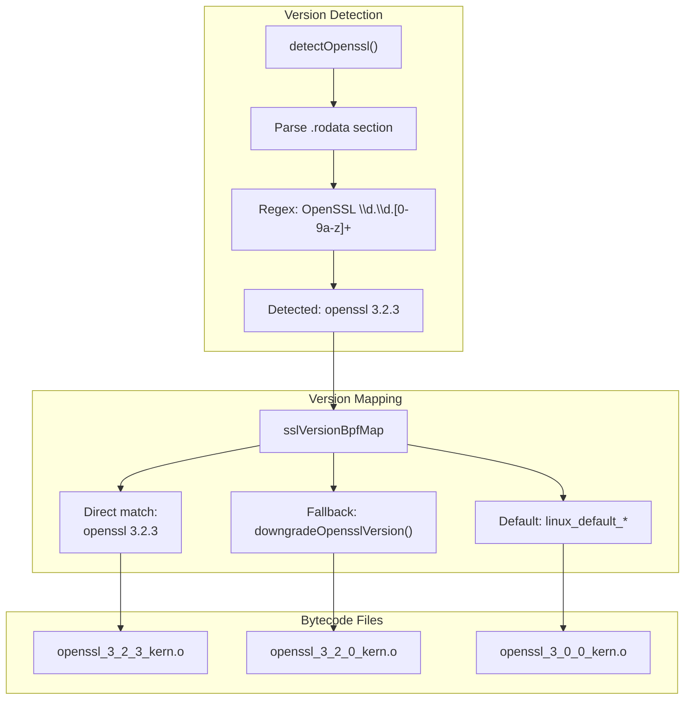
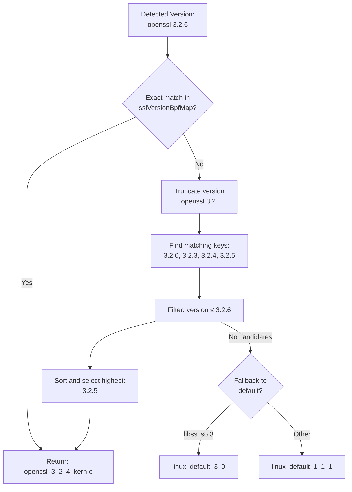
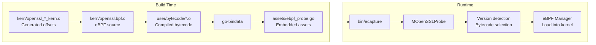

# Structure Offset Calculation

<details>
<summary>Relevant source files</summary>

The following files were used as context for generating this wiki page:

- [.github/workflows/codeql-analysis.yml](https://github.com/gojue/ecapture/blob/ca085d05/.github/workflows/codeql-analysis.yml)
- [.github/workflows/go-c-cpp.yml](https://github.com/gojue/ecapture/blob/ca085d05/.github/workflows/go-c-cpp.yml)
- [.github/workflows/release.yml](https://github.com/gojue/ecapture/blob/ca085d05/.github/workflows/release.yml)
- [Makefile](https://github.com/gojue/ecapture/blob/ca085d05/Makefile)
- [builder/Dockerfile](https://github.com/gojue/ecapture/blob/ca085d05/builder/Dockerfile)
- [builder/Makefile.release](https://github.com/gojue/ecapture/blob/ca085d05/builder/Makefile.release)
- [builder/init_env.sh](https://github.com/gojue/ecapture/blob/ca085d05/builder/init_env.sh)
- [functions.mk](https://github.com/gojue/ecapture/blob/ca085d05/functions.mk)
- [user/module/probe_openssl_lib.go](https://github.com/gojue/ecapture/blob/ca085d05/user/module/probe_openssl_lib.go)
- [utils/openssl_offset_3.0.sh](https://github.com/gojue/ecapture/blob/ca085d05/utils/openssl_offset_3.0.sh)
- [utils/openssl_offset_3.1.sh](https://github.com/gojue/ecapture/blob/ca085d05/utils/openssl_offset_3.1.sh)
- [utils/openssl_offset_3.2.sh](https://github.com/gojue/ecapture/blob/ca085d05/utils/openssl_offset_3.2.sh)
- [utils/openssl_offset_3.3.sh](https://github.com/gojue/ecapture/blob/ca085d05/utils/openssl_offset_3.3.sh)
- [utils/openssl_offset_3.4.sh](https://github.com/gojue/ecapture/blob/ca085d05/utils/openssl_offset_3.4.sh)
- [utils/openssl_offset_3.5.sh](https://github.com/gojue/ecapture/blob/ca085d05/utils/openssl_offset_3.5.sh)

</details>


## Purpose and Scope

This document explains how eCapture generates structure offset definitions for SSL/TLS libraries (OpenSSL, BoringSSL) to enable eBPF programs to access internal data structures. Structure offsets are compile-time values that specify the byte positions of fields within C structures, which vary across library versions due to internal API changes.

For information about eBPF program structure and helper functions, see [eBPF Program Structure](5.2.1-ebpf-program-structure.md). For guidance on creating new capture modules, see [Adding New Modules](5.3-adding-new-modules.md).

**Sources:** [user/module/probe_openssl_lib.go:1-449](https://github.com/gojue/ecapture/blob/ca085d05/user/module/probe_openssl_lib.go#L1-L449)

## Why Structure Offsets Are Needed

eBPF programs operate in kernel space and cannot directly call library functions or access C structure definitions at runtime. When capturing TLS traffic, eCapture must read internal SSL structures (e.g., `SSL`, `SSL_CTX`, `SSL_SESSION`) from user-space memory. These structures are opaque pointers whose internal layouts change between library versions.

The offset generation process solves this by:
1. **Extracting actual field positions** from specific library versions at build time
2. **Generating C header files** with `#define` macros for each field offset
3. **Embedding these definitions** into eBPF bytecode during compilation
4. **Enabling `bpf_probe_read_user()`** to access correct memory locations

Without accurate offsets, eBPF programs would read incorrect memory addresses, causing corrupted data capture or kernel verifier rejection.


```mermaid
graph LR
    subgraph "Build Time"
        SCRIPT["Offset Generation Script<br/>openssl_offset_*.sh"]
        OFFSET_C["offset.c<br/>C program with offsetof()"]
        SSL_SRC["OpenSSL Source<br/>Specific version tag"]
        OFFSET_BIN["offset binary<br/>Compiled program"]
        HEADER["Generated Header<br/>openssl_*_kern.c"]
    end
    
    subgraph "eBPF Compilation"
        EBPF_SRC["eBPF Source<br/>openssl.bpf.c"]
        EBPF_OBJ["eBPF Bytecode<br/>openssl_*_kern.o"]
    end
    
    subgraph "Runtime"
        PROBE["MOpenSSLProbe"]
        DETECT["Version Detection"]
        BYTECODE["Selected Bytecode"]
        KERNEL["eBPF Program<br/>with correct offsets"]
    end
    
    SCRIPT --> OFFSET_C
    SSL_SRC --> OFFSET_BIN
    OFFSET_C --> OFFSET_BIN
    OFFSET_BIN --> HEADER
    HEADER --> EBPF_SRC
    EBPF_SRC --> EBPF_OBJ
    
    PROBE --> DETECT
    DETECT --> BYTECODE
    EBPF_OBJ --> BYTECODE
    BYTECODE --> KERNEL
```

**Sources:** [user/module/probe_openssl_lib.go:189-282](https://github.com/gojue/ecapture/blob/ca085d05/user/module/probe_openssl_lib.go#L189-L282), [utils/openssl_offset_3.0.sh:1-95](https://github.com/gojue/ecapture/blob/ca085d05/utils/openssl_offset_3.0.sh#L1-L95)

## Offset Generation Process

### Script Workflow

Each offset generation script follows a standardized workflow to extract structure offsets from a specific OpenSSL version family. The process is automated and repeatable for consistency across builds.


```mermaid
sequenceDiagram
    participant Script as "openssl_offset_*.sh"
    participant Git as "OpenSSL Git Repo"
    participant Build as "OpenSSL Build System"
    participant Compiler as "clang"
    participant Output as "kern/*.c Header"
    
    Script->>Git: Clone/fetch OpenSSL repository
    Script->>Git: checkout openssl-X.Y.Z tag
    Script->>Script: Copy offset.c template
    Script->>Build: ./config or ./Configure
    Script->>Build: make build_generated
    Note over Build: Generates opensslconf.h,<br/>configuration.h
    Script->>Compiler: clang offset.c -o offset
    Note over Compiler: Compiles with OpenSSL headers
    Script->>Script: ./offset > output
    Note over Script: Runs binary to print #define statements
    Script->>Output: Generate openssl_X_Y_Z_kern.c
    Note over Output: Includes offset definitions<br/>and masterkey headers
    Script->>Build: make clean
```

**Sources:** [utils/openssl_offset_3.0.sh:24-88](https://github.com/gojue/ecapture/blob/ca085d05/utils/openssl_offset_3.0.sh#L24-L88), [utils/openssl_offset_3.2.sh:24-75](https://github.com/gojue/ecapture/blob/ca085d05/utils/openssl_offset_3.2.sh#L24-L75)

### Offset Extraction Implementation

The `offset.c` files (e.g., `openssl_3_0_offset.c`, `openssl_3_2_0_offset.c`) use the C `offsetof()` macro to compute byte offsets of structure fields. When compiled against a specific OpenSSL version, the resulting binary prints `#define` statements with actual numerical offsets.

**Key structure fields extracted:**

| Structure | Fields | Purpose |
|-----------|--------|---------|
| `SSL` | `version`, `wbio`, `rbio`, `session` | TLS version, I/O channels, session data |
| `SSL_CONNECTION` | `version`, `wbio`, `rbio` | OpenSSL 3.x connection object |
| `SSL_SESSION` | `master_key`, `master_key_length`, `cipher` | Session keys for decryption |
| `SSL_CTX` | `keylog_callback` | Key logging callback pointer |
| `BIO` | `num` | File descriptor number |

Example generated output in `openssl_3_0_0_kern.c`:

```c
#define SSL_ST_VERSION 0
#define SSL_ST_WBIO 8
#define SSL_ST_RBIO 16
#define SSL_SESSION_ST_MASTER_KEY 32
```

**Sources:** [utils/openssl_offset_3.0.sh:63-80](https://github.com/gojue/ecapture/blob/ca085d05/utils/openssl_offset_3.0.sh#L63-L80), [utils/openssl_offset_3.2.sh:51-67](https://github.com/gojue/ecapture/blob/ca085d05/utils/openssl_offset_3.2.sh#L51-L67)

### Version-Specific Scripts

eCapture maintains separate offset generation scripts for different OpenSSL major.minor version families:

| Script | Versions Covered | Offset Template | Notes |
|--------|------------------|-----------------|-------|
| `openssl_offset_3.0.sh` | 3.0.0 - 3.0.17 | `openssl_3_0_offset.c` | Version 3.0.12 has unique offsets |
| `openssl_offset_3.1.sh` | 3.1.0 - 3.1.8 | `openssl_3_0_offset.c` | Same offsets as 3.0.x |
| `openssl_offset_3.2.sh` | 3.2.0 - 3.2.5 | `openssl_3_2_0_offset.c` | Introduces `SSL_CONNECTION` |
| `openssl_offset_3.3.sh` | 3.3.0 - 3.3.4 | `openssl_3_2_0_offset.c` | Same offsets as 3.2.x |
| `openssl_offset_3.4.sh` | 3.4.0 - 3.4.2 | `openssl_3_2_0_offset.c` | Same offsets as 3.2.x |
| `openssl_offset_3.5.sh` | 3.5.0 - 3.5.4 | `openssl_3_5_0_offset.c` | Latest supported version |

Each script defines a version map (`sslVerMap`) that groups patch versions sharing identical offsets. For example, in [utils/openssl_offset_3.0.sh:27-45](https://github.com/gojue/ecapture/blob/ca085d05/utils/openssl_offset_3.0.sh#L27-L45):

```bash
declare -A sslVerMap=()
sslVerMap["0"]="0"   # 3.0.0 uses openssl_3_0_0_kern.c
sslVerMap["1"]="0"   # 3.0.1 uses openssl_3_0_0_kern.c
# ...
sslVerMap["12"]="12" # 3.0.12 has unique offsets
sslVerMap["13"]="0"  # 3.0.13+ back to 3.0.0 offsets
```

**Sources:** [utils/openssl_offset_3.0.sh:27-45](https://github.com/gojue/ecapture/blob/ca085d05/utils/openssl_offset_3.0.sh#L27-L45), [utils/openssl_offset_3.2.sh:27-33](https://github.com/gojue/ecapture/blob/ca085d05/utils/openssl_offset_3.2.sh#L27-L33), [utils/openssl_offset_3.5.sh:27-33](https://github.com/gojue/ecapture/blob/ca085d05/utils/openssl_offset_3.5.sh#L27-L33)

## Version Grouping and Mapping

### Runtime Version to Bytecode Mapping

The `MOpenSSLProbe` module maintains a comprehensive map (`sslVersionBpfMap`) that associates detected library versions with pre-compiled eBPF bytecode files. This mapping is initialized in `initOpensslOffset()`.


```mermaid
graph TB
    subgraph "Version Detection"
        DETECT["detectOpenssl()"]
        ELF["Parse .rodata section"]
        REGEX["Regex: OpenSSL \\d.\\d.[0-9a-z]+"]
        VERSION["Detected: openssl 3.2.3"]
    end
    
    subgraph "Version Mapping"
        MAP["sslVersionBpfMap"]
        DIRECT["Direct match:<br/>openssl 3.2.3"]
        DOWNGRADE["Fallback: downgradeOpensslVersion()"]
        DEFAULT["Default: linux_default_*"]
    end
    
    subgraph "Bytecode Files"
        BPF_323["openssl_3_2_3_kern.o"]
        BPF_320["openssl_3_2_0_kern.o"]
        BPF_DEFAULT["openssl_3_0_0_kern.o"]
    end
    
    DETECT --> ELF
    ELF --> REGEX
    REGEX --> VERSION
    
    VERSION --> MAP
    MAP --> DIRECT
    MAP --> DOWNGRADE
    MAP --> DEFAULT
    
    DIRECT --> BPF_323
    DOWNGRADE --> BPF_320
    DEFAULT --> BPF_DEFAULT
```

**Sources:** [user/module/probe_openssl_lib.go:73-187](https://github.com/gojue/ecapture/blob/ca085d05/user/module/probe_openssl_lib.go#L73-L187), [user/module/probe_openssl_lib.go:189-282](https://github.com/gojue/ecapture/blob/ca085d05/user/module/probe_openssl_lib.go#L189-L282)

### Version Grouping Strategy

Multiple OpenSSL versions share bytecode files when their internal structures have identical layouts. This reduces bytecode duplication and simplifies maintenance.

**OpenSSL 1.1.1 Grouping** ([user/module/probe_openssl_lib.go:105-121](https://github.com/gojue/ecapture/blob/ca085d05/user/module/probe_openssl_lib.go#L105-L121)):

| Group | Versions | Bytecode File | Reason |
|-------|----------|---------------|--------|
| A | 1.1.1a | `openssl_1_1_1a_kern.o` | Initial 1.1.1 release |
| B | 1.1.1b-c | `openssl_1_1_1b_kern.o` | Minor structure changes |
| C | 1.1.1d-i | `openssl_1_1_1d_kern.o` | Stable structure layout |
| D | 1.1.1j-w | `openssl_1_1_1j_kern.o` | Latest 1.1.1 series |

**OpenSSL 3.x Grouping** ([user/module/probe_openssl_lib.go:124-176](https://github.com/gojue/ecapture/blob/ca085d05/user/module/probe_openssl_lib.go#L124-L176)):

```
3.0.0 - 3.0.11  →  openssl_3_0_0_kern.o
3.0.12          →  openssl_3_0_12_kern.o  (exception: unique offsets)
3.0.13 - 3.0.17 →  openssl_3_0_0_kern.o
3.1.0 - 3.1.8   →  openssl_3_1_0_kern.o  (shares structure with 3.0.x)
3.2.0 - 3.2.2   →  openssl_3_2_0_kern.o
3.2.3           →  openssl_3_2_3_kern.o
3.2.4 - 3.2.5   →  openssl_3_2_4_kern.o
3.3.0 - 3.3.1   →  openssl_3_3_0_kern.o
3.3.2           →  openssl_3_3_2_kern.o
3.3.3 - 3.3.4   →  openssl_3_3_3_kern.o
3.4.0           →  openssl_3_4_0_kern.o
3.4.1 - 3.4.2   →  openssl_3_4_1_kern.o
3.5.0 - 3.5.4   →  openssl_3_5_0_kern.o
```

**BoringSSL Android Versions** ([user/module/probe_openssl_lib.go:92-97](https://github.com/gojue/ecapture/blob/ca085d05/user/module/probe_openssl_lib.go#L92-L97)):

```
boringssl_a_13  →  boringssl_a_13_kern.o  (Android 13)
boringssl_a_14  →  boringssl_a_14_kern.o  (Android 14)
boringssl_a_15  →  boringssl_a_15_kern.o  (Android 15)
boringssl_a_16  →  boringssl_a_16_kern.o  (Android 16)
```

**Sources:** [user/module/probe_openssl_lib.go:73-187](https://github.com/gojue/ecapture/blob/ca085d05/user/module/probe_openssl_lib.go#L73-L187)

### Version Downgrade Mechanism

When an exact version match is not found in `sslVersionBpfMap`, the `downgradeOpensslVersion()` function implements a fallback strategy to find the nearest compatible older version.

**Algorithm** ([user/module/probe_openssl_lib.go:341-369](https://github.com/gojue/ecapture/blob/ca085d05/user/module/probe_openssl_lib.go#L341-L369)):

1. **Prefix matching**: Iteratively truncate version string from right to left
2. **Candidate filtering**: Find all versions matching prefix where `version <= detected_version`
3. **Selection**: Choose highest compatible version (lexicographically sorted)
4. **Default fallback**: If no match, use `linux_default_3_0` or `linux_default_1_1_1` based on library filename

Example: If `openssl 3.2.6` is detected but not in the map:
- Iteration 1: Search for `openssl 3.2.` → finds `3.2.0`, `3.2.3`, `3.2.4`, `3.2.5`
- Select highest: `3.2.5` → use `openssl_3_2_4_kern.o`


```mermaid
graph TD
    START["Detected Version:<br/>openssl 3.2.6"]
    EXACT{"Exact match in<br/>sslVersionBpfMap?"}
    PREFIX["Truncate version<br/>openssl 3.2."]
    SEARCH["Find matching keys:<br/>3.2.0, 3.2.3, 3.2.4, 3.2.5"]
    FILTER["Filter: version ≤ 3.2.6"]
    SORT["Sort and select highest:<br/>3.2.5"]
    BYTECODE["Return: openssl_3_2_4_kern.o"]
    DEFAULT{"Fallback to<br/>default?"}
    DEFAULT_30["linux_default_3_0"]
    DEFAULT_111["linux_default_1_1_1"]
    
    START --> EXACT
    EXACT -->|Yes| BYTECODE
    EXACT -->|No| PREFIX
    PREFIX --> SEARCH
    SEARCH --> FILTER
    FILTER --> SORT
    SORT --> BYTECODE
    FILTER -->|No candidates| DEFAULT
    DEFAULT -->|libssl.so.3| DEFAULT_30
    DEFAULT -->|Other| DEFAULT_111
```

**Sources:** [user/module/probe_openssl_lib.go:341-369](https://github.com/gojue/ecapture/blob/ca085d05/user/module/probe_openssl_lib.go#L341-L369), [user/module/probe_openssl_lib.go:371-422](https://github.com/gojue/ecapture/blob/ca085d05/user/module/probe_openssl_lib.go#L371-L422)

## Supporting New Library Versions

### Adding a New OpenSSL Version

To support a new OpenSSL release (e.g., `3.6.0`), developers must determine whether existing offsets are compatible or if new offset generation is required.

**Step 1: Create Offset Generation Script**

If the version family is new, create a script modeled on existing scripts:

```bash
# Create utils/openssl_offset_3.6.sh
cp utils/openssl_offset_3.5.sh utils/openssl_offset_3.6.sh
```

**Step 2: Update Version Map**

Modify the `sslVerMap` array to include new patch versions:

```bash
declare -A sslVerMap=()
sslVerMap["0"]="0"  # 3.6.0
sslVerMap["1"]="1"  # 3.6.1 (if different offsets)
# ... add more versions as they're released
```

**Step 3: Run Offset Generation**

Execute the script from the project root:

```bash
./utils/openssl_offset_3.6.sh
```

This generates files like `kern/openssl_3_6_0_kern.c` with offset definitions.

**Step 4: Update Version Mapping in Code**

Modify `initOpensslOffset()` in [user/module/probe_openssl_lib.go:73-187](https://github.com/gojue/ecapture/blob/ca085d05/user/module/probe_openssl_lib.go#L73-L187):

```go
// Add new version range
for ch := 0; ch <= MaxSupportedOpenSSL36Version; ch++ {
    m.sslVersionBpfMap[fmt.Sprintf("openssl 3.6.%d", ch)] = "openssl_3_6_0_kern.o"
}
```

Update version constants at the top of the file:

```go
const (
    MaxSupportedOpenSSL36Version = 5  // openssl 3.6.5
)
```

**Step 5: Verify eBPF Compilation**

Ensure the generated headers compile correctly:

```bash
make clean
make ebpf
# Verify user/bytecode/openssl_3_6_0_kern_core.o is created
```

**Step 6: Test Version Detection**

Test the module with a system using the new OpenSSL version to verify:
- Correct version string detection
- Proper bytecode selection
- Successful data capture

**Sources:** [utils/openssl_offset_3.5.sh:1-81](https://github.com/gojue/ecapture/blob/ca085d05/utils/openssl_offset_3.5.sh#L1-L81), [user/module/probe_openssl_lib.go:73-187](https://github.com/gojue/ecapture/blob/ca085d05/user/module/probe_openssl_lib.go#L73-L187)

### Handling Special Cases

#### OpenSSL 3.0.12 Exception

OpenSSL 3.0.12 has unique structure offsets despite being within the 3.0.x series. This requires special handling in the version map ([user/module/probe_openssl_lib.go:128-130](https://github.com/gojue/ecapture/blob/ca085d05/user/module/probe_openssl_lib.go#L128-L130)):

```go
// 3.0.0-3.0.11 and 3.0.13-3.0.17 use openssl_3_0_0_kern.o
m.sslVersionBpfMap[fmt.Sprintf("openssl 3.0.%d", SupportedOpenSSL30Version12)] = "openssl_3_0_12_kern.o"
```

And in the generation script ([utils/openssl_offset_3.0.sh:40](https://github.com/gojue/ecapture/blob/ca085d05/utils/openssl_offset_3.0.sh#L40)):

```bash
sslVerMap["12"]="12"  # 3.0.12 is different
```

#### BoringSSL Non-Android

BoringSSL has separate builds for Android and non-Android systems. The non-Android version uses a special identifier:

```go
// git repo: https://github.com/google/boringssl
"boringssl na": "boringssl_na_kern.o",
```

Developers must create corresponding offset scripts (e.g., `boringssl_offset_na.sh`) following the same pattern but using the BoringSSL repository.

**Sources:** [user/module/probe_openssl_lib.go:99-103](https://github.com/gojue/ecapture/blob/ca085d05/user/module/probe_openssl_lib.go#L99-L103), [utils/openssl_offset_3.0.sh:40](https://github.com/gojue/ecapture/blob/ca085d05/utils/openssl_offset_3.0.sh#L40)

### Offset Validation

After generating new offsets, validate correctness by:

1. **Compile-time checks**: eBPF verifier will reject invalid memory accesses
2. **Runtime testing**: Capture actual TLS traffic and verify data integrity
3. **Cross-version testing**: Test with multiple patch versions in the same family
4. **Comparison**: Compare generated offsets with previous versions to identify changes

If offsets are incorrect, symptoms include:
- Kernel verifier errors during eBPF program loading
- Corrupted captured data (wrong bytes, null values)
- Incorrect master key extraction
- Segmentation faults in target processes

**Sources:** [user/module/probe_openssl_lib.go:189-282](https://github.com/gojue/ecapture/blob/ca085d05/user/module/probe_openssl_lib.go#L189-L282)

## Integration with Build System

### Makefile Integration

The offset generation scripts are invoked manually during development but not automatically during normal builds. Generated header files are committed to the repository in `kern/` directory.

**Build Process** ([Makefile:117-127](https://github.com/gojue/ecapture/blob/ca085d05/Makefile#L117-L127)):

```makefile
$(KERN_OBJECTS): %.o: %.c \
    | .checkver_$(CMD_CLANG) \
    .checkver_$(CMD_GO) \
    autogen
    $(CMD_CLANG) -D__TARGET_ARCH_$(LINUX_ARCH) \
        $(EXTRA_CFLAGS) \
        $(BPFHEADER) \
        -target bpfel -c $< -o $(subst kern/,user/bytecode/,$(subst .o,_core.o,$@)) \
        ...
```

The generated headers are `#include`d by eBPF source files (e.g., `openssl.bpf.c`), which are then compiled into bytecode.

**CI/CD Workflow** ([.github/workflows/go-c-cpp.yml:38-65](https://github.com/gojue/ecapture/blob/ca085d05/.github/workflows/go-c-cpp.yml#L38-L65)):

```yaml
- name: Build CO-RE
  run: |
    make clean
    make env
    DEBUG=1 make -j8
```

The workflow does not regenerate offsets but uses committed header files. This ensures consistent builds and avoids dependency on external OpenSSL repositories during CI.

**Sources:** [Makefile:117-127](https://github.com/gojue/ecapture/blob/ca085d05/Makefile#L117-L127), [.github/workflows/go-c-cpp.yml:38-65](https://github.com/gojue/ecapture/blob/ca085d05/.github/workflows/go-c-cpp.yml#L38-L65)

### Asset Embedding

After compilation, eBPF bytecode files are embedded into the Go binary using `go-bindata`:

```makefile
assets: .checkver_$(CMD_GO) ebpf ebpf_noncore
    $(CMD_GO) run github.com/shuLhan/go-bindata/cmd/go-bindata $(IGNORE_LESS52) \
        -pkg assets -o "assets/ebpf_probe.go" $(wildcard ./user/bytecode/*.o)
```

This creates `assets/ebpf_probe.go` containing all bytecode files as Go byte arrays. At runtime, `MOpenSSLProbe` selects and loads the appropriate bytecode based on detected version.


```mermaid
graph LR
    subgraph "Build Time"
        HEADER["kern/openssl_*_kern.c<br/>Generated offsets"]
        EBPF_SRC["kern/openssl.bpf.c<br/>eBPF source"]
        BYTECODE["user/bytecode/*.o<br/>Compiled bytecode"]
        EMBED["go-bindata"]
        ASSETS["assets/ebpf_probe.go<br/>Embedded assets"]
    end
    
    subgraph "Runtime"
        BINARY["bin/ecapture"]
        MODULE["MOpenSSLProbe"]
        SELECT["Version detection<br/>Bytecode selection"]
        LOAD["eBPF Manager<br/>Load into kernel"]
    end
    
    HEADER --> EBPF_SRC
    EBPF_SRC --> BYTECODE
    BYTECODE --> EMBED
    EMBED --> ASSETS
    ASSETS --> BINARY
    
    BINARY --> MODULE
    MODULE --> SELECT
    SELECT --> LOAD
```

**Sources:** [Makefile:162-164](https://github.com/gojue/ecapture/blob/ca085d05/Makefile#L162-L164), [builder/Makefile.release:63-76](https://github.com/gojue/ecapture/blob/ca085d05/builder/Makefile.release#L63-L76)

### Cross-Compilation Considerations

When cross-compiling for different architectures (e.g., building arm64 binaries on amd64), offset values remain consistent because they depend on the OpenSSL library structure, not the CPU architecture. However, separate bytecode files are generated for each architecture due to eBPF instruction set differences.

**Cross-compilation workflow** ([.github/workflows/go-c-cpp.yml:56-65](https://github.com/gojue/ecapture/blob/ca085d05/.github/workflows/go-c-cpp.yml#L56-L65)):

```yaml
- name: Build CO-RE (Cross-Compilation)
  run: |
    make clean
    CROSS_ARCH=arm64 make env
    CROSS_ARCH=arm64 make -j8
```

The same offset headers are used, but the eBPF compiler generates architecture-specific bytecode (`*_core.o` files).

**Sources:** [.github/workflows/go-c-cpp.yml:56-65](https://github.com/gojue/ecapture/blob/ca085d05/.github/workflows/go-c-cpp.yml#L56-L65), [Makefile:56-60](https://github.com/gojue/ecapture/blob/ca085d05/Makefile#L56-L60)