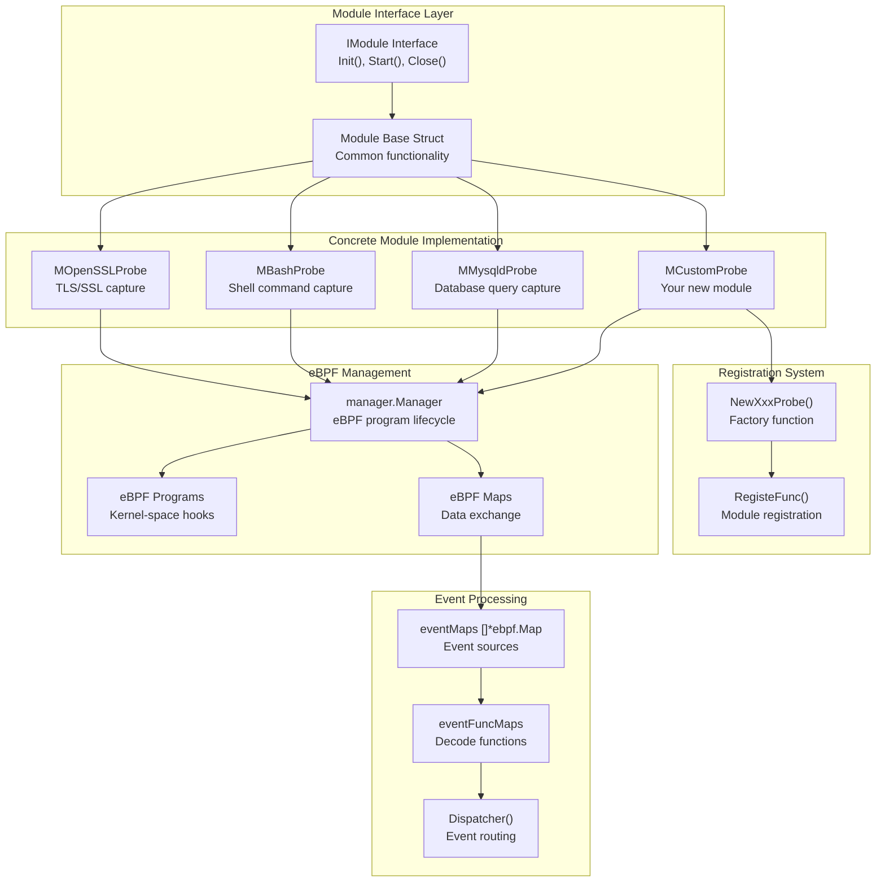
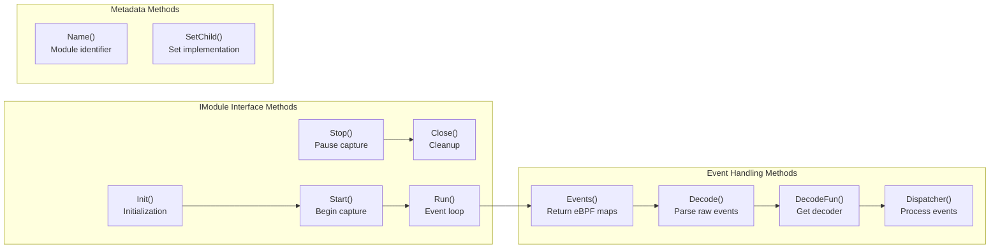
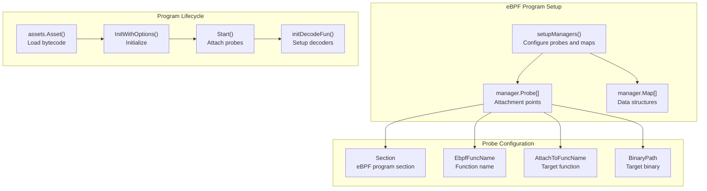
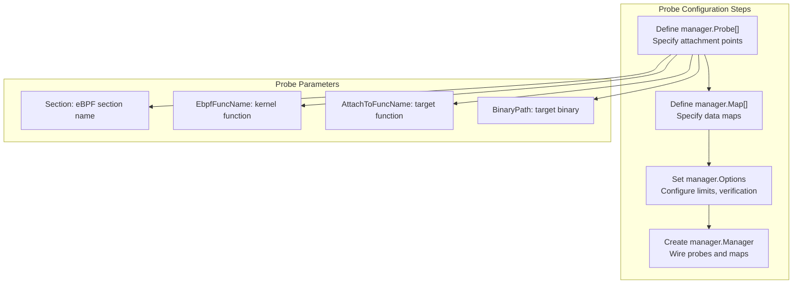
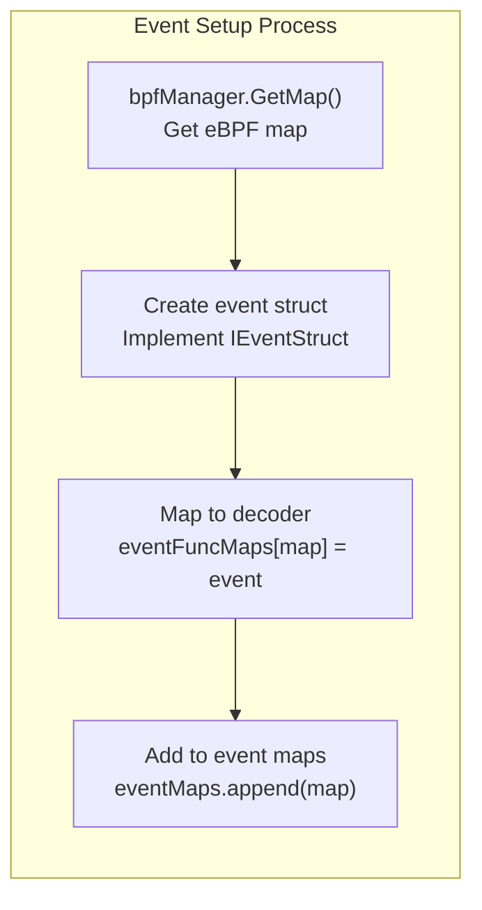
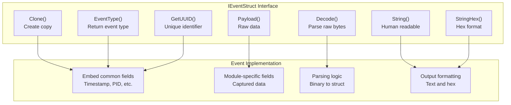

# Adding New Modules

<details>
<summary>Relevant source files</summary>

The following files were used as context for generating this wiki page:

- [cli/cmd/bash.go](https://github.com/gojue/ecapture/blob/0766a93b/cli/cmd/bash.go)
- [cli/cmd/gnutls.go](https://github.com/gojue/ecapture/blob/0766a93b/cli/cmd/gnutls.go)
- [cli/cmd/gotls.go](https://github.com/gojue/ecapture/blob/0766a93b/cli/cmd/gotls.go)
- [cli/cmd/mysqld.go](https://github.com/gojue/ecapture/blob/0766a93b/cli/cmd/mysqld.go)
- [cli/cmd/nspr.go](https://github.com/gojue/ecapture/blob/0766a93b/cli/cmd/nspr.go)
- [cli/cmd/postgres.go](https://github.com/gojue/ecapture/blob/0766a93b/cli/cmd/postgres.go)
- [cli/cmd/root.go](https://github.com/gojue/ecapture/blob/0766a93b/cli/cmd/root.go)
- [cli/cmd/tls.go](https://github.com/gojue/ecapture/blob/0766a93b/cli/cmd/tls.go)
- [cli/cmd/zsh.go](https://github.com/gojue/ecapture/blob/0766a93b/cli/cmd/zsh.go)
- [pkg/util/ws/client.go](https://github.com/gojue/ecapture/blob/0766a93b/pkg/util/ws/client.go)
- [pkg/util/ws/client_test.go](https://github.com/gojue/ecapture/blob/0766a93b/pkg/util/ws/client_test.go)
- [user/config/iconfig.go](https://github.com/gojue/ecapture/blob/0766a93b/user/config/iconfig.go)
- [user/module/imodule.go](https://github.com/gojue/ecapture/blob/0766a93b/user/module/imodule.go)
- [user/module/probe_openssl.go](https://github.com/gojue/ecapture/blob/0766a93b/user/module/probe_openssl.go)

</details>


This document provides a comprehensive guide for implementing new capture modules in the ecapture system. It covers the module architecture, interface requirements, eBPF integration, and step-by-step implementation process.

For information about the overall system architecture, see [Architecture](../2-architecture/index.md). For details on the existing capture modules, see [Capture Modules](../3-capture-modules/index.md). For eBPF program development specifics, see [eBPF Programs](5.2-ebpf-program-development.md).

## Module Architecture Overview

The ecapture module system is built around a plugin-like architecture where each module implements the `IModule` interface to capture specific types of network traffic or system events. All modules follow a consistent pattern of eBPF program management, event processing, and data output.



Sources: [user/module/imodule.go:38-66](https://github.com/gojue/ecapture/blob/0766a93b/user/module/imodule.go#L38-L66), [user/module/probe_openssl.go:83-106](https://github.com/gojue/ecapture/blob/0766a93b/user/module/probe_openssl.go#L83-L106), [user/module/probe_bash.go:42-49](https://github.com/gojue/ecapture/blob/0766a93b/user/module/probe_bash.go#L42-L49)

## Core Interface Requirements

Every module must implement the `IModule` interface and embed the `Module` base struct. The interface defines the essential lifecycle and functionality methods:



The base `Module` struct provides common functionality including event processing, BTF detection, and eBPF program lifecycle management.

Sources: [user/module/imodule.go:38-66](https://github.com/gojue/ecapture/blob/0766a93b/user/module/imodule.go#L38-L66), [user/module/imodule.go:74-97](https://github.com/gojue/ecapture/blob/0766a93b/user/module/imodule.go#L74-L97)

## Module Implementation Pattern

All concrete modules follow a consistent implementation pattern with specific struct fields and initialization steps:

| Component | Purpose | Implementation |
|-----------|---------|----------------|
| `bpfManager` | eBPF program lifecycle management | `*manager.Manager` |
| `bpfManagerOptions` | eBPF program configuration | `manager.Options` |
| `eventFuncMaps` | Event type to decoder mapping | `map[*ebpf.Map]event.IEventStruct` |
| `eventMaps` | eBPF maps for event data | `[]*ebpf.Map` |
| Module-specific fields | Custom state and configuration | Varies by module |

```mermaid
graph TD
    subgraph "Module Struct Layout"
        Base["Module (embedded)<br/>Base functionality"]
        Manager["bpfManager<br/>*manager.Manager"]
        Options["bpfManagerOptions<br/>manager.Options"]
        EventMaps["eventMaps<br/>[]*ebpf.Map"]
        EventFuncs["eventFuncMaps<br/>map[*ebpf.Map]event.IEventStruct"]
        Custom["Module-specific fields<br/>Configuration, state, etc."]
    end
    
    subgraph "Initialization Flow"
        InitCall["Init() called"]
        BaseInit["Module.Init()"]
        SetChild["SetChild(m)"]
        InitMaps["Initialize maps"]
        InitState["Initialize module state"]
    end
    
    InitCall --> BaseInit
    BaseInit --> SetChild
    SetChild --> InitMaps
    InitMaps --> InitState
    
    Base --> Manager
    Manager --> Options
    Options --> EventMaps
    EventMaps --> EventFuncs
    EventFuncs --> Custom
```



Sources: [user/module/probe_openssl.go:83-106](https://github.com/gojue/ecapture/blob/0766a93b/user/module/probe_openssl.go#L83-L106), [user/module/probe_bash.go:42-49](https://github.com/gojue/ecapture/blob/0766a93b/user/module/probe_bash.go#L42-L49), [user/module/probe_nspr.go:38-44](https://github.com/gojue/ecapture/blob/0766a93b/user/module/probe_nspr.go#L38-L44)

## eBPF Program Integration

Modules integrate with eBPF programs through the `manager.Manager` system, which handles program loading, attachment, and map management. Each module must define its probe configuration and map requirements:



Sources: [user/module/probe_bash.go:147-236](https://github.com/gojue/ecapture/blob/0766a93b/user/module/probe_bash.go#L147-L236), [user/module/probe_openssl.go:285-355](https://github.com/gojue/ecapture/blob/0766a93b/user/module/probe_openssl.go#L285-L355), [user/module/probe_nspr.go:135-247](https://github.com/gojue/ecapture/blob/0766a93b/user/module/probe_nspr.go#L135-L247)

## Event Processing Pipeline

Modules integrate with the event processing system by providing event maps and decode functions. The pipeline handles event routing, parsing, and output formatting:

```mermaid
graph LR
    subgraph "Kernel Space"
        eBPFProg["eBPF Programs"]
        eBPFMaps["eBPF Maps"]
    end
    
    subgraph "Module Event Handling"
        Events["Events()<br/>Return event maps"]
        DecodeFun["DecodeFun()<br/>Get event decoder"]
        Decode["Decode()<br/>Parse raw bytes"]
        Dispatcher["Dispatcher()<br/>Handle parsed event"]
    end
    
    subgraph "Event Processing System"
        Processor["EventProcessor<br/>Main event loop"]
        Workers["EventWorkers<br/>Per-connection processing"]
        Parsers["IParser<br/>Protocol parsing"]
    end
    
    eBPFProg --> eBPFMaps
    eBPFMaps --> Events
    Events --> DecodeFun
    DecodeFun --> Decode
    Decode --> Dispatcher
    Dispatcher --> Processor
    Processor --> Workers
    Workers --> Parsers
```



Sources: [user/module/imodule.go:267-333](https://github.com/gojue/ecapture/blob/0766a93b/user/module/imodule.go#L267-L333), [pkg/event_processor/processor.go:66-89](https://github.com/gojue/ecapture/blob/0766a93b/pkg/event_processor/processor.go#L66-L89), [pkg/event_processor/iworker.go:87-94](https://github.com/gojue/ecapture/blob/0766a93b/pkg/event_processor/iworker.go#L87-L94)

## Module Registration System

Modules self-register using a factory pattern with the `RegisteFunc()` system. This enables dynamic module discovery and instantiation:

```mermaid
graph TD
    subgraph "Registration Pattern"
        Factory["NewXxxProbe()<br/>Factory function"]
        ModStruct["Create module struct"]
        SetName["Set module name"]
        SetType["Set probe type"]
        Return["Return IModule"]
    end
    
    subgraph "Registration Process"
        InitFunc["init() function"]
        CallRegister["RegisteFunc(NewXxxProbe)"]
        ModuleMap["Global module registry"]
    end
    
    subgraph "Module Discovery"
        GetModules["Module enumeration"]
        CreateInstance["Factory invocation"]
        ModuleInit["Module initialization"]
    end
    
    Factory --> ModStruct
    ModStruct --> SetName
    SetName --> SetType
    SetType --> Return
    
    InitFunc --> CallRegister
    CallRegister --> ModuleMap
    
    GetModules --> CreateInstance
    CreateInstance --> ModuleInit
```



Sources: [user/module/probe_bash.go:311-320](https://github.com/gojue/ecapture/blob/0766a93b/user/module/probe_bash.go#L311-L320), [user/module/probe_openssl.go:782-791](https://github.com/gojue/ecapture/blob/0766a93b/user/module/probe_openssl.go#L782-L791), [user/module/probe_nspr.go:273-282](https://github.com/gojue/ecapture/blob/0766a93b/user/module/probe_nspr.go#L273-L282)

## Step-by-Step Implementation Guide

### 1. Create Module Structure

Create a new file `user/module/probe_yourmodule.go` with the basic module structure:

```go
type MYourModuleProbe struct {
    Module                    // Embed base module
    bpfManager        *manager.Manager
    bpfManagerOptions manager.Options
    eventFuncMaps     map[*ebpf.Map]event.IEventStruct
    eventMaps         []*ebpf.Map
    // Add module-specific fields here
}
```

### 2. Implement Core Interface Methods

Implement the required `IModule` interface methods:

| Method | Purpose | Key Responsibilities |
|--------|---------|---------------------|
| `Init()` | Initialize module | Call `Module.Init()`, set child, initialize maps |
| `Start()` | Begin capture | Load eBPF programs, attach probes, setup decoders |
| `Close()` | Cleanup | Stop eBPF manager, close resources |
| `Events()` | Return event maps | Provide eBPF maps for event reading |
| `DecodeFun()` | Get decoder | Return appropriate event decoder for map |
| `Dispatcher()` | Process events | Handle parsed events, apply business logic |

### 3. Configure eBPF Programs

Implement `setupManagers()` to define probe attachment points and maps:



### 4. Implement Event Handling

Create event structures and decoder mappings in `initDecodeFun()`:



### 5. Register Module

Add registration code at the end of your module file:

```go
func init() {
    RegisteFunc(NewYourModuleProbe)
}

func NewYourModuleProbe() IModule {
    mod := &MYourModuleProbe{}
    mod.name = ModuleNameYourModule
    mod.mType = ProbeTypeUprobe
    return mod
}
```

Sources: [user/module/probe_bash.go:52-63](https://github.com/gojue/ecapture/blob/0766a93b/user/module/probe_bash.go#L52-L63), [user/module/probe_bash.go:72-104](https://github.com/gojue/ecapture/blob/0766a93b/user/module/probe_bash.go#L72-L104), [user/module/probe_bash.go:243-258](https://github.com/gojue/ecapture/blob/0766a93b/user/module/probe_bash.go#L243-L258)

## Event Structure Development

Create event structures that implement `event.IEventStruct` to handle data from your eBPF programs:



Sources: [user/event/event_bash.go](https://github.com/gojue/ecapture/blob/0766a93b/user/event/event_bash.go), [user/event/event_nspr.go](https://github.com/gojue/ecapture/blob/0766a93b/user/event/event_nspr.go), [pkg/event_processor/iworker.go:32-46](https://github.com/gojue/ecapture/blob/0766a93b/pkg/event_processor/iworker.go#L32-L46)

## Testing and Debugging

Use the following approaches to test and debug your new module:

| Testing Phase | Techniques | Tools |
|---------------|------------|-------|
| eBPF Program | Use `bpftrace` to verify probe attachment | `bpftrace`, `bpftool` |
| Event Flow | Add debug logging in `Dispatcher()` | `zerolog` logging |
| Data Parsing | Test event decode with sample data | Unit tests |
| Integration | Run with target application | Full system test |

### Common Issues and Solutions

| Issue | Symptoms | Solution |
|-------|----------|----------|
| Probe attachment fails | "couldn't attach" errors | Verify target binary path and function names |
| No events received | Silent operation | Check eBPF map configuration and event trigger conditions |
| Decode errors | Malformed event data | Verify eBPF and Go struct field alignment |
| Memory leaks | Increasing memory usage | Ensure proper cleanup in `Close()` method |

Sources: [user/module/probe_bash.go:65-104](https://github.com/gojue/ecapture/blob/0766a93b/user/module/probe_bash.go#L65-L104), [user/module/imodule.go:267-333](https://github.com/gojue/ecapture/blob/0766a93b/user/module/imodule.go#L267-L333), [pkg/event_processor/processor.go:187-200](https://github.com/gojue/ecapture/blob/0766a93b/pkg/event_processor/processor.go#L187-L200)

This comprehensive guide provides the framework for implementing new capture modules in ecapture. Follow the established patterns and interface requirements to ensure proper integration with the existing system architecture.