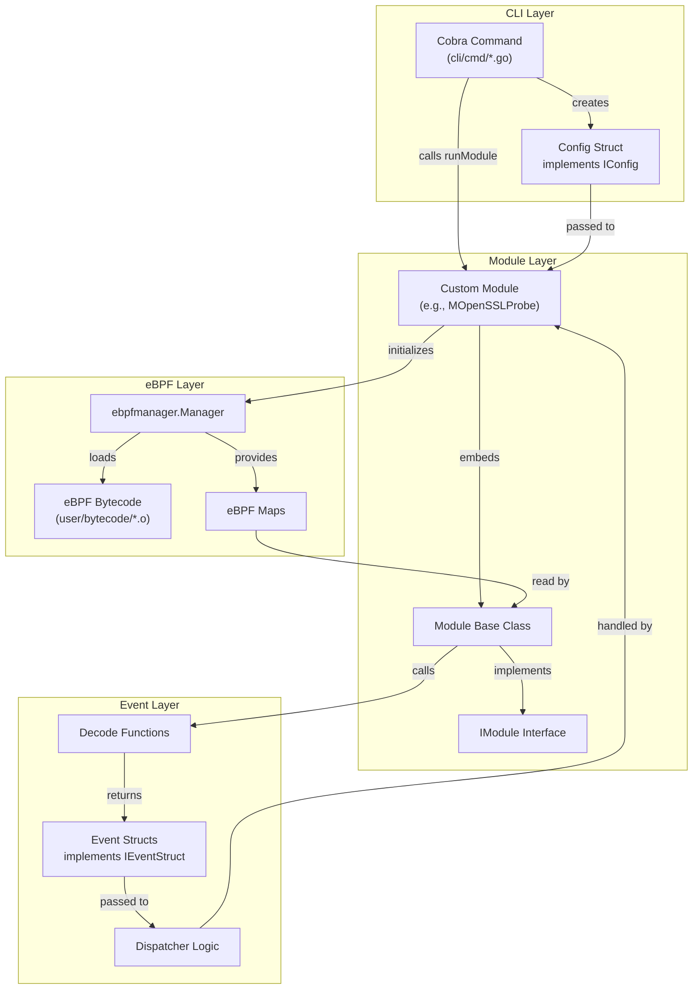
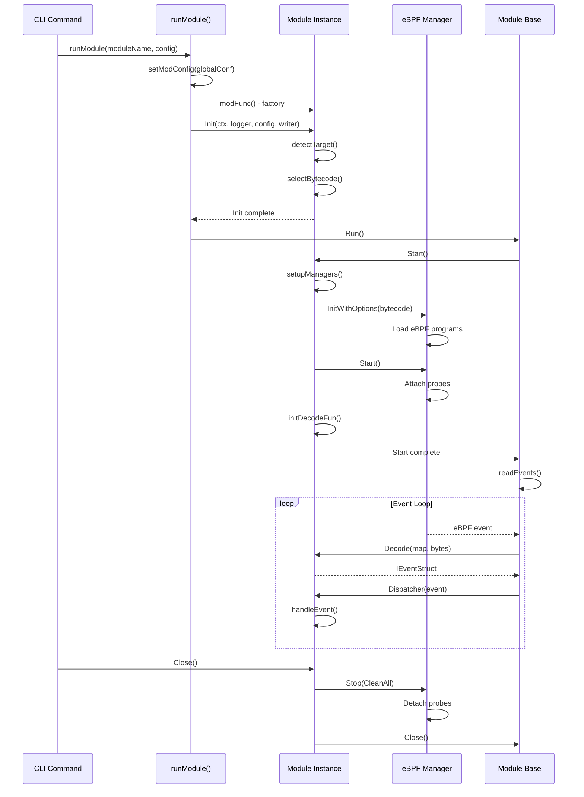
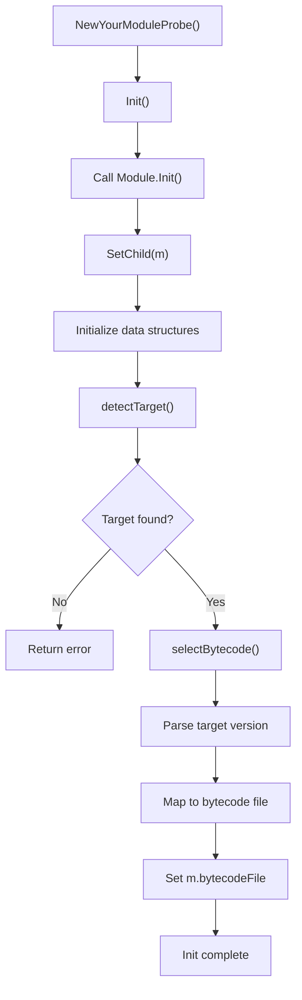
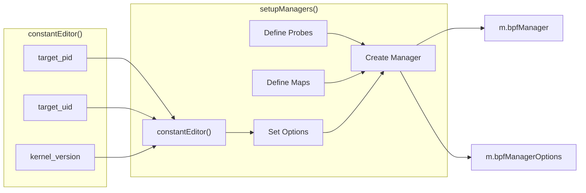

# Adding New Modules

<details>
<summary>Relevant source files</summary>

The following files were used as context for generating this wiki page:

- [cli/cmd/bash.go](https://github.com/gojue/ecapture/blob/ca085d05/cli/cmd/bash.go)
- [cli/cmd/gnutls.go](https://github.com/gojue/ecapture/blob/ca085d05/cli/cmd/gnutls.go)
- [cli/cmd/gotls.go](https://github.com/gojue/ecapture/blob/ca085d05/cli/cmd/gotls.go)
- [cli/cmd/mysqld.go](https://github.com/gojue/ecapture/blob/ca085d05/cli/cmd/mysqld.go)
- [cli/cmd/nspr.go](https://github.com/gojue/ecapture/blob/ca085d05/cli/cmd/nspr.go)
- [cli/cmd/postgres.go](https://github.com/gojue/ecapture/blob/ca085d05/cli/cmd/postgres.go)
- [cli/cmd/root.go](https://github.com/gojue/ecapture/blob/ca085d05/cli/cmd/root.go)
- [cli/cmd/tls.go](https://github.com/gojue/ecapture/blob/ca085d05/cli/cmd/tls.go)
- [cli/cmd/zsh.go](https://github.com/gojue/ecapture/blob/ca085d05/cli/cmd/zsh.go)
- [pkg/util/ws/client.go](https://github.com/gojue/ecapture/blob/ca085d05/pkg/util/ws/client.go)
- [pkg/util/ws/client_test.go](https://github.com/gojue/ecapture/blob/ca085d05/pkg/util/ws/client_test.go)
- [user/config/iconfig.go](https://github.com/gojue/ecapture/blob/ca085d05/user/config/iconfig.go)
- [user/module/imodule.go](https://github.com/gojue/ecapture/blob/ca085d05/user/module/imodule.go)
- [user/module/probe_openssl.go](https://github.com/gojue/ecapture/blob/ca085d05/user/module/probe_openssl.go)

</details>


This guide explains how to implement new capture modules in eCapture. It covers the complete process from defining the module structure to integrating it with the CLI and eBPF subsystems.

For information about implementing event parsers for captured data, see [Event Processing and Parsers](5.4-event-processing-and-parsers.md). For eBPF program development patterns, see [eBPF Program Development](5.2-ebpf-program-development.md).

## Overview

eCapture's modular architecture allows developers to add new capture targets (libraries, applications, system calls) by implementing the `IModule` interface. Each module consists of:

- A module implementation struct implementing `IModule`
- A configuration struct implementing `IConfig`  
- A CLI command definition
- eBPF programs for kernel-space instrumentation
- Event structure definitions for captured data

The system provides base classes (`Module`, `MTCProbe`) that handle common functionality like eBPF map reading, event dispatching, and lifecycle management.

## Module Architecture

### Component Relationships


```mermaid
graph TB
    subgraph "CLI Layer"
        CMD["Cobra Command<br/>(cli/cmd/*.go)"]
        CONFIG["Config Struct<br/>implements IConfig"]
    end
    
    subgraph "Module Layer"
        IMODULE["IModule Interface"]
        BASE["Module Base Class"]
        CUSTOM["Custom Module<br/>(e.g., MOpenSSLProbe)"]
    end
    
    subgraph "eBPF Layer"
        BYTECODE["eBPF Bytecode<br/>(user/bytecode/*.o)"]
        MANAGER["ebpfmanager.Manager"]
        MAPS["eBPF Maps"]
    end
    
    subgraph "Event Layer"
        DECODER["Decode Functions"]
        EVENTS["Event Structs<br/>implements IEventStruct"]
        DISPATCHER["Dispatcher Logic"]
    end
    
    CMD -->|creates| CONFIG
    CMD -->|calls runModule| CUSTOM
    CONFIG -->|passed to| CUSTOM
    
    CUSTOM -->|embeds| BASE
    BASE -->|implements| IMODULE
    
    CUSTOM -->|initializes| MANAGER
    MANAGER -->|loads| BYTECODE
    MANAGER -->|provides| MAPS
    
    MAPS -->|read by| BASE
    BASE -->|calls| DECODER
    DECODER -->|returns| EVENTS
    EVENTS -->|passed to| DISPATCHER
    DISPATCHER -->|handled by| CUSTOM
```

Sources: [user/module/imodule.go:47-75](https://github.com/gojue/ecapture/blob/ca085d05/user/module/imodule.go#L47-L75), [user/module/probe_openssl.go:83-106](https://github.com/gojue/ecapture/blob/ca085d05/user/module/probe_openssl.go#L83-L106), [cli/cmd/root.go:249-403](https://github.com/gojue/ecapture/blob/ca085d05/cli/cmd/root.go#L249-L403)

### IModule Interface

The `IModule` interface defines the contract all modules must fulfill:

| Method | Purpose |
|--------|---------|
| `Init(context.Context, *zerolog.Logger, config.IConfig, io.Writer) error` | Initialize module with context, logger, configuration, and event collector writer |
| `Name() string` | Return module name identifier |
| `Run() error` | Start event monitoring and processing |
| `Start() error` | Start eBPF programs and attach probes |
| `Stop() error` | Stop event monitoring |
| `Close() error` | Cleanup and detach probes |
| `SetChild(IModule)` | Set reference to child implementation (for base class) |
| `Decode(*ebpf.Map, []byte) (event.IEventStruct, error)` | Decode raw eBPF event data |
| `Events() []*ebpf.Map` | Return list of eBPF maps to read events from |
| `DecodeFun(*ebpf.Map) (event.IEventStruct, bool)` | Get decoder function for specific map |
| `Dispatcher(event.IEventStruct)` | Handle decoded event |

Sources: [user/module/imodule.go:47-75](https://github.com/gojue/ecapture/blob/ca085d05/user/module/imodule.go#L47-L75)

## Implementation Steps

### Step 1: Create Module Structure

Define a struct that embeds either `Module` (for basic modules) or `MTCProbe` (for TLS/network modules with TC support):

```
type MYourModuleProbe struct {
    Module                    // or MTCProbe for network modules
    bpfManager        *manager.Manager
    bpfManagerOptions manager.Options
    eventFuncMaps     map[*ebpf.Map]event.IEventStruct
    eventMaps         []*ebpf.Map
    
    // Module-specific fields
    targetPath        string
    someConfig        string
}
```

**Key fields:**
- `bpfManager`: Manages eBPF program lifecycle
- `bpfManagerOptions`: Configuration for eBPF manager (probes, maps, constants)
- `eventFuncMaps`: Maps eBPF maps to their decoder functions
- `eventMaps`: List of maps to read events from

Sources: [user/module/probe_openssl.go:83-106](https://github.com/gojue/ecapture/blob/ca085d05/user/module/probe_openssl.go#L83-L106)

### Step 2: Implement Init Method

The `Init` method initializes the module, detects target libraries/binaries, and prepares eBPF configuration:

```
func (m *MYourModuleProbe) Init(ctx context.Context, logger *zerolog.Logger, 
                                 conf config.IConfig, ecw io.Writer) error {
    // 1. Call parent Init
    err := m.Module.Init(ctx, logger, conf, ecw)
    if err != nil {
        return err
    }
    
    // 2. Set configuration and child reference
    m.conf = conf
    m.Module.SetChild(m)
    
    // 3. Initialize module-specific data structures
    m.eventMaps = make([]*ebpf.Map, 0, 2)
    m.eventFuncMaps = make(map[*ebpf.Map]event.IEventStruct)
    
    // 4. Detect target binary/library
    targetPath, err := m.detectTarget()
    if err != nil {
        return err
    }
    m.targetPath = targetPath
    
    // 5. Select appropriate eBPF bytecode based on target version
    err = m.selectBytecode(targetPath)
    if err != nil {
        return err
    }
    
    return nil
}
```

Sources: [user/module/probe_openssl.go:109-176](https://github.com/gojue/ecapture/blob/ca085d05/user/module/probe_openssl.go#L109-L176)

### Step 3: Implement Start Method

The `Start` method loads and attaches eBPF programs:

```
func (m *MYourModuleProbe) Start() error {
    // 1. Setup eBPF manager with probes and maps
    err := m.setupManagers()
    if err != nil {
        return err
    }
    
    // 2. Load bytecode from embedded assets
    bpfFileName := m.geteBPFName("user/bytecode/yourmodule_kern.o")
    byteBuf, err := assets.Asset(bpfFileName)
    if err != nil {
        return fmt.Errorf("couldn't find asset %w", err)
    }
    
    // 3. Initialize eBPF manager with bytecode
    if err = m.bpfManager.InitWithOptions(bytes.NewReader(byteBuf), 
                                          m.bpfManagerOptions); err != nil {
        return fmt.Errorf("couldn't init manager %w", err)
    }
    
    // 4. Start manager (attach probes)
    if err = m.bpfManager.Start(); err != nil {
        return fmt.Errorf("couldn't start manager %w", err)
    }
    
    // 5. Setup decode functions for event maps
    err = m.initDecodeFun()
    if err != nil {
        return err
    }
    
    return nil
}
```

**setupManagers Implementation Pattern:**

```
func (m *MYourModuleProbe) setupManagers() error {
    var probes []*manager.Probe
    
    // Define uprobes
    probes = append(probes, &manager.Probe{
        Section:     "uprobe/target_function",
        EbpfFuncName: "uprobe_target_function",
        AttachToFuncName: "target_function",
        BinaryPath:   m.targetPath,
    })
    
    // Define return probes
    probes = append(probes, &manager.Probe{
        Section:     "uretprobe/target_function",
        EbpfFuncName: "uretprobe_target_function",
        AttachToFuncName: "target_function",
        BinaryPath:   m.targetPath,
    })
    
    m.bpfManager = &manager.Manager{
        Probes: probes,
        Maps: []*manager.Map{
            {Name: "events"},
            {Name: "config_map"},
        },
    }
    
    m.bpfManagerOptions = manager.Options{
        DefaultKProbeMaxActive: 512,
        VerifierOptions: ebpf.CollectionOptions{
            Programs: ebpf.ProgramOptions{
                LogSize: 2097152,
            },
        },
        ConstantEditors: m.constantEditor(),
    }
    
    return nil
}
```

Sources: [user/module/probe_openssl.go:280-350](https://github.com/gojue/ecapture/blob/ca085d05/user/module/probe_openssl.go#L280-L350)

### Step 4: Implement Event Decoding

#### Setup Decode Functions

Map each eBPF event map to its decoder:

```
func (m *MYourModuleProbe) initDecodeFun() error {
    // Get reference to events map
    eventsMap, found, err := m.bpfManager.GetMap("events")
    if err != nil {
        return err
    }
    if !found {
        return errors.New("events map not found")
    }
    
    // Register decoder
    m.eventMaps = append(m.eventMaps, eventsMap)
    m.eventFuncMaps[eventsMap] = &event.YourEventStruct{}
    
    return nil
}
```

#### Implement DecodeFun and Events

```
func (m *MYourModuleProbe) DecodeFun(em *ebpf.Map) (event.IEventStruct, bool) {
    fun, found := m.eventFuncMaps[em]
    return fun, found
}

func (m *MYourModuleProbe) Events() []*ebpf.Map {
    return m.eventMaps
}
```

Sources: [user/module/probe_openssl.go:336-348](https://github.com/gojue/ecapture/blob/ca085d05/user/module/probe_openssl.go#L336-L348), [user/module/probe_openssl.go:397-404](https://github.com/gojue/ecapture/blob/ca085d05/user/module/probe_openssl.go#L397-L404)

### Step 5: Implement Dispatcher

Handle decoded events:

```
func (m *MYourModuleProbe) Dispatcher(eventStruct event.IEventStruct) {
    switch ev := eventStruct.(type) {
    case *event.YourDataEvent:
        m.handleDataEvent(ev)
    case *event.YourConfigEvent:
        m.handleConfigEvent(ev)
    default:
        m.logger.Warn().Str("eventType", fmt.Sprintf("%T", ev)).
            Msg("unknown event type")
    }
}
```

Sources: [user/module/probe_openssl.go:741-762](https://github.com/gojue/ecapture/blob/ca085d05/user/module/probe_openssl.go#L741-L762)

### Step 6: Create Configuration

Define a configuration struct implementing `IConfig`:

```
type YourModuleConfig struct {
    config.BaseConfig
    
    TargetPath   string `json:"target_path"`
    SomeOption   string `json:"some_option"`
    Model        string `json:"model"`  // text, pcap, keylog, etc.
}

func NewYourModuleConfig() *YourModuleConfig {
    return &YourModuleConfig{
        BaseConfig: config.BaseConfig{},
        Model:      config.TlsCaptureModelText,
    }
}

func (c *YourModuleConfig) Check() error {
    if c.TargetPath == "" {
        return errors.New("target path is required")
    }
    // Add validation logic
    return nil
}
```

Sources: [user/config/iconfig.go:95-112](https://github.com/gojue/ecapture/blob/ca085d05/user/config/iconfig.go#L95-L112)

### Step 7: Create CLI Command

Define a Cobra command in `cli/cmd/`:

```
// cli/cmd/yourmodule.go
package cmd

import (
    "github.com/spf13/cobra"
    "github.com/gojue/ecapture/user/config"
    "github.com/gojue/ecapture/user/module"
)

var ymc = config.NewYourModuleConfig()

var yourModuleCmd = &cobra.Command{
    Use:   "yourmodule",
    Short: "Brief description of what this module captures",
    Long: `Detailed description with examples:
ecapture yourmodule --target=/path/to/target
ecapture yourmodule -m pcap -w capture.pcapng
`,
    RunE: yourModuleCommandFunc,
}

func init() {
    yourModuleCmd.PersistentFlags().StringVar(&ymc.TargetPath, 
        "target", "", "Path to target binary")
    yourModuleCmd.PersistentFlags().StringVarP(&ymc.Model, 
        "model", "m", "text", "Capture model: text, pcap, keylog")
    rootCmd.AddCommand(yourModuleCmd)
}

func yourModuleCommandFunc(command *cobra.Command, args []string) error {
    return runModule(module.ModuleNameYourModule, ymc)
}
```

Sources: [cli/cmd/tls.go:26-67](https://github.com/gojue/ecapture/blob/ca085d05/cli/cmd/tls.go#L26-L67), [cli/cmd/gotls.go:26-58](https://github.com/gojue/ecapture/blob/ca085d05/cli/cmd/gotls.go#L26-L58)

### Step 8: Register Module

Create factory function and register via `init()`:

```
// user/module/probe_yourmodule.go

const (
    ModuleNameYourModule = "yourmodule"
)

func init() {
    RegisteFunc(NewYourModuleProbe)
}

func NewYourModuleProbe() IModule {
    mod := &MYourModuleProbe{}
    mod.name = ModuleNameYourModule
    mod.mType = ProbeTypeUprobe  // or ProbeTypeKprobe, ProbeTypeTC
    return mod
}
```

Sources: [user/module/probe_openssl.go:785-794](https://github.com/gojue/ecapture/blob/ca085d05/user/module/probe_openssl.go#L785-L794)

### Step 9: Implement Close Method

Cleanup resources:

```
func (m *MYourModuleProbe) Close() error {
    m.logger.Info().Msg("module close.")
    
    // Stop eBPF manager
    if err := m.bpfManager.Stop(manager.CleanAll); err != nil {
        return fmt.Errorf("couldn't stop manager %w", err)
    }
    
    // Close any open files or resources
    if m.someFile != nil {
        m.someFile.Close()
    }
    
    // Call parent Close
    return m.Module.Close()
}
```

Sources: [user/module/probe_openssl.go:352-358](https://github.com/gojue/ecapture/blob/ca085d05/user/module/probe_openssl.go#L352-L358)

## Module Lifecycle Flow


```mermaid
sequenceDiagram
    participant CLI as CLI Command
    participant RM as runModule()
    participant Mod as Module Instance
    participant MGR as eBPF Manager
    participant Base as Module Base
    
    CLI->>RM: runModule(moduleName, config)
    RM->>RM: setModConfig(globalConf)
    RM->>Mod: modFunc() - factory
    RM->>Mod: Init(ctx, logger, config, writer)
    
    Mod->>Mod: detectTarget()
    Mod->>Mod: selectBytecode()
    Mod-->>RM: Init complete
    
    RM->>Base: Run()
    Base->>Mod: Start()
    
    Mod->>Mod: setupManagers()
    Mod->>MGR: InitWithOptions(bytecode)
    MGR->>MGR: Load eBPF programs
    Mod->>MGR: Start()
    MGR->>MGR: Attach probes
    
    Mod->>Mod: initDecodeFun()
    Mod-->>Base: Start complete
    
    Base->>Base: readEvents()
    
    loop Event Loop
        MGR-->>Base: eBPF event
        Base->>Mod: Decode(map, bytes)
        Mod-->>Base: IEventStruct
        Base->>Mod: Dispatcher(event)
        Mod->>Mod: handleEvent()
    end
    
    CLI->>Mod: Close()
    Mod->>MGR: Stop(CleanAll)
    MGR->>MGR: Detach probes
    Mod->>Base: Close()
```

Sources: [cli/cmd/root.go:336-398](https://github.com/gojue/ecapture/blob/ca085d05/cli/cmd/root.go#L336-L398), [user/module/imodule.go:236-262](https://github.com/gojue/ecapture/blob/ca085d05/user/module/imodule.go#L236-L262)

## Event Structure Definition

Events must implement the `IEventStruct` interface:

```
// user/event/yourmodule.go

type YourDataEvent struct {
    EventType uint8
    Pid       uint32
    Timestamp uint64
    DataLen   uint32
    Data      [4096]byte
}

func (e *YourDataEvent) Decode(payload []byte) error {
    buf := bytes.NewBuffer(payload)
    return binary.Read(buf, binary.LittleEndian, e)
}

func (e *YourDataEvent) String() string {
    return fmt.Sprintf("PID:%d, Data:%s", e.Pid, string(e.Data[:e.DataLen]))
}

func (e *YourDataEvent) StringHex() string {
    return fmt.Sprintf("PID:%d, Data:%x", e.Pid, e.Data[:e.DataLen])
}

func (e *YourDataEvent) Clone() IEventStruct {
    return &YourDataEvent{}
}

func (e *YourDataEvent) EventType() EventType {
    return TypeEventProcessor  // or TypeOutput, TypeModuleData
}
```

Sources: [user/event/event_openssl.go](https://github.com/gojue/ecapture/blob/ca085d05/user/event/event_openssl.go) (structure reference)

## Complete Module Example

### Module Initialization Sequence


```mermaid
graph TD
    A["NewYourModuleProbe()"] --> B["Init()"]
    B --> C["Call Module.Init()"]
    C --> D["SetChild(m)"]
    D --> E["Initialize data structures"]
    E --> F["detectTarget()"]
    F --> G{"Target found?"}
    G -->|No| H["Return error"]
    G -->|Yes| I["selectBytecode()"]
    I --> J["Parse target version"]
    J --> K["Map to bytecode file"]
    K --> L["Set m.bytecodeFile"]
    L --> M["Init complete"]
```

Sources: [user/module/probe_openssl.go:109-176](https://github.com/gojue/ecapture/blob/ca085d05/user/module/probe_openssl.go#L109-L176)

### Manager Setup Pattern


```mermaid
graph LR
    subgraph "setupManagers()"
        A["Define Probes"] --> B["Create Manager"]
        C["Define Maps"] --> B
        D["Set Options"] --> B
        E["constantEditor()"] --> D
    end
    
    B --> F["m.bpfManager"]
    B --> G["m.bpfManagerOptions"]
    
    subgraph "constantEditor()"
        H["target_pid"] --> E
        I["target_uid"] --> E
        J["kernel_version"] --> E
    end
```

Sources: [user/module/probe_openssl.go:361-395](https://github.com/gojue/ecapture/blob/ca085d05/user/module/probe_openssl.go#L361-L395)

## Common Patterns

### Pattern 1: Version Detection and Bytecode Selection

Many modules need to detect library/binary versions and select appropriate bytecode:

```
func (m *MYourModuleProbe) detectTarget() (string, error) {
    // 1. Use config path if provided
    if m.conf.(*config.YourModuleConfig).TargetPath != "" {
        return m.conf.(*config.YourModuleConfig).TargetPath, nil
    }
    
    // 2. Search common paths
    paths := []string{
        "/usr/lib/libtarget.so",
        "/lib/x86_64-linux-gnu/libtarget.so",
    }
    
    for _, path := range paths {
        if _, err := os.Stat(path); err == nil {
            return path, nil
        }
    }
    
    return "", errors.New("target not found")
}

func (m *MYourModuleProbe) selectBytecode(targetPath string) error {
    // Parse version from binary
    version, err := parseVersion(targetPath)
    if err != nil {
        return err
    }
    
    // Map version to bytecode
    bytecodeMap := map[string]string{
        "1.0": "yourmodule_1_0_kern.o",
        "2.0": "yourmodule_2_0_kern.o",
    }
    
    bytecode, found := bytecodeMap[version]
    if !found {
        return fmt.Errorf("unsupported version: %s", version)
    }
    
    m.bytecodeFile = bytecode
    return nil
}
```

Sources: [user/module/probe_openssl.go:178-278](https://github.com/gojue/ecapture/blob/ca085d05/user/module/probe_openssl.go#L178-L278)

### Pattern 2: Constant Editors for eBPF Configuration

Pass configuration to eBPF programs via constant editors:

```
func (m *MYourModuleProbe) constantEditor() []manager.ConstantEditor {
    return []manager.ConstantEditor{
        {
            Name:  "target_pid",
            Value: uint64(m.conf.GetPid()),
        },
        {
            Name:  "target_uid",
            Value: uint64(m.conf.GetUid()),
        },
        {
            Name:  "enable_feature",
            Value: uint64(1),
        },
    }
}
```

These constants are referenced in eBPF code as:

```c
const volatile u64 target_pid = 0;
const volatile u64 target_uid = 0;
```

Sources: [user/module/probe_openssl.go:361-395](https://github.com/gojue/ecapture/blob/ca085d05/user/module/probe_openssl.go#L361-L395)

### Pattern 3: Multiple eBPF Maps

Handle multiple event types from different maps:

```
func (m *MYourModuleProbe) initDecodeFun() error {
    // Data events
    dataMap, found, err := m.bpfManager.GetMap("data_events")
    if err != nil {
        return err
    }
    if found {
        m.eventMaps = append(m.eventMaps, dataMap)
        m.eventFuncMaps[dataMap] = &event.YourDataEvent{}
    }
    
    // Connection events
    connMap, found, err := m.bpfManager.GetMap("conn_events")
    if err != nil {
        return err
    }
    if found {
        m.eventMaps = append(m.eventMaps, connMap)
        m.eventFuncMaps[connMap] = &event.YourConnEvent{}
    }
    
    return nil
}
```

Sources: [user/module/probe_openssl.go:336-348](https://github.com/gojue/ecapture/blob/ca085d05/user/module/probe_openssl.go#L336-L348)

## Testing Considerations

### Unit Testing

Test individual components:

```
func TestModuleInit(t *testing.T) {
    mod := NewYourModuleProbe()
    ctx := context.Background()
    logger := zerolog.New(os.Stdout)
    config := config.NewYourModuleConfig()
    
    err := mod.Init(ctx, &logger, config, os.Stdout)
    if err != nil {
        t.Errorf("Init failed: %v", err)
    }
}
```

### Integration Testing

Test with actual eBPF programs:

1. Build eBPF bytecode
2. Initialize module with test config
3. Start module
4. Trigger target application events
5. Verify captured events
6. Clean up

### Debugging

Enable debug logging:

```bash
ecapture yourmodule --debug -p <pid>
```

Check eBPF verifier logs if programs fail to load.

Sources: [user/module/imodule.go:111-171](https://github.com/gojue/ecapture/blob/ca085d05/user/module/imodule.go#L111-L171)

## Summary

To add a new module to eCapture:

1. **Define module struct** embedding `Module` or `MTCProbe`
2. **Implement `IModule` interface** methods: Init, Start, Close, Events, DecodeFun, Dispatcher
3. **Create configuration struct** implementing `IConfig`
4. **Define CLI command** using Cobra framework
5. **Write eBPF programs** for instrumentation (see [eBPF Program Development](5.2-ebpf-program-development.md))
6. **Define event structures** implementing `IEventStruct`
7. **Register module** via init() function with factory method
8. **Test thoroughly** with target applications

The module system provides extensive base functionality through the `Module` class, including eBPF map reading, event dispatching, protocol parsing integration, and lifecycle management. Most new modules only need to implement target-specific logic like version detection, bytecode selection, and event handling.

Sources: [user/module/imodule.go:47-480](https://github.com/gojue/ecapture/blob/ca085d05/user/module/imodule.go#L47-L480), [user/module/probe_openssl.go:83-794](https://github.com/gojue/ecapture/blob/ca085d05/user/module/probe_openssl.go#L83-L794), [cli/cmd/tls.go:26-67](https://github.com/gojue/ecapture/blob/ca085d05/cli/cmd/tls.go#L26-L67)