# Event Processing and Parsers

<details>
<summary>Relevant source files</summary>

The following files were used as context for generating this wiki page:

- [pkg/event_processor/base_event.go](https://github.com/gojue/ecapture/blob/0766a93b/pkg/event_processor/base_event.go)
- [pkg/event_processor/http_request.go](https://github.com/gojue/ecapture/blob/0766a93b/pkg/event_processor/http_request.go)
- [pkg/event_processor/http_response.go](https://github.com/gojue/ecapture/blob/0766a93b/pkg/event_processor/http_response.go)
- [pkg/event_processor/iparser.go](https://github.com/gojue/ecapture/blob/0766a93b/pkg/event_processor/iparser.go)
- [pkg/event_processor/iworker.go](https://github.com/gojue/ecapture/blob/0766a93b/pkg/event_processor/iworker.go)
- [pkg/event_processor/processor.go](https://github.com/gojue/ecapture/blob/0766a93b/pkg/event_processor/processor.go)
- [user/event/event_bash.go](https://github.com/gojue/ecapture/blob/0766a93b/user/event/event_bash.go)
- [user/event/event_gnutls.go](https://github.com/gojue/ecapture/blob/0766a93b/user/event/event_gnutls.go)
- [user/event/event_masterkey.go](https://github.com/gojue/ecapture/blob/0766a93b/user/event/event_masterkey.go)
- [user/event/event_mysqld.go](https://github.com/gojue/ecapture/blob/0766a93b/user/event/event_mysqld.go)
- [user/event/event_nspr.go](https://github.com/gojue/ecapture/blob/0766a93b/user/event/event_nspr.go)
- [user/event/event_openssl.go](https://github.com/gojue/ecapture/blob/0766a93b/user/event/event_openssl.go)
- [user/event/event_openssl_tc.go](https://github.com/gojue/ecapture/blob/0766a93b/user/event/event_openssl_tc.go)
- [user/event/event_postgres.go](https://github.com/gojue/ecapture/blob/0766a93b/user/event/event_postgres.go)
- [user/event/ievent.go](https://github.com/gojue/ecapture/blob/0766a93b/user/event/ievent.go)

</details>


This document explains the event processing system and protocol parsers in eCapture. This system bridges the gap between raw eBPF events and formatted output, handling event deserialization, aggregation, protocol parsing, and output formatting.

For information about output formats (text, PCAP, keylog), see [Output Formats](../4-output-formats/index.md). For information about how modules generate events, see [Capture Modules](../3-capture-modules/index.md).

## Overview

The event processing pipeline consists of three major components:

1. **Event Structures** - Strongly-typed events implementing the `IEventStruct` interface that deserialize eBPF data
2. **Event Processor** - Manages worker lifecycle and routes events based on UUIDs
3. **Protocol Parsers** - Detect and parse application protocols (HTTP/1.x, HTTP/2) from aggregated payloads

## Event Structure System

### IEventStruct Interface

All events in eCapture implement the `IEventStruct` interface, which defines a standard contract for event handling:

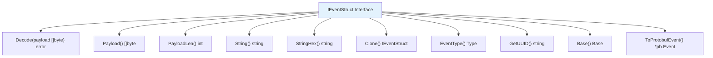

**Sources:** [user/event/ievent.go:41-52](https://github.com/gojue/ecapture/blob/0766a93b/user/event/ievent.go#L41-L52)

The interface methods serve specific purposes:

| Method | Purpose |
|--------|---------|
| `Decode()` | Deserialize binary payload from eBPF maps into structured fields |
| `Payload()` / `PayloadLen()` | Access raw data bytes (e.g., SSL plaintext, SQL queries) |
| `String()` / `StringHex()` | Format event for text output with or without hex dump |
| `Clone()` | Create empty instance for polymorphic event reading |
| `EventType()` | Determine routing: `TypeOutput`, `TypeModuleData`, or `TypeEventProcessor` |
| `GetUUID()` | Generate unique identifier for grouping related events |
| `Base()` | Extract common metadata (timestamp, PID, IP addresses) for text output |
| `ToProtobufEvent()` | Serialize to protobuf format for eCaptureQ GUI integration |

### Event Type Classification

Events are classified by `Type` enum to control their processing path:

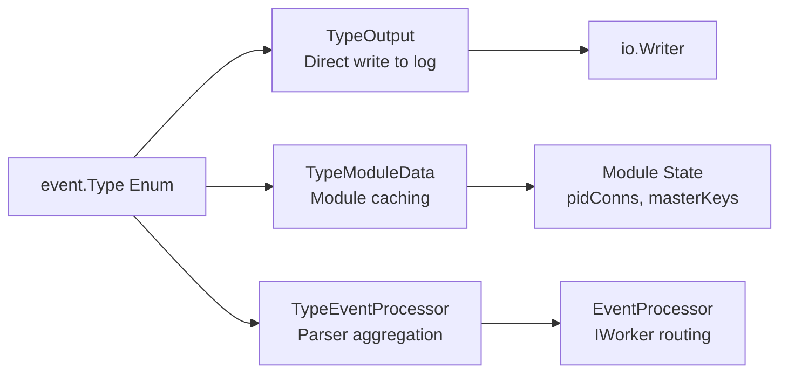

**Sources:** [user/event/ievent.go:26-37](https://github.com/gojue/ecapture/blob/0766a93b/user/event/ievent.go#L26-L37)

- **`TypeOutput`** - Events written directly to output without aggregation (e.g., Bash commands, database queries)
- **`TypeModuleData`** - Events stored in module state for correlation (e.g., connection metadata, master keys)
- **`TypeEventProcessor`** - Events routed through EventProcessor for payload aggregation and parsing (e.g., SSL data events)

### Concrete Event Implementations

The following diagram maps event structures to their source modules:

```mermaid
graph TB
    subgraph "TLS Events"
        SSLDataEvent["SSLDataEvent<br/>OpenSSL/BoringSSL plaintext"]
        ConnDataEvent["ConnDataEvent<br/>TCP connection metadata"]
        MasterSecretEvent["MasterSecretEvent<br/>TLS 1.2 master keys"]
        MasterSecretBSSLEvent["MasterSecretBSSLEvent<br/>TLS 1.3 BoringSSL keys"]
    end
    
    subgraph "TLS Library Events"
        GnutlsDataEvent["GnutlsDataEvent<br/>GnuTLS plaintext"]
        NsprDataEvent["NsprDataEvent<br/>NSPR/NSS plaintext"]
    end
    
    subgraph "Database Events"
        MysqldEvent["MysqldEvent<br/>MySQL queries"]
        PostgresEvent["PostgresEvent<br/>PostgreSQL queries"]
    end
    
    subgraph "Shell Events"
        BashEvent["BashEvent<br/>Bash commands"]
    end
    
    subgraph "Network Events"
        TcSkbEvent["TcSkbEvent<br/>TC packet capture"]
    end
    
    IEventStruct["IEventStruct Interface"]
    
    SSLDataEvent -.->|implements| IEventStruct
    ConnDataEvent -.->|implements| IEventStruct
    MasterSecretEvent -.->|implements| IEventStruct
    MasterSecretBSSLEvent -.->|implements| IEventStruct
    GnutlsDataEvent -.->|implements| IEventStruct
    NsprDataEvent -.->|implements| IEventStruct
    MysqldEvent -.->|implements| IEventStruct
    PostgresEvent -.->|implements| IEventStruct
    BashEvent -.->|implements| IEventStruct
    TcSkbEvent -.->|implements| IEventStruct
```

**Sources:** [user/event/event_openssl.go:77-92](https://github.com/gojue/ecapture/blob/0766a93b/user/event/event_openssl.go#L77-L92), [user/event/event_openssl.go:289-294](https://github.com/gojue/ecapture/blob/0766a93b/user/event/event_openssl.go#L289-L294), [user/event/event_masterkey.go:37-55](https://github.com/gojue/ecapture/blob/0766a93b/user/event/event_masterkey.go#L37-L55), [user/event/event_masterkey.go:156-174](https://github.com/gojue/ecapture/blob/0766a93b/user/event/event_masterkey.go#L156-L174), [user/event/event_gnutls.go:25-35](https://github.com/gojue/ecapture/blob/0766a93b/user/event/event_gnutls.go#L25-L35), [user/event/event_nspr.go:26-36](https://github.com/gojue/ecapture/blob/0766a93b/user/event/event_nspr.go#L26-L36), [user/event/event_mysqld.go:68-78](https://github.com/gojue/ecapture/blob/0766a93b/user/event/event_mysqld.go#L68-L78), [user/event/event_postgres.go:38-44](https://github.com/gojue/ecapture/blob/0766a93b/user/event/event_postgres.go#L38-L44), [user/event/event_bash.go:37-47](https://github.com/gojue/ecapture/blob/0766a93b/user/event/event_bash.go#L37-L47), [user/event/event_openssl_tc.go:30-40](https://github.com/gojue/ecapture/blob/0766a93b/user/event/event_openssl_tc.go#L30-L40)

#### SSLDataEvent Structure

The `SSLDataEvent` is the most commonly used event, capturing SSL/TLS plaintext from OpenSSL/BoringSSL:

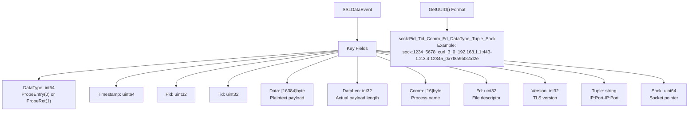

**Sources:** [user/event/event_openssl.go:77-92](https://github.com/gojue/ecapture/blob/0766a93b/user/event/event_openssl.go#L77-L92), [user/event/event_openssl.go:138-141](https://github.com/gojue/ecapture/blob/0766a93b/user/event/event_openssl.go#L138-L141)

The UUID format includes the `sock:` prefix for socket-lifecycle-managed workers (see Worker Lifecycle Management section).

#### ConnDataEvent Structure

`ConnDataEvent` provides connection metadata from TC eBPF hooks:

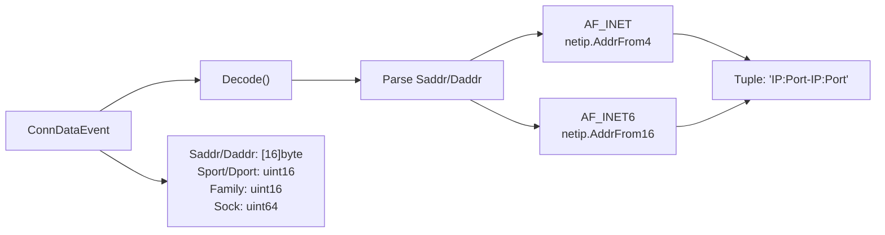

**Sources:** [user/event/event_openssl.go:272-308](https://github.com/gojue/ecapture/blob/0766a93b/user/event/event_openssl.go#L272-L308)

### Event Decoding Process

Event decoding follows a standard pattern using `binary.Read()`:

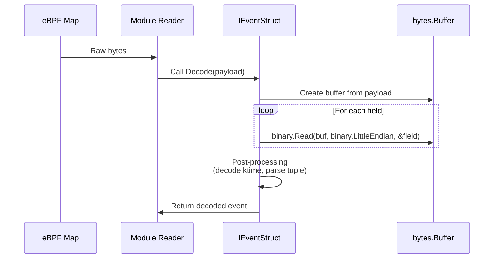

**Sources:** [user/event/event_openssl.go:94-132](https://github.com/gojue/ecapture/blob/0766a93b/user/event/event_openssl.go#L94-L132), [user/event/event_bash.go:49-69](https://github.com/gojue/ecapture/blob/0766a93b/user/event/event_bash.go#L49-L69), [user/event/event_mysqld.go:80-109](https://github.com/gojue/ecapture/blob/0766a93b/user/event/event_mysqld.go#L80-L109)

All events use `binary.LittleEndian` to match eBPF data layout. Events containing timestamps call `DecodeKtime()` to convert kernel time to Unix nanoseconds.

## EventProcessor Architecture

### Core Components

The `EventProcessor` manages the event processing pipeline:

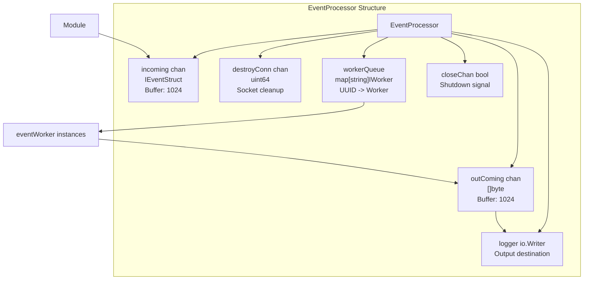

**Sources:** [pkg/event_processor/processor.go:30-50](https://github.com/gojue/ecapture/blob/0766a93b/pkg/event_processor/processor.go#L30-L50)

The processor maintains:
- **`incoming` channel** - Receives events from modules (buffer size 1024)
- **`outComing` channel** - Formatted output to logger (buffer size 1024)
- **`destroyConn` channel** - Socket destruction notifications
- **`workerQueue` map** - UUID to worker mapping for event routing
- **`logger` io.Writer** - Output destination (console, file, or CollectorWriter)

### Event Dispatch Flow

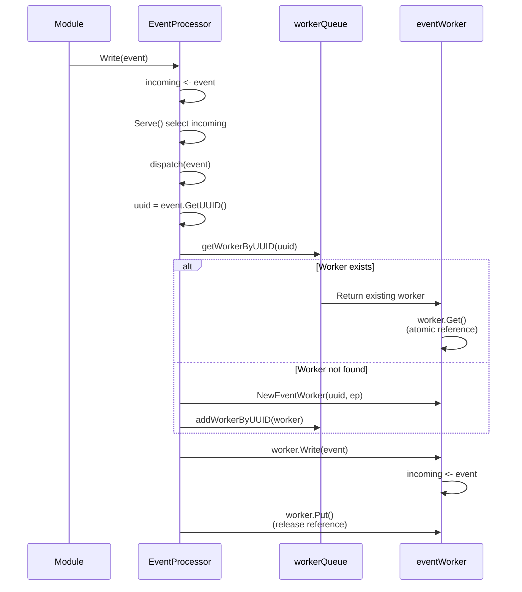

**Sources:** [pkg/event_processor/processor.go:66-109](https://github.com/gojue/ecapture/blob/0766a93b/pkg/event_processor/processor.go#L66-L109), [pkg/event_processor/processor.go:130-148](https://github.com/gojue/ecapture/blob/0766a93b/pkg/event_processor/processor.go#L130-L148)

Key aspects:
1. **UUID-based routing** - `GetUUID()` groups related events into the same worker
2. **Lazy worker creation** - Workers created on first event for a UUID
3. **Reference counting** - `Get()`/`Put()` prevent race conditions during deletion
4. **Non-blocking writes** - Events dropped if incoming channel is full

## Worker System

### IWorker Interface

Workers aggregate events and invoke parsers:

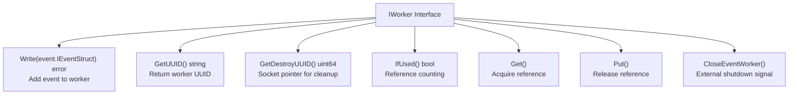

**Sources:** [pkg/event_processor/iworker.go:35-49](https://github.com/gojue/ecapture/blob/0766a93b/pkg/event_processor/iworker.go#L35-L49)

### eventWorker Implementation

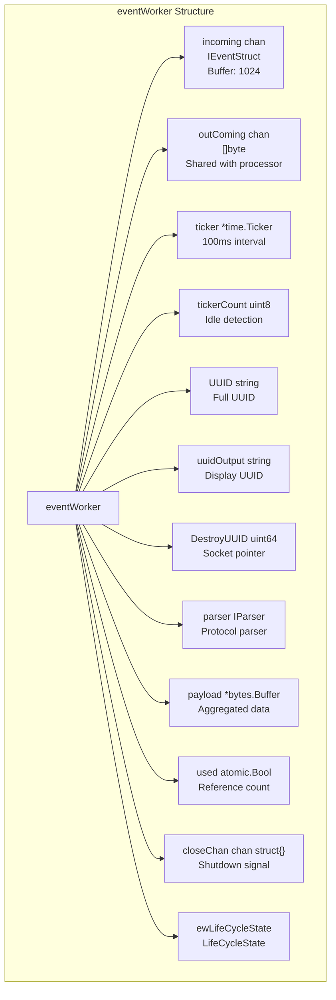

**Sources:** [pkg/event_processor/iworker.go:70-89](https://github.com/gojue/ecapture/blob/0766a93b/pkg/event_processor/iworker.go#L70-L89)

### Worker Lifecycle Management

Workers support two lifecycle modes based on UUID prefix:

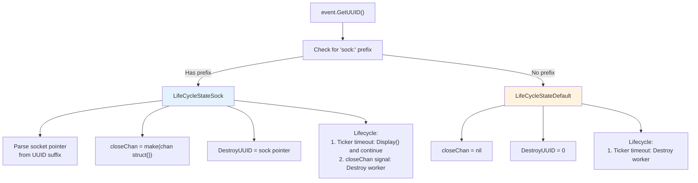

**Sources:** [pkg/event_processor/iworker.go:57-63](https://github.com/gojue/ecapture/blob/0766a93b/pkg/event_processor/iworker.go#L57-L63), [pkg/event_processor/iworker.go:100-123](https://github.com/gojue/ecapture/blob/0766a93b/pkg/event_processor/iworker.go#L100-L123)

**LifeCycleStateDefault:**
- Used when UUID does not start with `sock:`
- Worker destroyed after idle timeout (1 second = 10 ticks × 100ms)
- Example: Bash events, MySQL queries with UUID `PID_TID_Comm`

**LifeCycleStateSock:**
- Used when UUID starts with `sock:` prefix
- Worker persists across idle periods
- Destroyed only when socket closes (external `CloseEventWorker()` call)
- Example: SSL data events with UUID `sock:PID_TID_Comm_Fd_DataType_Tuple_Sock`
- `DestroyUUID` contains socket pointer for cleanup matching

### Worker Event Loop

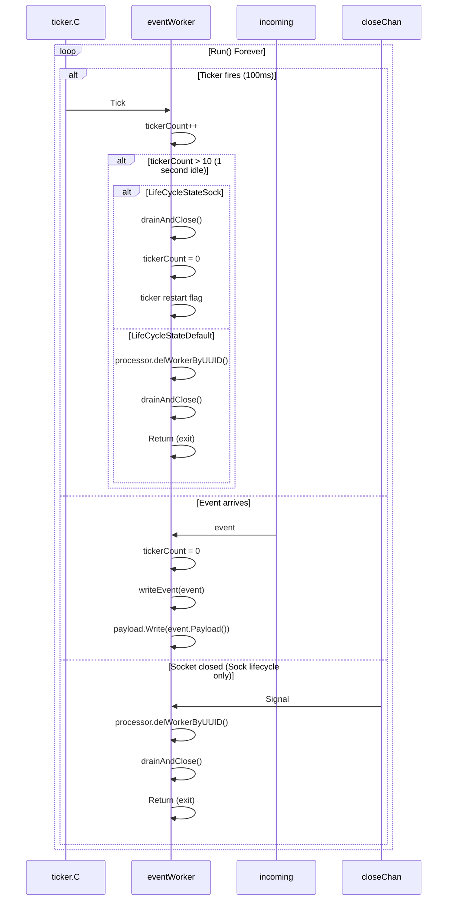

**Sources:** [pkg/event_processor/iworker.go:262-306](https://github.com/gojue/ecapture/blob/0766a93b/pkg/event_processor/iworker.go#L262-L306)

Key behaviors:
- **Ticker resets** on each event arrival (`tickerCount = 0`)
- **Payload aggregation** - Events accumulated in `payload` buffer
- **Idle timeout** - 10 ticks (1 second) without events triggers lifecycle action
- **Socket lifecycle** - `closeChan` signal from external socket destruction

### Event Display and Parsing

When a worker is ready to output (timeout or socket close), it invokes the display pipeline:

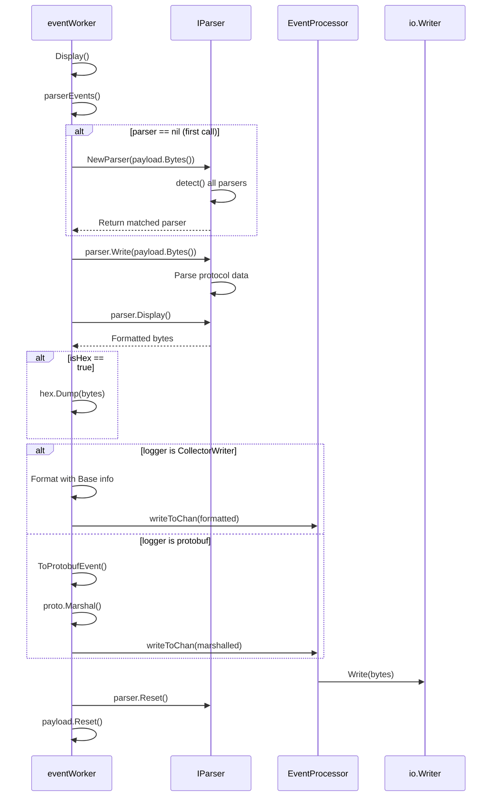

**Sources:** [pkg/event_processor/iworker.go:175-228](https://github.com/gojue/ecapture/blob/0766a93b/pkg/event_processor/iworker.go#L175-L228), [pkg/event_processor/iworker.go:248-260](https://github.com/gojue/ecapture/blob/0766a93b/pkg/event_processor/iworker.go#L248-L260)

The display process:
1. Aggregated payload passed to parser
2. Parser detects protocol and formats output
3. Output formatted based on logger type (text vs protobuf)
4. Worker state reset for next batch

## Parser System

### IParser Interface

Parsers detect and format application protocols:

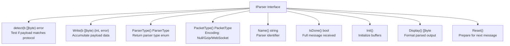

**Sources:** [pkg/event_processor/iparser.go:49-60](https://github.com/gojue/ecapture/blob/0766a93b/pkg/event_processor/iparser.go#L49-L60)

### Parser Types

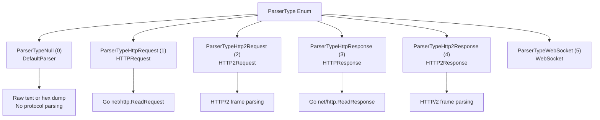

**Sources:** [pkg/event_processor/iparser.go:40-47](https://github.com/gojue/ecapture/blob/0766a93b/pkg/event_processor/iparser.go#L40-L47)

### Parser Selection

The `NewParser()` function auto-detects protocol:

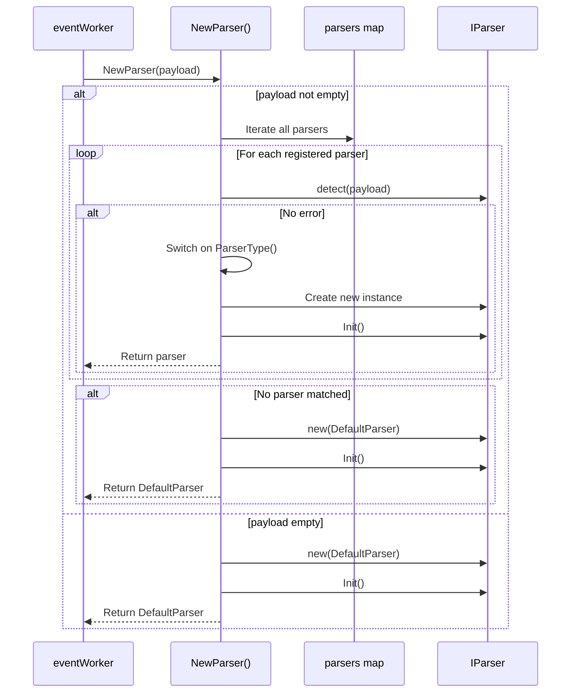

**Sources:** [pkg/event_processor/iparser.go:85-115](https://github.com/gojue/ecapture/blob/0766a93b/pkg/event_processor/iparser.go#L85-L115)

The detection sequence:
1. Try each registered parser's `detect()` method
2. First successful match creates typed parser instance
3. Fallback to `DefaultParser` if no match

### Parser Registration

Parsers self-register during package initialization:

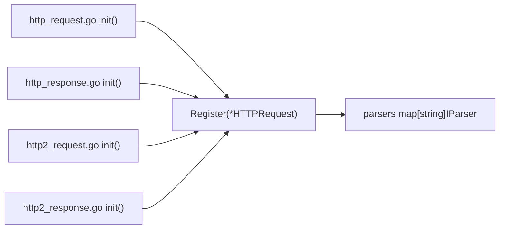

**Sources:** [pkg/event_processor/http_request.go:159-163](https://github.com/gojue/ecapture/blob/0766a93b/pkg/event_processor/http_request.go#L159-L163), [pkg/event_processor/http_response.go:177-181](https://github.com/gojue/ecapture/blob/0766a93b/pkg/event_processor/http_response.go#L177-L181), [pkg/event_processor/iparser.go:64-73](https://github.com/gojue/ecapture/blob/0766a93b/pkg/event_processor/iparser.go#L64-L73)

### HTTP Request Parser

The `HTTPRequest` parser handles HTTP/1.x requests:

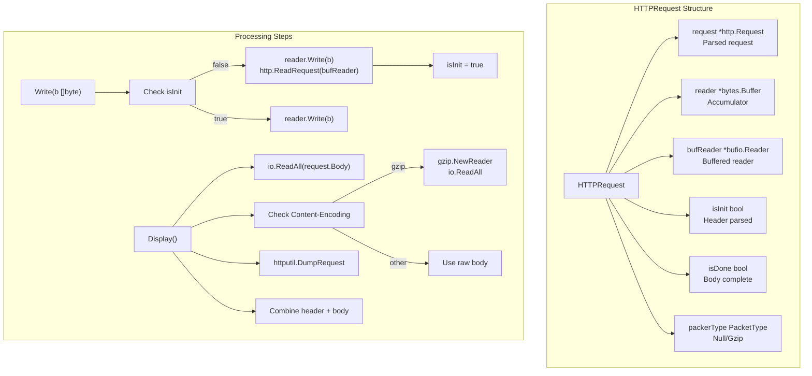

**Sources:** [pkg/event_processor/http_request.go:28-35](https://github.com/gojue/ecapture/blob/0766a93b/pkg/event_processor/http_request.go#L28-L35), [pkg/event_processor/http_request.go:54-81](https://github.com/gojue/ecapture/blob/0766a93b/pkg/event_processor/http_request.go#L54-L81), [pkg/event_processor/http_request.go:105-157](https://github.com/gojue/ecapture/blob/0766a93b/pkg/event_processor/http_request.go#L105-L157)

Key features:
- **Incremental parsing** - `http.ReadRequest()` called once when headers complete
- **Body accumulation** - Additional writes append to body buffer
- **Gzip decompression** - Automatic for `Content-Encoding: gzip`
- **HTTP/2 detection** - Returns raw bytes if `Proto == "HTTP/2.0"`

### HTTP Response Parser

Similar to request parser but uses `http.ReadResponse()`:

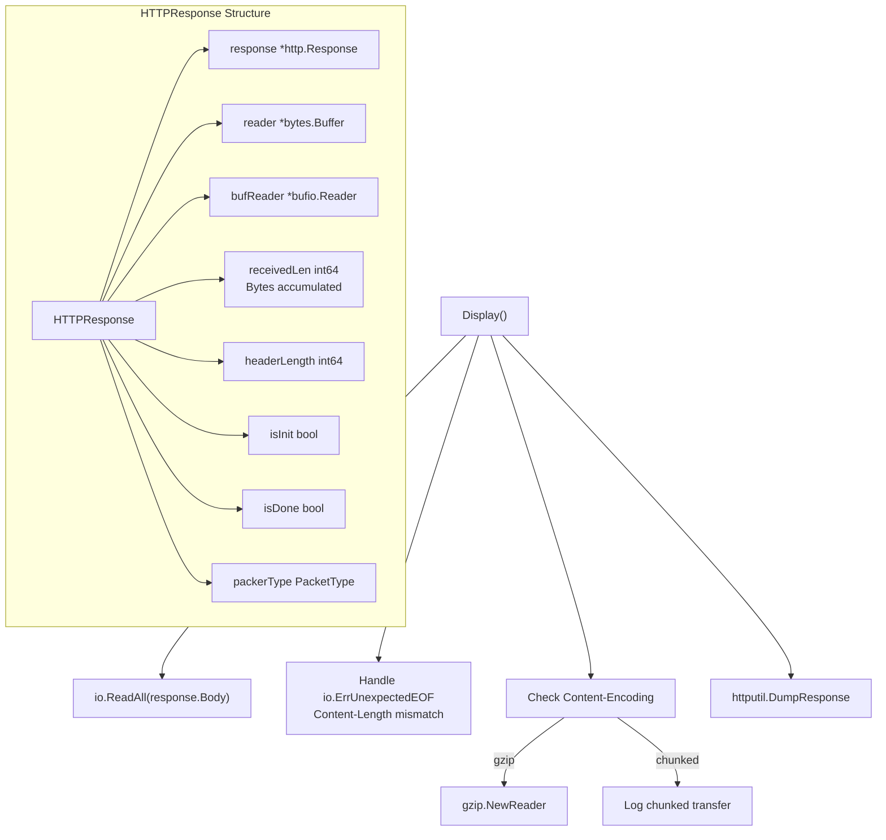

**Sources:** [pkg/event_processor/http_response.go:28-37](https://github.com/gojue/ecapture/blob/0766a93b/pkg/event_processor/http_response.go#L28-L37), [pkg/event_processor/http_response.go:58-92](https://github.com/gojue/ecapture/blob/0766a93b/pkg/event_processor/http_response.go#L58-L92), [pkg/event_processor/http_response.go:115-175](https://github.com/gojue/ecapture/blob/0766a93b/pkg/event_processor/http_response.go#L115-L175)

Response parser handles:
- **Chunked encoding** - Detected via `ContentLength < 0`
- **Truncated responses** - Gracefully handles `ErrUnexpectedEOF`
- **Content-Length mismatches** - Logs warnings for debugging

### DefaultParser

Fallback parser for non-HTTP protocols:

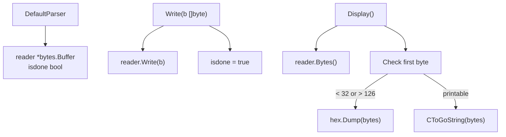

**Sources:** [pkg/event_processor/iparser.go:117-166](https://github.com/gojue/ecapture/blob/0766a93b/pkg/event_processor/iparser.go#L117-L166)

The DefaultParser:
- Accumulates all data immediately (`isdone = true`)
- Auto-detects binary vs text (checks first byte)
- Uses hex dump for non-printable data
- Strips null terminators from C strings

## Complete Event Flow Example

### TLS Capture Pipeline

```mermaid
sequenceDiagram
    participant eBPF as SSL_read uprobe
    participant PerfMap as perfEventMap
    participant Module as MOpenSSLProbe
    participant EP as EventProcessor
    participant EW as eventWorker
    participant Parser as HTTPRequest
    participant Logger as io.Writer
    
    eBPF->>PerfMap: SSL data event
    Module->>PerfMap: perfReader.Read()
    Module->>Module: SSLDataEvent.Decode()
    Module->>Module: GetUUID()<br/>sock:1234_5678_curl_3_0_IP:Port_Sock
    
    Module->>EP: eventProcessor.Write(event)
    EP->>EP: incoming <- event
    EP->>EP: Serve() dispatch(event)
    
    EP->>EW: getWorkerByUUID() or NewEventWorker()
    EP->>EW: worker.Write(event)
    EW->>EW: incoming <- event
    
    EW->>EW: Run() select incoming
    EW->>EW: tickerCount = 0
    EW->>EW: writeEvent(event)
    EW->>EW: payload.Write(event.Payload())
    
    Note over EW: Wait for timeout or socket close
    
    EW->>EW: Ticker fires (idle detected)
    EW->>EW: Display()
    EW->>EW: parserEvents()
    
    EW->>Parser: NewParser(payload.Bytes())
    Parser->>Parser: detect() -> HTTPRequest
    EW->>Parser: parser.Write(payload.Bytes())
    Parser->>Parser: http.ReadRequest()
    EW->>Parser: parser.Display()
    Parser->>Parser: httputil.DumpRequest()
    Parser-->>EW: Formatted bytes
    
    EW->>EP: outComing <- formatted
    EP->>Logger: logger.Write(formatted)
    
    EW->>Parser: parser.Reset()
    EW->>EW: payload.Reset()
```

**Sources:** [pkg/event_processor/processor.go:66-109](https://github.com/gojue/ecapture/blob/0766a93b/pkg/event_processor/processor.go#L66-L109), [pkg/event_processor/iworker.go:262-306](https://github.com/gojue/ecapture/blob/0766a93b/pkg/event_processor/iworker.go#L262-L306), [pkg/event_processor/iworker.go:175-228](https://github.com/gojue/ecapture/blob/0766a93b/pkg/event_processor/iworker.go#L175-L228), [pkg/event_processor/iparser.go:85-115](https://github.com/gojue/ecapture/blob/0766a93b/pkg/event_processor/iparser.go#L85-L115)

## Output Formatting

### Text Mode

For `CollectorWriter` logger:

```mermaid
graph TB
    Display["eventWorker.Display()"]
    
    Display --> GetBase["originEvent.Base()"]
    GetBase --> Metadata["PID, Comm<br/>SrcIP:SrcPort<br/>DstIP:DstPort"]
    
    Display --> GetType["parser.ParserType()"]
    Display --> GetPayload["parser.Display()"]
    
    Display --> CheckHex["Check isHex flag"]
    CheckHex -->|true| HexDump["hex.Dump(payload)"]
    CheckHex -->|false| Raw["Use raw payload"]
    
    Display --> Format["fmt.Fprintf()"]
    Format --> Output["PID:123, Comm:curl, Src:IP:Port, Dest:IP:Port,<br/>Payload:<br/>GET / HTTP/1.1..."]
```

**Sources:** [pkg/event_processor/iworker.go:175-228](https://github.com/gojue/ecapture/blob/0766a93b/pkg/event_processor/iworker.go#L175-L228)

### Protobuf Mode

For protobuf logger (eCaptureQ GUI):

```mermaid
graph TB
    Display["eventWorker.Display()"]
    
    Display --> CreateLogEntry["new(pb.LogEntry)"]
    Display --> SetType["LogType = LOG_TYPE_EVENT"]
    
    Display --> ToProto["originEvent.ToProtobufEvent()"]
    ToProto --> ProtoEvent["pb.Event{<br/>  Timestamp, UUID, PID, Pname,<br/>  SrcIP, SrcPort, DstIP, DstPort<br/>}"]
    
    Display --> SetPayload["ep.Payload = parser.Display()"]
    Display --> SetMeta["ep.Type = parser.ParserType()<br/>ep.Length = len(payload)"]
    
    Display --> Marshal["proto.Marshal(logEntry)"]
    Display --> WriteChan["outComing <- marshalled"]
```

**Sources:** [pkg/event_processor/iworker.go:214-227](https://github.com/gojue/ecapture/blob/0766a93b/pkg/event_processor/iworker.go#L214-L227)

## Event Truncation

The EventProcessor supports payload truncation:

```mermaid
graph TB
    writeEvent["eventWorker.writeEvent()"]
    
    writeEvent --> CheckSize["truncateSize > 0?"]
    CheckSize -->|false| Append["payload.Write(event.Payload())"]
    
    CheckSize -->|true| CheckLen["payload.Len() >= truncateSize?"]
    CheckLen -->|false| Append
    CheckLen -->|true| Truncate["payload.Truncate(truncateSize)"]
    Truncate --> Log["Log 'Events truncated, size: N bytes'"]
    Truncate --> Return["Return (no write)"]
```

**Sources:** [pkg/event_processor/iworker.go:230-245](https://github.com/gojue/ecapture/blob/0766a93b/pkg/event_processor/iworker.go#L230-L245)

Truncation prevents excessive memory usage for large payloads (configurable via `--truncate` flag).

## Error Handling

### Event Worker Errors

Workers use error channels for non-fatal errors:

```mermaid
graph TB
    Error["Error Occurs"]
    
    Error --> Type1["ErrEventWorkerIncomingFull"]
    Error --> Type2["ErrEventWorkerOutcomingFull"]
    Error --> Type3["Parser Write Error"]
    
    Type1 --> Log1["Event dropped<br/>incoming channel full"]
    Type2 --> Log2["Output dropped<br/>outComing channel full"]
    Type3 --> Log3["Parser error logged<br/>Continue processing"]
    
    All["All Errors"] --> EP["EventProcessor.errChan"]
    EP --> Caller["Module decides<br/>whether to continue"]
```

**Sources:** [pkg/event_processor/iworker.go:66-68](https://github.com/gojue/ecapture/blob/0766a93b/pkg/event_processor/iworker.go#L66-L68), [pkg/event_processor/processor.go:72-79](https://github.com/gojue/ecapture/blob/0766a93b/pkg/event_processor/processor.go#L72-L79)

Key error behaviors:
- **Non-blocking channels** - Drops events rather than blocking if buffers full
- **Parser errors** - Logged but don't stop processing
- **Worker panics** - `Get()`/`Put()` panics indicate incorrect usage

### Socket Lifecycle Cleanup

Socket-based workers cleaned up via `destroyConn` channel:

```mermaid
sequenceDiagram
    participant TC as TC eBPF
    participant Module as Module
    participant EP as EventProcessor
    participant EW as eventWorker
    
    TC->>Module: ConnDataEvent<br/>IsDestroy=1
    Module->>Module: GetSockPointer()
    Module->>EP: WriteDestroyConn(sockPtr)
    
    EP->>EP: destroyConn <- sockPtr
    EP->>EP: Serve() select destroyConn
    EP->>EP: destroyWorkers(sockPtr)
    
    loop For each worker
        EP->>EW: GetDestroyUUID()
        
        alt Match found
            EP->>EW: CloseEventWorker()
            EW->>EW: close(closeChan)
            EW->>EW: Run() receives close signal
            EW->>EW: drainAndClose()
            EW->>EP: delWorkerByUUID()
        end
    end
```

**Sources:** [pkg/event_processor/processor.go:177-185](https://github.com/gojue/ecapture/blob/0766a93b/pkg/event_processor/processor.go#L177-L185), [pkg/event_processor/processor.go:115-128](https://github.com/gojue/ecapture/blob/0766a93b/pkg/event_processor/processor.go#L115-L128), [pkg/event_processor/iworker.go:142-148](https://github.com/gojue/ecapture/blob/0766a93b/pkg/event_processor/iworker.go#L142-L148)

This mechanism ensures workers for closed sockets are properly cleaned up, preventing memory leaks.

## Summary

The event processing system provides:

1. **Strong typing** via `IEventStruct` interface for type-safe event handling
2. **UUID-based routing** to aggregate related events into workers
3. **Dual lifecycle modes** for efficient resource management
4. **Automatic protocol detection** and parsing for HTTP/1.x and HTTP/2
5. **Multiple output formats** supporting text, hex, and protobuf
6. **Graceful error handling** with non-blocking channels and event dropping

This architecture enables eCapture to handle high-volume event streams from multiple eBPF programs while maintaining structured output suitable for both human and machine consumption.