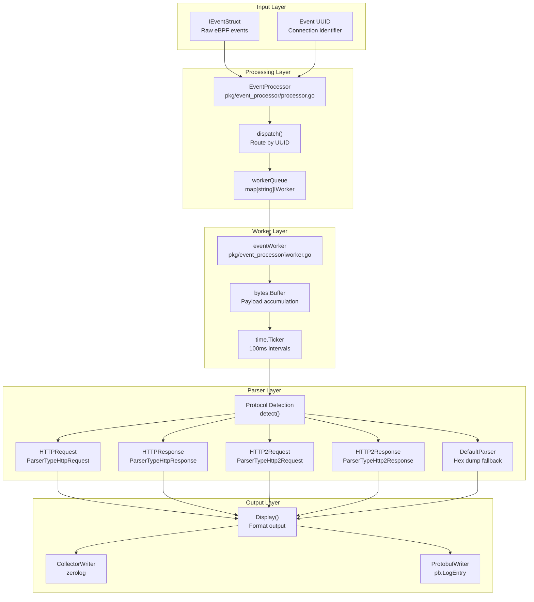
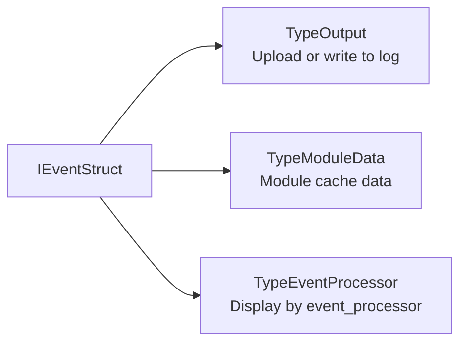
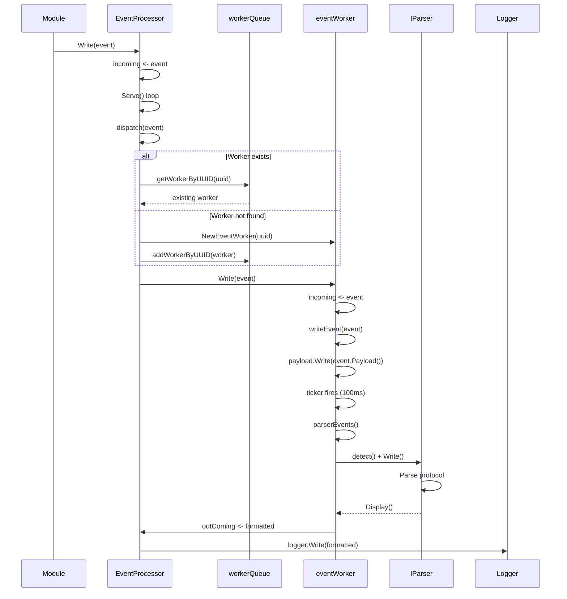
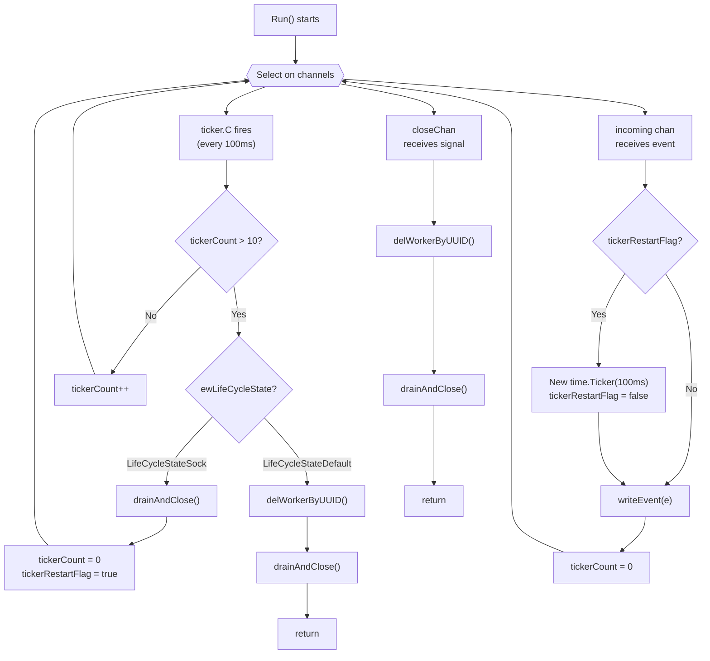
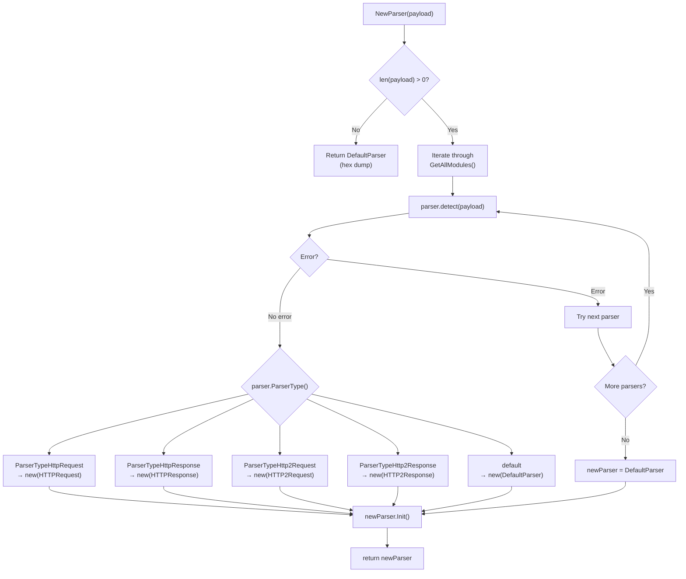
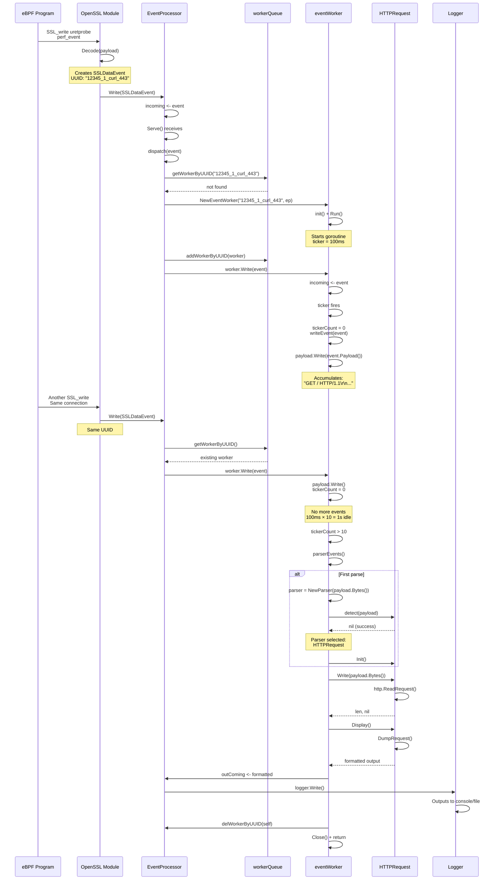

# Event Processing and Parsers

<details>
<summary>Relevant source files</summary>

The following files were used as context for generating this wiki page:

- [pkg/event_processor/http_request.go](https://github.com/gojue/ecapture/blob/ca085d05/pkg/event_processor/http_request.go)
- [pkg/event_processor/http_response.go](https://github.com/gojue/ecapture/blob/ca085d05/pkg/event_processor/http_response.go)
- [pkg/event_processor/iparser.go](https://github.com/gojue/ecapture/blob/ca085d05/pkg/event_processor/iparser.go)
- [pkg/event_processor/iworker.go](https://github.com/gojue/ecapture/blob/ca085d05/pkg/event_processor/iworker.go)
- [pkg/event_processor/processor.go](https://github.com/gojue/ecapture/blob/ca085d05/pkg/event_processor/processor.go)
- [user/event/ievent.go](https://github.com/gojue/ecapture/blob/ca085d05/user/event/ievent.go)

</details>


This document provides a comprehensive guide for developers working with eCapture's event processing system and parsers. It covers the architecture of event processing, the parser system, protocol detection mechanisms, and step-by-step instructions for adding new event types and implementing custom parsers.

For information about event structures and types themselves, see [Event Structures and Types](../2-architecture/2.3-event-structures-and-types.md). For the broader event processing pipeline architecture, see [Event Processing Pipeline](../2-architecture/2.2-event-processing-pipeline.md). For protocol-specific parsing implementations, see [Protocol Parsing](../2-architecture/2.8-protocol-parsing.md).

---

## Event Processing Architecture Overview

The event processing system transforms raw eBPF events into formatted, protocol-aware output. The system consists of three primary layers:


```mermaid
graph TB
    subgraph "Input Layer"
        EVENT["IEventStruct<br/>Raw eBPF events"]
        UUID["Event UUID<br/>Connection identifier"]
    end
    
    subgraph "Processing Layer"
        EP["EventProcessor<br/>pkg/event_processor/processor.go"]
        DISPATCH["dispatch()<br/>Route by UUID"]
        QUEUE["workerQueue<br/>map[string]IWorker"]
    end
    
    subgraph "Worker Layer"
        EW["eventWorker<br/>pkg/event_processor/iworker.go"]
        BUFFER["bytes.Buffer<br/>Payload accumulation"]
        TICKER["time.Ticker<br/>100ms intervals"]
    end
    
    subgraph "Parser Layer"
        DETECT["Protocol Detection<br/>detect()"]
        HTTP_REQ["HTTPRequest<br/>ParserTypeHttpRequest"]
        HTTP_RES["HTTPResponse<br/>ParserTypeHttpResponse"]
        HTTP2_REQ["HTTP2Request<br/>ParserTypeHttp2Request"]
        HTTP2_RES["HTTP2Response<br/>ParserTypeHttp2Response"]
        DEFAULT["DefaultParser<br/>Hex dump fallback"]
    end
    
    subgraph "Output Layer"
        DISPLAY["Display()<br/>Format output"]
        COLLECTOR["CollectorWriter<br/>zerolog"]
        PROTOBUF["ProtobufWriter<br/>pb.LogEntry"]
    end
    
    EVENT --> EP
    UUID --> EP
    EP --> DISPATCH
    DISPATCH --> QUEUE
    QUEUE --> EW
    
    EW --> BUFFER
    BUFFER --> TICKER
    TICKER --> DETECT
    
    DETECT --> HTTP_REQ
    DETECT --> HTTP_RES
    DETECT --> HTTP2_REQ
    DETECT --> HTTP2_RES
    DETECT --> DEFAULT
    
    HTTP_REQ --> DISPLAY
    HTTP_RES --> DISPLAY
    HTTP2_REQ --> DISPLAY
    HTTP2_RES --> DISPLAY
    DEFAULT --> DISPLAY
    
    DISPLAY --> COLLECTOR
    DISPLAY --> PROTOBUF
```

**Sources:** [pkg/event_processor/processor.go:1-216](https://github.com/gojue/ecapture/blob/ca085d05/pkg/event_processor/processor.go#L1-L216), [pkg/event_processor/iworker.go:1-366](https://github.com/gojue/ecapture/blob/ca085d05/pkg/event_processor/iworker.go#L1-L366), [pkg/event_processor/iparser.go:1-167](https://github.com/gojue/ecapture/blob/ca085d05/pkg/event_processor/iparser.go#L1-L167)

---

## Event Structures (IEventStruct)

All events entering the processing system implement the `IEventStruct` interface, which provides a standard contract for event handling.

### IEventStruct Interface

The interface is defined in [user/event/ievent.go:41-52](https://github.com/gojue/ecapture/blob/ca085d05/user/event/ievent.go#L41-L52):

| Method | Return Type | Purpose |
|--------|-------------|---------|
| `Decode(payload []byte)` | `error` | Deserialize raw eBPF data into structured event |
| `Payload()` | `[]byte` | Return event payload data |
| `PayloadLen()` | `int` | Return payload length |
| `String()` | `string` | Return human-readable representation |
| `StringHex()` | `string` | Return hex dump representation |
| `Clone()` | `IEventStruct` | Create deep copy of event |
| `EventType()` | `Type` | Return event classification (Output, ModuleData, EventProcessor) |
| `GetUUID()` | `string` | Return unique connection identifier |
| `Base()` | `Base` | Return base metadata (PID, IP, port, etc.) |
| `ToProtobufEvent()` | `*pb.Event` | Convert to protobuf format for serialization |

### Event Types

Events are classified by their intended processing path [user/event/ievent.go:26-37](https://github.com/gojue/ecapture/blob/ca085d05/user/event/ievent.go#L26-L37):


```mermaid
graph LR
    EVENT["IEventStruct"] --> OUTPUT["TypeOutput<br/>Upload or write to log"]
    EVENT --> MODULE["TypeModuleData<br/>Module cache data"]
    EVENT --> PROCESSOR["TypeEventProcessor<br/>Display by event_processor"]
```

**Sources:** [user/event/ievent.go:15-71](https://github.com/gojue/ecapture/blob/ca085d05/user/event/ievent.go#L15-L71)

---

## EventProcessor Component

The `EventProcessor` is the central coordinator that receives events from modules and routes them to appropriate workers. It maintains a pool of workers, each responsible for processing events from a specific connection.

### EventProcessor Structure

Key fields from [pkg/event_processor/processor.go:30-50](https://github.com/gojue/ecapture/blob/ca085d05/pkg/event_processor/processor.go#L30-L50):

| Field | Type | Purpose |
|-------|------|---------|
| `incoming` | `chan event.IEventStruct` | Receives new events from modules (buffer: 1024) |
| `outComing` | `chan []byte` | Sends formatted output to logger (buffer: 1024) |
| `destroyConn` | `chan uint64` | Signals socket destruction for cleanup (buffer: 1024) |
| `workerQueue` | `map[string]IWorker` | Maps UUID to worker instances |
| `logger` | `io.Writer` | Output destination (console, file, WebSocket) |
| `isHex` | `bool` | Whether to output in hexadecimal format |
| `truncateSize` | `uint64` | Maximum payload size before truncation |
| `closeChan` | `chan bool` | Shutdown signal |
| `errChan` | `chan error` | Error reporting channel (buffer: 16) |

### Event Processing Flow


```mermaid
sequenceDiagram
    participant Module
    participant EP as EventProcessor
    participant Queue as workerQueue
    participant Worker as eventWorker
    participant Parser as IParser
    participant Logger
    
    Module->>EP: Write(event)
    EP->>EP: incoming <- event
    EP->>EP: Serve() loop
    EP->>EP: dispatch(event)
    
    alt Worker exists
        EP->>Queue: getWorkerByUUID(uuid)
        Queue-->>EP: existing worker
    else Worker not found
        EP->>Worker: NewEventWorker(uuid)
        EP->>Queue: addWorkerByUUID(worker)
    end
    
    EP->>Worker: Write(event)
    Worker->>Worker: incoming <- event
    Worker->>Worker: writeEvent(event)
    Worker->>Worker: payload.Write(event.Payload())
    
    Worker->>Worker: ticker fires (100ms)
    Worker->>Worker: parserEvents()
    Worker->>Parser: detect() + Write()
    Parser->>Parser: Parse protocol
    Parser-->>Worker: Display()
    
    Worker->>EP: outComing <- formatted
    EP->>Logger: logger.Write(formatted)
```

### EventProcessor Methods

**Core Methods:**

- **`Write(e event.IEventStruct)`** [pkg/event_processor/processor.go:165-175](https://github.com/gojue/ecapture/blob/ca085d05/pkg/event_processor/processor.go#L165-L175) - External entry point for adding events to the processing queue
- **`Serve() error`** [pkg/event_processor/processor.go:66-89](https://github.com/gojue/ecapture/blob/ca085d05/pkg/event_processor/processor.go#L66-L89) - Main event loop that processes incoming events, destruction signals, and output
- **`dispatch(e event.IEventStruct) error`** [pkg/event_processor/processor.go:91-109](https://github.com/gojue/ecapture/blob/ca085d05/pkg/event_processor/processor.go#L91-L109) - Routes events to workers based on UUID
- **`WriteDestroyConn(s uint64)`** [pkg/event_processor/processor.go:177-185](https://github.com/gojue/ecapture/blob/ca085d05/pkg/event_processor/processor.go#L177-L185) - Signals that a socket has been destroyed and its workers should be cleaned up
- **`Close() error`** [pkg/event_processor/processor.go:187-200](https://github.com/gojue/ecapture/blob/ca085d05/pkg/event_processor/processor.go#L187-L200) - Gracefully shuts down the processor

**Worker Management:**

- **`getWorkerByUUID(uuid string)`** [pkg/event_processor/processor.go:130-141](https://github.com/gojue/ecapture/blob/ca085d05/pkg/event_processor/processor.go#L130-L141) - Thread-safe retrieval with reference counting
- **`addWorkerByUUID(worker IWorker)`** [pkg/event_processor/processor.go:143-148](https://github.com/gojue/ecapture/blob/ca085d05/pkg/event_processor/processor.go#L143-L148) - Thread-safe worker registration
- **`delWorkerByUUID(worker IWorker)`** [pkg/event_processor/processor.go:151-155](https://github.com/gojue/ecapture/blob/ca085d05/pkg/event_processor/processor.go#L151-L155) - Thread-safe worker removal
- **`destroyWorkers(destroyUUID uint64)`** [pkg/event_processor/processor.go:115-128](https://github.com/gojue/ecapture/blob/ca085d05/pkg/event_processor/processor.go#L115-L128) - Closes workers associated with a destroyed socket

**Sources:** [pkg/event_processor/processor.go:1-216](https://github.com/gojue/ecapture/blob/ca085d05/pkg/event_processor/processor.go#L1-L216)

---

## Worker System (IWorker)

Each `eventWorker` handles events for a single connection (identified by UUID), accumulating payload fragments and triggering parsing when appropriate.

### IWorker Interface

Defined in [pkg/event_processor/iworker.go:35-49](https://github.com/gojue/ecapture/blob/ca085d05/pkg/event_processor/iworker.go#L35-L49):

```go
type IWorker interface {
    Write(event.IEventStruct) error      // Add event to processing queue
    GetUUID() string                      // Return worker's UUID
    GetDestroyUUID() uint64               // Return socket ID for lifecycle tracking
    IfUsed() bool                         // Check if worker is currently referenced
    Get()                                 // Increment reference count
    Put()                                 // Decrement reference count
    CloseEventWorker()                    // Signal worker to close
}
```

### Worker Lifecycle Models

Workers support two distinct lifecycle models [pkg/event_processor/iworker.go:57-63](https://github.com/gojue/ecapture/blob/ca085d05/pkg/event_processor/iworker.go#L57-L63):

**1. LifeCycleStateDefault (Self-Managed)**
- Created when first event arrives
- Self-destructs after `MaxTickerCount` (10 × 100ms = 1 second) of inactivity
- `closeChan` is `nil`
- Used for short-lived connections

**2. LifeCycleStateSock (Socket-Bound)**
- Created for events with UUID prefix `sock:` [user/event/ievent.go:39](https://github.com/gojue/ecapture/blob/ca085d05/user/event/ievent.go#L39)
- Persists until explicit `CloseEventWorker()` call
- `closeChan` is non-nil
- Worker extracts socket ID from UUID: `sock:Pid_Tid_Comm_Fd_DataType_Tuple_Sock`
- Used for long-lived socket connections

```mermaid
stateDiagram-v2
    [*] --> Created: NewEventWorker()
    
    Created --> Default: UUID without "sock:" prefix
    Created --> Socket: UUID with "sock:" prefix
    
    Default --> Accumulating: Write(event)
    Accumulating --> Accumulating: More events arrive
    Accumulating --> Parsing: Ticker fires (100ms)
    Parsing --> Accumulating: Not idle (tickerCount < 10)
    Parsing --> Destroyed: Idle timeout (tickerCount >= 10)
    
    Socket --> AccumulatingSock: Write(event)
    AccumulatingSock --> AccumulatingSock: More events arrive
    AccumulatingSock --> ParsingSock: Ticker fires (100ms)
    ParsingSock --> AccumulatingSock: Not idle
    ParsingSock --> DrainSock: Idle timeout
    DrainSock --> AccumulatingSock: More events arrive
    Socket --> Destroyed: CloseEventWorker() called
    
    Destroyed --> [*]
```

### Worker Event Processing Loop

The `Run()` method [pkg/event_processor/iworker.go:262-306](https://github.com/gojue/ecapture/blob/ca085d05/pkg/event_processor/iworker.go#L262-L306) implements the main event processing loop:


```mermaid
flowchart TB
    START["Run() starts"] --> LOOP{{"Select on channels"}}
    
    LOOP --> TICKER["ticker.C fires<br/>(every 100ms)"]
    LOOP --> EVENT["incoming chan<br/>receives event"]
    LOOP --> CLOSE["closeChan<br/>receives signal"]
    
    TICKER --> CHECK{"tickerCount > 10?"}
    CHECK -->|Yes| LIFECYCLE{"ewLifeCycleState?"}
    CHECK -->|No| INC["tickerCount++"]
    INC --> LOOP
    
    LIFECYCLE -->|LifeCycleStateSock| DRAIN1["drainAndClose()"]
    LIFECYCLE -->|LifeCycleStateDefault| DEL["delWorkerByUUID()"]
    
    DRAIN1 --> RESET["tickerCount = 0<br/>tickerRestartFlag = true"]
    RESET --> LOOP
    
    DEL --> DRAIN2["drainAndClose()"]
    DRAIN2 --> RETURN["return"]
    
    EVENT --> RESTART{"tickerRestartFlag?"}
    RESTART -->|Yes| NEWTICKER["New time.Ticker(100ms)<br/>tickerRestartFlag = false"]
    RESTART -->|No| WRITE["writeEvent(e)"]
    NEWTICKER --> WRITE
    WRITE --> ZERO["tickerCount = 0"]
    ZERO --> LOOP
    
    CLOSE --> DEL2["delWorkerByUUID()"]
    DEL2 --> DRAIN3["drainAndClose()"]
    DRAIN3 --> RETURN2["return"]
```

### Reference Counting and Thread Safety

Workers use atomic reference counting to prevent race conditions during destruction [pkg/event_processor/iworker.go:346-360](https://github.com/gojue/ecapture/blob/ca085d05/pkg/event_processor/iworker.go#L346-L360):

- **`Get()`** - Atomically sets `used` flag to true, called by `getWorkerByUUID()` before returning worker
- **`Put()`** - Atomically sets `used` flag to false, called after event is written
- **`IfUsed()`** - Checks if worker is currently referenced

The `drainAndClose()` method [pkg/event_processor/iworker.go:308-337](https://github.com/gojue/ecapture/blob/ca085d05/pkg/event_processor/iworker.go#L308-L337) ensures safe cleanup by:
1. Draining remaining events from `incoming` channel
2. Waiting until `IfUsed()` returns false (no other goroutines hold reference)
3. Calling `Close()` to output final results

**Sources:** [pkg/event_processor/iworker.go:1-366](https://github.com/gojue/ecapture/blob/ca085d05/pkg/event_processor/iworker.go#L1-L366)

---

## Parser System (IParser)

Parsers transform accumulated payload bytes into human-readable, protocol-specific output. The system supports dynamic parser selection based on payload content.

### IParser Interface

Defined in [pkg/event_processor/iparser.go:49-60](https://github.com/gojue/ecapture/blob/ca085d05/pkg/event_processor/iparser.go#L49-L60):

```go
type IParser interface {
    detect(b []byte) error        // Attempt to identify protocol from payload
    Write(b []byte) (int, error)  // Accumulate payload data
    ParserType() ParserType       // Return parser type identifier
    PacketType() PacketType       // Return packet encoding (gzip, etc.)
    Name() string                 // Return human-readable parser name
    IsDone() bool                 // Check if parsing is complete
    Init()                        // Initialize parser state
    Display() []byte              // Generate formatted output
    Reset()                       // Reset parser for reuse
}
```

### Parser Types

The system defines several parser types [pkg/event_processor/iparser.go:40-47](https://github.com/gojue/ecapture/blob/ca085d05/pkg/event_processor/iparser.go#L40-L47):

| ParserType | Value | Purpose |
|------------|-------|---------|
| `ParserTypeNull` | 0 | Default/unknown protocol (hex dump) |
| `ParserTypeHttpRequest` | 1 | HTTP/1.x request parsing |
| `ParserTypeHttp2Request` | 2 | HTTP/2 request parsing |
| `ParserTypeHttpResponse` | 3 | HTTP/1.x response parsing |
| `ParserTypeHttp2Response` | 4 | HTTP/2 response parsing |
| `ParserTypeWebSocket` | 5 | WebSocket frame parsing |

### Packet Types

Parsers can identify packet encoding [pkg/event_processor/iparser.go:33-38](https://github.com/gojue/ecapture/blob/ca085d05/pkg/event_processor/iparser.go#L33-L38):

| PacketType | Purpose |
|------------|---------|
| `PacketTypeNull` | Uncompressed data |
| `PacketTypeGzip` | Gzip-compressed data |
| `PacketTypeWebSocket` | WebSocket-framed data |

**Sources:** [pkg/event_processor/iparser.go:1-167](https://github.com/gojue/ecapture/blob/ca085d05/pkg/event_processor/iparser.go#L1-L167)

---

## Protocol Detection Mechanism

The parser selection process uses a try-each-parser approach with automatic fallback to hex dump.

### Parser Registration

Parsers register themselves during package initialization using the `Register()` function [pkg/event_processor/iparser.go:64-73](https://github.com/gojue/ecapture/blob/ca085d05/pkg/event_processor/iparser.go#L64-L73):

```go
func init() {
    hr := &HTTPRequest{}
    hr.Init()
    Register(hr)  // Adds to global parsers map
}
```

All registered parsers are stored in the global `parsers` map [pkg/event_processor/iparser.go:62](https://github.com/gojue/ecapture/blob/ca085d05/pkg/event_processor/iparser.go#L62).

### Detection Flow

The `NewParser()` function [pkg/event_processor/iparser.go:85-115](https://github.com/gojue/ecapture/blob/ca085d05/pkg/event_processor/iparser.go#L85-L115) implements the detection logic:


```mermaid
flowchart TB
    START["NewParser(payload)"] --> CHECK{"len(payload) > 0?"}
    
    CHECK -->|No| DEFAULT1["Return DefaultParser<br/>(hex dump)"]
    CHECK -->|Yes| LOOP["Iterate through<br/>GetAllModules()"]
    
    LOOP --> DETECT["parser.detect(payload)"]
    DETECT --> RESULT{"Error?"}
    
    RESULT -->|No error| TYPE{"parser.ParserType()"}
    RESULT -->|Error| NEXT["Try next parser"]
    
    TYPE --> HTTP_REQ["ParserTypeHttpRequest<br/>→ new(HTTPRequest)"]
    TYPE --> HTTP_RES["ParserTypeHttpResponse<br/>→ new(HTTPResponse)"]
    TYPE --> HTTP2_REQ["ParserTypeHttp2Request<br/>→ new(HTTP2Request)"]
    TYPE --> HTTP2_RES["ParserTypeHttp2Response<br/>→ new(HTTP2Response)"]
    TYPE --> DEFAULT2["default<br/>→ new(DefaultParser)"]
    
    HTTP_REQ --> INIT["newParser.Init()"]
    HTTP_RES --> INIT
    HTTP2_REQ --> INIT
    HTTP2_RES --> INIT
    DEFAULT2 --> INIT
    
    NEXT --> MORE{"More parsers?"}
    MORE -->|Yes| DETECT
    MORE -->|No| FALLBACK["newParser = DefaultParser"]
    
    FALLBACK --> INIT
    INIT --> RETURN["return newParser"]
```

### Example: HTTP Request Detection

The `HTTPRequest` parser [pkg/event_processor/http_request.go:83-92](https://github.com/gojue/ecapture/blob/ca085d05/pkg/event_processor/http_request.go#L83-L92) uses Go's `http.ReadRequest()` to detect valid HTTP requests:

```go
func (hr *HTTPRequest) detect(payload []byte) error {
    rd := bytes.NewReader(payload)
    buf := bufio.NewReader(rd)
    _, err := http.ReadRequest(buf)
    if err != nil {
        return err  // Not a valid HTTP request
    }
    return nil  // Valid HTTP request detected
}
```

Similar approach for HTTP Response [pkg/event_processor/http_response.go:94-102](https://github.com/gojue/ecapture/blob/ca085d05/pkg/event_processor/http_response.go#L94-L102):

```go
func (hr *HTTPResponse) detect(payload []byte) error {
    rd := bytes.NewReader(payload)
    buf := bufio.NewReader(rd)
    _, err := http.ReadResponse(buf, nil)
    if err != nil {
        return err  // Not a valid HTTP response
    }
    return nil  // Valid HTTP response detected
}
```

**Sources:** [pkg/event_processor/iparser.go:85-115](https://github.com/gojue/ecapture/blob/ca085d05/pkg/event_processor/iparser.go#L85-L115), [pkg/event_processor/http_request.go:83-92](https://github.com/gojue/ecapture/blob/ca085d05/pkg/event_processor/http_request.go#L83-L92), [pkg/event_processor/http_response.go:94-102](https://github.com/gojue/ecapture/blob/ca085d05/pkg/event_processor/http_response.go#L94-L102)

---

## Adding New Event Types

To add a new event type that flows through the processing system:

### Step 1: Define Event Structure

Create a new struct in the appropriate `user/event/` subdirectory that implements `IEventStruct`:

```go
// user/event/mymodule/my_event.go
package mymodule

import (
    "encoding/binary"
    "github.com/gojue/ecapture/user/event"
    pb "github.com/gojue/ecapture/protobuf/gen/v1"
)

type MyCustomEvent struct {
    event.Base  // Embed base event metadata
    CustomField1 uint32
    CustomField2 [64]byte
}

func (e *MyCustomEvent) Decode(payload []byte) error {
    // Deserialize from eBPF C struct layout
    if len(payload) < 104 {  // sizeof(Base) + custom fields
        return errors.New("payload too short")
    }
    
    // Decode base fields
    e.Base.Decode(payload)
    
    // Decode custom fields
    offset := 40  // Size of Base struct
    e.CustomField1 = binary.LittleEndian.Uint32(payload[offset:])
    copy(e.CustomField2[:], payload[offset+4:offset+68])
    
    return nil
}

func (e *MyCustomEvent) Clone() event.IEventStruct {
    newEvent := *e
    return &newEvent
}

func (e *MyCustomEvent) EventType() event.Type {
    return event.TypeEventProcessor  // Route to EventProcessor
}

func (e *MyCustomEvent) GetUUID() string {
    // Generate unique identifier for connection grouping
    return fmt.Sprintf("%d_%d_%s_%d", 
        e.PID, e.TID, e.PName, e.CustomField1)
}

// Implement remaining IEventStruct methods...
```

### Step 2: Module Integration

In your module's `Decode()` method, instantiate and populate your event:

```go
func (m *MyModule) Decode(em *ebpf.Map, b []byte) (event.IEventStruct, error) {
    e := &mymodule.MyCustomEvent{}
    err := e.Decode(b)
    if err != nil {
        return nil, err
    }
    return e, nil
}
```

### Step 3: Send to EventProcessor

In your module's event reading loop, write events to the EventProcessor:

```go
// In module's Run() method
for {
    select {
    case event := <-eventChannel:
        m.processor.Write(event)  // Routes to EventProcessor
    }
}
```

**Sources:** [user/event/ievent.go:41-52](https://github.com/gojue/ecapture/blob/ca085d05/user/event/ievent.go#L41-L52), [pkg/event_processor/processor.go:165-175](https://github.com/gojue/ecapture/blob/ca085d05/pkg/event_processor/processor.go#L165-L175)

---

## Implementing Custom Parsers

To add support for a new protocol or output format:

### Step 1: Create Parser Structure

```go
// pkg/event_processor/my_protocol.go
package event_processor

import (
    "bytes"
    "bufio"
)

type MyProtocolParser struct {
    reader    *bytes.Buffer
    bufReader *bufio.Reader
    isDone    bool
    isInit    bool
    // Protocol-specific fields
    header    MyProtocolHeader
}
```

### Step 2: Implement IParser Interface

#### Initialize Parser

```go
func (p *MyProtocolParser) Init() {
    p.reader = bytes.NewBuffer(nil)
    p.bufReader = bufio.NewReader(p.reader)
    p.isDone = false
    p.isInit = false
}

func (p *MyProtocolParser) Name() string {
    return "MyProtocolParser"
}
```

#### Implement Detection Logic

```go
func (p *MyProtocolParser) detect(payload []byte) error {
    // Check for protocol magic bytes or structure
    if len(payload) < 4 {
        return errors.New("payload too short")
    }
    
    // Example: Check for magic number
    magic := binary.BigEndian.Uint32(payload[0:4])
    if magic != MY_PROTOCOL_MAGIC {
        return errors.New("not my protocol")
    }
    
    return nil
}
```

#### Accumulate Data

```go
func (p *MyProtocolParser) Write(b []byte) (int, error) {
    // First write: parse header
    if !p.isInit {
        n, err := p.reader.Write(b)
        if err != nil {
            return n, err
        }
        
        // Attempt to parse header
        err = p.parseHeader()
        if err != nil {
            return 0, err
        }
        
        p.isInit = true
        return n, nil
    }
    
    // Subsequent writes: accumulate body
    n, err := p.reader.Write(b)
    if err != nil {
        return n, err
    }
    
    // Check if complete based on protocol length field
    if p.reader.Len() >= p.header.TotalLength {
        p.isDone = true
    }
    
    return n, nil
}
```

#### Format Output

```go
func (p *MyProtocolParser) Display() []byte {
    var output bytes.Buffer
    
    // Format header
    fmt.Fprintf(&output, "My Protocol v%d\n", p.header.Version)
    fmt.Fprintf(&output, "Type: %d\n", p.header.MessageType)
    fmt.Fprintf(&output, "Length: %d\n", p.header.TotalLength)
    fmt.Fprintf(&output, "\n")
    
    // Format body
    body := p.reader.Bytes()[p.header.HeaderSize:]
    output.Write(body)
    
    return output.Bytes()
}
```

#### Implement Remaining Methods

```go
func (p *MyProtocolParser) ParserType() ParserType {
    return ParserTypeNull  // Or define new ParserType constant
}

func (p *MyProtocolParser) PacketType() PacketType {
    return PacketTypeNull
}

func (p *MyProtocolParser) IsDone() bool {
    return p.isDone
}

func (p *MyProtocolParser) Reset() {
    p.isDone = false
    p.isInit = false
    p.reader.Reset()
    p.bufReader.Reset(p.reader)
}
```

### Step 3: Register Parser

Add an `init()` function to register your parser globally:

```go
func init() {
    p := &MyProtocolParser{}
    p.Init()
    Register(p)  // Makes parser available for detection
}
```

### Step 4: Handle Special Cases

#### Compression Support

If your protocol supports compression (like HTTP gzip), decompress in `Display()`:

```go
func (p *MyProtocolParser) Display() []byte {
    rawData := p.reader.Bytes()
    
    if p.isCompressed {
        reader, err := gzip.NewReader(bytes.NewReader(rawData))
        if err != nil {
            return rawData  // Return raw on error
        }
        defer reader.Close()
        
        decompressed, err := io.ReadAll(reader)
        if err != nil {
            return rawData
        }
        
        p.packerType = PacketTypeGzip
        return decompressed
    }
    
    return rawData
}
```

#### Chunked Transfer

If your protocol uses chunked transfer encoding, accumulate chunks:

```go
func (p *MyProtocolParser) Write(b []byte) (int, error) {
    n, err := p.reader.Write(b)
    if err != nil {
        return n, err
    }
    
    // Check for chunk terminator
    if bytes.HasSuffix(p.reader.Bytes(), []byte("0\r\n\r\n")) {
        p.isDone = true
    }
    
    return n, nil
}
```

**Sources:** [pkg/event_processor/iparser.go:49-167](https://github.com/gojue/ecapture/blob/ca085d05/pkg/event_processor/iparser.go#L49-L167), [pkg/event_processor/http_request.go:1-164](https://github.com/gojue/ecapture/blob/ca085d05/pkg/event_processor/http_request.go#L1-L164), [pkg/event_processor/http_response.go:1-182](https://github.com/gojue/ecapture/blob/ca085d05/pkg/event_processor/http_response.go#L1-L182)

---

## Example: HTTP Request Parser Implementation

The existing HTTP request parser provides a complete implementation example:

### Structure

[pkg/event_processor/http_request.go:28-35](https://github.com/gojue/ecapture/blob/ca085d05/pkg/event_processor/http_request.go#L28-L35):

```go
type HTTPRequest struct {
    request    *http.Request     // Parsed HTTP request
    packerType PacketType        // Compression type
    isDone     bool              // Parsing complete flag
    isInit     bool              // Header parsed flag
    reader     *bytes.Buffer     // Raw data accumulator
    bufReader  *bufio.Reader     // Buffered reader for parsing
}
```

### Key Methods

**Detection** [pkg/event_processor/http_request.go:83-92](https://github.com/gojue/ecapture/blob/ca085d05/pkg/event_processor/http_request.go#L83-L92):
- Uses Go's standard `http.ReadRequest()` to validate HTTP syntax
- Returns error if payload is not a valid HTTP request

**Writing** [pkg/event_processor/http_request.go:54-81](https://github.com/gojue/ecapture/blob/ca085d05/pkg/event_processor/http_request.go#L54-L81):
- On first write: parse HTTP request line and headers
- On subsequent writes: accumulate body data
- Sets `isDone` when body is complete (though currently always false)

**Display** [pkg/event_processor/http_request.go:105-157](https://github.com/gojue/ecapture/blob/ca085d05/pkg/event_processor/http_request.go#L105-L157):
- Reads request body using `io.ReadAll()`
- Detects and decompresses gzip-encoded bodies
- Uses `httputil.DumpRequest()` to format headers
- Appends body content

### HTTP Response Parser

Similar structure in [pkg/event_processor/http_response.go:28-37](https://github.com/gojue/ecapture/blob/ca085d05/pkg/event_processor/http_response.go#L28-L37) with key differences:

- Uses `http.ReadResponse()` for detection [pkg/event_processor/http_response.go:94-102](https://github.com/gojue/ecapture/blob/ca085d05/pkg/event_processor/http_response.go#L94-L102)
- Handles chunked transfer encoding and Content-Length validation [pkg/event_processor/http_response.go:115-135](https://github.com/gojue/ecapture/blob/ca085d05/pkg/event_processor/http_response.go#L115-L135)
- Supports gzip decompression of response bodies [pkg/event_processor/http_response.go:136-159](https://github.com/gojue/ecapture/blob/ca085d05/pkg/event_processor/http_response.go#L136-L159)

**Sources:** [pkg/event_processor/http_request.go:1-164](https://github.com/gojue/ecapture/blob/ca085d05/pkg/event_processor/http_request.go#L1-L164), [pkg/event_processor/http_response.go:1-182](https://github.com/gojue/ecapture/blob/ca085d05/pkg/event_processor/http_response.go#L1-L182)

---

## Parser Registration System

### Global Parser Registry

The parser system maintains a global registry [pkg/event_processor/iparser.go:62](https://github.com/gojue/ecapture/blob/ca085d05/pkg/event_processor/iparser.go#L62):

```go
var parsers = make(map[string]IParser)
```

### Registration Function

[pkg/event_processor/iparser.go:64-73](https://github.com/gojue/ecapture/blob/ca085d05/pkg/event_processor/iparser.go#L64-L73):

```go
func Register(p IParser) {
    if p == nil {
        panic("Register Parser is nil")
    }
    name := p.Name()
    if _, dup := parsers[name]; dup {
        panic(fmt.Sprintf("Register called twice for Parser %s", name))
    }
    parsers[name] = p
}
```

### Accessing Parsers

Two utility functions provide access to registered parsers:

- **`GetAllModules() map[string]IParser`** [pkg/event_processor/iparser.go:76-78]() - Returns all registered parsers for detection loop
- **`GetModuleByName(name string) IParser`** [pkg/event_processor/iparser.go:81-83](https://github.com/gojue/ecapture/blob/ca085d05/pkg/event_processor/iparser.go#L81-L83) - Retrieves specific parser by name

### Init-Time Registration Pattern

Each parser file includes an `init()` function that registers the parser when the package loads:

```go
func init() {
    hr := &HTTPRequest{}
    hr.Init()
    Register(hr)
}
```

This pattern ensures all parsers are automatically registered before `NewParser()` is called during event processing.

**Sources:** [pkg/event_processor/iparser.go:62-83](https://github.com/gojue/ecapture/blob/ca085d05/pkg/event_processor/iparser.go#L62-L83), [pkg/event_processor/http_request.go:159-163](https://github.com/gojue/ecapture/blob/ca085d05/pkg/event_processor/http_request.go#L159-L163), [pkg/event_processor/http_response.go:177-181](https://github.com/gojue/ecapture/blob/ca085d05/pkg/event_processor/http_response.go#L177-L181)

---

## Complete Event Processing Example

Here's how a complete event flows through the system:


```mermaid
sequenceDiagram
    participant eBPF as eBPF Program
    participant Module as OpenSSL Module
    participant EP as EventProcessor
    participant WQ as workerQueue
    participant EW as eventWorker
    participant Parser as HTTPRequest
    participant Logger
    
    eBPF->>Module: SSL_write uretprobe<br/>perf_event
    Module->>Module: Decode(payload)
    Note over Module: Creates SSLDataEvent<br/>UUID: "12345_1_curl_443"
    
    Module->>EP: Write(SSLDataEvent)
    EP->>EP: incoming <- event
    EP->>EP: Serve() receives
    EP->>EP: dispatch(event)
    
    EP->>WQ: getWorkerByUUID("12345_1_curl_443")
    WQ-->>EP: not found
    
    EP->>EW: NewEventWorker("12345_1_curl_443", ep)
    EW->>EW: init() + Run()
    Note over EW: Starts goroutine<br/>ticker = 100ms
    
    EP->>WQ: addWorkerByUUID(worker)
    EP->>EW: worker.Write(event)
    EW->>EW: incoming <- event
    
    EW->>EW: ticker fires
    EW->>EW: tickerCount = 0<br/>writeEvent(event)
    EW->>EW: payload.Write(event.Payload())
    Note over EW: Accumulates:<br/>"GET / HTTP/1.1\r\n..."
    
    eBPF->>Module: Another SSL_write<br/>Same connection
    Module->>EP: Write(SSLDataEvent)
    Note over Module: Same UUID
    EP->>WQ: getWorkerByUUID()
    WQ-->>EP: existing worker
    EP->>EW: worker.Write(event)
    EW->>EW: payload.Write()<br/>tickerCount = 0
    
    Note over EW: No more events<br/>100ms × 10 = 1s idle
    
    EW->>EW: tickerCount > 10
    EW->>EW: parserEvents()
    
    alt First parse
        EW->>EW: parser = NewParser(payload.Bytes())
        EW->>Parser: detect(payload)
        Parser-->>EW: nil (success)
        Note over EW: Parser selected:<br/>HTTPRequest
        EW->>Parser: Init()
    end
    
    EW->>Parser: Write(payload.Bytes())
    Parser->>Parser: http.ReadRequest()
    Parser-->>EW: len, nil
    
    EW->>Parser: Display()
    Parser->>Parser: DumpRequest()
    Parser-->>EW: formatted output
    
    EW->>EP: outComing <- formatted
    EP->>Logger: logger.Write()
    Logger->>Logger: Outputs to console/file
    
    EW->>EP: delWorkerByUUID(self)
    EW->>EW: Close() + return
```

**Sources:** [pkg/event_processor/processor.go:66-109](https://github.com/gojue/ecapture/blob/ca085d05/pkg/event_processor/processor.go#L66-L109), [pkg/event_processor/iworker.go:91-137](https://github.com/gojue/ecapture/blob/ca085d05/pkg/event_processor/iworker.go#L91-L137), [pkg/event_processor/iworker.go:262-306](https://github.com/gojue/ecapture/blob/ca085d05/pkg/event_processor/iworker.go#L262-L306), [pkg/event_processor/iparser.go:85-115](https://github.com/gojue/ecapture/blob/ca085d05/pkg/event_processor/iparser.go#L85-L115)

---

## Testing Custom Parsers

### Unit Testing Pattern

Create a test file for your parser:

```go
// pkg/event_processor/my_protocol_test.go
package event_processor

import (
    "testing"
)

func TestMyProtocolParser_Detect(t *testing.T) {
    p := &MyProtocolParser{}
    p.Init()
    
    // Valid payload
    validPayload := []byte{0x12, 0x34, 0x56, 0x78, ...}
    err := p.detect(validPayload)
    if err != nil {
        t.Errorf("detect() failed on valid payload: %v", err)
    }
    
    // Invalid payload
    invalidPayload := []byte{0xFF, 0xFF, 0xFF, 0xFF}
    err = p.detect(invalidPayload)
    if err == nil {
        t.Error("detect() should have failed on invalid payload")
    }
}

func TestMyProtocolParser_WriteAndDisplay(t *testing.T) {
    p := &MyProtocolParser{}
    p.Init()
    
    // Write payload chunks
    chunk1 := []byte{...}
    chunk2 := []byte{...}
    
    n, err := p.Write(chunk1)
    if err != nil {
        t.Fatalf("Write() failed: %v", err)
    }
    
    n, err = p.Write(chunk2)
    if err != nil {
        t.Fatalf("Write() failed: %v", err)
    }
    
    // Check if done
    if !p.IsDone() {
        t.Error("Parser should be done after full payload")
    }
    
    // Get formatted output
    output := p.Display()
    if len(output) == 0 {
        t.Error("Display() returned empty output")
    }
}
```

### Integration Testing

Test your parser with the full EventProcessor:

```go
func TestMyProtocolParser_Integration(t *testing.T) {
    // Create EventProcessor with test logger
    var buf bytes.Buffer
    logger := &buf
    ep := NewEventProcessor(logger, false, 0)
    
    // Start processor
    go ep.Serve()
    
    // Create test event
    event := &MyTestEvent{
        Base: event.Base{
            PID: 1234,
            // ... other fields
        },
        // ... custom fields
    }
    
    // Write event
    ep.Write(event)
    
    // Wait for processing
    time.Sleep(2 * time.Second)
    
    // Check output
    output := buf.String()
    if !strings.Contains(output, "My Protocol") {
        t.Errorf("Output doesn't contain expected content: %s", output)
    }
    
    // Cleanup
    ep.Close()
}
```

**Sources:** [pkg/event_processor/iparser.go:49-167](https://github.com/gojue/ecapture/blob/ca085d05/pkg/event_processor/iparser.go#L49-L167), [pkg/event_processor/processor.go:206-215](https://github.com/gojue/ecapture/blob/ca085d05/pkg/event_processor/processor.go#L206-L215)

---

## Summary

The eCapture event processing and parser system provides:

1. **EventProcessor** - Central coordinator that routes events to workers by UUID
2. **eventWorker** - Per-connection payload accumulation with two lifecycle models (default and socket-bound)
3. **IParser** - Protocol-aware parsing with automatic detection and fallback
4. **Parser Registry** - Global registration system for extensibility

To extend the system:

- Define new event types implementing `IEventStruct`
- Create parsers implementing `IParser` with `detect()`, `Write()`, and `Display()` methods
- Register parsers in `init()` functions for automatic discovery
- Test parsers in isolation and with full EventProcessor integration

The architecture ensures thread-safe operation through reference counting, supports both short-lived and long-lived connections, and provides graceful shutdown with payload draining.