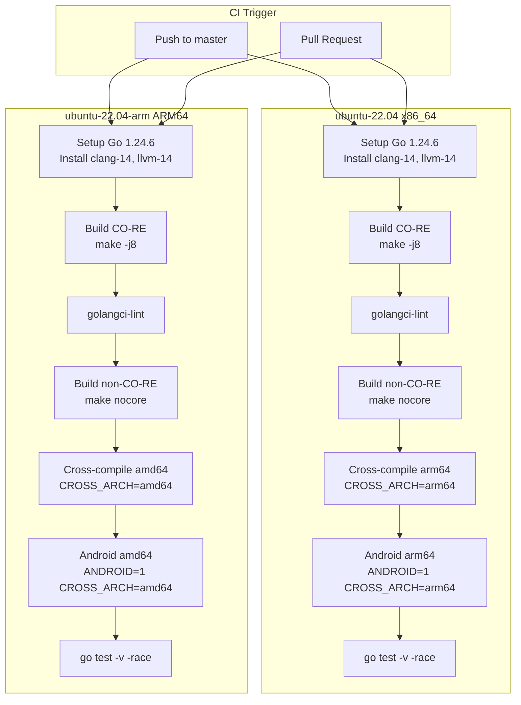
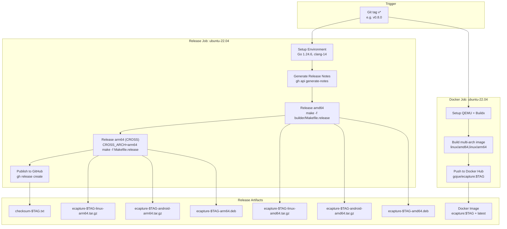
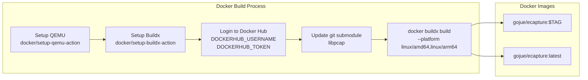

# CI/CD and Release Process

<details>
<summary>Relevant source files</summary>

The following files were used as context for generating this wiki page:

- [.github/workflows/codeql-analysis.yml](https://github.com/gojue/ecapture/blob/ca085d05/.github/workflows/codeql-analysis.yml)
- [.github/workflows/go-c-cpp.yml](https://github.com/gojue/ecapture/blob/ca085d05/.github/workflows/go-c-cpp.yml)
- [.github/workflows/release.yml](https://github.com/gojue/ecapture/blob/ca085d05/.github/workflows/release.yml)
- [Makefile](https://github.com/gojue/ecapture/blob/ca085d05/Makefile)
- [builder/Dockerfile](https://github.com/gojue/ecapture/blob/ca085d05/builder/Dockerfile)
- [builder/Makefile.release](https://github.com/gojue/ecapture/blob/ca085d05/builder/Makefile.release)
- [builder/init_env.sh](https://github.com/gojue/ecapture/blob/ca085d05/builder/init_env.sh)
- [functions.mk](https://github.com/gojue/ecapture/blob/ca085d05/functions.mk)

</details>


This document describes the continuous integration, continuous deployment, and release workflows for the eCapture project. It covers GitHub Actions workflows, build targets, packaging formats, and the complete release automation process.

For information about the build system itself (Makefile targets, compilation process), see [Build System](5.1-build-system.md). For guidance on contributing to the project, see [Development Guide](index.md).

---

## Overview

eCapture uses GitHub Actions for all CI/CD operations, with three primary workflows:

| Workflow | Trigger | Purpose | File |
|----------|---------|---------|------|
| **go-c-cpp.yml** | Push/PR to `master` | Continuous integration, build verification, tests | [.github/workflows/go-c-cpp.yml](https://github.com/gojue/ecapture/blob/ca085d05/.github/workflows/go-c-cpp.yml) |
| **release.yml** | Git tag `v*` | Automated release builds and publishing | [.github/workflows/release.yml](https://github.com/gojue/ecapture/blob/ca085d05/.github/workflows/release.yml) |
| **codeql-analysis.yml** | Push to `master`, weekly | Security scanning and code analysis | [.github/workflows/codeql-analysis.yml](https://github.com/gojue/ecapture/blob/ca085d05/.github/workflows/codeql-analysis.yml) |

The CI/CD system supports:
- **Multi-architecture builds**: Native x86_64 and arm64, plus cross-compilation
- **Multiple build modes**: CO-RE (kernel-agnostic) and non-CO-RE (kernel-specific)
- **Platform variants**: Linux and Android
- **Multiple package formats**: tar.gz, DEB, RPM, Docker images

Sources: [.github/workflows/go-c-cpp.yml:1-128](https://github.com/gojue/ecapture/blob/ca085d05/.github/workflows/go-c-cpp.yml#L1-L128), [.github/workflows/release.yml:1-129](https://github.com/gojue/ecapture/blob/ca085d05/.github/workflows/release.yml#L1-L129), [.github/workflows/codeql-analysis.yml:1-92](https://github.com/gojue/ecapture/blob/ca085d05/.github/workflows/codeql-analysis.yml#L1-L92)

---

## Continuous Integration Workflow

### Build Matrix

The main CI workflow (`go-c-cpp.yml`) runs on two GitHub-hosted runners in parallel:



**CI Build Steps on ubuntu-22.04 (x86_64)**

Sources: [.github/workflows/go-c-cpp.yml:8-67](https://github.com/gojue/ecapture/blob/ca085d05/.github/workflows/go-c-cpp.yml#L8-L67)

### Environment Setup

Both CI runners install identical development dependencies:

[.github/workflows/go-c-cpp.yml:16-33](https://github.com/gojue/ecapture/blob/ca085d05/.github/workflows/go-c-cpp.yml#L16-L33)
```yaml
- name: Install Compilers
  run: |
    sudo apt-get update
    sudo apt-get install --yes build-essential pkgconf libelf-dev \
      llvm-14 clang-14 flex bison linux-tools-common \
      linux-tools-generic gcc gcc-aarch64-linux-gnu \
      libssl-dev linux-source
    for tool in "clang" "llc" "llvm-strip"
    do
      sudo rm -f /usr/bin/$tool
      sudo ln -s /usr/bin/$tool-14 /usr/bin/$tool
    done
```

**Key Dependencies**:
- **Go 1.24.6**: Required for building Go code
- **clang-14/llvm-14**: eBPF program compilation
- **gcc-aarch64-linux-gnu**: Cross-compilation support (x86 runner) or **gcc-x86-64-linux-gnu** (ARM runner)
- **linux-source**: Kernel headers for cross-architecture builds
- **libelf-dev**: ELF file manipulation for eBPF
- **flex/bison**: Parser generators for kernel headers

The workflow also prepares kernel headers for cross-compilation by extracting and configuring the linux-source package [.github/workflows/go-c-cpp.yml:25-32](https://github.com/gojue/ecapture/blob/ca085d05/.github/workflows/go-c-cpp.yml#L25-L32).

Sources: [.github/workflows/go-c-cpp.yml:16-33](https://github.com/gojue/ecapture/blob/ca085d05/.github/workflows/go-c-cpp.yml#L16-L33), [.github/workflows/go-c-cpp.yml:76-93](https://github.com/gojue/ecapture/blob/ca085d05/.github/workflows/go-c-cpp.yml#L76-L93)

### Build Stages

Each CI job executes five build configurations:

| Stage | Command | Purpose | Output |
|-------|---------|---------|--------|
| **CO-RE Build** | `make -j8` | CO-RE eBPF + Go binary | `bin/ecapture` (BTF-enabled) |
| **Linting** | `golangci-lint` | Code quality checks | Lint report |
| **Non-CO-RE Build** | `make nocore` | Non-CO-RE eBPF + Go binary | `bin/ecapture` (kernel-specific) |
| **Cross-Compile CO-RE** | `CROSS_ARCH=arm64 make -j8` | Cross-arch CO-RE build | `bin/ecapture` (other arch) |
| **Cross-Compile Android** | `ANDROID=1 CROSS_ARCH=arm64 make nocore` | Android non-CO-RE build | `bin/ecapture` (Android) |
| **Testing** | `go test -v -race ./...` | Unit tests with race detector | Test results |

**Build Stage 1: CO-RE Build** [.github/workflows/go-c-cpp.yml:38-44](https://github.com/gojue/ecapture/blob/ca085d05/.github/workflows/go-c-cpp.yml#L38-L44)
```bash
make clean
make env
DEBUG=1 make -j8
cd ./lib/libpcap/ && sudo make install
```

This builds:
- CO-RE eBPF bytecode files (`user/bytecode/*_core.o`)
- Non-CO-RE bytecode files (`user/bytecode/*_noncore.o`)
- Static libpcap library (`lib/libpcap/libpcap.a`)
- Final Go binary with all bytecode embedded

**Build Stage 2: Linting** [.github/workflows/go-c-cpp.yml:45-50](https://github.com/gojue/ecapture/blob/ca085d05/.github/workflows/go-c-cpp.yml#L45-L50)

Uses `golangci-lint-action@v8` with version v2.1 to enforce code quality standards across the Go codebase.

**Build Stage 3: Non-CO-RE Build** [.github/workflows/go-c-cpp.yml:51-55](https://github.com/gojue/ecapture/blob/ca085d05/.github/workflows/go-c-cpp.yml#L51-L55)

Builds only non-CO-RE bytecode, useful for systems without BTF support. The `make nocore` target:
1. Compiles eBPF programs using kernel headers (non-portable)
2. Embeds only `*_noncore.o` files
3. Creates a binary that works without BTF but is kernel-version-specific

**Build Stage 4: Cross-Compilation** [.github/workflows/go-c-cpp.yml:56-60](https://github.com/gojue/ecapture/blob/ca085d05/.github/workflows/go-c-cpp.yml#L56-L60)

Uses `CROSS_ARCH=arm64` environment variable to:
1. Set `TARGET_ARCH=arm64` and `GOARCH=arm64`
2. Use `aarch64-linux-gnu-gcc` for cross-compilation
3. Build eBPF programs with `-D__TARGET_ARCH_arm64`
4. Link against cross-compiled libpcap

**Build Stage 5: Android Cross-Compilation** [.github/workflows/go-c-cpp.yml:61-65](https://github.com/gojue/ecapture/blob/ca085d05/.github/workflows/go-c-cpp.yml#L61-L65)

Combines `ANDROID=1` and `CROSS_ARCH=arm64` to:
1. Add Android-specific build tags
2. Use BoringSSL offsets instead of OpenSSL
3. Build non-CO-RE only (Android kernels may lack BTF)

Sources: [.github/workflows/go-c-cpp.yml:38-67](https://github.com/gojue/ecapture/blob/ca085d05/.github/workflows/go-c-cpp.yml#L38-L67), [.github/workflows/go-c-cpp.yml:98-127](https://github.com/gojue/ecapture/blob/ca085d05/.github/workflows/go-c-cpp.yml#L98-L127)

### Test Execution

The final CI stage runs the test suite with the race detector:

[.github/workflows/go-c-cpp.yml:126-127](https://github.com/gojue/ecapture/blob/ca085d05/.github/workflows/go-c-cpp.yml#L126-L127)
```bash
go test -v -race ./...
```

The `-race` flag enables Go's race detector to catch concurrent memory access issues in the event processing pipeline, worker pools, and module lifecycle code.

Sources: [.github/workflows/go-c-cpp.yml:66-67](https://github.com/gojue/ecapture/blob/ca085d05/.github/workflows/go-c-cpp.yml#L66-L67), [.github/workflows/go-c-cpp.yml:126-127](https://github.com/gojue/ecapture/blob/ca085d05/.github/workflows/go-c-cpp.yml#L126-L127)

---

## Release Workflow

### Trigger and Concurrency

The release workflow triggers on Git tags matching the pattern `v*` (e.g., `v0.8.0`, `v0.8.1-rc1`):

[.github/workflows/release.yml:2-9](https://github.com/gojue/ecapture/blob/ca085d05/.github/workflows/release.yml#L2-L9)
```yaml
on:
  push:
    tags:
      - "v*"

concurrency:
  group: ${{ github.workflow }}-${{ github.ref }}
  cancel-in-progress: true
```

The `concurrency` setting ensures only one release build runs at a time per tag, canceling any in-progress builds if a new tag is pushed.

Sources: [.github/workflows/release.yml:2-9](https://github.com/gojue/ecapture/blob/ca085d05/.github/workflows/release.yml#L2-L9)

### Release Pipeline Architecture



**Release Pipeline Stages**

Sources: [.github/workflows/release.yml:11-129](https://github.com/gojue/ecapture/blob/ca085d05/.github/workflows/release.yml#L11-L129)

### Release Notes Generation

The workflow automatically generates release notes using GitHub's API:

[.github/workflows/release.yml:63-87](https://github.com/gojue/ecapture/blob/ca085d05/.github/workflows/release.yml#L63-L87)
```yaml
- name: Get Previous Tag
  id: previoustag
  run: |
    PREVIOUS=$(git describe --tags --abbrev=0 HEAD^ 2>/dev/null || echo "")
    echo "PREVIOUS_TAG=$PREVIOUS" >> $GITHUB_OUTPUT

- name: Generate Release Notes
  id: release_notes
  run: |
    gh api \
      --method POST \
      -H "Accept: application/vnd.github+json" \
      /repos/${{ github.repository }}/releases/generate-notes \
      -f tag_name=${{ github.ref_name }} \
      -f previous_tag_name=${{ steps.previoustag.outputs.PREVIOUS_TAG }} \
      > release_notes.json
    echo "NOTES<<EOF" >> $GITHUB_OUTPUT
    jq -r .body release_notes.json >> $GITHUB_OUTPUT
    echo "EOF" >> $GITHUB_OUTPUT

- name: Write File
  uses: DamianReeves/write-file-action@v1.2
  with:
    path: ./bin/release_notes.txt
    contents: |
      ${{ steps.release_notes.outputs.NOTES }}
```

This process:
1. Finds the previous tag using `git describe`
2. Calls GitHub's `/releases/generate-notes` API endpoint
3. Extracts the body from the JSON response
4. Writes to `bin/release_notes.txt` for inclusion in the release

Sources: [.github/workflows/release.yml:63-87](https://github.com/gojue/ecapture/blob/ca085d05/.github/workflows/release.yml#L63-L87)

### Release Builds

The release job executes two build configurations:

**Native amd64 Build** [.github/workflows/release.yml:88-92](https://github.com/gojue/ecapture/blob/ca085d05/.github/workflows/release.yml#L88-L92)
```bash
make clean
make env
make -f builder/Makefile.release release SNAPSHOT_VERSION=${{ github.ref_name }}
```

**Cross-Compiled arm64 Build** [.github/workflows/release.yml:93-97](https://github.com/gojue/ecapture/blob/ca085d05/.github/workflows/release.yml#L93-L97)
```bash
make clean
make env
CROSS_ARCH=arm64 make -f builder/Makefile.release release SNAPSHOT_VERSION=${{ github.ref_name }}
```

Each `make release` invocation in [builder/Makefile.release:10](https://github.com/gojue/ecapture/blob/ca085d05/builder/Makefile.release#L10) triggers:
```makefile
release: snapshot build_deb snapshot_android
```

This cascading target generates:
1. **`snapshot`**: Linux tar.gz archive with CO-RE + non-CO-RE bytecode
2. **`build_deb`**: Debian package from the built binary
3. **`snapshot_android`**: Android tar.gz archive with non-CO-RE bytecode only

Sources: [.github/workflows/release.yml:88-100](https://github.com/gojue/ecapture/blob/ca085d05/.github/workflows/release.yml#L88-L100), [builder/Makefile.release:10](https://github.com/gojue/ecapture/blob/ca085d05/builder/Makefile.release#L10)

### Archive Creation

The `snapshot` and `snapshot_android` targets use the `release_tar` function:

[functions.mk:62-76](https://github.com/gojue/ecapture/blob/ca085d05/functions.mk#L62-L76)
```makefile
define release_tar
	$(call allow-override,CORE_PREFIX,$(call CHECK_IS_NON_CORE,$(2),nocore))
	$(call allow-override,TAR_DIR,ecapture-$(DEB_VERSION)-$(1)-$(GOARCH)$(CORE_PREFIX))
	$(call allow-override,OUT_ARCHIVE,$(OUTPUT_DIR)/$(TAR_DIR).tar.gz)
	$(CMD_MAKE) clean
	ANDROID=$(ANDROID) $(CMD_MAKE) $(2)
	# create the tar ball and checksum files
	$(CMD_MKDIR) -p $(TAR_DIR)
	$(CMD_CP) LICENSE $(TAR_DIR)/LICENSE
	$(CMD_CP) CHANGELOG.md $(TAR_DIR)/CHANGELOG.md
	$(CMD_CP) README.md $(TAR_DIR)/README.md
	$(CMD_CP) README_CN.md $(TAR_DIR)/README_CN.md
	$(CMD_CP) $(OUTPUT_DIR)/ecapture $(TAR_DIR)/ecapture
	$(CMD_TAR) -czf $(OUT_ARCHIVE) $(TAR_DIR)
endef
```

For example, invoking `snapshot` with `SNAPSHOT_VERSION=v0.8.0` produces:
- **Archive name**: `ecapture-v0.8.0-linux-amd64.tar.gz`
- **Contents**:
  - `ecapture` (binary)
  - `LICENSE`
  - `CHANGELOG.md`
  - `README.md`
  - `README_CN.md`

Android builds append `-nocore` to indicate non-CO-RE only:
- **Archive name**: `ecapture-v0.8.0-android-arm64-nocore.tar.gz`

Sources: [functions.mk:62-76](https://github.com/gojue/ecapture/blob/ca085d05/functions.mk#L62-L76), [builder/Makefile.release:94-112](https://github.com/gojue/ecapture/blob/ca085d05/builder/Makefile.release#L94-L112)

### Debian Package Creation

The `build_deb` target constructs a `.deb` package:

[builder/Makefile.release:135-151](https://github.com/gojue/ecapture/blob/ca085d05/builder/Makefile.release#L135-L151)
```makefile
build_deb:
	# Create package directory structure
	$(CMD_RM) -rf $(BUILD_DIR)
	$(CMD_MKDIR) -p $(BUILD_DIR)/DEBIAN
	$(CMD_MKDIR) -p $(BUILD_DIR)/usr/local/bin
	# Copy binary
	$(CMD_CP) bin/ecapture $(BUILD_DIR)/usr/local/bin/ecapture
	# Create control file (DEBIAN/control)
	$(CMD_ECHO) "Package: $(PACKAGE_NAME)" > $(BUILD_DIR)/DEBIAN/control
	$(CMD_ECHO) "Version: $(PACKAGE_VERSION)" >> $(BUILD_DIR)/DEBIAN/control
	$(CMD_ECHO) "BuildDate: $(BUILD_DATE)" >> $(BUILD_DIR)/DEBIAN/control
	$(CMD_ECHO) "Architecture: $(GOARCH)" >> $(BUILD_DIR)/DEBIAN/control
	$(CMD_ECHO) "Maintainer: $(PACKAGE_MAINTAINER)" >> $(BUILD_DIR)/DEBIAN/control
	$(CMD_ECHO) "Description: $(PACKAGE_DESC)" >> $(BUILD_DIR)/DEBIAN/control
	$(CMD_ECHO) "Homepage: $(PACKAGE_HOMEPAGE)" >> $(BUILD_DIR)/DEBIAN/control
	# Build DEB package
	$(CMD_DPKG-DEB) --build $(BUILD_DIR) $(OUT_DEB_FILE)
```

**DEB Package Structure**:
```
ecapture-v0.8.0-amd64.deb
├── DEBIAN/
│   └── control (metadata)
└── usr/
    └── local/
        └── bin/
            └── ecapture (binary)
```

The control file includes:
- **Package**: `ecapture`
- **Version**: From `SNAPSHOT_VERSION` (e.g., `v0.8.0`)
- **Architecture**: `amd64` or `arm64`
- **Maintainer**: Package maintainer info
- **Description**: Brief package description
- **Homepage**: https://ecapture.cc

Sources: [builder/Makefile.release:135-151](https://github.com/gojue/ecapture/blob/ca085d05/builder/Makefile.release#L135-L151)

### Publishing to GitHub Releases

The final step uploads all artifacts to a GitHub release:

[.github/workflows/release.yml:98-100](https://github.com/gojue/ecapture/blob/ca085d05/.github/workflows/release.yml#L98-L100)
```bash
make -f builder/Makefile.release publish SNAPSHOT_VERSION=${{ github.ref_name }}
```

[builder/Makefile.release:114-124](https://github.com/gojue/ecapture/blob/ca085d05/builder/Makefile.release#L114-L124)
```makefile
publish: \
	$(OUTPUT_DIR) \
	$(OUT_ARCHIVE) \
	$(OUT_DEB_FILE) \
	| .check_tree \
	.check_$(CMD_GITHUB)
	@$(CMD_CD) $(OUTPUT_DIR)
	@$(CMD_CHECKSUM) ecapture*v* | $(CMD_SED) 's/.\/bin\///g' > $(OUT_CHECKSUMS)
	@FILES=$$(ls ecapture-*.tar.gz ecapture*.deb checksum-*.txt)
	@$(CMD_GITHUB) release create $(DEB_VERSION) $$FILES \
		--title "eCapture $(DEB_VERSION)" \
		--notes-file $(RELEASE_NOTES)
```

**Published Artifacts** (for version v0.8.0):
- `ecapture-v0.8.0-linux-amd64.tar.gz`
- `ecapture-v0.8.0-linux-arm64.tar.gz`
- `ecapture-v0.8.0-android-amd64-nocore.tar.gz`
- `ecapture-v0.8.0-android-arm64-nocore.tar.gz`
- `ecapture-v0.8.0-amd64.deb`
- `ecapture-v0.8.0-arm64.deb`
- `checksum-v0.8.0.txt` (SHA256 checksums of all files)

Sources: [.github/workflows/release.yml:98-100](https://github.com/gojue/ecapture/blob/ca085d05/.github/workflows/release.yml#L98-L100), [builder/Makefile.release:114-124](https://github.com/gojue/ecapture/blob/ca085d05/builder/Makefile.release#L114-L124)

---

## Docker Image Release

### Multi-Architecture Docker Build

The release workflow includes a separate job for building and publishing Docker images:

[.github/workflows/release.yml:101-129](https://github.com/gojue/ecapture/blob/ca085d05/.github/workflows/release.yml#L101-L129)



**Docker Build Process**

**Step 1: Setup Multi-Arch Support** [.github/workflows/release.yml:106-109](https://github.com/gojue/ecapture/blob/ca085d05/.github/workflows/release.yml#L106-L109)

Uses Docker Buildx with QEMU to build images for both `linux/amd64` and `linux/arm64` architectures from a single command.

**Step 2: Authenticate** [.github/workflows/release.yml:110-114](https://github.com/gojue/ecapture/blob/ca085d05/.github/workflows/release.yml#L110-L114)

Logs into Docker Hub using GitHub Secrets:
- `DOCKERHUB_USERNAME`: Docker Hub username
- `DOCKERHUB_TOKEN`: Docker Hub access token

**Step 3: Build and Push** [.github/workflows/release.yml:117-129](https://github.com/gojue/ecapture/blob/ca085d05/.github/workflows/release.yml#L117-L129)
```yaml
- name: Build and push
  uses: docker/build-push-action@v5
  with:
    context: .
    build-args: VERSION=${{ github.ref_name }}
    file: ./builder/Dockerfile
    platforms: linux/amd64,linux/arm64
    push: true
    cache-from: type=registry,ref=${{ secrets.DOCKERHUB_USERNAME }}/ecapture:buildcache
    cache-to: type=registry,ref=${{ secrets.DOCKERHUB_USERNAME }}/ecapture:buildcache,mode=max
    tags: |
      ${{ secrets.DOCKERHUB_USERNAME }}/ecapture:${{ github.ref_name }}
      ${{ secrets.DOCKERHUB_USERNAME }}/ecapture:latest
```

Key features:
- **Platforms**: Builds for both `linux/amd64` and `linux/arm64` simultaneously
- **Build caching**: Uses registry cache to speed up subsequent builds
- **Tags**: Each release gets two tags (version-specific and `latest`)
- **Build arg**: Passes `VERSION` for version embedding

Sources: [.github/workflows/release.yml:101-129](https://github.com/gojue/ecapture/blob/ca085d05/.github/workflows/release.yml#L101-L129)

### Dockerfile Structure

The Docker build is defined in [builder/Dockerfile:1-39](https://github.com/gojue/ecapture/blob/ca085d05/builder/Dockerfile#L1-L39):

**Stage 1: Builder Image** [builder/Dockerfile:1-32](https://github.com/gojue/ecapture/blob/ca085d05/builder/Dockerfile#L1-L32)
```dockerfile
FROM ubuntu:22.04 as ecapture_builder

# Install build dependencies
RUN apt-get update && apt-get install --yes \
  git build-essential pkgconf libelf-dev llvm-14 clang-14 \
  linux-tools-common linux-headers-$(uname -r) make gcc flex bison \
  file wget linux-source

# Install Go 1.24.6
ARG TARGETARCH
RUN wget -O go.tar.gz https://golang.google.cn/dl/go1.24.6.linux-${TARGETARCH}.tar.gz && \
  tar -C /usr/local -xzf go.tar.gz

# Build ecapture
COPY ./ /build/ecapture
ARG VERSION
RUN cd /build/ecapture && \
  make clean && \
  make all SNAPSHOT_VERSION=${VERSION}_docker
```

The `TARGETARCH` argument is automatically set by Docker Buildx to `amd64` or `arm64` based on the target platform.

**Stage 2: Release Image** [builder/Dockerfile:34-39](https://github.com/gojue/ecapture/blob/ca085d05/builder/Dockerfile#L34-L39)
```dockerfile
FROM alpine:latest as ecapture

COPY --from=ecapture_builder /build/ecapture/bin/ecapture /ecapture

ENTRYPOINT ["/ecapture"]
```

The final image:
- Uses minimal Alpine Linux base
- Contains only the `ecapture` binary
- Total size: ~50MB (significantly smaller than the builder image)
- Sets `/ecapture` as the entrypoint

**Docker Image Tags**:
- `gojue/ecapture:v0.8.0` (version-specific)
- `gojue/ecapture:latest` (always points to most recent release)

Sources: [builder/Dockerfile:1-39](https://github.com/gojue/ecapture/blob/ca085d05/builder/Dockerfile#L1-L39)

---

## Build Target Reference

### Makefile Targets

The following table summarizes all build targets available in the main [Makefile](https://github.com/gojue/ecapture/blob/ca085d05/Makefile):

| Target | Command | Description | Bytecode Included | Output |
|--------|---------|-------------|-------------------|--------|
| `all` | `make` | Full build: CO-RE + non-CO-RE | Both | `bin/ecapture` |
| `nocore` / `noncore` | `make nocore` | Non-CO-RE only | Non-CO-RE only | `bin/ecapture` |
| `ebpf` | `make ebpf` | Compile CO-RE bytecode | N/A | `user/bytecode/*_core.o` |
| `ebpf_noncore` | `make ebpf_noncore` | Compile non-CO-RE bytecode | N/A | `user/bytecode/*_noncore.o` |
| `assets` | `make assets` | Embed all bytecode | Both | `assets/ebpf_probe.go` |
| `assets_noncore` | `make assets_noncore` | Embed non-CO-RE bytecode | Non-CO-RE only | `assets/ebpf_probe.go` |
| `build` | `make build` | Build Go binary (all bytecode) | Both | `bin/ecapture` |
| `build_noncore` | `make build_noncore` | Build Go binary (non-CO-RE only) | Non-CO-RE only | `bin/ecapture` |
| `clean` | `make clean` | Remove build artifacts | N/A | (cleanup) |
| `test-race` | `make test-race` | Run tests with race detector | N/A | Test results |
| `rpm` | `make rpm` | Build RPM package | Both | `~/rpmbuild/RPMS/` |

Sources: [Makefile:1-245](https://github.com/gojue/ecapture/blob/ca085d05/Makefile#L1-L245)

### Cross-Compilation

Cross-compilation is enabled using the `CROSS_ARCH` environment variable:

**Build for ARM64 on x86_64 Host**:
```bash
CROSS_ARCH=arm64 make all
```

**Build for x86_64 on ARM64 Host**:
```bash
CROSS_ARCH=amd64 make all
```

The `CROSS_ARCH` variable triggers:
1. **Toolchain selection**: Uses `aarch64-linux-gnu-gcc` or `x86_64-linux-gnu-gcc`
2. **eBPF arch flag**: Sets `-D__TARGET_ARCH_arm64` or `-D__TARGET_ARCH_x86`
3. **Go cross-compilation**: Sets `GOARCH=arm64` or `GOARCH=amd64`
4. **Kernel headers**: Uses cross-compiled kernel headers from `/usr/src/`

Sources: [Makefile:56-60](https://github.com/gojue/ecapture/blob/ca085d05/Makefile#L56-L60), [.github/workflows/go-c-cpp.yml:56-65](https://github.com/gojue/ecapture/blob/ca085d05/.github/workflows/go-c-cpp.yml#L56-L65)

### Android Builds

Android builds require the `ANDROID=1` flag:

```bash
ANDROID=1 CROSS_ARCH=arm64 make nocore
```

Android-specific behavior:
- **Non-CO-RE only**: Android kernels often lack BTF support
- **BoringSSL offsets**: Uses Android BoringSSL instead of OpenSSL
- **Static linking**: Ensures binary runs without external dependencies
- **Build tags**: Adds `android` build tag for conditional compilation

The Android flag is detected in the build system and adjusts:
1. **Library detection**: Prioritizes BoringSSL version detection
2. **Offset selection**: Uses `boringssl_offset_*.sh` generated headers
3. **Target tags**: Includes `android` in the `-tags` argument to `go build`

Sources: [Makefile:27](https://github.com/gojue/ecapture/blob/ca085d05/Makefile#L27), [.github/workflows/go-c-cpp.yml:61-65](https://github.com/gojue/ecapture/blob/ca085d05/.github/workflows/go-c-cpp.yml#L61-L65)

---

## Version Management

### Version Embedding

Version information is embedded into the binary at build time using Go linker flags:

[functions.mk:47-54](https://github.com/gojue/ecapture/blob/ca085d05/functions.mk#L47-L54)
```makefile
define gobuild
	CGO_ENABLED=1 \
	CGO_CFLAGS='-O2 -g -gdwarf-4 -I$(CURDIR)/lib/libpcap/' \
	CGO_LDFLAGS='-O2 -g -L$(CURDIR)/lib/libpcap/ -lpcap -static' \
	GOOS=linux GOARCH=$(GOARCH) CC=$(CMD_CC_PREFIX)$(CMD_CC) \
	$(CMD_GO) build -trimpath -buildmode=pie -mod=readonly -tags '$(TARGET_TAG),netgo' \
	  -ldflags "-w -s \
	    -X 'github.com/gojue/ecapture/cli/cmd.GitVersion=$(TARGET_TAG)_$(GOARCH):$(VERSION_NUM):$(VERSION_FLAG)' \
	    -X 'github.com/gojue/ecapture/cli/cmd.ByteCodeFiles=$(BYTECODE_FILES)' \
	    -linkmode=external -extldflags -static" \
	  -o $(OUT_BIN)
endef
```

**Embedded Variables**:
- `cli/cmd.GitVersion`: Contains `$(TARGET_TAG)_$(GOARCH):$(VERSION_NUM):$(VERSION_FLAG)`
  - Example: `v0.8.0_amd64:v0.8.0:5.15.0-1045-generic`
- `cli/cmd.ByteCodeFiles`: Either `core,noncore` or `noncore` depending on build type

**Version Components**:
| Component | Source | Example |
|-----------|--------|---------|
| `TARGET_TAG` | Git tag or `SNAPSHOT_VERSION` | `v0.8.0` |
| `GOARCH` | Target architecture | `amd64`, `arm64` |
| `VERSION_NUM` | Latest git tag | `v0.8.0` |
| `VERSION_FLAG` | Kernel version or host arch | `5.15.0-1045-generic` |

Users can query version info:
```bash
$ ./ecapture version
eCapture v0.8.0_amd64:v0.8.0:5.15.0-1045-generic
GitURL: https://github.com/gojue/ecapture
ByteCodeFiles: core,noncore
```

Sources: [functions.mk:47-54](https://github.com/gojue/ecapture/blob/ca085d05/functions.mk#L47-L54)

### Snapshot Versioning

During development and testing, snapshots use the `SNAPSHOT_VERSION` environment variable:

```bash
SNAPSHOT_VERSION=v0.8.0-rc1 make -f builder/Makefile.release snapshot
```

This overrides the default version detection (latest git tag) and produces:
- Archive: `ecapture-v0.8.0-rc1-linux-amd64.tar.gz`
- DEB: `ecapture-v0.8.0-rc1-amd64.deb`
- Embedded version: `v0.8.0-rc1_amd64:v0.8.0-rc1:...`

Sources: [builder/Makefile.release:38](https://github.com/gojue/ecapture/blob/ca085d05/builder/Makefile.release#L38), [.github/workflows/release.yml:92](https://github.com/gojue/ecapture/blob/ca085d05/.github/workflows/release.yml#L92)

---

## Security Scanning

### CodeQL Analysis

The project includes automated security scanning via CodeQL:

[.github/workflows/codeql-analysis.yml:14-22](https://github.com/gojue/ecapture/blob/ca085d05/.github/workflows/codeql-analysis.yml#L14-L22)
```yaml
on:
  push:
    branches: [ master ]
  pull_request:
    branches: [ master ]
  schedule:
    - cron: '42 15 * * 3'  # Weekly on Wednesday at 15:42 UTC
```

**CodeQL Workflow**:
1. **Language matrix**: Analyzes both C/C++ (eBPF programs) and Go (userspace code)
2. **Build step**: Runs `make nocore -j4` to compile all code for analysis
3. **Analysis**: Scans for security vulnerabilities, code quality issues
4. **Reporting**: Results appear in GitHub Security tab

The workflow runs:
- On every push to `master`
- On every pull request
- Weekly on Wednesday at 15:42 UTC

Sources: [.github/workflows/codeql-analysis.yml:1-92](https://github.com/gojue/ecapture/blob/ca085d05/.github/workflows/codeql-analysis.yml#L1-L92)

---

## Build System Dependencies

### Required Tools

The CI/CD system requires these tools to be available:

**Compiler Toolchain**:
- **clang** ≥ 9 (enforced by [functions.mk:17-22](https://github.com/gojue/ecapture/blob/ca085d05/functions.mk#L17-L22))
- **llc** (LLVM compiler)
- **llvm-strip** (for stripping debug symbols)
- **gcc** (for Go CGO compilation)
- **gcc-aarch64-linux-gnu** or **gcc-x86-64-linux-gnu** (cross-compilation)

**Go Toolchain**:
- **go** ≥ 1.24 (enforced by [functions.mk:28-35](https://github.com/gojue/ecapture/blob/ca085d05/functions.mk#L28-L35))
- **go-bindata** (for embedding bytecode)

**Build Tools**:
- **make** (GNU Make)
- **bpftool** (for CO-RE vmlinux.h generation)
- **flex** / **bison** (parser generators)
- **tar** / **gzip** (archiving)
- **dpkg-deb** (DEB package creation)
- **rpmbuild** (RPM package creation, optional)

**Development Tools**:
- **git** (version control)
- **gh** (GitHub CLI for release creation)
- **sha256sum** (checksum generation)

Version checks are implemented as makefile targets [functions.mk:2-40](https://github.com/gojue/ecapture/blob/ca085d05/functions.mk#L2-L40):
```makefile
.checkver_$(CMD_CLANG): | .check_$(CMD_CLANG)
	@if [ ${CLANG_VERSION} -lt 9 ]; then
		echo "you MUST use clang 9 or newer"
		exit 1
	fi

.checkver_$(CMD_GO): | .check_$(CMD_GO)
	@if [ ${GO_VERSION_MAJ} -eq 1 ]; then
		if [ ${GO_VERSION_MIN} -lt 24 ]; then
			echo "you MUST use golang 1.24 or newer"
			exit 1
		fi
	fi
```

Sources: [functions.mk:2-40](https://github.com/gojue/ecapture/blob/ca085d05/functions.mk#L2-L40), [builder/init_env.sh:1-106](https://github.com/gojue/ecapture/blob/ca085d05/builder/init_env.sh#L1-L106)

### Environment Initialization

The project provides an automated environment setup script for Ubuntu:

[builder/init_env.sh:1-106](https://github.com/gojue/ecapture/blob/ca085d05/builder/init_env.sh#L1-L106)

**Supported Ubuntu Versions**:
- 20.04 (clang-10)
- 20.10 (clang-10)
- 21.04 (clang-11)
- 21.10 (clang-12)
- 22.04 (clang-12)
- 22.10 (clang-12)
- 23.04 (clang-15)
- 23.10 (clang-15)
- 24.04 (clang-18)

**Usage**:
```bash
/bin/bash -c "$(curl -fsSL https://raw.githubusercontent.com/gojue/ecapture/master/builder/init_env.sh)"
```

The script:
1. Detects Ubuntu version and selects appropriate clang version
2. Installs all required development packages
3. Extracts and prepares kernel headers for cross-compilation
4. Downloads and installs Go 1.24.6
5. Clones the eCapture repository
6. Verifies the installation

Sources: [builder/init_env.sh:1-106](https://github.com/gojue/ecapture/blob/ca085d05/builder/init_env.sh#L1-L106)

---

## Package Format Details

### TAR.GZ Archives

**Structure**:
```
ecapture-v0.8.0-linux-amd64.tar.gz
├── ecapture (binary)
├── LICENSE
├── CHANGELOG.md
├── README.md
└── README_CN.md
```

**Naming Convention**:
- Linux: `ecapture-$(VERSION)-linux-$(ARCH).tar.gz`
- Android: `ecapture-$(VERSION)-android-$(ARCH)-nocore.tar.gz`

**Checksum File** (`checksum-v0.8.0.txt`):
```
<SHA256>  ecapture-v0.8.0-linux-amd64.tar.gz
<SHA256>  ecapture-v0.8.0-linux-arm64.tar.gz
<SHA256>  ecapture-v0.8.0-android-amd64-nocore.tar.gz
<SHA256>  ecapture-v0.8.0-android-arm64-nocore.tar.gz
<SHA256>  ecapture-v0.8.0-amd64.deb
<SHA256>  ecapture-v0.8.0-arm64.deb
```

Sources: [functions.mk:62-76](https://github.com/gojue/ecapture/blob/ca085d05/functions.mk#L62-L76), [builder/Makefile.release:122](https://github.com/gojue/ecapture/blob/ca085d05/builder/Makefile.release#L122)

### DEB Packages

**Installation**:
```bash
sudo dpkg -i ecapture-v0.8.0-amd64.deb
```

**Installed Files**:
- Binary: `/usr/local/bin/ecapture`
- No configuration files or systemd units (simple installation)

**Control File Fields**:
```
Package: ecapture
Version: v0.8.0
Architecture: amd64
Maintainer: CFC4N <cfc4n.cs@gmail.com>
Description: capture SSL/TLS text content without CA cert using eBPF
Homepage: https://ecapture.cc
```

Sources: [builder/Makefile.release:135-151](https://github.com/gojue/ecapture/blob/ca085d05/builder/Makefile.release#L135-L151)

### RPM Packages

RPM package creation is available but not used in the automated release process:

[Makefile:65-71](https://github.com/gojue/ecapture/blob/ca085d05/Makefile#L65-L71)
```makefile
rpm:
	@$(CMD_RPM_SETUP_TREE) || exit 1
	$(CMD_SED) -i '0,/^Version:.*$$/s//Version:    $(TAG)/' builder/rpmBuild.spec
	$(CMD_SED) -i '0,/^Release:.*$$/s//Release:    $(RPM_RELEASE)/' builder/rpmBuild.spec
	$(CMD_TAR) zcvf ~/rpmbuild/SOURCES/$(RPM_SOURCE0) ./
	$(CMD_RPMBUILD) -ba builder/rpmBuild.spec
```

**Manual Build**:
```bash
make rpm VERSION=0.8.0 RELEASE=1
```

This creates RPM packages in `~/rpmbuild/RPMS/$(ARCH)/`.

Sources: [Makefile:65-71](https://github.com/gojue/ecapture/blob/ca085d05/Makefile#L65-L71)

---

## Troubleshooting CI/CD

### Common Build Failures

**Issue: "missing required tool clang"**

The build requires clang version 9 or newer. Install it:
```bash
sudo apt-get install clang-14
sudo ln -s /usr/bin/clang-14 /usr/bin/clang
```

**Issue: "you MUST use golang 1.24 or newer"**

The project requires Go 1.24+. Download from https://go.dev/dl/ or use the initialization script.

**Issue: "linux source not found with path"**

Cross-compilation requires kernel headers. Install:
```bash
sudo apt-get install linux-source
cd /usr/src
sudo tar -xf linux-source-*.tar.bz2
cd linux-source-*
sudo make ARCH=arm64 CROSS_COMPILE=aarch64-linux-gnu- prepare
```

**Issue: "golangci-lint failed"**

Run locally to see specific issues:
```bash
golangci-lint run
```

Fix formatting issues:
```bash
make format
```

Sources: [functions.mk:13-35](https://github.com/gojue/ecapture/blob/ca085d05/functions.mk#L13-L35), [.github/workflows/go-c-cpp.yml:16-33](https://github.com/gojue/ecapture/blob/ca085d05/.github/workflows/go-c-cpp.yml#L16-L33)

### Debugging Release Builds

To reproduce a release build locally:

```bash
# Set version
export SNAPSHOT_VERSION=v0.8.0-test

# Build amd64
make clean
make env
make -f builder/Makefile.release release

# Build arm64 (requires cross-compile setup)
make clean
CROSS_ARCH=arm64 make env
CROSS_ARCH=arm64 make -f builder/Makefile.release release
```

Check generated artifacts:
```bash
ls -lh bin/
# Should show:
# - ecapture-v0.8.0-test-linux-amd64.tar.gz
# - ecapture-v0.8.0-test-android-amd64-nocore.tar.gz
# - ecapture-v0.8.0-test-amd64.deb
```

Sources: [builder/Makefile.release:94-151](https://github.com/gojue/ecapture/blob/ca085d05/builder/Makefile.release#L94-L151)