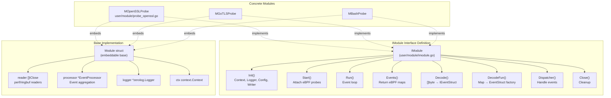
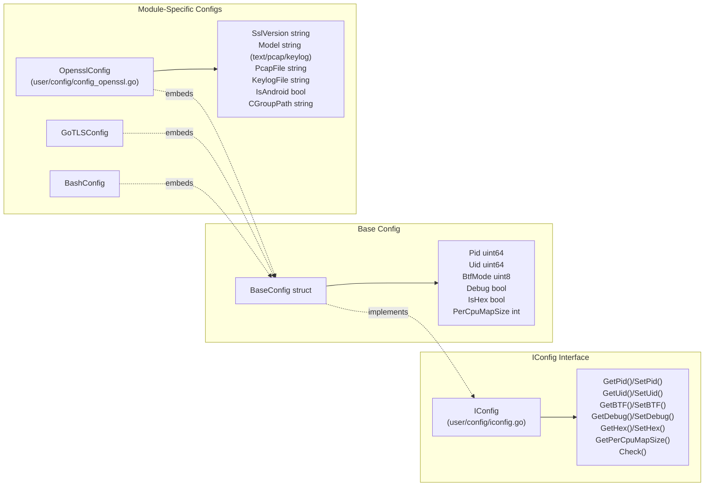
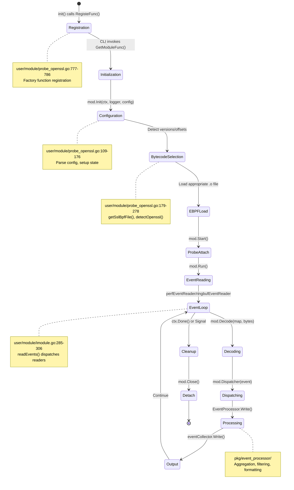
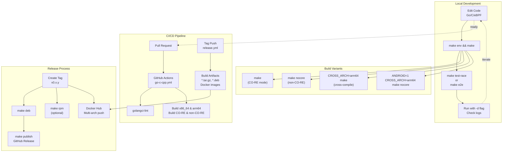
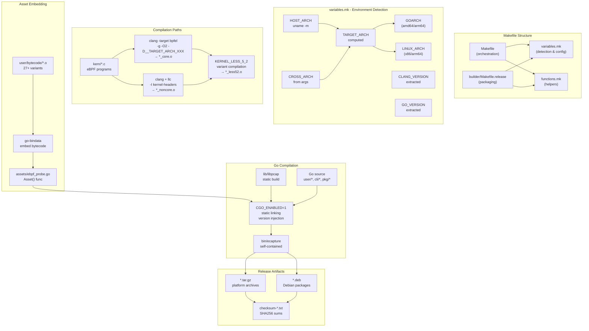

# Development Guide

<details>
<summary>Relevant source files</summary>

The following files were used as context for generating this wiki page:

- [.github/workflows/codeql-analysis.yml](https://github.com/gojue/ecapture/blob/0766a93b/.github/workflows/codeql-analysis.yml)
- [.github/workflows/go-c-cpp.yml](https://github.com/gojue/ecapture/blob/0766a93b/.github/workflows/go-c-cpp.yml)
- [.github/workflows/release.yml](https://github.com/gojue/ecapture/blob/0766a93b/.github/workflows/release.yml)
- [Makefile](https://github.com/gojue/ecapture/blob/0766a93b/Makefile)
- [builder/Dockerfile](https://github.com/gojue/ecapture/blob/0766a93b/builder/Dockerfile)
- [builder/Makefile.release](https://github.com/gojue/ecapture/blob/0766a93b/builder/Makefile.release)
- [builder/init_env.sh](https://github.com/gojue/ecapture/blob/0766a93b/builder/init_env.sh)
- [cli/cmd/root.go](https://github.com/gojue/ecapture/blob/0766a93b/cli/cmd/root.go)
- [functions.mk](https://github.com/gojue/ecapture/blob/0766a93b/functions.mk)
- [user/config/iconfig.go](https://github.com/gojue/ecapture/blob/0766a93b/user/config/iconfig.go)
- [user/module/imodule.go](https://github.com/gojue/ecapture/blob/0766a93b/user/module/imodule.go)
- [user/module/probe_openssl.go](https://github.com/gojue/ecapture/blob/0766a93b/user/module/probe_openssl.go)

</details>


This guide is intended for developers who want to contribute to eCapture, add new capture modules, modify existing functionality, or understand the codebase architecture. It covers the development environment setup, key interfaces, build system, and extension points.

For detailed information about specific development tasks, see:
- [Build System](5.1-build-system.md) - Comprehensive build system documentation
- [eBPF Program Development](5.2-ebpf-program-development.md) - Writing eBPF programs
- [Adding New Modules](5.3-adding-new-modules.md) - Creating new capture modules
- [Event Processing and Parsers](5.4-event-processing-and-parsers.md) - Event handling and protocol parsing

---

## Development Environment Requirements

eCapture requires specific tools and dependencies for development. The project provides an automated setup script for Ubuntu-based systems.

### Required Tools

| Tool | Minimum Version | Purpose |
|------|----------------|---------|
| `clang` | 9+ (14 recommended) | eBPF bytecode compilation |
| `llvm` | 9+ (14 recommended) | eBPF toolchain |
| `golang` | 1.24+ | Application compilation |
| `gcc` | Any recent | Cross-compilation support |
| `linux-headers` | Matching kernel | Non-CO-RE compilation |
| `libelf-dev` | - | ELF file parsing |
| `bpftool` | - | eBPF bytecode generation |

### Automated Setup

The project provides [builder/init_env.sh:1-106](https://github.com/gojue/ecapture/blob/0766a93b/builder/init_env.sh#L1-L106) which automatically installs dependencies on Ubuntu 20.04-24.04 for both x86_64 and aarch64 architectures. It:

1. Detects Ubuntu version and selects appropriate clang version
2. Installs compilation toolchain and cross-compilation tools
3. Extracts and prepares Linux kernel headers
4. Installs Go 1.24.6
5. Clones the repository with submodules

**Sources:** [builder/init_env.sh:1-106](https://github.com/gojue/ecapture/blob/0766a93b/builder/init_env.sh#L1-L106), [.github/workflows/go-c-cpp.yml:16-33](https://github.com/gojue/ecapture/blob/0766a93b/.github/workflows/go-c-cpp.yml#L16-L33)

---

## Core Development Interfaces

eCapture's architecture is built around three key interfaces that developers must understand to extend functionality.

### IModule Interface

The `IModule` interface defines the contract for all capture modules. Every module (OpenSSL, GoTLS, Bash, etc.) implements this interface.



#### IModule Method Contract

| Method | Purpose | Typical Implementation |
|--------|---------|----------------------|
| `Init()` | Initialize module state, parse config, setup maps | Load eBPF bytecode selection logic, initialize caches |
| `Start()` | Attach eBPF programs to hooks | Call `bpfManager.Start()`, attach uprobes/kprobes/TC |
| `Run()` | Begin event processing | Start event readers, run processor |
| `Events()` | Return eBPF maps for event reading | Return perf/ringbuf maps |
| `Decode()` | Deserialize raw bytes to event structs | Parse event type, deserialize fields |
| `DecodeFun()` | Map eBPF map to event decoder | Return appropriate `IEventStruct` factory |
| `Dispatcher()` | Handle decoded events | Route to output, update state, save keys |
| `Close()` | Cleanup resources | Stop readers, close files, detach probes |

**Sources:** [user/module/imodule.go:47-75](https://github.com/gojue/ecapture/blob/0766a93b/user/module/imodule.go#L47-L75), [user/module/imodule.go:83-108](https://github.com/gojue/ecapture/blob/0766a93b/user/module/imodule.go#L83-L108)

### IConfig Interface

All modules receive configuration through the `IConfig` interface, which provides both common settings and module-specific options.



#### Common Configuration Fields

| Field | Type | Purpose | Example |
|-------|------|---------|---------|
| `Pid` | `uint64` | Target process ID (0 = all) | `1234` |
| `Uid` | `uint64` | Target user ID (0 = all) | `1000` |
| `BtfMode` | `uint8` | BTF mode (0=auto, 1=core, 2=non-core) | `0` |
| `Debug` | `bool` | Enable debug logging | `true` |
| `IsHex` | `bool` | Hex output mode | `false` |
| `PerCpuMapSize` | `int` | eBPF map size per CPU (pages) | `1024` |

**Sources:** [user/config/iconfig.go:24-70](https://github.com/gojue/ecapture/blob/0766a93b/user/config/iconfig.go#L24-L70), [user/config/iconfig.go:95-112](https://github.com/gojue/ecapture/blob/0766a93b/user/config/iconfig.go#L95-L112)

### IEventStruct Interface

Events flowing from eBPF to userspace implement `IEventStruct`, enabling polymorphic event handling.

| Method | Return Type | Purpose |
|--------|-------------|---------|
| `Decode([]byte)` | `error` | Deserialize from raw bytes |
| `String()` | `string` | Human-readable text format |
| `StringHex()` | `string` | Hexadecimal text format |
| `Clone()` | `IEventStruct` | Create new instance for decoding |
| `EventType()` | `EventType` | Event classification |
| `ToProtobufEvent()` | `*pb.Event` | Convert to protobuf |

**Sources:** [user/event/event.go](https://github.com/gojue/ecapture/blob/0766a93b/user/event/event.go) (referenced in imports)

---

## Module Development Lifecycle

Understanding the lifecycle of a module from initialization to shutdown is essential for development.



### Lifecycle Phase Details

**1. Registration Phase**
- Module factory function is registered via `RegisteFunc()` in `init()`
- Example: [user/module/probe_openssl.go:777-786](https://github.com/gojue/ecapture/blob/0766a93b/user/module/probe_openssl.go#L777-L786)
- Factory creates module instance implementing `IModule`

**2. Initialization Phase** 
- `Init(ctx, logger, config, eventCollector)` called by CLI
- Module parses configuration: [user/module/probe_openssl.go:109-176](https://github.com/gojue/ecapture/blob/0766a93b/user/module/probe_openssl.go#L109-L176)
- Sets up internal state: connection maps, key caches, etc.
- Determines BTF mode and kernel version

**3. Bytecode Selection Phase**
- Modules detect target library versions (e.g., OpenSSL 1.0.x-3.5.x)
- Select appropriate eBPF bytecode: `_core.o` vs `_noncore.o` vs `_less52.o`
- Example: [user/module/probe_openssl.go:179-278](https://github.com/gojue/ecapture/blob/0766a93b/user/module/probe_openssl.go#L179-L278)

**4. Probe Attachment Phase**
- `Start()` method attaches eBPF programs to hooks
- Uses `ebpfmanager` library for lifecycle management
- Configures constant editors for PID/UID filtering

**5. Event Reading Phase**
- `Run()` starts event readers for each eBPF map
- Readers implemented in [user/module/imodule.go:308-350](https://github.com/gojue/ecapture/blob/0766a93b/user/module/imodule.go#L308-L350) (perf) and [user/module/imodule.go:353-391](https://github.com/gojue/ecapture/blob/0766a93b/user/module/imodule.go#L353-L391) (ringbuf)
- Each event triggers `Decode()` → `Dispatcher()` pipeline

**6. Event Processing Phase**
- `EventProcessor` aggregates, filters, and formats events
- Handles connection lifecycle and protocol parsing
- Outputs to configured destinations (file, websocket, stdout)

**7. Cleanup Phase**
- `Close()` stops readers, detaches probes, closes files
- Triggered by context cancellation or OS signal

**Sources:** [user/module/imodule.go:110-171](https://github.com/gojue/ecapture/blob/0766a93b/user/module/imodule.go#L110-L171), [user/module/imodule.go:236-262](https://github.com/gojue/ecapture/blob/0766a93b/user/module/imodule.go#L236-L262), [user/module/probe_openssl.go:109-176](https://github.com/gojue/ecapture/blob/0766a93b/user/module/probe_openssl.go#L109-L176), [user/module/probe_openssl.go:280-350](https://github.com/gojue/ecapture/blob/0766a93b/user/module/probe_openssl.go#L280-L350)

---

## Development Workflow

The eCapture development workflow integrates local development, testing, and CI/CD automation.



### Local Build Commands

| Command | Purpose | Output |
|---------|---------|--------|
| `make env` | Display build environment variables | Configuration info |
| `make` or `make all` | Build CO-RE + non-CO-RE bytecode and binary | `bin/ecapture` |
| `make nocore` | Build non-CO-RE bytecode only | `bin/ecapture` (non-CO-RE) |
| `make clean` | Remove build artifacts | Clean workspace |
| `CROSS_ARCH=arm64 make` | Cross-compile for ARM64 | `bin/ecapture` (arm64) |
| `DEBUG=1 make` | Build with debug symbols | Debug-enabled binary |
| `make test-race` | Run tests with race detector | Test results |
| `make e2e` | Run end-to-end tests | Integration test results |
| `make format` | Format C code with clang-format | Formatted code |

### CI/CD Automation

The project uses GitHub Actions for continuous integration:

**Pull Request Checks** [.github/workflows/go-c-cpp.yml:1-128](https://github.com/gojue/ecapture/blob/0766a93b/.github/workflows/go-c-cpp.yml#L1-L128)
1. **Build on Ubuntu 22.04 x86_64**
   - Install toolchain (clang-14, gcc-aarch64-linux-gnu)
   - Build CO-RE mode
   - Run golangci-lint
   - Build non-CO-RE mode
   - Cross-compile to arm64 (CO-RE and Android non-CO-RE)
   - Run race detector tests

2. **Build on Ubuntu 22.04 ARM64**
   - Mirror of x86_64 workflow
   - Cross-compile to x86_64

**Release Automation** [.github/workflows/release.yml:1-129](https://github.com/gojue/ecapture/blob/0766a93b/.github/workflows/release.yml#L1-L129)
1. Trigger on tag push (`v*`)
2. Build for amd64 and arm64
3. Generate release notes from previous tag
4. Create tar.gz archives and checksums
5. Build multi-arch Docker images
6. Publish to GitHub Releases and Docker Hub

**Sources:** [.github/workflows/go-c-cpp.yml:1-128](https://github.com/gojue/ecapture/blob/0766a93b/.github/workflows/go-c-cpp.yml#L1-L128), [.github/workflows/release.yml:1-129](https://github.com/gojue/ecapture/blob/0766a93b/.github/workflows/release.yml#L1-L129), [Makefile:1-269](https://github.com/gojue/ecapture/blob/0766a93b/Makefile#L1-L269)

---

## Build System Architecture

The eCapture build system is sophisticated, handling multiple architectures, kernel versions, and compilation modes.



### Key Build Concepts

**1. Dual Compilation Mode**
- **CO-RE (Compile Once - Run Everywhere)**: Uses BTF, works on any kernel with BTF enabled
  - Compiled with `clang -target bpfel` to `*_core.o`
  - Portable across kernel versions
- **Non-CO-RE**: Requires kernel headers, specific to kernel version
  - Compiled with kernel headers to `*_noncore.o`
  - Necessary for kernels without BTF or Android

**2. Kernel Version Variants**
- Kernel < 5.2 has different eBPF helpers
- Separate `*_less52.o` files compiled with `-DKERNEL_LESS_5_2`
- Runtime selection based on `kernel.HostVersion()`

**3. Cross-Compilation Support**
- `CROSS_ARCH` variable triggers cross-compilation
- Requires cross-toolchain: `gcc-aarch64-linux-gnu` or `gcc-x86-64-linux-gnu`
- Kernel headers for target architecture: `/usr/src/linux-source-*/arch/{x86,arm64}`

**4. Asset Embedding**
- All eBPF bytecode embedded into Go binary via `go-bindata`
- No runtime dependency on `.o` files
- Runtime selects appropriate bytecode from `assets.Asset()`

**5. Version Injection**
- Git version injected via ldflags: [functions.mk:47-54](https://github.com/gojue/ecapture/blob/0766a93b/functions.mk#L47-L54)
- Format: `os_arch:vX.Y.Z-date-commit:kernel_version`
- Bytecode mode injected: `ByteCodeFiles=core|noncore|all`

**Sources:** [Makefile:1-269](https://github.com/gojue/ecapture/blob/0766a93b/Makefile#L1-L269), [variables.mk:1-200](https://github.com/gojue/ecapture/blob/0766a93b/variables.mk#L1-L200), [functions.mk:1-76](https://github.com/gojue/ecapture/blob/0766a93b/functions.mk#L1-L76), [builder/Makefile.release:1-151](https://github.com/gojue/ecapture/blob/0766a93b/builder/Makefile.release#L1-L151)

---

## Key Code Patterns for Developers

### Pattern 1: Module Registration

All modules register themselves in `init()` using a factory pattern:

```go
// user/module/probe_openssl.go:777-786
func init() {
    RegisteFunc(NewOpenSSLProbe)
}

func NewOpenSSLProbe() IModule {
    mod := &MOpenSSLProbe{}
    mod.name = ModuleNameOpenssl
    mod.mType = ProbeTypeUprobe
    return mod
}
```

The CLI retrieves modules via `GetModuleFunc(modName)`.

### Pattern 2: eBPF Bytecode Selection

Modules implement version detection and bytecode selection:

```go
// 1. Detect library version
verString, err := m.detectOpenssl(soPath)

// 2. Map version to bytecode file
bpfFile, found := m.sslVersionBpfMap[verString]

// 3. Apply CO-RE/non-CO-RE suffix
filename := m.geteBPFName("user/bytecode/" + bpfFile)
// Result: user/bytecode/openssl_3_0_kern_core.o

// 4. Load from embedded assets
byteBuf, err := assets.Asset(filename)
```

Reference: [user/module/probe_openssl.go:179-278](https://github.com/gojue/ecapture/blob/0766a93b/user/module/probe_openssl.go#L179-L278), [user/module/imodule.go:191-214](https://github.com/gojue/ecapture/blob/0766a93b/user/module/imodule.go#L191-L214)

### Pattern 3: Event Dispatching

Events flow through a type-switching dispatcher:

```go
// user/module/probe_openssl.go:733-754
func (m *MOpenSSLProbe) Dispatcher(eventStruct event.IEventStruct) {
    switch ev := eventStruct.(type) {
    case *event.ConnDataEvent:
        if ev.IsDestroy == 0 {
            m.AddConn(ev.Pid, ev.Fd, ev.Tuple, ev.Sock)
        } else {
            m.DelConn(ev.Sock)
        }
    case *event.MasterSecretEvent:
        m.saveMasterSecret(ev)
    case *event.TcSkbEvent:
        m.dumpTcSkb(ev)
    case *event.SSLDataEvent:
        m.dumpSslData(ev)
    }
}
```

### Pattern 4: eBPF Manager Setup

Modules use `ebpfmanager` for probe lifecycle:

```go
m.bpfManager = &manager.Manager{
    Probes: []*manager.Probe{
        {Section: "uprobe/SSL_write", ElfFuncName: "SSL_write"},
        {Section: "uretprobe/SSL_write", ElfFuncName: "SSL_write"},
        // ... more probes
    },
    Maps: []*manager.Map{
        {Name: "events"},
        {Name: "mastersecret_events"},
    },
}

m.bpfManagerOptions = manager.Options{
    ConstantEditors: m.constantEditor(), // PID/UID filtering
}

// Load and start
byteBuf, _ := assets.Asset(bpfFileName)
m.bpfManager.InitWithOptions(bytes.NewReader(byteBuf), m.bpfManagerOptions)
m.bpfManager.Start()
```

**Sources:** [user/module/probe_openssl.go:733-754](https://github.com/gojue/ecapture/blob/0766a93b/user/module/probe_openssl.go#L733-L754), [user/module/imodule.go:191-214](https://github.com/gojue/ecapture/blob/0766a93b/user/module/imodule.go#L191-L214)

---

## Testing and Debugging

### Unit Tests

Run unit tests with race detection:
```bash
make test-race
```

This executes `go test -v -race ./...` with proper CGO flags for libpcap.

### End-to-End Tests

Run module-specific E2E tests:
```bash
make e2e-tls      # TLS module tests
make e2e-gnutls   # GnuTLS module tests
make e2e-gotls    # GoTLS module tests
make e2e          # All E2E tests
```

Reference: [Makefile:240-268](https://github.com/gojue/ecapture/blob/0766a93b/Makefile#L240-L268)

### Debug Mode

Enable debug logging:
```bash
./ecapture tls -d          # Debug to stdout
./ecapture tls -d -l /tmp/debug.log  # Debug to file
```

Debug mode enables:
- Verbose eBPF verifier output
- Connection tracking logs
- Event decode details
- Processor state information

### Common Development Issues

| Issue | Cause | Solution |
|-------|-------|----------|
| eBPF verifier errors | Bytecode incompatible with kernel | Check kernel version, try `-b 2` for non-CO-RE |
| Module not found | Factory not registered | Add `init()` with `RegisteFunc()` call |
| Events not captured | Wrong hooks/offsets | Verify library version detection logic |
| Compilation errors | Missing headers | Run `make env` to check KERN_SRC_PATH |
| Cross-compile fails | Missing toolchain | Install `gcc-aarch64-linux-gnu` or `gcc-x86-64-linux-gnu` |

**Sources:** [Makefile:240-268](https://github.com/gojue/ecapture/blob/0766a93b/Makefile#L240-L268), [user/module/imodule.go:110-171](https://github.com/gojue/ecapture/blob/0766a93b/user/module/imodule.go#L110-L171)

---

## Next Steps for Developers

For detailed information on specific development tasks:

- **[Build System](5.1-build-system.md)**: Deep dive into Makefile structure, variables, cross-compilation, and asset embedding
- **[eBPF Program Development](5.2-ebpf-program-development.md)**: Writing eBPF C programs, using helpers, map operations, and debugging
- **[Adding New Modules](5.3-adding-new-modules.md)**: Step-by-step guide to creating a new capture module with complete lifecycle implementation
- **[Event Processing and Parsers](5.4-event-processing-and-parsers.md)**: Implementing event structures, protocol parsers, and output formatting

Additional resources:
- [Architecture](../2-architecture/index.md): High-level system architecture and component interaction
- [Command Line Interface](../1-overview/1.2-command-line-interface.md): CLI structure and command patterns
- [Configuration System](../2-architecture/2.3-configuration-system.md): IConfig implementation and runtime updates

**Sources:** [cli/cmd/root.go:80-403](https://github.com/gojue/ecapture/blob/0766a93b/cli/cmd/root.go#L80-L403), [user/module/imodule.go:47-480](https://github.com/gojue/ecapture/blob/0766a93b/user/module/imodule.go#L47-L480), [user/config/iconfig.go:1-212](https://github.com/gojue/ecapture/blob/0766a93b/user/config/iconfig.go#L1-L212), [Makefile:1-269](https://github.com/gojue/ecapture/blob/0766a93b/Makefile#L1-L269)