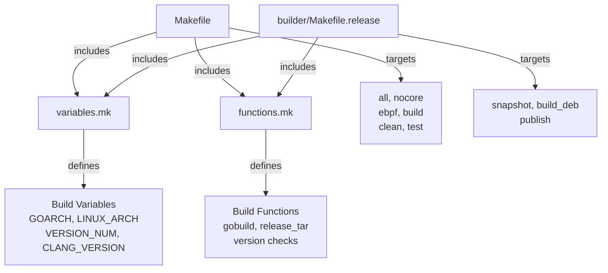
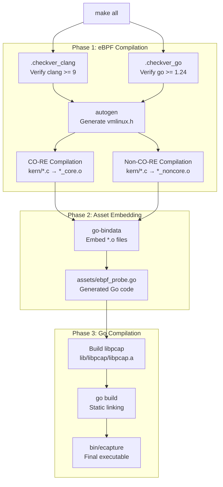
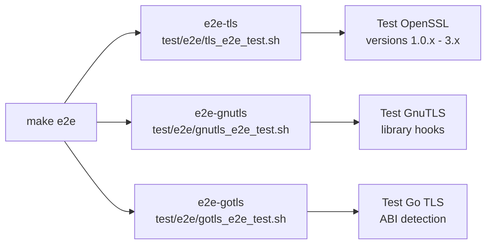
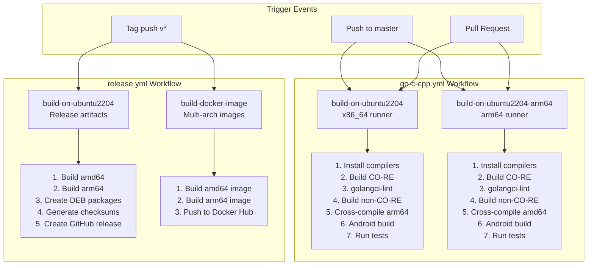
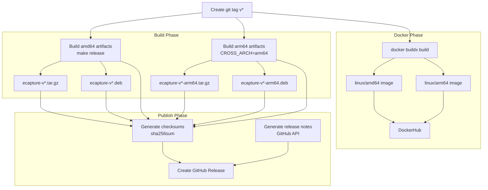

# Development Guide

<details>
<summary>Relevant source files</summary>

The following files were used as context for generating this wiki page:

- [.github/workflows/codeql-analysis.yml](https://github.com/gojue/ecapture/blob/ca085d05/.github/workflows/codeql-analysis.yml)
- [.github/workflows/go-c-cpp.yml](https://github.com/gojue/ecapture/blob/ca085d05/.github/workflows/go-c-cpp.yml)
- [.github/workflows/release.yml](https://github.com/gojue/ecapture/blob/ca085d05/.github/workflows/release.yml)
- [Makefile](https://github.com/gojue/ecapture/blob/ca085d05/Makefile)
- [builder/Dockerfile](https://github.com/gojue/ecapture/blob/ca085d05/builder/Dockerfile)
- [builder/Makefile.release](https://github.com/gojue/ecapture/blob/ca085d05/builder/Makefile.release)
- [builder/init_env.sh](https://github.com/gojue/ecapture/blob/ca085d05/builder/init_env.sh)
- [functions.mk](https://github.com/gojue/ecapture/blob/ca085d05/functions.mk)

</details>


This document provides comprehensive guidance for developers contributing to eCapture. It covers the build system, development workflow, testing procedures, and release process. For information about implementing new capture modules, see [Adding New Modules](5.3-adding-new-modules.md). For eBPF program development details, see [eBPF Program Development](5.2-ebpf-program-development.md).

---

## Development Environment Setup

### Prerequisites

eCapture requires the following tools and libraries for development:

| Component | Minimum Version | Purpose |
|-----------|----------------|---------|
| Go | 1.24 | User-space program compilation |
| Clang | 9+ (14 recommended) | eBPF program compilation |
| LLVM | 9+ (14 recommended) | eBPF bytecode generation |
| Linux Kernel | 4.18+ | eBPF support |
| libelf-dev | - | ELF file parsing |
| Linux headers | - | Kernel structure definitions |

### Environment Initialization Script

The project provides an automated environment setup script at [builder/init_env.sh:1-106](https://github.com/gojue/ecapture/blob/ca085d05/builder/init_env.sh#L1-L106). This script:

1. Detects the Ubuntu version and selects appropriate Clang version ([builder/init_env.sh:16-39](https://github.com/gojue/ecapture/blob/ca085d05/builder/init_env.sh#L16-L39))
2. Installs required packages via apt-get ([builder/init_env.sh:72-74](https://github.com/gojue/ecapture/blob/ca085d05/builder/init_env.sh#L72-L74))
3. Configures cross-compilation toolchain ([builder/init_env.sh:43-61](https://github.com/gojue/ecapture/blob/ca085d05/builder/init_env.sh#L43-L61))
4. Prepares Linux kernel sources for eBPF compilation ([builder/init_env.sh:81-89](https://github.com/gojue/ecapture/blob/ca085d05/builder/init_env.sh#L81-L89))
5. Downloads and installs Go ([builder/init_env.sh:94-97](https://github.com/gojue/ecapture/blob/ca085d05/builder/init_env.sh#L94-L97))

**Architecture Detection:**
The script automatically detects the host architecture and configures cross-compilation:
- On x86_64: Sets up aarch64 cross-compilation ([builder/init_env.sh:48-52](https://github.com/gojue/ecapture/blob/ca085d05/builder/init_env.sh#L48-L52))
- On aarch64: Sets up x86_64 cross-compilation ([builder/init_env.sh:53-58](https://github.com/gojue/ecapture/blob/ca085d05/builder/init_env.sh#L53-L58))

**Manual Execution:**
```bash
/bin/bash -c "$(curl -fsSL https://raw.githubusercontent.com/gojue/ecapture/master/builder/init_env.sh)"
```

Sources: [builder/init_env.sh:1-106](https://github.com/gojue/ecapture/blob/ca085d05/builder/init_env.sh#L1-L106)

---

## Build System Architecture

### Makefile Structure

The build system consists of three primary files:


```mermaid
graph TB
    Main[Makefile]
    Vars[variables.mk]
    Funcs[functions.mk]
    Release[builder/Makefile.release]
    
    Main -->|includes| Vars
    Main -->|includes| Funcs
    Release -->|includes| Vars
    Release -->|includes| Funcs
    
    Vars -->|defines| BuildVars["Build Variables<br/>GOARCH, LINUX_ARCH<br/>VERSION_NUM, CLANG_VERSION"]
    Funcs -->|defines| BuildFuncs["Build Functions<br/>gobuild, release_tar<br/>version checks"]
    
    Main -->|targets| CoreTargets["all, nocore<br/>ebpf, build<br/>clean, test"]
    Release -->|targets| RelTargets["snapshot, build_deb<br/>publish"]
```

**Build System Components:**
- `Makefile`: Main build orchestration ([Makefile:1-245](https://github.com/gojue/ecapture/blob/ca085d05/Makefile#L1-L245))
- `variables.mk`: Environment detection and variable definitions
- `functions.mk`: Reusable build functions ([functions.mk:1-76](https://github.com/gojue/ecapture/blob/ca085d05/functions.mk#L1-L76))
- `builder/Makefile.release`: Release packaging and distribution ([builder/Makefile.release:1-151](https://github.com/gojue/ecapture/blob/ca085d05/builder/Makefile.release#L1-L151))

Sources: [Makefile:1-11](https://github.com/gojue/ecapture/blob/ca085d05/Makefile#L1-L11), [functions.mk:1-76](https://github.com/gojue/ecapture/blob/ca085d05/functions.mk#L1-L76), [builder/Makefile.release:1-10](https://github.com/gojue/ecapture/blob/ca085d05/builder/Makefile.release#L1-L10)

### Build Targets Overview

| Target | Purpose | Bytecode Included |
|--------|---------|-------------------|
| `all` | Full build with CO-RE and non-CO-RE | Both |
| `nocore` | Build with non-CO-RE only | Non-CO-RE only |
| `ebpf` | Compile CO-RE eBPF bytecode | CO-RE |
| `ebpf_noncore` | Compile non-CO-RE eBPF bytecode | Non-CO-RE |
| `assets` | Generate Go embedded bytecode | Both |
| `build` | Compile Go binary | - |
| `clean` | Remove build artifacts | - |
| `test-race` | Run unit tests with race detector | - |
| `e2e` | Run end-to-end tests | - |

Sources: [Makefile:4-14](https://github.com/gojue/ecapture/blob/ca085d05/Makefile#L4-L14), [Makefile:106-245](https://github.com/gojue/ecapture/blob/ca085d05/Makefile#L106-L245)

---

## Build Process Flow

### Complete Build Pipeline


```mermaid
graph TB
    Start[make all]
    
    subgraph "Phase 1: eBPF Compilation"
        AutoGen[autogen<br/>Generate vmlinux.h]
        CheckClang[.checkver_clang<br/>Verify clang >= 9]
        CheckGo[.checkver_go<br/>Verify go >= 1.24]
        
        CoreCompile[CO-RE Compilation<br/>kern/*.c → *_core.o]
        NonCoreCompile[Non-CO-RE Compilation<br/>kern/*.c → *_noncore.o]
    end
    
    subgraph "Phase 2: Asset Embedding"
        Bindata[go-bindata<br/>Embed *.o files]
        AssetsGo[assets/ebpf_probe.go<br/>Generated Go code]
    end
    
    subgraph "Phase 3: Go Compilation"
        LibPcap[Build libpcap<br/>lib/libpcap/libpcap.a]
        GoBuild[go build<br/>Static linking]
        Binary[bin/ecapture<br/>Final executable]
    end
    
    Start --> CheckClang
    Start --> CheckGo
    CheckClang --> AutoGen
    CheckGo --> AutoGen
    
    AutoGen --> CoreCompile
    AutoGen --> NonCoreCompile
    
    CoreCompile --> Bindata
    NonCoreCompile --> Bindata
    
    Bindata --> AssetsGo
    
    AssetsGo --> LibPcap
    LibPcap --> GoBuild
    GoBuild --> Binary
```

Sources: [Makefile:6-11](https://github.com/gojue/ecapture/blob/ca085d05/Makefile#L6-L11), [Makefile:133-201](https://github.com/gojue/ecapture/blob/ca085d05/Makefile#L133-L201)

### CO-RE vs Non-CO-RE Compilation

**CO-RE (Compile Once, Run Everywhere):**
```bash
clang -D__TARGET_ARCH_x86 \
  -target bpfel \
  -c kern/openssl.c \
  -o user/bytecode/openssl_kern_core.o \
  -g -fno-ident
```

- Produces kernel-agnostic bytecode ([Makefile:122-127](https://github.com/gojue/ecapture/blob/ca085d05/Makefile#L122-L127))
- Requires kernel with BTF (BPF Type Format) support
- Uses `vmlinux.h` generated by `bpftool btf dump` ([Makefile:130-131](https://github.com/gojue/ecapture/blob/ca085d05/Makefile#L130-L131))
- Smaller file size, portable across kernel versions

**Non-CO-RE (Kernel-Specific):**
```bash
clang -I /usr/src/linux-source/arch/x86/include \
  -c kern/openssl.c -o - | \
llc -march=bpf -filetype=obj \
  -o user/bytecode/openssl_kern_noncore.o
```

- Requires kernel headers for target kernel ([Makefile:144-159](https://github.com/gojue/ecapture/blob/ca085d05/Makefile#L144-L159))
- Works on older kernels without BTF support
- Kernel-specific, must rebuild for different kernel versions
- Larger file size due to kernel structure definitions

**Build Variables:**
- `KERN_SRC_PATH`: Kernel source path ([Makefile:147-154](https://github.com/gojue/ecapture/blob/ca085d05/Makefile#L147-L154))
- `KERN_BUILD_PATH`: Kernel build path ([Makefile:148-152](https://github.com/gojue/ecapture/blob/ca085d05/Makefile#L148-L152))
- `LINUX_ARCH`: Target architecture (x86, arm64) ([Makefile:122](https://github.com/gojue/ecapture/blob/ca085d05/Makefile#L122))

Sources: [Makefile:117-159](https://github.com/gojue/ecapture/blob/ca085d05/Makefile#L117-L159)

### Asset Embedding Process

The build system uses `go-bindata` to embed all eBPF bytecode files into the Go binary:

1. **Compile eBPF Programs**: Produces `*.o` files in `user/bytecode/`
2. **Generate Go Code**: `go-bindata` reads all `.o` files ([Makefile:164](https://github.com/gojue/ecapture/blob/ca085d05/Makefile#L164))
3. **Create Asset Package**: Generates `assets/ebpf_probe.go` ([Makefile:164](https://github.com/gojue/ecapture/blob/ca085d05/Makefile#L164))
4. **Embed in Binary**: Go build includes embedded assets

This approach eliminates the need to distribute separate bytecode files alongside the binary.

Sources: [Makefile:162-171](https://github.com/gojue/ecapture/blob/ca085d05/Makefile#L162-L171)

---

## Building eCapture

### Standard Build (Native Architecture)

**Full build with both CO-RE and non-CO-RE:**
```bash
make clean
make env          # Display build environment
make all          # Build everything
```

**Non-CO-RE only (for older kernels):**
```bash
make clean
make nocore
```

The `nocore` target is useful when:
- Target system lacks BTF support
- Deploying to specific kernel version
- Reducing binary size by excluding CO-RE bytecode

Sources: [Makefile:4-14](https://github.com/gojue/ecapture/blob/ca085d05/Makefile#L4-L14)

### Cross-Compilation

**Build for ARM64 on x86_64:**
```bash
make clean
CROSS_ARCH=arm64 make env
CROSS_ARCH=arm64 make all
```

**Build for x86_64 on ARM64:**
```bash
make clean
CROSS_ARCH=amd64 make env
CROSS_ARCH=amd64 make all
```

**Cross-Compilation Requirements:**
- Cross-compilation toolchain installed ([.github/workflows/go-c-cpp.yml:19](https://github.com/gojue/ecapture/blob/ca085d05/.github/workflows/go-c-cpp.yml#L19))
  - For ARM64: `gcc-aarch64-linux-gnu`
  - For x86_64: `gcc-x86-64-linux-gnu`
- Prepared kernel headers for target architecture ([.github/workflows/go-c-cpp.yml:31](https://github.com/gojue/ecapture/blob/ca085d05/.github/workflows/go-c-cpp.yml#L31))

**libpcap Cross-Compilation:**
The build system automatically configures libpcap for cross-compilation:
```bash
CC=aarch64-linux-gnu-gcc AR=aarch64-linux-gnu-ar \
  ./configure --host=aarch64-linux-gnu
```

Sources: [Makefile:56-65](https://github.com/gojue/ecapture/blob/ca085d05/Makefile#L56-L65), [Makefile:176-184](https://github.com/gojue/ecapture/blob/ca085d05/Makefile#L176-L184), [.github/workflows/go-c-cpp.yml:56-65](https://github.com/gojue/ecapture/blob/ca085d05/.github/workflows/go-c-cpp.yml#L56-L65)

### Android Builds

**Build for Android (ARM64):**
```bash
make clean
CROSS_ARCH=arm64 make env
ANDROID=1 CROSS_ARCH=arm64 make nocore
```

**Android-Specific Considerations:**
- Android builds use non-CO-RE only ([.github/workflows/go-c-cpp.yml:61-65](https://github.com/gojue/ecapture/blob/ca085d05/.github/workflows/go-c-cpp.yml#L61-L65))
- Special handling for BoringSSL versions (Android 12-16)
- Network byte order adjustments for ARM architecture

Sources: [Makefile:95](https://github.com/gojue/ecapture/blob/ca085d05/Makefile#L95), [.github/workflows/go-c-cpp.yml:61-65](https://github.com/gojue/ecapture/blob/ca085d05/.github/workflows/go-c-cpp.yml#L61-L65)

### Build Environment Variables

| Variable | Description | Example |
|----------|-------------|---------|
| `CROSS_ARCH` | Target architecture | `arm64`, `amd64` |
| `ANDROID` | Android build flag | `1` (enable) |
| `DEBUG` | Debug build flag | `1` (enable debug symbols) |
| `SNAPSHOT_VERSION` | Override version string | `v0.8.0` |

**Environment Display:**
```bash
make env
```

This command displays all build variables including:
- Host architecture detection
- Kernel version
- Compiler versions
- Target architecture settings
- Version information

Sources: [Makefile:19-63](https://github.com/gojue/ecapture/blob/ca085d05/Makefile#L19-L63)

---

## Testing

### Unit Tests

**Run unit tests:**
```bash
go test -v ./...
```

**Run with race detector:**
```bash
make test-race
```

The race detector build ([Makefile:216-224](https://github.com/gojue/ecapture/blob/ca085d05/Makefile#L216-L224)):
- Enables `CGO_ENABLED=1` for C integration
- Links with libpcap statically
- Uses race detector to identify data races

Sources: [Makefile:216-224](https://github.com/gojue/ecapture/blob/ca085d05/Makefile#L216-L224)

### End-to-End Tests

The project includes E2E test scripts for each major module:


```mermaid
graph LR
    E2E[make e2e]
    
    TLS[e2e-tls<br/>test/e2e/tls_e2e_test.sh]
    GnuTLS[e2e-gnutls<br/>test/e2e/gnutls_e2e_test.sh]
    GoTLS[e2e-gotls<br/>test/e2e/gotls_e2e_test.sh]
    
    E2E --> TLS
    E2E --> GnuTLS
    E2E --> GoTLS
    
    TLS --> TestOpenSSL["Test OpenSSL<br/>versions 1.0.x - 3.x"]
    GnuTLS --> TestGnuTLS["Test GnuTLS<br/>library hooks"]
    GoTLS --> TestGo["Test Go TLS<br/>ABI detection"]
```

**Run specific E2E test:**
```bash
make e2e-tls       # Test TLS/SSL capture
make e2e-gnutls    # Test GnuTLS capture
make e2e-gotls     # Test Go TLS capture
```

**Run all E2E tests:**
```bash
make e2e
```

Sources: [Makefile:226-244](https://github.com/gojue/ecapture/blob/ca085d05/Makefile#L226-L244)

---

## CI/CD Pipeline

### GitHub Actions Workflow Architecture


```mermaid
graph TB
    subgraph "Trigger Events"
        Push[Push to master]
        PR[Pull Request]
        Tag[Tag push v*]
    end
    
    subgraph "go-c-cpp.yml Workflow"
        Job1[build-on-ubuntu2204<br/>x86_64 runner]
        Job2[build-on-ubuntu2204-arm64<br/>arm64 runner]
        
        Job1Steps["1. Install compilers<br/>2. Build CO-RE<br/>3. golangci-lint<br/>4. Build non-CO-RE<br/>5. Cross-compile arm64<br/>6. Android build<br/>7. Run tests"]
        
        Job2Steps["1. Install compilers<br/>2. Build CO-RE<br/>3. golangci-lint<br/>4. Build non-CO-RE<br/>5. Cross-compile amd64<br/>6. Android build<br/>7. Run tests"]
        
        Job1 --> Job1Steps
        Job2 --> Job2Steps
    end
    
    subgraph "release.yml Workflow"
        ReleaseJob1[build-on-ubuntu2204<br/>Release artifacts]
        ReleaseJob2[build-docker-image<br/>Multi-arch images]
        
        ReleaseSteps["1. Build amd64<br/>2. Build arm64<br/>3. Create DEB packages<br/>4. Generate checksums<br/>5. Create GitHub release"]
        
        DockerSteps["1. Build amd64 image<br/>2. Build arm64 image<br/>3. Push to Docker Hub"]
        
        ReleaseJob1 --> ReleaseSteps
        ReleaseJob2 --> DockerSteps
    end
    
    Push --> Job1
    Push --> Job2
    PR --> Job1
    PR --> Job2
    Tag --> ReleaseJob1
    Tag --> ReleaseJob2
```

Sources: [.github/workflows/go-c-cpp.yml:1-128](https://github.com/gojue/ecapture/blob/ca085d05/.github/workflows/go-c-cpp.yml#L1-L128), [.github/workflows/release.yml:1-129](https://github.com/gojue/ecapture/blob/ca085d05/.github/workflows/release.yml#L1-L129)

### CI Build Matrix

The CI system builds and tests multiple configurations:

| Architecture | Native Build | Cross-Compilation | Android |
|--------------|--------------|-------------------|---------|
| x86_64 | ✓ CO-RE + non-CO-RE | ✓ arm64 target | ✓ arm64 |
| arm64 | ✓ CO-RE + non-CO-RE | ✓ amd64 target | ✓ amd64 |

**CI Build Steps:**

1. **Setup Environment** ([.github/workflows/go-c-cpp.yml:16-33](https://github.com/gojue/ecapture/blob/ca085d05/.github/workflows/go-c-cpp.yml#L16-L33)):
   - Install Go 1.24.6
   - Install Clang 14, LLVM tools
   - Extract and prepare Linux kernel sources

2. **Native CO-RE Build** ([.github/workflows/go-c-cpp.yml:38-44](https://github.com/gojue/ecapture/blob/ca085d05/.github/workflows/go-c-cpp.yml#L38-L44)):
   ```bash
   make clean
   make env
   DEBUG=1 make -j8
   ```

3. **Code Quality Check** ([.github/workflows/go-c-cpp.yml:45-50](https://github.com/gojue/ecapture/blob/ca085d05/.github/workflows/go-c-cpp.yml#L45-L50)):
   - Run `golangci-lint` on Go code
   - Version: v2.1

4. **Non-CO-RE Build** ([.github/workflows/go-c-cpp.yml:51-55](https://github.com/gojue/ecapture/blob/ca085d05/.github/workflows/go-c-cpp.yml#L51-L55)):
   ```bash
   make clean
   make nocore
   ```

5. **Cross-Compilation** ([.github/workflows/go-c-cpp.yml:56-65](https://github.com/gojue/ecapture/blob/ca085d05/.github/workflows/go-c-cpp.yml#L56-L65)):
   ```bash
   CROSS_ARCH=arm64 make env
   CROSS_ARCH=arm64 make -j8
   ANDROID=1 CROSS_ARCH=arm64 make nocore -j8
   ```

6. **Test Execution** ([.github/workflows/go-c-cpp.yml:66-67](https://github.com/gojue/ecapture/blob/ca085d05/.github/workflows/go-c-cpp.yml#L66-L67)):
   ```bash
   go test -v -race ./...
   ```

Sources: [.github/workflows/go-c-cpp.yml:9-127](https://github.com/gojue/ecapture/blob/ca085d05/.github/workflows/go-c-cpp.yml#L9-L127)

### Compiler Version Management

The CI system ensures consistent compiler versions:

**Clang/LLVM Setup:**
```bash
for tool in "clang" "llc" "llvm-strip"
do
  sudo rm -f /usr/bin/$tool
  sudo ln -s /usr/bin/$tool-14 /usr/bin/$tool
done
```

This creates symlinks to enforce Clang 14 usage ([.github/workflows/go-c-cpp.yml:20-24](https://github.com/gojue/ecapture/blob/ca085d05/.github/workflows/go-c-cpp.yml#L20-L24)).

**Kernel Source Preparation:**
```bash
cd /usr/src
source_file=$(find . -maxdepth 1 -name "*linux-source*.tar.bz2")
sudo tar -xf $source_file
cd $source_dir
sudo make ARCH=arm64 CROSS_COMPILE=aarch64-linux-gnu- prepare V=0
```

Prepares kernel headers for cross-compilation ([.github/workflows/go-c-cpp.yml:25-32](https://github.com/gojue/ecapture/blob/ca085d05/.github/workflows/go-c-cpp.yml#L25-L32)).

Sources: [.github/workflows/go-c-cpp.yml:16-33](https://github.com/gojue/ecapture/blob/ca085d05/.github/workflows/go-c-cpp.yml#L16-L33)

---

## Release Process

### Release Workflow


```mermaid
graph TB
    Start[Create git tag v*]
    
    subgraph "Build Phase"
        Build1[Build amd64 artifacts<br/>make release]
        Build2[Build arm64 artifacts<br/>CROSS_ARCH=arm64]
        
        Build1 --> Archive1[ecapture-v*.tar.gz]
        Build1 --> DEB1[ecapture-v*.deb]
        
        Build2 --> Archive2[ecapture-v*-arm64.tar.gz]
        Build2 --> DEB2[ecapture-v*-arm64.deb]
    end
    
    subgraph "Docker Phase"
        Docker[docker buildx build]
        Docker --> ImageAMD64[linux/amd64 image]
        Docker --> ImageARM64[linux/arm64 image]
        
        ImageAMD64 --> DockerHub
        ImageARM64 --> DockerHub
    end
    
    subgraph "Publish Phase"
        GenChecksum[Generate checksums<br/>sha256sum]
        GenNotes[Generate release notes<br/>GitHub API]
        
        Archive1 --> GenChecksum
        Archive2 --> GenChecksum
        DEB1 --> GenChecksum
        DEB2 --> GenChecksum
        
        GenChecksum --> Release[Create GitHub Release]
        GenNotes --> Release
    end
    
    Start --> Build1
    Start --> Build2
    Start --> Docker
    
    Build1 --> GenChecksum
    Build2 --> GenChecksum
```

Sources: [.github/workflows/release.yml:1-129](https://github.com/gojue/ecapture/blob/ca085d05/.github/workflows/release.yml#L1-L129), [builder/Makefile.release:1-151](https://github.com/gojue/ecapture/blob/ca085d05/builder/Makefile.release#L1-L151)

### Release Targets

**Create snapshot (development build):**
```bash
make -f builder/Makefile.release snapshot
```

**Create release (specific version):**
```bash
SNAPSHOT_VERSION=v0.8.0 make -f builder/Makefile.release release
```

**Publish to GitHub:**
```bash
SNAPSHOT_VERSION=v0.8.0 make -f builder/Makefile.release publish
```

The `release` target orchestrates ([builder/Makefile.release:10](https://github.com/gojue/ecapture/blob/ca085d05/builder/Makefile.release#L10)):
1. `snapshot`: Build Linux artifacts
2. `build_deb`: Create DEB packages
3. `snapshot_android`: Build Android artifacts

Sources: [builder/Makefile.release:10-151](https://github.com/gojue/ecapture/blob/ca085d05/builder/Makefile.release#L10-L151)

### Packaging Formats

#### TAR.GZ Archives

**Archive Contents:**
- `ecapture` binary
- `LICENSE`
- `CHANGELOG.md`
- `README.md` and `README_CN.md`

**Naming Convention:**
```
ecapture-{VERSION}-{OS}-{ARCH}[-nocore].tar.gz
```

Examples:
- `ecapture-v0.8.0-linux-amd64.tar.gz` (CO-RE + non-CO-RE)
- `ecapture-v0.8.0-android-arm64-nocore.tar.gz` (non-CO-RE only)

**Archive Creation** ([builder/Makefile.release:62-76](https://github.com/gojue/ecapture/blob/ca085d05/builder/Makefile.release#L62-L76)):
```bash
$(CMD_MKDIR) -p $(TAR_DIR)
$(CMD_CP) LICENSE $(TAR_DIR)/LICENSE
$(CMD_CP) bin/ecapture $(TAR_DIR)/ecapture
$(CMD_TAR) -czf $(OUT_ARCHIVE) $(TAR_DIR)
```

Sources: [builder/Makefile.release:62-76](https://github.com/gojue/ecapture/blob/ca085d05/builder/Makefile.release#L62-L76), [functions.mk:62-76](https://github.com/gojue/ecapture/blob/ca085d05/functions.mk#L62-L76)

#### DEB Packages

**Package Structure:**
```
ecapture-v0.8.0-amd64.deb
├── DEBIAN/
│   └── control
└── usr/
    └── local/
        └── bin/
            └── ecapture
```

**Control File Fields** ([builder/Makefile.release:143-149](https://github.com/gojue/ecapture/blob/ca085d05/builder/Makefile.release#L143-L149)):
- Package: ecapture
- Version: Extracted from git tag
- Architecture: amd64 or arm64
- Maintainer: CFC4N <cfc4ncs@gmail.com>
- Description: capture SSL/TLS text content without CA cert by eBPF

**Build Process:**
```bash
make -f builder/Makefile.release deb
```

Creates DEB package using `dpkg-deb --build` ([builder/Makefile.release:151](https://github.com/gojue/ecapture/blob/ca085d05/builder/Makefile.release#L151)).

Sources: [builder/Makefile.release:132-151](https://github.com/gojue/ecapture/blob/ca085d05/builder/Makefile.release#L132-L151)

#### Docker Images

**Multi-Architecture Build:**
```bash
docker buildx build \
  --platform linux/amd64,linux/arm64 \
  --build-arg VERSION=v0.8.0 \
  -t ecapture:v0.8.0 \
  -t ecapture:latest \
  --push .
```

**Dockerfile Stages** ([builder/Dockerfile:1-39](https://github.com/gojue/ecapture/blob/ca085d05/builder/Dockerfile#L1-L39)):

1. **Builder Stage**: Ubuntu 22.04 base
   - Install compilers (Clang 14, Go 1.24.6)
   - Build eCapture with `make all`
   
2. **Runtime Stage**: Alpine Linux
   - Copy only the `ecapture` binary
   - Set ENTRYPOINT to `/ecapture`

**Image Tags:**
- `{username}/ecapture:v{VERSION}` (version-specific)
- `{username}/ecapture:latest` (latest release)

Sources: [.github/workflows/release.yml:101-129](https://github.com/gojue/ecapture/blob/ca085d05/.github/workflows/release.yml#L101-L129), [builder/Dockerfile:1-39](https://github.com/gojue/ecapture/blob/ca085d05/builder/Dockerfile#L1-L39)

### Release Notes Generation

The release workflow automatically generates release notes:

1. **Get Previous Tag** ([.github/workflows/release.yml:63-67](https://github.com/gojue/ecapture/blob/ca085d05/.github/workflows/release.yml#L63-L67)):
   ```bash
   PREVIOUS=$(git describe --tags --abbrev=0 HEAD^ 2>/dev/null || echo "")
   ```

2. **Generate Notes via GitHub API** ([.github/workflows/release.yml:68-80](https://github.com/gojue/ecapture/blob/ca085d05/.github/workflows/release.yml#L68-L80)):
   ```bash
   gh api --method POST \
     /repos/$REPO/releases/generate-notes \
     -f tag_name=$TAG \
     -f previous_tag_name=$PREVIOUS_TAG
   ```

3. **Create Release** ([builder/Makefile.release:124](https://github.com/gojue/ecapture/blob/ca085d05/builder/Makefile.release#L124)):
   ```bash
   gh release create $(VERSION) $$FILES \
     --title "eCapture $(VERSION)" \
     --notes-file $(RELEASE_NOTES)
   ```

Sources: [.github/workflows/release.yml:63-87](https://github.com/gojue/ecapture/blob/ca085d05/.github/workflows/release.yml#L63-L87), [builder/Makefile.release:114-124](https://github.com/gojue/ecapture/blob/ca085d05/builder/Makefile.release#L114-L124)

---

## Development Workflow Summary

### Typical Development Cycle

1. **Setup Environment:**
   ```bash
   /bin/bash -c "$(curl -fsSL https://raw.githubusercontent.com/gojue/ecapture/master/builder/init_env.sh)"
   ```

2. **Clone and Build:**
   ```bash
   git clone https://github.com/gojue/ecapture.git
   cd ecapture
   make env          # Verify environment
   make all          # Build everything
   ```

3. **Make Changes:**
   - Modify eBPF programs in `kern/`
   - Modify Go code in `cli/`, `user/`, or other packages

4. **Test:**
   ```bash
   make clean
   make all
   go test -v ./...
   make e2e          # If testing modules
   ```

5. **Format Code:**
   ```bash
   make format       # Format C code with clang-format
   ```

6. **Commit and Push:**
   ```bash
   git add .
   git commit -m "Your change description"
   git push origin your-branch
   ```

7. **Create Pull Request:**
   - CI automatically runs on x86_64 and arm64
   - Both native and cross-compilation builds tested
   - Code quality checked with golangci-lint

### Key Build Commands Reference

| Command | Purpose | Use Case |
|---------|---------|----------|
| `make env` | Show build environment | Verify configuration |
| `make all` | Full build (CO-RE + non-CO-RE) | Development |
| `make nocore` | Non-CO-RE only build | Older kernels |
| `make clean` | Remove build artifacts | Clean rebuild |
| `make test-race` | Run tests with race detector | Find concurrency issues |
| `make e2e` | Run E2E tests | Integration testing |
| `make format` | Format C code | Code style |
| `CROSS_ARCH=arm64 make` | Cross-compile for ARM64 | ARM target |
| `ANDROID=1 make nocore` | Build for Android | Mobile deployment |

Sources: [Makefile:1-245](https://github.com/gojue/ecapture/blob/ca085d05/Makefile#L1-L245), [builder/Makefile.release:1-151](https://github.com/gojue/ecapture/blob/ca085d05/builder/Makefile.release#L1-L151)