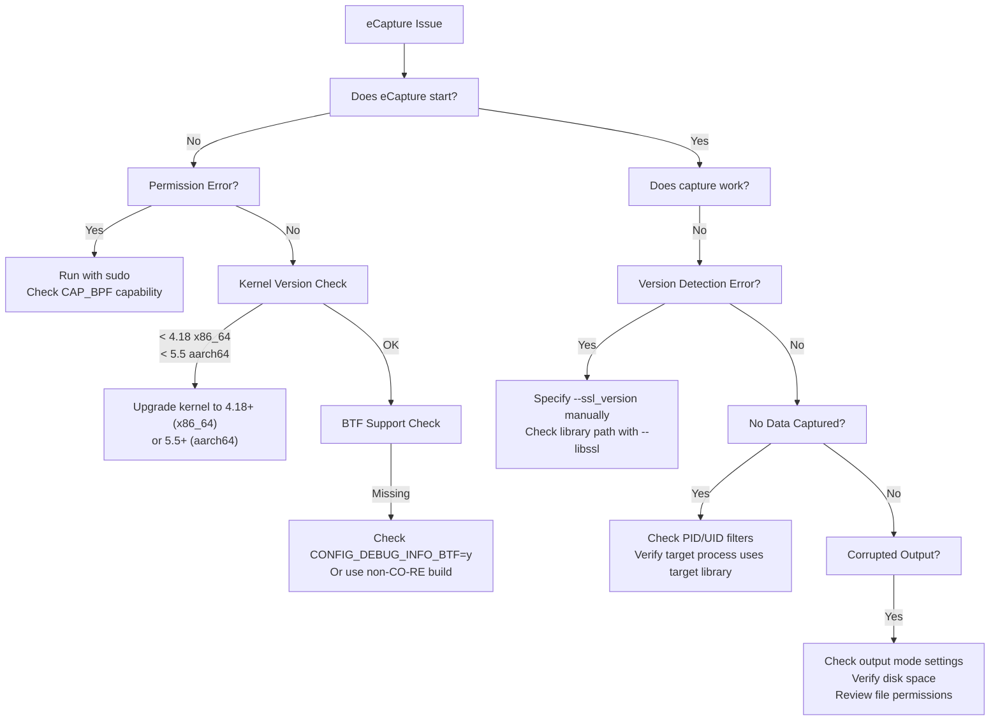
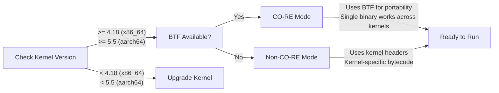
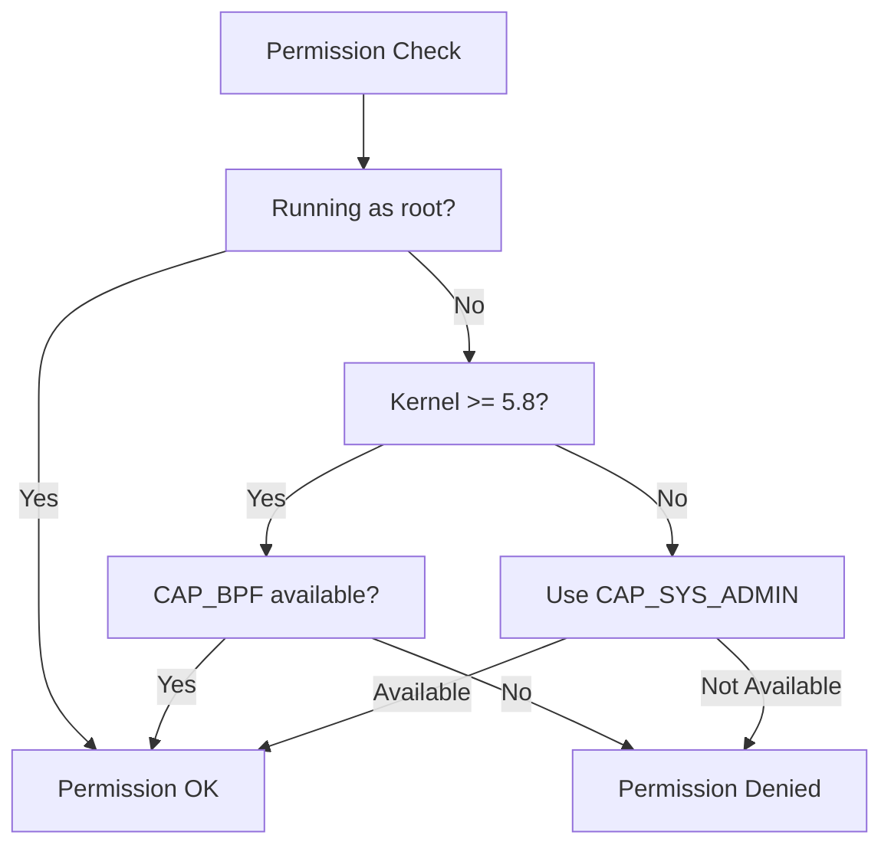
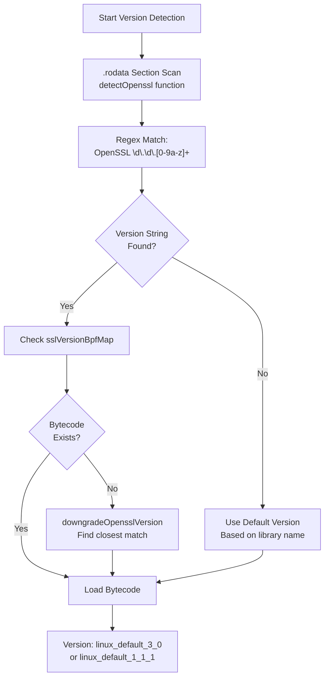
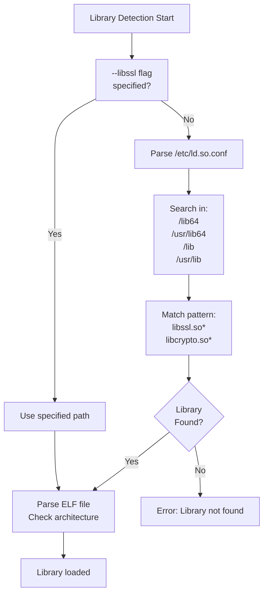
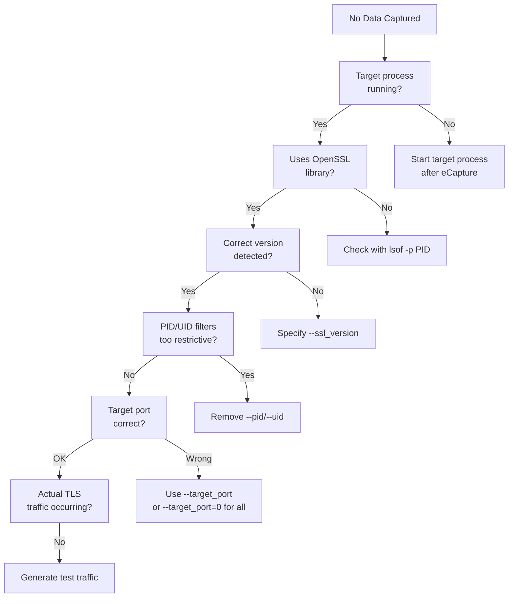
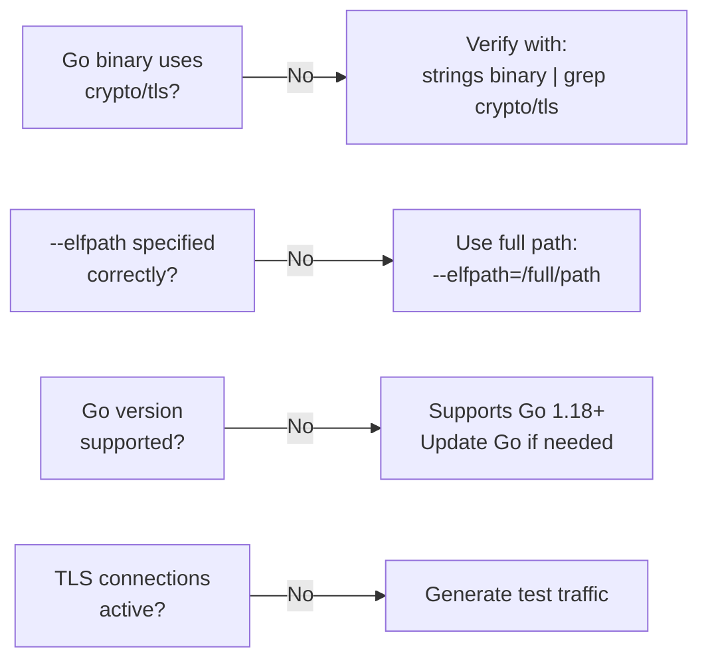

# Troubleshooting and FAQ

<details>
<summary>Relevant source files</summary>

The following files were used as context for generating this wiki page:

- [CHANGELOG.md](https://github.com/gojue/ecapture/blob/0766a93b/CHANGELOG.md)
- [README.md](https://github.com/gojue/ecapture/blob/0766a93b/README.md)
- [README_CN.md](https://github.com/gojue/ecapture/blob/0766a93b/README_CN.md)
- [images/ecapture-help-v0.8.9.svg](https://github.com/gojue/ecapture/blob/0766a93b/images/ecapture-help-v0.8.9.svg)
- [main.go](https://github.com/gojue/ecapture/blob/0766a93b/main.go)
- [user/module/probe_openssl_lib.go](https://github.com/gojue/ecapture/blob/0766a93b/user/module/probe_openssl_lib.go)
- [variables.mk](https://github.com/gojue/ecapture/blob/0766a93b/variables.mk)

</details>


This page provides solutions to common problems encountered when using eCapture, along with debugging techniques and frequently asked questions. For information about system requirements and installation, see [Dependencies and System Requirements](../1-overview/1.3-dependencies-and-system-requirements.md). For build issues, refer to [Build System](../5-development-guide/5.1-build-system.md).

---

## Common Issues Decision Tree

The following diagram shows the decision tree for diagnosing common eCapture issues:



Sources: [README.md:13-17](https://github.com/gojue/ecapture/blob/0766a93b/README.md#L13-L17), [CHANGELOG.md:41-50](https://github.com/gojue/ecapture/blob/0766a93b/CHANGELOG.md#L41-L50), [user/module/probe_openssl_lib.go:64-70](https://github.com/gojue/ecapture/blob/0766a93b/user/module/probe_openssl_lib.go#L64-L70)

---

## Kernel and System Requirements Issues

### Issue: "kernel version is too low" or eCapture fails to start

**Symptoms:**
- Error message about kernel version
- Program exits immediately
- eBPF program load failures

**Required Kernel Versions:**

| Architecture | Minimum Kernel Version | CO-RE Support |
|--------------|----------------------|---------------|
| x86_64       | 4.18                | Yes           |
| aarch64      | 5.5                 | Yes           |

**Solutions:**

1. Check your kernel version:
```bash
uname -r
```

2. Verify BTF support (required for CO-RE mode):
```bash
cat /boot/config-$(uname -r) | grep CONFIG_DEBUG_INFO_BTF
# Should return: CONFIG_DEBUG_INFO_BTF=y
```

3. If BTF is not available:
   - Check if BTF data exists: `ls -l /sys/kernel/btf/vmlinux`
   - eCapture automatically falls back to non-CO-RE mode if BTF is unavailable

**Troubleshooting Diagram:**



Sources: [README.md:13-17](https://github.com/gojue/ecapture/blob/0766a93b/README.md#L13-L17), [variables.mk:153-167](https://github.com/gojue/ecapture/blob/0766a93b/variables.mk#L153-L167), [CHANGELOG.md:41](https://github.com/gojue/ecapture/blob/0766a93b/CHANGELOG.md#L41)

---

## Permission Issues

### Issue: "Operation not permitted" or "Permission denied"

**Symptoms:**
- Error when loading eBPF programs
- "failed to load BPF program" messages
- CAP_BPF related errors

**Required Permissions:**

eCapture requires **ROOT privileges** or specific capabilities:

1. **CAP_BPF** - Load eBPF programs (Linux 5.8+)
2. **CAP_PERFMON** - Access performance monitoring
3. **CAP_NET_ADMIN** - Attach TC programs
4. **CAP_SYS_ADMIN** - Legacy capability for older kernels

**Solutions:**

1. Run with sudo:
```bash
sudo ecapture tls
```

2. Check capabilities (Linux 5.8+):
```bash
# eCapture automatically detects CAP_BPF
# If detection fails, you'll see a warning
```

3. For Docker containers:
```bash
docker run --rm --privileged=true --net=host gojue/ecapture tls
```

**Capability Check Flow:**



Sources: [CHANGELOG.md:322-323](https://github.com/gojue/ecapture/blob/0766a93b/CHANGELOG.md#L322-L323), [CHANGELOG.md:343](https://github.com/gojue/ecapture/blob/0766a93b/CHANGELOG.md#L343), [CHANGELOG.md:370](https://github.com/gojue/ecapture/blob/0766a93b/CHANGELOG.md#L370)

---

## Version Detection Issues

### Issue: "OpenSSL/BoringSSL version not found" or "used default version"

**Symptoms:**
- Warning: "OpenSSL/BoringSSL version not found from shared library file"
- Warning: "used default version"
- No data captured or incorrect data

**Version Detection Process:**



**Solutions:**

1. **Manually specify OpenSSL version:**
```bash
# For OpenSSL 3.0.x
sudo ecapture tls --ssl_version="openssl 3.0.0"

# For OpenSSL 1.1.1
sudo ecapture tls --ssl_version="openssl 1.1.1"

# For Android BoringSSL
sudo ecapture tls --ssl_version="boringssl_a_14"
```

2. **Specify library path explicitly:**
```bash
# If library is in non-standard location
sudo ecapture tls --libssl=/usr/local/lib/libssl.so.3

# For statically linked binaries
sudo ecapture tls --libssl=/path/to/static/binary
```

3. **Supported OpenSSL/BoringSSL Versions:**

| Library Type | Supported Versions |
|--------------|-------------------|
| OpenSSL 1.0.2 | 1.0.2a - 1.0.2u |
| OpenSSL 1.1.0 | 1.1.0a - 1.1.0l |
| OpenSSL 1.1.1 | 1.1.1a - 1.1.1w |
| OpenSSL 3.0.x | 3.0.0 - 3.0.17 |
| OpenSSL 3.1.x | 3.1.0 - 3.1.8 |
| OpenSSL 3.2.x | 3.2.0 - 3.2.5 |
| OpenSSL 3.3.x | 3.3.0 - 3.3.4 |
| OpenSSL 3.4.x | 3.4.0 - 3.4.2 |
| OpenSSL 3.5.x | 3.5.0 - 3.5.4 |
| BoringSSL (Android) | Android 12-16 (A12-A16) |
| BoringSSL (Non-Android) | Latest master branch |

4. **Version Downgrade Logic:**

eCapture implements automatic version downgrade to find the closest supported version when exact match is not found.

**Error Message Mapping:**

| Error/Warning | Meaning | Solution |
|--------------|---------|----------|
| `OpenSSL/BoringSSL version not found from shared library file` | Version string not found in .rodata section | Specify `--ssl_version` manually |
| `used default version` | Using fallback bytecode | Verify capture works; if not, specify version |
| `Can not find Default BoringSSL version` | sslVersionBpfMap missing Android default | Check Android version with `--android_ver` |
| `OpenSSL/BoringSSL version bytecode not found` | No compiled bytecode for detected version | Use supported version or default |

Sources: [user/module/probe_openssl_lib.go:189-282](https://github.com/gojue/ecapture/blob/0766a93b/user/module/probe_openssl_lib.go#L189-L282), [user/module/probe_openssl_lib.go:284-317](https://github.com/gojue/ecapture/blob/0766a93b/user/module/probe_openssl_lib.go#L284-L317), [user/module/probe_openssl_lib.go:341-369](https://github.com/gojue/ecapture/blob/0766a93b/user/module/probe_openssl_lib.go#L341-L369), [user/module/probe_openssl_lib.go:44-62](https://github.com/gojue/ecapture/blob/0766a93b/user/module/probe_openssl_lib.go#L44-L62), [variables.mk:190-212](https://github.com/gojue/ecapture/blob/0766a93b/variables.mk#L190-L212)

---

## Library Detection Issues

### Issue: "couldn't find bpf bytecode file error" or library not found

**Symptoms:**
- Error: "couldn't find bpf bytecode file error"
- Library path detection fails
- No hooks attached

**Library Search Order:**



**Solutions:**

1. **Check library existence:**
```bash
# Find OpenSSL libraries
ldconfig -p | grep libssl

# Check library version
strings /usr/lib/x86_64-linux-gnu/libssl.so.3 | grep "OpenSSL"
```

2. **Fix /etc/ld.so.conf path issues:**
```bash
# Verify ld.so.conf
cat /etc/ld.so.conf

# Update library cache
sudo ldconfig
```

3. **Specify library path explicitly:**
```bash
# For custom installation
sudo ecapture tls --libssl=/opt/openssl/lib/libssl.so

# For container environments with non-standard paths
sudo ecapture tls --libssl=/custom/path/libssl.so.1.1
```

4. **Common library locations:**

| Distribution | Typical Path |
|--------------|--------------|
| Ubuntu/Debian | `/usr/lib/x86_64-linux-gnu/libssl.so.3` |
| CentOS/RHEL | `/usr/lib64/libssl.so.1.1` |
| Alpine Linux | `/usr/lib/libssl.so.3` |
| Android | `/apex/com.android.conscrypt/lib64/libssl.so` |

Sources: [CHANGELOG.md:84](https://github.com/gojue/ecapture/blob/0766a93b/CHANGELOG.md#L84), [CHANGELOG.md:436](https://github.com/gojue/ecapture/blob/0766a93b/CHANGELOG.md#L436), [user/module/probe_openssl_lib.go:189-217](https://github.com/gojue/ecapture/blob/0766a93b/user/module/probe_openssl_lib.go#L189-L217)

---

## Runtime Errors

### Issue: Nil Pointer Panics

**Symptoms:**
- Program crashes with nil pointer dereference
- Panic in probe initialization

**Common Causes and Solutions:**

1. **GnuTLS probe setup failure:**
```
panic: runtime error: invalid memory address or nil pointer dereference
in gnutls probe
```

**Solution:** Fixed in v1.5.0 - ensure you're using the latest version.

2. **Uninitialized channel:**
```
panic: send on nil channel
```

**Solution:** Module initialization order issue. File a bug report with reproduction steps.

Sources: [CHANGELOG.md:20](https://github.com/gojue/ecapture/blob/0766a93b/CHANGELOG.md#L20), [CHANGELOG.md:603](https://github.com/gojue/ecapture/blob/0766a93b/CHANGELOG.md#L603)

### Issue: Concurrent Map Access

**Symptoms:**
- Error: "concurrent map read and map write"
- Program crash during high load
- Data corruption

**Solution:**

This was a known issue fixed in v0.7.3. Update to the latest version:
```bash
# Check your version
ecapture -v

# Update to latest version
wget https://github.com/gojue/ecapture/releases/latest/download/ecapture-linux-amd64.tar.gz
```

Sources: [CHANGELOG.md:650](https://github.com/gojue/ecapture/blob/0766a93b/CHANGELOG.md#L650)

### Issue: "incoming chan is full" Error

**Symptoms:**
- Warning: "incoming chan is full"
- Process exits unexpectedly
- Data loss during capture

**Solution:**

This indicates the event processing pipeline is overwhelmed. Fixed in v0.9.0.

1. **Reduce capture scope:**
```bash
# Filter by PID
sudo ecapture tls --pid=1234

# Filter by UID
sudo ecapture tls --uid=1000
```

2. **Increase map size:**
```bash
# Default is 5120 KB, increase if needed
sudo ecapture tls --mapsize=10240
```

3. **Use pcap mode instead of text mode:**
```bash
# PCAP mode has better performance for high-volume capture
sudo ecapture tls -m pcap -w output.pcapng -i eth0
```

Sources: [CHANGELOG.md:373](https://github.com/gojue/ecapture/blob/0766a93b/CHANGELOG.md#L373), [CHANGELOG.md:709](https://github.com/gojue/ecapture/blob/0766a93b/CHANGELOG.md#L709)

---

## Module-Specific Troubleshooting

### OpenSSL/TLS Module

#### Issue: No data captured despite successful start

**Diagnostic Steps:**



**Example Commands:**

```bash
# Capture all ports
sudo ecapture tls --target_port=0

# Capture specific process
sudo ecapture tls --pid=$(pgrep curl)

# Verbose output for debugging
sudo ecapture tls --log-level=debug
```

Sources: [README.md:72-149](https://github.com/gojue/ecapture/blob/0766a93b/README.md#L72-L149), [CHANGELOG.md:778](https://github.com/gojue/ecapture/blob/0766a93b/CHANGELOG.md#L778)

#### Issue: Keylog file empty or incomplete

**Symptoms:**
- `--keylogfile` created but empty
- Missing CLIENT_RANDOM entries
- Wireshark cannot decrypt traffic

**Solutions:**

1. **Verify keylog mode:**
```bash
# Correct syntax for keylog mode
sudo ecapture tls -m keylog --keylogfile=keys.log
```

2. **Check TLS version:**
- TLS 1.2: Captures `CLIENT_RANDOM` with master secret
- TLS 1.3: Captures traffic secrets (requires OpenSSL 3.0+)

3. **Common issues:**
- OpenSSL 3.0.12 had a specific bug (fixed in v1.4.1)
- Missing trailing bytes in GoTLS keylog (fixed in v1.4.0)
- Keylog lost in certain OpenSSL versions (fixed in v1.3.0)

Sources: [CHANGELOG.md:69](https://github.com/gojue/ecapture/blob/0766a93b/CHANGELOG.md#L69), [CHANGELOG.md:85](https://github.com/gojue/ecapture/blob/0766a93b/CHANGELOG.md#L85), [CHANGELOG.md:127](https://github.com/gojue/ecapture/blob/0766a93b/CHANGELOG.md#L127)

#### Issue: PCAP file corrupted or Wireshark cannot open

**Symptoms:**
- PCAP file cannot be opened in Wireshark
- "Invalid format" error
- Missing packets

**Solutions:**

1. **Ensure proper termination:**
```bash
# Use Ctrl+C to properly close the PCAP file
# Don't use kill -9
```

2. **Check disk space:**
```bash
df -h /path/to/pcap/directory
```

3. **Verify PCAP-NG format:**
```bash
# eCapture uses PCAP-NG format
file output.pcapng
# Should show: pcapng capture file
```

4. **DSB (Decryption Secrets Block):**
eCapture writes TLS keys as DSB in PCAP-NG files. Ensure you're using a recent version of Wireshark (3.0+).

Sources: [CHANGELOG.md:161](https://github.com/gojue/ecapture/blob/0766a93b/CHANGELOG.md#L161), [CHANGELOG.md:542](https://github.com/gojue/ecapture/blob/0766a93b/CHANGELOG.md#L542), [CHANGELOG.md:664](https://github.com/gojue/ecapture/blob/0766a93b/CHANGELOG.md#L664)

### GoTLS Module

#### Issue: "cant found RET offset" or stripped Go binary

**Symptoms:**
- Error: "cant found RET offset in gotls mode"
- Stripped Go binaries not working
- PIE executable offset errors

**Solutions:**

1. **Stripped binary support:**
Added in v0.7.0 - update to latest version.

2. **PIE executable issues:**
```bash
# Check if binary is PIE
file /path/to/go/binary
# Should show: "dynamically linked" or "pie executable"
```

Fixed in v0.7.7 for aarch64 PIE executables.

3. **Specify Go binary path:**
```bash
sudo ecapture gotls --elfpath=/path/to/go/binary
```

Sources: [CHANGELOG.md:593](https://github.com/gojue/ecapture/blob/0766a93b/CHANGELOG.md#L593), [CHANGELOG.md:752](https://github.com/gojue/ecapture/blob/0766a93b/CHANGELOG.md#L752), [CHANGELOG.md:573](https://github.com/gojue/ecapture/blob/0766a93b/CHANGELOG.md#L573)

#### Issue: No GoTLS data captured

**Checklist:**



Sources: [README.md:259-276](https://github.com/gojue/ecapture/blob/0766a93b/README.md#L259-L276)

### Bash/Zsh Module

#### Issue: Bash commands not captured

**Symptoms:**
- No bash output
- Probe attachment fails
- "incorrect probe attachment" warning

**Solutions:**

1. **Check bash path:**
```bash
which bash
# Common paths: /bin/bash, /usr/bin/bash
```

2. **Improved bash path detection:**
Fixed in v1.3.1 with better path detection and probe attachment.

3. **Readline hook verification:**
```bash
# Check if bash uses readline
ldd $(which bash) | grep readline
```

Sources: [CHANGELOG.md:114-115](https://github.com/gojue/ecapture/blob/0766a93b/CHANGELOG.md#L114-L115), [CHANGELOG.md:592](https://github.com/gojue/ecapture/blob/0766a93b/CHANGELOG.md#L592)

### MySQL/PostgreSQL Module

#### Issue: No SQL queries captured

**Supported Versions:**

| Database | Supported Versions |
|----------|-------------------|
| MySQL | 5.6, 5.7, 8.0 |
| MariaDB | All versions |
| PostgreSQL | 10+ |

**Solutions:**

1. **Verify mysqld process:**
```bash
ps aux | grep mysqld
```

2. **Check dispatch_command symbol:**
```bash
# For MySQL
nm /usr/sbin/mysqld | grep dispatch_command
```

3. **Module-specific flags:**
```bash
# MySQL
sudo ecapture mysqld

# PostgreSQL
sudo ecapture postgres
```

Sources: [README.md:42](https://github.com/gojue/ecapture/blob/0766a93b/README.md#L42), [README.md:157-159](https://github.com/gojue/ecapture/blob/0766a93b/README.md#L157-L159)

---

## Performance Issues

### Issue: High CPU or Memory Usage

**Symptoms:**
- eCapture consuming excessive CPU
- Memory continuously growing
- System slowdown

**Solutions:**

1. **Memory optimization (v0.9.5+):**
```bash
# Set truncate size to reduce memory cost
sudo ecapture tls --truncate_size=1024
```

2. **Reduce map size:**
```bash
# Default is 5120 KB
sudo ecapture tls --mapsize=2048
```

3. **Use filters:**
```bash
# Filter by PID
sudo ecapture tls --pid=1234

# Filter by UID
sudo ecapture tls --uid=1000

# Filter by port (pcap mode)
sudo ecapture tls -m pcap -i eth0 "tcp port 443"
```

4. **Dual lifecycle management (v1.2.0+):**
eCapture now implements optimized event worker lifecycle management for better resource usage.

Sources: [CHANGELOG.md:291](https://github.com/gojue/ecapture/blob/0766a93b/CHANGELOG.md#L291), [CHANGELOG.md:137](https://github.com/gojue/ecapture/blob/0766a93b/CHANGELOG.md#L137), [CHANGELOG.md:709](https://github.com/gojue/ecapture/blob/0766a93b/CHANGELOG.md#L709)

### Issue: Incomplete SSL Data or Truncation

**Symptoms:**
- Truncated HTTP responses
- "incomplete SSL data for excessively long lengths"
- Missing data chunks

**Solutions:**

1. **Adjust truncate size:**
```bash
# Default truncate size
sudo ecapture tls --truncate_size=4096
```

2. **Fixed in v0.9.5:**
Bug with incomplete SSL data for long lengths was resolved.

Sources: [CHANGELOG.md:289](https://github.com/gojue/ecapture/blob/0766a93b/CHANGELOG.md#L289), [CHANGELOG.md:154](https://github.com/gojue/ecapture/blob/0766a93b/CHANGELOG.md#L154)

---

## Build and Compilation Issues

### Issue: Build fails with "header not found"

**Symptoms:**
- Error during kernel header generation
- Missing vmlinux.h
- Cross-compilation failures

**Solutions:**

1. **Install required tools:**
```bash
# Ubuntu/Debian
sudo apt-get install clang llvm libelf-dev linux-headers-$(uname -r)

# CentOS/RHEL
sudo yum install clang llvm elfutils-libelf-devel kernel-devel
```

2. **Cross-compilation setup:**
```bash
# For ARM64 on x86_64
sudo apt-get install gcc-aarch64-linux-gnu

# Set CROSS_ARCH
make CROSS_ARCH=arm64
```

3. **Kernel headers path:**
```bash
# Specify kernel headers if non-standard
make KERN_HEADERS=/path/to/kernel/headers
```

Sources: [CHANGELOG.md:447](https://github.com/gojue/ecapture/blob/0766a93b/CHANGELOG.md#L447), [variables.mk:172-179](https://github.com/gojue/ecapture/blob/0766a93b/variables.mk#L172-L179)

### Issue: Docker build errors

**Symptoms:**
- Docker image build fails
- CVE vulnerabilities in base image

**Solutions:**

1. **Use official Docker image:**
```bash
docker pull gojue/ecapture:latest
```

2. **Build from source:**
```bash
# Clone repository
git clone https://github.com/gojue/ecapture.git
cd ecapture

# Build
make
```

Sources: [CHANGELOG.md:372](https://github.com/gojue/ecapture/blob/0766a93b/CHANGELOG.md#L372), [README.md:59-68](https://github.com/gojue/ecapture/blob/0766a93b/README.md#L59-L68)

---

## Frequently Asked Questions

### Q: Does eCapture support Windows or macOS?

**A:** No, eCapture only supports Linux and Android systems. It relies on eBPF technology which is Linux-specific. For cross-platform visualization, use [eCaptureQ](#README.md:287-302) GUI in remote mode.

Sources: [README.md:13-17](https://github.com/gojue/ecapture/blob/0766a93b/README.md#L13-L17)

### Q: Can I capture traffic without root privileges?

**A:** eCapture requires root privileges or specific capabilities (CAP_BPF, CAP_PERFMON, CAP_NET_ADMIN) to load eBPF programs. There is no way to bypass this requirement.

Sources: [README.md:15](https://github.com/gojue/ecapture/blob/0766a93b/README.md#L15)

### Q: Why does eCapture show "OpenSSL version not found"?

**A:** eCapture attempts to automatically detect the OpenSSL version by parsing the `.rodata` section of the library. If detection fails:
1. It uses automatic downgrade logic to find the closest version
2. Falls back to default version (usually 3.0 or 1.1.1)
3. You can manually specify the version with `--ssl_version`

Sources: [user/module/probe_openssl_lib.go:189-282](https://github.com/gojue/ecapture/blob/0766a93b/user/module/probe_openssl_lib.go#L189-L282), [user/module/probe_openssl_lib.go:284-317](https://github.com/gojue/ecapture/blob/0766a93b/user/module/probe_openssl_lib.go#L284-L317)

### Q: What's the difference between CO-RE and non-CO-RE mode?

**A:** 
- **CO-RE (Compile Once - Run Everywhere):** Uses BTF information to make eBPF programs portable across different kernel versions. Requires kernel with BTF support (CONFIG_DEBUG_INFO_BTF=y).
- **Non-CO-RE:** Compiles eBPF programs with specific kernel headers. Works on older kernels without BTF but requires kernel-specific bytecode.

eCapture automatically detects BTF availability and selects the appropriate mode.

Sources: [variables.mk:270-272](https://github.com/gojue/ecapture/blob/0766a93b/variables.mk#L270-L272)

### Q: Can I capture traffic from statically linked binaries?

**A:** Yes, for statically linked binaries, specify the binary path directly with `--libssl`:
```bash
sudo ecapture tls --libssl=/path/to/static/binary
```

Sources: [README.md:169](https://github.com/gojue/ecapture/blob/0766a93b/README.md#L169)

### Q: How do I use the captured keylog with Wireshark?

**A:** 
1. Capture TLS keys:
```bash
sudo ecapture tls -m keylog --keylogfile=keys.log
```

2. In Wireshark:
   - Go to Edit → Preferences → Protocols → TLS
   - Set "(Pre)-Master-Secret log filename" to the path of keys.log
   - Reload the capture

3. Or use tshark directly:
```bash
tshark -o tls.keylog_file:keys.log -Y http -f "port 443" -i eth0
```

Sources: [README.md:235-247](https://github.com/gojue/ecapture/blob/0766a93b/README.md#L235-L247)

### Q: Does eCapture affect the performance of monitored applications?

**A:** eCapture has minimal performance impact because:
1. eBPF runs in kernel space with low overhead
2. Uses efficient perf ring buffers for data transfer
3. Implements filtering at the eBPF level
4. Memory-optimized truncation (v0.9.5+)

However, capturing very high-traffic applications may require tuning `--mapsize` and `--truncate_size`.

Sources: [CHANGELOG.md:291](https://github.com/gojue/ecapture/blob/0766a93b/CHANGELOG.md#L291), [CHANGELOG.md:709](https://github.com/gojue/ecapture/blob/0766a93b/CHANGELOG.md#L709)

### Q: Can I filter capture by process or user?

**A:** Yes, eCapture supports multiple filtering options:

```bash
# Filter by PID
sudo ecapture tls --pid=1234

# Filter by UID
sudo ecapture tls --uid=1000

# Filter by port (all modules)
sudo ecapture tls --target_port=443

# PCAP filter (pcap mode only)
sudo ecapture tls -m pcap -i eth0 "host 192.168.1.1 and port 443"
```

Sources: [README.md:183-184](https://github.com/gojue/ecapture/blob/0766a93b/README.md#L183-L184), [CHANGELOG.md:472](https://github.com/gojue/ecapture/blob/0766a93b/CHANGELOG.md#L472)

### Q: How do I capture HTTP/2 or HTTP/3 traffic?

**A:** 
- **HTTP/2:** Automatically supported in text mode (v0.8.5+). eCapture parses HTTP/2 frames and displays headers/data.
- **HTTP/3 (QUIC):** Supported in PCAP mode. Use:
```bash
sudo ecapture tls -m pcap -i eth0 "udp port 443"
```

Sources: [README.md:179](https://github.com/gojue/ecapture/blob/0766a93b/README.md#L179), [CHANGELOG.md:487](https://github.com/gojue/ecapture/blob/0766a93b/CHANGELOG.md#L487)

### Q: What Android versions are supported?

**A:** eCapture supports Android 12 through Android 16 with BoringSSL. Specify Android version:
```bash
sudo ecapture tls --android_ver=14
```

Available versions: a_13 (Android 12/13), a_14 (Android 14), a_15 (Android 15), a_16 (Android 16).

Sources: [variables.mk:94-97](https://github.com/gojue/ecapture/blob/0766a93b/variables.mk#L94-L97), [CHANGELOG.md:23](https://github.com/gojue/ecapture/blob/0766a93b/CHANGELOG.md#L23), [CHANGELOG.md:305](https://github.com/gojue/ecapture/blob/0766a93b/CHANGELOG.md#L305)

### Q: Can I use eCapture for security auditing?

**A:** Yes, eCapture is designed for security auditing scenarios:
- **Host Security:** Capture bash/zsh commands
- **Database Audit:** Capture MySQL/PostgreSQL queries
- **Network Security:** Capture and analyze encrypted traffic
- **Compliance:** Generate audit logs with `--eventcollector` flag

Sources: [README.md:40-42](https://github.com/gojue/ecapture/blob/0766a93b/README.md#L40-L42)

### Q: Does eCapture work in containers?

**A:** Yes, but with considerations:
1. Container must run in privileged mode or have BPF capabilities
2. Can monitor processes both inside and outside containers
3. Use host network mode for network capture

```bash
docker run --rm --privileged=true --net=host \
  -v /path/to/output:/output \
  gojue/ecapture tls --eventcollector=/output/events.log
```

Sources: [README.md:63-68](https://github.com/gojue/ecapture/blob/0766a93b/README.md#L63-L68)

---

## Debugging Techniques

### Enable Debug Logging

```bash
# Enable debug output
sudo ecapture tls --log-level=debug

# Save logs to file
sudo ecapture tls --logaddr=/var/log/ecapture.log
```

### Verify eBPF Program Loading

```bash
# Check loaded eBPF programs
sudo bpftool prog list | grep ecapture

# Check eBPF maps
sudo bpftool map list

# Dump map contents (advanced)
sudo bpftool map dump id <map_id>
```

### Trace System Calls

```bash
# Trace eCapture system calls
sudo strace -f ecapture tls

# Trace specific syscalls
sudo strace -e trace=bpf,perf_event_open ecapture tls
```

### Check Library Loading

```bash
# Verify library is loaded by target process
sudo lsof -p <PID> | grep libssl

# Check library dependencies
ldd /path/to/target/binary | grep ssl
```

### Network Verification

```bash
# Verify network interface
ip link show

# Check TC filters (for packet capture)
sudo tc filter show dev eth0 ingress
sudo tc filter show dev eth0 egress

# Monitor network traffic
sudo tcpdump -i eth0 -n "port 443"
```

### Core Dump Analysis

If eCapture crashes:
```bash
# Enable core dumps
ulimit -c unlimited

# Run eCapture
sudo ecapture tls

# Analyze core dump (if crash occurs)
gdb ecapture core
```

### Useful Diagnostic Commands

| Command | Purpose |
|---------|---------|
| `ecapture -v` | Show version information |
| `uname -r` | Check kernel version |
| `cat /boot/config-$(uname -r) \| grep BTF` | Verify BTF support |
| `ls -l /sys/kernel/btf/vmlinux` | Check BTF availability |
| `sudo bpftool prog list` | List eBPF programs |
| `ldd $(which ecapture)` | Check dependencies |
| `file /path/to/libssl.so` | Verify library architecture |

Sources: [CHANGELOG.md:521](https://github.com/gojue/ecapture/blob/0766a93b/CHANGELOG.md#L521), [README_CN.md:84-126](https://github.com/gojue/ecapture/blob/0766a93b/README_CN.md#L84-L126)

---

## Getting Help

If you encounter an issue not covered here:

1. **Check GitHub Issues:** Search existing issues at https://github.com/gojue/ecapture/issues
2. **Create New Issue:** Include:
   - eCapture version (`ecapture -v`)
   - Kernel version (`uname -r`)
   - Distribution and architecture
   - Complete error messages
   - Steps to reproduce
   - Output of debug logging
3. **Join Community:** QQ群 or GitHub Discussions
4. **Review Changelog:** Recent fixes may address your issue: [CHANGELOG.md:1-782](https://github.com/gojue/ecapture/blob/0766a93b/CHANGELOG.md#L1-L782)

---

## Quick Reference: Error Messages

| Error Message | Page Section | Quick Fix |
|--------------|--------------|-----------|
| "kernel version is too low" | [Kernel Requirements](#kernel-and-system-requirements-issues) | Upgrade kernel |
| "Operation not permitted" | [Permission Issues](#permission-issues) | Use `sudo` |
| "OpenSSL version not found" | [Version Detection](#version-detection-issues) | Use `--ssl_version` flag |
| "couldn't find bpf bytecode" | [Library Detection](#library-detection-issues) | Use `--libssl` flag |
| "incoming chan is full" | [Runtime Errors](#issue-incoming-chan-is-full-error) | Reduce scope or increase mapsize |
| "concurrent map access" | [Runtime Errors](#issue-concurrent-map-access) | Update to v0.7.3+ |
| "cant found RET offset" | [GoTLS Module](#issue-cant-found-ret-offset-or-stripped-go-binary) | Update to v0.7.0+ |

Sources: [CHANGELOG.md:1-782](https://github.com/gojue/ecapture/blob/0766a93b/CHANGELOG.md#L1-L782), [user/module/probe_openssl_lib.go:64-70](https://github.com/gojue/ecapture/blob/0766a93b/user/module/probe_openssl_lib.go#L64-L70), [README.md:1-335](https://github.com/gojue/ecapture/blob/0766a93b/README.md#L1-L335)