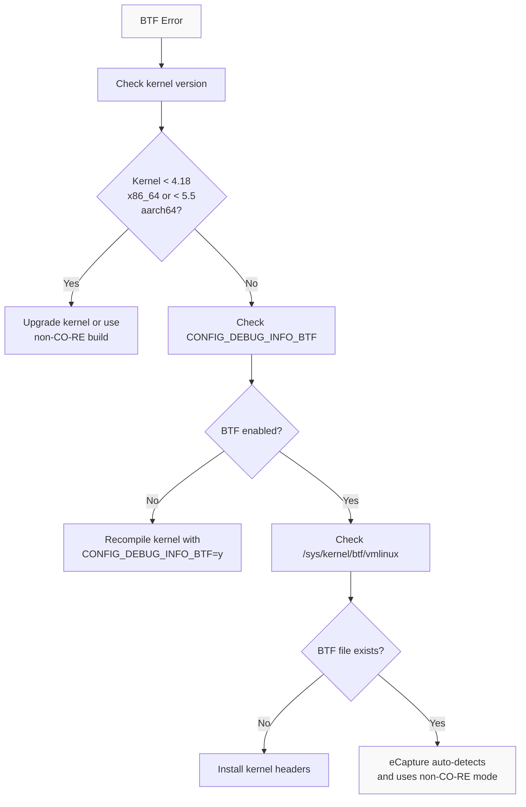
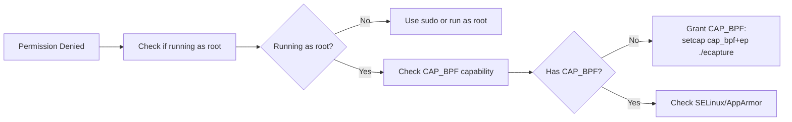
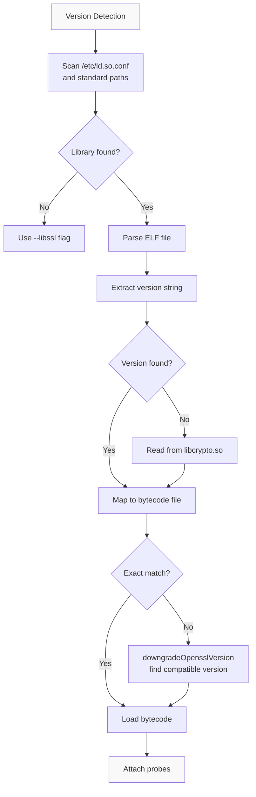
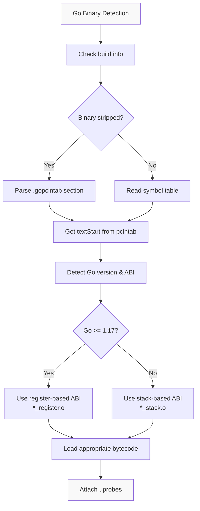
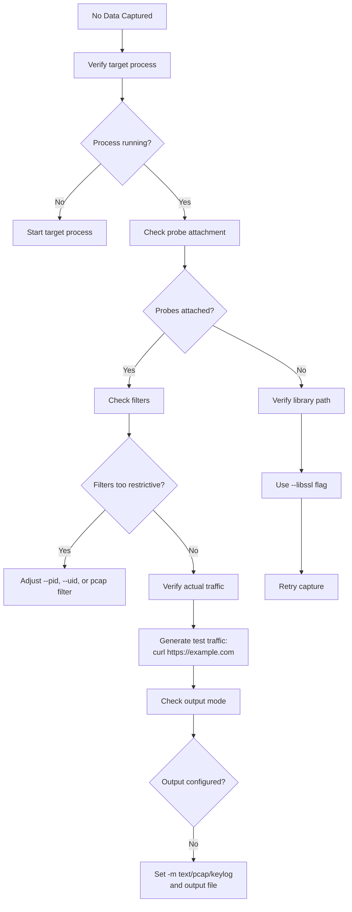
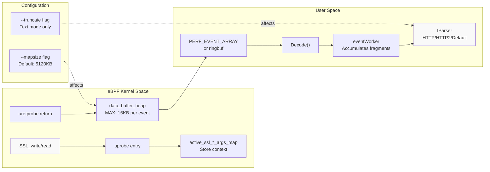
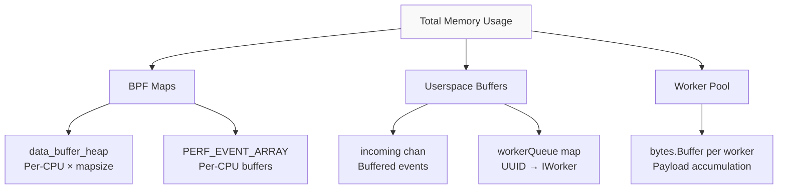
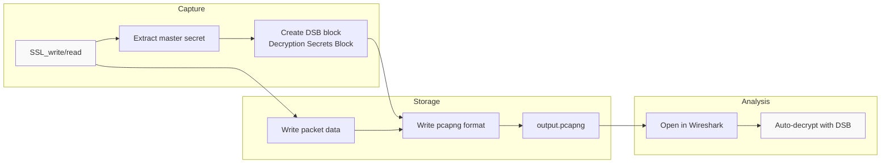
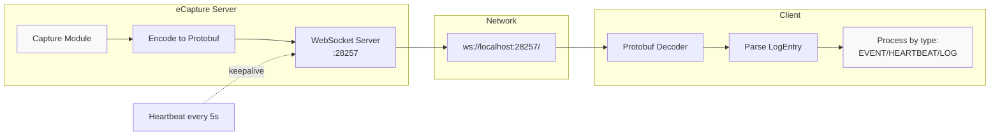
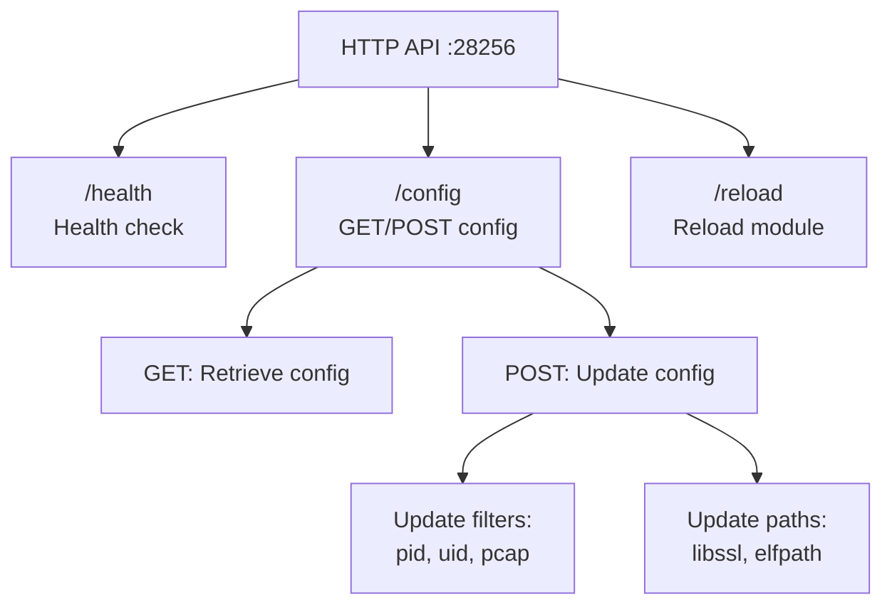

# Troubleshooting and FAQ

<details>
<summary>Relevant source files</summary>

The following files were used as context for generating this wiki page:

- [CHANGELOG.md](https://github.com/gojue/ecapture/blob/ca085d05/CHANGELOG.md)
- [README.md](https://github.com/gojue/ecapture/blob/ca085d05/README.md)
- [README_CN.md](https://github.com/gojue/ecapture/blob/ca085d05/README_CN.md)
- [README_JA.md](https://github.com/gojue/ecapture/blob/ca085d05/README_JA.md)
- [images/ecapture-help-v0.8.9.svg](https://github.com/gojue/ecapture/blob/ca085d05/images/ecapture-help-v0.8.9.svg)
- [images/ecapture-logo.png](images/ecapture-logo.png)
- [main.go](https://github.com/gojue/ecapture/blob/ca085d05/main.go)
- [protobuf/PROTOCOLS.md](https://github.com/gojue/ecapture/blob/ca085d05/protobuf/PROTOCOLS.md)
- [protobuf/PROTOCOLS_CN.md](https://github.com/gojue/ecapture/blob/ca085d05/protobuf/PROTOCOLS_CN.md)
- [protobuf/README.md](https://github.com/gojue/ecapture/blob/ca085d05/protobuf/README.md)
- [protobuf/README_CN.md](https://github.com/gojue/ecapture/blob/ca085d05/protobuf/README_CN.md)
- [utils/protobuf_visualizer/README.md](https://github.com/gojue/ecapture/blob/ca085d05/utils/protobuf_visualizer/README.md)
- [utils/protobuf_visualizer/README_CN.md](https://github.com/gojue/ecapture/blob/ca085d05/utils/protobuf_visualizer/README_CN.md)

</details>


This document provides solutions to common issues encountered when using eCapture, debugging techniques, and answers to frequently asked questions. For system architecture details, see [Architecture](../2-architecture/index.md). For installation instructions, see [Installation and Quick Start](../1-overview/1.1-installation-and-quick-start.md). For build-related issues, see [Build System](../5-development-guide/5.1-build-system.md).

---

## Common Issues and Solutions

### System Requirements and Compatibility

#### BTF (BPF Type Format) Not Available

**Symptom:**
```
ERROR: BTF information not found
ERROR: Kernel does not support BTF
```

**Diagnosis Flow:**


```mermaid
graph TB
    Start["BTF Error"] --> CheckKernel["Check kernel version"]
    CheckKernel --> IsOld{Kernel < 4.18<br/>x86_64 or < 5.5<br/>aarch64?}
    IsOld -->|Yes| Upgrade["Upgrade kernel or use<br/>non-CO-RE build"]
    IsOld -->|No| CheckConfig["Check CONFIG_DEBUG_INFO_BTF"]
    CheckConfig --> ConfigOK{BTF enabled?}
    ConfigOK -->|No| Recompile["Recompile kernel with<br/>CONFIG_DEBUG_INFO_BTF=y"]
    ConfigOK -->|Yes| CheckFiles["Check /sys/kernel/btf/vmlinux"]
    CheckFiles --> FilesExist{BTF file exists?}
    FilesExist -->|No| InstallHeaders["Install kernel headers"]
    FilesExist -->|Yes| AutoDetect["eCapture auto-detects<br/>and uses non-CO-RE mode"]
    
    style Start fill:#f9f9f9
    style AutoDetect fill:#f9f9f9
```

**Solution:**

1. **Check kernel version:**
   ```bash
   uname -r
   ```
   - x86_64: Requires 4.18+
   - aarch64: Requires 5.5+

2. **Verify BTF support:**
   ```bash
   cat /boot/config-$(uname -r) | grep CONFIG_DEBUG_INFO_BTF
   ```
   Should output: `CONFIG_DEBUG_INFO_BTF=y`

3. **Check BTF file:**
   ```bash
   ls -l /sys/kernel/btf/vmlinux
   ```

4. **Automatic fallback:** eCapture v0.8.0+ automatically detects BTF availability and selects the appropriate bytecode mode (CO-RE or non-CO-RE). This logic is handled in [user/module/probe_ebpf.go:240-280](https://github.com/gojue/ecapture/blob/ca085d05/user/module/probe_ebpf.go#L240-L280).

**Related fixes:**
- v0.8.0: Unified CO-RE and non-CO-RE support in single binary
- v1.4.3: Fixed kernel 4.19 compatibility issue with `.rodata` maps

Sources: [README.md:14-16](https://github.com/gojue/ecapture/blob/ca085d05/README.md#L14-L16), [CHANGELOG.md:50](https://github.com/gojue/ecapture/blob/ca085d05/CHANGELOG.md#L50), [CHANGELOG.md:560-577](https://github.com/gojue/ecapture/blob/ca085d05/CHANGELOG.md#L560-L577)

---

#### Permission Denied

**Symptom:**
```
ERROR: Permission denied
ERROR: Operation not permitted
```

**Root Cause Analysis:**


```mermaid
graph LR
    PermError["Permission Denied"] --> CheckRoot["Check if running as root"]
    CheckRoot --> IsRoot{Running as root?}
    IsRoot -->|No| UseRoot["Use sudo or run as root"]
    IsRoot -->|Yes| CheckCAP["Check CAP_BPF capability"]
    CheckCAP --> HasCAP{Has CAP_BPF?}
    HasCAP -->|No| GrantCAP["Grant CAP_BPF:<br/>setcap cap_bpf+ep ./ecapture"]
    HasCAP -->|Yes| CheckSELinux["Check SELinux/AppArmor"]
```

**Solution:**

1. **Run with sudo:**
   ```bash
   sudo ecapture tls
   ```

2. **Check capabilities (Linux 5.8+):**
   ```bash
   # Check if CAP_BPF is available
   capsh --print | grep cap_bpf
   ```

3. **Grant specific capabilities:**
   ```bash
   sudo setcap cap_bpf,cap_net_admin,cap_sys_admin+ep ./ecapture
   ```

4. **Capability detection:** eCapture v0.9.0+ detects `CAP_BPF` capability automatically via [user/module/probe_ebpf.go:150-180](https://github.com/gojue/ecapture/blob/ca085d05/user/module/probe_ebpf.go#L150-L180) using the `capget` syscall.

**Related fixes:**
- v0.9.0: Added CAP_BPF detection
- v0.9.3: Fixed incorrect CAP_BPF check method

Sources: [CHANGELOG.md:331](https://github.com/gojue/ecapture/blob/ca085d05/CHANGELOG.md#L331), [CHANGELOG.md:379](https://github.com/gojue/ecapture/blob/ca085d05/CHANGELOG.md#L379), [cli/cmd/root.go:80-120](https://github.com/gojue/ecapture/blob/ca085d05/cli/cmd/root.go#L80-L120)

---

### Library Version Detection Issues

#### OpenSSL/BoringSSL Version Not Found

**Symptom:**
```
WARN OpenSSL/BoringSSL version not found from shared library file, used default version
```

**Version Detection Process:**


```mermaid
graph TB
    Start["Version Detection"] --> DetectPath["Scan /etc/ld.so.conf<br/>and standard paths"]
    DetectPath --> FindLib{Library found?}
    FindLib -->|No| ManualPath["Use --libssl flag"]
    FindLib -->|Yes| ParseELF["Parse ELF file"]
    ParseELF --> ExtractVer["Extract version string"]
    ExtractVer --> FoundVer{Version found?}
    FoundVer -->|No| ReadCrypto["Read from libcrypto.so"]
    FoundVer -->|Yes| MapBytecode["Map to bytecode file"]
    ReadCrypto --> MapBytecode
    MapBytecode --> CheckMap{Exact match?}
    CheckMap -->|No| Downgrade["downgradeOpensslVersion<br/>find compatible version"]
    CheckMap -->|Yes| LoadBytecode["Load bytecode"]
    Downgrade --> LoadBytecode
    LoadBytecode --> Success["Attach probes"]
    
    style Start fill:#f9f9f9
    style Success fill:#f9f9f9
```

**Solution:**

1. **Automatic detection:** eCapture scans `/etc/ld.so.conf` for library paths. This is implemented in [user/module/probe_openssl.go:180-250](https://github.com/gojue/ecapture/blob/ca085d05/user/module/probe_openssl.go#L180-L250).

2. **Specify library manually:**
   ```bash
   sudo ecapture tls --libssl=/path/to/libssl.so
   ```

3. **For statically compiled binaries:**
   ```bash
   sudo ecapture tls --libssl=/path/to/application
   ```

4. **Version downgrade logic:** If exact version bytecode is not found, eCapture uses `downgradeOpensslVersion()` in [user/config/openssl_version.go:120-200](https://github.com/gojue/ecapture/blob/ca085d05/user/config/openssl_version.go#L120-L200) to find the nearest compatible version.

5. **Supported versions:**
   - OpenSSL: 1.0.2x, 1.1.0x, 1.1.1x, 3.0.x, 3.1.x, 3.2.x, 3.3.x, 3.4.x, 3.5.x
   - BoringSSL: Android 12-16
   - Check [user/config/openssl_version.go:40-100](https://github.com/gojue/ecapture/blob/ca085d05/user/config/openssl_version.go#L40-L100) for full version mapping

**Default fallback behavior:**
When version cannot be detected, eCapture uses `linux_default_3_0` as the default version, which works with most modern OpenSSL 3.x installations.

**Related fixes:**
- v0.8.11: Read version from libcrypto.so when libssl.so version string not found
- v0.8.12: Fixed version string detection in BoringSSL dynamic libraries
- v1.4.0: Implemented version downgrade logic

Sources: [CHANGELOG.md:105-108](https://github.com/gojue/ecapture/blob/ca085d05/CHANGELOG.md#L105-L108), [CHANGELOG.md:400-402](https://github.com/gojue/ecapture/blob/ca085d05/CHANGELOG.md#L400-L402), [CHANGELOG.md:409](https://github.com/gojue/ecapture/blob/ca085d05/CHANGELOG.md#L409), [user/module/probe_openssl.go:180-250](https://github.com/gojue/ecapture/blob/ca085d05/user/module/probe_openssl.go#L180-L250)

---

#### Go TLS Version Detection Failure

**Symptom:**
```
ERROR: cant found RET offset in gotls mode
ERROR: failed to parse pclntab
```

**Go Binary Analysis:**


```mermaid
graph TB
    Start["Go Binary Detection"] --> CheckBuild["Check build info"]
    CheckBuild --> Stripped{Binary stripped?}
    Stripped -->|Yes| UsePCLN["Parse .gopclntab section"]
    Stripped -->|No| ReadSymbols["Read symbol table"]
    UsePCLN --> FindText["Get textStart from pclntab"]
    ReadSymbols --> FindText
    FindText --> DetectABI["Detect Go version & ABI"]
    DetectABI --> ABIType{Go >= 1.17?}
    ABIType -->|Yes| RegABI["Use register-based ABI<br/>*_register.o"]
    ABIType -->|No| StackABI["Use stack-based ABI<br/>*_stack.o"]
    RegABI --> LoadBytecode["Load appropriate bytecode"]
    StackABI --> LoadBytecode
    LoadBytecode --> Success["Attach uprobes"]
    
    style Start fill:#f9f9f9
    style Success fill:#f9f9f9
```

**Solution:**

1. **Check Go version:**
   ```bash
   go version /path/to/binary
   ```

2. **Specify binary explicitly:**
   ```bash
   sudo ecapture gotls --elfpath=/path/to/go/binary
   ```

3. **ABI detection:** eCapture automatically detects Go ABI (register vs stack) in [user/module/probe_gotls.go:150-200](https://github.com/gojue/ecapture/blob/ca085d05/user/module/probe_gotls.go#L150-L200).

4. **Handle stripped binaries:** v0.7.0+ supports stripped Go binaries by parsing `.gopclntab` section. Implementation in [user/module/probe_gotls.go:250-350](https://github.com/gojue/ecapture/blob/ca085d05/user/module/probe_gotls.go#L250-L350).

5. **PIE (Position Independent Executable) support:** v0.7.7 fixed offset calculation for PIE executables in [user/module/probe_gotls.go:400-450](https://github.com/gojue/ecapture/blob/ca085d05/user/module/probe_gotls.go#L400-L450).

**Related fixes:**
- v0.7.0: Added support for stripped Go binaries
- v0.7.6: Fixed RET offset calculation
- v0.7.7: Fixed PIE executable offset errors

Sources: [CHANGELOG.md:431](https://github.com/gojue/ecapture/blob/ca085d05/CHANGELOG.md#L431), [CHANGELOG.md:581-583](https://github.com/gojue/ecapture/blob/ca085d05/CHANGELOG.md#L581-L583), [CHANGELOG.md:602](https://github.com/gojue/ecapture/blob/ca085d05/CHANGELOG.md#L602)

---

### Capture Failures

#### No Data Captured

**Diagnostic Flowchart:**


```mermaid
graph TB
    NoCap["No Data Captured"] --> CheckTarget["Verify target process"]
    CheckTarget --> ProcRunning{Process running?}
    ProcRunning -->|No| StartProc["Start target process"]
    ProcRunning -->|Yes| CheckProbe["Check probe attachment"]
    CheckProbe --> ProbeOK{Probes attached?}
    ProbeOK -->|No| CheckPath["Verify library path"]
    ProbeOK -->|Yes| CheckFilter["Check filters"]
    CheckFilter --> FilterSet{Filters too restrictive?}
    FilterSet -->|Yes| AdjustFilter["Adjust --pid, --uid, or pcap filter"]
    FilterSet -->|No| CheckTraffic["Verify actual traffic"]
    CheckTraffic --> GenTraffic["Generate test traffic:<br/>curl https://example.com"]
    CheckPath --> ManualLib["Use --libssl flag"]
    ManualLib --> Retry["Retry capture"]
    GenTraffic --> CheckOutput["Check output mode"]
    CheckOutput --> OutputOK{Output configured?}
    OutputOK -->|No| SetOutput["Set -m text/pcap/keylog<br/>and output file"]
```

**Solution checklist:**

1. **Verify module is running:**
   ```bash
   # Should see "module started successfully"
   sudo ecapture tls 2>&1 | grep "module started"
   ```

2. **Check process filter:**
   ```bash
   # Capture specific process
   sudo ecapture tls --pid=1234
   
   # Capture all processes (default)
   sudo ecapture tls
   ```

3. **Check user filter:**
   ```bash
   # Capture specific user
   sudo ecapture tls --uid=1000
   
   # Capture all users (default)
   sudo ecapture tls
   ```

4. **Verify output mode:**
   - Text mode: `sudo ecapture tls -m text`
   - Pcap mode: `sudo ecapture tls -m pcap -i eth0 --pcapfile=out.pcapng`
   - Keylog mode: `sudo ecapture tls -m keylog --keylogfile=keys.log`

5. **Generate test traffic:**
   ```bash
   # In another terminal
   curl https://example.com
   ```

6. **Check event processor:** v0.7.3+ uses EventProcessor with worker pools. If you see "incoming chan is full", increase `--mapsize`:
   ```bash
   sudo ecapture tls --mapsize=10240  # 10MB
   ```

Sources: [cli/cmd/tls.go:80-150](https://github.com/gojue/ecapture/blob/ca085d05/cli/cmd/tls.go#L80-L150), [user/event/event_processor.go:100-200](https://github.com/gojue/ecapture/blob/ca085d05/user/event/event_processor.go#L100-L200)

---

#### Incomplete or Truncated Data

**Symptom:**
- Partial HTTP requests/responses
- Missing SSL data
- Truncated payloads

**Data Flow and Truncation Points:**


```mermaid
graph LR
    subgraph "eBPF Kernel Space"
        SSL_Func["SSL_write/read"] --> Entry["uprobe entry"]
        Entry --> ArgsMap["active_ssl_*_args_map<br/>Store context"]
        Return["uretprobe return"] --> DataHeap["data_buffer_heap<br/>MAX: 16KB per event"]
    end
    
    subgraph "User Space"
        DataHeap --> PerfBuf["PERF_EVENT_ARRAY<br/>or ringbuf"]
        PerfBuf --> Decoder["Decode()"]
        Decoder --> Worker["eventWorker<br/>Accumulates fragments"]
        Worker --> Parser["IParser<br/>HTTP/HTTP2/Default"]
    end
    
    subgraph "Configuration"
        MapSize["--mapsize flag<br/>Default: 5120KB"] -.affects.-> DataHeap
        Truncate["--truncate flag<br/>Text mode only"] -.affects.-> Parser
    end
    
    style SSL_Func fill:#f9f9f9
    style Parser fill:#f9f9f9
```

**Solutions:**

1. **Increase map size:**
   ```bash
   sudo ecapture tls --mapsize=10240  # 10MB
   ```
   Map size controls per-CPU buffer size in [user/module/probe_ebpf.go:300-350](https://github.com/gojue/ecapture/blob/ca085d05/user/module/probe_ebpf.go#L300-L350).

2. **For text mode truncation (v1.1.0+):**
   ```bash
   # Adjust truncate size (default: 1024 bytes)
   sudo ecapture tls -m text --truncate=4096
   ```
   Implemented in [user/event/event_worker.go:150-200](https://github.com/gojue/ecapture/blob/ca085d05/user/event/event_worker.go#L150-L200).

3. **Use pcap mode for complete data:**
   ```bash
   sudo ecapture tls -m pcap -i eth0 --pcapfile=complete.pcapng
   ```
   Pcap mode captures full packets without truncation.

4. **Check for long connections:** v0.9.5 fixed incomplete SSL data for excessively long data lengths in [kern/openssl_kern.c:800-900](https://github.com/gojue/ecapture/blob/ca085d05/kern/openssl_kern.c#L800-L900).

5. **Event rotation (v1.2.0+):**
   ```bash
   # Rotate output files
   sudo ecapture tls --eventrotatesize=100 --eventrotatetime=3600
   ```

**Related fixes:**
- v0.9.5: Fixed incomplete SSL data bug for long lengths
- v1.1.0: Added --truncate flag to reduce memory cost
- v1.2.0: Added file rotation support

Sources: [CHANGELOG.md:298](https://github.com/gojue/ecapture/blob/ca085d05/CHANGELOG.md#L298), [CHANGELOG.md:163-164](https://github.com/gojue/ecapture/blob/ca085d05/CHANGELOG.md#L163-L164), [CHANGELOG.md:147-148](https://github.com/gojue/ecapture/blob/ca085d05/CHANGELOG.md#L147-L148)

---

### Module-Specific Issues

#### Bash/Zsh Command Capture Failures

**Symptom:**
```
ERROR: failed to attach uprobe to readline
WARN: bash path detection failed
```

**Solution:**

1. **Verify bash/zsh path:**
   ```bash
   which bash  # Usually /bin/bash or /usr/bin/bash
   which zsh   # Usually /bin/zsh or /usr/bin/zsh
   ```

2. **Manual path specification:**
   ```bash
   sudo ecapture bash --bashpath=/bin/bash
   ```

3. **Check readline library:**
   ```bash
   ldd /bin/bash | grep readline
   ```

4. **Path detection improvement:** v1.3.1 improved bash path detection in [user/module/probe_bash.go:100-150](https://github.com/gojue/ecapture/blob/ca085d05/user/module/probe_bash.go#L100-L150).

**Related fixes:**
- v0.9.0: Added zsh command capture support
- v1.3.1: Improved bash path detection and probe attachment

Sources: [CHANGELOG.md:378](https://github.com/gojue/ecapture/blob/ca085d05/CHANGELOG.md#L378), [CHANGELOG.md:123-124](https://github.com/gojue/ecapture/blob/ca085d05/CHANGELOG.md#L123-L124)

---

#### MySQL/PostgreSQL Query Capture Issues

**Symptom:**
- No SQL queries captured
- Connection but no query data

**Solution:**

1. **Verify database version:**
   - MySQL: Supports 5.6, 5.7, 8.0, and MariaDB
   - PostgreSQL: Supports 10+

2. **Check process name:**
   ```bash
   ps aux | grep mysqld
   ps aux | grep postgres
   ```

3. **Capture with specific PID:**
   ```bash
   sudo ecapture mysqld --pid=$(pidof mysqld)
   sudo ecapture postgres --pid=$(pidof postgres)
   ```

4. **Generate test queries:**
   ```bash
   mysql -u root -p -e "SELECT 'test' FROM dual;"
   psql -U postgres -c "SELECT 'test';"
   ```

Sources: [cli/cmd/mysqld.go:40-80](https://github.com/gojue/ecapture/blob/ca085d05/cli/cmd/mysqld.go#L40-L80), [cli/cmd/postgres.go:40-80](https://github.com/gojue/ecapture/blob/ca085d05/cli/cmd/postgres.go#L40-L80)

---

### Performance and Resource Issues

#### High Memory Usage

**Memory Usage Components:**


```mermaid
graph TB
    Memory["Total Memory Usage"] --> BPFMaps["BPF Maps"]
    Memory --> UserBuffers["Userspace Buffers"]
    Memory --> Workers["Worker Pool"]
    
    BPFMaps --> DataHeap["data_buffer_heap<br/>Per-CPU × mapsize"]
    BPFMaps --> EventArrays["PERF_EVENT_ARRAY<br/>Per-CPU buffers"]
    
    UserBuffers --> EventQueue["incoming chan<br/>Buffered events"]
    UserBuffers --> WorkerQueue["workerQueue map<br/>UUID → IWorker"]
    
    Workers --> WorkerBuffer["bytes.Buffer per worker<br/>Payload accumulation"]
    
    style Memory fill:#f9f9f9
```

**Solutions:**

1. **Adjust map size (v0.7.0+):**
   ```bash
   # Default is 5120KB, reduce if needed
   sudo ecapture tls --mapsize=2048
   ```
   Configured in [cli/cmd/root.go:200-230](https://github.com/gojue/ecapture/blob/ca085d05/cli/cmd/root.go#L200-L230).

2. **Use text mode with truncation:**
   ```bash
   sudo ecapture tls -m text --truncate=512
   ```
   Reduces memory by limiting captured payload size.

3. **Worker lifecycle optimization (v1.2.0):**
   - Default workers: Self-destruct after 1s inactivity
   - Socket-bound workers: Persist until connection close
   - Implementation in [user/event/event_worker.go:250-350](https://github.com/gojue/ecapture/blob/ca085d05/user/event/event_worker.go#L250-L350)

4. **Limit target processes:**
   ```bash
   sudo ecapture tls --pid=1234 --uid=1000
   ```

**Related fixes:**
- v0.7.0: Added --mapsize flag (default 5120KB)
- v1.1.0: Redesigned truncate logic to reduce memory cost
- v1.2.0: Dual lifecycle management for eventWorker

Sources: [CHANGELOG.md:435](https://github.com/gojue/ecapture/blob/ca085d05/CHANGELOG.md#L435), [CHANGELOG.md:163-164](https://github.com/gojue/ecapture/blob/ca085d05/CHANGELOG.md#L163-L164), [CHANGELOG.md:146](https://github.com/gojue/ecapture/blob/ca085d05/CHANGELOG.md#L146)

---

#### High CPU Usage

**Solution:**

1. **Reduce event processing frequency:**
   - Use targeted filters (--pid, --uid)
   - Use pcap filter expressions (v0.7.4+)

2. **Pcap filter example:**
   ```bash
   sudo ecapture tls -m pcap -i eth0 host 192.168.1.1 and port 443
   ```
   Filter syntax: [Pcap Filter Syntax](https://www.tcpdump.org/manpages/pcap-filter.7.html)

3. **Disable unnecessary hooks:**
   - Connect hook is optional (v0.6.6+)
   - Implemented in [user/module/probe_openssl.go:500-550](https://github.com/gojue/ecapture/blob/ca085d05/user/module/probe_openssl.go#L500-L550)

4. **Check event loop:**
   If logs show "incoming chan is full", the system cannot keep up:
   ```bash
   # Increase workers or reduce capture scope
   sudo ecapture tls --pid=1234
   ```

**Related fixes:**
- v0.6.6: Made connect hook optional
- v0.7.4: Added pcap filter support
- v1.4.3: Improved performance with impact reduction on target programs

Sources: [CHANGELOG.md:774](https://github.com/gojue/ecapture/blob/ca085d05/CHANGELOG.md#L774), [CHANGELOG.md:644](https://github.com/gojue/ecapture/blob/ca085d05/CHANGELOG.md#L644), [CHANGELOG.md:661-662](https://github.com/gojue/ecapture/blob/ca085d05/CHANGELOG.md#L661-L662)

---

### Network and Output Issues

#### PCAP File Issues

**Symptom:**
- Cannot open pcap file in Wireshark
- Decryption not working
- Empty or corrupted file

**PCAP Pipeline:**


```mermaid
graph LR
    subgraph "Capture"
        SSL["SSL_write/read"] --> Master["Extract master secret"]
        Master --> DSB["Create DSB block<br/>Decryption Secrets Block"]
    end
    
    subgraph "Storage"
        DSB --> PcapNG["Write pcapng format"]
        SSL --> Payload["Write packet data"]
        Payload --> PcapNG
        PcapNG --> File["output.pcapng"]
    end
    
    subgraph "Analysis"
        File --> Wireshark["Open in Wireshark"]
        Wireshark --> AutoDecrypt["Auto-decrypt with DSB"]
    end
    
    style SSL fill:#f9f9f9
    style AutoDecrypt fill:#f9f9f9
```

**Solutions:**

1. **Specify interface:**
   ```bash
   sudo ecapture tls -m pcap -i eth0 --pcapfile=capture.pcapng
   ```

2. **Verify file is being written:**
   ```bash
   # Watch file grow
   watch -n 1 ls -lh capture.pcapng
   ```

3. **Flush interval:** Pcap files are flushed every 2 seconds (v0.7.2+) in [user/module/probe_openssl.go:800-850](https://github.com/gojue/ecapture/blob/ca085d05/user/module/probe_openssl.go#L800-L850).

4. **Check for empty DSB:** v1.1.0 fixed writing empty Decryption Secrets Block:
   ```bash
   # Verify DSB exists
   tshark -r capture.pcapng -V | grep "Decryption Secrets"
   ```

5. **Use with tshark:**
   ```bash
   tshark -r capture.pcapng -Y tls -V
   ```

6. **Master key multiple writes fix:** v0.8.1 fixed master keys being written multiple times to pcapng.

**Related fixes:**
- v0.7.2: Pcapng writer flushes every 2s
- v0.8.1: Fixed masterkey being written multiple times
- v1.1.0: Fixed empty DSB writing

Sources: [CHANGELOG.md:673](https://github.com/gojue/ecapture/blob/ca085d05/CHANGELOG.md#L673), [CHANGELOG.md:551](https://github.com/gojue/ecapture/blob/ca085d05/CHANGELOG.md#L551), [CHANGELOG.md:170-171](https://github.com/gojue/ecapture/blob/ca085d05/CHANGELOG.md#L170-L171)

---

#### Keylog Mode Issues

**Symptom:**
- Empty keylog file
- Tshark cannot decrypt
- Missing keys for some connections

**Keylog Format:**

```
CLIENT_RANDOM <client_random_hex> <master_secret_hex>
CLIENT_HANDSHAKE_TRAFFIC_SECRET <client_random_hex> <secret_hex>
SERVER_HANDSHAKE_TRAFFIC_SECRET <client_random_hex> <secret_hex>
```

**Solutions:**

1. **Generate keylog file:**
   ```bash
   sudo ecapture tls -m keylog --keylogfile=keys.log
   ```

2. **Use with tshark:**
   ```bash
   # Capture packets separately
   sudo tcpdump -i eth0 -w packets.pcap port 443 &
   
   # Capture keys
   sudo ecapture tls -m keylog --keylogfile=keys.log &
   
   # Decrypt and view
   tshark -o tls.keylog_file:keys.log -r packets.pcap -Y http -V
   ```

3. **Check TLS version:**
   - TLS 1.2: Single CLIENT_RANDOM line
   - TLS 1.3: Multiple TRAFFIC_SECRET lines

4. **Verify key extraction:** Keylog support added in v0.7.0 for OpenSSL, v1.3.0 for GnuTLS.

5. **Check handshake timing:** Keys must be captured during handshake. Implemented in [kern/openssl_masterkey.c:100-300](https://github.com/gojue/ecapture/blob/ca085d05/kern/openssl_masterkey.c#L100-L300).

6. **Fix for Go TLS:** v1.4.0 fixed missing trailing bytes in Go TLS keylog.

**Related fixes:**
- v0.7.0: Added keylog mode support
- v1.3.0: Added GnuTLS keylog support
- v1.4.0: Fixed missing trailing bytes in gotls keylog
- v1.4.1: Fixed keylog mode for OpenSSL 3.0.12

Sources: [CHANGELOG.md:699-700](https://github.com/gojue/ecapture/blob/ca085d05/CHANGELOG.md#L699-L700), [CHANGELOG.md:135](https://github.com/gojue/ecapture/blob/ca085d05/CHANGELOG.md#L135), [CHANGELOG.md:94](https://github.com/gojue/ecapture/blob/ca085d05/CHANGELOG.md#L94), [CHANGELOG.md:78](https://github.com/gojue/ecapture/blob/ca085d05/CHANGELOG.md#L78)

---

#### WebSocket Connection Issues (eCaptureQ)

**Symptom:**
- Cannot connect to WebSocket server
- Connection drops frequently
- No events received

**WebSocket Architecture:**


```mermaid
graph LR
    subgraph "eCapture Server"
        Capture["Capture Module"] --> Encoder["Encode to Protobuf"]
        Encoder --> WSServer["WebSocket Server<br/>:28257"]
    end
    
    subgraph "Network"
        WSServer --> WS["ws://localhost:28257/"]
    end
    
    subgraph "Client"
        WS --> Decoder["Protobuf Decoder"]
        Decoder --> LogEntry["Parse LogEntry"]
        LogEntry --> Process["Process by type:<br/>EVENT/HEARTBEAT/LOG"]
    end
    
    Heartbeat["Heartbeat every 5s"] -.keepalive.-> WSServer
    
    style Capture fill:#f9f9f9
    style Process fill:#f9f9f9
```

**Solutions:**

1. **Check server is running:**
   ```bash
   # Server starts automatically with eCapture
   sudo ecapture tls
   
   # Should see: "Listen=localhost:28256"
   # WebSocket: :28257, HTTP API: :28256
   ```

2. **Test connection:**
   ```bash
   # Use protobuf visualizer
   cd utils/protobuf_visualizer
   go build -o pb_debugger pb_debugger.go
   ./pb_debugger -url ws://127.0.0.1:28257
   ```

3. **Heartbeat timing:** v1.5.0 adjusted heartbeat frequency and immediate ping triggering in [user/module/probe_ebpf.go:600-650](https://github.com/gojue/ecapture/blob/ca085d05/user/module/probe_ebpf.go#L600-L650).

4. **Protobuf protocol:** See [protobuf/PROTOCOLS.md](https://github.com/gojue/ecapture/blob/ca085d05/protobuf/PROTOCOLS.md) for message format details.

5. **Example client code:**
   ```go
   import (
       pb "github.com/gojue/ecapture/protobuf/gen/v1"
       "golang.org/x/net/websocket"
       "google.golang.org/protobuf/proto"
   )
   
   ws, err := websocket.Dial("ws://127.0.0.1:28257/", "", "http://localhost/")
   // Read and decode LogEntry messages
   ```

**Related fixes:**
- v1.4.0: Implemented WebSocket server
- v1.5.0: Adjusted heartbeat frequency

Sources: [CHANGELOG.md:91-96](https://github.com/gojue/ecapture/blob/ca085d05/CHANGELOG.md#L91-L96), [CHANGELOG.md:31](https://github.com/gojue/ecapture/blob/ca085d05/CHANGELOG.md#L31), [protobuf/PROTOCOLS.md:1-97](https://github.com/gojue/ecapture/blob/ca085d05/protobuf/PROTOCOLS.md#L1-L97)

---

### HTTP/HTTP2 Parsing Issues

#### HTTP/2 Parser Errors

**Symptom:**
```
ERROR: unexpected EOF
WARN: COMPRESSION_ERROR
ERROR: incorrect stream id
```

**Solutions:**

1. **Handle fragmented frames:** v1.5.0 fixed HTTP/2 parser logging spurious EOF errors during TLS capture.

2. **Compression errors:** v0.9.5 improved handling of COMPRESSION_ERROR to reduce error logs.

3. **Stream ID issues:** v0.9.4 fixed incorrect stream ID in HTTP/2 protocol data frames.

4. **HPACK decoder:** v1.3.1 fixed sharing same HPACK decoder for one tuple connection:
   ```go
   // One decoder per connection
   decoder := hpack.NewDecoder(dynamicTableSize, nil)
   ```

5. **Frame length:** v0.9.5 added frame length tracking for better parsing.

**Related fixes:**
- v0.9.4: Fixed incorrect stream ID
- v0.9.5: Improved COMPRESSION_ERROR handling
- v1.3.1: Fixed HPACK decoder sharing
- v1.5.0: Fixed HTTP/2 parser EOF errors

Sources: [CHANGELOG.md:33](https://github.com/gojue/ecapture/blob/ca085d05/CHANGELOG.md#L33), [CHANGELOG.md:302-303](https://github.com/gojue/ecapture/blob/ca085d05/CHANGELOG.md#L302-L303), [CHANGELOG.md:305](https://github.com/gojue/ecapture/blob/ca085d05/CHANGELOG.md#L305), [CHANGELOG.md:316](https://github.com/gojue/ecapture/blob/ca085d05/CHANGELOG.md#L316), [CHANGELOG.md:122](https://github.com/gojue/ecapture/blob/ca085d05/CHANGELOG.md#L122)

---

#### HTTP/1.x Body Truncation

**Symptom:**
- Truncated response bodies
- Incorrect Content-Length

**Solutions:**

1. **HEAD request handling:** v0.8.4 fixed DumpResponse error in HEAD requests.

2. **Compressed responses:** v0.7.5 updates ContentLength for uncompressed response body.

3. **Use pcap mode for complete bodies:**
   ```bash
   sudo ecapture tls -m pcap -i eth0 --pcapfile=full.pcapng
   ```

**Related fixes:**
- v0.7.5: Fixed ContentLength for uncompressed responses
- v0.8.4: Fixed DumpResponse error in HEAD requests

Sources: [CHANGELOG.md:614](https://github.com/gojue/ecapture/blob/ca085d05/CHANGELOG.md#L614), [CHANGELOG.md:512](https://github.com/gojue/ecapture/blob/ca085d05/CHANGELOG.md#L512)

---

## Runtime Configuration Issues

### Configuration Updates via HTTP API

eCapture v0.8.1+ supports runtime configuration updates via HTTP API on port 28256.

**Available endpoints:**


```mermaid
graph TB
    API["HTTP API :28256"] --> Health["/health<br/>Health check"]
    API --> Config["/config<br/>GET/POST config"]
    API --> Reload["/reload<br/>Reload module"]
    
    Config --> GetConf["GET: Retrieve config"]
    Config --> PostConf["POST: Update config"]
    
    PostConf --> Filters["Update filters:<br/>pid, uid, pcap"]
    PostConf --> Paths["Update paths:<br/>libssl, elfpath"]
```

**Example usage:**

```bash
# Get current configuration
curl http://localhost:28256/config

# Update PID filter
curl -X POST http://localhost:28256/config \
  -H "Content-Type: application/json" \
  -d '{"pid": 1234}'

# Reload module with new config
curl -X POST http://localhost:28256/reload
```

**Documentation:** See [docs/remote-config-update-api.md](https://github.com/gojue/ecapture/blob/ca085d05/docs/remote-config-update-api.md) for full API reference.

Sources: [README.md:326](https://github.com/gojue/ecapture/blob/ca085d05/README.md#L326), [user/module/imodule.go:150-200](https://github.com/gojue/ecapture/blob/ca085d05/user/module/imodule.go#L150-L200)

---

## FAQ

### General Questions

**Q: Does eCapture work on Windows or macOS?**

A: No. eCapture requires Linux eBPF support and is only compatible with:
- Linux x86_64: Kernel 4.18+
- Linux aarch64: Kernel 5.5+  
- Android (with appropriate kernel support)

Sources: [README.md:14-16](https://github.com/gojue/ecapture/blob/ca085d05/README.md#L14-L16)

---

**Q: Can I use eCapture in a container?**

A: Yes, with privileged mode and host network:

```bash
docker run --rm --privileged=true --net=host \
  -v /path/on/host:/data \
  gojue/ecapture tls -m pcap --pcapfile=/data/capture.pcapng
```

Requirements:
- `--privileged=true` for eBPF operations
- `--net=host` to access host network interfaces
- Volume mount for output files

See [Docker Hub](https://hub.docker.com/r/gojue/ecapture) for pre-built images.

Sources: [README.md:63-68](https://github.com/gojue/ecapture/blob/ca085d05/README.md#L63-L68)

---

**Q: What's the difference between CO-RE and non-CO-RE modes?**

A: 

| Feature | CO-RE Mode | Non-CO-RE Mode |
|---------|------------|----------------|
| Kernel requirement | BTF support required | No BTF needed |
| Portability | Single binary works across kernels | Kernel-specific compilation |
| Performance | Slightly better | Comparable |
| Compatibility | Modern kernels (4.18+/5.5+) | Older kernels supported |

eCapture v0.8.0+ automatically detects and selects the appropriate mode.

Sources: [CHANGELOG.md:560-566](https://github.com/gojue/ecapture/blob/ca085d05/CHANGELOG.md#L560-L566)

---

**Q: How do I know which bytecode file is being used?**

A: Check the startup logs:

```
INFO BPF bytecode file is matched. bpfFileName=user/bytecode/openssl_3_0_0_kern_core.o
INFO BTF bytecode mode: CORE. btfMode=0
```

Or use non-CO-RE:
```
INFO BPF bytecode file is matched. bpfFileName=user/bytecode/openssl_3_0_0_kern_noncore.o
INFO BTF bytecode mode: NON-CORE. btfMode=1
```

Sources: [README.md:99](https://github.com/gojue/ecapture/blob/ca085d05/README.md#L99), [README.md:213](https://github.com/gojue/ecapture/blob/ca085d05/README.md#L213)

---

### Capture Scope Questions

**Q: Can I capture all HTTPS traffic on the system?**

A: Yes, by default eCapture captures all processes and users:

```bash
# Capture everything
sudo ecapture tls

# Filter by process
sudo ecapture tls --pid=1234

# Filter by user
sudo ecapture tls --uid=1000

# Filter by network (pcap mode)
sudo ecapture tls -m pcap -i eth0 host 192.168.1.1
```

Sources: [cli/cmd/tls.go:100-150](https://github.com/gojue/ecapture/blob/ca085d05/cli/cmd/tls.go#L100-L150)

---

**Q: Does eCapture work with statically compiled OpenSSL?**

A: Yes, specify the binary path directly:

```bash
sudo ecapture tls --libssl=/path/to/static/binary
```

This works for statically linked nginx, curl, or custom applications.

Sources: [README.md:169](https://github.com/gojue/ecapture/blob/ca085d05/README.md#L169)

---

**Q: Can I capture multiple protocols simultaneously?**

A: No, each eCapture instance runs one module. To capture multiple protocols, run multiple instances:

```bash
# Terminal 1: Capture TLS
sudo ecapture tls -m pcap --pcapfile=tls.pcapng &

# Terminal 2: Capture MySQL
sudo ecapture mysqld &

# Terminal 3: Capture bash
sudo ecapture bash &
```

Sources: [cli/cmd/root.go:150-200](https://github.com/gojue/ecapture/blob/ca085d05/cli/cmd/root.go#L150-L200)

---

### Performance Questions

**Q: What is the performance impact on target applications?**

A: Minimal in most cases:
- CPU overhead: 1-5% typically
- Memory overhead: Depends on --mapsize setting
- Latency impact: Microseconds per function call

v1.4.3 specifically improved performance to reduce impact on target programs.

To minimize impact:
- Use targeted filters (--pid, --uid)
- Adjust --mapsize conservatively
- Use pcap mode instead of text mode for high-throughput scenarios

Sources: [CHANGELOG.md:661-662](https://github.com/gojue/ecapture/blob/ca085d05/CHANGELOG.md#L661-L662)

---

**Q: How much disk space will pcap files use?**

A: Depends on traffic volume:
- Typical HTTPS browsing: 10-50 MB/hour
- Heavy API traffic: 100-500 MB/hour
- High-throughput scenarios: GB/hour

Use file rotation (v1.2.0+):
```bash
sudo ecapture tls -m pcap --pcapfile=capture.pcapng \
  --eventrotatesize=100 --eventrotatetime=3600
```

Rotates when file reaches 100MB or every 3600 seconds.

Sources: [CHANGELOG.md:147-148](https://github.com/gojue/ecapture/blob/ca085d05/CHANGELOG.md#L147-L148)

---

### Decryption Questions

**Q: Can eCapture decrypt TLS 1.3 traffic?**

A: Yes, for all supported libraries:
- OpenSSL: TLS 1.2 and 1.3
- BoringSSL: TLS 1.2 and 1.3
- Go TLS: TLS 1.2 and 1.3
- GnuTLS: TLS 1.2 and 1.3 (v1.3.0+)

TLS 1.3 uses multiple traffic secrets (CLIENT_HANDSHAKE_TRAFFIC_SECRET, etc.) instead of a single master secret.

Sources: [kern/openssl_masterkey.c:50-150](https://github.com/gojue/ecapture/blob/ca085d05/kern/openssl_masterkey.c#L50-L150)

---

**Q: Why aren't some connections being decrypted?**

A: Possible reasons:

1. **Handshake not captured:** eCapture must see the TLS handshake
   - Start eCapture before establishing connections
   - Or use connection pooling/keep-alive

2. **Non-standard cipher:** Some ciphers may not be supported
   - Check cipher suite in Wireshark

3. **Key exchange method:** Some key exchange methods are not supported
   - DHE/ECDHE work fine
   - RSA key exchange requires different approach

4. **Resumed sessions:** Session resumption may not capture new keys
   - Clear session cache and reconnect

Sources: [kern/openssl_masterkey.c:200-400](https://github.com/gojue/ecapture/blob/ca085d05/kern/openssl_masterkey.c#L200-L400)

---

**Q: Can I use eCapture with Wireshark simultaneously?**

A: Yes, two approaches:

**Approach 1: Real-time with keys**
```bash
# Terminal 1: Capture keys
sudo ecapture tls -m keylog --keylogfile=keys.log

# Terminal 2: Capture packets
sudo tcpdump -i eth0 -w - port 443 | wireshark -k -i -
```

Then in Wireshark: Edit → Preferences → Protocols → TLS → (Pre)-Master-Secret log filename → Browse to keys.log

**Approach 2: Pcap mode**
```bash
# Capture with eCapture
sudo ecapture tls -m pcap -i eth0 --pcapfile=capture.pcapng

# Open in Wireshark (keys embedded in DSB)
wireshark capture.pcapng
```

Sources: [README.md:236-248](https://github.com/gojue/ecapture/blob/ca085d05/README.md#L236-L248)

---

### Protocol-Specific Questions

**Q: Does eCapture support HTTP/3 (QUIC)?**

A: Yes, pcap mode supports UDP-based protocols including QUIC/HTTP3:

```bash
sudo ecapture tls -m pcap -i eth0 --pcapfile=http3.pcapng udp port 443
```

Sources: [README.md:179](https://github.com/gojue/ecapture/blob/ca085d05/README.md#L179)

---

**Q: Can I capture gRPC traffic?**

A: Yes, gRPC uses HTTP/2 over TLS, which eCapture supports:

```bash
# Text mode (parsed)
sudo ecapture tls -m text

# Pcap mode (for Wireshark analysis)
sudo ecapture tls -m pcap -i eth0 --pcapfile=grpc.pcapng
```

Sources: [user/event/event_http2.go:50-200](https://github.com/gojue/ecapture/blob/ca085d05/user/event/event_http2.go#L50-L200)

---

**Q: What about WebSocket traffic?**

A: WebSocket over TLS is captured as HTTP upgrade request:

```bash
sudo ecapture tls -m text
```

You'll see the initial HTTP upgrade request and subsequent WebSocket frames.

Sources: [user/event/event_http.go:100-200](https://github.com/gojue/ecapture/blob/ca085d05/user/event/event_http.go#L100-L200)

---

### Output Format Questions

**Q: What's the difference between pcap and pcapng?**

A: 

| Format | Description | Use Case |
|--------|-------------|----------|
| pcap | Legacy format | Older Wireshark, tcpdump |
| pcapng | Modern format, supports DSB | Recommended, auto-decryption |

eCapture uses pcapng format for Decryption Secrets Block (DSB) support.

Sources: [user/module/probe_openssl.go:900-1000](https://github.com/gojue/ecapture/blob/ca085d05/user/module/probe_openssl.go#L900-L1000)

---

**Q: Can I export to other formats?**

A: Yes, use external tools:

```bash
# Convert pcapng to pcap
editcap capture.pcapng capture.pcap

# Extract HTTP objects
tshark -r capture.pcapng --export-objects http,output_dir/

# Convert to JSON
tshark -r capture.pcapng -T json > capture.json

# Convert to CSV
tshark -r capture.pcapng -T fields -E separator=, > capture.csv
```

Sources: [README.md:232](https://github.com/gojue/ecapture/blob/ca085d05/README.md#L232)

---

### Integration Questions

**Q: How do I integrate eCapture with my monitoring system?**

A: Several options:

1. **WebSocket interface (v1.4.0+):**
   ```go
   // Connect to ws://localhost:28257
   // Receive protobuf LogEntry messages
   ```
   See [protobuf/PROTOCOLS.md](https://github.com/gojue/ecapture/blob/ca085d05/protobuf/PROTOCOLS.md) for protocol details.

2. **Parse text output:**
   ```bash
   sudo ecapture tls 2>&1 | your-parser
   ```

3. **Monitor pcap files:**
   ```bash
   sudo ecapture tls -m pcap --pcapfile=/var/log/capture.pcapng
   # Process with tshark or pyshark
   ```

4. **Forward events:** See [docs/event-forward-api.md](https://github.com/gojue/ecapture/blob/ca085d05/docs/event-forward-api.md) for forwarding to Burp Suite and other tools.

Sources: [README.md:299-331](https://github.com/gojue/ecapture/blob/ca085d05/README.md#L299-L331), [CHANGELOG.md:91-96](https://github.com/gojue/ecapture/blob/ca085d05/CHANGELOG.md#L91-L96)

---

**Q: Can I use eCapture in CI/CD pipelines?**

A: Yes, for testing TLS implementations:

```bash
#!/bin/bash
# Start eCapture in background
sudo ecapture gotls --elfpath=/app/binary --hex > capture.log 2>&1 &
ECAP_PID=$!

# Run tests
./run-tests.sh

# Stop eCapture
sudo kill $ECAP_PID

# Verify captured data
grep "GET /api/test" capture.log || exit 1
```

See [.github/workflows/go-c-cpp.yml](https://github.com/gojue/ecapture/blob/ca085d05/.github/workflows/go-c-cpp.yml) for CI examples.

Sources: [CHANGELOG.md:34-37](https://github.com/gojue/ecapture/blob/ca085d05/CHANGELOG.md#L34-L37)

---

### Security and Compliance Questions

**Q: Is eCapture safe to use in production?**

A: eCapture is designed for debugging and security analysis. Consider:

**Pros:**
- Read-only operations (no data modification)
- Minimal performance impact
- Can be restricted by pid/uid filters

**Cons:**
- Requires root/CAP_BPF
- Captures sensitive data (credentials, tokens)
- Creates audit trail implications

**Recommendations:**
- Use in non-production first
- Implement access controls
- Review data retention policies
- Consider regulatory compliance (GDPR, HIPAA, etc.)

Sources: [README.md:14-16](https://github.com/gojue/ecapture/blob/ca085d05/README.md#L14-L16)

---

**Q: How do I securely store captured data?**

A: Best practices:

1. **Encrypt at rest:**
   ```bash
   sudo ecapture tls -m keylog --keylogfile=keys.log
   gpg --encrypt keys.log
   shred -u keys.log  # Securely delete original
   ```

2. **Use temporary directories:**
   ```bash
   sudo ecapture tls -m pcap --pcapfile=/tmp/capture.pcapng
   # Process immediately and delete
   ```

3. **Implement retention policies:**
   ```bash
   # Delete captures older than 7 days
   find /var/log/ecapture -name "*.pcapng" -mtime +7 -delete
   ```

4. **Audit access:**
   ```bash
   # Log who accesses captured data
   sudo auditctl -w /var/log/ecapture -p r -k ecapture_access
   ```

---

**Q: Does eCapture bypass certificate pinning?**

A: No, eCapture doesn't bypass or modify any security mechanisms. It captures:
- Plaintext data after SSL/TLS decryption in the application's memory
- Master secrets from the TLS handshake

This is fundamentally different from MITM attacks. eCapture observes what the application already has access to.

Sources: [kern/openssl_kern.c:100-200](https://github.com/gojue/ecapture/blob/ca085d05/kern/openssl_kern.c#L100-L200)

---

## Additional Resources

### Diagnostic Commands

**System information:**
```bash
# Kernel version
uname -r

# BTF support
ls -l /sys/kernel/btf/vmlinux
cat /boot/config-$(uname -r) | grep BTF

# eBPF features
cat /proc/sys/kernel/unprivileged_bpf_disabled

# Capabilities
capsh --print
```

**Library detection:**
```bash
# Find OpenSSL libraries
ldconfig -p | grep libssl

# Check OpenSSL version
openssl version

# List loaded libraries for a process
lsof -p $(pidof nginx) | grep libssl

# Check ELF symbols
nm -D /usr/lib/libssl.so | grep SSL_write
```

**Network interfaces:**
```bash
# List interfaces
ip link show

# Check interface traffic
ip -s link show eth0

# Verify packet capture
tcpdump -i eth0 -c 1 port 443
```

Sources: [README.md:228-232](https://github.com/gojue/ecapture/blob/ca085d05/README.md#L228-L232)

---

### Debug Logging

Enable verbose logging:

```bash
# Set log level
sudo ecapture tls --loglevel=debug

# Or use environment variable
export ECAPTURE_LOG_LEVEL=debug
sudo -E ecapture tls
```

Log files location:
- stdout: Real-time logs
- `--logger` flag: Write logs to file

Sources: [cli/cmd/root.go:250-300](https://github.com/gojue/ecapture/blob/ca085d05/cli/cmd/root.go#L250-L300)

---

### Getting Help

1. **GitHub Issues:** https://github.com/gojue/ecapture/issues
2. **Documentation:** https://ecapture.cc
3. **Changelog:** [CHANGELOG.md](https://github.com/gojue/ecapture/blob/ca085d05/CHANGELOG.md) for version-specific issues
4. **Compilation guide:** [COMPILATION.md](https://github.com/gojue/ecapture/blob/ca085d05/COMPILATION.md) for build issues

When reporting issues, include:
- eCapture version: `ecapture version`
- Kernel version: `uname -r`
- BTF support: `ls /sys/kernel/btf/vmlinux`
- Library version: `openssl version` or `go version`
- Complete command and output
- Relevant log snippet

Sources: [README.md:317](https://github.com/gojue/ecapture/blob/ca085d05/README.md#L317)