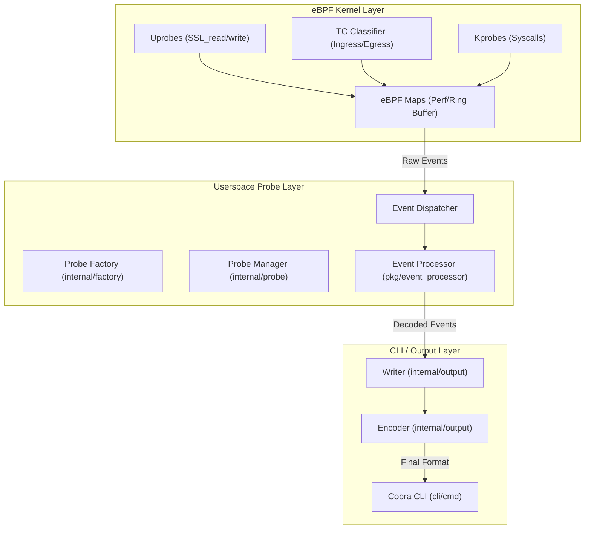
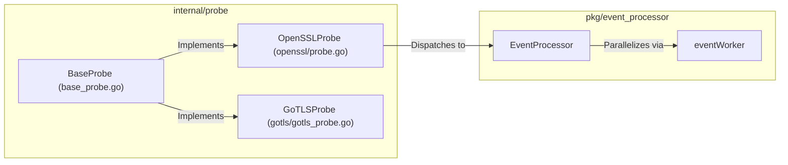

# Three-layer Architecture

Relevant source files

The following files were used as context for generating this wiki page:

- [CHANGELOG.md](https://github.com/gojue/ecapture/blob/943a19fe/CHANGELOG.md)
- [README.md](https://github.com/gojue/ecapture/blob/943a19fe/README.md)
- [builder/Dockerfile](https://github.com/gojue/ecapture/blob/943a19fe/builder/Dockerfile)
- [builder/init_env.sh](https://github.com/gojue/ecapture/blob/943a19fe/builder/init_env.sh)
- [functions.mk](https://github.com/gojue/ecapture/blob/943a19fe/functions.mk)
- [internal/config/base_config.go](https://github.com/gojue/ecapture/blob/943a19fe/internal/config/base_config.go)
- [internal/domain/configuration.go](https://github.com/gojue/ecapture/blob/943a19fe/internal/domain/configuration.go)
- [internal/probe/base/base_probe.go](https://github.com/gojue/ecapture/blob/943a19fe/internal/probe/base/base_probe.go)
- [internal/probe/gotls/gotls_probe.go](https://github.com/gojue/ecapture/blob/943a19fe/internal/probe/gotls/gotls_probe.go)
- [internal/probe/openssl/config.go](https://github.com/gojue/ecapture/blob/943a19fe/internal/probe/openssl/config.go)
- [internal/probe/openssl/config_test.go](https://github.com/gojue/ecapture/blob/943a19fe/internal/probe/openssl/config_test.go)
- [kern/boringssl_masterkey.h](https://github.com/gojue/ecapture/blob/943a19fe/kern/boringssl_masterkey.h)
- [kern/bpf/arm64/vmlinux.h](https://github.com/gojue/ecapture/blob/943a19fe/kern/bpf/arm64/vmlinux.h)
- [kern/bpf/arm64/vmlinux_614.h](https://github.com/gojue/ecapture/blob/943a19fe/kern/bpf/arm64/vmlinux_614.h)
- [kern/bpf/bpf_core_read.h](https://github.com/gojue/ecapture/blob/943a19fe/kern/bpf/bpf_core_read.h)
- [kern/bpf/bpf_helper_defs.h](https://github.com/gojue/ecapture/blob/943a19fe/kern/bpf/bpf_helper_defs.h)
- [kern/bpf/bpf_helpers.h](https://github.com/gojue/ecapture/blob/943a19fe/kern/bpf/bpf_helpers.h)
- [kern/bpf/bpf_tracing.h](https://github.com/gojue/ecapture/blob/943a19fe/kern/bpf/bpf_tracing.h)
- [kern/bpf/x86/vmlinux.h](https://github.com/gojue/ecapture/blob/943a19fe/kern/bpf/x86/vmlinux.h)
- [kern/bpf/x86/vmlinux_614.h](https://github.com/gojue/ecapture/blob/943a19fe/kern/bpf/x86/vmlinux_614.h)
- [kern/common.h](https://github.com/gojue/ecapture/blob/943a19fe/kern/common.h)
- [kern/core_fixes.bpf.h](https://github.com/gojue/ecapture/blob/943a19fe/kern/core_fixes.bpf.h)
- [kern/ecapture.h](https://github.com/gojue/ecapture/blob/943a19fe/kern/ecapture.h)
- [kern/openssl.h](https://github.com/gojue/ecapture/blob/943a19fe/kern/openssl.h)
- [kern/openssl_masterkey.h](https://github.com/gojue/ecapture/blob/943a19fe/kern/openssl_masterkey.h)
- [kern/openssl_masterkey_3.0.h](https://github.com/gojue/ecapture/blob/943a19fe/kern/openssl_masterkey_3.0.h)
- [kern/tc.h](https://github.com/gojue/ecapture/blob/943a19fe/kern/tc.h)
- [main.go](https://github.com/gojue/ecapture/blob/943a19fe/main.go)
- [variables.mk](https://github.com/gojue/ecapture/blob/943a19fe/variables.mk)

eCapture is designed with a clear separation of concerns, organized into a three-layer architecture. This structure ensures high performance in the kernel, a robust and extensible control plane in userspace, and a flexible user interface for configuration and data consumption.

## Architectural Overview

The following diagram illustrates the relationship between the three layers and the data flow from a kernel hook to the final output.

### System Architecture and Data Flow

**Sources:**
* [main.go:6-11](https://github.com/gojue/ecapture/blob/943a19fe/main.go#L6-L11)
* [internal/probe/base/base_probe.go:1-50](https://github.com/gojue/ecapture/blob/943a19fe/internal/probe/base/base_probe.go#L1-L50)
* [kern/openssl.h:79-134](https://github.com/gojue/ecapture/blob/943a19fe/kern/openssl.h#L79-L134)

---

## 1. eBPF Kernel Layer

The kernel layer consists of C programs compiled into eBPF bytecode. These programs are the "eyes" of eCapture, executing within the Linux kernel context to intercept data at the source.

### Key Components
*   **Probes**: Programs attached to specific kernel or userspace symbols.
    *   **Uprobes**: Used for capturing plaintext from libraries like OpenSSL, GnuTLS, and GoTLS by hooking functions like `SSL_read` and `SSL_write` [kern/openssl.h:163-190](https://github.com/gojue/ecapture/blob/943a19fe/kern/openssl.h#L163-L190).
    *   **TC (Traffic Control)**: Used for `pcap` mode to capture raw network packets [kern/tc.h:136-150](https://github.com/gojue/ecapture/blob/943a19fe/kern/tc.h#L136-L150).
    *   **Kprobes**: Used for system-level auditing, such as shell command execution.
*   **Maps**: Shared memory structures used to communicate with userspace and store temporary state.
    *   `perf_event_array`: Used for high-speed event streaming to userspace [kern/openssl.h:79-92](https://github.com/gojue/ecapture/blob/943a19fe/kern/openssl.h#L79-L92).
    *   `hash_maps`: Used to track context between function entry and exit (e.g., `active_ssl_read_args_map`) [kern/openssl.h:97-102](https://github.com/gojue/ecapture/blob/943a19fe/kern/openssl.h#L97-L102).
    *   `percpu_array`: Used as a "heap" to bypass the 512-byte stack limit [kern/openssl.h:113-118](https://github.com/gojue/ecapture/blob/943a19fe/kern/openssl.h#L113-L118).

### CO-RE vs. Non-CO-RE Loading
eCapture supports two loading mechanisms to ensure compatibility across different kernel versions:

| Feature | CO-RE (Compile Once – Run Everywhere) | Non-CO-RE (Legacy) |
| :--- | :--- | :--- |
| **Requirement** | Kernel with BTF (`/sys/kernel/btf/vmlinux`) | Kernel Headers for specific version |
| **Implementation** | Uses `vmlinux.h` and `bpf_core_read` [kern/ecapture.h:18-26](https://github.com/gojue/ecapture/blob/943a19fe/kern/ecapture.h#L18-L26) | Uses system headers and fixed offsets [kern/ecapture.h:27-88](https://github.com/gojue/ecapture/blob/943a19fe/kern/ecapture.h#L27-L88) |
| **Build Target** | `make` (Default) | `make nocore` [variables.mk:241-250](https://github.com/gojue/ecapture/blob/943a19fe/variables.mk#L241-L250) |

**Sources:**
* [kern/ecapture.h:18-88](https://github.com/gojue/ecapture/blob/943a19fe/kern/ecapture.h#L18-L88)
* [kern/openssl.h:79-118](https://github.com/gojue/ecapture/blob/943a19fe/kern/openssl.h#L79-L118)
* [kern/tc.h:58-78](https://github.com/gojue/ecapture/blob/943a19fe/kern/tc.h#L58-L78)
* [variables.mk:189-214](https://github.com/gojue/ecapture/blob/943a19fe/variables.mk#L189-L214)

---

## 2. Userspace Probe Layer

The Userspace Probe Layer acts as the control plane. It is responsible for loading eBPF programs, managing their lifecycle, and processing the raw data received from the kernel.

### Code Entity Mapping
The following diagram maps the logical components of the probe layer to their specific implementations in the Go codebase.

### Lifecycle Management
The `BaseProbe` provides a template-method pattern for all modules. It handles:
1.  **Configuration Validation**: Ensuring paths and filters are correct.
2.  **eBPF Loading**: Selecting the correct `.o` bytecode based on the kernel's BTF support.
3.  **Attachment**: Linking uprobes to the correct library offsets (e.g., finding `libssl.so` and hooking `SSL_write`).
4.  **Event Dispatching**: Reading from the `perf` buffer and sending raw bytes to the `EventProcessor`.

**Sources:**
* [internal/probe/base/base_probe.go:1-50](https://github.com/gojue/ecapture/blob/943a19fe/internal/probe/base/base_probe.go#L1-L50)
* [internal/probe/gotls/gotls_probe.go:1-30](https://github.com/gojue/ecapture/blob/943a19fe/internal/probe/gotls/gotls_probe.go#L1-L30)
* [CHANGELOG.md:102-111](https://github.com/gojue/ecapture/blob/943a19fe/CHANGELOG.md#L102-L111)

---

## 3. CLI and Output Layer

The top layer manages user interaction and data formatting. It translates CLI flags into probe configurations and formats intercepted data for consumption.

### Components
*   **Cobra CLI**: Located in `cli/cmd/`, it defines the subcommands (e.g., `tls`, `gotls`, `mysqld`) and parses flags into a `Configuration` object [main.go:6-11](https://github.com/gojue/ecapture/blob/943a19fe/main.go#L6-L11).
*   **Writers**: Located in `internal/output/`, these handle the destination of the data, such as `StdoutWriter`, `FileWriter`, or the `eCaptureQ` WebSocket pusher [CHANGELOG.md:116-119](https://github.com/gojue/ecapture/blob/943a19fe/CHANGELOG.md#L116-L119).
*   **Encoders**: Transform internal event structures into specific formats:
    *   **Text**: Human-readable console output.
    *   **JSON**: Structured data for integration.
    *   **Pcapng**: Wireshark-compatible packet captures [CHANGELOG.md:117-118](https://github.com/gojue/ecapture/blob/943a19fe/CHANGELOG.md#L117-L118).

### Data Path Trace
1.  **Hook**: `SSL_write` is called in a target process.
2.  **Kernel**: The eBPF uprobe [kern/openssl.h:163](https://github.com/gojue/ecapture/blob/943a19fe/kern/openssl.h#L163) triggers, reads the buffer via `bpf_probe_read_user`, and pushes a `ssl_data_event_t` [kern/openssl.h:28-39](https://github.com/gojue/ecapture/blob/943a19fe/kern/openssl.h#L28-L39) to the `tls_events` map.
3.  **Userspace**: The `Probe` module's dispatcher reads the event from the perf buffer.
4.  **Processor**: The `EventProcessor` identifies the protocol (e.g., HTTP/2) and associates it with a connection UUID.
5.  **Output**: The `Writer` sends the formatted string (Text/JSON) to the user's terminal or a file.

**Sources:**
* [main.go:6-11](https://github.com/gojue/ecapture/blob/943a19fe/main.go#L6-L11)
* [kern/openssl.h:28-39, 163-190]()
* [CHANGELOG.md:116-119](https://github.com/gojue/ecapture/blob/943a19fe/CHANGELOG.md#L116-L119)
* [README.md:114-153](https://github.com/gojue/ecapture/blob/943a19fe/README.md#L114-L153)