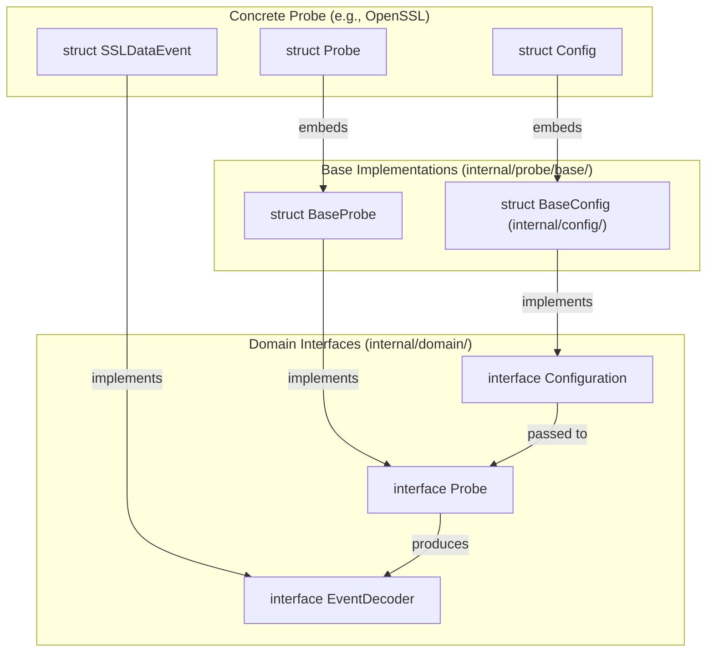
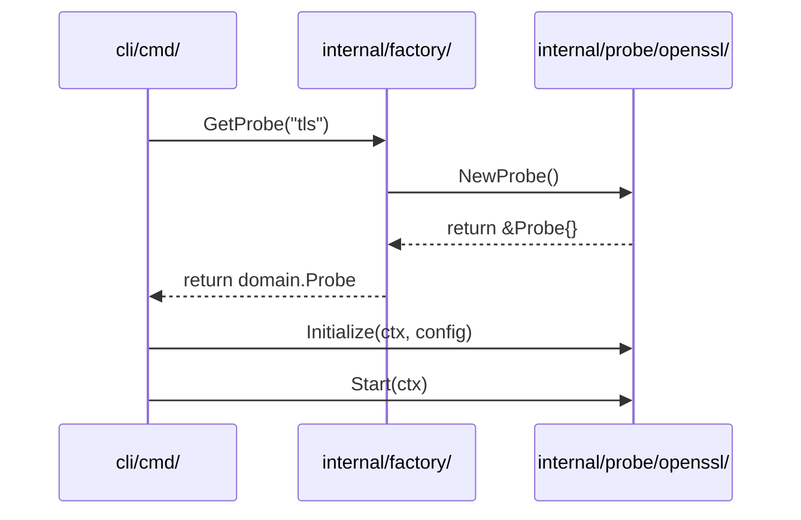

# Probe Framework and Extension Mechanism

Relevant source files

The following files were used as context for generating this wiki page:

- [.github/agents/pr-agent.md](https://github.com/gojue/ecapture/blob/943a19fe/.github/agents/pr-agent.md)
- [docs/refactoring-guide.md](https://github.com/gojue/ecapture/blob/943a19fe/docs/refactoring-guide.md)
- [internal/config/base_config.go](https://github.com/gojue/ecapture/blob/943a19fe/internal/config/base_config.go)
- [internal/domain/configuration.go](https://github.com/gojue/ecapture/blob/943a19fe/internal/domain/configuration.go)
- [internal/domain/perf_event.go](https://github.com/gojue/ecapture/blob/943a19fe/internal/domain/perf_event.go)
- [internal/probe/base/base_probe.go](https://github.com/gojue/ecapture/blob/943a19fe/internal/probe/base/base_probe.go)
- [internal/probe/base/perf_reorder.go](https://github.com/gojue/ecapture/blob/943a19fe/internal/probe/base/perf_reorder.go)
- [internal/probe/base/perf_reorder_test.go](https://github.com/gojue/ecapture/blob/943a19fe/internal/probe/base/perf_reorder_test.go)
- [internal/probe/bash/bash_probe.go](https://github.com/gojue/ecapture/blob/943a19fe/internal/probe/bash/bash_probe.go)
- [internal/probe/gotls/config_iface.go](https://github.com/gojue/ecapture/blob/943a19fe/internal/probe/gotls/config_iface.go)
- [internal/probe/gotls/config_iface_test.go](https://github.com/gojue/ecapture/blob/943a19fe/internal/probe/gotls/config_iface_test.go)
- [internal/probe/gotls/gotls_probe.go](https://github.com/gojue/ecapture/blob/943a19fe/internal/probe/gotls/gotls_probe.go)
- [internal/probe/mysql/mysql_probe.go](https://github.com/gojue/ecapture/blob/943a19fe/internal/probe/mysql/mysql_probe.go)
- [internal/probe/openssl/config.go](https://github.com/gojue/ecapture/blob/943a19fe/internal/probe/openssl/config.go)
- [internal/probe/openssl/config_ecandroid.go](https://github.com/gojue/ecapture/blob/943a19fe/internal/probe/openssl/config_ecandroid.go)
- [internal/probe/openssl/config_iface.go](https://github.com/gojue/ecapture/blob/943a19fe/internal/probe/openssl/config_iface.go)
- [internal/probe/openssl/config_iface_test.go](https://github.com/gojue/ecapture/blob/943a19fe/internal/probe/openssl/config_iface_test.go)
- [internal/probe/openssl/config_linux.go](https://github.com/gojue/ecapture/blob/943a19fe/internal/probe/openssl/config_linux.go)
- [internal/probe/openssl/config_test.go](https://github.com/gojue/ecapture/blob/943a19fe/internal/probe/openssl/config_test.go)
- [internal/probe/openssl/openssl_probe.go](https://github.com/gojue/ecapture/blob/943a19fe/internal/probe/openssl/openssl_probe.go)
- [internal/probe/postgres/postgres_probe.go](https://github.com/gojue/ecapture/blob/943a19fe/internal/probe/postgres/postgres_probe.go)
- [internal/probe/zsh/zsh_probe.go](https://github.com/gojue/ecapture/blob/943a19fe/internal/probe/zsh/zsh_probe.go)
- [test/e2e/android/android_tls_e2e_test.sh](https://github.com/gojue/ecapture/blob/943a19fe/test/e2e/android/android_tls_e2e_test.sh)

This page documents the internal framework used by eCapture to manage eBPF probes. It defines the interfaces, base templates, and registration patterns that allow eCapture to support multiple capture targets (TLS, Databases, Shells) across different platforms (Linux, Android) and kernel modes (CO-RE, non-CO-RE).

## Core Interfaces and Contracts

The framework is built upon a set of domain interfaces defined in `internal/domain/`. These interfaces establish the contract between the CLI control plane and the probe implementations.

### Configuration Contract
Every probe must have a configuration object that implements the `Configuration` interface. This ensures that common settings like PID filtering, UID filtering, and BTF modes are handled consistently.

[internal/domain/configuration.go:20-77](https://github.com/gojue/ecapture/blob/943a19fe/internal/domain/configuration.go#L20-L77)

| Method | Purpose |
| :--- | :--- |
| `Validate()` | Ensures probe-specific settings (e.g., library paths) are correct. |
| `GetBTF()` | Returns the BTF mode (Auto, CO-RE, or Non-CO-RE). |
| `GetPid()` / `GetUid()` | Provides the target filters for the eBPF programs. |
| `GetPerfReorder()` | Returns settings for userland event reordering by timestamp. |

### Probe and Event Contracts
The `Probe` interface defines the lifecycle of an eBPF-based capture module, while `EventDecoder` defines how raw bytes from the kernel are transformed into structured Go objects.

[internal/domain/probe.go:20-42](https://github.com/gojue/ecapture/blob/943a19fe/internal/domain/probe.go#L20-L42)
[internal/domain/event.go:20-43](https://github.com/gojue/ecapture/blob/943a19fe/internal/domain/event.go#L20-L43)

## Base Classes and Inheritance

To reduce boilerplate, eCapture provides base implementations for configurations and probes.

### BaseConfig
The `BaseConfig` struct in `internal/config/` provides the standard fields for every probe, such as `Pid`, `Uid`, and `BtfMode`.

[internal/config/base_config.go:45-66](https://github.com/gojue/ecapture/blob/943a19fe/internal/config/base_config.go#L45-L66)

### BaseProbe (Template Method Pattern)
The `BaseProbe` in `internal/probe/base/` implements the standard lifecycle of a probe. It handles logger initialization, dispatcher setup, and the management of perf/ring buffer readers.

[internal/probe/base/base_probe.go:46-56](https://github.com/gojue/ecapture/blob/943a19fe/internal/probe/base/base_probe.go#L46-L56)

**Lifecycle Sequence:**
1.  **Initialize**: Sets up the `EventDispatcher` and registers output writers (e.g., Text, PCAP). [internal/probe/base/base_probe.go:73-135](https://github.com/gojue/ecapture/blob/943a19fe/internal/probe/base/base_probe.go#L73-L135)
2.  **Start**: Transitions the probe to a running state. [internal/probe/base/base_probe.go:139-147](https://github.com/gojue/ecapture/blob/943a19fe/internal/probe/base/base_probe.go#L139-L147)
3.  **Stop**: Gracefully halts capture. [internal/probe/base/base_probe.go:150-158](https://github.com/gojue/ecapture/blob/943a19fe/internal/probe/base/base_probe.go#L150-L158)
4.  **Close**: Releases all resources, closes eBPF maps, and waits for reader goroutines to exit. [internal/probe/base/base_probe.go:173-215](https://github.com/gojue/ecapture/blob/943a19fe/internal/probe/base/base_probe.go#L173-L215)

### Sources:
- [internal/domain/configuration.go:20-77](https://github.com/gojue/ecapture/blob/943a19fe/internal/domain/configuration.go#L20-L77)
- [internal/config/base_config.go:45-66](https://github.com/gojue/ecapture/blob/943a19fe/internal/config/base_config.go#L45-L66)
- [internal/probe/base/base_probe.go:46-215](https://github.com/gojue/ecapture/blob/943a19fe/internal/probe/base/base_probe.go#L46-L215)

## Data Flow Architecture

The following diagram illustrates the relationship between the domain interfaces and their concrete implementations during the lifecycle of a probe.

### Probe Framework Entity Map
Title: Entity Relationship and Data Flow

Sources: [internal/domain/configuration.go:20-77](https://github.com/gojue/ecapture/blob/943a19fe/internal/domain/configuration.go#L20-L77), [internal/probe/base/base_probe.go:46-56](https://github.com/gojue/ecapture/blob/943a19fe/internal/probe/base/base_probe.go#L46-L56), [internal/probe/openssl/openssl_probe.go:45-58](https://github.com/gojue/ecapture/blob/943a19fe/internal/probe/openssl/openssl_probe.go#L45-L58)

## Factory Registration Pattern

eCapture uses a factory pattern in `internal/factory/` to decouple the CLI from specific probe implementations. This allows the CLI to instantiate probes by a string identifier (e.g., "tls", "gotls").

### Implementation in Concrete Probes
Each probe typically provides a `NewProbe()` function that returns an initialized instance.

[internal/probe/openssl/openssl_probe.go:61-68](https://github.com/gojue/ecapture/blob/943a19fe/internal/probe/openssl/openssl_probe.go#L61-L68)
[internal/probe/gotls/gotls_probe.go:70-77](https://github.com/gojue/ecapture/blob/943a19fe/internal/probe/gotls/gotls_probe.go#L70-L77)

### Factory Logic
The factory maintains a registry of available probe types. When a user runs a command like `ecapture tls`, the factory retrieves the corresponding probe constructor.

Title: Factory Registration and Initialization

Sources: [internal/factory/factory.go:1-50](https://github.com/gojue/ecapture/blob/943a19fe/internal/factory/factory.go#L1-L50), [internal/probe/openssl/openssl_probe.go:61-98](https://github.com/gojue/ecapture/blob/943a19fe/internal/probe/openssl/openssl_probe.go#L61-L98)

## Extension Mechanism: Adding a New Probe

The framework is designed for easy extension. Adding a new probe (e.g., for a new database or protocol) involves:

1.  **Define Configuration**: Create a struct that embeds `config.BaseConfig`.
2.  **Define Events**: Create structs that implement `domain.EventDecoder` to parse the eBPF data.
3.  **Implement Probe**: Create a struct that embeds `base.BaseProbe`.
    *   Implement `setupManager()` to define eBPF programs and maps using `ebpfmanager`. [internal/probe/gotls/gotls_probe.go:229-250](https://github.com/gojue/ecapture/blob/943a19fe/internal/probe/gotls/gotls_probe.go#L229-L250)
    *   Implement `Start()` to load bytecode and start perf readers. [internal/probe/gotls/gotls_probe.go:106-153](https://github.com/gojue/ecapture/blob/943a19fe/internal/probe/gotls/gotls_probe.go#L106-L153)
4.  **Register with Factory**: Add the new probe type to `internal/factory/`.

### Bytecode Selection
The `BaseProbe` provides a helper `GetBPFName` which automatically appends `_core.o` or `_noncore.o` based on the user's configuration and kernel support.

[internal/probe/base/base_probe.go:161-171](https://github.com/gojue/ecapture/blob/943a19fe/internal/probe/base/base_probe.go#L161-L171)

### Sources:
- [internal/probe/openssl/openssl_probe.go:45-159](https://github.com/gojue/ecapture/blob/943a19fe/internal/probe/openssl/openssl_probe.go#L45-L159)
- [internal/probe/gotls/gotls_probe.go:52-153](https://github.com/gojue/ecapture/blob/943a19fe/internal/probe/gotls/gotls_probe.go#L52-L153)
- [internal/probe/base/base_probe.go:161-171](https://github.com/gojue/ecapture/blob/943a19fe/internal/probe/base/base_probe.go#L161-L171)
- [.github/agents/pr-agent.md:100-125](https://github.com/gojue/ecapture/blob/943a19fe/.github/agents/pr-agent.md#L100-L125)