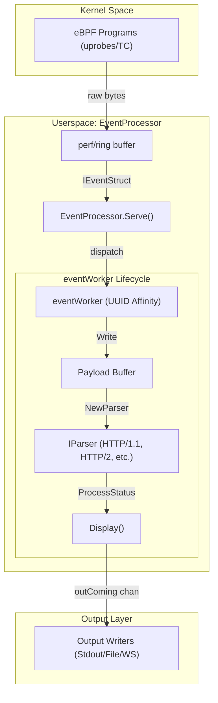
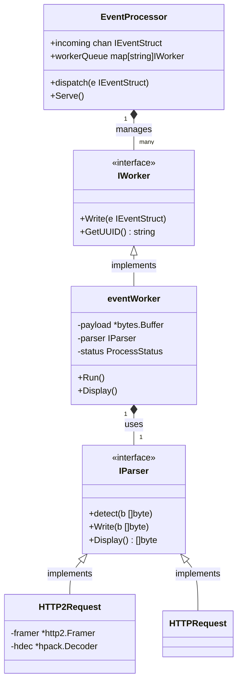

# Event Processing Pipeline

Relevant source files

The following files were used as context for generating this wiki page:

- [.gitignore](https://github.com/gojue/ecapture/blob/943a19fe/.gitignore)
- [cli/cmd/root.go](https://github.com/gojue/ecapture/blob/943a19fe/cli/cmd/root.go)
- [pkg/event_processor/base_event.go](https://github.com/gojue/ecapture/blob/943a19fe/pkg/event_processor/base_event.go)
- [pkg/event_processor/http2_request.go](https://github.com/gojue/ecapture/blob/943a19fe/pkg/event_processor/http2_request.go)
- [pkg/event_processor/http2_request_test.go](https://github.com/gojue/ecapture/blob/943a19fe/pkg/event_processor/http2_request_test.go)
- [pkg/event_processor/http2_response.go](https://github.com/gojue/ecapture/blob/943a19fe/pkg/event_processor/http2_response.go)
- [pkg/event_processor/http2_response_test.go](https://github.com/gojue/ecapture/blob/943a19fe/pkg/event_processor/http2_response_test.go)
- [pkg/event_processor/http_request.go](https://github.com/gojue/ecapture/blob/943a19fe/pkg/event_processor/http_request.go)
- [pkg/event_processor/http_response.go](https://github.com/gojue/ecapture/blob/943a19fe/pkg/event_processor/http_response.go)
- [pkg/event_processor/http_response_test.go](https://github.com/gojue/ecapture/blob/943a19fe/pkg/event_processor/http_response_test.go)
- [pkg/event_processor/iparser.go](https://github.com/gojue/ecapture/blob/943a19fe/pkg/event_processor/iparser.go)
- [pkg/event_processor/iworker.go](https://github.com/gojue/ecapture/blob/943a19fe/pkg/event_processor/iworker.go)
- [pkg/event_processor/processor.go](https://github.com/gojue/ecapture/blob/943a19fe/pkg/event_processor/processor.go)
- [pkg/event_processor/processor_test.go](https://github.com/gojue/ecapture/blob/943a19fe/pkg/event_processor/processor_test.go)
- [pkg/event_processor/testdata/all.json](https://github.com/gojue/ecapture/blob/943a19fe/pkg/event_processor/testdata/all.json)
- [pkg/util/ebpf/bpf.go](https://github.com/gojue/ecapture/blob/943a19fe/pkg/util/ebpf/bpf.go)
- [pkg/util/ebpf/bpf_linux.go](https://github.com/gojue/ecapture/blob/943a19fe/pkg/util/ebpf/bpf_linux.go)
- [pkg/util/ebpf/bpf_test.go](https://github.com/gojue/ecapture/blob/943a19fe/pkg/util/ebpf/bpf_test.go)

The Event Processing Pipeline in eCapture is responsible for the reassembly, protocol identification, and formatting of raw data events captured from the eBPF kernel space. It transforms fragmented bytes into structured, human-readable or machine-parsable logs while maintaining the order of events per connection.

## Pipeline Overview

The pipeline operates as a multi-stage scheduling system. Events are ingested from the eBPF perf/ring buffers, dispatched to dedicated workers based on connection affinity, parsed using protocol-specific state machines, and finally emitted through configured output writers.

### Data Flow Diagram

The following diagram illustrates the transition of data from the kernel through the userspace processing entities.

"Event Processing Flow"

Sources: [pkg/event_processor/processor.go:64-87](https://github.com/gojue/ecapture/blob/943a19fe/pkg/event_processor/processor.go#L64-L87), [pkg/event_processor/iworker.go:261-280](https://github.com/gojue/ecapture/blob/943a19fe/pkg/event_processor/iworker.go#L261-L280)

---

## EventProcessor Scheduling Loop

The `EventProcessor` is the central hub for event management. It runs a continuous loop in its `Serve()` method to handle incoming events and manage the lifecycle of workers.

### Key Responsibilities
1.  **Ingestion**: Receives `IEventStruct` objects from the `incoming` channel [pkg/event_processor/processor.go:68](https://github.com/gojue/ecapture/blob/943a19fe/pkg/event_processor/processor.go#L68).
2.  **Dispatching**: Uses `dispatch()` to route events to the correct `IWorker` based on a unique UUID [pkg/event_processor/processor.go:89-107](https://github.com/gojue/ecapture/blob/943a19fe/pkg/event_processor/processor.go#L89-L107).
3.  **Connection Management**: Monitors `destroyConn` to clean up workers when a socket is closed [pkg/event_processor/processor.go:78-79](https://github.com/gojue/ecapture/blob/943a19fe/pkg/event_processor/processor.go#L78-L79).
4.  **Output Aggregation**: Collects processed byte slices from `outComing` and writes them to the final `logger` [pkg/event_processor/processor.go:80-81](https://github.com/gojue/ecapture/blob/943a19fe/pkg/event_processor/processor.go#L80-L81).

Sources: [pkg/event_processor/processor.go:28-61](https://github.com/gojue/ecapture/blob/943a19fe/pkg/event_processor/processor.go#L28-L61)

---

## eventWorker and UUID Affinity

To ensure in-order processing of traffic for a specific connection (e.g., a single TLS session), eCapture uses **UUID Affinity**.

### UUID Construction
The UUID is generated from the event metadata to uniquely identify a stream:
`PID_TID_COMM_FD_DATATYPE`
[pkg/event_processor/base_event.go:122-124](https://github.com/gojue/ecapture/blob/943a19fe/pkg/event_processor/base_event.go#L122-L124)

### Worker Lifecycle
Each `eventWorker` represents a single stream of events.
*   **Affinity**: The `EventProcessor` maintains a `workerQueue` map where the key is the UUID [pkg/event_processor/processor.go:60](https://github.com/gojue/ecapture/blob/943a19fe/pkg/event_processor/processor.go#L60).
*   **In-Order Execution**: Each worker runs its own `Run()` goroutine, ensuring that packets for the same connection are processed sequentially [pkg/event_processor/iworker.go:93-95](https://github.com/gojue/ecapture/blob/943a19fe/pkg/event_processor/iworker.go#L93-L95).
*   **Timeout Reclamation**: A `ticker` (default 100ms) triggers the worker to check if data should be flushed or if the worker should be destroyed due to inactivity [pkg/event_processor/iworker.go:125](https://github.com/gojue/ecapture/blob/943a19fe/pkg/event_processor/iworker.go#L125).

Sources: [pkg/event_processor/iworker.go:69-88](https://github.com/gojue/ecapture/blob/943a19fe/pkg/event_processor/iworker.go#L69-L88), [pkg/event_processor/processor.go:128-140](https://github.com/gojue/ecapture/blob/943a19fe/pkg/event_processor/processor.go#L128-L140)

---

## Protocol Identification (IParser)

The `IParser` interface defines how raw payloads are identified and parsed. When a worker receives the first data for a stream, it uses `NewParser()` to identify the protocol.

### Supported Parsers
| Parser Name | Protocol | Detection Logic |
| :--- | :--- | :--- |
| `HTTPRequest` | HTTP/1.1 Request | Uses `http.ReadRequest` [pkg/event_processor/http_request.go:83-92](https://github.com/gojue/ecapture/blob/943a19fe/pkg/event_processor/http_request.go#L83-L92) |
| `HTTPResponse` | HTTP/1.1 Response | Uses `http.ReadResponse` [pkg/event_processor/http_response.go:94-102](https://github.com/gojue/ecapture/blob/943a19fe/pkg/event_processor/http_response.go#L94-L102) |
| `HTTP2Request` | HTTP/2 Request | Checks for `PRI * HTTP/2.0\r\n\r\nSM\r\n\r\n` [pkg/event_processor/http2_request.go:42-59](https://github.com/gojue/ecapture/blob/943a19fe/pkg/event_processor/http2_request.go#L42-L59) |
| `HTTP2Response` | HTTP/2 Response | Validates HTTP/2 Frame Header (9 octets) [pkg/event_processor/http2_response.go:56-88](https://github.com/gojue/ecapture/blob/943a19fe/pkg/event_processor/http2_response.go#L56-L88) |
| `DefaultParser` | Unknown/Plaintext | Fallback that performs a hex dump or C-string conversion [pkg/event_processor/iparser.go:117-161](https://github.com/gojue/ecapture/blob/943a19fe/pkg/event_processor/iparser.go#L117-L161) |

### ProcessStatus State Machine
The parsing state is tracked via `ProcessStatus`:
1.  `ProcessStateInit`: Initial state or after a reset [pkg/event_processor/iparser.go:28](https://github.com/gojue/ecapture/blob/943a19fe/pkg/event_processor/iparser.go#L28).
2.  `ProcessStateProcessing`: Actively writing bytes into the parser's buffer [pkg/event_processor/iparser.go:29](https://github.com/gojue/ecapture/blob/943a19fe/pkg/event_processor/iparser.go#L29).
3.  `ProcessStateDone`: Protocol identification and data extraction complete [pkg/event_processor/iparser.go:30](https://github.com/gojue/ecapture/blob/943a19fe/pkg/event_processor/iparser.go#L30).

Sources: [pkg/event_processor/iparser.go:49-60](https://github.com/gojue/ecapture/blob/943a19fe/pkg/event_processor/iparser.go#L49-L60), [pkg/event_processor/iparser.go:85-115](https://github.com/gojue/ecapture/blob/943a19fe/pkg/event_processor/iparser.go#L85-L115)

---

## Code Entity Association

This diagram maps the logical processing steps to the specific Go structs and interfaces in the `pkg/event_processor` package.

"Pipeline Entity Mapping"

Sources: [pkg/event_processor/processor.go:28-48](https://github.com/gojue/ecapture/blob/943a19fe/pkg/event_processor/processor.go#L28-L48), [pkg/event_processor/iworker.go:34-48](https://github.com/gojue/ecapture/blob/943a19fe/pkg/event_processor/iworker.go#L34-L48), [pkg/event_processor/iparser.go:49-60](https://github.com/gojue/ecapture/blob/943a19fe/pkg/event_processor/iparser.go#L49-L60)

---

## Final Output and Truncation

Before data is sent to the output writers, the pipeline applies final transformations:

1.  **Truncation**: If `--tsize` is set, the `eventWorker` will truncate the payload buffer once it reaches the specified limit [pkg/event_processor/iworker.go:235-241](https://github.com/gojue/ecapture/blob/943a19fe/pkg/event_processor/iworker.go#L235-L241).
2.  **Formatting**: Depending on the configuration, data is formatted as a text string (with PID, Comm, and IP metadata) or serialized into a Protobuf `LogEntry` [pkg/event_processor/iworker.go:197-226](https://github.com/gojue/ecapture/blob/943a19fe/pkg/event_processor/iworker.go#L197-L226).
3.  **Hex Encoding**: If `--hex` is enabled, the final byte slice is converted to a hex dump before being sent to the `outComing` channel [pkg/event_processor/iworker.go:191-193](https://github.com/gojue/ecapture/blob/943a19fe/pkg/event_processor/iworker.go#L191-L193).

Sources: [pkg/event_processor/iworker.go:174-227](https://github.com/gojue/ecapture/blob/943a19fe/pkg/event_processor/iworker.go#L174-L227), [cli/cmd/root.go:162-175](https://github.com/gojue/ecapture/blob/943a19fe/cli/cmd/root.go#L162-L175)