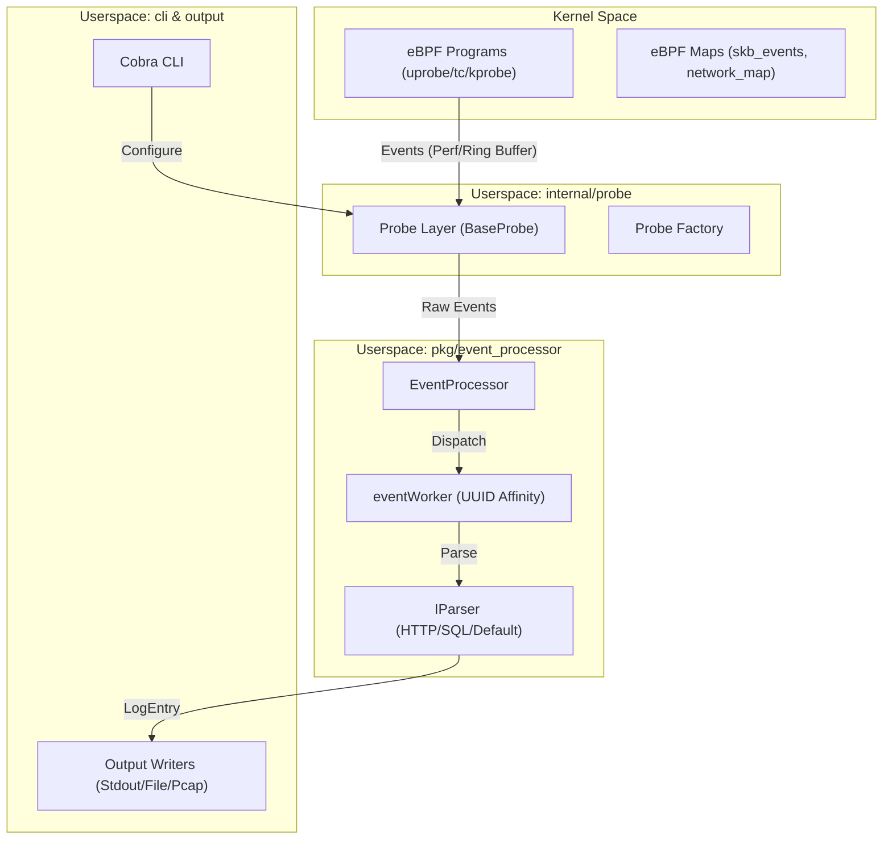
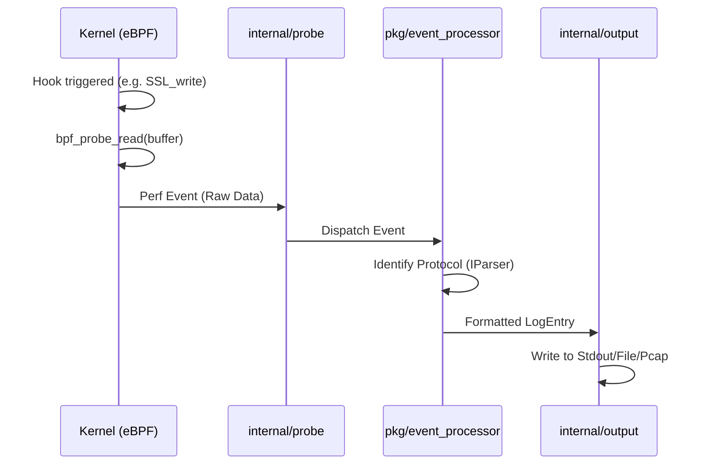

# Architecture

Relevant source files

The following files were used as context for generating this wiki page:

- [CHANGELOG.md](https://github.com/gojue/ecapture/blob/943a19fe/CHANGELOG.md)
- [README.md](https://github.com/gojue/ecapture/blob/943a19fe/README.md)
- [kern/bpf/arm64/vmlinux.h](https://github.com/gojue/ecapture/blob/943a19fe/kern/bpf/arm64/vmlinux.h)
- [kern/bpf/arm64/vmlinux_614.h](https://github.com/gojue/ecapture/blob/943a19fe/kern/bpf/arm64/vmlinux_614.h)
- [kern/bpf/bpf_core_read.h](https://github.com/gojue/ecapture/blob/943a19fe/kern/bpf/bpf_core_read.h)
- [kern/bpf/bpf_helper_defs.h](https://github.com/gojue/ecapture/blob/943a19fe/kern/bpf/bpf_helper_defs.h)
- [kern/bpf/bpf_helpers.h](https://github.com/gojue/ecapture/blob/943a19fe/kern/bpf/bpf_helpers.h)
- [kern/bpf/bpf_tracing.h](https://github.com/gojue/ecapture/blob/943a19fe/kern/bpf/bpf_tracing.h)
- [kern/bpf/x86/vmlinux.h](https://github.com/gojue/ecapture/blob/943a19fe/kern/bpf/x86/vmlinux.h)
- [kern/bpf/x86/vmlinux_614.h](https://github.com/gojue/ecapture/blob/943a19fe/kern/bpf/x86/vmlinux_614.h)
- [kern/common.h](https://github.com/gojue/ecapture/blob/943a19fe/kern/common.h)
- [kern/core_fixes.bpf.h](https://github.com/gojue/ecapture/blob/943a19fe/kern/core_fixes.bpf.h)
- [kern/ecapture.h](https://github.com/gojue/ecapture/blob/943a19fe/kern/ecapture.h)
- [kern/tc.h](https://github.com/gojue/ecapture/blob/943a19fe/kern/tc.h)
- [main.go](https://github.com/gojue/ecapture/blob/943a19fe/main.go)

eCapture is built on a modular, three-layer architecture designed to bridge high-performance eBPF kernel instrumentation with a flexible userspace processing pipeline. This design allows developers to extend the tool with new probes while maintaining a consistent data path for event processing and output.

## System Overview

The following diagram illustrates the high-level relationship between the kernel-space eBPF programs and the userspace Go components.

### High-Level Component Interaction

**Sources:** [main.go:9-11](https://github.com/gojue/ecapture/blob/943a19fe/main.go#L9-L11), [kern/tc.h:58-78](https://github.com/gojue/ecapture/blob/943a19fe/kern/tc.h#L58-L78), [README.md:94-103](https://github.com/gojue/ecapture/blob/943a19fe/README.md#L94-L103)

---

## Architectural Layers

The system is divided into three primary functional layers:

### 1. eBPF Kernel Layer
This layer consists of C programs compiled into eBPF bytecode. It performs the actual interception of data at the kernel level using `uprobes` (for user-space libraries like OpenSSL), `kprobes`, or `TC` (Traffic Control) classifiers. 
*   **Bytecode Management:** eBPF assets are stored in `ebpfassets/` and can be loaded in CO-RE (Compile Once – Run Everywhere) mode using BTF or non-CO-RE mode for older kernels.
*   **Data Capture:** Programs use helpers like `bpf_probe_read` [kern/bpf/bpf_helper_defs.h:110](https://github.com/gojue/ecapture/blob/943a19fe/kern/bpf/bpf_helper_defs.h#L110) to extract plaintext from memory before encryption or after decryption.

For details, see [Three-layer Architecture](7.1-three-layer-architecture.md).

### 2. Userspace Probe Layer
Located in `internal/probe/`, this layer manages the lifecycle of eBPF programs. It handles:
*   **Discovery:** Finding the target shared libraries (e.g., `libssl.so`) on the host system [README.md:108-112](https://github.com/gojue/ecapture/blob/943a19fe/README.md#L108-L112).
*   **Loading:** Using the `BaseProbe` template to load bytecode and attach hooks to specific function symbols (e.g., `SSL_write`).
*   **Configuration:** Validating CLI arguments via the `BaseConfig` structure.

For details, see [Probe Framework and Extension Mechanism](7.2-probe-framework-and-extension-mechanism.md).

### 3. Event Processing & Output Layer
Once data leaves the kernel via Perf or Ring buffers, it enters the `pkg/event_processor` pipeline.
*   **Ordering:** The `eventWorker` ensures that packets belonging to the same connection (identified by a UUID) are processed in the correct sequence [CHANGELOG.md:5](https://github.com/gojue/ecapture/blob/943a19fe/CHANGELOG.md#L5).
*   **Parsing:** Protocol-specific parsers (HTTP/1.1, HTTP/2, MySQL) reconstruct high-level application data.
*   **Delivery:** Final data is encoded (JSON/Text/Protobuf) and sent to configured writers like `Stdout`, `PcapWriter`, or the `eCaptureQ` WebSocket server.

For details, see [Event Processing Pipeline](7.3-event-processing-pipeline.md).

---

## Core Data Structures

To understand the data flow, developers should be familiar with the following entities defined in the kernel and userspace headers:

| Entity | Location | Description |
| :--- | :--- | :--- |
| `skb_data_event_t` | [kern/tc.h:30-37](https://github.com/gojue/ecapture/blob/943a19fe/kern/tc.h#L30-L37) | Metadata for network packets captured via TC hooks. |
| `net_id_t` | [kern/tc.h:39-47](https://github.com/gojue/ecapture/blob/943a19fe/kern/tc.h#L39-L47) | Connection tuple (IP/Port/Protocol) used for session tracking. |
| `skb_events` | [kern/tc.h:58-63](https://github.com/gojue/ecapture/blob/943a19fe/kern/tc.h#L58-L63) | The BPF Perf Event Array map used to stream data to userspace. |
| `LogEntry` | `pkg/ecaptureq/` | The standard Protobuf message format for remote streaming. |

### Event Flow: Kernel to CLI

**Sources:** [kern/tc.h:136-150](https://github.com/gojue/ecapture/blob/943a19fe/kern/tc.h#L136-L150), [CHANGELOG.md:103-111](https://github.com/gojue/ecapture/blob/943a19fe/CHANGELOG.md#L103-L111), [README.md:114-119](https://github.com/gojue/ecapture/blob/943a19fe/README.md#L114-L119)

---

## Chapter Index

*   **[Three-layer Architecture](7.1-three-layer-architecture.md)**: Deep dive into the Kernel, Probe, and CLI layers.
*   **[Probe Framework and Extension Mechanism](7.2-probe-framework-and-extension-mechanism.md)**: How to use the `BaseProbe` and factory patterns to add new capabilities.
*   **[Event Processing Pipeline](7.3-event-processing-pipeline.md)**: Detailed look at the worker pool, UUID affinity, and protocol parsing.