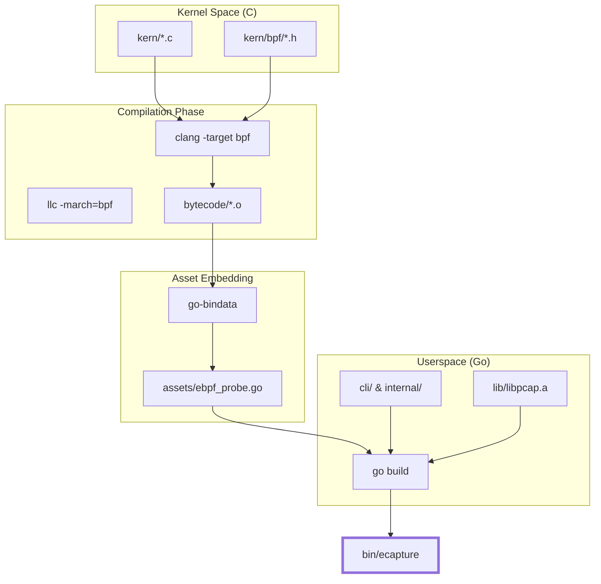
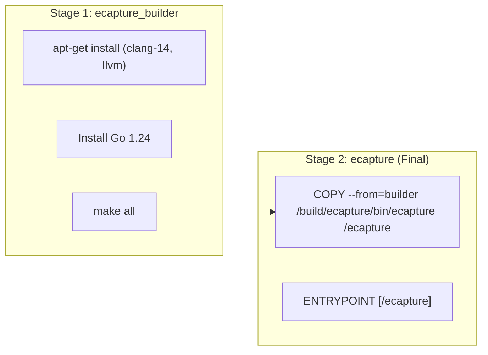

# Compilation and Build

<details>
<summary>Relevant source files</summary>

The following files were used as context for generating this wiki page:

- [.github/workflows/go-c-cpp.yml](https://github.com/gojue/ecapture/blob/943a19fe/.github/workflows/go-c-cpp.yml)
- [.github/workflows/release.yml](https://github.com/gojue/ecapture/blob/943a19fe/.github/workflows/release.yml)
- [Makefile](https://github.com/gojue/ecapture/blob/943a19fe/Makefile)
- [builder/Dockerfile](https://github.com/gojue/ecapture/blob/943a19fe/builder/Dockerfile)
- [builder/Makefile.release](https://github.com/gojue/ecapture/blob/943a19fe/builder/Makefile.release)
- [builder/init_env.sh](https://github.com/gojue/ecapture/blob/943a19fe/builder/init_env.sh)
- [functions.mk](https://github.com/gojue/ecapture/blob/943a19fe/functions.mk)
- [go.mod](https://github.com/gojue/ecapture/blob/943a19fe/go.mod)
- [go.sum](https://github.com/gojue/ecapture/blob/943a19fe/go.sum)
- [kern/bpf/arm64/vmlinux.h](https://github.com/gojue/ecapture/blob/943a19fe/kern/bpf/arm64/vmlinux.h)
- [kern/bpf/arm64/vmlinux_614.h](https://github.com/gojue/ecapture/blob/943a19fe/kern/bpf/arm64/vmlinux_614.h)
- [kern/bpf/bpf_core_read.h](https://github.com/gojue/ecapture/blob/943a19fe/kern/bpf/bpf_core_read.h)
- [kern/bpf/bpf_helper_defs.h](https://github.com/gojue/ecapture/blob/943a19fe/kern/bpf/bpf_helper_defs.h)
- [kern/bpf/bpf_helpers.h](https://github.com/gojue/ecapture/blob/943a19fe/kern/bpf/bpf_helpers.h)
- [kern/bpf/bpf_tracing.h](https://github.com/gojue/ecapture/blob/943a19fe/kern/bpf/bpf_tracing.h)
- [kern/bpf/x86/vmlinux.h](https://github.com/gojue/ecapture/blob/943a19fe/kern/bpf/x86/vmlinux.h)
- [kern/bpf/x86/vmlinux_614.h](https://github.com/gojue/ecapture/blob/943a19fe/kern/bpf/x86/vmlinux_614.h)
- [kern/core_fixes.bpf.h](https://github.com/gojue/ecapture/blob/943a19fe/kern/core_fixes.bpf.h)
- [variables.mk](https://github.com/gojue/ecapture/blob/943a19fe/variables.mk)

</details>


This page provides detailed technical instructions for compiling eCapture from source. eCapture utilizes a complex build system that coordinates Go for the userspace control plane and C for the eBPF kernel programs. It supports both CO-RE (Compile Once – Run Everywhere) and non-CO-RE builds to ensure compatibility across a wide range of Linux kernel versions and architectures, including Android GKI.

## Build Architecture Overview

The build process is managed by a multi-layered Makefile system that handles dependency checking, eBPF bytecode generation, asset embedding, and final binary linking.

### Build Flow Diagram

The following diagram illustrates the data flow from source code to the final `ecapture` binary.

"eCapture Build Pipeline"

Sources: [Makefile:6-7](https://github.com/gojue/ecapture/blob/943a19fe/Makefile#L6-L7), [Makefile:162-165](https://github.com/gojue/ecapture/blob/943a19fe/Makefile#L162-L165), [Makefile:189-193](https://github.com/gojue/ecapture/blob/943a19fe/Makefile#L189-L193)

## Required Toolchain

To build eCapture, the following tools must be installed on the host system:

| Tool | Version Requirement | Purpose |
| :--- | :--- | :--- |
| **Golang** | `>= 1.24` | Compiling the userspace control plane [functions.mk:28-34](https://github.com/gojue/ecapture/blob/943a19fe/functions.mk#L28-L34). |
| **Clang** | `>= 14` (Recommended) | Compiling C code into eBPF bytecode [functions.mk:17-21](https://github.com/gojue/ecapture/blob/943a19fe/functions.mk#L17-L21). |
| **LLVM** | Matches Clang version | Required for `llc` and `llvm-strip` [variables.mk:14](https://github.com/gojue/ecapture/blob/943a19fe/variables.mk#L14). |
| **libelf-dev** | N/A | Required for eBPF program loading. |
| **libpcap** | Submodule | Static linking for pcapng output support [Makefile:177-187](https://github.com/gojue/ecapture/blob/943a19fe/Makefile#L177-L187). |
| **go-bindata** | Managed via Go | Embeds `.o` files into Go source [Makefile:164](https://github.com/gojue/ecapture/blob/943a19fe/Makefile#L164). |

### Environment Initialization
The project provides a script to automate the setup on Ubuntu systems: `builder/init_env.sh`. This script installs the necessary compilers, links the correct tool versions (e.g., `clang-14` to `clang`), and prepares the Linux kernel headers [builder/init_env.sh:72-88](https://github.com/gojue/ecapture/blob/943a19fe/builder/init_env.sh#L72-L88).

## CO-RE vs. Non-CO-RE Builds

eCapture supports two primary eBPF compilation strategies.

### 1. CO-RE (Compile Once – Run Everywhere)
*   **Mechanism**: Uses BPF Type Format (BTF) to handle kernel structure offsets dynamically at runtime.
*   **Requirement**: Target kernel must be compiled with `CONFIG_DEBUG_INFO_BTF=y`.
*   **Build Command**: `make` or `make ebpf` [Makefile:6](https://github.com/gojue/ecapture/blob/943a19fe/Makefile#L6).
*   **Implementation**: Relies on `vmlinux.h` generated from the host or provided in `kern/bpf/$(ARCH)/vmlinux.h` [variables.mk:163](https://github.com/gojue/ecapture/blob/943a19fe/variables.mk#L163).

### 2. Non-CO-RE
*   **Mechanism**: Compiles the eBPF program against specific kernel headers for the target environment.
*   **Requirement**: Requires kernel headers for the specific kernel version where eCapture will run.
*   **Build Command**: `make nocore` [Makefile:10](https://github.com/gojue/ecapture/blob/943a19fe/Makefile#L10).
*   **Use Case**: Older kernels (e.g., < 5.4) or environments without BTF support.

Sources: [Makefile:133-160](https://github.com/gojue/ecapture/blob/943a19fe/Makefile#L133-L160), [variables.mk:184](https://github.com/gojue/ecapture/blob/943a19fe/variables.mk#L184)

## Common Makefile Targets

The `Makefile` defines several key targets for different deployment scenarios:

*   **`make env`**: Displays the current build environment variables, including detected tool versions and paths [Makefile:20-63](https://github.com/gojue/ecapture/blob/943a19fe/Makefile#L20-L63).
*   **`make all`**: The default target. Builds both CO-RE and non-CO-RE bytecode and links them into a single binary [Makefile:6](https://github.com/gojue/ecapture/blob/943a19fe/Makefile#L6).
*   **`make nocore`**: Builds only the non-CO-RE version [Makefile:10](https://github.com/gojue/ecapture/blob/943a19fe/Makefile#L10).
*   **`make clean`**: Removes all generated artifacts, including bytecode, assets, and the final binary [Makefile:109-115](https://github.com/gojue/ecapture/blob/943a19fe/Makefile#L109-L115).
*   **`make android`**: A shortcut (via `ANDROID=1`) to build for the Android platform, which typically implies non-CO-RE and specific BoringSSL hooks [Makefile:95](https://github.com/gojue/ecapture/blob/943a19fe/Makefile#L95), [variables.mk:65-68](https://github.com/gojue/ecapture/blob/943a19fe/variables.mk#L65-L68).

## Cross-Compilation

eCapture supports cross-compilation between `x86_64` (amd64) and `aarch64` (arm64).

### Arm64 (Linux)
To build for arm64 on an x86_64 host:
```bash
CROSS_ARCH=arm64 make
```
The build system uses `aarch64-linux-gnu-` as the compiler prefix and sets `GOARCH=arm64` [variables.mk:123-127](https://github.com/gojue/ecapture/blob/943a19fe/variables.mk#L123-L127).

### Android
Android builds require the `ANDROID=1` flag. This adjusts the target OS and includes specific Android BoringSSL probes [variables.mk:65-68](https://github.com/gojue/ecapture/blob/943a19fe/variables.mk#L65-L68).
```bash
ANDROID=1 CROSS_ARCH=arm64 make nocore
```
Sources: [Makefile:92-95](https://github.com/gojue/ecapture/blob/943a19fe/Makefile#L92-L95), [variables.mk:111-131](https://github.com/gojue/ecapture/blob/943a19fe/variables.mk#L111-L131)

## Docker Build Environment

For a reproducible build environment, a `Dockerfile` is provided in `builder/Dockerfile`. It uses a multi-stage build:

1.  **`ecapture_builder`**: An Ubuntu 22.04 image that installs the full toolchain (Clang 14, Go 1.24, kernel sources) and compiles the project [builder/Dockerfile:1-32](https://github.com/gojue/ecapture/blob/943a19fe/builder/Dockerfile#L1-L32).
2.  **`ecapture`**: A minimal Alpine-based final image containing only the compiled binary [builder/Dockerfile:35-38](https://github.com/gojue/ecapture/blob/943a19fe/builder/Dockerfile#L35-L38).

"Docker Build Stage Mapping"

Sources: [builder/Dockerfile:1-38](https://github.com/gojue/ecapture/blob/943a19fe/builder/Dockerfile#L1-L38)

## Implementation Details: Asset Embedding

eCapture uses `go-bindata` to embed eBPF bytecode directly into the Go binary. This ensures that the tool is a single, portable executable.

1.  The eBPF C code in `kern/` is compiled to `.o` files in `bytecode/` [Makefile:118-127](https://github.com/gojue/ecapture/blob/943a19fe/Makefile#L118-L127).
2.  The `assets` target runs `go-bindata` on `bytecode/*.o` [Makefile:164](https://github.com/gojue/ecapture/blob/943a19fe/Makefile#L164).
3.  The generated `assets/ebpf_probe.go` file contains the hex-encoded bytecode, which is then compiled into the final binary [Makefile:165](https://github.com/gojue/ecapture/blob/943a19fe/Makefile#L165).

Sources: [Makefile:162-174](https://github.com/gojue/ecapture/blob/943a19fe/Makefile#L162-L174)