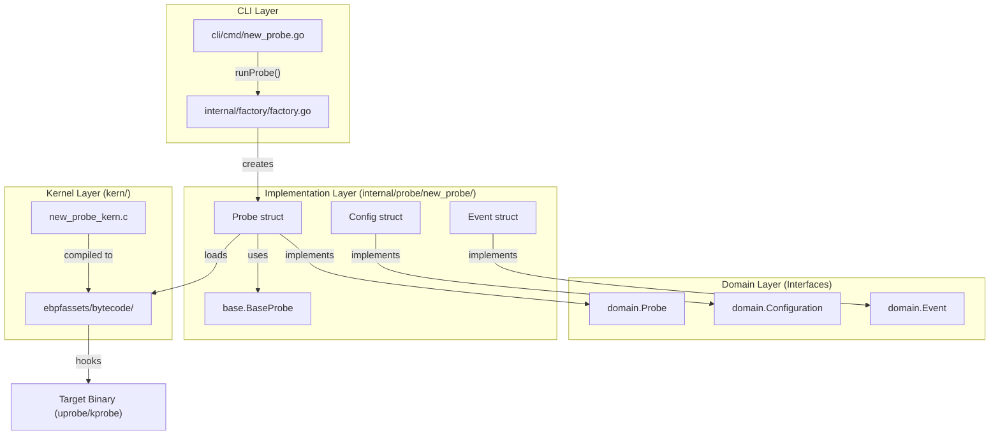
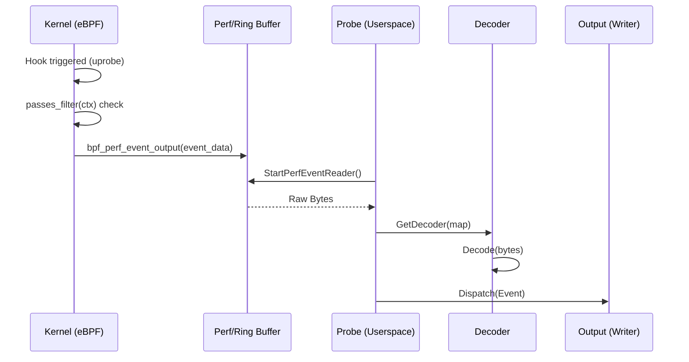

# How to Add a New Probe

Relevant source files

The following files were used as context for generating this wiki page:

- [CHANGELOG.md](https://github.com/gojue/ecapture/blob/943a19fe/CHANGELOG.md)
- [README.md](https://github.com/gojue/ecapture/blob/943a19fe/README.md)
- [cli/cmd/bash.go](https://github.com/gojue/ecapture/blob/943a19fe/cli/cmd/bash.go)
- [cli/cmd/mysqld.go](https://github.com/gojue/ecapture/blob/943a19fe/cli/cmd/mysqld.go)
- [cli/cmd/postgres.go](https://github.com/gojue/ecapture/blob/943a19fe/cli/cmd/postgres.go)
- [internal/config/base_config.go](https://github.com/gojue/ecapture/blob/943a19fe/internal/config/base_config.go)
- [internal/domain/configuration.go](https://github.com/gojue/ecapture/blob/943a19fe/internal/domain/configuration.go)
- [internal/probe/base/base_probe.go](https://github.com/gojue/ecapture/blob/943a19fe/internal/probe/base/base_probe.go)
- [internal/probe/bash/bash_probe.go](https://github.com/gojue/ecapture/blob/943a19fe/internal/probe/bash/bash_probe.go)
- [internal/probe/gotls/gotls_probe.go](https://github.com/gojue/ecapture/blob/943a19fe/internal/probe/gotls/gotls_probe.go)
- [internal/probe/mysql/mysql_probe.go](https://github.com/gojue/ecapture/blob/943a19fe/internal/probe/mysql/mysql_probe.go)
- [internal/probe/openssl/config.go](https://github.com/gojue/ecapture/blob/943a19fe/internal/probe/openssl/config.go)
- [internal/probe/openssl/config_test.go](https://github.com/gojue/ecapture/blob/943a19fe/internal/probe/openssl/config_test.go)
- [internal/probe/openssl/openssl_probe.go](https://github.com/gojue/ecapture/blob/943a19fe/internal/probe/openssl/openssl_probe.go)
- [internal/probe/postgres/postgres_probe.go](https://github.com/gojue/ecapture/blob/943a19fe/internal/probe/postgres/postgres_probe.go)
- [internal/probe/zsh/zsh_probe.go](https://github.com/gojue/ecapture/blob/943a19fe/internal/probe/zsh/zsh_probe.go)
- [kern/bash_kern.c](https://github.com/gojue/ecapture/blob/943a19fe/kern/bash_kern.c)
- [kern/mysqld_kern.c](https://github.com/gojue/ecapture/blob/943a19fe/kern/mysqld_kern.c)
- [kern/nspr_kern.c](https://github.com/gojue/ecapture/blob/943a19fe/kern/nspr_kern.c)
- [main.go](https://github.com/gojue/ecapture/blob/943a19fe/main.go)

This guide provides a step-by-step technical walkthrough for developers looking to extend eCapture by adding a new probe. eCapture utilizes a standardized "Probe Framework" that decouples the eBPF kernel logic from the userspace control plane, allowing for consistent lifecycle management and event processing.

## 1. Overview of the Probe Architecture

Adding a new probe involves implementing several interfaces and registering the new module with the central factory. The data flow starts in the kernel with an eBPF program, travels through a perf/ring buffer, is decoded in userspace, and finally dispatched to the output pipeline.

### Probe Component Relationship

The following diagram illustrates how the different code entities interact during the lifecycle of a probe.

**Entity Interaction Diagram**

Sources: [internal/domain/configuration.go:1-50](https://github.com/gojue/ecapture/blob/943a19fe/internal/domain/configuration.go#L1-L50), [internal/factory/factory.go:1-100](https://github.com/gojue/ecapture/blob/943a19fe/internal/factory/factory.go#L1-L100), [internal/probe/base/base_probe.go:1-50](https://github.com/gojue/ecapture/blob/943a19fe/internal/probe/base/base_probe.go#L1-L50)

---

## 2. Step-by-Step Implementation

### Step 1: Define the Configuration
Create a new directory `internal/probe/<name>/` and implement the `Configuration` interface. Most probes should embed `config.BaseConfig` to inherit common flags like PID and UID filtering.

- **File**: `internal/probe/<name>/config.go`
- **Action**: Implement `Check()`, `GetBPFFileName()`, and `SetPayloadTruncSize()`.

Example (based on Bash): [cli/cmd/bash.go:24-38](https://github.com/gojue/ecapture/blob/943a19fe/cli/cmd/bash.go#L24-L38)

### Step 2: Implement the Probe Logic
The Probe struct must implement the `domain.Probe` interface. It is highly recommended to embed `*base.BaseProbe` to handle the boilerplate of event reading and lifecycle management.

- **File**: `internal/probe/<name>/<name>_probe.go`
- **Key Methods**:
    - `Initialize()`: Setup configuration and logger. [internal/probe/openssl/openssl_probe.go:71-98](https://github.com/gojue/ecapture/blob/943a19fe/internal/probe/openssl/openssl_probe.go#L71-L98)
    - `Start()`: Load bytecode, initialize the `ebpfmanager.Manager`, and start perf readers. [internal/probe/gotls/gotls_probe.go:106-153](https://github.com/gojue/ecapture/blob/943a19fe/internal/probe/gotls/gotls_probe.go#L106-L153)
    - `GetDecoder()`: Map an eBPF map to a specific `domain.Event` decoder. [internal/probe/gotls/gotls_probe.go:214-226](https://github.com/gojue/ecapture/blob/943a19fe/internal/probe/gotls/gotls_probe.go#L214-L226)

### Step 3: Write the eBPF Kernel Program
The C program resides in `kern/`. It defines the maps and the probes (uprobes, kprobes, etc.).

- **File**: `kern/<name>_kern.c`
- **Action**: 
    - Define a `SEC(".maps")` for events. [kern/bash_kern.c:26-31](https://github.com/gojue/ecapture/blob/943a19fe/kern/bash_kern.c#L26-L31)
    - Implement the hook logic. Use `passes_filter(ctx)` to respect userspace PID/UID filters. [kern/bash_kern.c:49-51](https://github.com/gojue/ecapture/blob/943a19fe/kern/bash_kern.c#L49-L51)
    - Output data using `bpf_perf_event_output`. [kern/bash_kern.c:61-61](https://github.com/gojue/ecapture/blob/943a19fe/kern/bash_kern.c#L61-L61)

### Step 4: Define the Event Decoder
Userspace needs to know how to parse the raw bytes from the kernel.

- **File**: `internal/probe/<name>/event.go`
- **Action**: Create a struct that matches the C `struct event` exactly. Implement `Decode()` and `String()` methods. [kern/bash_kern.c:17-24](https://github.com/gojue/ecapture/blob/943a19fe/kern/bash_kern.c#L17-L24) (C side) vs userspace decoding.

### Step 5: Bytecode Embedding
eCapture embeds bytecode into the Go binary using `go-bindata`.
1. Add your C file to the `Makefile` build targets.
2. Run `make` to compile the C code into `.o` files in `ebpfassets/bytecode/`.
3. The `assets` package will automatically include the new files. [internal/probe/gotls/gotls_probe.go:116-119](https://github.com/gojue/ecapture/blob/943a19fe/internal/probe/gotls/gotls_probe.go#L116-L119)

### Step 6: Registration and CLI
1. **Register in Factory**: Add your probe type to `internal/factory/factory.go`.
2. **Add CLI Command**: Create `cli/cmd/<name>.go`. Define a Cobra command that initializes your config and calls `runProbe()`. [cli/cmd/bash.go:27-55](https://github.com/gojue/ecapture/blob/943a19fe/cli/cmd/bash.go#L27-L55)

---

## 3. Comparison: Bash vs. MySQL Probes

Different probes use different hook strategies. Understanding these helps in choosing the right approach for a new probe.

| Feature | Bash Probe | MySQL Probe |
| :--- | :--- | :--- |
| **Hook Type** | `uretprobe` on `readline` | `uprobe` & `uretprobe` on `dispatch_command` |
| **Data Source** | Return value (string pointer) | Function parameters (command + packet) |
| **State Tracking** | Simple event output | Uses `BPF_MAP_TYPE_HASH` to link entry/exit |
| **C Code** | [kern/bash_kern.c:42-64](https://github.com/gojue/ecapture/blob/943a19fe/kern/bash_kern.c#L42-L64) | [kern/mysqld_kern.c:43-91](https://github.com/gojue/ecapture/blob/943a19fe/kern/mysqld_kern.c#L43-L91) |
| **Go Config** | [cli/cmd/bash.go:35-40](https://github.com/gojue/ecapture/blob/943a19fe/cli/cmd/bash.go#L35-L40) | [cli/cmd/mysqld.go:39-46](https://github.com/gojue/ecapture/blob/943a19fe/cli/cmd/mysqld.go#L39-L46) |

---

## 4. Developer Checklist

Before submitting a Pull Request for a new probe, ensure the following are complete:

- [ ] **Kernel Code**: C program in `kern/` uses `ecapture.h` and implements filtering.
- [ ] **Userspace Probe**: Implements `Initialize`, `Start`, `Stop`, and `Close`.
- [ ] **Event Decoding**: Struct alignment matches C struct (watch for padding).
- [ ] **Factory**: Probe registered in `internal/factory/`.
- [ ] **CLI**: New subcommand added in `cli/cmd/` with appropriate flags.
- [ ] **Documentation**: Added to the `README.md` and `docs/` folder.
- [ ] **Tests**: Unit tests for configuration and decoding logic.

**Data Path Visualization**

Sources: [internal/probe/base/base_probe.go:100-150](https://github.com/gojue/ecapture/blob/943a19fe/internal/probe/base/base_probe.go#L100-L150), [internal/probe/gotls/gotls_probe.go:142-150](https://github.com/gojue/ecapture/blob/943a19fe/internal/probe/gotls/gotls_probe.go#L142-L150), [kern/bash_kern.c:49-61](https://github.com/gojue/ecapture/blob/943a19fe/kern/bash_kern.c#L49-L61)