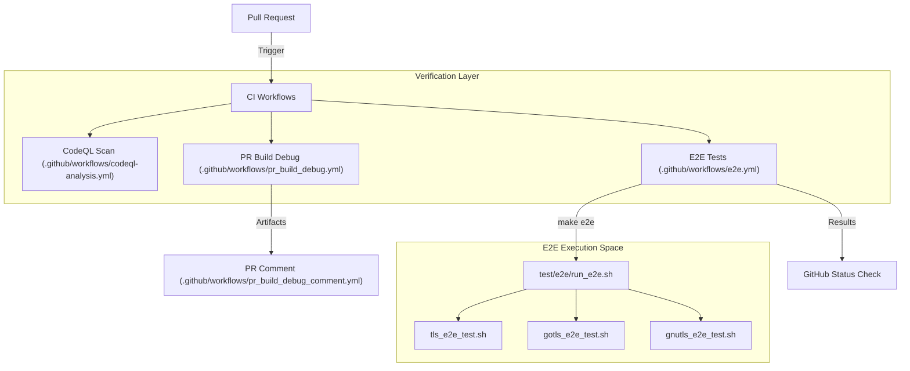
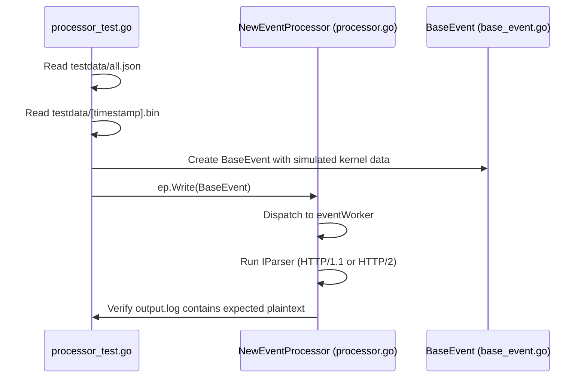

# Testing Strategy and CI/CD

Relevant source files

The following files were used as context for generating this wiki page:

- [.github/workflows/android_e2e.yml](https://github.com/gojue/ecapture/blob/943a19fe/.github/workflows/android_e2e.yml)
- [.github/workflows/codeql-analysis.yml](https://github.com/gojue/ecapture/blob/943a19fe/.github/workflows/codeql-analysis.yml)
- [.github/workflows/e2e.yml](https://github.com/gojue/ecapture/blob/943a19fe/.github/workflows/e2e.yml)
- [.github/workflows/pr_build_debug.yml](https://github.com/gojue/ecapture/blob/943a19fe/.github/workflows/pr_build_debug.yml)
- [.github/workflows/pr_build_debug_comment.yml](https://github.com/gojue/ecapture/blob/943a19fe/.github/workflows/pr_build_debug_comment.yml)
- [docs/e2e-tests.md](https://github.com/gojue/ecapture/blob/943a19fe/docs/e2e-tests.md)
- [pkg/event_processor/base_event.go](https://github.com/gojue/ecapture/blob/943a19fe/pkg/event_processor/base_event.go)
- [pkg/event_processor/processor_test.go](https://github.com/gojue/ecapture/blob/943a19fe/pkg/event_processor/processor_test.go)
- [pkg/event_processor/testdata/all.json](https://github.com/gojue/ecapture/blob/943a19fe/pkg/event_processor/testdata/all.json)
- [test/e2e/android/android_gotls_e2e_test.sh](https://github.com/gojue/ecapture/blob/943a19fe/test/e2e/android/android_gotls_e2e_test.sh)
- [test/e2e/android/common_android.sh](https://github.com/gojue/ecapture/blob/943a19fe/test/e2e/android/common_android.sh)
- [test/e2e/android/setup_android_env.sh](https://github.com/gojue/ecapture/blob/943a19fe/test/e2e/android/setup_android_env.sh)
- [test/e2e/bash_advanced_test.sh](https://github.com/gojue/ecapture/blob/943a19fe/test/e2e/bash_advanced_test.sh)
- [test/e2e/common.sh](https://github.com/gojue/ecapture/blob/943a19fe/test/e2e/common.sh)
- [test/e2e/ecaptureq_e2e_test.sh](https://github.com/gojue/ecapture/blob/943a19fe/test/e2e/ecaptureq_e2e_test.sh)
- [test/e2e/edge_cases_test.sh](https://github.com/gojue/ecapture/blob/943a19fe/test/e2e/edge_cases_test.sh)
- [test/e2e/gnutls_e2e_test.sh](https://github.com/gojue/ecapture/blob/943a19fe/test/e2e/gnutls_e2e_test.sh)
- [test/e2e/go_https_client.go](https://github.com/gojue/ecapture/blob/943a19fe/test/e2e/go_https_client.go)
- [test/e2e/gotls_advanced_test.sh](https://github.com/gojue/ecapture/blob/943a19fe/test/e2e/gotls_advanced_test.sh)
- [test/e2e/gotls_e2e_test.sh](https://github.com/gojue/ecapture/blob/943a19fe/test/e2e/gotls_e2e_test.sh)
- [test/e2e/run_e2e.sh](https://github.com/gojue/ecapture/blob/943a19fe/test/e2e/run_e2e.sh)
- [test/e2e/tls_e2e_test.sh](https://github.com/gojue/ecapture/blob/943a19fe/test/e2e/tls_e2e_test.sh)
- [test/e2e/tls_keylog_advanced_test.sh](https://github.com/gojue/ecapture/blob/943a19fe/test/e2e/tls_keylog_advanced_test.sh)
- [test/e2e/tls_pcap_advanced_test.sh](https://github.com/gojue/ecapture/blob/943a19fe/test/e2e/tls_pcap_advanced_test.sh)
- [test/e2e/tls_text_advanced_test.sh](https://github.com/gojue/ecapture/blob/943a19fe/test/e2e/tls_text_advanced_test.sh)

The eCapture project employs a multi-layered testing strategy to ensure the reliability of eBPF-based capture across diverse Linux kernels and architectures. This strategy spans from local Go unit tests for userspace logic to comprehensive End-to-End (E2E) tests running on real hardware/virtualized kernels, integrated into a robust GitHub Actions CI/CD pipeline.

## 1. Testing Layers

### 1.1 Go Unit Tests
Unit tests focus on the userspace control plane and event processing logic. These tests do not require root privileges or eBPF capabilities as they use mocked data or recorded event streams.

*   **Event Processor**: Validates the scheduling loop, UUID-based affinity, and event reconstruction. The `TestEventProcessor_Serve` function uses JSON-serialized events and binary payloads to simulate kernel-to-userspace data flow [pkg/event_processor/processor_test.go:31-114](https://github.com/gojue/ecapture/blob/943a19fe/pkg/event_processor/processor_test.go#L31-L114).
*   **Protocol Parsers**: Tests the `IParser` implementations (HTTP/1.1, HTTP/2) against known byte streams to ensure correct plaintext extraction [pkg/event_processor/processor_test.go:97-101](https://github.com/gojue/ecapture/blob/943a19fe/pkg/event_processor/processor_test.go#L97-L101).
*   **Truncation Logic**: Ensures that large payloads are correctly handled according to configuration limits [pkg/event_processor/processor_test.go:116-196](https://github.com/gojue/ecapture/blob/943a19fe/pkg/event_processor/processor_test.go#L116-L196).

### 1.2 End-to-End (E2E) Tests
E2E tests are the core of eCapture's validation. They run on real Linux environments and execute actual captures against target applications.

*   **TLS/OpenSSL**: Uses `curl` to generate traffic and verifies that eCapture extracts the expected plaintext (e.g., "GitHub" from an API response) [test/e2e/tls_e2e_test.sh:59-145](https://github.com/gojue/ecapture/blob/943a19fe/test/e2e/tls_e2e_test.sh#L59-L145).
*   **GnuTLS**: Verifies hooks on `libgnutls` by using compatible versions of `wget` or `curl` [test/e2e/gnutls_e2e_test.sh:125-220](https://github.com/gojue/ecapture/blob/943a19fe/test/e2e/gnutls_e2e_test.sh#L125-L220).
*   **GoTLS**: Employs a custom Go HTTPS client to test the `gotls` probe, verifying support for Go's internal ABI [test/e2e/gotls_e2e_test.sh:118-213](https://github.com/gojue/ecapture/blob/943a19fe/test/e2e/gotls_e2e_test.sh#L118-L213).
*   **eCaptureQ**: Tests the WebSocket streaming mechanism by running `ecaptureq_client` alongside the main probe [.github/workflows/e2e.yml:95-101](https://github.com/gojue/ecapture/blob/943a19fe/.github/workflows/e2e.yml#L95-L101).

### 1.3 Security and Quality Scans
*   **CodeQL**: Automated static analysis for Go and C (eBPF) code to detect security vulnerabilities and logic errors [.github/workflows/codeql-analysis.yml:24-35](https://github.com/gojue/ecapture/blob/943a19fe/.github/workflows/codeql-analysis.yml#L24-L35).
*   **Codecov**: Tracks test coverage to identify untested paths in the userspace logic [.github/workflows/codeql-analysis.yml:90-93](https://github.com/gojue/ecapture/blob/943a19fe/.github/workflows/codeql-analysis.yml#L90-L93).

## 2. CI/CD Architecture

The CI/CD system is built on GitHub Actions, automating the build, test, and release cycles for multiple architectures (x86_64 and arm64).

### Build and Test Pipeline Data Flow
This diagram illustrates the flow from a Pull Request to a verified build artifact.

**Diagram: PR Validation and E2E Pipeline**

Sources: [.github/workflows/e2e.yml:1-22](https://github.com/gojue/ecapture/blob/943a19fe/.github/workflows/e2e.yml#L1-L22), [.github/workflows/pr_build_debug.yml:1-22](https://github.com/gojue/ecapture/blob/943a19fe/.github/workflows/pr_build_debug.yml#L1-L22), [.github/workflows/codeql-analysis.yml:12-35](https://github.com/gojue/ecapture/blob/943a19fe/.github/workflows/codeql-analysis.yml#L12-L35)

### Multi-Arch Build Strategy
eCapture uses a matrix strategy to build for both Linux and Android across different CPU architectures.

| Target OS | Architecture | Toolchain | Artifact Type |
| :--- | :--- | :--- | :--- |
| Linux | amd64 | Clang-14 / GCC | Binary / RPM / DEB |
| Linux | arm64 | aarch64-linux-gnu-gcc | Binary / RPM / DEB |
| Android | arm64 | Android NDK | Binary |

Sources: [.github/workflows/pr_build_debug.yml:19-22](https://github.com/gojue/ecapture/blob/943a19fe/.github/workflows/pr_build_debug.yml#L19-L22), [.github/workflows/pr_build_debug.yml:33-60](https://github.com/gojue/ecapture/blob/943a19fe/.github/workflows/pr_build_debug.yml#L33-L60)

## 3. Implementation Details

### 3.1 E2E Test Framework
The E2E tests are orchestrated via Bash scripts that manage the lifecycle of the eCapture process and the target client.

*   **Setup**: Checks for root privileges and kernel version compatibility [test/e2e/common.sh:32-59](https://github.com/gojue/ecapture/blob/943a19fe/test/e2e/common.sh#L32-L59).
*   **Execution**: Launches eCapture in the background, waits for initialization, then triggers the network event [test/e2e/tls_e2e_test.sh:66-83](https://github.com/gojue/ecapture/blob/943a19fe/test/e2e/tls_e2e_test.sh#L66-L83).
*   **Verification**: Uses `grep` to verify plaintext patterns and checks for "Failed to decode event" errors to catch struct alignment regressions [test/e2e/tls_e2e_test.sh:101-110](https://github.com/gojue/ecapture/blob/943a19fe/test/e2e/tls_e2e_test.sh#L101-L110).
*   **Cleanup**: A trap-based `cleanup_handler` ensures that eCapture processes are killed and temporary logs are handled [test/e2e/tls_e2e_test.sh:29-48](https://github.com/gojue/ecapture/blob/943a19fe/test/e2e/tls_e2e_test.sh#L29-L48).

### 3.2 Automated Release Pipeline
When a tag is pushed, the `builder/Makefile.release` is invoked to create production-ready binaries.
1.  **Environment Prep**: Installs `llvm`, `clang`, and `linux-source` [.github/workflows/pr_build_debug.yml:33-47](https://github.com/gojue/ecapture/blob/943a19fe/.github/workflows/pr_build_debug.yml#L33-L47).
2.  **Compilation**: Runs `make release` which compiles both CO-RE and non-CO-RE versions [.github/workflows/pr_build_debug.yml:67-75](https://github.com/gojue/ecapture/blob/943a19fe/.github/workflows/pr_build_debug.yml#L67-L75).
3.  **Packaging**: Bundles binaries into `.tar.gz` and generates checksums.

**Diagram: Event Processor Unit Test Data Flow**

Sources: [pkg/event_processor/processor_test.go:44-77](https://github.com/gojue/ecapture/blob/943a19fe/pkg/event_processor/processor_test.go#L44-L77), [pkg/event_processor/base_event.go:76-87](https://github.com/gojue/ecapture/blob/943a19fe/pkg/event_processor/base_event.go#L76-L87)

## 4. Key Testing Files

| File Path | Purpose |
| :--- | :--- |
| `.github/workflows/e2e.yml` | Main GitHub Actions workflow for E2E testing. |
| `test/e2e/common.sh` | Utility functions for shell-based E2E tests. |
| `pkg/event_processor/processor_test.go` | Unit tests for the userspace event pipeline. |
| `.github/workflows/pr_build_debug.yml` | Cross-platform build verification for PRs. |
| `test/e2e/tls_text_advanced_test.sh` | Advanced scenarios (HTTP/2, PID/UID filtering). |

Sources: [.github/workflows/e2e.yml:1-22](https://github.com/gojue/ecapture/blob/943a19fe/.github/workflows/e2e.yml#L1-L22), [test/e2e/common.sh:1-12](https://github.com/gojue/ecapture/blob/943a19fe/test/e2e/common.sh#L1-L12), [pkg/event_processor/processor_test.go:1-30](https://github.com/gojue/ecapture/blob/943a19fe/pkg/event_processor/processor_test.go#L1-L30), [test/e2e/tls_text_advanced_test.sh:1-15](https://github.com/gojue/ecapture/blob/943a19fe/test/e2e/tls_text_advanced_test.sh#L1-L15)